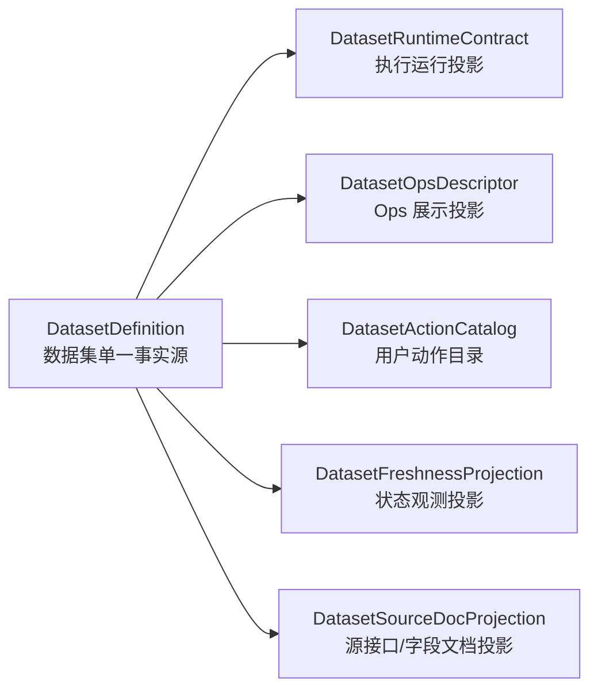

# DatasetDefinition 单一事实源重构方案 v1

- 状态：已部分落地；`src/foundation/datasets/**` 已建立 DatasetDefinition 骨架，长期目录命名和旧投影清理仍需继续收口
- 日期：2026-04-25
- 适用范围：`src/foundation/**`、`src/ops/**`、Ops Web API、任务中心前端、CLI
- 关联方案：[DatasetExecutionPlan 执行计划模型重构方案 v1](/Users/congming/github/goldenshare/docs/architecture/dataset-execution-plan-refactor-plan-v1.md)

---

## 0. 当前落地状态（2026-04-26）

1. `src/foundation/datasets/models.py` 与 `registry.py` 已建立 DatasetDefinition 主模型与查询入口。
2. 当前 registry 仍会投影既有 Sync V2 contract，这是过渡实现事实，不应被理解为长期目录命名已经完成。
3. 新增用户可见的数据集身份、中文名、日期模型、输入能力，应优先收敛到 DatasetDefinition，不再从 `JobSpec` 或前端 formatter 反推。
4. 本文后续章节保留原方案和审计上下文；若与当前代码状态冲突，以本节和代码事实为准。

---

## 1. 一句话结论

后续只能由 `DatasetDefinition` 定义“一个数据集是什么”。中文名、英文标识、数据域、来源 API、日期模型、输入参数、写入目标、观测字段、可维护能力，都必须从 `DatasetDefinition` 派生。

`sync_daily`、`backfill_*`、`sync_history` 不再作为领域概念、API 概念、UI 概念或长期代码主语存在。迁移完成后，它们应从活跃代码中消失。

---

## 2. 已确认决策

| 决策 | 结论 |
|---|---|
| 用户主动作 | 统一叫“维护”，后端 action 使用 `maintain` |
| 旧执行名 | `sync_daily` / `backfill_*` / `sync_history` 最终直接消失 |
| 迁移策略 | 停机式直接重构，不做兼容，不做双读双写 |
| 前端心智 | 只展示维护对象、处理范围、发起方式、状态，不展示底层执行路径 |
| 日期事实源 | 继续遵守 `DatasetSyncContract.date_model` 已建立的日期模型口径，并上移进 `DatasetDefinition` |
| 目录与命名 | 后续目录/文件命名必须与新架构一致，`sync_v2`、`contracts.py` 这类历史命名不作为目标结构保留 |

---

## 3. 当前代码审计结论

### 3.1 现有事实源分散

当前最接近数据集事实源的是 `DatasetSyncContract`：

- 位置：`src/foundation/services/sync_v2/contracts.py`
- 数量：当前 57 个 contract
- 已包含：`dataset_key`、`display_name`、`job_name`、`run_profiles_supported`、`date_model`、`input_schema`、`planning_spec`、`source_spec`、`write_spec`、`observe_spec`

说明：`src/foundation/services/sync_v2/contracts.py` 是现状位置，不是目标位置。后续重构必须同步调整目录名和文件名，避免“模型已经升级，但代码仍叫 sync_v2/contracts”的割裂感。

但它还不是完整的 `DatasetDefinition`，因为以下信息仍分散在 ops 或其他目录：

| 信息 | 当前位置 | 问题 |
|---|---|---|
| 中文名、领域、cadence | `src/ops/specs/registry.py` 的 `DATASET_FRESHNESS_METADATA` | foundation 数据集事实被 ops 反向补全 |
| 可调度/可手动运行能力 | `JobSpec.supports_schedule/supports_manual_run` | 执行路径和用户能力混在一起 |
| 参数展示名与枚举 | `src/ops/specs/registry.py` 的 `ParameterSpec` | 与 `DatasetSyncContract.input_schema` 重叠 |
| 手动维护动作 | `ManualActionQueryService` 从 `JobSpec` 拼装 | action 是由旧执行路径反推出来的 |
| 任务名称 | `JobSpec.display_name`、`DatasetFreshnessSpec.display_name`、前端 formatter | 同一对象多处命名，容易不一致 |
| freshness 投影 | `DatasetFreshnessSpec` | 是有价值投影，但不应是事实源 |
| `/ops/catalog` | `JobSpec` + `WorkflowSpec` 输出 | 暴露系统内部 spec，不是用户级数据集模型 |

### 3.2 现有 JobSpec 膨胀

当前 57 个数据集对应 141 个 `JobSpec`：

| category | 数量 |
|---|---:|
| `sync_history` | 56 |
| `sync_daily` | 39 |
| `backfill_by_trade_date` | 22 |
| 其他 `backfill_*` | 21 |
| `sync_minute_history` | 1 |
| `maintenance` | 2 |

这说明 `JobSpec` 已经不只是“任务规格”，而是在表达“数据集 + 时间模式 + 执行切片方式 + 调度能力 + UI 展示名”。这是维护成本和 UI 心智混乱的主要来源。

### 3.3 日期模型已经走在正确方向

`DatasetSyncContract.date_model` 当前已经是日期语义单一事实源，见：

- [数据集日期模型消费指南 v1](/Users/congming/github/goldenshare/docs/architecture/dataset-date-model-consumer-guide-v1.md)

这部分应保留并上移为 `DatasetDefinition.date_model`，不应再被 ops 侧单独定义或猜测。

---

## 4. 目标模型

### 4.1 核心关系



只有 `DatasetDefinition` 是事实源；其他都是投影或派生模型。

### 4.2 建议代码归属

| 模型 | 建议目录 | 原因 |
|---|---|---|
| `DatasetDefinition` | `src/foundation/datasets/**` | foundation 定义底层数据能力，不依赖 ops |
| `DatasetRuntimeContract` | `src/foundation/ingestion/**` | 执行引擎消费的运行投影，替代历史 `sync_v2` 命名 |
| `DatasetActionCatalog` | `src/ops/queries/**` 或 `src/ops/services/**` | ops 面向用户动作和任务中心 |
| `DatasetFreshnessProjection` | `src/ops/specs` / `src/ops/queries` 收口后迁移 | freshness 是 ops 观测投影 |
| `WorkflowDefinition` | `src/ops/specs/**` | 工作流属于运维编排，不是数据集事实 |

评审关注点：是否接受新增 `src/foundation/datasets/**` 作为数据集定义主目录。我的建议是接受，避免继续把主模型塞在 `sync_v2` 目录里。

### 4.2.1 目标目录与命名原则

现有 `src/foundation/services/sync_v2/**` 命名带有明显阶段性：它表达的是“第二版同步链路”，不是稳定领域模型。新架构应按长期领域职责命名，而不是按版本号或历史命令命名。

建议目标结构：

```text
src/
  foundation/
    datasets/
      models.py              # DatasetDefinition 及其子模型
      registry.py            # definition 查询入口
      definitions/
        market_equity.py
        market_fund.py
        index_series.py
        board_hotspot.py
        moneyflow.py
        reference_master.py
        low_frequency.py
    ingestion/
      runtime_contract.py    # DatasetRuntimeContract 投影
      execution_plan.py      # foundation 可理解的计划结构
      planner.py
      engine.py
      executor.py
      adapters/
      normalizer.py
      writer.py
      observer.py
      strategies/
  ops/
    actions/
      resolver.py            # DatasetActionRequest -> DatasetExecutionPlan
      catalog.py             # 面向用户的 action catalog
    execution/
      dispatcher.py
      schedules.py
      workflows.py
```

命名原则：

1. `datasets` 表达“数据集是什么”，不表达怎么执行。
2. `ingestion` 表达“从外部源取数、归一化、写入”，不再叫 `sync_v2`。
3. `execution_plan` 表达标准计划，不再叫 `job_spec` 或 `backfill spec`。
4. `ops/actions` 表达用户动作和后端解析，不再从旧执行路径反推 action。
5. 版本号如 `v2` 只允许出现在迁移文档或历史归档中，不应出现在长期主目录名中。

### 4.3 `DatasetDefinition` 字段草案

```python
@dataclass(frozen=True, slots=True)
class DatasetDefinition:
    identity: DatasetIdentity
    domain: DatasetDomain
    source: DatasetSourceDefinition
    date_model: DatasetDateModel
    input_model: DatasetInputModel
    storage: DatasetStorageDefinition
    capabilities: DatasetCapabilities
    observability: DatasetObservability
    quality: DatasetQualityPolicy
```

建议字段分组：

| 分组 | 主要字段 | 说明 |
|---|---|---|
| `identity` | `dataset_key`、`display_name`、`description`、`aliases` | 只表达数据集身份 |
| `domain` | `domain_key`、`domain_display_name`、`cadence` | 替代 `DATASET_FRESHNESS_METADATA` |
| `source` | `source_key_default`、`adapter_key`、`api_name`、`source_fields`、`source_doc_id` | 对接源接口事实 |
| `date_model` | 现有 `DatasetDateModel` | 日期语义唯一来源 |
| `input_model` | 时间输入以外的过滤参数、枚举、默认值、校验规则 | 替代 ops 侧重复 `ParameterSpec` |
| `storage` | raw/core/serving 表、DAO 名、冲突键、写入路径 | 替代分散 target table 推断 |
| `capabilities` | 支持的 action、是否可手动、是否可自动、默认计划策略 | 表达“能做什么”，不表达“怎么走旧路径” |
| `observability` | observed field、freshness 规则、审计适用性 | 生成 freshness/status 投影 |
| `quality` | reject policy、必填字段、数据质量门禁 | 生成 validator/linter 规则 |

### 4.4 完整结构示例

以下示例用 `dc_hot`，因为它同时包含交易日时间模型、筛选项、枚举扇出、默认值、写入目标和观测规则。字段名是目标结构草案，用于评审模型颗粒度，不代表最终代码已落地。

```python
DatasetDefinition(
    identity=DatasetIdentity(
        dataset_key="dc_hot",
        display_name="东方财富热榜",
        description="维护东方财富热榜数据，覆盖市场类型、热点类型和日终标记。",
        aliases=("eastmoney_hot_rank",),
    ),
    domain=DatasetDomain(
        domain_key="ranking",
        domain_display_name="榜单",
        cadence="daily",
    ),
    source=DatasetSourceDefinition(
        source_key_default="tushare",
        adapter_key="tushare",
        api_name="dc_hot",
        source_doc_id="tushare.dc_hot",
        source_fields=(
            "trade_date",
            "data_type",
            "ts_code",
            "ts_name",
            "rank",
            "pct_change",
            "current_price",
            "rank_time",
        ),
    ),
    date_model=DatasetDateModel(
        date_axis="trade_open_day",
        bucket_rule="every_open_day",
        window_mode="point_or_range",
        input_shape="trade_date_or_start_end",
        observed_field="trade_date",
        audit_applicable=True,
    ),
    input_model=DatasetInputModel(
        time_fields=("trade_date", "start_date", "end_date"),
        filters=(
            DatasetInputField(
                name="ts_code",
                field_type="string",
                required=False,
                display_name="证券代码",
            ),
            DatasetInputField(
                name="market",
                field_type="enum",
                required=False,
                multi_value=True,
                display_name="市场类型",
                enum_values=("A股市场", "ETF基金", "港股市场", "美股市场"),
                default_values=("A股市场", "ETF基金", "港股市场", "美股市场"),
            ),
            DatasetInputField(
                name="hot_type",
                field_type="enum",
                required=False,
                multi_value=True,
                display_name="热点类型",
                enum_values=("人气榜", "飙升榜"),
                default_values=("人气榜", "飙升榜"),
            ),
            DatasetInputField(
                name="is_new",
                field_type="enum",
                required=False,
                multi_value=False,
                display_name="最新标记",
                enum_values=("Y", "N"),
                default_values=("Y",),
            ),
        ),
    ),
    storage=DatasetStorageDefinition(
        raw_table="raw_tushare.dc_hot",
        core_table="core_serving.dc_hot",
        target_table="core_serving.dc_hot",
        raw_dao_name="raw_dc_hot",
        core_dao_name="dc_hot",
        conflict_columns=(
            "trade_date",
            "query_market",
            "query_hot_type",
            "query_is_new",
            "ts_code",
            "rank_time",
        ),
        write_path="raw_core_upsert",
    ),
    capabilities=DatasetCapabilities(
        actions=(
            DatasetActionCapability(
                action="maintain",
                manual_enabled=True,
                schedule_enabled=True,
                retry_enabled=True,
                supported_time_modes=("point", "range"),
                default_schedule_policy="trading_day_close",
            ),
        ),
    ),
    planning=DatasetPlanningDefinition(
        anchor_policy="trade_date",
        universe_policy="none",
        enum_fanout_fields=("market", "hot_type", "is_new"),
        enum_fanout_defaults={
            "market": ("A股市场", "ETF基金", "港股市场", "美股市场"),
            "hot_type": ("人气榜", "飙升榜"),
            "is_new": ("Y",),
        },
        pagination_policy="none",
        page_limit=2000,
    ),
    normalization=DatasetNormalizationDefinition(
        date_fields=("trade_date",),
        decimal_fields=("pct_change", "current_price", "hot"),
        required_fields=(
            "trade_date",
            "data_type",
            "ts_code",
            "rank_time",
            "query_market",
            "query_hot_type",
            "query_is_new",
        ),
        row_transform="dc_hot_row_transform",
    ),
    observability=DatasetObservability(
        progress_label="dc_hot",
        freshness_observed_field="trade_date",
        result_date_policy="max_observed_trade_date",
        reject_reason_enabled=True,
    ),
    quality=DatasetQualityPolicy(
        reject_policy="structured_reason",
        required_unique_context=(
            "query_market",
            "query_hot_type",
            "query_is_new",
        ),
    ),
)
```

这个示例有两个重点：

1. `market/hot_type/is_new` 的默认扇出属于数据集定义和执行计划，不应该散落在手动任务 service 或旧 backfill 分支里。
2. `DatasetDefinition` 定义事实和能力，但不定义“这次具体执行哪些 unit”；具体 unit 仍由 `DatasetExecutionPlan` 在运行时生成。

---

## 5. 派生模型职责

### 5.1 `DatasetRuntimeContract`

`DatasetRuntimeContract` 是执行引擎消费的投影，替代或重命名当前 `DatasetSyncContract`。

它只回答：

1. 如何校验请求。
2. 如何生成执行单元。
3. 如何调用来源 API。
4. 如何归一化与写入。
5. 如何上报进度和错误。

它不再承担：

1. 用户任务名称。
2. 自动任务展示。
3. Ops 任务筛选名称。
4. 工作流步骤展示。

### 5.2 `DatasetOpsDescriptor`

Ops 展示投影只回答：

1. 维护对象叫什么。
2. 属于哪个领域。
3. 支持什么时间输入。
4. 可展示哪些筛选项。
5. 当前 freshness / lag / 状态如何。

它不能包含旧执行路径名。

### 5.3 `DatasetActionCatalog`

动作目录从 `DatasetDefinition.capabilities.actions` 派生。

目标响应形态：

```json
{
  "actions": [
    {
      "action_key": "daily.maintain",
      "dataset_key": "daily",
      "action": "maintain",
      "display_name": "维护股票日线",
      "resource_display_name": "股票日线",
      "time_form": {
        "control": "trade_date_or_range",
        "allowed_modes": ["point", "range"],
        "selection_rule": "trading_day_only"
      },
      "filters": []
    }
  ]
}
```

禁止继续返回 `route_spec_keys` 作为长期字段。迁移完成后，前端不应知道旧路径存在过。

---

## 6. 对现有模型的处理

| 现有模型 | 处理方式 |
|---|---|
| `DatasetSyncContract` | 拆分/升级为 `DatasetDefinition` + `DatasetRuntimeContract` |
| `DatasetDateModel` | 保留语义，上移为 `DatasetDefinition.date_model` |
| `InputSchema/InputField` | 合入 `DatasetInputModel`，并派生 API/前端参数展示 |
| `PlanningSpec` | 保留为执行计划输入，但从 definition 派生 |
| `SourceSpec/WriteSpec/ObserveSpec` | 合入 definition 的 source/storage/observability |
| `DatasetFreshnessSpec` | 改为从 definition 生成的 ops 投影 |
| `JobSpec` | 不再作为用户/调度主模型；最终删除或降级为临时内部测试夹具 |
| `WorkflowSpec` | 重建为引用 action 的 `WorkflowDefinition`，不再引用旧 job key |
| `/ops/catalog` | 重做为数据集/动作/工作流目录，不再输出旧 spec catalog |

---

## 7. API 影响

### 7.1 新接口方向

推荐新增或替换为：

```text
GET  /api/v1/ops/datasets
GET  /api/v1/ops/datasets/{dataset_key}
GET  /api/v1/ops/dataset-actions
POST /api/v1/ops/datasets/{dataset_key}/actions/maintain/executions
```

### 7.2 废弃方向

停机切换后，下列接口不再以旧语义存在：

| 当前接口 | 处理方式 |
|---|---|
| `GET /api/v1/ops/catalog` | 替换为新目录，或改为输出新模型 |
| `POST /api/v1/ops/executions` 直接提交 `spec_type/spec_key` | 改为提交 `DatasetActionRequest` |
| `GET /api/v1/ops/manual-actions` | 可保留路径，但响应必须由 `DatasetDefinition` 派生，且不含旧路线 |

---

## 8. 数据库影响

由于已确认停机、不兼容，建议直接重塑 ops 运行表语义。

### 8.1 `ops.job_execution`

建议从 `spec_type/spec_key` 切到：

| 新字段 | 说明 |
|---|---|
| `execution_kind` | `dataset_action` / `workflow` / `system_maintenance` |
| `dataset_key` | 单数据集 action 必填 |
| `action` | 当前主值 `maintain` |
| `workflow_key` | workflow 执行时填写 |
| `time_scope_json` | 标准处理范围 |
| `filters_json` | 用户筛选输入 |
| `execution_plan_json` | resolver 生成的 plan 快照 |
| `run_profile` | 从 plan 派生，保留用于筛选 |

`dataset_action` 和 `action=maintain` 不是同一层含义：

| 字段 | 层级 | 含义 | 示例 |
|---|---|---|---|
| `execution_kind=dataset_action` | 执行对象类型 | 这次 execution 作用在某个数据集动作上 | `dataset_key=daily` |
| `action=maintain` | 用户动作/业务意图 | 对该数据集执行“维护”动作 | 维护股票日线 |
| `execution_kind=system_maintenance` | 执行对象类型 | 不属于单一数据集的系统维护动作 | 重建物化视图、重建派生服务表 |

因此为避免和 `maintain/维护` 混淆，不建议继续使用 `execution_kind=maintenance`，应改成 `system_maintenance` 或同等级别的明确命名。

### 8.2 `ops.job_schedule`

建议从 `spec_type/spec_key` 切到：

| 新字段 | 说明 |
|---|---|
| `schedule_target_type` | `dataset_action` / `workflow` |
| `dataset_key` | 自动维护某数据集时填写 |
| `action` | 当前主值 `maintain` |
| `workflow_key` | 工作流调度时填写 |
| `time_policy_json` | 例如最新交易日、固定日期、探测窗口 |
| `filters_json` | 固定过滤条件 |

### 8.3 迁移策略

因为当前未正式上线，建议：

1. 停机前导出当前 ops execution/schedule 快照，作为人工核对备份。
2. 停机窗口内执行 schema migration。
3. 清空或重建 `job_execution/step/unit/event` 历史运行记录。
4. 自动任务按新 `DatasetAction` 模型重新 seed。
5. 不保留旧 `spec_key` 兼容字段。

评审关注点：是否允许清空历史 execution。我的建议是允许，当前阶段历史任务记录价值低于模型干净度。

---

## 9. 里程碑

| 里程碑 | 目标 | 主要产物 | 门禁 |
|---|---|---|---|
| M0 设计冻结 | 冻结术语和边界 | 两份方案评审通过 | 不允许再新增旧三件套引用 |
| M1 Definition v1 | 建立 `DatasetDefinition` 主模型 | definition dataclass、分域 registry、57 个定义迁移 | definition lint、合同数量一致 |
| M2 投影生成 | 从 definition 生成 runtime/freshness/action 投影 | `DatasetRuntimeContract`、Ops descriptor、freshness projection | 无重复元数据表 |
| M3 Ops API 切换 | API 不再输出旧 spec | datasets/actions/executions/schedules 新契约 | Web API 测试 |
| M4 前端切换 | 任务中心只消费新模型 | 手动/记录/详情/自动任务页调整 | 前端单测、smoke、截图 |
| M5 DB 停机迁移 | 重塑 execution/schedule 表 | migration、seed、清理脚本 | 本地重建、远程演练 |
| M6 删除旧模型 | 删除 `JobSpec` 旧三件套和旧 dispatcher 分支 | 引用清零、守护测试 | `rg` 旧名活跃代码为 0 |

---

## 10. 风险与控制

| 风险 | 控制方式 |
|---|---|
| 一次性改动过大 | 按 M0-M6 分轮实施，但每轮不做兼容双轨 |
| 执行路径行为变化 | 每个 dataset 的旧路径到新 plan 建审计矩阵 |
| 自动任务丢失 | 停机前导出 schedule，切换后按新 seed 重建 |
| 前端字段变化导致空显示 | API 契约测试 + 前端类型测试 + smoke |
| definition 再次膨胀 | definition 只定义事实，执行 plan 细节放关联方案 |

---

## 11. 验收标准

最终完成时必须满足：

1. 活跃代码不再出现 `sync_daily`、`sync_history`、`backfill_` 作为执行模型主语。
2. 新增数据集只需要新增一个 `DatasetDefinition`，不能再同时改多张元数据表。
3. 手动任务、自动任务、任务记录、任务详情的名称全部来自同一个 dataset display source。
4. 日期控件和处理范围全部从 `DatasetDefinition.date_model` 派生。
5. 执行器只消费 `DatasetExecutionPlan`，不再按 `JobSpec.category` 分支。
6. `python3 scripts/check_docs_integrity.py`、架构依赖测试、sync_v2 核心测试、ops API 测试、frontend smoke 全部通过。
