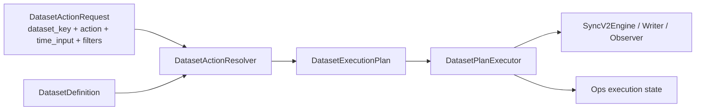

# DatasetExecutionPlan 执行计划模型重构方案 v1

- 状态：待评审
- 日期：2026-04-25
- 适用范围：`src/ops/**`、`src/foundation/datasets/**`、`src/foundation/ingestion/**`、Ops Web API、CLI、任务中心前端
- 前置方案：[DatasetDefinition 单一事实源重构方案 v1](/Users/congming/github/goldenshare/docs/architecture/dataset-definition-single-source-refactor-plan-v1.md)

---

## 1. 一句话结论

用户、前端和 Ops API 只表达“维护哪个数据集、处理什么范围、带哪些筛选”。后端 resolver 根据 `DatasetDefinition` 生成 `DatasetExecutionPlan`，执行器只消费 `DatasetExecutionPlan`。

`sync_daily`、`backfill_*`、`sync_history` 都是旧实现里对 `maintain` 的特例命名，不能继续作为执行模型。

---

## 2. 当前执行链路审计

### 2.1 手动任务链路

```text
POST /ops/manual-actions/{action_key}/executions
  -> ManualActionExecutionResolver
  -> spec_type + spec_key + params_json
  -> OperationsExecutionService.create_execution
  -> ops.job_execution
  -> OperationsDispatcher
  -> JobSpec.category / executor_kind 分支
  -> SyncV2Service 或 HistoryBackfillService
```

问题：

1. Resolver 输出的是旧 `spec_key`，不是标准执行意图。
2. `time_input` 已经接近正确模型，但最终仍被降级成旧路径。
3. 前端虽然隐藏了大部分旧词，但任务底层仍依赖旧路由。

### 2.2 自动任务链路

```text
JobSchedule(spec_type, spec_key, params_json)
  -> enqueue_due_schedules
  -> JobExecution(spec_type, spec_key)
  -> dispatcher
```

问题：

1. 自动任务直接绑定旧 `spec_key`。
2. 自动任务列表因此不得不理解 `JobSpec`。
3. schedule 的目标应该是“某个 dataset 的 maintain action”，不是“某个旧执行路径”。

### 2.3 工作流链路

```text
WorkflowSpec.steps[].job_key
  -> get_job_spec(job_key)
  -> dispatcher 执行每个 job
```

问题：

1. 工作流步骤引用旧 job key。
2. 工作流把“编排顺序”和“底层执行路径”绑定死。
3. 后续删除旧三件套前，工作流必须先切到 action/plan step。

### 2.4 Dispatcher 链路

当前 dispatcher 主要按 `executor_kind` 和 `category` 分发：

| 当前分支 | 问题 |
|---|---|
| `executor_kind=sync_service` | 还要继续判断 `category == sync_daily` |
| `executor_kind=history_backfill_service` | 进入 `HistoryBackfillService`，重复实现范围和扇出 |
| `category=backfill_equity_series` 等 | 以旧名字决定执行行为 |

这正是旧三件套无法消失的核心原因。

---

## 3. 目标执行模型

### 3.1 总流程



### 3.2 请求模型

```python
@dataclass(frozen=True, slots=True)
class DatasetActionRequest:
    dataset_key: str
    action: str
    time_input: DatasetTimeInput
    filters: dict[str, Any]
    trigger_source: str
    requested_by_user_id: int | None = None
    schedule_id: int | None = None
    workflow_key: str | None = None
```

`action` 当前主值是 `maintain`，未来允许扩展：

| action | 用户含义 | 当前是否落地 |
|---|---|---|
| `maintain` | 维护数据集，使其完整、可用、最新 | 本轮主目标 |
| `validate` | 校验数据集质量 | 预留 |
| `repair` | 修复异常数据 | 预留 |
| `rebuild` | 重建派生结果 | 预留 |

### 3.3 时间输入模型

```python
@dataclass(frozen=True, slots=True)
class DatasetTimeInput:
    mode: Literal["none", "point", "range"]
    trade_date: date | None = None
    start_date: date | None = None
    end_date: date | None = None
    month: str | None = None
    start_month: str | None = None
    end_month: str | None = None
    date_field: str | None = None
```

约束：

1. `mode=point` 表示单个时间点，不等于旧 `sync_daily`。
2. `mode=range` 表示时间范围，不等于旧 `backfill_*`。
3. `mode=none` 表示无时间维度，不等于旧 `sync_history`。
4. 具体日期是否交易日、自然日、月份键，由 `DatasetDefinition.date_model` 决定。

### 3.4 执行计划模型

```python
@dataclass(frozen=True, slots=True)
class DatasetExecutionPlan:
    plan_id: str
    dataset_key: str
    action: str
    run_profile: str
    time_scope: ExecutionTimeScope
    filters: dict[str, Any]
    source: PlanSource
    planning: PlanPlanning
    writing: PlanWriting
    observability: PlanObservability
```

建议字段：

| 字段 | 说明 |
|---|---|
| `run_profile` | `point_incremental` / `range_rebuild` / `snapshot_refresh` |
| `time_scope` | 标准化后的点、范围、月份、无时间 |
| `filters` | 业务筛选，如 `ts_code`、`market`、`hot_type` |
| `source` | adapter、api_name、source_key、fields |
| `planning` | anchor、universe、enum fanout、pagination、unit limit |
| `writing` | target table、conflict columns、write path |
| `observability` | progress label、result date、reason code policy |

---

## 4. Resolver 规则

Resolver 只做一件事：把 `DatasetActionRequest + DatasetDefinition` 变成 `DatasetExecutionPlan`。

### 4.1 `time_input` 到 `run_profile`

| `time_input.mode` | `date_model.window_mode` | `run_profile` |
|---|---|---|
| `point` | `point` / `point_or_range` | `point_incremental` |
| `range` | `range` / `point_or_range` | `range_rebuild` |
| `none` | `none` 或无日期维度 | `snapshot_refresh` |

禁止规则：

1. 不允许用旧 key 前缀判断 `run_profile`。
2. 不允许 `spec_key.startswith("sync_history.")` 这种派生逻辑继续存在。
3. 不允许前端决定执行路径。

### 4.2 `date_model` 到 `time_scope`

| `date_model.input_shape` | 输入 | 标准 `time_scope` |
|---|---|---|
| `trade_date_or_start_end` | `trade_date` 或 `start_date/end_date` | 交易日点或交易日范围 |
| `ann_date_or_start_end` | `ann_date` 或 `start_date/end_date` | 自然日公告日期点或范围 |
| `month_or_range` | `month` 或 `start_month/end_month` | 月份键点或范围 |
| `start_end_month_window` | `start_month/end_month` | 自然月窗口范围 |
| `none` | 无 | 无时间维度 |

周/月最后交易日必须继续遵守：

1. 每周最后一个交易日，不是自然周五。
2. 每月最后一个交易日，不是自然月最后一天。

### 4.3 `DatasetDefinition` 到 `planning`

现有 `PlanningSpec` 的能力要迁入计划模型：

| 现有字段 | 新位置 |
|---|---|
| `universe_policy` | `plan.planning.universe_policy` |
| `enum_fanout_fields` | `plan.planning.enum_fanout` |
| `enum_fanout_defaults` | `plan.planning.enum_defaults` |
| `pagination_policy` | `plan.planning.pagination_policy` |
| `chunk_size` | `plan.planning.chunk_size` |
| `max_units_per_execution` | `plan.planning.max_units_per_execution` |

这样 `dc_hot` 的默认 `hot_type/is_new/market`、指数池扇出、板块代码扇出，都成为 definition 派生的 plan 行为，而不是散落在手动任务或 backfill service 中。

---

## 5. Executor 目标

### 5.1 新执行器职责

```python
class DatasetPlanExecutor:
    def execute(self, plan: DatasetExecutionPlan, context: ExecutionContext) -> ExecutionSummary:
        ...
```

它只允许消费：

1. `DatasetExecutionPlan`
2. execution context
3. cancel/progress/retry hooks

它不允许消费：

1. `JobSpec.category`
2. `executor_kind`
3. 旧 key 前缀
4. 前端传来的执行路径

### 5.2 与 SyncV2Engine 的关系

现有 `SyncV2Engine` 有价值，建议保留并收口：

| 当前能力 | 处理方式 |
|---|---|
| validator | 改为校验 `DatasetExecutionPlan` |
| planner | 从 plan 中读取 anchor/fanout/pagination |
| worker_client | 保留 |
| normalizer | 保留 |
| writer | 保留 |
| observer/progress | 保留 |

说明：`SyncV2Engine` 是现有代码名，不是目标长期命名。目录重构后应收口到 `src/foundation/ingestion/engine.py`，对外语义是 ingestion engine，而不是 sync v2。

`HistoryBackfillService` 中的区间循环、证券池循环、月份循环，应逐步并入标准 planner，不再作为独立执行器。

落地要求：

1. 迁移不是简单改名，必须逐数据集建立旧执行规则到新 `DatasetExecutionPlan` 的映射矩阵。
2. 每个旧分支的日期展开、证券池/指数池读取、枚举扇出、分页、默认参数、进度语义、写入策略都必须在新 plan 中有等价表达。
3. `HistoryBackfillService` 删除前必须证明其所有可执行能力已由 planner/executor 覆盖。
4. 不允许出现“先保留一条旧 backfill 分支兜底”的长期兼容方案；若短期需要分步迁移，必须有清晰删除门禁。

### 5.3 旧执行规则到新 plan 的映射门禁

迁移前必须生成一张审计矩阵，至少包含：

| 字段 | 说明 |
|---|---|
| `dataset_key` | 数据集标识 |
| 旧入口 | 当前 `JobSpec` / dispatcher / `HistoryBackfillService` 分支 |
| 时间模型 | `date_model.input_shape/window_mode/bucket_rule` |
| 旧参数 | 当前支持的 `trade_date/start_date/end_date/month/filters` |
| 新 `time_scope` | 新模型中的标准处理范围 |
| 新 `run_profile` | `point_incremental/range_rebuild/snapshot_refresh` |
| 新 `fanout_axes` | 如 `trade_date`、`ts_code`、`freq`、`hot_type` |
| universe 来源 | 如激活指数池、股票池、交易日历、枚举默认值 |
| source params | 最终请求源接口的参数形态 |
| progress context | 进度中展示的维度和中文标签 |
| 验证用例 | 对应单测/集成测试/snapshot |

示例：

| dataset | 旧入口 | 新 plan |
|---|---|---|
| `index_daily` 区间维护 | `backfill_index_series.index_daily` | `run_profile=range_rebuild`，`fanout_axes=["ts_code"]`，`universe_source=ops_index_series_active`，每个激活指数生成一个 unit |
| `dc_hot` 区间维护 | `backfill_by_trade_date.dc_hot` | `run_profile=range_rebuild`，`fanout_axes=["trade_date","market","hot_type","is_new"]`，默认扇出市场/热点类型/最新标记 |
| `broker_recommend` 月份维护 | `backfill_by_month.broker_recommend` | `run_profile=range_rebuild`，`fanout_axes=["month"]`，按月份键生成 unit |
| `stk_mins` 区间维护 | `sync_minute_history.stk_mins` | `run_profile=range_rebuild`，`fanout_axes=["ts_code","freq"]`，时间窗口进入 unit request params |

### 5.3 单点、范围、无时间示例

单点：

```json
{
  "dataset_key": "daily",
  "action": "maintain",
  "run_profile": "point_incremental",
  "time_scope": {"mode": "point", "trade_date": "2026-04-24"},
  "planning": {"anchor_policy": "trade_date", "fanout_axis": "none"}
}
```

范围：

```json
{
  "dataset_key": "daily",
  "action": "maintain",
  "run_profile": "range_rebuild",
  "time_scope": {"mode": "range", "start_date": "2026-04-01", "end_date": "2026-04-24"},
  "planning": {"anchor_policy": "trade_date", "fanout_axis": "trade_date"}
}
```

无时间：

```json
{
  "dataset_key": "stock_basic",
  "action": "maintain",
  "run_profile": "snapshot_refresh",
  "time_scope": {"mode": "none"},
  "planning": {"anchor_policy": "none", "fanout_axis": "none"}
}
```

---

## 6. 进度消息模型

当前进度消息由执行器直接拼英文字符串，例如：

```text
stk_mins: 28460/29160 unit=stock ts_code=920429.BJ security_name=康比特 freq=60min start_date=2026-01-05_09:00:00 end_date=2026-04-24_19:00:00 unit_fetched=365 unit_written=365 fetched=125327067 written=125327067 rejected=0
```

现状生成点：

1. `src/foundation/services/sync_v2/engine.py` 的 `_build_progress_message`
2. `src/ops/services/operations_history_backfill_service.py` 的 `_format_progress_message`

这类字符串不应继续由执行器随手拼，也不应交给前端猜测翻译。目标是：执行层上报结构化进度，Ops 统一格式化为中文展示文案。

### 6.1 目标结构

```python
@dataclass(frozen=True, slots=True)
class ExecutionProgressSnapshot:
    dataset_key: str
    dataset_display_name: str
    current: int
    total: int
    unit_context: dict[str, Any]
    unit_rows: ProgressRows
    total_rows: ProgressRows
    rejected_reason_counts: dict[str, int]
```

```python
@dataclass(frozen=True, slots=True)
class ProgressRows:
    fetched: int
    written: int
    rejected: int
```

`unit_context` 只存结构化 key/value，不存拼好的英文文本。

### 6.2 中文标签来源

中文展示名应该从模型派生：

| 内容 | 来源 |
|---|---|
| 数据集名 | `DatasetDefinition.identity.display_name` |
| 维度标签 | `DatasetDefinition.observability.progress_fields` 或 `DatasetInputField.display_name` |
| 行数标签 | 全局固定词典，如“本单元拉取/本单元写入/累计拉取/累计写入/拒绝” |
| reason code 中文解释 | 统一 reason catalog |

建议在 `DatasetDefinition.observability` 中增加：

```python
DatasetObservability(
    progress_label="股票历史分钟行情",
    progress_fields=(
        ProgressField("unit", "处理单元", value_labels={"stock": "股票"}),
        ProgressField("ts_code", "证券代码"),
        ProgressField("security_name", "证券名称"),
        ProgressField("freq", "分钟频度"),
        ProgressField("start_date", "开始时间"),
        ProgressField("end_date", "结束时间"),
    ),
)
```

### 6.3 中文展示示例

结构化输入：

```json
{
  "dataset_key": "stk_mins",
  "dataset_display_name": "股票历史分钟行情",
  "current": 28460,
  "total": 29160,
  "unit_context": {
    "unit": "stock",
    "ts_code": "920429.BJ",
    "security_name": "康比特",
    "freq": "60min",
    "start_date": "2026-01-05 09:00:00",
    "end_date": "2026-04-24 19:00:00"
  },
  "unit_rows": {"fetched": 365, "written": 365, "rejected": 0},
  "total_rows": {"fetched": 125327067, "written": 125327067, "rejected": 0}
}
```

中文展示：

```text
股票历史分钟行情：28460/29160，处理单元=股票，证券代码=920429.BJ，证券名称=康比特，分钟频度=60min，开始时间=2026-01-05 09:00:00，结束时间=2026-04-24 19:00:00，本单元拉取365条，本单元写入365条，累计拉取125327067条，累计写入125327067条，拒绝0条
```

### 6.4 放在哪里格式化

建议分层：

| 层 | 职责 |
|---|---|
| foundation ingestion | 只上报结构化 `ExecutionProgressSnapshot`，不生成用户展示文案 |
| ops execution | 负责把 snapshot 持久化，并用统一 formatter 生成 `progress_message` |
| ops API | 同时返回结构化 `progress_snapshot` 和中文 `progress_message` |
| frontend | 优先展示中文 `progress_message`，需要更复杂 UI 时消费结构化 snapshot |

这样做的好处：

1. 中文文案不散落在 engine/backfill service 里。
2. 前端不需要解析英文 token。
3. 未来可以把进度展示从一行文字升级成结构化卡片。
4. CLI 如果需要英文或紧凑输出，也可以使用另一个 formatter，而不影响 Web。

### 6.5 落地门禁

完成执行层重构时必须满足：

1. `SyncV2Engine._build_progress_message` 这类拼英文 token 的方法被删除或降级为测试/CLI 专用 formatter。
2. `HistoryBackfillService._format_progress_message` 被删除，不再作为主链进度来源。
3. `JobExecution.progress_message` 存中文展示文本。
4. `JobExecutionEvent.payload_json` 存结构化 `progress_snapshot`。
5. Web API 返回的任务详情和阶段进展不再包含 `fetched=... written=...` 这类英文 token。
6. 进度格式化有单元测试覆盖，至少覆盖 `trade_date`、`ts_code`、`freq`、`enum fanout`、`rejected reason`。

## 7. Workflow 重构方向

旧工作流：

```python
WorkflowStepSpec("daily", "sync_daily.daily", "股票日线")
```

目标工作流：

```python
WorkflowActionStep(
    step_key="daily",
    dataset_key="daily",
    action="maintain",
    time_policy="inherit",
    display_name="股票日线",
)
```

原则：

1. 工作流步骤引用 dataset action，不引用旧 job key。
2. 工作流只表达编排顺序、依赖、失败策略、默认参数。
3. 每个步骤执行前单独经过 resolver 生成 `DatasetExecutionPlan`。

---

## 8. Schedule 重构方向

旧 schedule：

```text
spec_type=job
spec_key=sync_daily.daily
params_json={"trade_date": "..."}
```

目标 schedule：

```json
{
  "schedule_target_type": "dataset_action",
  "dataset_key": "daily",
  "action": "maintain",
  "time_policy": {
    "kind": "latest_open_trade_date"
  },
  "filters": {}
}
```

原则：

1. 自动任务不再选择底层 spec。
2. 自动任务列表和手动任务列表都基于同一套 dataset action。
3. 定时触发时先解析 time policy，再生成 `DatasetActionRequest`，再生成 plan。

---

## 9. 数据库与事件模型

### 8.1 Execution

`JobExecution` 应从旧 spec 模型改为 action/plan 模型。

建议保留：

1. `dataset_key`
2. `run_profile`
3. `run_scope`
4. `trigger_source`
5. `status`
6. rows/progress/error 字段

建议替换：

| 旧字段 | 新字段 |
|---|---|
| `spec_type` | `execution_kind` |
| `spec_key` | `action` / `workflow_key` |
| `params_json` | `time_scope_json` + `filters_json` + `execution_plan_json` |

### 8.2 Step / Unit

Step 建议记录：

1. `step_key`
2. `dataset_key`
3. `action`
4. `display_name`
5. `execution_plan_id`

Unit 建议记录：

1. `unit_id`
2. `anchor`
3. `fanout_values`
4. `request_params`
5. `source_key`
6. `status`
7. rows/reject/error

---

## 10. 停机切换计划

### M0 评审与冻结

目标：

1. 冻结 `DatasetDefinition` 和 `DatasetExecutionPlan` 字段。
2. 冻结“维护/maintain”口径。
3. 冻结“不兼容、不双轨、旧三件套消失”原则。

输出：

1. 两份方案文档评审通过。
2. 旧名引用清单。
3. 数据库迁移草案。

### M1 Definition 与投影

目标：

1. 建立 `DatasetDefinition` registry。
2. 从 definition 派生 runtime contract、ops descriptor、freshness projection。

门禁：

1. 57 个现有 contract 全覆盖。
2. display/domain/date/storage/source 字段不再在 ops 重复定义。

### M2 Resolver 与 Plan dry-run

目标：

1. 新增 `DatasetActionResolver`。
2. 生成 `DatasetExecutionPlan`。
3. 对所有 dataset 建立 plan snapshot 测试。

门禁：

1. point/range/none/month/window 全覆盖。
2. `dc_hot` 这类 enum fanout 默认值覆盖。
3. 周/月最后交易日口径覆盖。

### M3 Executor 收口

目标：

1. 新增 `DatasetPlanExecutor`。
2. dispatcher 改为按 plan 执行。
3. `HistoryBackfillService` 的长期职责并入 planner/executor。
4. 进度上报改为结构化 snapshot + 中文 formatter。

门禁：

1. 单点、范围、无时间执行测试通过。
2. 进度、取消、reject reason、serving light refresh 行为不倒退。
3. 旧执行规则到新 plan 的映射矩阵全部有测试覆盖。
4. Web 任务进度不再出现英文 token。

### M4 Ops API 与前端切换

目标：

1. execution create API 改为 action request。
2. manual actions / schedules / task records / detail 全部消费新字段。
3. `/ops/catalog` 不再输出旧 spec catalog。

门禁：

1. Web API 测试通过。
2. 前端任务中心单测、typecheck、rules、smoke 通过。

### M5 DB 停机迁移

目标：

1. 迁移或重建 ops runtime 表。
2. 重建自动任务 seed。
3. 删除旧 schedule/execution 语义。

门禁：

1. 本地一键重建通过。
2. 远程停机演练脚本通过。
3. 任务可提交、可执行、可查看详情、可取消、可重试。

### M6 删除旧三件套

目标：

1. 删除 `JobSpec` 旧执行注册。
2. 删除 dispatcher 中旧 category 分支。
3. 删除 tests 中对旧 key 的断言。
4. 删除文档中“当前口径”的旧三件套说明。

门禁：

```bash
rg "sync_daily|sync_history|sync_minute_history|backfill_(equity_series|index_series|fund_series|trade_cal|by_trade_date|by_date_range|by_month|low_frequency)" src/ops src/foundation src/app tests frontend
```

结果要求：

1. 活跃代码中为 0。
2. 若历史归档文档仍保留，文首必须标明历史归档，不能作为当前口径。

---

## 11. 关键风险

| 风险 | 控制方式 |
|---|---|
| range 行为与旧 backfill 不一致 | 每个 dataset 做旧路径到新 plan 的审计矩阵 |
| 周/月锚点误用自然日期 | plan snapshot 测试固定交易日历样例 |
| 自动任务失效 | M5 重建 seed，不迁就旧 schedule |
| 工作流步骤断裂 | 先将 WorkflowStep 改为 action step，再删旧 job key |
| 进度条倒退 | executor 必须保留 step/unit/progress event 语义 |
| reject reason 丢失 | `PlanObservability` 必须承接现有 reason capture |
| 同步规则映射偏差 | 逐数据集建立旧规则到新 plan 的审计矩阵和 snapshot 测试 |
| 进度文案继续英文拼接 | 执行层只上报结构化 snapshot，ops formatter 统一中文化 |

---

## 12. 验收标准

完成后应满足：

1. 任何新 execution 都由 `DatasetActionRequest` 创建。
2. 任何执行器入口都只消费 `DatasetExecutionPlan`。
3. 任何 schedule 都绑定 dataset action 或 workflow，不绑定旧 spec。
4. 任何 workflow step 都引用 dataset action，不引用旧 job key。
5. 任务记录和详情不再依赖 `formatSpecDisplayLabel` 处理旧路径。
6. 活跃代码中旧三件套引用清零。
7. 进度展示中文化，API 保留结构化 progress snapshot。
8. `pytest`、sync_v2 lint、ops API、frontend smoke 全部通过。
