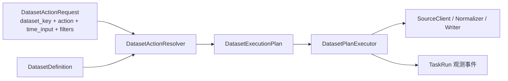
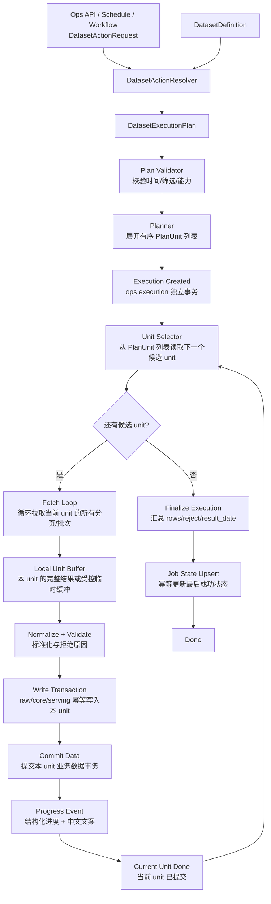
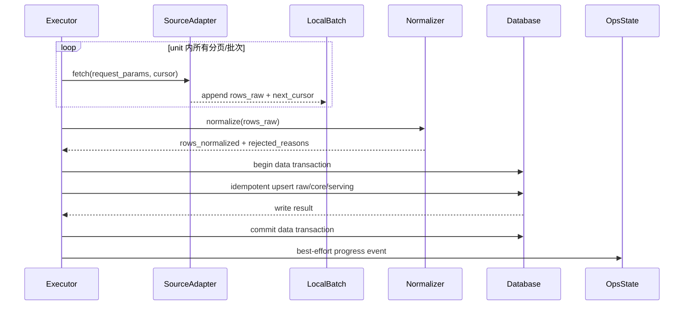

# DatasetExecutionPlan 执行计划模型重构方案 v1

- 状态：已落地到现行主链；resolver / executor / TaskRun dataset_action 已切到 `DatasetDefinition -> DatasetExecutionPlan -> IngestionExecutor`
- 日期：2026-04-25
- 适用范围：`src/ops/**`、`src/foundation/datasets/**`、`src/foundation/ingestion/**`、Ops Web API、CLI、任务中心前端
- 前置方案：[DatasetDefinition 单一事实源重构方案 v1](/Users/congming/github/goldenshare/docs/architecture/dataset-definition-single-source-refactor-plan-v1.md)

---

## 0. 当前落地状态（2026-04-26）

1. `src/foundation/ingestion/execution_plan.py` 已建立 `DatasetActionRequest` 与 `DatasetExecutionPlan`。
2. `src/foundation/ingestion/resolver.py` 现在只读取 `DatasetDefinition`，不再读取旧 contract / strategy 生成 unit。
3. `src/foundation/ingestion/executor.py` 已作为唯一执行器接管 source / normalize / write / progress 主链。
4. TaskRun dispatcher 已在 dataset_action 主链中消费 `DatasetMaintainService -> IngestionExecutor`。
5. 自动任务、工作流和更深层事务策略仍存在后续收口空间；本文中历史任务观测链路示意属于重构前审计上下文，不代表当前 API 主链。

---

## 1. 一句话结论

用户、前端和 Ops API 只表达“维护哪个数据集、处理什么范围、带哪些筛选”。后端 resolver 根据 `DatasetDefinition` 生成 `DatasetExecutionPlan`，执行器只消费 `DatasetExecutionPlan`。

旧执行路由都是旧实现里对 `maintain` 的特例命名，不能继续作为执行模型。

---

## 2. 历史执行链路审计（已退场）

本节保留旧链路作为事故复盘与验收对照，不代表当前实现。当前手动任务、dataset action、工作流 dataset step 已切到 `TaskRun -> DatasetActionRequest -> DatasetExecutionPlan -> IngestionExecutor`。

### 2.1 手动任务链路

```text
POST /ops/manual-actions/{action_key}/executions
  -> ManualActionExecutionResolver
  -> spec_type + spec_key + params_json
  -> OperationsExecutionService.create_execution
  -> 旧任务观测表
  -> OperationsDispatcher
  -> 旧任务规格 category / executor_kind 分支
  -> 历史同步执行器或历史区间执行器
```

问题：

1. Resolver 输出的是旧 `spec_key`，不是标准执行意图。
2. `time_input` 已经接近正确模型，但最终仍被降级成旧路径。
3. 前端虽然隐藏了大部分旧词，但任务底层仍依赖旧路由。

### 2.2 自动任务链路

```text
旧自动任务配置(spec_type, spec_key, params_json)
  -> enqueue_due_schedules
  -> 旧任务观测记录(spec_type, spec_key)
  -> dispatcher
```

问题：

1. 自动任务直接绑定旧 `spec_key`。
2. 自动任务列表因此不得不理解旧任务规格。
3. schedule 的目标应该是“某个 dataset 的 maintain action”，不是“某个旧执行路径”。

### 2.3 工作流链路

```text
旧工作流规格 steps[].旧任务 key
  -> 按旧任务 key 查旧任务规格
  -> dispatcher 执行每个 job
```

问题：

1. 工作流步骤引用旧 job key。
2. 工作流把“编排顺序”和“底层执行路径”绑定死。
3. 后续删除旧执行路由前，工作流必须先切到 action/plan step。

### 2.4 Dispatcher 旧链路

历史 dispatcher 主要按 `executor_kind` 和 `category` 分发：

| 当前分支 | 问题 |
|---|---|
| `executor_kind=sync_service` | 还要继续判断旧任务 category |
| 旧独立区间执行器 | 重复实现范围和扇出 |
| 旧 category 分支 | 以旧名字决定执行行为 |

这正是旧执行路由无法消失的核心原因。

### 2.5 历史提交链路事故暴露的问题

历史 `BaseSyncService._run()` 的关键行为是：

```text
start_log
  -> execute()
       -> engine fetch / normalize / writer.write
  -> finish_log
  -> mark_success
  -> mark final state
  -> session.commit()
```

这意味着业务数据写入、run log、job state 在同一个 session/commit 边界内。大任务最后一个状态写入失败时，可能把前面已经拉取和写入的大量数据一起回滚。

已发生事故根因：

1. `stk_mins` full run 拉取和写入 1.2 亿行。
2. 结束时连续调用两个状态写入方法。
3. 如果旧同步状态表原本没有目标任务行，两个方法会在同一事务里各自创建 pending ORM 对象。
4. 最终 commit 时同一个 `job_name` 插入两次，触发唯一键冲突。
5. 因为业务数据和状态写入处在同一事务，最后的状态错误导致数据写入成果被回滚。

这个问题不能只作为局部 bug 修复。新执行模型必须明确：

1. 数据写入事务不得被 ops 状态写入失败拖垮。
2. 大数据集必须按业务 unit 分段提交。
3. 状态表写入必须幂等 upsert，且失败可重试、可对账。
4. 本轮只收口 unit 级提交与幂等写入，不引入额外状态模型。

### 2.6 历史事务风险必须整体纳入

本方案必须吸收历史长事务事故中确认过的问题清单，不能只修 `stk_mins`。旧路径实施清单已经下线；后续实现必须基于当前 TaskRun + DatasetExecutionPlan 主链评审。

审计结论对应到新执行模型：

| 风险来源 | 审计结论 | 本方案处理 |
|---|---|---|
| 历史同步服务主流程 | 所有旧数据集共享任务级最终提交，是 P0 根因 | 删除任务级大事务默认假设，引入 `PlanTransactionPolicy` |
| 历史执行引擎 | unit 循环写入但由上层最终提交 | 引入 unit 级 data transaction 提交 |
| 历史写入器 | writer 只写不提交，所有 write_path 被动落入外层大事务 | 保持 writer 不提交，但提交边界由 executor/transaction policy 控制 |
| `BaseDAO.bulk_*` | batch 只是 SQL 分批，不是事务分段 | 明确禁止把 batch size 当提交边界 |
| Worker pagination | 单 unit 内分页会累积 rows | 作为单元内部内存优化处理，不作为事务提交粒度 |
| 历史任务进度上下文 | 进度独立提交，数据未提交也显示 written | Web 只把已提交行数展示为入库结果 |
| Dispatcher | 大任务进入单次 service run | dispatcher 改为执行 plan，不再绕过 transaction policy |
| 历史独立区间执行器 | 外层分段较好，但单段仍依赖旧大事务 | 并入标准 planner/executor，逐数据集映射 |
| Worker 生命周期 | claim/finalize 是小事务 | 保留，但补充 partial committed / state failed 语义 |
| RawTushareBootstrapService | 迁移脚本按表大事务 | 标为迁移风险，不进入日常主链；大表迁移需单独 guard |
| `__ALL__` 哨兵值 | 可能从 contract/param policy/adapter/row transform 进入请求和落库字段，造成主键碰撞和脏数据 | 列为 P0，清理 `dc_hot/ths_hot/kpl_list/limit_list_ths`，全选只能展开真实枚举 |

### 2.7 高风险数据集分层

以下分层只用于标记审计优先级，不定义执行门槛。

P0：已发生事故或具备明显大事务风险：

| 数据集 | 风险原因 | 本方案要求 |
|---|---|---|
| `stk_mins` | 全市场分钟线，数据量巨大，事故已发生 | 必须评估单个事务的写入量，做真实计算 |
| `stk_factor_pro` | 宽表，全市场日频，分页量大 | 必须评估单个事务的写入量，做真实计算 |
| `dc_member` | 单日大量成分数据，分页量大 | 必须评估单个事务的写入量，做真实计算 |
| `index_daily` | 激活指数池按代码扇出，区间任务量可能较大 | 必须评估单个事务的写入量，做真实计算 |
| `index_weight` | 指数区间/月度窗口，单指数区间可能较长 | 必须评估单个事务的写入量，做真实计算 |

P1：纳入 unit 级提交治理，排在 P0 后：

| 数据集 | 风险原因 | 本方案要求 |
|---|---|---|
| `dc_daily` / `ths_daily` | 板块日频，按日期分页 | P1 unit 级提交 |
| `dc_hot` / `ths_hot` | 枚举扇出 + 日期 + 分页 | P1 unit 级提交，枚举默认值测试 |
| `cyq_perf` | 日频全市场分页 | P1 unit 级提交 |
| `moneyflow_*` 全族 | 日频分页，部分有 std/serving 发布 | P1 unit 级提交 + 多层写入一致性测试 |
| `stock_basic` | 多源 raw/std/serving 发布 | P1 snapshot 多层写入事务语义 |
| `biying_equity_daily` / `biying_moneyflow` | 股票池与窗口扇出 | P1 unit 级提交 |

P2：风险可控但统一语义：

| 数据集 | 风险原因 | 本方案要求 |
|---|---|---|
| `daily` / `adj_factor` / `fund_daily` / `fund_adj` | 常按单交易日执行，规模中等 | 默认可后置，但必须声明事务策略 |
| `broker_recommend` | 月维度，小范围 | 统一事务/进度语义 |
| master/snapshot 类 | 规模通常可控 | 可保留 task policy，但必须显式声明 |

---

## 3. 目标执行模型

### 3.1 总流程



### 3.2 请求模型

```python
@dataclass(frozen=True, slots=True)
class DatasetActionRequest:
    dataset_key: str
    action: str
    time_input: DatasetTimeInput
    filters: dict[str, Any]
    trigger_source: str
    requested_by_user_id: int | None = None
    schedule_id: int | None = None
    workflow_key: str | None = None
```

`action` 当前主值是 `maintain`，未来允许扩展：

| action | 用户含义 | 当前是否落地 |
|---|---|---|
| `maintain` | 维护数据集，使其完整、可用、最新 | 本轮主目标 |
| `validate` | 校验数据集质量 | 预留 |
| `repair` | 修复异常数据 | 预留 |
| `rebuild` | 重建派生结果 | 预留 |

### 3.3 时间输入模型

```python
@dataclass(frozen=True, slots=True)
class DatasetTimeInput:
    mode: Literal["none", "point", "range"]
    trade_date: date | None = None
    start_date: date | None = None
    end_date: date | None = None
    month: str | None = None
    start_month: str | None = None
    end_month: str | None = None
    date_field: str | None = None
```

约束：

1. `mode=point` 表示单个时间点，不等于任何旧单日执行路由。
2. `mode=range` 表示时间范围，不等于任何旧区间执行路由。
3. `mode=none` 表示无时间维度，不等于任何旧全量执行路由。
4. 具体日期是否交易日、自然日、月份键，由 `DatasetDefinition.date_model` 决定。

### 3.4 执行计划模型

```python
@dataclass(frozen=True, slots=True)
class DatasetExecutionPlan:
    plan_id: str
    dataset_key: str
    action: str
    run_profile: str
    time_scope: ExecutionTimeScope
    filters: dict[str, Any]
    source: PlanSource
    planning: PlanPlanning
    writing: PlanWriting
    transaction: PlanTransactionPolicy
    observability: PlanObservability
```

建议字段：

| 字段 | 说明 |
|---|---|
| `run_profile` | `point_incremental` / `range_rebuild` / `snapshot_refresh` |
| `time_scope` | 标准化后的点、范围、月份、无时间 |
| `filters` | 业务筛选，如 `ts_code`、`market`、`hot_type` |
| `source` | adapter、api_name、source_key、fields |
| `planning` | anchor、universe、enum fanout、pagination、unit limit |
| `writing` | target table、conflict columns、write path |
| `transaction` | 数据提交边界、状态提交边界、失败隔离策略 |
| `observability` | progress label、result date、reason code policy |

---

## 4. Resolver 规则

Resolver 只做一件事：把 `DatasetActionRequest + DatasetDefinition` 变成 `DatasetExecutionPlan`。

### 4.1 `time_input` 到 `run_profile`

| `time_input.mode` | `date_model.window_mode` | `run_profile` |
|---|---|---|
| `point` | `point` / `point_or_range` | `point_incremental` |
| `range` | `range` / `point_or_range` | `range_rebuild` |
| `none` | `none` 或无日期维度 | `snapshot_refresh` |

禁止规则：

1. 不允许用旧 key 前缀判断 `run_profile`。
2. 不允许通过旧 key 前缀派生执行逻辑。
3. 不允许前端决定执行路径。

### 4.2 `date_model` 到 `time_scope`

| `date_model.input_shape` | 输入 | 标准 `time_scope` |
|---|---|---|
| `trade_date_or_start_end` | `trade_date` 或 `start_date/end_date` | 交易日点或交易日范围 |
| `ann_date_or_start_end` | `ann_date` 或 `start_date/end_date` | 自然日公告日期点或范围 |
| `month_or_range` | `month` 或 `start_month/end_month` | 月份键点或范围 |
| `start_end_month_window` | `start_month/end_month` | 自然月窗口范围 |
| `none` | 无 | 无时间维度 |

周/月最后交易日必须继续遵守：

1. 每周最后一个交易日，不是自然周五。
2. 每月最后一个交易日，不是自然月最后一天。

### 4.3 `DatasetDefinition` 到 `planning`

现有 `PlanningSpec` 的能力要迁入计划模型：

| 现有字段 | 新位置 | 说明 |
|---|---|---|
| `universe_policy` | `plan.planning.universe_policy` | 定义 unit 是否需要从股票池、指数池、交易日历等业务集合展开。例如 `index_daily` 从激活指数池展开 `ts_code`。 |
| `enum_fanout_fields` | `plan.planning.enum_fanout` | 定义哪些枚举字段会参与扇出。每组枚举组合都会生成独立 unit，例如 `dc_hot` 的 `market + hot_type + is_new`。 |
| `enum_fanout_defaults` | `plan.planning.enum_defaults` | 当用户未显式传某个枚举字段时，planner 使用的默认枚举集合。它不是 UI 默认值，而是执行计划默认展开规则；例如 `dc_hot` 默认展开全部市场、热点类型和最新标记。 |
| `pagination_policy` | `plan.planning.pagination_policy` | 定义源接口内部如何分页拉取。分页只影响单 unit 内部取数方式，不作为事务提交粒度。 |
| `chunk_size` | `plan.planning.chunk_size` | 定义规划或写入过程的内部分块规模，用于控制内存和批量 SQL 大小，不等于事务边界。 |

这样 `dc_hot` 的默认 `hot_type/is_new/market`、指数池扇出、板块代码扇出，都成为 definition 派生的 plan 行为，而不是散落在手动任务或旧区间执行服务中。

---

## 5. Executor 目标

### 5.1 新执行器职责

```python
class DatasetPlanExecutor:
    def execute(self, plan: DatasetExecutionPlan, context: ExecutionContext) -> ExecutionSummary:
        ...
```

它只允许消费：

1. `DatasetExecutionPlan`
2. execution context
3. cancel/progress/retry hooks

它不允许消费：

1. 旧任务规格 category
2. `executor_kind`
3. 旧 key 前缀
4. 前端传来的执行路径

### 5.2 与旧引擎能力的关系

旧执行器中的“取数、归一化、写入、观测”能力已经迁入 `src/foundation/ingestion/**`，不得再以历史命名或旧契约形态存在：

| 当前能力 | 处理方式 | 保留原因 |
|---|---|---|
| validator | `src/foundation/ingestion/validator.py` | 校验 `DatasetActionRequest` 与 `DatasetDefinition`，不读取旧 contract。 |
| planner | `src/foundation/ingestion/unit_planner.py` | 根据 Definition 的 date/planning/source/storage 事实生成业务 unit。 |
| source client | `src/foundation/ingestion/source_client.py` | 封装源接口调用、分页取数和源端错误映射。 |
| normalizer | `src/foundation/ingestion/normalizer.py` | 负责字段标准化、类型清洗、reject reason 统计。 |
| writer | `src/foundation/ingestion/writer.py` | 负责幂等写入、write path、DAO 路由和 reject 汇总；不直接提交事务。 |
| observer/progress | `src/foundation/ingestion/progress.py` + `src/ops/services/task_run_ingestion_context.py` | 执行层上报结构化进度，Ops 负责 TaskRun 观测落库。 |

说明：历史执行引擎不再是当前代码名，也不是迁移兜底。

旧独立区间执行器中的区间循环、证券池循环、月份循环，必须并入标准 planner/executor。重构完成时，旧独立区间执行器不能继续存在。

落地要求：

1. 迁移不是简单改名，必须逐数据集建立旧执行规则到新 `DatasetExecutionPlan` 的映射矩阵。
2. 每个旧分支的日期展开、证券池/指数池读取、枚举扇出、分页、默认参数、进度语义、写入策略都必须在新 plan 中有等价表达。
3. 旧独立区间执行器是迁移对象，不是目标架构组件。
4. 任务最终完成门禁：旧独立区间执行器实现必须删除，活跃执行路径不得再 import、实例化或调用它。
5. 删除前必须证明其所有可执行能力已由 planner/executor 覆盖。
6. 不允许出现“先保留一条旧区间执行分支兜底”的兼容方案；迁移期间如果短暂保留，只能作为待删除 legacy，且不得承接新功能。
7. 验收必须执行引用审计，旧独立区间执行器相关 class、文件名、dispatcher kind 在 `src tests frontend` 中不得存在活跃主链引用。

### 5.3 旧执行规则到新 plan 的映射门禁

迁移前必须生成一张审计矩阵，至少包含：

| 字段 | 说明 |
|---|---|
| `dataset_key` | 数据集标识 |
| 旧入口 | 历史任务规格 / dispatcher / 历史独立区间执行器分支 |
| 时间模型 | `date_model.input_shape/window_mode/bucket_rule` |
| 旧参数 | 当前支持的 `trade_date/start_date/end_date/month/filters` |
| 新 `time_scope` | 新模型中的标准处理范围 |
| 新 `run_profile` | `point_incremental/range_rebuild/snapshot_refresh` |
| 新 `fanout_axes` | 如 `trade_date`、`ts_code`、`freq`、`hot_type` |
| universe 来源 | 如激活指数池、股票池、交易日历、枚举默认值 |
| source params | 最终请求源接口的参数形态 |
| progress context | 进度中展示的维度和中文标签 |
| 验证用例 | 对应单测/集成测试/snapshot |

示例：

| dataset | 旧入口 | 新 plan |
|---|---|---|
| `index_daily` 区间维护 | 指数区间旧入口 | `run_profile=range_rebuild`，`fanout_axes=["ts_code"]`，`universe_source=ops_index_series_active`，每个激活指数生成一个 unit |
| `dc_hot` 区间维护 | 交易日区间旧入口 | `run_profile=range_rebuild`，`fanout_axes=["trade_date","market","hot_type","is_new"]`，默认扇出市场/热点类型/最新标记 |
| `broker_recommend` 月份维护 | 月份区间旧入口 | `run_profile=range_rebuild`，`fanout_axes=["month"]`，按 `YYYYMM` 月份键生成 unit；`month` 不是月初/月中/月尾日期，而是自然月桶标识，来源于 `DatasetDateModel(date_axis="month_key", bucket_rule="every_natural_month")` |
| `stk_mins` 区间维护 | 分钟行情旧入口 | `run_profile=range_rebuild`，`fanout_axes=["ts_code","freq"]`，时间窗口进入 unit request params，`commit_policy=per_unit` |

### 5.4 单点、范围、无时间示例

单点：

```json
{
  "dataset_key": "daily",
  "action": "maintain",
  "run_profile": "point_incremental",
  "time_scope": {"mode": "point", "trade_date": "2026-04-24"},
  "planning": {"anchor_policy": "trade_date", "fanout_axis": "none"}
}
```

范围：

```json
{
  "dataset_key": "daily",
  "action": "maintain",
  "run_profile": "range_rebuild",
  "time_scope": {"mode": "range", "start_date": "2026-04-01", "end_date": "2026-04-24"},
  "planning": {"anchor_policy": "trade_date", "fanout_axis": "trade_date"}
}
```

无时间：

```json
{
  "dataset_key": "stock_basic",
  "action": "maintain",
  "run_profile": "snapshot_refresh",
  "time_scope": {"mode": "none"},
  "planning": {"anchor_policy": "none", "fanout_axis": "none"}
}
```

---

## 6. 可靠执行与提交模型

数据模型只是入口。真正的执行模型必须覆盖数据从源接口进入本地进程、归一化、写入数据库、提交、更新任务状态的完整链路。

### 6.1 目标原则

1. **数据提交优先独立**：已经成功写入并提交的数据，不得因为后续 ops 状态写入失败而回滚。
2. **小事务多提交**：大数据集按业务 `unit` 提交，不允许 12 小时任务只有最后一个 commit。
3. **状态写入幂等**：run log、job state、execution progress 必须使用 upsert/幂等更新。
4. **失败可定位**：失败必须能定位到 dataset、plan、unit、source params、write batch。
5. **不做额外状态模型**：本轮只处理 unit 级提交、幂等写入和状态写入解耦。

### 6.2 总体执行流程



说明：

1. `Unit Selector` 只按 planner 生成的有序 `PlanUnit` 列表取下一个候选 unit。
2. 每次 execution 都按本次 plan 的 unit 列表执行。
3. `Fetch Loop` 是当前 unit 内部的源接口分页/批次循环，必须把当前 unit 需要的数据拉取完整后，才允许进入本 unit 的写入与提交。
4. 源接口分页不是事务提交粒度，不允许“拉一页就提交一次”。
5. 当前 unit 的业务数据事务提交成功后，才进入下一个 unit。

### 6.3 单个 unit 的详细流程



关键点：

1. `fetch` 在 unit 内循环，直到该 unit 的分页/批次全部完成。
2. 本地缓冲只允许保存当前 unit 的数据，可以是内存批次，也可以是大数据集的临时 spool 文件/临时表。
3. `Normalize` 只处理当前 unit，不积累全任务数据。
4. `Write Transaction` 只覆盖当前 unit 的业务表写入。
5. `OpsState` 更新失败不得回滚 `DB commit data transaction`。
6. 本轮不新增独立的 unit 状态模型；执行器只按 plan 顺序处理 unit。

### 6.4 事务边界

必须拆成三个事务域：

| 事务域 | 内容 | 失败影响 |
|---|---|---|
| data transaction | raw/core/serving 业务数据写入 | 只回滚当前 unit |
| ops state transaction | execution progress、event、运行审计、资源状态 | 不回滚数据；失败只影响展示/状态，可重试 |

禁止：

```text
业务数据写入 + 运行审计 + 资源状态共用一个最终 commit
```

允许：

```text
每个 unit 成功写入后立即提交业务数据；
再 best-effort 更新 ops progress。
```

不可配置的不变量：

1. ops state transaction 失败永远不得回滚已经提交的业务数据。
2. data transaction 失败只允许回滚当前 unit。
3. 任何计划模型不得提供“状态失败是否回滚业务数据”的开关。
4. 任何计划模型不得在未评审情况下引入额外执行状态模型。

### 6.5 plan 中的事务策略

```python
PlanTransactionPolicy(
    data_commit_policy="per_unit",
    ops_state_policy="best_effort_after_data_commit",
)
```

建议枚举：

| 字段 | 可选值 | 说明 |
|---|---|---|
| `data_commit_policy` | `per_unit` / `per_execution` | 大数据集必须 `per_unit`；小数据集或快照类可声明 `per_execution` |
| `ops_state_policy` | `best_effort_after_data_commit` / `required_before_next_unit` | 默认 best effort |

说明：`PlanTransactionPolicy` 只配置业务数据提交边界和状态写入时机，不配置“状态失败是否回滚数据”。状态失败不回滚数据是系统不变量，不是可选策略。

首轮落地策略必须保守：

1. M1/M2 只支持 `per_execution` 与 `per_unit`，不引入分页级提交策略。
2. `per_execution` 只允许小数据集或明确声明的快照类数据集使用，禁止用于 P0 大数据集。
3. 每个会写入数据的执行计划都必须给出单事务写入量评估。
4. 遵循 6.5.1 的单事务写入量约束。

### 6.5.1 单事务写入量约束

开发时必须评估单个事务的写入量，做真实的计算。

### 6.6 幂等写入键

每个 unit 必须有稳定幂等键。示例：

| 数据集 | 幂等键 |
|---|---|
| `daily` | `dataset_key + trade_date + ts_code?` |
| `index_daily` | `dataset_key + ts_code + start_date + end_date` |
| `dc_hot` | `dataset_key + trade_date + market + hot_type + is_new` |
| `stk_mins` | `dataset_key + ts_code + freq + start_time + end_time` |

幂等键必须同时用于：

1. 写入冲突策略。
2. 源参数 hash 校验。
3. progress event dedupe。
4. 重复提交时保证目标表不会产生重复业务行。

### 6.7 `stk_mins` 大任务示例

```json
{
  "dataset_key": "stk_mins",
  "action": "maintain",
  "run_profile": "range_rebuild",
  "time_scope": {
    "mode": "range",
    "start_date": "2026-01-05",
    "end_date": "2026-04-24"
  },
  "planning": {
    "fanout_axes": ["ts_code", "freq"],
    "pagination_policy": "offset_limit",
    "page_limit": 8000
  },
  "transaction": {
    "data_commit_policy": "per_unit",
    "ops_state_policy": "best_effort_after_data_commit",
    "idempotency_key_fields": ["ts_code", "freq", "start_time", "end_time"]
  }
}
```

说明：执行可靠性只做到 `unit` 级 data transaction。源接口分页是 unit 内部的数据获取方式，不作为事务提交点。

这要求 `stk_mins` 即使最后 `job_state` 更新失败，也只能表现为：

```text
数据已提交；
任务最终状态可能是 state_update_failed / needs_reconcile；
允许执行状态对账修复；
不允许回滚 12 小时已经写入的数据。
```

### 6.8 状态写入重构

旧运行日志和旧同步状态必须从“最后一起插入/更新”改为新的执行记录与资源状态模型。

本轮不接受“共享 pending row”作为最终方案。分裂状态写入是事故链路中的错误模型，必须退出主链。

要求：

1. 删除主链对分裂状态写入方法的连续调用。
2. 目标模型不保留 `FULL/INCREMENTAL` 作为执行语义；改用 `action + time_scope + run_profile` 表达：例如 `maintain + point`、`maintain + range`、`maintain + none`。
3. 目标模型不保留旧全量完成布尔值作为资源健康判断字段；改用资源状态字段表达：`coverage_status`、`coverage_scope`、`latest_observed_business_date`、`last_success_at`、`data_completeness_status`。
4. 新增单一资源状态写入语义，例如 `record_execution_outcome(...)` 或等价命名。
5. 单一接口一次性接收 `execution_id`、`dataset_key`、`resource_key`、`action`、`time_scope`、`run_profile`、`coverage_scope`、`result_business_date`、`committed_rows`。
6. 对有业务日期的数据集，成功结果必须更新 `latest_observed_business_date` 或对应 coverage；不得被“全量完成”这类布尔值置空。
7. 对无业务日期的数据集，必须由 `DatasetDefinition.date_model` 显式声明 `time_axis=none`，状态写入只能更新 `last_success_at` 和 `coverage_status`。
8. 旧 `job_name` 唯一键冲突不允许导致业务数据回滚。
9. 状态写入失败时记录 `state_update_failed` 事件，并进入可对账队列。
10. 状态对账可以通过目标表观测值补齐 `latest_observed_business_date` 和 coverage，不再补旧全量完成布尔值。
11. 状态表写入必须有独立测试覆盖：空状态、已有状态、point、range、none、重复重试、状态写失败。
12. 删除或降级旧分裂状态写入 public contract；如短期保留，只允许作为 legacy facade 调用新接口，不得再分别写同一行。

旧词迁移口径：

| 旧词 | 当前真实含义 | 目标处理 |
|---|---|---|
| 旧内部运行日志 | 单次旧执行服务 run 的开始、结束、状态、行数、message | 收敛为执行审计能力，不保留旧表语义 |
| 旧同步状态表 | 每个旧任务名的最后成功日期、最后成功时间、cursor、全量完成标记 | 收敛为 dataset resource state，按 `dataset_key/resource_key` 记录资源状态 |
| 旧全量完成布尔值 | 旧 run 成功后置 true，试图表示“这个任务做过一次全量” | 删除目标语义；用 coverage/status 明确表达覆盖范围和完整性 |
| `FULL` | 旧入口 `run_full()` 的 run_type，不等于用户理解的全量 | 删除目标语义；由 `time_scope` 判断是一天、一段时间、月份、无时间维度 |
| `INCREMENTAL` | 旧入口 `run_incremental(trade_date)` 的 run_type | 删除目标语义；用 `time_scope.mode=point` 表达单点维护 |

### 6.9 可靠性门禁

执行层重构完成前，必须补齐以下测试：

1. 大数据集分段提交测试：第 N 个 unit 失败时，前 N-1 个 unit 仍已提交。
2. ops state 写入失败测试：业务数据已提交，execution 标记为 `state_update_failed` 或可对账状态。
3. 幂等重试测试：同一 unit 重跑不会重复写入业务数据。
4. 旧分裂状态写入从主链消失；point/range/none 成功只产生一次资源状态写入。
5. 取消任务测试：当前 unit 边界安全结束，不破坏已提交数据。

### 6.10 立即止血 guard

在 unit 级 data transaction 落地前，必须先做运行保护，避免再次发生长时间白跑：

1. 开发时必须评估单个事务的写入量，做真实的计算。
2. `written` 在 data transaction 提交前不得展示成已落库。
3. guard 必须有测试覆盖，不能只靠人工约定。

### 6.11 分页内存优化不作为提交策略

审计文档指出 `worker_client` / `pagination_loop` 当前会把单 unit 分页结果累积到 `rows_raw`。这不是本次事故直接根因，但对大分页接口仍不安全。

处理策略：

1. 事务提交永远以业务 unit 为边界。
2. 不引入分页级提交策略，也不把源接口分页 cursor 当作提交边界。
3. 如果单个 unit 内分页结果过大，可以把 worker 从“完整 rows list”改为流式读取/分块处理，但最终仍在 unit 完成后统一提交。
4. 如果真实计算显示单个事务写入量不可控，必须先调整业务边界或执行策略；不能在执行中“边跑边看”。
5. 分页内存优化不允许绕过 normalizer、writer 和 progress snapshot。

### 6.12 迁移脚本风险

`RawTushareBootstrapService` 这类迁移辅助脚本不属于日常 ingestion 主链，但仍有大事务风险。

要求：

1. 迁移脚本不得被纳入日常任务中心执行。
2. 大表迁移必须明确维护窗口、分批策略和回滚策略。
3. 迁移脚本同样必须评估单个事务的写入量，做真实的计算，不能默认使用单表 `TRUNCATE + INSERT SELECT + final commit`。
4. 迁移脚本风险单独进入 runbook，不与 DatasetAction maintain 混用。

### 6.13 P0：`__ALL__` 哨兵清理

`__ALL__` 不属于业务需求定义。它不能作为“全选”“全部市场”“全部类型”的请求值，也不能进入落库字段。

适用范围：

1. `dc_hot`
2. `ths_hot`
3. `kpl_list`
4. `limit_list_ths`
5. 后续所有 enum fanout / query context 数据集

硬规则：

1. 全选必须在 planner 阶段展开为真实业务枚举值。
2. `enum_fanout_defaults` 只能配置真实枚举集合，不允许配置 `("__ALL__",)`。
3. `PlanUnit.request_params` 不允许出现 `__ALL__`。
4. Source adapter 不允许把缺失筛选补成 `__ALL__`。
5. Normalizer / row transform 不允许把缺失 query context 补成 `__ALL__`。
6. Writer 看到 `__ALL__` 进入 `query_*` 字段时必须拒绝，不能落库。

验收门禁：

1. `dc_hot` 默认提交必须显式扇出真实 `market + hot_type + is_new`。
2. `ths_hot` 默认提交必须显式扇出真实 `market + is_new`。
3. `kpl_list` 默认提交必须显式处理真实 `tag` 或不传 `tag`，不得写 `__ALL__`。
4. `limit_list_ths` 默认提交必须显式处理真实 `limit_type + market` 或不传对应筛选，不能写 `__ALL__`。
5. 新增架构测试禁止 `__ALL__` 出现在 ingestion 主链代码、plan unit request params、normalized rows 和落库 query 字段。
6. `rg "__ALL__" src/foundation/ingestion frontend/src/pages/ops-v21-task-manual-tab.test.tsx tests/architecture` 不得发现业务哨兵残留；如保留迁移说明，必须有 allowlist 和关闭日期。

---

## 7. 进度消息模型

当前 ingestion 主链仍会生成一行兼容进度 message，例如：

```text
stk_mins: 28460/29160 unit=stock ts_code=920429.BJ security_name=康比特 freq=60min start_date=2026-01-05_09:00:00 end_date=2026-04-24_19:00:00 unit_fetched=365 unit_written=365 fetched=125327067 written=125327067 rejected=0
```

当前生成点是 `src/foundation/ingestion/executor.py` 的 `_build_progress_message`。这行 message 只能作为兼容展示文本，不允许成为页面或查询层解析事实字段的来源。

这类字符串不应继续由执行器随手拼，也不应交给前端猜测翻译。目标是：执行层上报结构化进度，Ops 统一格式化为中文展示文案。

### 7.1 目标结构

```python
@dataclass(frozen=True, slots=True)
class ExecutionProgressSnapshot:
    dataset_key: str
    dataset_display_name: str
    current: int
    total: int
    unit_context: dict[str, Any]
    unit_rows: ProgressRows
    total_rows: ProgressRows
    rejected_reason_counts: dict[str, int]
```

```python
@dataclass(frozen=True, slots=True)
class ProgressRows:
    fetched: int
    committed: int
    rejected: int
```

`unit_context` 只存结构化 key/value，不存拼好的英文文本。

### 7.2 已提交展示口径

Web 只能把已完成 data transaction commit 的数据展示为入库结果。执行器内部如果需要保留 SQL 执行行数，只能作为诊断字段，不作为运营页面主指标。

| 字段 | 含义 | Web 展示 |
|---|---|---|
| `committed` | 已完成 data transaction commit 的数据行数 | 作为主展示指标，标为“已提交入库” |
| `rejected` | 规范化或写入阶段被拒绝的行数 | 展示“拒绝”，可点击查看 reason code 分布 |

Web 任务详情建议显示为两层：

1. 顶部进度条：按 unit 进度显示，例如 `28460/29160 个处理单元`，这是任务推进程度。
2. 行数摘要：主指标显示“已提交入库 125,327,067 行”，旁边显示“拒绝 0 行”。
3. 当前 unit 卡片：显示当前股票、频度、时间范围、本单元已提交入库。
4. 如果当前 unit 尚未 commit，不展示本单元入库行数。
5. 如果数据集仍是 `per_execution`，Web 不展示“已提交入库”阶段性行数，只展示任务完成后的最终行数。

### 7.3 中文标签来源

中文展示名应该从模型派生：

| 内容 | 来源 |
|---|---|
| 数据集名 | `DatasetDefinition.identity.display_name` |
| 维度标签 | `DatasetDefinition.observability.progress_fields` 或 `DatasetInputField.display_name` |
| 行数标签 | 全局固定词典，如“本单元拉取/本单元写入/累计拉取/累计写入/拒绝” |
| reason code 中文解释 | 统一 reason catalog |

建议在 `DatasetDefinition.observability` 中增加：

```python
DatasetObservability(
    progress_label="股票历史分钟行情",
    progress_fields=(
        ProgressField("unit", "处理单元", value_labels={"stock": "股票"}),
        ProgressField("ts_code", "证券代码"),
        ProgressField("security_name", "证券名称"),
        ProgressField("freq", "分钟频度"),
        ProgressField("start_date", "开始时间"),
        ProgressField("end_date", "结束时间"),
    ),
)
```

### 7.4 中文展示示例

结构化输入：

```json
{
  "dataset_key": "stk_mins",
  "dataset_display_name": "股票历史分钟行情",
  "current": 28460,
  "total": 29160,
  "unit_context": {
    "unit": "stock",
    "ts_code": "920429.BJ",
    "security_name": "康比特",
    "freq": "60min",
    "start_date": "2026-01-05 09:00:00",
    "end_date": "2026-04-24 19:00:00"
  },
  "unit_rows": {"fetched": 365, "committed": 365, "rejected": 0},
  "total_rows": {"fetched": 125327067, "committed": 125327067, "rejected": 0}
}
```

中文展示：

```text
股票历史分钟行情：28460/29160 个处理单元，处理单元=股票，证券代码=920429.BJ，证券名称=康比特，分钟频度=60min，开始时间=2026-01-05 09:00:00，结束时间=2026-04-24 19:00:00，本单元拉取365条，本单元已提交入库365条，累计拉取125327067条，累计已提交入库125327067条，拒绝0条
```

### 7.5 放在哪里格式化

建议分层：

| 层 | 职责 |
|---|---|
| foundation ingestion | 只上报结构化 `ExecutionProgressSnapshot`，不生成用户展示文案 |
| ops execution | 负责把 snapshot 持久化，并用统一 formatter 生成 `progress_message` |
| ops API | 同时返回结构化 `progress_snapshot` 和中文 `progress_message` |
| frontend | 优先展示中文 `progress_message`，需要更复杂 UI 时消费结构化 snapshot |

这样做的好处：

1. 中文文案不散落在 engine 或旧区间执行服务里。
2. 前端不需要解析英文 token。
3. 未来可以把进度展示从一行文字升级成结构化卡片。
4. CLI 如果需要英文或紧凑输出，也可以使用另一个 formatter，而不影响 Web。

### 7.6 落地门禁

完成执行层重构时必须满足：

1. 历史执行器中拼英文 token 的进度方法被删除或降级为测试/CLI 专用 formatter。
2. 历史独立区间执行器中的进度文案方法被删除，不再作为主链进度来源。
3. TaskRun 节点进度存中文展示文本。
4. TaskRun 观测事件存结构化 `progress_snapshot`。
5. Web API 返回的任务详情和阶段进展不再包含 `fetched=... written=...` 这类英文 token。
6. 进度格式化有单元测试覆盖，至少覆盖 `trade_date`、`ts_code`、`freq`、`enum fanout`、`rejected reason`。
7. Web 展示主指标必须使用 `committed`，不得把未提交行数表述为“已入库”。

## 8. Workflow 重构方向

旧工作流：

```python
WorkflowStepSpec("daily", "旧任务 key", "股票日线")
```

目标工作流：

```python
WorkflowActionStep(
    step_key="daily",
    dataset_key="daily",
    action="maintain",
    time_policy="inherit",
    display_name="股票日线",
)
```

原则：

1. 工作流步骤引用 dataset action，不引用旧 job key。
2. 工作流只表达编排顺序、依赖、失败策略、默认参数。
3. 每个步骤执行前单独经过 resolver 生成 `DatasetExecutionPlan`。

---

## 9. Schedule 重构方向

旧 schedule：

```text
spec_type=job
spec_key=旧任务 key
params_json={"trade_date": "..."}
```

目标 schedule：

```json
{
  "schedule_target_type": "dataset_action",
  "dataset_key": "daily",
  "action": "maintain",
  "time_policy": {
    "kind": "latest_open_trade_date"
  },
  "filters": {}
}
```

原则：

1. 自动任务不再选择底层 spec。
2. 自动任务列表和手动任务列表都基于同一套 dataset action。
3. 定时触发时先解析 time policy，再生成 `DatasetActionRequest`，再生成 plan。

---

## 10. 数据库与事件模型

### 10.1 Execution

任务运行记录应从旧 spec 模型改为 action/plan 模型。

建议保留：

1. `dataset_key`
2. `run_profile`
3. `run_scope`
4. `trigger_source`
5. `status`
6. rows/progress/error 字段

建议替换：

| 旧字段 | 新字段 |
|---|---|
| `spec_type` | `execution_kind` |
| `spec_key` | `action` / `workflow_key` |
| `params_json` | `time_scope_json` + `filters_json` + `execution_plan_json` |

### 10.2 Step / Unit

Step 建议记录：

1. `step_key`
2. `dataset_key`
3. `action`
4. `display_name`
5. `execution_plan_id`

Unit 建议记录：

1. `unit_id`
2. `anchor`
3. `fanout_values`
4. `request_params`
5. `source_key`
6. `status`
7. rows/reject/error

---

## 11. 停机切换计划

### M0 评审与冻结

目标：

1. 冻结 `DatasetDefinition` 和 `DatasetExecutionPlan` 字段。
2. 冻结“维护/maintain”口径。
3. 冻结“不兼容、不双轨、旧三件套消失”原则。

输出：

1. 两份方案文档评审通过。
2. 旧名引用清单。
3. 数据库迁移草案。

### M1 Definition 与投影

目标：

1. 建立 `DatasetDefinition` registry。
2. 从 definition 派生 runtime contract、ops descriptor、freshness projection。

门禁：

1. 57 个现有 contract 全覆盖。
2. display/domain/date/storage/source 字段不再在 ops 重复定义。

### M2 Resolver 与 Plan dry-run

目标：

1. 新增 `DatasetActionResolver`。
2. 生成 `DatasetExecutionPlan`。
3. 对所有 dataset 建立 plan snapshot 测试。
4. 为大数据集生成事务策略和单事务写入量评估。
5. 引入 P0/P1/P2 风险分层到 plan/linter。
6. 定义单一资源状态写入 contract，旧分裂状态写入不再作为主链接口。

门禁：

1. point/range/none/month/window 全覆盖。
2. `dc_hot` 这类 enum fanout 默认值覆盖。
3. 周/月最后交易日口径覆盖。
4. `stk_mins`、`index_daily`、`dc_hot` 至少覆盖一组可靠执行 plan snapshot。
5. 缺少单事务写入量真实计算依据时 plan/linter 必须失败。
6. resource-state plan 必须能区分 point、range、none、month/window 以及有无业务日期。

### M3 Executor 收口

目标：

1. 新增 `DatasetPlanExecutor`。
2. dispatcher 改为按 plan 执行。
3. 历史独立区间执行器删除，区间循环、证券池循环、月份循环全部由 planner/executor 承接。
4. 进度上报改为结构化 snapshot + 中文 formatter。
5. 数据提交与 ops state 两个事务域解耦。
6. 只做 `unit` 级 data transaction；分页优化只解决内存峰值，不改变提交边界。
7. 主链状态写入改为单一 `record_execution_outcome` 语义；删除连续写同一行的分裂状态写入。

门禁：

1. 单点、范围、无时间执行测试通过。
2. 进度、取消、reject reason、serving light refresh 行为不倒退。
3. 旧执行规则到新 plan 的映射矩阵全部有测试覆盖。
4. Web 任务进度不再出现英文 token。
5. ops 状态写入失败不得回滚已提交业务数据。
6. 第 N 个 unit 失败时，前 N-1 个 unit 仍已提交且可观测。
7. 任务级事务数据集的阶段进度不得被表述成已提交。
9. point/range/none 成功只写一次资源状态，且不得丢失业务日期。
10. 历史独立区间执行器不再存在为独立执行器；活跃路径引用审计清零。

### M4 Ops API 与前端切换

目标：

1. execution create API 改为 action request。
2. manual actions / schedules / task records / detail 全部消费新字段。
3. `/ops/catalog` 不再输出旧 spec catalog。

门禁：

1. Web API 测试通过。
2. 前端任务中心单测、typecheck、rules、smoke 通过。

### M5 DB 停机迁移

目标：

1. 迁移或重建 ops runtime 表。
2. 重建自动任务 seed。
3. 删除旧 schedule/execution 语义。

门禁：

1. 本地一键重建通过。
2. 远程停机演练脚本通过。
3. 任务可提交、可执行、可查看详情、可取消、可重试。

### M6 删除旧三件套

目标：

1. 删除旧任务规格执行注册。
2. 删除 dispatcher 中旧 category 分支。
3. 删除 tests 中对旧 key 的断言。
4. 删除文档中“当前口径”的旧三件套说明。

门禁：

```bash
rg "旧执行路由关键字" src/ops src/foundation src/app tests frontend
```

结果要求：

1. 活跃代码中为 0。
2. 若历史归档文档仍保留，文首必须标明历史归档，不能作为当前口径。

---

## 12. 关键风险

| 风险 | 控制方式 |
|---|---|
| range 行为与旧区间执行不一致 | 每个 dataset 做旧路径到新 plan 的审计矩阵 |
| 周/月锚点误用自然日期 | plan snapshot 测试固定交易日历样例 |
| 自动任务失效 | M5 重建 seed，不迁就旧 schedule |
| 工作流步骤断裂 | 先将 WorkflowStep 改为 action step，再删旧 job key |
| 进度条倒退 | executor 必须保留 step/unit/progress event 语义 |
| reject reason 丢失 | `PlanObservability` 必须承接现有 reason capture |
| 同步规则映射偏差 | 逐数据集建立旧规则到新 plan 的审计矩阵和 snapshot 测试 |
| 进度文案继续英文拼接 | 执行层只上报结构化 snapshot，ops formatter 统一中文化 |
| 大任务最后状态失败导致数据回滚 | 数据事务与 ops 状态事务强制解耦 |
| 重复提交导致数据污染 | 使用幂等键、source params hash 和目标表约束控制 |
| `__ALL__` 哨兵污染请求或落库字段 | P0 清理；全选在 planner 展开真实枚举，架构测试禁止主链残留 |

---

## 13. 验收标准

完成后应满足：

1. 任何新 execution 都由 `DatasetActionRequest` 创建。
2. 任何执行器入口都只消费 `DatasetExecutionPlan`。
3. 任何 schedule 都绑定 dataset action 或 workflow，不绑定旧 spec。
4. 任何 workflow step 都引用 dataset action，不引用旧 job key。
5. 任务记录和详情不再依赖前端本地格式化函数处理旧路径。
6. 活跃代码中旧三件套引用清零。
7. 进度展示中文化，API 保留结构化 progress snapshot。
8. 大数据集按 unit 安全提交，ops 状态失败不回滚业务数据。
9. unit 级提交和幂等写入能力通过测试覆盖。
10. `pytest`、ingestion definition lint、ops API、frontend smoke 全部通过。
