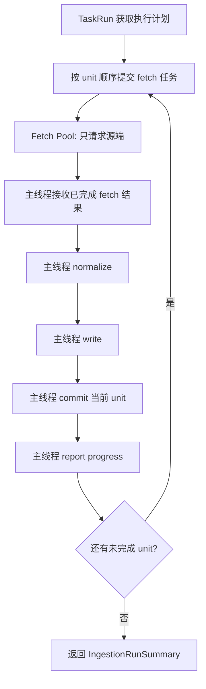

# 数据集源端拉取并发执行方案 v1

状态：已实现，待生产验收  
更新时间：2026-06-04  
适用范围：`DatasetDefinition -> DatasetExecutionPlan -> IngestionExecutor` 数据维护主链

## 1. 背景

`stk_mins` 每日维护的主要耗时来自源端请求等待。

当前实现中，`IngestionExecutor` 对每个 unit 串行执行：

```text
fetch source -> normalize -> write -> commit -> report progress
```

`stk_mins` 的 unit 由 `ts_code + freq + 时间窗口` 组成。全市场单日、5 个分钟频率时，unit 数约 29250 个。近期生产任务观测到：

| TaskRun | unit 数 | 运行时长 | 估算请求速率 |
| --- | ---: | ---: | ---: |
| 1880 | 29250 | 约 153 分钟 | 约 191 次/分钟 |
| 1797 | 29250 | 约 108 分钟 | 约 271 次/分钟 |
| 1704 | 29250 | 约 135 分钟 | 约 217 次/分钟 |

Tushare `stk_mins` 当前限速是 500 次/分钟。实际运行低于限速上限，说明瓶颈不是配额，而是单请求响应等待和高峰时延。

## 2. 目标

用最小架构改动降低 `stk_mins` 源端等待时间，同时守住业务数据安全。

核心目标：

| 目标 | 说明 |
| --- | --- |
| 提升 `stk_mins` 每日维护速度 | V1 只给 `stk_mins` 开启 2 路源端拉取并发 |
| 保持 Tushare 500 次/分钟总限速 | 并发线程必须共享同一个进程内 rate limiter |
| 不改变写库事务语义 | normalize、write、commit、progress 仍只在主线程串行执行 |
| 做成通用能力 | 后续其他数据集可通过 `DatasetDefinition.planning.fetch_concurrency` 显式启用 |

预期效果：在当前生产负载下，`stk_mins` 单日维护从约 108 到 153 分钟下降到约 60 到 80 分钟。真实结果以后续生产任务验收为准。

## 3. 非目标

本方案不做以下事情：

| 不做 | 原因 |
| --- | --- |
| 不启动多个 `goldenshare-ops-worker` 进程来加速 | Tushare 限速器是进程内状态，多进程会各自认为自己有 500 次/分钟额度，容易打穿配额 |
| 不并发 normalize/write/commit | DB session、writer、TaskRun 进度写入必须保持单线程，避免事务和状态污染 |
| 不提高 `stk_mins` 的 Tushare 限速值 | 当前问题是响应等待，不是额度配置太低 |
| 不改 source API 参数 | `stk_mins` 仍按现有 `ts_code/freq/start_date/end_date/limit/offset` 请求 |
| 不改 unit 生成语义 | 仍按 `ts_code + freq + 时间窗口` 生成 unit |
| 不新增 UI、API 或运行时配置页面 | V1 只做 DatasetDefinition 事实源配置 |

## 4. 设计口径

### 4.1 新增定义字段

在 `DatasetPlanningDefinition` 增加：

```python
fetch_concurrency: int = 1
```

含义：该数据集执行时允许同时进行的源端 fetch 数量。

硬规则：

| 规则 | 说明 |
| --- | --- |
| 默认值必须是 1 | 现有所有数据集默认行为不变 |
| V1 只允许 1 到 4 | 已确认；防止误配置成大并发 |
| V1 只给 `stk_mins` 配置为 2 | 已确认；其他数据集必须后续单独评估 |
| 超出范围必须 lint/test 失败 | 不靠人工记忆守规则 |

### 4.2 执行器模型

当 `fetch_concurrency <= 1` 时，执行器保持当前串行路径。

当 `fetch_concurrency > 1` 时，只并发执行 `DatasetSourceClient.fetch()`：



关键约束：

| 环节 | 并发策略 |
| --- | --- |
| `source_client.fetch` | 可并发 |
| `normalizer.normalize` | 不并发 |
| `writer.write` | 不并发 |
| `session.commit/rollback` | 不并发 |
| `observer.report_progress` | 不并发 |
| `cancel_checker` | 主线程提交新 fetch 前检查 |

### 4.3 结果顺序

V1 按 fetch 完成顺序进入后续写入，而不是强制按 unit 原始顺序等待。

理由：

| 选择 | 结果 |
| --- | --- |
| 按完成顺序写入 | 能最大化减少慢请求拖累，unit 之间没有业务顺序依赖 |
| 按原始顺序写入 | 更稳定但加速效果变差，慢 unit 会阻塞后面已完成结果 |

进度展示会按完成顺序推进，但每条进度仍带当前 unit 的 `ts_code/freq/start/end`，不影响业务正确性。

### 4.4 异常处理

任何一个 fetch、normalize、write 或 commit 失败时：

1. 当前 unit 按现有失败语义处理。
2. 主线程 rollback 当前未提交事务。
3. 不再提交新的 fetch。
4. 尽力取消尚未开始的 fetch future。
5. 已提交的历史 unit 保持已提交，不回滚业务数据。
6. 抛出当前 `IngestionError`，由 TaskRun 主链记录失败。

这保持当前 “unit 级提交，失败后前序已提交数据保留” 的语义。

### 4.5 限速器安全

当前 `src/foundation/clients/tushare_client.py` 中 `_RateLimiter.acquire()` 已经使用 `Lock` 控制单个 limiter 的请求间隔。

并发改造需要额外加固：

| 加固点 | 原因 |
| --- | --- |
| 给 `_rate_limiters` 全局字典初始化加锁 | 防止两个 fetch 线程同时初始化同一个 api limiter |
| 每个线程使用自己的 connector/client 请求源端 | 避免共享同一个 requests session 带来的线程安全问题 |
| 不允许靠多进程加速 `stk_mins` | 进程间不共享 `_RateLimiter` 状态 |

## 5. 代码改动范围

| 文件 | 改动 |
| --- | --- |
| `src/foundation/datasets/models.py` | `DatasetPlanningDefinition` 增加 `fetch_concurrency=1` |
| `src/foundation/datasets/definitions/market_equity.py` | `stk_mins.planning.fetch_concurrency=2` |
| `src/foundation/ingestion/execution_plan.py` | 在 plan snapshot 中投影 `fetch_concurrency`，便于审计 |
| `src/foundation/ingestion/resolver.py` | 同步投影 `fetch_concurrency` |
| `src/foundation/ingestion/executor.py` | 增加 fetch-only 并发执行路径 |
| `src/foundation/clients/tushare_client.py` | `_rate_limiters` 字典初始化加锁 |
| `tests/**` | 增加定义、lint、执行器、限速器测试 |

不改范围：

| 不改 | 说明 |
| --- | --- |
| Ops API / 前端 | 用户交互不变 |
| TaskRun 表结构 | 仍用当前 TaskRun 观测链 |
| writer / DAO / Alembic | 不改变业务表写入模型 |
| source request builder | 不改变 Tushare 参数 |
| `stk_mins` unit planner | 不改变 unit 切分 |

## 6. 开发里程碑

| 阶段 | 目标 | 验收 |
| --- | --- | --- |
| M0 | 开发前审计 | 重新读取根 AGENTS、`src/foundation/ingestion/AGENTS.md`、本方案文档，CodeGraph 覆盖 executor/planning/client |
| M1 | Definition 字段 | `fetch_concurrency` 默认 1，`stk_mins=2`，范围校验 1 到 4 |
| M2 | 限速器加固 | 多线程获取同一 api limiter 时只创建一个共享 limiter |
| M3 | 执行器 fetch-only 并发 | fetch 可并发，normalize/write/commit/progress 仍主线程串行 |
| M4 | 测试护栏 | 正向验证 `stk_mins=2`，负向验证其他数据集默认 1 和非法并发失败 |
| M5 | 最小本地验证 | fake source 慢请求测试证明 2 路并发确实缩短等待，writer 线程仍是主线程 |
| M6 | 生产灰度验收 | 下一次 `stk_mins` 单日任务观察耗时、请求速率、失败率、写入行数 |

## 7. 测试计划

必须补充或更新以下测试：

| 测试 | 目的 |
| --- | --- |
| Definition registry 测试 | `stk_mins.planning.fetch_concurrency == 2`，其他样本数据集默认 1 |
| ingestion lint 测试 | `fetch_concurrency < 1` 或 `> 4` 必须失败 |
| Executor 并发测试 | fake source 记录最大同时 fetch 数为 2 |
| Executor 写入线程测试 | fake writer 证明 normalize/write/commit/progress 不进入 fetch 线程 |
| Executor 失败测试 | 一个 fetch 失败后不继续提交新 fetch，未提交事务 rollback |
| Tushare limiter 测试 | 多线程 `_get_rate_limiter("stk_mins")` 返回共享 limiter，并保持间隔控制 |

建议回归命令：

```bash
uv run ruff check src/foundation/datasets/models.py src/foundation/datasets/definitions/market_equity.py src/foundation/ingestion/executor.py src/foundation/clients/tushare_client.py tests
uv run pytest -q tests/test_dataset_definition_registry.py tests/test_dataset_source_client.py tests/test_tushare_client.py
uv run pytest -q tests/test_dataset_action_resolver.py tests/architecture/test_dataset_runtime_registry_guardrails.py
uv run goldenshare ingestion-lint-definitions
uv run python scripts/check_docs_integrity.py
```

如果新增专门的 executor 测试文件，回归命令需要同步加入。

## 8. 生产验收

V1 生产验收只看 `stk_mins`。

| 指标 | 期望 |
| --- | --- |
| unit 数 | 与改造前一致 |
| request 参数 | 与改造前一致 |
| 写入行数 | 与同类交易日基线接近 |
| reject | 不出现新增异常拒绝 |
| 总耗时 | 目标约 60 到 80 分钟 |
| Tushare 限速错误 | 不增加 |
| TaskRun 进度 | 正常推进，无重复、倒退或状态污染 |

## 9. 回滚方式

如果生产验收不符合预期，最小回滚方式是把 `stk_mins.planning.fetch_concurrency` 改回 1。

回滚不需要清表、不需要迁移、不需要改 TaskRun 数据。

## 10. 已确认决策

| 编号 | 决策 | 结论 |
| --- | --- | --- |
| D1 | V1 是否只给 `stk_mins` 开启 2 路 fetch 并发 | 确认，只做 `stk_mins`，2 路 |
| D2 | `fetch_concurrency` 允许范围是否固定为 1 到 4 | 确认，范围固定为 1 到 4 |
| D3 | 是否把 `fetch_concurrency` 投影进 `DatasetExecutionPlan` | 确认，需要投影 |
| D4 | 并发结果是否按完成顺序写入 | 确认，按 fetch 完成顺序写入 |

当前无其他待拍板问题。后续进入开发时，只需要按本方案的开发里程碑和测试门禁执行。

## 11. CodeGraph 审计记录

本方案编写前已使用 CodeGraph 覆盖以下范围：

| 工具 | 范围 |
| --- | --- |
| `codegraph_explore` | `IngestionExecutor`、`DatasetPlanningDefinition`、`DatasetExecutionPlan`、`DatasetSourceClient.fetch`、`DatasetWriter.write`、`stk_mins`、Tushare rate limiter |

已确认当前主影响面集中在 foundation ingestion 主链；本方案不要求新增 `foundation -> ops` 依赖，也不涉及 `src/platform` / `src/operations` legacy 目录。

## 12. 实现记录

2026-06-04 已完成 V1 代码落地：

| 项目 | 结果 |
| --- | --- |
| `DatasetPlanningDefinition.fetch_concurrency` | 已新增，默认 `1` |
| `DatasetExecutionPlan.planning.fetch_concurrency` | 已投影 |
| `stk_mins` | 已显式配置 `fetch_concurrency=2` |
| linter | 已校验 `fetch_concurrency` 必须在 `1~4` |
| Tushare limiter | 已给 `_rate_limiters` 初始化加锁 |
| `IngestionExecutor` | 已实现 fetch-only 并发；写库、提交、进度仍主线程串行 |

已执行验证：

```bash
uv run ruff check src/foundation/datasets/models.py src/foundation/datasets/definitions/market_equity.py src/foundation/ingestion/execution_plan.py src/foundation/ingestion/resolver.py src/foundation/ingestion/executor.py src/foundation/ingestion/linter.py src/foundation/clients/tushare_client.py tests/test_dataset_progress.py tests/test_dataset_definition_registry.py tests/test_dataset_action_resolver.py tests/test_ingestion_linter.py tests/test_tushare_client.py
uv run pytest -q tests/test_dataset_definition_registry.py tests/test_dataset_action_resolver.py tests/test_tushare_client.py tests/test_ingestion_linter.py tests/test_dataset_progress.py tests/test_dataset_source_client.py tests/architecture/test_dataset_runtime_registry_guardrails.py
uv run goldenshare ingestion-lint-definitions
uv run python scripts/check_docs_integrity.py
```
