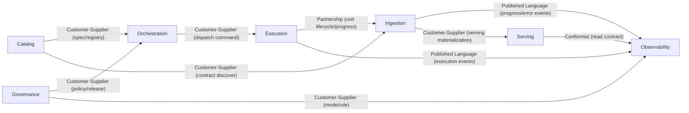
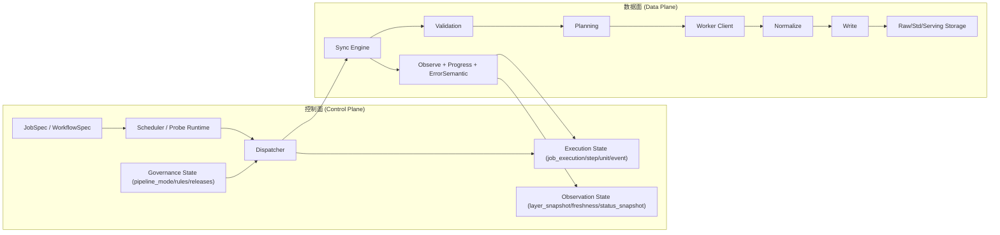
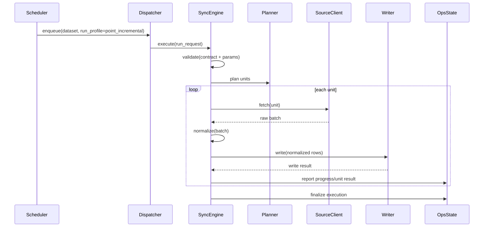
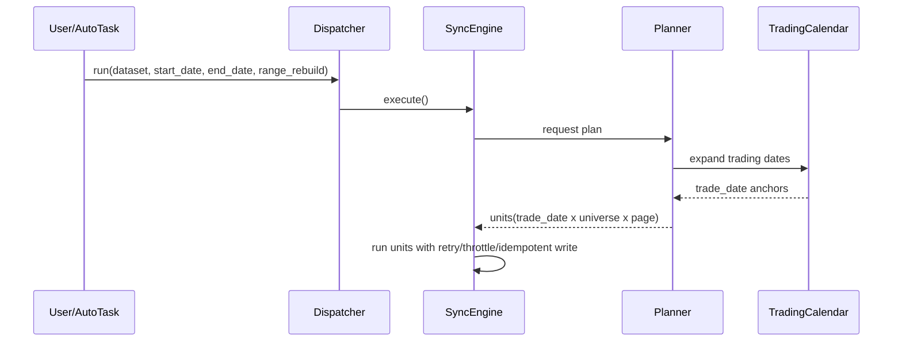
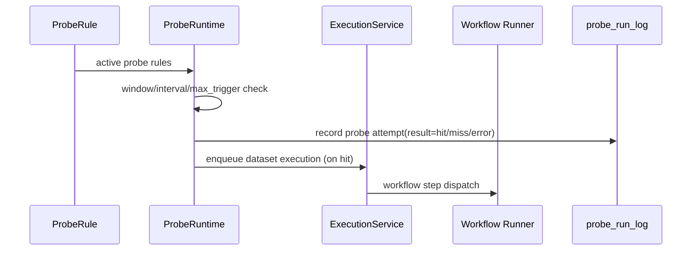
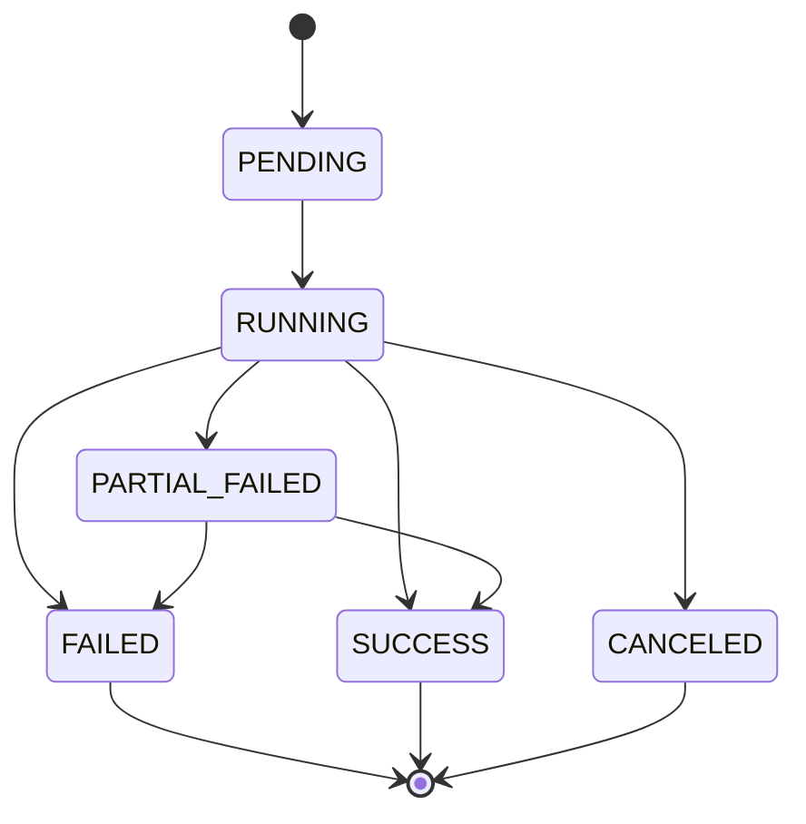
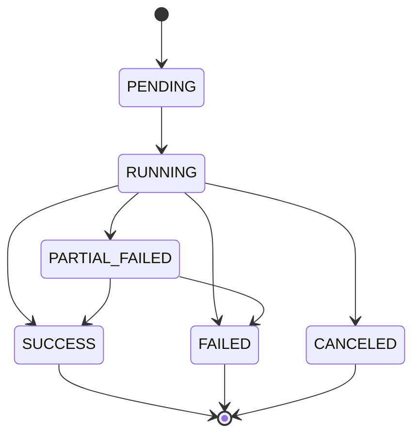
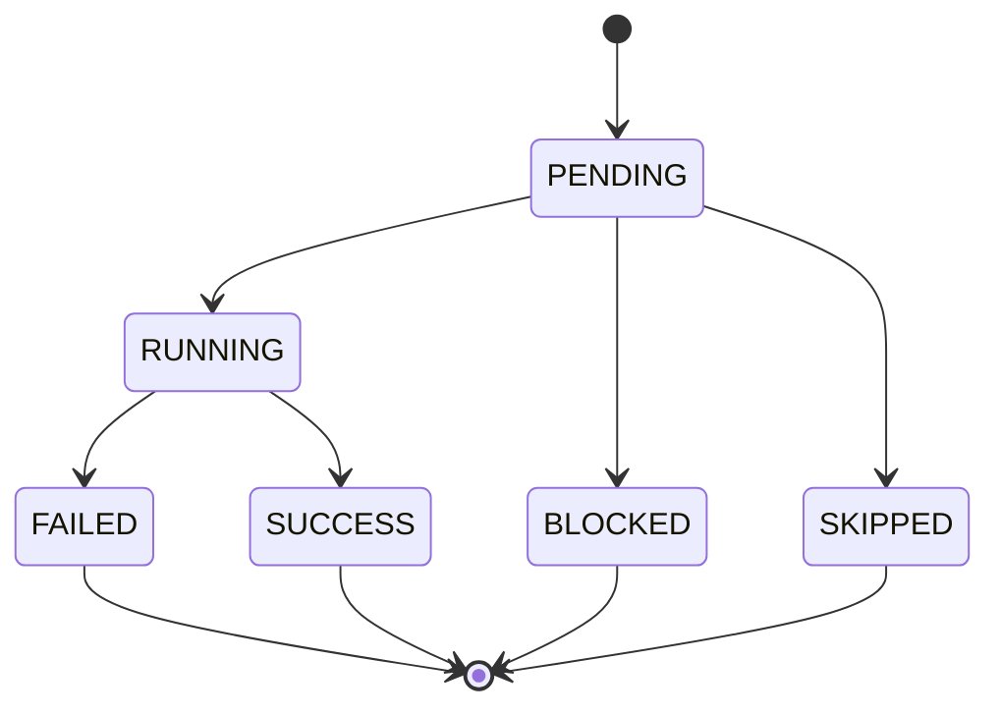

# 数据同步 V2 重设计方案（含平稳迁移）

- 版本：v2.1（架构评审稿）
- 日期：2026-04-20
- 状态：已进入执行并完成 Phase 1-4 首轮落地（保留 V1/V2 双轨）
- 适用范围：`src/foundation`、`src/ops`（数据拉取、落库、编排、观测全链路）
- 详细分期方案索引：[dataset-sync-v2-detailed-plan-index.md](/Users/congming/github/goldenshare/docs/architecture/dataset-sync-v2-detailed-plan-index.md)

---

## 0. 实施快照（2026-04-21）

1. Phase 1-4 对应的核心代码与测试已完成首轮落地。  
2. 当前保持 V1/V2 双轨可切换，不做一次性硬切断。  
3. 本轮未改上层业务 API 契约，符合本文边界定义。  

## 1. 目标与边界

### 1.3 分期实施入口（评审与落地）

为保证“先设计后编码、先评审后迁移”，V2 详细方案按四期拆分，评审入口如下：

1. [Phase 1：执行域与事件模型（P0）](/Users/congming/github/goldenshare/docs/architecture/dataset-sync-v2-phase-1-execution-domain.md)
2. [Phase 2：引擎与契约层（P0）](/Users/congming/github/goldenshare/docs/architecture/dataset-sync-v2-phase-2-engine-contracts.md)
3. [Phase 3：工作流/Probe/状态投影（P1）](/Users/congming/github/goldenshare/docs/architecture/dataset-sync-v2-phase-3-workflow-probe-projection.md)
4. [Phase 4：迁移切换与兼容收口（P1/P2）](/Users/congming/github/goldenshare/docs/architecture/dataset-sync-v2-phase-4-cutover-migration.md)
5. [分期可执行编码任务包（执行版）](/Users/congming/github/goldenshare/docs/architecture/dataset-sync-v2-implementation-work-packages.md)

门禁要求：

1. 每一期未通过评审，不进入该期编码。
2. 每一期必须给出“模块职责、字段字典、不变量、回滚方案、测试门禁”。
3. 所有迁移动作必须先完成引用审计与影响面审计。

### 1.1 目标

本方案聚焦以下能力目标（不是局部修补）：

1. 统一“数据拉取-归一化-落库-状态上报”主链路。  
2. 统一单数据集同步、历史回补、工作流执行的运行语义。  
3. 建立可校验的数据集契约，杜绝“配置可建、运行必炸”。  
4. 建立统一错误语义、任务语义、进度语义、状态语义。  
5. 在平稳迁移前提下逐步替换 V1，不做 big-bang。  
6. 改造完成后必须保证全链路可用：程序可正常运行、后台可正常启动、数据可正常同步，运营平台可配置并执行自动/手动任务。  

### 1.2 非目标

1. 本轮不重构业务 API 返回契约。  
2. 本轮不改现有 DB 表结构（如需变更走专项评审）。  
3. 本轮不改 CLI 体系设计，仅保留兼容入口。  

---

## 2. 全局业务口径（强约束）

V2 不再把“时间语义”混成一个口径，而是统一为“锚点类型（anchor_type）+ 窗口模式（window_policy）”的二维模型。  
所有数据集必须归入下表之一，不允许私有命名。

### 2.0 时间语义底线

1. `trade_date` 永远表示交易日历 `is_open=true` 的日期。  
2. 禁止再使用 `week_friday` 表示“每周最后交易日”。  
3. 周/月“最后交易日”必须显式区分于“自然周五/自然月末”。  
4. `sync_daily/sync_history/backfill_*` 仅保留为兼容别名；主语义由 `run_profile + anchor_type + window_policy` 决定。  

### 2.1 `anchor_type` 统一划分

| anchor_type | 语义定义 | 时间基准 | 典型参数形态 | 典型数据集 |
|---|---|---|---|---|
| `trade_date` | 单个交易日锚点 | 交易日 | `trade_date` | `daily, moneyflow, stk_limit` |
| `week_end_trade_date` | 每周最后一个交易日锚点 | 交易日 | `trade_date`（由 planner 约束为周末交易锚点） | `index_weekly, stk_period_bar_week` |
| `month_end_trade_date` | 每月最后一个交易日锚点 | 交易日 | `trade_date`（由 planner 约束为月末交易锚点） | `index_monthly, stk_period_bar_month` |
| `month_range_natural` | 自然月区间锚点（自然月首日~末日） | 自然日 | `start_date + end_date` | `index_weight` |
| `month_key_yyyymm` | 月键锚点（`YYYYMM`） | 月键 | `month` | `broker_recommend` |
| `natural_date_range` | 自然日区间（非交易日历语义） | 自然日 | `start_date + end_date`（必要时映射 `ann_date`） | `dividend, stk_holdernumber` |
| `none` | 无时间锚点（快照/主数据） | 无 | 无时间参数或仅业务筛选参数 | `stock_basic, ths_member, etf_basic` |

### 2.2 `window_policy` 统一划分

| window_policy | 说明 | 允许的典型输入 |
|---|---|---|
| `point` | 单点执行 | `trade_date` 或 `month` |
| `range` | 区间执行 | `start_date + end_date` |
| `point_or_range` | 单点和区间都支持 | `trade_date` 或 `start_date + end_date` |
| `none` | 不接受时间窗口 | 无时间参数 |

### 2.3 核心术语严格定义（含反例）

| 术语 | 严格定义 | 反例/易混词（禁止） |
|---|---|---|
| `dataset` | 业务数据能力单元，拥有唯一 `dataset_key`，在 Catalog 中登记、在 Ingestion 中执行、在 Serving 中暴露 | 把“某张物理表”直接等同于 dataset |
| `dataset_key` | 数据集全局稳定标识，仅表达“数据集身份”，不表达 source/stage | 用 `raw_tushare.xxx` 充当 `dataset_key` |
| `pipeline_mode` | 数据集在处理链路中的治理模式（如 `single_source_direct`/`multi_source_pipeline`/`raw_only`） | 把 pipeline_mode 当作运行状态 |
| `layer` | 数据处理层级（`raw/std/resolution/serving`） | 把 `layer` 当成数据源 |
| `execution` | 一次执行请求的完整生命周期实例（包含 step/unit/event） | 把一次 API 调用当 execution |
| `unit` | 执行计划中的最小可重试单元（由扇开/分页生成） | 用“处理行数”代替 unit |
| `run_profile` | 运行语义（`point_incremental/range_rebuild/snapshot_refresh`） | 继续以 `sync_daily/backfill_*` 作为主语义 |
| `probe` | 探测规则驱动的触发器，用于判断是否满足执行条件 | 把 probe 当作具体执行任务 |
| `freshness` | 数据新鲜度度量（业务日期、状态更新时间、lag） | 用“最后一次任务创建时间”代替 freshness |
| `snapshot` | 某时刻状态投影记录（可 current 或 history） | 把 snapshot 当作实时状态本身 |

`dataset` 在各上下文中的三种视角（必须区分）：

1. Catalog 视角：目录条目（身份与元数据）。  
2. Ingestion 视角：可执行拉取目标（契约 + 策略 + 写入）。  
3. Serving 视角：对上可消费的数据资源（稳定口径）。  

---

## 3. 限界上下文与职责边界

V2 使用“控制面 + 数据面”分层，并按限界上下文拆分职责。

### 3.1 限界上下文划分

| 上下文 | 责任 | 主归属 |
|---|---|---|
| Catalog（目录） | 数据集目录、字段口径、source/target 基础信息 | `ops/specs`, `ops/queries` |
| Orchestration（编排） | 调度、工作流、probe、执行请求入队 | `ops/runtime`, `ops/services` |
| Execution（执行） | run/step/unit 生命周期、进度与事件 | `ops/runtime`, `ops/models/ops` |
| Ingestion（拉取入库） | 参数生成、调用、归一化、写入、幂等 | `foundation/services/sync` |
| Governance（治理） | 规则、发布、策略版本、数据状态投影 | `ops/services`, `ops/models/ops` |
| Observability（观测） | freshness、快照、对账、巡检与告警输入 | `ops/queries`, `ops/services` |
| Serving（服务） | 对上查询口径（serving/serving_light） | `biz`, `foundation` |

### 3.2 Context Map（关系类型）

关系解释：

1. Catalog 是多个上下文的上游术语供应者（Customer-Supplier）。  
2. Execution 与 Ingestion 是强协作关系（Partnership），共同维护 unit 生命周期语义。  
3. Observability 通过事件与状态表消费上游（Published Language / Conformist）。  
4. 外部数据源到 Ingestion 必须通过 ACL（见 8.7），不得直接穿透到其他上下文。  

### 3.3 边界约束

1. `foundation` 只负责执行能力与数据能力，不感知 ops 表语义细节。  
2. `ops` 负责编排与状态治理，不嵌入数据集私有抓取逻辑。  
3. `biz` 只消费稳定服务口径，不参与同步流程控制。  
4. `app` 只做组合根装配，不承载领域主逻辑。  

---

## 4. 总体架构图

---

## 5. 交互流程（核心）

### 5.1 单数据集增量同步（point_incremental）

### 5.2 区间回补（range_rebuild）

### 5.3 工作流 + Probe 触发

---

## 6. 数据模型定义（V2）

### 6.1 聚合根与事务边界

| 聚合 | 聚合根 | 内部实体 | 事务边界 |
|---|---|---|---|
| ExecutionAggregate | `Execution` | `ExecutionStep`, `ExecutionUnit`, `ExecutionEvent` | 一次 execution 内状态变更原子化 |
| DatasetStateAggregate | `DatasetState`（逻辑聚合） | `LayerSnapshotCurrent`, `LayerSnapshotHistory`, `DatasetStatusSnapshot` | 同一 dataset/layer 状态投影一致性 |
| ProbeAggregate | `ProbeRule` | `ProbeRunLog` | 单规则触发计数与窗口约束一致性 |

对应当前 ops 模型基线：

1. `ops.job_execution`
2. `ops.job_execution_step`
3. `ops.job_execution_event`
4. `ops.dataset_layer_snapshot_current`
5. `ops.dataset_layer_snapshot_history`
6. `ops.dataset_status_snapshot`
7. `ops.probe_rule`
8. `ops.probe_run_log`

### 6.2 ExecutionAggregate 不变量

唯一标识：

1. `execution_id`（全局唯一）  
2. `unit_id` 在同一 `execution_id` 内唯一  

核心不变量：

1. `done_units + failed_units + running_units <= total_units`  
2. `finished_at >= started_at`（若 `finished_at` 非空）  
3. `status=SUCCESS` 时，所有必需 `unit` 必须终态成功  
4. `status=FAILED` 时，至少存在一个 `unit` 或 `step` 失败记录  
5. `status=CANCELED` 后禁止再进入 `RUNNING`  

状态机：

状态转换触发者：

1. Dispatcher：`PENDING -> RUNNING`  
2. Engine/Worker：`RUNNING -> PARTIAL_FAILED/SUCCESS/FAILED`  
3. 用户或调度控制：`RUNNING -> CANCELED`  

### 6.3 DatasetStateAggregate 不变量与生命周期

唯一标识：

1. `dataset_key + layer`（current）
2. `dataset_key + layer + snapshot_at`（history）

核心不变量：

1. `current` 必须与 `history` 中最新一条逻辑一致（同层同键）  
2. 每次状态迁移先写 history，再刷新 current（避免 current 漂移）  
3. `DatasetStatusSnapshot` 必须可由 layer current 纯推导（可重建）  

生命周期：

1. Execution 单元成功/失败后触发 layer 状态变更事件。  
2. 状态投影服务更新 `history`，并同步覆盖 `current`。  
3. overview/freshness 只读 current，不直接扫描执行日志。  

### 6.4 ProbeAggregate 不变量

1. 单规则在同一自然日触发次数不超过 `max_triggers_per_day`。  
2. 探测记录必须落 `probe_run_log`（命中/未命中/失败都记录）。  
3. 命中触发后必须关联 execution_id（可追溯）。  

### 6.5 数据行模型（数据面）

| 层 | 语义 |
|---|---|
| Raw | 源忠实落地（source 原始口径） |
| Std | 多源标准化对齐层（可选物化） |
| Serving | 对上稳定服务口径 |

说明：单源直出场景允许不物化 std，但“逻辑契约”仍必须存在并可观测。

### 6.6 错误与进度模型

`StructuredError`（统一错误包）：

1. `error_code`
2. `error_type`
3. `phase`
4. `message`
5. `retryable`
6. `unit_id`
7. `details`

`ProgressEvent`（统一进度事件）：

1. `execution_id`
2. `dataset_key`
3. `step_key`
4. `unit_id`
5. `metrics(plan/rows/request/retry/latency)`
6. `status`

### 6.7 工作流模型与状态机

聚合定义：

| 聚合 | 聚合根 | 内部实体 | 语义 |
|---|---|---|---|
| WorkflowRunAggregate | `WorkflowRun` | `WorkflowStepRun` | 一次工作流执行实例 |

关键不变量：

1. 一个 `WorkflowRun` 只能有一个 `workflow_profile`。  
2. 每个 `WorkflowStepRun` 的 `dataset_key` 必须支持该 `workflow_profile`（由 `DatasetSyncContract.run_profiles_supported` 判定）。  
3. `depends_on` 必须构成 DAG（无环）。  
4. `fail_fast=true` 时，任一依赖 step 失败，所有后继 step 必须进入 `BLOCKED`。  
5. `workflow_finished_at >= workflow_started_at`（若 finished_at 非空）。  

工作流状态机：

步骤状态机：

---

## 7. 领域接口契约

### 7.1 统一运行语义（替代旧命名重叠）

V2 主语义仅保留：

1. `point_incremental`
2. `range_rebuild`
3. `snapshot_refresh`

旧入口 `sync_daily/sync_history/backfill_*` 只作为兼容别名，不再表达主语义。

### 7.2 DatasetSyncContract（核心契约）

每个数据集必须声明：

1. `dataset_key`, `source_key`, `api_name`
2. `input_schema`（字段、类型、必填、互斥、依赖）
3. `run_profiles_supported`
4. `planning_policies`
   - `TradeDateRangePlanner`
   - `UniverseFanoutPlanner`（标的池，不限股票）
   - `EnumFanoutPlanner`
   - `MonthEndTradeDatePlanner`
   - `WeekEndTradeDatePlanner`
5. `pagination_policy`
6. `rate_limit_policy`
7. `write_policy`
8. `idempotent_key_policy`
9. `normalize_spec`
10. `observe_spec`

### 7.3 引擎能力契约（能力视角）

说明：`IWorkerClient` 是“调用控制能力”（限流、重试、并发），不是 ACL。本方案的 ACL 见 8.7。 

1. `IValidator`：参数/语义/契约校验  
2. `IPlanner`：生成可执行 unit 计划  
3. `IWorkerClient`：调用、限流、重试、超时、熔断  
4. `INormalizer`：字段映射、类型转换、口径统一、行级校验  
5. `IWriter`：幂等写入与冲突处理  
6. `IObserver`：结构化事件  
7. `IProgressReporter`：阶段/单元进度上报  
8. `IErrorSemanticMapper`：异常归一化  

### 7.4 Ops 控制面契约

命令类：

1. `enqueue_execution(run_request)`
2. `cancel_execution(execution_id)`
3. `enqueue_due_schedules(now)`
4. `run_probe_tick(now)`

查询类：

1. `query_execution`
2. `query_freshness`
3. `query_layer_snapshot`
4. `query_overview`

事件类（领域事件）：

1. `ExecutionStarted`
2. `UnitCompleted`
3. `UnitFailed`
4. `ExecutionFailed`
5. `ExecutionCompleted`
6. `ProbeHit`
7. `ProbeMiss`
8. `ProbeError`

### 7.5 事件契约（必须结构化）

统一事件 Envelope：

| 字段 | 说明 |
|---|---|
| `event_id` | 全局唯一事件 ID |
| `event_type` | 事件类型，如 `UnitFailed` |
| `event_version` | 事件版本，默认 `1`，破坏性变更必须升级 |
| `occurred_at` | 事件发生时间 |
| `correlation_id` | 关联 execution/workflow 链路 |
| `dataset_key` | 事件归属数据集 |
| `payload` | 事件载荷（类型化 schema） |

事件载荷最小要求：

1. `ExecutionStarted`：`execution_id`, `run_profile`, `trigger_source`  
2. `UnitCompleted`：`execution_id`, `unit_id`, `rows_fetched`, `rows_written`, `latency_ms`  
3. `UnitFailed`：`execution_id`, `unit_id`, `error_code`, `retryable`, `attempt`  
4. `ExecutionCompleted`：`execution_id`, `final_status`, `summary_metrics`  
5. `ExecutionFailed`：`execution_id`, `error_code`, `phase`, `failed_units`  
6. `ProbeHit/Miss/Error`：`probe_rule_id`, `dataset_key`, `result`, `execution_id?`  

订阅者基线（当前定义）：

1. Execution Query Projection（execution 列表与详情）  
2. Dataset Status Projection（layer/status/freshness 投影）  
3. Alert/巡检输入（后续告警系统）  

投递与重放语义：

1. 默认 `at-least-once`，消费者必须幂等。  
2. 事件可重放，重放以 `event_id + event_version` 去重。  
3. 重放不改变业务事实，仅重建投影状态。  

### 7.6 工作流契约（V2.1 明确语义）

工作流允许包含多个数据集 step，但运行语义必须统一，不允许混跑。

#### 7.6.1 WorkflowProfile 约束

`WorkflowSpec.workflow_profile` 仅允许：

1. `point_incremental`
2. `range_rebuild`
3. `snapshot_refresh`

强约束：

1. 一个工作流内所有 step 必须共享同一个 `workflow_profile`。  
2. 禁止在同一工作流中混用“单日+区间+快照”语义。  

#### 7.6.2 参数契约与作用域

参数作用域：

1. 全局参数：`workflow.params`  
2. 步骤覆盖参数：`step.params_override`  
3. 优先级：`step.params_override > workflow.params > contract.default`  

按语义的参数要求：

1. `point_incremental`：必须满足该 `dataset` 的 `anchor_type + window_policy=point` 所要求的输入（可能是 `trade_date`，也可能是 `month`）。  
2. `range_rebuild`：仅当该 `dataset.window_policy` 支持区间时可用，且必须满足区间输入（通常为 `start_date/end_date`）。  
3. `snapshot_refresh`：默认无时间参数；若某数据集要求时间参数，必须在该数据集 contract 明确（禁止调度层隐式注入）。  
4. 调度与 CLI 不得对所有数据集统一注入 `trade_date`。  

#### 7.6.3 Step 合法性校验

每个 step 在创建/发布时必须通过以下校验：

1. `step.dataset_key` 在 Catalog 中存在。  
2. `workflow_profile` 属于该数据集 `run_profiles_supported`。  
3. 参数经过数据集 contract 的 schema 校验。  
4. `depends_on` 引用存在且无环。  

任一校验失败，工作流不得发布（fail fast）。

#### 7.6.4 时间窗口与周期锚点

工作流只定义“统一业务窗口”，具体扇开由数据集 planner 负责：

1. 日频交易日类：按 `trade_date` 展开。  
2. 周频类：按 `week_end_trade_date`（每周最后交易日）展开。  
3. 月频交易日类：按 `month_end_trade_date`（每月最后交易日）展开。  
4. 自然月区间类：按 `month_range_natural` 展开（自然月首日到末日），如 `index_weight`。  
5. 月键类：按 `month_key_yyyymm` 展开，如 `broker_recommend`。  
6. 无时间维数据集：忽略窗口，但需在 contract 中明确 `snapshot_refresh` 语义。  

#### 7.6.5 Probe 与工作流关系

V2.1 采用“按数据集拆 probe rule”的口径：

1. 工作流配置 probe 目标数据集集合时，底层拆分为“每个 dataset 一个 probe rule”。  
2. 谁命中谁触发对应数据集 execution，不强制触发整条工作流。  
3. 需要整条流程一次性执行时，仅支持手动/定时触发，不走 probe 分拆触发。  

#### 7.6.6 进度上报语义（双层）

工作流层指标：

1. `total_steps`
2. `done_steps`
3. `failed_steps`
4. `blocked_steps`

步骤层指标：

1. `total_units`
2. `done_units`
3. `failed_units`
4. `rows_fetched/written`

前端展示必须同时提供“流程进度（step）”与“数据执行进度（unit）”。

#### 7.6.7 失败策略矩阵（必须显式配置）

工作流失败策略采用“全局默认 + step 可覆盖”的两层模型：

1. `workflow.failure_policy_default`
2. `step.failure_policy_override`（可选）

有效策略值：

1. `fail_fast`
2. `continue_on_error`
3. `skip_downstream`

优先级：

1. `step.failure_policy_override`
2. `workflow.failure_policy_default`
3. 系统默认（`fail_fast`）

策略行为矩阵：

| 策略 | 当前 step 失败后 | 直接后继 step | 非依赖 step | Workflow 终态建议 |
|---|---|---|---|---|
| `fail_fast` | 立即停止调度后续 step | 标记 `BLOCKED` | 停止调度 | `FAILED` |
| `continue_on_error` | 记录失败并继续 | 仅在依赖满足时继续 | 继续 | `PARTIAL_FAILED` 或 `SUCCESS_WITH_WARNINGS` |
| `skip_downstream` | 当前失败仅影响依赖链 | 依赖链标记 `SKIPPED/BLOCKED` | 继续 | `PARTIAL_FAILED` |

说明：

1. `continue_on_error` 不等于“忽略失败”，失败仍进入审计与告警。  
2. `skip_downstream` 用于“局部链路可失败、全局流程仍可推进”的工作流。  
3. `SUCCESS_WITH_WARNINGS` 仅作为展示态别名，存储层可映射为 `PARTIAL_FAILED`。  

#### 7.6.8 重试与恢复规则

step 级恢复规则：

1. `max_retry_per_unit`：默认 `2`（可按数据集 contract 覆盖）。  
2. `retry_backoff_policy`：指数退避 + 抖动。  
3. 仅 `retryable=true` 错误允许自动重试。  

workflow 级恢复规则：

1. 支持“从失败 step 重跑”（resume_from_step）。  
2. 重跑不得重复执行已成功且幂等确认的 unit。  
3. 重跑必须保留原 `correlation_id`，新增 `rerun_id` 便于审计。  

#### 7.6.9 前端状态展示映射（建议）

| 后端状态 | 前端主标签 | 说明 |
|---|---|---|
| `SUCCESS` | 成功 | 全部 step 成功 |
| `FAILED` | 失败 | 流程中止或不可恢复 |
| `PARTIAL_FAILED` | 部分失败 | 有失败但流程完成 |
| `CANCELED` | 已取消 | 人工或系统取消 |
| `RUNNING` | 运行中 | 执行中 |
| `PENDING` | 排队中 | 等待调度 |
| `SUCCESS_WITH_WARNINGS` | 成功（有告警） | 展示层别名，便于运营识别 |

运营展示要求：

1. 卡片显示“失败策略（默认/覆盖）”。  
2. 详情页显示“失败传播路径”（哪个 step 触发了 BLOCKED/SKIPPED）。  
3. 重跑入口必须提示“从头重跑”与“从失败 step 续跑”差异。  

---

## 8. 主要模块功能设计

### 8.1 SyncEngine（核心编排器）

负责：

1. 能力链编排与阶段边界控制  
2. 失败语义收口  
3. Unit 粒度重试与进度聚合  

不负责：

1. 数据集私有参数拼装细节  
2. 业务字段私有计算逻辑  

### 8.2 Planner 组件

负责：

1. 时间锚点展开（交易日、周末交易日、月末交易日）  
2. 标的池扇开、枚举扇开、分页扇开  
3. 生成可追踪 unit_id 与 plan_total_units  

### 8.3 WorkerClient 组件

负责：

1. source client 调用适配  
2. 限流、并发、重试、退避  
3. 标准化调用元数据输出（request_count/retry_count）  

### 8.4 Normalize 组件

负责：

1. raw -> 标准行映射  
2. 类型转换与口径统一  
3. 行级校验与 reject/repair/fail 策略  

### 8.5 Writer 组件

负责：

1. 写入策略路由（raw_only/raw_to_serving/raw_to_std_to_serving）  
2. 幂等冲突处理（业务键、row hash）  
3. 写入结果结构化输出  

### 8.6 Ops 状态投影组件

负责：

1. 执行态 -> 数据集状态投影  
2. layer snapshot current/history 更新  
3. freshness 与 overview 查询输入准备  

### 8.7 Source Adapter / ACL（反腐层）设计

ACL 目标：隔离外部数据源 schema 变化，避免 vendor 字段反向污染领域层。

强约束：

1. 每个 source（如 Tushare/Biying/东财/同花顺）必须有独立 Adapter。  
2. Adapter 输出必须是我方值对象/标准请求对象，不得向上透传 vendor 字段名。  
3. vendor 参数名与字段名只允许出现在 Adapter 内部。  
4. Planner/Validator/Engine 不直接依赖 vendor schema。  
5. Normalize 不负责“识别 vendor 协议”，只负责“我方标准对象 -> 标准行”。  

职责分工：

1. `SourceAdapter`：vendor 协议映射、鉴权、参数组装、响应解码。  
2. `Normalizer`：标准对象到标准行的语义归一。  
3. `Writer`：标准行落库与幂等处理。  

收益：

1. 新增/替换数据源时改动收敛在 Adapter，不扩散到 Engine 主链。  
2. vendor schema 漂移不会直接破坏核心领域模型。  
3. 数据集契约可保持稳定版本管理。  

---

## 9. 迁移方案（平稳可控）

### 9.1 迁移原则

1. 先搭 V2 基座，再迁数据集。  
2. 每次只迁一个数据集或一组同型数据集。  
3. 数据集级开关：`dataset -> v1 | v2`。  
4. 支持秒级回切 v1。  

### 9.2 分阶段计划

#### 阶段 A：基座建设

1. Contract/Engine/Planner/Policy 主骨架落地。  
2. spec-contract-lint 落地并接入 CI。  
3. Progress/Error 统一语义接入 ops。  

#### 阶段 B：典型数据集试点

建议试点：

1. `daily`
2. `block_trade`
3. `moneyflow_ind_dc`
4. `stk_period_bar_month`
5. `trade_cal`

评估维度：

1. 请求次数与吞吐  
2. rows_fetched/rows_written 一致性  
3. 幂等重复跑一致性  
4. 失败恢复与重试有效性  

#### 阶段 C：扩面迁移

按领域扩面：

1. 行情域  
2. 资金流向域  
3. 板块热榜域  
4. 低频事件域  
5. 主数据域  

#### 阶段 D：收口旧路径

1. 入口文案与展示只保留 RunProfile 主语义。  
2. 清理 V1 特例逻辑与冗余入口。  

---

## 10. 风险、回滚与验收

### 10.1 主要风险

1. V1/V2 并行期行为偏差。  
2. 旧入口别名映射错误。  
3. 限流参数不当导致吞吐下降。  

### 10.2 控制策略

1. 数据集灰度开关 + 一键回切。  
2. 切换前强制 dry-run compare。  
3. 统一回归清单（单测 + 集成 + ops 链路）。  
4. 未通过 `spec-contract-lint` 禁止上线。  

### 10.3 验收标准

1. 三类运行语义可覆盖当前全部任务类型。  
2. 所有试点数据集契约可校验、可执行、可回滚。  
3. 前后端错误语义与进度语义一致。  
4. ops 页面可稳定展示 unit 级进度与状态。  

---

## 11. 本文与旧路线关系

本方案替代“在 V1 上继续补丁叠补丁”的路径。后续 P0/P1 改造以 V2 迁移为主线推进，避免继续在 V1 堆积复杂度。

---

## 12. AnchorType 落地技术方案（含 `cli.py` 与 `sync_v2/registry.py` 治理联动）

### 12.1 契约层改造目标

在 `DatasetSyncContract.planning_spec` 补齐以下能力（保持向后兼容）：

1. `date_anchor_policy`：扩展为  
   `trade_date/week_end_trade_date/month_end_trade_date/month_range_natural/month_key_yyyymm/natural_date_range/none`。  
2. `window_policy`：`point/range/point_or_range/none`。  
3. `anchor_required_fields`：该数据集在不同运行语义下必须提供的关键字段。  
4. `source_time_param_policy`：时间参数映射策略（如 `trade_date`、`start_end`、`month_key`、`ann_date_window`）。  

### 12.2 引擎落地改造点

1. Validator：基于 `anchor_type + window_policy + run_profile` 做硬校验，不再做“全局 trade_date 必填”假设。  
2. Planner：将周/月最后交易日、自然月区间、月键三类锚点生成逻辑内聚到统一策略模块。  
3. Adapter：仅接收标准时间语义对象，内部完成源站参数映射。  
4. Observe/Error：错误码新增 `invalid_anchor_type`、`invalid_window_for_profile`、`missing_anchor_fields`。  

### 12.3 与 `cli.py` 治理结合（可行，建议联动）

可行性结论：**高可行、低行为风险**（前提：先做“薄入口化”，不改命令语义）。

建议拆分：

1. `src/cli.py` 保留为薄入口（Typer app 初始化 + 命令组注册）。  
2. 迁出命令实现到按职责分组模块（如 `sync/backfill/ops/reconcile`）。  
3. 在命令层统一走 `run_profile + anchor_type` 参数适配，不再在 CLI 侧散落“按资源特判”的注入逻辑。  

### 12.4 与 `sync_v2/registry.py` 治理结合（可行，建议联动）

可行性结论：**高可行、收益显著**（当前 2231 行，规则与数据集定义强耦合）。

建议拆分：

1. 将合同定义按“时间语义或领域”拆成子模块（如 `trade_date`, `snapshot`, `monthly`, `moneyflow`）。  
2. 保留统一装配入口（`build_sync_v2_contracts()`），集中做去重校验、lint 和导出。  
3. 先保持旧导出函数签名不变（兼容调用方），再逐步清理旧拼接逻辑。  

### 12.5 联动实施顺序（建议）

1. 先落地 `anchor_type/window_policy` 契约字段与校验，不动命令和注册表拆分。  
2. 再做 `registry.py` 内部拆分（纯结构重排，零行为变化）。  
3. 最后做 `cli.py` 薄入口化与命令分组迁移（保持参数与返回兼容）。  
4. 每一步都以“引用审计 + 最小回归”门禁推进，不做一次性大改。  

---

## 13. 配套改造清单

本方案的 ops 数据表改造与迁移节奏，见配套文档：

- [Ops 数据表改造清单（配套 V2 落地节奏）](/Users/congming/github/goldenshare/docs/architecture/ops-schema-migration-checklist-v2.md)
