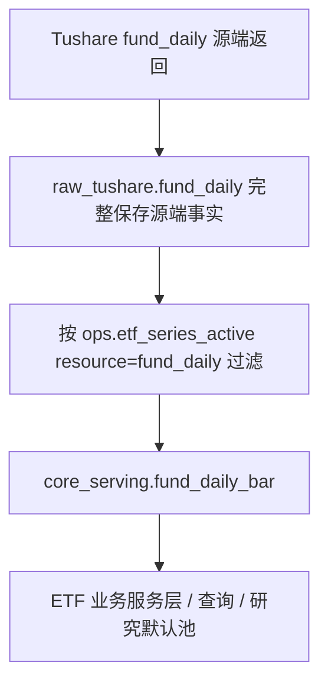
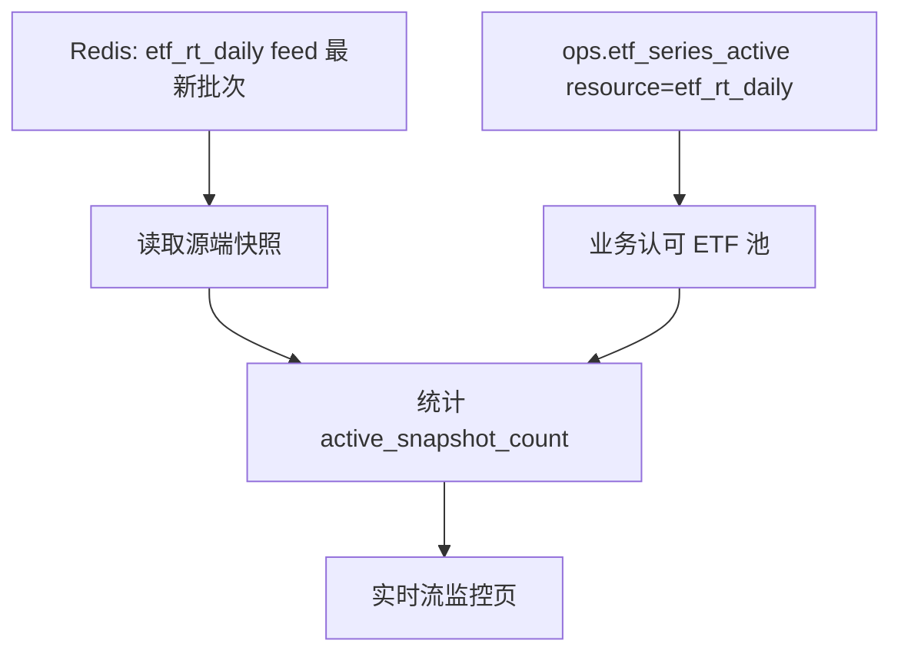

# ETF 活跃池设计方案 v1

状态：核心能力已落地 / 后续增强待单独立项
创建日期：2026-06-17
适用范围：`fund_daily`、ETF 实时日线流、后续 ETF 业务查询与 Ops 审查中心

---

## 1. 目标

建立一套 ETF 专属活跃池，用来回答两个问题：

1. 哪些 ETF 是平台认可、稳定服务的 ETF。
2. 不同业务能力应该使用哪些 ETF 代码集合。

说人话：

- `etf_basic` 是 ETF 基础信息事实，不等于所有业务都应该使用的 ETF 池。
- `fund_daily` 源表里会出现不在 `etf_basic` 的交易所基金代码，这些暂时不是本池的目标。
- 实时 ETF 源接口也可能返回比业务需要更多的代码，源端事实可以保留，但业务展示必须有明确池子控制。

---

## 2. 依据与现状

### 2.1 已审计的指数活跃池

当前指数活跃池使用 `ops.index_series_active`：

```text
resource
ts_code
first_seen_date
last_seen_date
last_checked_at
created_at
updated_at
```

主键是：

```text
(resource, ts_code)
```

同一个指数可以因为用途不同出现在多行，例如：

```text
resource          ts_code
index_daily       000300.SH
index_daily_raw   000300.SH
index_mins        000300.SH
```

这套模式有价值，但 `ops.index_series_active` 的领域名是指数，不应继续塞 ETF。

### 2.2 当前 ETF 数据观察

截至 2026-06-16 的 prod DB 只读统计：

| 项 | 数量 |
|---|---:|
| `raw_tushare.etf_basic` 全量 | 3323 |
| `etf_basic` 交易所代码 `.SH/.SZ` | 1741 |
| `etf_basic` 当前上市交易所代码 | 1563 |
| `etf_basic` `.OF` 基金代码 | 1582 |
| `2026-06-16 fund_daily` 有日线代码 | 2020 |
| `2026-06-16 fund_daily` 命中 `etf_basic` | 1561 |
| `2026-06-16 fund_daily` 不在 `etf_basic` | 459 |
| 最近一年上市口径严格无缺口 ETF | 1364 |
| 低缺口且高成交 ETF | 31 |
| 最终初始 ETF 活跃池 | 1395 |

最终初始 ETF 活跃池清单曾导出为历史文件：

- `reports/etf_series_active_seed_1395_20260617.csv`

低缺口 ETF 的已接受缺口 mapping 曾导出为历史文件：

- `reports/etf_series_active_fund_daily_accepted_gaps_31_20260617.csv`

`.OF` 基金代码基础信息曾导出为历史文件：

- `reports/etf_basic_of_fund_codes_20260618.csv`

解释：

- `complete_1364`：从 2020-01-01 或上市日开始，到 2026-06-17，每个应有交易日都有 `fund_daily`。
- `accepted_low_gap_liquid_31`：来自 145 只历史有缺口 ETF，其中历史缺口 `<= 7` 天，且 2026 年 6 月当前已有交易日的平均日成交额 `>= 1` 亿元。
- 最终初始池为 `1364 + 31 = 1395`。缺口较多或成交额不满足要求的 ETF 暂不进入初始活跃池。
- accepted gaps mapping 记录 `31` 只低缺口高成交 ETF 的 `65` 个已确认缺口日期。后续 DG/check 需要把这些日期识别为“已接受源站缺口”，不能当成同步漏数。
- `.OF` 代码虽然出现在 `etf_basic`，但不作为本活跃池代码。原因是本池服务 `fund_daily` 与实时 ETF 行情，代码口径必须使用交易所行情代码 `.SH/.SZ`；`.OF` 属于基金产品代码命名空间，不作为 `fund_daily` serving 与实时 Redis 的业务过滤 key。

---

## 3. 核心决策

### 3.1 新建 ETF 专属表，不复用指数表

新建：

```text
ops.etf_series_active
```

不复用：

```text
ops.index_series_active
```

原因：

1. ETF 是独立对象域，不是指数。
2. 复用指数表会让审查中心、清表边界、同步链路、文档语义都变混乱。
3. 后续如果要做 ETF 审查中心、ETF 实时池、ETF 日线池，专属表更清晰。

### 3.2 同一 ETF 可以有多行

主键是：

```text
(resource, ts_code)
```

例如同一只 ETF 同时进入日线池和实时池：

```text
resource      ts_code
fund_daily    513130.SH
etf_rt_daily  513130.SH
```

这不是重复数据，而是同一个 ETF 被纳入不同用途的池子。

### 3.3 初始只定义两个 resource

| resource | 用途 | 初始来源 |
|---|---|---|
| `fund_daily` | ETF 日线、研究、后续 ETF serving 使用范围 | `etf_series_active_seed_1395_20260617.csv` |
| `etf_rt_daily` | ETF 实时日线 Ops health 命中统计范围；后续业务 API 如需开放也使用该池过滤 | 初始同 `fund_daily` |

不在本轮定义更多 resource。

确认口径：

1. 初始只保留 `fund_daily`、`etf_rt_daily` 两个 resource。
2. `etf_rt_daily` 初始完全复制 `fund_daily`，也就是同一批 `1395` 只 ETF 同时进入日线池和实时日线池。
3. 后续如果实时源命中情况与日线池不一致，再单独调整 `etf_rt_daily`，不反向影响 `fund_daily`。

---

## 4. 数据模型

确认新建 ETF 专属活跃池表：

```sql
CREATE TABLE ops.etf_series_active (
    resource varchar(64) NOT NULL,
    ts_code varchar(16) NOT NULL,
    first_seen_date date NOT NULL,
    last_seen_date date NOT NULL,
    last_checked_at timestamptz NOT NULL,
    created_at timestamptz NOT NULL DEFAULT now(),
    updated_at timestamptz NOT NULL DEFAULT now(),
    CONSTRAINT pk_etf_series_active PRIMARY KEY (resource, ts_code)
);

CREATE INDEX idx_etf_series_active_resource
    ON ops.etf_series_active (resource);

CREATE INDEX idx_etf_series_active_resource_last_seen
    ON ops.etf_series_active (resource, last_seen_date);
```

字段语义：

| 字段 | 语义 |
|---|---|
| `resource` | 池用途，例如 `fund_daily`、`etf_rt_daily` |
| `ts_code` | ETF 交易所代码，只允许 `.SH/.SZ` |
| `first_seen_date` | 首次纳入该池的观测日期 |
| `last_seen_date` | 最近一次确认仍属于该池的观测日期 |
| `last_checked_at` | 最近一次检查时间 |
| `created_at/updated_at` | 表记录维护时间 |

不在表里保存：

1. ETF 名称、基金公司、跟踪指数等基础信息。这些来自 `etf_basic`。
2. 交易行情、成交量、价格。这些来自 `fund_daily` 或实时 Redis。
3. 用户备注、审批记录。本轮不做审查工作流，后续如需要再单独设计。

---

## 5. 初始化口径

### 5.1 初始候选池

初始池来自：

```text
raw_tushare.etf_basic
```

必须满足以下两类之一：

1. `complete_1364`：`ts_code` 后缀是 `.SH` 或 `.SZ`，`list_status = 'L'`，且从 2020-01-01 或上市日开始到 2026-06-17 的应有交易日全部存在 `raw_tushare.fund_daily` 日线。
2. `accepted_low_gap_liquid_31`：同样是 `.SH/.SZ` 当前上市 ETF，历史缺口 `<= 7` 天，且 2026 年 6 月平均日成交额 `>= 1` 亿元。

明确排除：

1. `.OF` 代码不进入 `ops.etf_series_active`。
2. 不在 `etf_basic` 的 `fund_daily` 代码不进入 `ops.etf_series_active`。
3. 缺口较多或成交额不满足要求的 ETF 不进入初始池。

当前已验证结果：

```text
完整性窗口：2020-01-01 或上市日 ~ 2026-06-17
无缺口 ETF：1364
接受低缺口高成交 ETF：31
最终初始池数量：1395
已接受缺口日期：65
.OF 基金代码：1582
```

### 5.2 初始化写入

初始化时，把同一批 `1395` 个 ETF 写入两个 resource：

```text
fund_daily
etf_rt_daily
```

示例：

```text
resource      ts_code     first_seen_date  last_seen_date
fund_daily    513130.SH   2026-06-16       2026-06-16
etf_rt_daily  513130.SH   2026-06-16       2026-06-16
```

### 5.3 已接受缺口 mapping

低缺口高成交 ETF 虽然进入初始池，但它们历史上存在少量源站缺口。缺口事实不能藏在代码里，必须通过 mapping 文件显式记录。

mapping 文件：

```text
reports/etf_series_active_fund_daily_accepted_gaps_31_20260617.csv
```

字段：

| 字段 | 说明 |
|---|---|
| `ts_code` | ETF 代码 |
| `csname` | ETF 名称 |
| `trade_date` | 已接受缺口日期 |
| `resource` | 固定为 `fund_daily` |
| `gap_policy` | 固定为 `accepted_low_gap_liquid` |
| `gap_reason` | 固定为 `source_no_row_verified_20260617` |
| `expected_missing_days` | seed 文件中该 ETF 的预期缺口天数 |
| `actual_missing_days` | 按 prod `raw_tushare.fund_daily` 与交易日历复核后的实际缺口天数 |
| `avg_amount_yi_yuan` | 2026 年 6 月当前已有交易日平均成交额，单位亿元 |

用途：

1. DG / Dagster 完整性 check 计算期望行时，必须从期望集合中扣除这些 accepted gaps。
2. accepted gaps 只能让检查“不误报”，不能生成伪造行情行。
3. 如果后续重新验证源站补回了某些日期，需要重新生成 mapping，并通过明确的池刷新流程更新。

### 5.4 初始化不是自动同步任务

初始化是受控治理动作，不是 `fund_daily` 同步任务的一部分。

原因：

1. 数据同步负责拉取和写入事实。
2. 活跃池负责运营认可范围。
3. 如果让同步任务自动改池，后面会出现“源站今天多返回一个代码，业务范围也被偷偷扩大”的问题。

---

## 6. 与 fund_daily 的关系

### 6.1 当前 fund_daily raw 行为

`raw_tushare.fund_daily` 保存源端 ETF/基金日线行情事实。它可以包含：

1. `etf_basic` 中的 ETF 交易所代码。
2. 不在 `etf_basic` 的交易所基金代码，例如 `160xxx.SZ`、`501xxx.SH` 等。

### 6.2 后续目标行为



规则：

1. raw 层不按活跃池裁剪。
2. `core_serving.fund_daily_bar` 必须按 `ops.etf_series_active(resource='fund_daily')` 清洗，只保留活跃池内 ETF。
3. 活跃池只控制 serving / 业务使用范围，不反向影响 raw 源端事实保存。
4. 如果源端返回了不在活跃池内的代码，只写 raw，不写入 `core_serving.fund_daily_bar`。

### 6.3 core_serving 清洗策略

当前 `fund_daily` 是两张物理表：

| 层 | 物理表 | 规则 |
|---|---|---|
| raw | `raw_tushare.fund_daily` | 完整保存源端事实，不按活跃池过滤 |
| serving | `core_serving.fund_daily_bar` | 按 `ops.etf_series_active(resource='fund_daily')` 过滤后写入 |

目标写入规则：

1. 同步 `fund_daily` 时，normalizer 输出的源端行先写 `raw_tushare.fund_daily`。
2. writer 写 `core_serving.fund_daily_bar` 前，必须读取 `ops.etf_series_active(resource='fund_daily')`。
3. 只有 `ts_code` 在活跃池内的行才能写入 serving。
4. `core_serving.fund_daily_bar` 的重建或清理也必须以同一活跃池为过滤条件。
5. 状态、TaskRun、freshness 或 DG check 失败不得回滚或污染 raw 业务数据。

验收口径：

1. raw 行数可以大于 serving 行数。
2. serving 中不得出现不在 `ops.etf_series_active(resource='fund_daily')` 的 ETF 代码。
3. 对 `accepted_low_gap_liquid_31` 中的 65 个 accepted gaps，serving 不补假行；DG/check 通过 accepted gaps mapping 解释缺口。

### 6.4 已存在 serving 数据的清理收口

已存在的 `core_serving.fund_daily_bar` 需要按活跃池做一次受控清理收口。该动作不是 raw 重建，也不是源端重拉，只是把 serving 层收敛到业务认可 ETF 池。

清理范围：

```text
core_serving.fund_daily_bar
```

清理条件：

```sql
not exists (
  select 1
  from ops.etf_series_active a
  where a.resource = 'fund_daily'
    and a.ts_code = core_serving.fund_daily_bar.ts_code
)
```

硬约束：

1. 只清理 `core_serving.fund_daily_bar`。
2. 不删除、不更新 `raw_tushare.fund_daily`。
3. 不删除、不更新 `ops.etf_series_active`。
4. 不删除、不更新 accepted gaps mapping。
5. 执行前必须确认没有正在运行或排队的 `fund_daily` TaskRun。
6. 执行前必须输出 dry-run 报告，用户确认后才能执行删除。

执行步骤：

1. dry-run 统计：
   - `core_serving.fund_daily_bar` 总行数。
   - 活跃池内行数。
   - 活跃池外行数。
   - 活跃池外 distinct `ts_code` 数量。
   - 活跃池外样本代码与日期范围。
2. 生成清理候选报告：
   - `reports/etf_fund_daily_serving_out_of_active_pool_dry_run_<date>.csv`
   - 字段至少包括 `ts_code`、`min_trade_date`、`max_trade_date`、`row_count`。
3. 用户确认清理报告。
4. 在单事务内删除活跃池外 serving 行。
5. 删除后复核：
   - 活跃池外 serving 行数必须为 `0`。
   - 活跃池内 serving 行数仍然存在。
   - raw 表同条件下的活跃池外行仍然保留。
6. 生成清理审计报告：
   - `reports/etf_fund_daily_serving_cleanup_audit_<date>.csv`

验收口径：

1. `core_serving.fund_daily_bar` 中不存在 `.OF` 代码。
2. `core_serving.fund_daily_bar` 中不存在非 `ops.etf_series_active(resource='fund_daily')` 代码。
3. `raw_tushare.fund_daily` 不因本次清理减少任何行。
4. accepted gaps 仍由 mapping 解释，不用 serving 空行补齐。

---

## 7. 与 ETF 实时日线的关系

### 7.1 Redis 保存源端批次事实

实时 ETF 源接口返回什么，Redis batch 先保存什么。

原因：

1. 方便排查源接口真实返回。
2. 避免因为业务池过滤导致源端异常不可见。
3. 符合实时流已有原则：状态层保存最新快照事实，不做业务数据落库。

### 7.2 V1 Ops health 按 etf_rt_daily 统计命中

当前实时 ETF V1 不新增业务 snapshot API。实时流监控页只展示 Redis 源端批次事实，以及这些源端快照中命中 `etf_rt_daily` 活跃池的数量：



如果后续出现明确的业务页面或 API，再新增业务 snapshot API，并按 `etf_rt_daily` 池过滤返回 items；不得直接把源端全量作为业务展示范围。

举例：

```text
实时源返回：2200 个代码
Redis 保存：2200 个代码
etf_rt_daily 活跃池：1395 个代码
业务页面展示：这 1395 个池内有快照的 ETF
```

好处：

1. 源端事实不丢。
2. 业务展示不乱。
3. 调整服务范围只改活跃池，不改实时接口代码。

---

## 8. API 与 Ops 页面方向

### 8.1 Foundation / Ops 边界

建议新增 foundation contract：

```text
EtfSeriesActiveStore
```

方法保持与 `IndexSeriesActiveStore` 类似：

```python
list_active_codes(resource: str) -> list[str]
upsert_seen_codes(resource: str, latest_seen_by_code: dict[str, date], checked_at: datetime | None = None) -> int
```

Ops 侧提供适配：

```text
OpsEtfSeriesActiveStore
```

落表：

```text
ops.etf_series_active
```

### 8.2 Ops 审查中心

后续审查中心可新增：

```text
审查中心 -> ETF -> ETF 活跃池
```

V1 页面能力确认：

1. 只读展示 `fund_daily`、`etf_rt_daily` 两个 resource。
2. 展示 ETF basic 信息、最近一年匹配情况、最新交易日是否有日线。
3. 不做手工新增/删除。

### 8.3 配置与初始化入口

初始阶段建议提供受控 CLI：

```text
goldenshare ops-seed-etf-series-active --resource fund_daily --from-seed-csv reports/etf_series_active_seed_1395_20260617.csv --apply
goldenshare ops-seed-etf-series-active --resource etf_rt_daily --from-seed-csv reports/etf_series_active_seed_1395_20260617.csv --apply
```

默认 dry-run，必须 `--apply` 才写库。

---

## 9. 开发边界

本方案不做：

1. 不改 `fund_daily` 源端请求参数、分页策略和 raw 保存逻辑。
2. 不改 ETF 实时日线 provider。
3. 不改 Redis key 模型。
4. 不把 ETF 写入 `ops.index_series_active`。
5. 不自动从同步任务更新 ETF 活跃池。
6. 不清空、不重建任何业务数据表。
7. 不引入用户自定义池。
8. 不把 `.OF` 基金代码纳入 ETF 活跃池。

本方案要做：

1. 新建 `ops.etf_series_active`。
2. 定义 `fund_daily` 与 `etf_rt_daily` 两个 resource。
3. 用 `reports/etf_series_active_seed_1395_20260617.csv` 初始化两个 resource。
4. 用 `reports/etf_series_active_fund_daily_accepted_gaps_31_20260617.csv` 记录低缺口 ETF 的已接受缺口。
5. `core_serving.fund_daily_bar` 写入和清理按 `resource='fund_daily'` 过滤。
6. 实时 ETF V1 的 Ops health 按 `resource='etf_rt_daily'` 统计活跃池命中；业务 snapshot API 尚未开放。

---

## 10. 里程碑

### M1 方案冻结

1. 确认表名 `ops.etf_series_active`。
2. 确认双 resource：`fund_daily`、`etf_rt_daily`。
3. 确认初始池来源：`reports/etf_series_active_seed_1395_20260617.csv`，共 1395 只。
4. 确认不复用 `ops.index_series_active`。
5. 确认 `etf_rt_daily` 初始完全复制 `fund_daily`。
6. 确认 Ops 审查中心 V1 只读，不做手工增删。

### M2 建表与 DAO

已完成：

1. 新增 Alembic migration。
2. 新增 ORM：`EtfSeriesActive`。
3. 新增 DAO/store contract 与 Ops 适配。
4. 加入 model registry。

### M3 初始化 CLI

已完成：

1. 新增 dry-run 初始化服务。
2. 输出候选数量、写入数量、跳过数量。
3. `--apply` 写入 `fund_daily` 和 `etf_rt_daily`。
4. 已存在行不覆盖，除非单独明确设计 refresh 策略。

### M4 fund_daily serving 过滤接入

已完成：

1. `raw_tushare.fund_daily` 继续完整保存源端事实。
2. `core_serving.fund_daily_bar` 写入前按 `ops.etf_series_active(resource='fund_daily')` 过滤。
3. 已存在 serving 数据已提供 dry-run/apply 受控清理能力；生产 cleanup 已按用户确认执行。

待后续单独立项：

1. DG/check 完整性计算读取 accepted gaps mapping，避免把已接受源站缺口判为同步失败。

### M5 实时 ETF 读取接入

已完成：

1. Redis batch 继续保存源端完整快照。
2. Ops health 同时展示源端快照数量和业务池命中数量。
3. V1 不新增业务 snapshot API；后续如有业务消费，再按 `etf_rt_daily` 池过滤返回。

### M6 Ops 审查中心展示

已完成：

1. 增加 ETF 活跃池只读页。
2. 展示 resource、ts_code、ETF 名称、上市日期、最近匹配状态。
3. 写操作后续单独立项。

---

## 11. 测试与验收

### 11.1 模型与迁移

1. `ops.etf_series_active` 表存在。
2. 主键为 `(resource, ts_code)`。
3. 索引包含 `resource` 与 `resource,last_seen_date`。

### 11.2 初始化

1. dry-run 不写库。
2. apply 写入 `fund_daily` 与 `etf_rt_daily` 两个 resource。
3. 初始数量与 seed CSV 一致：每个 resource 写入 1395 条。
4. `.OF` 代码不得入池；`.OF` 基础信息 CSV 覆盖 1582 行。
5. 不在 `etf_basic` 的 `fund_daily` 代码不得入池。
6. accepted gaps mapping 覆盖 31 个 ETF、65 个缺口日期。

### 11.3 fund_daily serving

1. `raw_tushare.fund_daily` 不按活跃池裁剪。
2. `core_serving.fund_daily_bar` 不得包含活跃池外代码。
3. 同一交易日 raw 命中数量大于 serving 命中数量时，不视为异常；差异应由活跃池过滤解释。
4. accepted gaps 不生成 serving 空行或伪造行情。
5. DG/check 中 `unexpected_missing_count` 必须排除 accepted gaps 后再计算。
6. serving 清理前必须有 dry-run 报告；清理后活跃池外 serving 行数必须为 `0`。
7. serving 清理不得影响 `raw_tushare.fund_daily` 行数。

### 11.4 实时读取

1. Redis 源端 batch 数量不因活跃池过滤而减少。
2. 当前 V1 的 Ops health 展示 `source_snapshot_count`、`active_pool_count`、`active_snapshot_count`。
3. 后续若新增 Biz/API，返回数量按 `etf_rt_daily` 池过滤；活跃池为空时必须返回明确错误或空结果，不得 fallback 到全量源端快照。

### 11.5 架构护栏

1. `foundation` 不依赖 `ops`。
2. ETF 活跃池不写入 `ops.index_series_active`。
3. TaskRun 清表、观测表重建不得包含 `ops.etf_series_active`。

---

## 12. 风险

1. `etf_basic` 会持续更新，初始 1395 个不是永久固定名单，需要后续设计池刷新或审查流程。
2. `fund_daily` 包含非 ETF basic 的交易所基金代码，本方案明确不纳入，但后续如果业务需要 LOF/货币 ETF 等，需要另建资源或另建基金活跃池。
3. 实时 ETF 源端返回范围与 `fund_daily` 稳定池可能不完全一致，M4 前必须做一次实时源返回代码与 `etf_rt_daily` 池的交叉对账。

---

## 13. 决策状态

### 13.1 已确认

1. 初始池采用历史导出文件 `reports/etf_series_active_seed_1395_20260617.csv`。
2. 初始池数量为 `1395`：`1364` 个无缺口 ETF + `31` 个低缺口高成交 ETF。
3. 该 seed 文件作为后续 `fund_daily` 与 `etf_rt_daily` 活跃池初始化依据。
4. 表名确认使用 `ops.etf_series_active`。
5. 初始 resource 只保留 `fund_daily`、`etf_rt_daily` 两个。
6. `etf_rt_daily` 初始完全复制 `fund_daily`；后续如需分化，单独调整 `etf_rt_daily`。
7. Ops 审查中心 V1 只读，不做手工新增或删除。

### 13.2 后续开发前仍需确认

暂无。后续进入开发时只需按本文已确认口径拆分里程碑执行；如果新增写操作、池刷新策略或实时池自动调整能力，必须单独立项评审。

---

## 14. CodeGraph 分析记录

已使用 CodeGraph 分析：

1. `ops.index_series_active` 当前模型、DAO、store adapter。
2. `index_daily/index_daily_raw/index_mins` 的资源池使用方式。
3. `fund_daily` 与 `etf_basic` 当前 DAO 与 DatasetDefinition 相关入口。

结论：

1. 指数活跃池模式可以借鉴。
2. 表名和领域不能照搬。
3. ETF 活跃池应作为独立 Ops 对象池，避免污染指数池语义。
