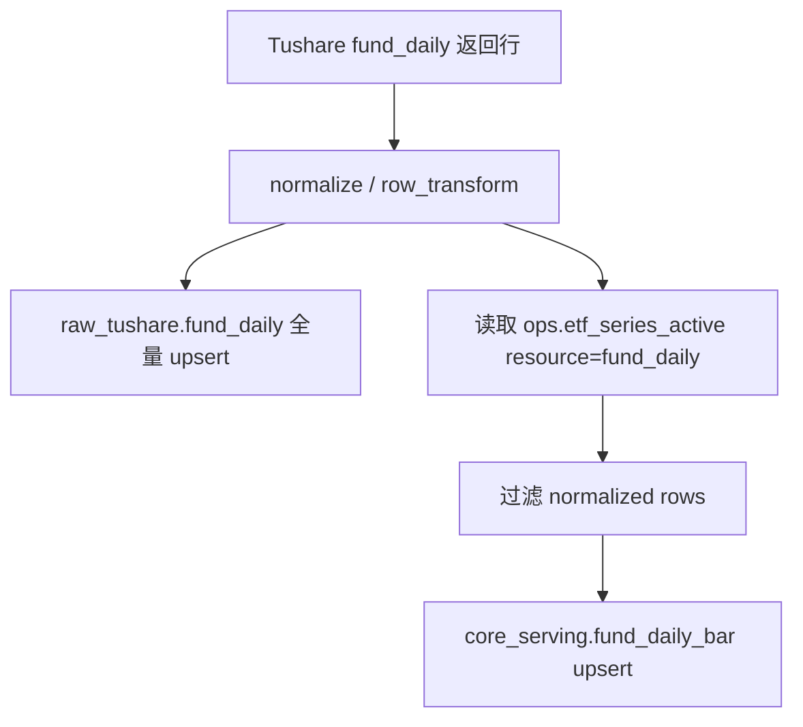
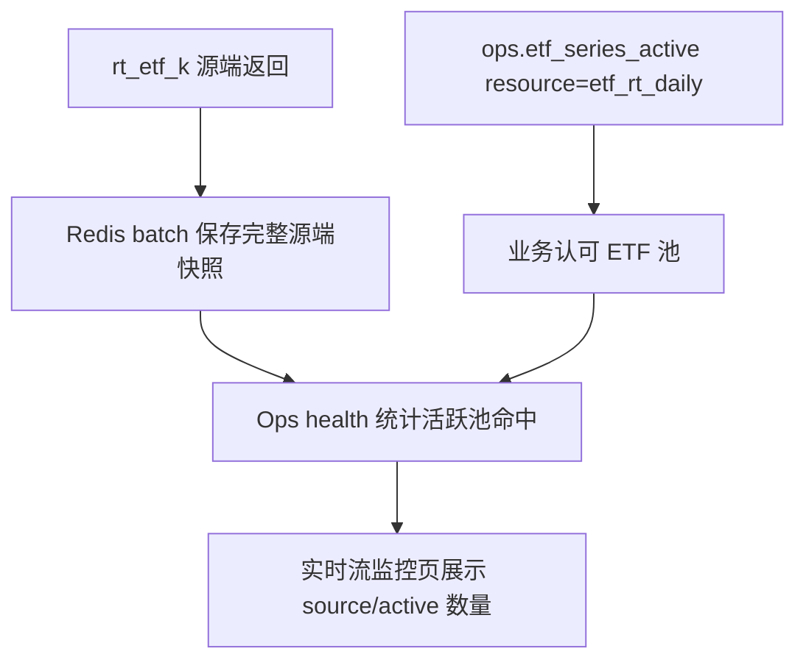

# ETF 活跃池低层设计 LLD v1

状态：历史旧机制 LLD / P3-P7 已完成运行时消费者迁移与 review 退场 / 待 P8 删除基础设施
创建日期：2026-06-18
最近审计：2026-08-28
上位方案：[ETF 活跃池设计方案 v1](/Users/congming/github/goldenshare/docs/architecture/etf-active-pool-design-plan-v1.md)
适用范围：`ops.etf_series_active` 历史机制与 P8 待删除基础设施；后续章节只记录旧 planner、writer、Health、monitor 和 review 的历史设计

> 关联实施方案：[ETF 基础信息重建与下游数据审计清理技术方案 v1](/Users/congming/github/goldenshare/docs/architecture/etf-basic-rebuild-and-downstream-data-audit-cleanup-plan-v1.md)；替代机制的编码设计见：[ETF 基础信息重建与下游数据审计清理 LLD v1](/Users/congming/github/goldenshare/docs/architecture/etf-basic-rebuild-and-downstream-data-audit-cleanup-low-level-design-v1.md)。新方案已经确认整套 `ops.etf_series_active` 机制退场。P3-P7 已迁移三个 planner、`fund_daily` writer、实时 Health 和 monitor，并删除旧 cleanup 与 review；本文后续章节只记录 2026-06 的初始落地过程，当前剩余基础设施以第 0 节为准。

---

## 0. 2026-08-28 当前实现校准

当前资源白名单已经从初始两个扩展为五个：

```text
fund_daily
etf_mins
etf_rt_daily
etf_sh_cons
etf_sz_cons
```

当前运行链必须按用途区分：

1. `etf_mins/etf_sh_cons/etf_sz_cons`：P3 已改用 Basic selector，旧 resource 行仍存在但不再展开请求。
2. `fund_daily`：请求仍按 `trade_date` 拉源端全集；P4 已改为 Raw 独立提交、Serving 由 Basic selector 与上市日过滤，旧 cleanup/CLI 与旧 review 均已删除。
3. `etf_rt_daily`：provider 固定请求 `5*.SH`、`1*.SZ`；P5/P6 已将 Health、监控候选和运行时资格改用 Basic selector，P7 已删除旧 review。
4. `fund_adj/etf_share_size/etf_basic`：不读取激活池展开请求。
5. P2 已提供统一 Basic selector，P3-P7 已迁移或删除全部运行时消费者；P8 才允许删除 model、DAO、contract、adapter、seed、CLI 和数据库表。
6. `etf_rt_min` 尚未形成正式 DatasetDefinition、collector 或激活池 resource，不属于本次现行消费者迁移。

具体逐 resource 替代映射、raw/serving 永久边界和删除门禁以新方案第 7、8、12、15 节为准。本文第 2 节中的“初始 resource”以及后续 1,395 固定池描述只记录原始实施，不得继续扩展成目标态。

---

## 1. 本文目标

本文把 ETF 活跃池方案细化到代码级别，并记录当前已落地实现边界。

本文回答：

1. 哪些文件要新增或修改。
2. 每个文件承载什么职责。
3. `fund_daily` raw 与 serving 的写入链路如何改变。
4. 初始化、清理、Ops 只读展示、测试门禁如何落地。
5. 实时 ETF V1 如何使用活跃池统计命中。

本文不直接改变代码实现；如代码继续演进，必须同步更新本文，避免旧计划口径误导后续开发。

---

## 2. 已确认口径

| 项 | 口径 |
|---|---|
| 活跃池表 | `ops.etf_series_active` |
| 主键 | `(resource, ts_code)` |
| 初始 resource | `fund_daily`、`etf_rt_daily` |
| 初始池文件 | `reports/etf_series_active_seed_1395_20260617.csv` |
| 初始数量 | 每个 resource `1395` 条 |
| accepted gaps 文件 | `reports/etf_series_active_fund_daily_accepted_gaps_31_20260617.csv` |
| `.OF` 代码 | 不进入 ETF 活跃池 |
| raw 行为 | `raw_tushare.fund_daily` 完整保存源端事实 |
| serving 行为 | `core_serving.fund_daily_bar` 只保留 `resource='fund_daily'` 活跃池内 ETF |
| 实时 ETF 行为 | Redis 保存源端完整批次；当前 V1 Ops health 按 `resource='etf_rt_daily'` 统计命中，业务 snapshot API 尚未开放 |
| Ops 审查中心 | V1 只读，不做手工新增/删除 |

---

## 3. 2026-06 实施前代码事实（历史审计）

### 3.1 指数活跃池可借鉴但不能复用

2026-06 设计时的指数活跃池实现链路：

| 代码点 | 当前职责 |
|---|---|
| `src/ops/models/ops/index_series_active.py` | ORM：`ops.index_series_active` |
| `src/foundation/kernel/contracts/index_series_active_store.py` | foundation contract |
| `src/foundation/dao/index_series_active_dao.py` | foundation DAO，通过 SQL 读写 `ops.index_series_active`，不 import ops ORM |
| `src/foundation/dao/factory.py` | 暴露 `self.index_series_active` |
| `src/ops/index_series_active_store_adapter.py` | ops adapter |
| `src/ops/queries/review_center_query_service.py` | 审查中心指数激活池查询 |
| `src/ops/services/review_center_service.py` | 审查中心指数激活池新增/删除 |
| `src/ops/api/review_center.py` | `/ops/review/index/active*` API |
| `frontend/src/pages/ops-v21-review-index-page.tsx` | 指数激活池前端页，包含新增/删除交互 |

ETF 只能借鉴结构，不能复用 `ops.index_series_active`，也不能复用指数页面的写操作。

### 3.2 `fund_daily` 实施前写入链路

设计时 `fund_daily` 定义位于：

```text
src/foundation/datasets/definitions/market_fund.py
```

实施前关键配置：

```python
'storage': {
    'raw_dao_name': 'raw_fund_daily',
    'core_dao_name': 'fund_daily_bar',
    'target_table': 'core_serving.fund_daily_bar',
    'delivery_mode': 'single_source_serving',
    'layer_plan': 'raw->serving',
    'serving_table': 'core_serving.fund_daily_bar',
    'raw_table': 'raw_tushare.fund_daily',
    'conflict_columns': None,
    'write_path': 'raw_core_upsert',
}
```

`DatasetWriter` 对 `raw_core_upsert` 的当前行为：

```text
batch.rows_normalized
  -> raw_tushare.fund_daily
  -> core_serving.fund_daily_bar
```

也就是说，现在 serving 没有 ETF 活跃池门禁。

### 3.3 `fund_daily` 两张表

| 层 | ORM | 表 | 主键 |
|---|---|---|---|
| raw | `src/foundation/models/raw/raw_fund_daily.py::RawFundDaily` | `raw_tushare.fund_daily` | `(ts_code, trade_date)` |
| serving | `src/foundation/models/core/fund_daily_bar.py::FundDailyBar` | `core_serving.fund_daily_bar` | `(ts_code, trade_date)` |

serving 字段 `change_amount` 来自源端字段 `change`，转换点：

```text
src/foundation/ingestion/row_transforms.py::_fund_daily_row_transform
```

LLD 不修改源端请求、不修改字段转换，只改变 serving 入池范围。

---

## 4. 目标链路

### 4.1 `fund_daily` 写入目标链路



硬规则：

1. raw 全量写，不按活跃池过滤。
2. serving 只写活跃池内 `ts_code`。
3. 活跃池外行不是 reject，不进入 `rows_rejected`。
4. 活跃池外行已经写入 raw 后，不允许因为 serving 过滤而回滚 raw。
5. 活跃池为空时 serving 写入 `0` 行，不 fallback 到 `etf_basic` 或源端全量。

### 4.2 实时 ETF 读取目标链路



硬规则：

1. Redis 不裁剪源端快照。
2. 当前 V1 不提供业务 ETF snapshot API；实时流监控页只展示源端批次数量和 `etf_rt_daily` 活跃池命中数量。
3. 如果后续新增业务 API 或业务页面，才按 `etf_rt_daily` 池过滤返回 items；活跃池为空时返回明确空结果或结构化错误，不能 fallback 展示源端全量。

---

## 5. 数据库与模型设计

### 5.1 Alembic migration

新增文件：

```text
alembic/versions/20260618_000117_add_etf_series_active.py
```

实施前必须重新确认真实 head：

```bash
uv run alembic heads
```

当前已知 head：

```text
20260602_000116
```

如果开发时 head 已变化，`down_revision` 必须接开发时的真实 head，不得按本文日期猜。

迁移内容：

```python
revision = "20260618_000117"
down_revision = "20260602_000116"
```

```python
def upgrade() -> None:
    op.execute("CREATE SCHEMA IF NOT EXISTS ops")
    op.create_table(
        "etf_series_active",
        sa.Column("resource", sa.String(length=64), nullable=False),
        sa.Column("ts_code", sa.String(length=16), nullable=False),
        sa.Column("first_seen_date", sa.Date(), nullable=False),
        sa.Column("last_seen_date", sa.Date(), nullable=False),
        sa.Column("last_checked_at", sa.DateTime(timezone=True), nullable=False),
        sa.Column("created_at", sa.DateTime(timezone=True), nullable=False, server_default=sa.text("now()")),
        sa.Column("updated_at", sa.DateTime(timezone=True), nullable=False, server_default=sa.text("now()")),
        sa.PrimaryKeyConstraint("resource", "ts_code", name="pk_etf_series_active"),
        schema="ops",
    )
    op.create_index("idx_etf_series_active_resource", "etf_series_active", ["resource"], schema="ops")
    op.create_index(
        "idx_etf_series_active_resource_last_seen",
        "etf_series_active",
        ["resource", "last_seen_date"],
        schema="ops",
    )
```

`downgrade()` 只 drop 本表和本表索引，不触碰 `raw_tushare.fund_daily`、`core_serving.fund_daily_bar`、`ops.index_series_active`。

### 5.2 ORM

新增：

```text
src/ops/models/ops/etf_series_active.py
```

结构与 `IndexSeriesActive` 对齐：

```python
class EtfSeriesActive(TimestampMixin, Base):
    __tablename__ = "etf_series_active"
    __table_args__ = (
        Index("idx_etf_series_active_resource", "resource"),
        Index("idx_etf_series_active_resource_last_seen", "resource", "last_seen_date"),
        {"schema": "ops"},
    )

    resource: Mapped[str] = mapped_column(String(64), primary_key=True)
    ts_code: Mapped[str] = mapped_column(String(16), primary_key=True)
    first_seen_date: Mapped[date] = mapped_column(Date, nullable=False)
    last_seen_date: Mapped[date] = mapped_column(Date, nullable=False)
    last_checked_at: Mapped[datetime] = mapped_column(DateTime(timezone=True), nullable=False)
```

注册点：

```text
src/app/model_registry.py
```

增加：

```python
"src.ops.models.ops.etf_series_active",
```

测试 SQLite 建表入口：

```text
tests/web/conftest.py
```

如果该文件当前显式创建 ops 表，需要加入：

```python
EtfSeriesActive.__table__.create(connection, checkfirst=True)
```

---

## 6. Foundation contract 与 DAO

### 6.1 Contract

新增：

```text
src/foundation/kernel/contracts/etf_series_active_store.py
```

内容：

```python
class EtfSeriesActiveStore(Protocol):
    def list_active_codes(self, resource: str) -> list[str]:
        ...

    def upsert_seen_codes(
        self,
        resource: str,
        latest_seen_by_code: dict[str, date],
        checked_at: datetime | None = None,
    ) -> int:
        ...
```

说明：

1. contract 放 foundation，因为 ingestion writer 和实时业务读取层需要面向抽象取池。
2. contract 不 import ops。
3. V1 seed 可用 DAO 直接写；`upsert_seen_codes` 为后续受控 refresh 预留，但本次不做自动 refresh。

### 6.2 DAO

新增：

```text
src/foundation/dao/etf_series_active_dao.py
```

实现方式：

1. 使用 SQLAlchemy `text()` 直接访问 `ops.etf_series_active`。
2. 不 import `src.ops.models.ops.etf_series_active`。
3. 对外方法与 `IndexSeriesActiveDAO` 保持一致。

关键 SQL：

```sql
SELECT ts_code
FROM ops.etf_series_active
WHERE resource = :resource
ORDER BY ts_code
```

Upsert SQL：

```sql
INSERT INTO ops.etf_series_active (
  resource,
  ts_code,
  first_seen_date,
  last_seen_date,
  last_checked_at
) VALUES (
  :resource,
  :ts_code,
  :seen_date,
  :seen_date,
  :last_checked_at
)
ON CONFLICT (resource, ts_code) DO UPDATE
SET first_seen_date = LEAST(ops.etf_series_active.first_seen_date, EXCLUDED.first_seen_date),
    last_seen_date = GREATEST(ops.etf_series_active.last_seen_date, EXCLUDED.last_seen_date),
    last_checked_at = EXCLUDED.last_checked_at,
    updated_at = NOW()
```

### 6.3 DAOFactory

修改：

```text
src/foundation/dao/factory.py
```

新增 import：

```python
from src.foundation.dao.etf_series_active_dao import EtfSeriesActiveDAO
```

新增属性：

```python
self.etf_series_active = EtfSeriesActiveDAO(session)
```

放置位置建议紧邻：

```python
self.index_series_active = IndexSeriesActiveDAO(session)
```

---

## 7. Ops store adapter

新增：

```text
src/ops/etf_series_active_store_adapter.py
```

用途：

1. Ops 侧需要 ORM 能力时使用。
2. 与 `OpsIndexSeriesActiveStore` 对齐。
3. V1 不在页面上暴露新增/删除，但 seed service 或后续审查服务可复用。

实现：

```python
class OpsEtfSeriesActiveStore(EtfSeriesActiveStore):
    def __init__(self, session: Session) -> None:
        self.session = session

    def list_active_codes(self, resource: str) -> list[str]:
        stmt = (
            select(EtfSeriesActive.ts_code)
            .where(EtfSeriesActive.resource == resource)
            .order_by(EtfSeriesActive.ts_code)
        )
        return list(self.session.scalars(stmt))
```

`upsert_seen_codes()` 与指数 adapter 同形，使用 PostgreSQL `insert().on_conflict_do_update()`。

---

## 8. Seed 初始化设计

### 8.1 Seed service

新增：

```text
src/ops/services/etf_series_active_seed_service.py
```

职责：

1. 读取 `reports/etf_series_active_seed_1395_20260617.csv`。
2. 校验 seed 文件字段和数据质量。
3. 只写指定 `resource`。
4. 默认 dry-run，不写库。
5. `--apply` 时写入 `ops.etf_series_active`。
6. 已存在行跳过，不覆盖。

输入参数：

```python
def run(
    self,
    session: Session,
    *,
    resource: str,
    seed_csv_path: Path,
    dry_run: bool = True,
) -> EtfSeriesActiveSeedReport:
```

`resource` 只允许：

```python
{"fund_daily", "etf_rt_daily"}
```

### 8.2 Seed CSV 校验

必须校验：

1. 文件存在。
2. 至少包含 `ts_code`。
3. 行数为 `1395`。
4. `ts_code` 去重后仍为 `1395`。
5. `ts_code` 只允许 `.SH` / `.SZ`。
6. 不允许 `.OF`。
7. 如果有 `selection_group`，只能是 `complete_1364` 或 `accepted_low_gap_liquid_31`。
8. 必须使用 `latest_matched_trade_date` 作为 `first_seen_date/last_seen_date` 的来源；该字段当前 1395 行都有值。
9. 不使用 `latest_trade_date` 作为 seed 日期来源；该字段当前只有低缺口高成交的 31 行有值，不能支撑完整初始化。

建议字段映射：

| 目标字段 | 来源 |
|---|---|
| `resource` | CLI 参数 |
| `ts_code` | CSV `ts_code` |
| `first_seen_date` | CSV `latest_matched_trade_date`，无值则拒绝 |
| `last_seen_date` | CSV `latest_matched_trade_date`，无值则拒绝 |
| `last_checked_at` | 当前 UTC 时间 |

### 8.3 Seed report

新增 dataclass：

```python
@dataclass(frozen=True, slots=True)
class EtfSeriesActiveSeedReport:
    dry_run: bool
    resource: str
    seed_csv_path: str
    candidate_count: int
    created_count: int
    skipped_count: int
    invalid_count: int
```

dry-run 时：

1. `candidate_count=1395`。
2. `created_count` 表示库里当前缺失的数量。
3. 不调用 `session.commit()`。

apply 时：

1. 插入缺失行。
2. 已存在行跳过。
3. 不覆盖 `first_seen_date/last_seen_date`。

### 8.4 CLI

修改：

```text
src/cli.py
src/cli_parts/ops_handlers.py
```

新增命令：

```bash
goldenshare ops-seed-etf-series-active \
  --resource fund_daily \
  --from-seed-csv reports/etf_series_active_seed_1395_20260617.csv
```

默认 dry-run。写库必须：

```bash
goldenshare ops-seed-etf-series-active \
  --resource fund_daily \
  --from-seed-csv reports/etf_series_active_seed_1395_20260617.csv \
  --apply
```

初始化两个 resource 需要执行两次：

```bash
goldenshare ops-seed-etf-series-active --resource fund_daily --from-seed-csv reports/etf_series_active_seed_1395_20260617.csv --apply
goldenshare ops-seed-etf-series-active --resource etf_rt_daily --from-seed-csv reports/etf_series_active_seed_1395_20260617.csv --apply
```

不设计 `--all`，避免误以为后续新增 resource 也会自动写入。

---

## 9. `fund_daily` serving 过滤设计

### 9.1 DatasetDefinition 修改

修改：

```text
src/foundation/datasets/definitions/market_fund.py
```

将 `fund_daily.storage.write_path` 从：

```python
"raw_core_upsert"
```

改为：

```python
"raw_fund_daily_etf_active_serving_upsert"
```

同时保留：

```python
raw_table = "raw_tushare.fund_daily"
serving_table = "core_serving.fund_daily_bar"
```

不修改：

1. `request_builder_key`
2. `source_fields`
3. `date_model`
4. `input_model`
5. `normalization`
6. `row_transform_name`

### 9.2 DatasetWriter 分支

修改：

```text
src/foundation/ingestion/writer.py
```

在现有 write path 分发处新增：

```python
if definition.storage.write_path == "raw_fund_daily_etf_active_serving_upsert":
    return self._write_fund_daily_etf_active_serving(
        definition=definition,
        batch=batch,
        raw_dao=raw_dao,
        core_dao=core_dao,
    )
```

新增方法：

```python
def _write_fund_daily_etf_active_serving(
    self,
    *,
    definition: DatasetDefinition,
    batch: NormalizedBatch,
    raw_dao,
    core_dao,
) -> WriteResult:
```

### 9.3 Writer 具体逻辑

伪代码：

```python
if not batch.rows_normalized:
    return WriteResult(... rows_written=0 ...)

raw_rows = self._coerce_rows_for_dao(batch.rows_normalized, raw_dao)
raw_dao.bulk_upsert(raw_rows)

active_codes = set(self.dao.etf_series_active.list_active_codes("fund_daily"))
serving_rows = [
    row for row in batch.rows_normalized
    if str(row.get("ts_code") or "").strip().upper() in active_codes
]

rows_written = 0
if serving_rows:
    core_rows = self._coerce_rows_for_dao(serving_rows, core_dao)
    rows_written = core_dao.bulk_upsert(core_rows)

return WriteResult(
    rows_written=rows_written,
    rows_upserted=rows_written,
    rows_skipped=batch.rows_rejected,
    conflict_strategy="fund_daily_etf_active_gate",
)
```

注意：

1. 活跃池外行不是 reject。
2. `rows_written` 表示 serving 写入数，与现有 `index_daily_active_gate` 语义保持一致。
3. raw 写入失败才失败；serving 过滤为空不是失败。
4. 活跃池为空时不 fallback。
5. 不在这里修改 `TaskRun` 文案，避免越界。

### 9.4 Writer helper

建议新增：

```python
def _resolve_active_etf_codes(self, resource: str = "fund_daily") -> set[str]:
    return {code.strip().upper() for code in self.dao.etf_series_active.list_active_codes(resource)}
```

```python
@staticmethod
def _filter_fund_daily_rows_by_active_pool(
    *,
    rows: list[dict],
    active_codes: set[str],
) -> list[dict]:
    return [
        row for row in rows
        if str(row.get("ts_code") or "").strip().upper() in active_codes
    ]
```

---

## 10. Serving 清理收口设计

### 10.1 清理 service

新增：

```text
src/ops/services/etf_fund_daily_serving_cleanup_service.py
```

职责：

1. dry-run 统计 `core_serving.fund_daily_bar` 中活跃池外数据。
2. 生成 dry-run CSV 报告。
3. apply 时只删除 dry-run 确认范围内的 serving 行。
4. 绝不修改 raw。

### 10.2 前置检查

执行前必须检查没有运行中的 `fund_daily` TaskRun：

```sql
SELECT count(*)
FROM ops.task_run
WHERE resource_key = 'fund_daily'
  AND status IN ('queued', 'running', 'canceling')
```

如果结果大于 `0`，直接拒绝清理。

### 10.3 Dry-run SQL

```sql
WITH active AS (
  SELECT ts_code
  FROM ops.etf_series_active
  WHERE resource = 'fund_daily'
)
SELECT
  b.ts_code,
  MIN(b.trade_date) AS min_trade_date,
  MAX(b.trade_date) AS max_trade_date,
  COUNT(*) AS row_count
FROM core_serving.fund_daily_bar b
LEFT JOIN active a ON a.ts_code = b.ts_code
WHERE a.ts_code IS NULL
GROUP BY b.ts_code
ORDER BY row_count DESC, b.ts_code ASC
```

输出：

```text
reports/etf_fund_daily_serving_out_of_active_pool_dry_run_<yyyymmdd>.csv
```

字段：

```text
ts_code,min_trade_date,max_trade_date,row_count
```

### 10.4 Apply SQL

apply 必须传入 dry-run 报告路径：

```bash
goldenshare ops-cleanup-etf-fund-daily-serving \
  --apply \
  --confirm-report reports/etf_fund_daily_serving_out_of_active_pool_dry_run_<yyyymmdd>.csv
```

apply 不重新扩大范围，只按 `confirm-report` 中的 `ts_code` 删除：

```sql
DELETE FROM core_serving.fund_daily_bar b
WHERE b.ts_code = ANY(:confirmed_ts_codes)
  AND NOT EXISTS (
    SELECT 1
    FROM ops.etf_series_active a
    WHERE a.resource = 'fund_daily'
      AND a.ts_code = b.ts_code
  )
```

删除后复核：

```sql
SELECT count(*)
FROM core_serving.fund_daily_bar b
WHERE NOT EXISTS (
  SELECT 1
  FROM ops.etf_series_active a
  WHERE a.resource = 'fund_daily'
    AND a.ts_code = b.ts_code
)
```

必须为 `0`。

### 10.5 Cleanup CLI

新增命令：

```bash
goldenshare ops-cleanup-etf-fund-daily-serving
```

默认 dry-run：

```bash
goldenshare ops-cleanup-etf-fund-daily-serving \
  --output reports/etf_fund_daily_serving_out_of_active_pool_dry_run_<yyyymmdd>.csv
```

写库必须显式：

```bash
goldenshare ops-cleanup-etf-fund-daily-serving \
  --apply \
  --confirm-report reports/etf_fund_daily_serving_out_of_active_pool_dry_run_<yyyymmdd>.csv
```

硬规则：

1. 不提供 `--force`。
2. 不支持直接传 SQL。
3. 不支持清理 raw。
4. 不支持清理 `ops.etf_series_active`。

---

## 11. Accepted gaps 处理

### 11.1 本仓处理范围

accepted gaps 文件：

```text
reports/etf_series_active_fund_daily_accepted_gaps_31_20260617.csv
```

本仓 V1 只做形状与一致性校验，不把它写入数据库。

原因：

1. 它描述的是完整性检查豁免事实，不是业务行情事实。
2. 它不能生成伪造行情行。
3. DG / Dagster 侧消费方式应在 lake 侧另行落地，不能混入 Web ingestion writer。

### 11.2 校验脚本或测试

新增测试：

```text
tests/test_etf_active_pool_seed_reports.py
```

必须验证：

1. seed 文件存在且 `1395` 行。
2. accepted gaps 文件存在。
3. accepted gaps 覆盖 `31` 个 distinct `ts_code`。
4. accepted gaps 总行数为 `65`。
5. accepted gaps 中每个 `ts_code` 都存在于 seed 文件。
6. accepted gaps 的 `resource` 固定为 `fund_daily`。
7. seed 文件中不包含 `.OF`。

---

## 12. ETF 实时日线接入点

`rt_etf_k` provider 已在实时主线接入。当前 V1 的活跃池用途是供 Ops health 统计源端批次与业务池命中，不提供业务 snapshot API。

当前实时 ETF 主线必须：

1. Redis batch 保存源端完整代码集合。
2. Ops health 读取活跃池：

```python
active_codes = etf_series_active_store.list_active_codes("etf_rt_daily")
```

3. health 展示：
   - `source_snapshot_count`
   - `active_pool_count`
   - `active_snapshot_count`
4. 后续若新增业务 snapshot API，返回 items 时只保留 `active_codes` 内代码。

不得：

1. 在 provider 请求阶段按活跃池裁剪。
2. 把 `etf_rt_daily` 写入 `ops.index_series_active`。
3. 在 Redis key 中嵌入活跃池版本。

---

## 13. Ops 审查中心只读 API

### 13.1 Schema

修改：

```text
src/ops/schemas/review_center.py
```

新增：

```python
class ReviewActiveEtfItem(BaseModel):
    resource: str
    ts_code: str
    csname: str | None = None
    extname: str | None = None
    cname: str | None = None
    exchange: str | None = None
    etf_type: str | None = None
    list_date: date | None = None
    list_status: str | None = None
    latest_fund_daily_date: date | None = None
    data_status: str
    first_seen_date: date
    last_seen_date: date
    last_checked_at: datetime
```

```python
class ReviewActiveEtfListResponse(BaseModel):
    total: int
    items: list[ReviewActiveEtfItem]
```

```python
class ReviewActiveEtfSummaryResponse(BaseModel):
    active_count: int
    fund_daily_available_count: int
    pending_count: int
```

### 13.2 Query service

修改：

```text
src/ops/queries/review_center_query_service.py
```

新增：

```python
def list_active_etfs(
    self,
    session: Session,
    *,
    resource: str = "fund_daily",
    keyword: str | None = None,
    data_status: str | None = None,
    page: int = 1,
    page_size: int = 50,
) -> ReviewActiveEtfListResponse:
```

查询来源：

| 信息 | 表 |
|---|---|
| 活跃池 | `ops.etf_series_active` |
| ETF 基础信息 | `raw_tushare.etf_basic` 或当前 EtfBasic 对应 ORM |
| 最新日线日期 | `core_serving.fund_daily_bar` |

`data_status` V1：

| 值 | 语义 |
|---|---|
| `complete` | 该 ETF 在 serving 中已有至少一条日线 |
| `unsynced` | 该 ETF 在 serving 中没有任何日线 |
| `pending` | 等同 `unsynced`，用于页面筛选兼容 |

注意：

1. 不判断 accepted gaps。
2. 不判断每日完整性。
3. 不提供新增/删除候选。

### 13.3 API

修改：

```text
src/ops/api/review_center.py
```

新增只读 endpoint：

```python
@router.get("/ops/review/etf/active", response_model=ReviewActiveEtfListResponse)
def list_active_etfs(...):
```

```python
@router.get("/ops/review/etf/active/summary", response_model=ReviewActiveEtfSummaryResponse)
def get_active_etf_summary(...):
```

默认 `resource`：

```text
fund_daily
```

允许资源：

```text
fund_daily
etf_rt_daily
```

不新增：

1. `POST /ops/review/etf/active`
2. `DELETE /ops/review/etf/active/{ts_code}`
3. candidates API

---

## 14. 前端只读页面

### 14.1 路由与菜单

新增页面：

```text
frontend/src/pages/ops-v21-review-etf-page.tsx
```

修改路由：

```text
frontend/src/app/router.tsx
```

新增：

```text
/ops/v21/review/etf
```

修改菜单：

```text
frontend/src/app/shell.tsx
```

在审查中心下新增：

```text
ETF
```

### 14.2 API 类型

修改：

```text
frontend/src/shared/api/types.ts
```

新增：

```ts
export interface OpsReviewActiveEtfResponse { ... }
export interface OpsReviewActiveEtfSummaryResponse { ... }
```

### 14.3 页面行为

页面标题：

```text
审查中心 · ETF 活跃池
```

V1 展示：

1. resource 选择：`fund_daily`、`etf_rt_daily`
2. 统计卡：活跃 ETF、日线可用、待处理
3. 筛选：关键词、状态
4. 表格列：
   - `ts_code`
   - ETF 名称
   - 交易所
   - ETF 类型
   - 上市状态
   - 最新日线日期
   - 池内时间
   - 状态

明确不展示：

1. 加入 ETF 按钮。
2. 移出 ETF 按钮。
3. 候选搜索弹窗。

可以参考 `ops-v21-review-index-page.tsx` 的布局，但必须删除 mutation 相关交互。

---

## 15. 测试设计

### 15.1 模型与迁移

新增：

```text
tests/test_etf_series_active_model.py
```

覆盖：

1. `EtfSeriesActive.__table__.schema == "ops"`。
2. 主键为 `resource, ts_code`。
3. 存在 `first_seen_date,last_seen_date,last_checked_at`。
4. model registry 包含 `src.ops.models.ops.etf_series_active`。
5. migration `down_revision` 接真实 head。

### 15.2 DAO / store

新增：

```text
tests/test_etf_series_active_dao.py
```

覆盖：

1. `list_active_codes("fund_daily")` 按 `ts_code` 排序返回。
2. `upsert_seen_codes()` 新增行。
3. 重复 upsert 更新 `last_seen_date/last_checked_at`，不重复插入。
4. `resource` 隔离：`fund_daily` 与 `etf_rt_daily` 同 code 可并存。

### 15.3 Seed CLI / service

新增：

```text
tests/test_etf_series_active_seed_service.py
tests/test_cli_ops_seed_etf_series_active.py
```

覆盖：

1. dry-run 不写库。
2. apply 写入指定 resource。
3. 重复 apply 跳过已存在。
4. `.OF` 出现在 seed 时拒绝。
5. 非 `.SH/.SZ` 拒绝。
6. 行数不是 `1395` 拒绝。
7. `resource` 非 `fund_daily/etf_rt_daily` 拒绝。

### 15.4 `fund_daily` writer

新增或扩展：

```text
tests/test_dataset_writer_fund_daily_active_pool.py
```

测试场景：

1. 源端返回 3 行，活跃池 2 个 code：raw 写 3 行，serving 写 2 行。
2. 活跃池外 code 只进 raw，不进 serving，不计入 reject。
3. 活跃池为空：raw 写入，serving 写 0，不能 fallback 到 etf_basic。
4. `.OF` code 即使源端返回，也只能写 raw，不能进 serving。
5. duplicate conflict diagnostics 只针对 serving rows，不把活跃池外行标成冲突。

### 15.5 Serving cleanup

新增：

```text
tests/test_etf_fund_daily_serving_cleanup_service.py
tests/test_cli_ops_cleanup_etf_fund_daily_serving.py
```

覆盖：

1. dry-run 输出活跃池外 code 聚合报告。
2. running/queued/canceling 的 `fund_daily` TaskRun 存在时拒绝。
3. apply 只删除 `confirm-report` 里的活跃池外 serving 行。
4. apply 后 raw 行数不变。
5. active pool 内 serving 行不变。
6. 没有 `--confirm-report` 时拒绝 apply。

### 15.6 Ops API / 前端

后端：

```text
tests/web/test_ops_review_etf_active_api.py
```

覆盖：

1. 非管理员拒绝。
2. list 返回 ETF 活跃池列表。
3. summary 统计正确。
4. `resource` 只能是 `fund_daily/etf_rt_daily`。
5. 不存在 POST/DELETE ETF active API。

前端：

```text
frontend/src/pages/ops-v21-review-etf-page.test.tsx
```

覆盖：

1. 页面读取 summary 和 list API。
2. resource 切换生效。
3. 关键词和状态筛选写入 URL search。
4. 页面不渲染“加入/移出/候选”操作。
5. 菜单存在 ETF 入口。

### 15.7 架构护栏

必须补充或验证：

```bash
uv run pytest -q tests/architecture/test_subsystem_dependency_matrix.py
uv run pytest -q tests/architecture/test_platform_legacy_guardrails.py
uv run pytest -q tests/architecture/test_operations_legacy_guardrails.py
```

静态检查：

```bash
rg -n "ops\\.index_series_active" src tests
```

允许命中指数已有代码；ETF 新代码不得写入指数表。

```bash
rg -n "EtfSeriesActive|etf_series_active" src/platform src/operations
```

必须无结果。

---

## 16. 开发里程碑

### M2：建表与 DAO

改动：

1. Alembic migration。
2. `EtfSeriesActive` ORM。
3. model registry。
4. foundation contract。
5. foundation DAO。
6. DAOFactory。
7. Ops adapter。

验收：

1. 模型/迁移测试通过。
2. DAO/store 测试通过。
3. 架构护栏通过。

### M3：初始化 CLI

改动：

1. seed service。
2. CLI handler。
3. CLI command。
4. seed report 测试。
5. accepted gaps report 形状测试。

验收：

1. dry-run 不写库。
2. apply 单 resource 写入 `1395`。
3. 两个 resource 分别写入后总行数 `2790`。
4. `.OF` 不入池。

### M4：`fund_daily` serving 过滤与清理

改动：

1. `fund_daily.storage.write_path`。
2. `DatasetWriter` 新写入路径。
3. writer 测试。
4. serving cleanup service。
5. cleanup CLI。

验收：

1. raw 全量保存。
2. serving 只写活跃池。
3. cleanup dry-run 先出报告。
4. apply 只删除 serving 活跃池外行。
5. raw 行数不变。

### M5：实时 ETF 主线接入

改动：

1. 实时 ETF 读取层接入 `etf_rt_daily`。
2. health 展示源端数量和业务池命中数量。
3. V1 不新增业务 snapshot API。

验收：

1. Redis 源端 batch 不被裁剪。
2. Ops health 正确展示 `source_snapshot_count`、`active_pool_count`、`active_snapshot_count`。
3. 如果后续新增 Biz/API，再按活跃池过滤返回 items。

### M6：Ops 审查中心只读展示

改动：

1. 后端 schema/query/API。
2. 前端 page/router/menu/types。

验收：

1. 可查看 `fund_daily` 与 `etf_rt_daily`。
2. 不存在写操作。
3. 页面与后端测试通过。

---

## 17. 禁止事项

1. 禁止把 ETF 写入 `ops.index_series_active`。
2. 禁止修改 `fund_daily` 请求参数和分页策略。
3. 禁止过滤 `raw_tushare.fund_daily`。
4. 禁止把活跃池外行标记成 reject。
5. 禁止为 accepted gaps 生成伪造行情行。
6. 禁止在 Ops ETF 审查中心 V1 增加新增/删除按钮。
7. 禁止自动从同步任务更新 ETF 活跃池。
8. 禁止清理 `raw_tushare.fund_daily`。
9. 禁止清理 `ops.etf_series_active`。
10. 禁止把 `.OF` 纳入 `fund_daily` 或 `etf_rt_daily` 活跃池。

---

## 18. 交付对账清单

每个开发里程碑完成后必须逐项对账：

| 对账项 | 验收方式 |
|---|---|
| 表结构存在且主键正确 | migration/model test |
| seed 数量正确 | seed service test + CLI dry-run |
| `.OF` 未入池 | seed report test |
| raw 不裁剪 | writer test |
| serving 按活跃池过滤 | writer test + cleanup audit |
| 活跃池外行非 reject | writer result assertion |
| cleanup 不影响 raw | cleanup service test |
| Ops ETF V1 只读 | API route test + frontend test |
| ETF 不污染 index active | static rg + architecture test |
| 文档与代码一致 | `python3 scripts/check_docs_integrity.py` |

---

## 19. CodeGraph 分析记录

本 LLD 编写前已用 CodeGraph 覆盖以下范围：

1. `IndexSeriesActive` 模型、DAO、Ops adapter、审查中心 API 与页面消费。
2. `fund_daily` DatasetDefinition、request builder、raw/core ORM、row transform。
3. `DatasetWriter` 的 `raw_core_upsert` 与 `index_daily_active_gate` 写入模式。
4. `DAOFactory`、model registry、seed CLI 的现有实现形态。

结论：

1. ETF 活跃池应沿用指数活跃池的表形态和 contract/DAO 分层，但必须使用独立表。
2. `fund_daily` 不能继续使用无门禁的 `raw_core_upsert`，应新增显式 write path。
3. `core_serving.fund_daily_bar` 清理必须作为受控 Ops 操作，不得混进同步任务。
4. Ops ETF 审查中心必须新建只读链路，不能复用指数页的新增/删除逻辑。
