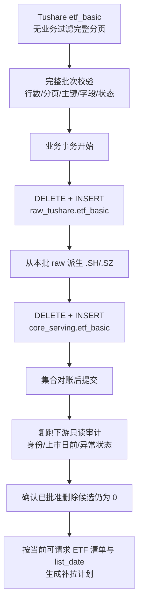

# ETF 基础信息重建与下游数据审计清理技术方案 v1

状态：核心业务口径 D1-D20 不变；LLD 已重新基线 / M0-M3 已完成（未执行生产重建）/ 原 M2-M8 执行序列作废，新版 M4-M12 尚未开始
创建日期：2026-08-28
最近审计：2026-08-28（M3/P3 已完成；`etf_mins/etf_sh_cons/etf_sz_cons` planner 已迁移至 ETF Basic Serving 并在切窗前按 `list_date` 裁剪；writer、Health、monitor 和 review 仍使用旧池，旧池基础设施未删除）
适用范围：`etf_basic`、ETF 下游历史数据、ETF 对象池、ETF 查询与运维消费者
低层设计：[ETF 基础信息重建与下游数据审计清理 LLD v1](/Users/congming/github/goldenshare/docs/architecture/etf-basic-rebuild-and-downstream-data-audit-cleanup-low-level-design-v1.md)

---

## 1. 结论

本方案可行，目标不是把旧 `.OF` 代码机械改名为 `.SH/.SZ`，而是重新建立一条清晰的数据身份链：

1. `raw_tushare.etf_basic` 完整保存 Tushare 当前返回的 ETF 基础信息快照。
2. `core_serving.etf_basic` 只发布真正供下游使用的沪深交易所 ETF，即 `.SH/.SZ`。
3. 凡源接口需要按 ETF 代码展开请求，其代码、上市状态和最早请求日期都必须来自 `core_serving.etf_basic`；支持按交易日一次拉取源端全集的接口继续使用全市场请求，不得为了“使用 Basic”退化成逐 ETF 请求。
4. 历史 `.OF` 别名不做改名、不与 `.SH/.SZ` 合并；当前下游未发现旧别名。若以后审计发现，先按精确范围另行评审，获批删除后再按交易所代码补拉缺失数据。
5. 当前 Prod 下游没有命中已确认删除口径的数据，因此不建设通用事实清理 CLI、删除 manifest 或 apply 工作流；首次重建后只复跑一次只读审计。代码消失或上市日期变晚只影响后续请求，不追溯删除既有历史。
6. `ops.etf_series_active` 整套激活池机制退场，不再作为任何 ETF 下游的上游或二次筛选条件。
7. `fund_daily`、`fund_adj`、`etf_share_size` 均保持源端全市场请求：`fund_daily` 的 raw 保存源端完整返回、ETF serving 受 ETF 主数据约束；`fund_adj` 的 raw/core 保存源端完整基金事实；`etf_share_size` 的 raw 与业务口径没有差异，继续采用 raw 单份存储和 serving 直出 view，不接入 ETF Basic 过滤。

最关键的实现变化是：`etf_basic` 不能继续使用当前“只 upsert、不删除旧主键”的写法，必须改成受控的完整快照替换。否则每天同步也无法删除源端已经消失的旧 `.OF` 和历史错误代码。

---

## 2. 目标与非目标

### 2.1 目标

1. 将生产 `etf_basic` 重建为与 Tushare 当前源端一致的 raw 快照。
2. 建立只含 `.SH/.SZ` 的 ETF serving 主数据。
3. 让 ETF 历史分钟请求从上市日开始，避免请求上市前不可能存在的数据。
4. 审计 ETF 下游中的旧代码、非交易所代码和当前上市日前数据；当前审计无已确认删除对象，因此本方案不实现通用下游清理能力。
5. 保证后续每日同步不会重新积累已经从源端消失的 ETF 主数据或重新走旧激活池口径。
6. 将 ETF 数据域与公募基金 `.OF` 数据域明确隔离。

### 2.2 非目标

1. 不把 `.OF` 历史行直接更新成 `.SH/.SZ`。
2. 不合并两个代码下的历史行情。
3. 不删除 `fund_basic`、`fund_manager`、`fund_share` 等公募基金域中的合法 `.OF` 数据。
4. 不凭名称相似度自动判定身份。
5. 不在本方案阶段执行生产删表、清表、回填或迁移。
6. 不引入 Kopia，也不使用旧 Lake 路径保存清理备份。

---

## 3. 依据与当前事实

### 3.1 P1 编码前代码事实与当前实现

当前 `etf_basic` 定义位于：

```text
src/foundation/datasets/definitions/reference_master.py
```

P1 编码前契约声明：

| 项 | P1 编码前值 |
|---|---|
| 日期模型 | `snapshot/master`，无业务日期输入 |
| raw 表 | `raw_tushare.etf_basic` |
| serving 表 | `core_serving.etf_basic` |
| 分页 | `offset_limit`，单页上限 `5000` |
| 写入路径 | `raw_core_upsert` |

问题在于 `src/foundation/ingestion/writer.py::_write_raw_and_core()` 对 raw 和 serving 都执行 `bulk_upsert()`。它能新增和更新当前返回行，但不会删除本次源端没有返回的旧主键，因此不具备快照替换语义。

M1 已按该问题落地：`etf_basic` 现在不暴露业务筛选，使用 `_etf_basic_snapshot_params` 和 `raw_etf_basic_snapshot_replace`；完整分页批次先经状态/后缀/交易所/主键/hash 校验，再在同一 unit 事务中重建 raw 和仅含 `.SH/.SZ` 的 serving，最后做集合与 hash 对账。生产快照尚未用该路径重建。

当前 ETF 历史分钟规划位于：

```text
src/foundation/ingestion/unit_planner.py::_resolve_etf_mins_targets()
src/foundation/ingestion/unit_planner.py::_build_etf_mins_units()
```

这条链路在 P3 开工前从 `ops.etf_series_active(resource='etf_mins')` 取代码，只校验 `.SH/.SZ`，没有读取 `etf_basic.list_date`。P3 已改为每次 plan 固定一份 ETF Basic 资格结果，并在切窗前把请求起点裁到上市日。

开工前还确认：`EtfBasicDAO` 当时的 `get_active_etfs()` 和 `get_fund_daily_candidates()` 没有 ingestion 主链调用者，所以当时没有数据集以 `etf_basic` 展开源请求。P2 已用语义准确的 selector 替换这两个无消费者旧方法，P3 已让三个代码驱动 planner 成为首批正式消费者。

### 3.1.1 P3 开工前请求驱动与激活池用途

`ops.etf_series_active` 是同一张物理表，主键为 `(resource, ts_code)`。`fund_daily` 和 `etf_mins` 使用同一套表与 DAO，也曾用同一份 1,395 只 ETF seed 初始化，但它们是两个独立 resource，后续集合可以不同，不能称为“同一批逻辑数据”。

P3 开工前白名单包含五个 resource，实际用途如下：

| resource / 数据集 | 当前是否由激活池展开源请求 | 当前真实用途 | 目标替代 |
|---|---|---|---|
| `etf_mins` | 是 | 从 `resource='etf_mins'` 取代码，再按代码、频率、时间窗口生成 unit | 当前可请求 ETF 清单 + `list_date` |
| `etf_sh_cons` | 是 | 从独立 `.SH` resource 取 ETF 代码生成申赎清单请求 | 当前可请求 ETF 清单中的 `.SH` |
| `etf_sz_cons` | 是 | 从独立 `.SZ` resource 取 ETF 代码生成申赎清单请求 | 当前可请求 ETF 清单中的 `.SZ` |
| `fund_daily` | 否 | 按 `trade_date` 拉源端当日全集；只在写 `core_serving.fund_daily_bar` 时读取 `resource='fund_daily'` 做白名单过滤 | 源请求保持按日全集；serving 改用当前可请求 ETF 清单 |
| `etf_rt_daily` | 否 | provider 固定请求 `5*.SH`、`1*.SZ`；激活池只用于 Ops health 的池总数和批次命中数 | 源请求保持通配符；health/业务候选改用当前可请求 ETF 清单 |

P3 完成后，前三个 resource 已不再被 DatasetDefinition 和 Foundation planner 读取；`fund_daily` 与 `etf_rt_daily` 的旧池消费仍按 M4-M7 的顺序保留。

同一组代码相关数据集中，以下三个当前完全不读取激活池，也不读取 `etf_basic` 展开请求：

| 数据集 | 当前请求方式 | 当前写入边界 |
|---|---|---|
| `fund_adj` | 按交易日请求源端基金全集，可选显式单代码 | 源端结果全部写 raw 和 `core.fund_adj_factor` |
| `etf_share_size` | 默认每个交易日一次全市场请求，可选显式单代码 | 源端结果全部写 raw；现有 serving view 只是 raw 直出 |
| `etf_basic` | 无业务日期的完整主数据快照请求 | M1 已改为 raw/serving 同事务完整快照替换；生产尚未执行重建 |

`etf_rt_min` 当前没有正式 DatasetDefinition、collector，也不在 `ETF_SERIES_ACTIVE_RESOURCES` 中；相关文档中的 `resource='etf_rt_min'` 只能视为待实施设计，不能计入现行激活池消费者。

### 3.2 Tushare 当前源端快照

以下数字是 2026-08-28 的实测快照，只作为本方案的审计证据，不得写成长期固定数量：

| 项 | 数量 |
|---|---:|
| `etf_basic` 总行数 | 1,825 |
| `.SH` | 1,030 |
| `.SZ` | 792 |
| `.OF` | 3 |
| 按本方案应进入 serving 的 `.SH/.SZ` | 1,822 |
| `list_date` 为空 | 49 |
| 其中 `P` | 41 |
| 其中 `L` | 8 |

当前 3 条 `.OF` 为：

```text
158008.OF
158038.OF
159070.OF
```

它们在 ETF 分钟接口中均未取得数据；对应的交易所代码存在于当前 `.SZ` 主数据中。因此：

1. raw 应原样保留这 3 条源端事实。
2. serving 不发布这 3 条 `.OF`。
3. 下游不把它们当作请求代码。

### 3.3 生产当前差异

2026-08-28 生产只读审计结果：

| 项 | 数量 |
|---|---:|
| 当前 prod `raw_tushare.etf_basic` | 3,405 |
| 当前 prod `core_serving.etf_basic` | 3,405 |
| prod 有、当前源端没有 | 1,585 |
| 其中旧 `.OF` | 1,582 |
| 其中历史 `J` 代码 | 3 |
| 当前源端有、prod 没有 | 5 |

1,585 条旧身份中，1,579 条可以按“相同六位数字 + 当前交易所代码”找到 `.SH/.SZ` 对应项。名称、设立日期、上市日期、管理人、托管人等字段也高度一致。这足以支持“源端代码体系发生了系统性规范化”的判断，但不能把它理解成可安全执行的数据库行改名。

### 3.4 下游当前污染情况

生产只读审计未发现上述 1,585 个旧代码已经进入以下 ETF 事实链：

```text
raw_tushare.etf_minute_bar
raw_tushare.etf_share_size
raw_tushare.etf_sh_cons
raw_tushare.etf_sz_cons
raw_tushare.fund_daily
core_serving.fund_daily_bar
raw_tushare.fund_adj
core.fund_adj_factor
ops.etf_series_active
```

因此当前主要污染集中在 `etf_basic` 本身。2026-08-28 进一步以当前 Tushare ETF Basic 为基准，对计划涉及的 Prod 下游做了精确只读审计：

| 对象 | 当前规模 | 非 `.SH/.SZ` | 不在当前源端 ETF Basic | 交易所身份冲突 | 已确认删除候选 |
|---|---:|---:|---:|---:|---:|
| `raw_tushare.etf_minute_bar` | 约 6,584 万行，1,395 个代码 | 0 | 0 | 0 | 0 |
| `raw_tushare.etf_sh_cons` | 5,675,323 行，803 个代码 | 0 | 0 | 0 | 0 |
| `raw_tushare.etf_sz_cons` | 11,567,504 行，720 个代码 | 0 | 0 | 0 | 0 |
| `core_serving.fund_daily_bar` | 1,180,869 行，1,395 个代码 | 0 | 0 | 0 | 0 |
| `ops.etf_realtime_monitor_pool` | 3 行 | - | 0 个无效配置 | - | 0 |
| `ops.etf_realtime_monitor_rule` | 0 条 ETF 规则 | - | 0 | - | 0 |

`core_serving.fund_daily_bar` 另有 2,091 行、3 个代码的事实日期早于**当前** `list_date`。在没有历史主数据版本的前提下，无法证明这是脏数据还是源端上市日后移/代码复用；按 D15 只报告、不删除。ETF 分钟表的同类精确候选为 0。

结论是：当前没有值得建设通用清理系统的删除量。`etf_basic` 重建后仍需复跑同一组只读统计，防止重建快照变化造成审计基准漂移；若届时出现非零的明确旧 `.OF` 身份候选，必须停下来按精确表和代码另立一次性处理方案，不能由本方案预置的通用删除程序自动处理。

`etf_index` 虽然名称带 ETF，但其 `ts_code` 语义是“基准指数代码”，不是“ETF 交易代码”。它通过 `etf_basic.index_code` 与 ETF 发生关系，不能拿 `etf_index.ts_code` 与 ETF 主数据的 `ts_code` 做差集清理，因此明确排除在本次代码身份清理之外。

公募基金域中还存在 `159002.OF`、`159004.OF`、`159006.OF` 等合法 B 类份额。它们不属于当前 ETF serving，也不进入 ETF 后续同步链路，但必须保留在公募基金基础、经理和份额等数据集中，不能被 ETF 清理规则误伤。

### 3.5 代码复用风险

只校验“代码是否仍在当前主数据中”还不够。实测发现：

1. `159908.SZ` 当前上市日期为 2018-12-10，但分钟源端可以返回 2011 年数据。
2. `510680.SH` 当前上市日期为 2015-12-15，但分钟源端可以返回 2013 年数据。

这说明同一个交易代码可能被历史产品使用过。以后新增请求必须同时使用执行时的 `list_date`，不能继续请求当时上市日前的区间；但既有历史不能仅凭当前 `list_date` 追溯删除，按 D15 处理。

---

## 4. 已确认口径

| 编号 | 已确认规则 |
|---|---|
| D1 | `raw_tushare.etf_basic` 是 Tushare 当前返回的完整快照，不主动过滤 `.OF`。 |
| D2 | `core_serving.etf_basic` 只包含当前 raw 中的 `.SH/.SZ` 行。 |
| D3 | 首次重建采用“先完整取数并校验，再在一个业务事务内先删后写”的方式；不得先清空数据库再请求源端。 |
| D4 | `.OF` 不改名、不合并；当前下游旧 `.OF` 候选为 0。以后若在 ETF 专用代码拉取结果或需要 ETF 主数据对齐的 serving 中发现旧 `.OF`，必须按精确表和代码另行评审，获批后删除并按 `.SH/.SZ` 重新拉取；按日期返回源端全集的 raw/core 及其同口径直出 view 不按 ETF Basic 删除。 |
| D5 | 凡源接口需要按 ETF 代码展开请求，代码、状态与上市日必须以 `core_serving.etf_basic` 为身份依据；按日期全市场请求不做逐代码展开。 |
| D6 | `L + list_date 有效且不晚于执行日` 才能发起新增历史请求；`P` 和 `L + list_date 为空` 不请求。 |
| D7 | `D` 不再发起新增请求；既有历史保留，不因当前状态或当前 `list_date` 追溯删除。 |
| D8 | 以后按代码新增请求不得早于执行时的 `list_date`；既有事实早于当前 `list_date` 时只报告，不作为自动删除依据。保存源端全集的 raw/core 及其同口径直出 view 同样不按 ETF Basic 删除。 |
| D9 | 当前接口没有 `delist_date`，因此暂不按退市日做上界裁剪。 |
| D10 | 公募基金域中的合法 `.OF` 不因 ETF 主数据重建被删除。 |
| D11 | 3 条当前源端 `.OF` 可以保留在 raw，但不得进入 serving 和后续同步链路。 |
| D12 | `ops.etf_series_active` 整套激活池机制彻底退场；所有需要判断 ETF 身份或发起新增请求的下游统一以 `core_serving.etf_basic` 为身份上游。运行时请求消费者只使用统一的“当前可请求 ETF”契约；全状态主数据只供受控审计，不再做第二个运行时清单接口。 |
| D13 | 当前 Prod 审计中已确认删除候选为 0，本方案不建设通用事实清理 CLI、删除 manifest、apply 或备份/恢复能力；重建后复核若出现非零明确候选，另行按精确表和代码评审。 |
| D14 | `etf_basic` 继续只保存当前态，不新增历史表、SCD 字段或每日快照表；TaskRun 只保留行数、hash 和变更摘要。 |
| D15 | `etf_basic` 重建后，若某代码以后从主数据消失，或其 `list_date` 被改晚，只停止该代码后续请求并记录差异，不删除已经验收并落库的历史数据。 |
| D16 | 删除 `ops.etf_series_active` 属于高风险迁移；编码前必须先完成独立 LLD、全量消费者映射、迁移顺序和回归门禁，禁止把“计划已列影响面”当成可以直接删表的依据。 |
| D17 | `fund_daily`、`fund_adj`、`etf_share_size` 默认保持按交易日一次拉取源端全集，不按 ETF Basic 扇出请求；显式单代码入口仍需按各数据集定位在 LLD 中决定是否保留。 |
| D18 | `raw_tushare.fund_daily`、`raw_tushare.fund_adj`、`core.fund_adj_factor`、`raw_tushare.etf_share_size` 永久保留源端返回范围，不做“不在 ETF Basic 即删除”；`core_serving.etf_share_size` 继续逐列直出 raw，不过滤、不重命名、不派生。 |
| D19 | `core_serving.fund_daily_bar` 改用当前可请求 ETF 清单做写入白名单，并校验 `trade_date >= list_date`；`fund_adj` 在出现明确 ETF serving 消费者前不新建 ETF 过滤层；`etf_share_size` 不接入 ETF 主数据门禁，也不新建物理 core/serving 表。 |
| D20 | `etf_rt_daily` 继续使用固定沪深通配符获取源端批次，ETF Basic 只替代其 health/业务候选中的旧池口径，不改变 provider 请求段。 |

### 4.1 两个逻辑集合与一次发布审计基准

原方案使用 `M/A/H` 三个字母只是文档缩写，不是现有数据库表，也不是应暴露给运营的业务概念。该写法不直观，并且在 D15 已确认后，“可保留历史集合”也不应继续作为日常删除依据，因此删除这组缩写。

从业务概念上只保留两个说得清楚的集合；它们不是两张新表、两个持久化池或两个运行时 DAO 列表方法：

1. **ETF 主数据清单**：`core_serving.etf_basic` 中全部 `.SH/.SZ` 行，用于回答“平台当前承认哪些 ETF 身份”，其中可以包含 `L/P/D`。
2. **当前可请求 ETF 清单**：ETF 主数据清单中满足 `list_status='L'`、`list_date` 非空且 `list_date <= 执行日` 的行，用于回答“今天可以为哪些 ETF 发起新增请求”。

首次重建后另外形成一份**一次发布审计基准**：它绑定验收通过的 `etf_basic` snapshot hash，只用于复跑下游只读统计并证明删除候选仍为 0。它不是长期选择器，不生成 delete manifest，也不能因代码消失或 `list_date` 变晚而删除历史。

运行时只统一提供第 2 个集合的 snapshot/target/subquery；第 1 个集合是 serving 表本身，只供主数据展示或受控审计。“统一提供”不表示所有数据集的请求逻辑都相同：

1. 共同规则——代码后缀、上市状态、上市日期——只能由公共选择器判断。
2. 各下游仍负责自己的源接口规则，例如按日还是按代码请求、时间窗口、频率、分页和缺口计算。
3. 这样可以避免分钟线认为 `P` 可请求、日线又认为 `P` 不可请求之类的口径分叉。

`P`、`D` 和 `L + list_date 为空` 都不进入当前可请求清单。`L + list_date 为空` 如已存在事实行，只进入异常报告，不自动删除。

### 4.2 `etf_basic` 当前没有历史版本

当前代码与源接口都表达“当前态”，不是历史版本：

1. `raw_tushare.etf_basic` 以 `ts_code` 为唯一主键，只有一行当前值。
2. `core_serving.etf_basic` 同样以 `ts_code` 为唯一主键。
3. raw 的 `fetched_at`、serving 的 `created_at/updated_at` 只是抓取或更新时间，不构成历史版本。
4. 当前没有 `snapshot_id/valid_from/valid_to/version` 等历史字段，也没有历史表。
5. Tushare `etf_basic` 没有历史版本或时间区间参数；2026-08-28 显式字段实测只返回指定代码的一行当前属性。

按 D14，继续保持当前态，不新增 SCD 或每日快照历史表。

---

## 5. 目标数据链



硬边界：

1. 源端完整取数和分页结束发生在数据库事务之前。
2. raw 与 serving 的替换发生在同一个业务数据事务内，任何一步失败都回滚到旧快照。
3. TaskRun、进度、审计状态使用独立事务；状态写入失败不得回滚已提交的业务数据。
4. 本方案不执行下游事实删除；若只读复核意外出现明确旧 `.OF` 身份，停止并另立精确方案。

---

## 6. `etf_basic` 重建设计

### 6.1 源请求

正式发布请求必须：

1. 不传 `ts_code/index_code/list_date/list_status/exchange/mgr` 等业务过滤条件。
2. 显式请求当前 DatasetDefinition 中的 14 个业务字段。
3. 使用 `limit=5000`、`offset` 循环取数，直到返回短页。
4. 当前 1,825 行只需一页，但实现不得依赖“永远少于 5,000 行”。
5. 运营页面上的筛选请求只能做探测或预览，不能写入正式 raw/serving 快照。

这意味着 `etf_basic` 的正式 `maintain` 能力必须收口为“完整快照发布”，不能允许带过滤条件覆盖主表。

### 6.2 发布前门禁

完整批次至少通过以下校验后，才允许触碰数据库：

1. 返回行数大于 0。
2. 分页正常结束，没有达到页数/行数硬上限后被截断。
3. `ts_code` 非空且批次内唯一。
4. 归一化行数等于源端行数；所有 reject 必须有 reason code 和样本。
5. `list_status` 只能是已验证的 `L/P/D`；出现新值时暂停发布并报告。
6. raw 接受 `.SH/.SZ/.OF`；出现其他后缀时暂停发布，不得静默丢弃。
7. `.SH/.SZ` 后缀与 `exchange` 必须一致；不一致进入阻断报告。
8. `list_date` 允许为空，但必须按状态分别统计。
9. 输出与上一版快照的新增、删除、字段变化和数量变化报告。

不能把 `1,825`、`1,822`、`3` 写成永久硬编码。它们只是本次上线验收的对照值。

### 6.3 原子替换

新增 `etf_basic` 专用 snapshot write path，不能继续复用通用 `raw_core_upsert`：

```text
BEGIN
  DELETE FROM raw_tushare.etf_basic
  INSERT 完整源端批次

  DELETE FROM core_serving.etf_basic
  INSERT 本批次中 ts_code 以 .SH/.SZ 结尾的行

  执行 raw/serving 集合与数量对账
COMMIT
```

要求：

1. 使用 `DELETE`，不 drop、不重建表。
2. 事务开始前确认没有另一个 `etf_basic` 发布任务在运行或排队。
3. 事务内的 serving 数据直接来自本次已校验批次，不重新向源端请求。
4. 事务内校验失败立即回滚。
5. 首次生产重建和以后每日维护使用同一条正式路径，不能保留一次性旁路脚本。

### 6.4 发布后不变量

```text
raw 行集合 = 本次 Tushare 完整返回集合
serving 行集合 = raw 中后缀为 .SH/.SZ 的集合
raw 主键重复数 = 0
serving 主键重复数 = 0
serving .OF 行数 = 0
serving 非 .SH/.SZ 行数 = 0
```

---

## 7. 下游只读审计规则

### 7.1 审计分类

只读审计必须把异常归入明确分类，禁止只输出一条总行数。当前各类已确认删除候选均为 0：

| 分类 | 含义 | 动作 |
|---|---|---|
| `CODE_NOT_IN_ETF_MASTER` | `.SH/.SZ` 代码不在当前 ETF 主数据 | 只报告；可能是代码消失，不自动删除 |
| `NON_EXCHANGE_ETF_SUFFIX` | ETF 专用代码拉取结果或需要主数据对齐的 serving 出现非 `.SH/.SZ` | 当前为 0；若重建后非零，停止并另立精确清理方案 |
| `BEFORE_CURRENT_LIST_DATE` | 既有事实日期早于当前 `list_date` | 只报告；可能是上市日后移或代码复用，不自动删除 |
| `PENDING_ETF_HAS_FACT` | `P` 状态却已经出现在 ETF 专用代码拉取结果或需要主数据对齐的 serving | 只报告，不自动删除 |
| `LISTED_WITHOUT_LIST_DATE_HAS_FACT` | `L` 但无上市日，却已有事实 | 只报告，不自动删除 |
| `OBSOLETE_ACTIVE_POOL_ROW` | 旧 `ops.etf_series_active` 遗留行 | 不是事实清理；随整张激活池表退场 |

### 7.2 日期字段映射

| 数据类型 | 用于上市日下界判断的字段 |
|---|---|
| ETF serving 日线、按代码展开的申赎清单 | `trade_date` |
| ETF 历史分钟 | `DATE(trade_time)` |
| 无日期 ETF 快照 | 只做代码集合对齐 |

### 7.3 审计对象矩阵

| 数据集/对象 | 当前物理层 | 对齐依据 | 计划动作 |
|---|---|---|---|
| `etf_mins` | `raw_tushare.etf_minute_bar` | 当前 ETF 主数据 + 当前可请求清单 | 重建后只读复核；当前删除候选为 0；以后只按当前可请求清单补拉 |
| `etf_share_size` | `raw_tushare.etf_share_size` + `core_serving.etf_share_size` 直出 view | 源端当日完整返回 | 保持 raw 单份存储和 serving 逐列直出；不按 ETF Basic 过滤或清理，不新增物理 core/serving 表 |
| `etf_sh_cons` | raw 表 + serving view | 当前可请求清单且 `.SH` | 重建后只读复核；当前删除候选为 0；请求对象直接来自 serving |
| `etf_sz_cons` | raw 表 + serving view | 当前可请求清单且 `.SZ` | 重建后只读复核；当前删除候选为 0；请求对象直接来自 serving |
| `fund_daily` serving | `core_serving.fund_daily_bar` | 当前可请求清单 + 新写入时 `trade_date >= list_date` | 当前身份删除候选为 0；既有上市日前事实只报告；以后写入按 serving 主数据和上市日过滤 |
| `fund_daily` raw | `raw_tushare.fund_daily` | 源端当日完整返回 | 永久保留，不按 ETF Basic 删除 |
| `fund_adj` | `raw_tushare.fund_adj`、`core.fund_adj_factor` | 源端当日完整返回 | 永久保留，不按 ETF Basic 删除；当前不属于 ETF serving 清理范围 |
| `etf_rt_daily` | 固定通配符源请求 + Redis 批次 | 源端完整批次；health/业务候选使用当前可请求清单 | provider 不改成逐代码请求；只替换旧激活池统计和候选口径 |
| 旧 ETF 激活池 | `ops.etf_series_active` | 计划退场，当前仍在运行 | 删除表、模型、DAO、contract、seed、CLI、API、页面与测试，不保留兼容读取 |
| 实时监控池/规则/统计/告警 | `ops.etf_realtime_*` | 当前可请求清单 | 当前无无效配置；运行时按资格过滤；历史事实不删 |
| `etf_index` | raw + serving 指数基准表 | 指数代码，不使用 ETF 主数据清单 | 明确排除；只能审计 `etf_basic.index_code -> etf_index.ts_code` 的引用关系 |
| 公募基金基础、经理、份额等 | 公募基金域 raw/current/obs | 不使用 ETF 主数据清单 | 明确排除，合法 `.OF` 保留 |

本矩阵中的“ETF 专用代码拉取结果”特指请求对象由 ETF 主数据展开的 `etf_mins/etf_sh_cons/etf_sz_cons`。不能因为数据集名称包含 `ETF`，就把按交易日返回源端全集的 `etf_share_size` raw 或其直出 serving view 按 Basic 过滤、迁移或物理删除。

### 7.4 删除不是改名

禁止执行：

```text
UPDATE ... SET ts_code='100000.SZ' WHERE ts_code='100000.OF'
```

如果重建后的只读复核意外发现此类旧 `.OF`，正确处理是：

1. 停止发布流程，先按精确表、代码和行数单独评审，不调用通用删除程序；源端全集型 raw/core 及其同口径直出 view 不因 ETF Basic 缺少该代码而删除。
2. 检查 `100000.SZ` 在对应源接口中是否可取得数据。
3. 如果可取得，按 `100000.SZ` 和当前 `list_date` 重新拉取。
4. 获得单独授权后才删除精确旧 `.OF` 行；如果源端没有交易所代码数据，记录为 `SOURCE_NOT_READY`，不制造替代行。

这样可以避免把两个不同代码命名空间的数据错误拼成一条历史序列。

---

## 8. raw 与 serving 的边界

### 8.1 按 ETF 代码展开的专用接口

当前真正按 ETF 代码展开请求的只有 `etf_mins/etf_sh_cons/etf_sz_cons`。目标态中，它们的请求身份必须由 ETF serving 主数据约束；历史遗留异常只进入发布后的只读复核，当前不建设自动清理能力。

`etf_basic` 是独立主数据快照，不是下游请求。`etf_share_size` 虽然名称和 `ts_code` 都表达 ETF，但默认请求是“每个交易日一次全市场”，因此它的 raw 边界按第 8.2 节处理，不能归入逐 ETF 展开接口。

`etf_index.ts_code` 表达基准指数代码，不属于这一规则，不能因为它不在 ETF 主数据中就删除。

### 8.2 源端返回范围比 ETF basic 更宽的场内基金接口

这里原来写的“混合基金源端全集”过于含糊。它不是指全部公募基金，也不是指把 `.OF` 场外基金混进 ETF。准确含义是：**按交易日不传 `ts_code` 请求 `fund_daily/fund_adj` 时，源端返回它所覆盖的全部场内基金代码；这个范围比当前 `etf_basic` 更宽。** `etf_share_size` 当前也采用每个交易日一次全市场请求，但它是独立 ETF 份额规模接口，不以 `fund_basic` 作为请求上游。

2026-08-28 对 2026-08-27 交易日的 Tushare 实测：

| 接口 | 当日行数 | 后缀 | 不在当前 `etf_basic` 的代码 |
|---|---:|---|---:|
| `fund_daily` | 2,113 | 1,019 `.SZ` + 1,094 `.SH` | 470 |
| `fund_adj` | 2,134 | 1,036 `.SZ` + 1,098 `.SH` | 490 |

`fund_daily` 多出的 470 个代码全部能在 `fund_basic(market='E', status='L')` 中找到；按名称样本分类，主要包括 309 个 LOF、88 个 REIT，以及其他场内基金。`159002.OF` 在两个接口的 2026 年区间实测均为 0 行。因此当前证据说明它们覆盖“ETF + 其他场内基金”，不支持把它理解成“全部场内外公募基金”。

本地源文档沿用 Tushare 的官方名称“ETF 日线行情”，但当前源端实测返回范围更宽。实现必须以实测范围设计 raw/serving 边界，不能只看接口标题。

现行已落地方案明确：

1. `raw_tushare.fund_daily` 保存源端完整基金日线事实。
2. `core_serving.fund_daily_bar` 才按 ETF 服务范围过滤。

已确认的永久口径是：

1. `raw_tushare.fund_daily` 保存源端当日完整基金日线事实；`core_serving.fund_daily_bar` 才按当前可请求 ETF 清单和 `trade_date >= list_date` 过滤。
2. `raw_tushare.fund_adj` 与 `core.fund_adj_factor` 保存源端当日完整基金复权因子；当前没有 ETF 专用 serving，不按 ETF Basic 清理。
3. `raw_tushare.etf_share_size` 保存源端当日完整返回；其业务口径与 raw 没有差异，`core_serving.etf_share_size` 继续逐列直出 raw，不接入 ETF Basic 或 `list_date` 过滤，也不重复建设物理 serving 表。
4. `fund_daily/fund_adj` 返回的额外代码虽然可以在 `fund_basic` 找到，但当前程序不是先读 `fund_basic` 再展开请求；它们来自源接口自身的当日全市场返回。
5. 公募基金域的合法 `.OF` 不进入 ETF 清理范围。
6. 当前生产审计中，1,585 个旧 ETF 身份与 `fund_daily/fund_adj` 的交集都是 0；这两张源端全集事实链不需要因本次 `etf_basic` 重建做物理删除。

### 8.3 “所有下游直接使用 serving”的实现含义

“直接使用 serving”不是让每个 planner、writer、查询服务各自写一套 SQL。运行时由 Foundation 统一提供一种“当前可请求 ETF”口径，并按消费者形态提供 snapshot、单代码 target 和关系型 subquery；全状态主数据只由受控审计直接读取：

```text
运行时：读取指定执行日的当前可请求 ETF
审计：读取 serving 全状态主数据并分类，不暴露第二个运行时清单
```

需要 ETF 身份判断的 planner、writer、实时健康统计和监控候选列表都消费统一结果。禁止这些消费者自行拼接 `.SH/.SZ`、`list_status` 和 `list_date` 等共同条件，否则很快又会产生多套口径。`etf_share_size` 直接表达源端 ETF 份额规模事实，raw 与业务口径相同，不属于需要 ETF Basic 二次判断身份的消费者。具体函数名和 DAO 形态在 LLD 决定，技术方案不提前把伪代码名称写成契约。

这里的“消费统一结果”不表示每个 Tushare 分页请求都重新查 Basic，也不表示每天预生成一个新池。代码驱动数据集的自动计划在一次规划开始时读取并固定一份对应范围的清单；显式单代码计划只查询该代码一次，不为一个代码加载全市场清单。`fund_daily` 在一次 serving 发布开始时读取；Health、监控候选和监控运行时分别在一次 API 查询或一次实时批次运行开始时读取。详细时点由 LLD 第 4.4 节约束。

各下游仍保留源接口特有的拉取规则。例如：

1. `etf_mins`、`etf_sh_cons`、`etf_sz_cons` 使用当前可请求 ETF 清单生成代码级请求，再按各自窗口和分页规则执行。
2. `fund_daily`、`fund_adj`、`etf_share_size` 默认按 `trade_date` 一次请求当日源端全集并分页，不应为了“先读 Basic”改成每只 ETF 各发一次请求；只有 `fund_daily` 的 ETF serving 在写入时按主数据收口，`fund_adj` 保持源端基金事实，`etf_share_size` 保持 raw 与直出 view 同口径。
3. `etf_rt_daily` 保留 `5*.SH`、`1*.SZ` 两个固定请求段，Basic 只负责替代 health/业务候选里的旧池集合。
4. 主数据新增、`P -> L` 或补齐上市日期时，下一次分钟 alignment preview 会发现对应前缀/尾部缺口；不会因 Basic 发布自动发请求。按日全市场接口继续沿用原生每日请求，不额外制造逐代码补拉。

`ops.etf_realtime_monitor_pool` 是运营选择“重点监控哪些 ETF”的业务配置，不是数据同步激活池。它可以保留，但其候选项与有效性必须由当前可请求 ETF 清单约束。

---

## 9. ETF 历史分钟请求设计

### 9.1 对象来源

`etf_mins` 的全量历史目标直接来自当前可请求 ETF 清单，不再从固定 1,395 激活池取全市场代码。显式单代码请求也必须命中该清单，不能提供主数据中不存在的代码，也不能提供 `P/D/list_date 为空` 的代码。`etf_sh_cons`、`etf_sz_cons` 同样用该清单展开代码；`fund_daily` 只把它作为 serving 写入白名单；ETF 实时日线只把它用于 health/业务候选，不改变通配符源请求。四类用途不再保留 resource 级激活池。

### 9.2 上市日裁剪

对每个 ETF：

```text
effective_start_date = max(用户或任务要求的 start_date, etf_basic.list_date)
effective_end_date   = 用户或任务要求的 end_date
```

如果 `effective_start_date > effective_end_date`，该 ETF 不生成任何源请求 unit，不能向 Tushare 发空请求。自动计划不额外持久化这类跳过数量；显式单代码请求应返回结构化越界错误。

point 请求同样要校验：

```text
trade_date >= list_date
```

### 9.3 继续复用现有切窗

当前五个原生频率及窗口可以继续复用：

| 频率 | 每个 unit 的自然月跨度 |
|---|---:|
| `1min` | 2 |
| `5min` | 12 |
| `15min` | 36 |
| `30min` | 72 |
| `60min` | 120 |

上市日裁剪必须发生在切窗之前。否则 planner 仍会为上市前区间生成大量无效 unit。

### 9.4 请求量门禁

每次全量补拉执行前必须先输出计划预览：

1. 当前可请求 ETF 清单中的 ETF 数量。
2. 因 `list_date` 为空、状态不是 `L`、尚未上市而排除的数量。
3. 按 ETF、频率、窗口拆出的总 unit 数。
4. 每个频率的 unit 数。
5. 按当前 `page_limit=8000` 和每 unit 最大 24,000 行计算的源请求次数下界与分页请求上界。
6. 已有 raw 和成功显式 TaskRun 覆盖后真正需要补拉的 action 与 unit 数。

计划预览不伪造总耗时：实际墙钟还受 endpoint 限速、worker 排队、并发、网络、重试、归一化和入库影响。只有真实 action/TaskRun 规模、请求上下界和批次大小经确认后才允许建设提交入口并进入补拉；首个已批准批次结束后，再用真实请求数和耗时反馈后续批次。不得用固定的“从 2020-01-01 开始”或同一个全市场起点代替逐 ETF 上市日。

---

## 10. 发布后只读复核

### 10.1 复核内容

`etf_basic` 重建并通过 raw/serving 集合验收后，复跑第 3.4 节的只读统计，至少输出：

```text
source_snapshot_hash
table_name
audit_category
code_count
row_count
bounded_samples
min_fact_date / max_fact_date
```

`source_snapshot_hash` 只用于证明统计对应哪一版当前 ETF Basic。这里不引入 `snapshot_id`，不新增 ETF Basic 历史快照表，也不为 TaskRun 增加专用字段。

统计必须区分：

1. 非 `.SH/.SZ` 的旧 ETF 身份。
2. 当前主数据中不存在的 `.SH/.SZ` 代码。
3. 事实日期早于当前 `list_date`。
4. `P`、`L + list_date 为空` 等状态异常。
5. 明确排除的源端全集和公募基金域。

### 10.2 结果门禁

1. 本方案只执行只读统计，不新增事实清理 CLI、service、删除 manifest、候选 CSV 或 apply 模式。
2. 当前已确认删除候选为 0；重建后仍为 0 时，本阶段直接验收结束。
3. `CODE_NOT_IN_ETF_MASTER` 和 `BEFORE_CURRENT_LIST_DATE` 即使非零也只报告，不触发删除。
4. 若 `NON_EXCHANGE_ETF_SUFFIX` 意外非零，停止后续发布动作，提交精确表、代码、主键和行数供单独评审。
5. 任何未来删除都必须另获明确授权并另立一次性方案；不得恢复本节已经否决的通用清理工作流。

### 10.3 不建设清理能力的理由

当前六类对象的明确删除候选均为 0。为一个零规模问题建设通用删除、确认文件、断点续跑、hash 校验和恢复边界，会增加长期维护面，却不能改善本次数据结果。正确做法是保留可复跑的只读核验口径，把未来真实非零问题按当时的精确范围处理。

---

## 11. 失败与回滚

| 场景 | 处理 |
|---|---|
| Tushare 请求失败或分页不完整 | 不开启数据库替换事务，保留旧快照 |
| 批次字段/状态/后缀异常 | 阻断发布，输出异常报告 |
| raw/serving 替换事务失败 | 整体回滚到旧 `etf_basic` |
| Ops 状态写入失败 | 只影响观测，不回滚已经提交的业务数据 |
| 下游只读复核与当前基线不一致 | 停止发布流程，重新审计；不执行删除 |
| canonical `.SH/.SZ` 源端无数据 | 记录 `SOURCE_NOT_READY`，不从 `.OF` 复制 |

---

## 12. 代码影响面

### 12.1 Foundation

计划涉及：

```text
src/foundation/datasets/definitions/reference_master.py
src/foundation/datasets/definitions/market_fund.py
src/foundation/ingestion/request_builders.py
src/foundation/ingestion/unit_planner.py
src/foundation/ingestion/writer.py
src/foundation/dao/etf_basic_dao.py
Alembic：在最终版本删除 ops.etf_series_active；不得为 etf_share_size 新增视图迁移或物理 serving 表
```

职责：

1. 把 `etf_basic` 改成完整 snapshot 发布契约。
2. 提供 ETF 主数据清单和当前可请求 ETF 清单的统一查询能力。
3. 在三个代码驱动的 ETF planner 中使用主数据和上市日。
4. 在 `fund_daily` writer 中增加主数据门禁但不裁剪 raw；`etf_share_size` 的 raw、直出 view 和现有读取路径保持不变。

### 12.2 Ops

计划新增或调整：

```text
ETF 下游只读复核：沿用发布检查中的受控 SQL/统计口径，不新增运行时 service 或 CLI
直接删除现有 fund_daily serving cleanup service 及旧 CLI，不提供替代清理入口
删除 ETF 激活池 model / DAO / contract / adapter / seed / CLI
删除 ETF 激活池审查 API、页面；realtime health 保留但改读 ETF serving
实时监控候选列表改读 ETF serving
对应 CLI 与测试
```

当前 Prod 审计已经证明没有需要该能力处理的数据。现有 `EtfFundDailyServingCleanupService` 只按 `ops.etf_series_active(resource='fund_daily')` 清理 serving；随着旧池退场，该 service 与 `ops-cleanup-etf-fund-daily-serving` CLI 直接删除，不复用、不改名，也不建设替代入口。

激活池退场的当前影响面已核对到：

1. `src/foundation`：DAO factory、ETF active DAO/contract、三类 planner universe、`fund_daily` writer。
2. `src/ops`：model、adapter、seed service、cleanup service、review query、realtime health、monitor candidate service。
3. `src/app` 与 CLI：model registry、seed 命令、handlers。
4. 前端：ETF 活跃池审查页、路由/导航、实时监控候选和健康文案。
5. 数据库：`ops.etf_series_active` 表和索引。
6. 测试：model/DAO/seed/planner/writer/API/frontend 全部旧池断言。

逐 resource 的替代映射已经确认如下；配套 LLD 已按此映射落定编码方案，实施时不能再笼统写“所有数据集改读 Basic”：

| 旧 resource | 当前消费者 | 当前用途 | 替代后行为 |
|---|---|---|---|
| `fund_daily` | `DatasetWriter`、`EtfFundDailyServingCleanupService`、ETF 审查页 | serving 写入/旧清理白名单与只读展示，不参与源请求 | writer 改读当前可请求 ETF 清单并对新写入执行上市日下界；旧 cleanup、CLI 和审查页直接删除 |
| `etf_mins` | `DatasetUnitPlanner` | 展开分钟请求代码 | 改读当前可请求 ETF 清单，并把 `list_date` 带入窗口裁剪 |
| `etf_sh_cons` | `DatasetUnitPlanner` | 展开上交所申赎清单请求代码 | 改读当前可请求 ETF 清单中的 `.SH` |
| `etf_sz_cons` | `DatasetUnitPlanner` | 展开深交所申赎清单请求代码 | 改读当前可请求 ETF 清单中的 `.SZ` |
| `etf_rt_daily` | `RealtimeFeedHealthQueryService`、ETF 审查页、实时监控候选校验 | health 命中统计、只读展示、监控候选资格；不参与 provider 请求 | health 和监控候选改读当前可请求 ETF 清单；provider 保留固定通配符；旧审查页删除 |

非 resource 消费者同样纳入退场：seed CLI/service、DAO factory、ORM/model registry、Foundation contract 与 Ops adapter、Alembic 表和索引、前端 `/ops/v21/review/etf` 路由/导航/页面、实时健康类型和文案、对应后端与前端测试。当前 `EtfSeriesActiveStore`/Ops adapter 没有运行时业务调用者，只有实现与测试，但仍必须与旧机制一起删除。

`etf_rt_min` 不在当前资源白名单和运行时消费者清单中；LLD 不得为删除一个尚未落地的 resource 虚构迁移步骤。

### 12.3 Biz 与查询消费者

当前明确消费者包括：

1. ETF 报价标的解析。
2. Ops ETF 活跃池审查中心，随激活池机制一并删除。
3. ETF 实时监控池、名称映射、规则、统计与告警。
4. `fund_daily` serving 写入与读取。

重建后，旧 `.OF` 将不再被 ETF 报价解析为有效 ETF；实时监控候选和其他需要新增请求的 ETF 消费者直接以当前可请求 ETF 清单为准。

### 12.4 架构边界

不改变现有依赖方向：

```text
foundation：主数据、请求规划、归一化、写入
ops：只读审计、运行观测与实时监控
biz：只消费 serving 主数据
app：组合装配
```

不得出现 `foundation -> ops` ORM 反向依赖。激活池退场后，Foundation 的 ETF planner/writer 只读取自身 `core_serving.etf_basic`，同时删除原先为跨边界读取 `ops.etf_series_active` 设置的 contract/DAO。

### 12.5 激活池退场的高风险 LLD 门禁

删除 `ops.etf_series_active` 不能按文件清单机械执行。编码前必须先完成独立 LLD，并至少交付以下审计结果：

1. **全量引用清单**：数据库表与索引、ORM、DAO factory、Foundation contract、Ops adapter、seed service、CLI、planner、writer、cleanup、review API、realtime health、monitor candidate、前端路由/导航/页面及全部测试。
2. **逐消费者替代映射**：每个旧消费者必须明确改读当前可请求 snapshot、单代码 target 或可复用 subquery，或确认整项能力删除；禁止笼统写成“改读 serving”。
3. **调用链与边界复核**：使用 CodeGraph 的 symbol impact/caller/callee 结果，再用代码搜索补足动态注册、字符串路由、迁移和前端消费者；不能只依赖某一种工具。
4. **迁移顺序**：先实现并验证新选择器，再切换全部运行时消费者，确认旧引用为 0，最后才删除 API/UI/DAO/contract/model，并在同一正式版本中通过 Alembic 删除表；不提供 fallback 或双读兼容路径。
5. **迁移安全**：新增 Alembic 前重新确认真实 migration head；部署前后分别验证任务规划、日线 serving 写入、分钟规划、申赎清单、实时健康和监控候选。
6. **清零证明**：运行时代码、配置、路由、前端和生产表必须为 0；测试不得 import、创建或调用旧能力，但允许专门的 retirement/migration 负向断言提到旧表名。不能只证明某个 Python import 已删除。

当前 CodeGraph 只能证明已发现一批明确依赖，不能代替开发时的最终 LLD 审计。尤其 `list_active_codes` 是指数池与 ETF 池共用的方法名，宽泛按方法名删除会误伤 `ops.index_series_active`，LLD 必须按 ETF 具体类型与资源逐项区分。

---

## 13. 测试与验收

### 13.1 正向测试

1. 测试批次中的 `.OF` 原样进入 raw，但不进入 serving。
2. 第二次快照少一个代码时，raw/serving 都真正删除旧主键。
3. 快照发布失败时，raw/serving 保持旧版本。
4. `L + list_date 有效` 从上市日开始生成分钟 unit。
5. 用户开始日期晚于上市日时，使用用户开始日期。
6. `D` 不生成新请求，但上市日后的历史不因状态本身被删除。
7. 按代码展开的 ETF 专用 raw 表在只读复核中无旧身份删除候选，对应 serving view 无需清理。
8. `etf_mins/etf_sh_cons/etf_sz_cons` 从统一选择器取得请求代码；`fund_daily` 只用它过滤 serving；实时 ETF 只用它统计 health/约束业务候选。
9. 实时监控候选只返回当前可请求 ETF，监控池配置本身继续独立存在。
10. `fund_daily` 单日维护只按交易日请求源端全集并分页，不因 ETF 数量拆成逐代码请求；serving 写入使用当前可请求 ETF 清单，并拒绝早于对应 `list_date` 的行。
11. 日常同步发现代码消失或 `list_date` 变晚时，停止后续请求并记录差异，既有事实行保持不变。
12. `fund_adj` 单日源端结果全部进入 raw/core，不读取 ETF Basic 或旧激活池过滤。
13. `etf_share_size` 默认每个交易日只生成一个全市场 unit，raw 保留全部源端结果，serving view 继续逐列直出 raw，不读取 ETF Basic 或 `list_date`。
14. `etf_rt_daily` 仍只发固定沪深通配符请求，替换健康统计口径不会增加逐 ETF 请求。

### 13.2 负向测试

1. 过滤后的 `etf_basic` 请求不得发布正式快照。
2. `.OF`、未知后缀和不在当前可请求 ETF 清单的代码不得生成 ETF 分钟请求。
3. `P`、`L + list_date 为空`、尚未到上市日的 ETF 不得生成请求。
4. 上市日前窗口不得生成 unit。
5. 不能把 `.OF` 行更新成 `.SH/.SZ`。
6. ETF 改造不得对公募基金域执行删除。
7. 不得新增通用下游事实清理 CLI、service、删除 manifest 或 apply 模式。
8. DatasetDefinition、planner、writer、Ops API 和前端不得残留 `ops_etf_series_active` 或固定 1,395 池 fallback。
9. serving 选择器为空时不得回退到旧激活池、seed CSV 或源端全量代码。
10. 日常代码消失或 `list_date` 变晚不得触发下游 DELETE。
11. 不得对 `fund_daily/fund_adj/etf_share_size` 的源端全集 raw/core 执行“不在 ETF Basic 即删除”。
12. 不得把 `fund_daily/fund_adj/etf_share_size/etf_rt_daily` 改成按 ETF Basic 逐代码扇出请求。
13. 不得修改 `core_serving.etf_share_size` 直出语义、为其增加 ETF Basic 过滤，或新建重复存储的物理 core/serving 表。

### 13.3 生产验收

`etf_basic` 验收：

```text
源端完整行数 = raw 行数
源端 ts_code 集合 = raw ts_code 集合
raw 中 .SH/.SZ 集合 = serving ts_code 集合
serving .OF = 0
serving 未知后缀 = 0
重复主键 = 0
```

重建后下游只读复核：

```text
按代码展开的 ETF 专用表与需主数据对齐的 serving：NON_EXCHANGE_ETF_SUFFIX = 0
CODE_NOT_IN_ETF_MASTER 和 BEFORE_CURRENT_LIST_DATE 只报告，不执行 DELETE
运行时代码对 ops.etf_series_active 的引用 = 0
生产 ops.etf_series_active 表 = 不存在
fund_daily/fund_adj/etf_share_size 源端全集 raw/core 不因本次改造发生历史删除
公募基金排除表不因本次改造发生历史删除
```

补拉验收：

1. 实际请求的最早 `start_date` 不早于对应 `list_date`。
2. 计划 unit 数、成功 unit 数、失败 unit 数，以及提交时因已有覆盖而不再创建的 action 数可对账；不要求持久化自动 planner 的上市日空窗口跳过数量。
3. canonical `.SH/.SZ` 缺失必须区分“尚未请求、请求失败、源端无数据”。
4. 同一补拉计划重复执行不增加重复主键。

---

## 14. 实施里程碑

### M0：口径冻结

1. 确认本方案 D1-D20。
2. 固化生产只读基线和受影响表清单。

### M1：`etf_basic` 快照发布能力（已完成代码与只读验收）

1. 收口正式发布为无过滤完整请求。
2. 新增专用 snapshot write path。
3. 完成 raw/serving 同事务替换和集合对账。
4. 补正向、负向和失败回滚测试。

原 M2-M8 把 selector、所有消费者迁移、旧表删除、生产重建和分钟补拉混在过大的阶段中，无法独立验收，现已作废。新版里程碑与 LLD P2-P12 一一对应：

### M2：Basic selector 基础能力（已完成）

1. 用户已明确批准按重新基线后的 LLD 推进 P2。
2. 只扩展现有 `EtfBasicDAO`，统一当前可请求条件、目标值对象和排除统计。
3. 不删除旧 DAO 属性、旧表或任何消费者，保证本阶段可独立合入。

### M3：代码驱动 planner 迁移（已完成）

1. `etf_mins/etf_sh_cons/etf_sz_cons` 保留现有 `pool` 对象展开技术形状，只把 universe source 从旧 Ops 激活池改为无 resource 的 `core_serving_etf_basic`，不新增共享 `universe_policy` 或伪资源名；自动计划每次 plan 只加载一次对应范围 snapshot，显式单代码计划只调用一次单代码 target 查询，不加载全市场 snapshot。
2. 在切窗前按 `list_date` 裁剪；自动计划的上市日前空窗口不生成 unit，也不新增跳过统计或 TaskRun/plan 汇总诊断，空资格集合复用现有 `universe_empty`，显式越界请求返回结构化错误。
3. 只在实际生成的 unit `progress_context` 中保留该 target 的上市日裁剪上下文，不扩展 `DatasetExecutionPlan` 或 Ops 契约。
4. 抽取正式 `etf_mins` 纯切窗函数，供 planner 与后续 alignment preview 共用，避免 preview 逐 action 重跑 resolver。
5. Definition 与 planner 对旧 ETF resource 的引用清零；指数池不变。

### M4：`fund_daily` serving 门禁迁移

1. 源端仍按交易日拉全市场，raw 先独立提交。
2. serving 使用 Basic selector 与当前 `list_date`。
3. 在本阶段删除旧 fund daily cleanup service/CLI，不建设替代事实清理能力。

### M5：实时 Health 迁移

1. Health 分母和命中数改为当前可请求 ETF。
2. 后端与前端字段改为 `eligible_*`。
3. provider 通配符请求与 Redis 发布保持不变。

### M6：实时监控迁移

1. candidate endpoint、pool add、ETF rule 与 runtime 改用 Basic selector。
2. 保留运营监控池、规则、历史告警与分钟统计。
3. 空资格集合时候选返回空页；runtime 只复用现有 `skipped` 结果与 message 正常 no-op，不新增计数字段、TaskRun 或诊断持久化。

### M7：旧 review 删除与消费者清零

1. 删除旧 ETF 激活池 review API/UI、路由、导航和类型。
2. CodeGraph 与精确搜索证明 planner、writer、Health、monitor、review 已无旧池消费者。
3. 发现遗漏消费者则停止，不能进入基础设施删除。

### M8：激活池基础设施和 schema 退场

1. 删除剩余 model/DAO/contract/adapter/seed/CLI 与独立旧测试。
2. 从 DAOFactory/model registry 清除旧能力，保护 `index_series_active`。
3. 确认真实 Alembic head 后新增不可逆 drop-table migration。

### M9：分钟 alignment 计划与提交工具

1. **M9A 只实现 preview**：公开输入只有 `alignment_end_date`，且必须是当前交易日历中不晚于最近开市日的 SSE 开市日；每次固定当前中国日期和一份 Basic snapshot，覆盖全部当前可请求 ETF 与五个原生频率；不提供历史 `as_of_date`、代码子集或频率子集入口。
2. 所有 raw/成功 TaskRun 覆盖区间必须先与 `[list_date, alignment_end_date]` 求交；完全落在当前上市日前的代码复用旧历史不算覆盖。只生成上市日前缀和现有尾部请求缺口，不按交易日零行猜内部缺口；成功的显式多频率 TaskRun 按频率还原覆盖。
3. 同一代码、同一起止日期的多个频率合并成一个正式 action，不同日期范围不得强行合并。preview 输出 action 数、unit 数、源请求下界与分页请求上界，不请求 Tushare、不写业务表、不创建 TaskRun，也不伪造总耗时。
4. raw 和 TaskRun 覆盖必须使用恒定次数的集合查询，禁止 ETF×频率 N+1。先查看 Prod 查询计划，再在只读事务与 60 秒 statement timeout 下运行真实 M9A；若现有索引不足则停止并另行评审，不在本阶段偷带索引或 schema 修改。
5. M9A 不访问 Tushare，把真实 TaskRun 规模、频率分布和请求上下界展示给用户。用户确认规模并明确选择首批 `batch-size` 前，仓库中不得出现 submit 入口；文档不凭空计算“推荐批次”。规模不可接受时先停下重新评审无额外请求的分组方式，不能用调小批次掩盖 TaskRun 过多。
6. **M9B 仅在规模拍板后实施**：独立 submit 入口只创建现有正式 `etf_mins` TaskRun；提交时一次性重载 Basic snapshot 和内存 target map，重新校验仅由 `(ts_code, list_date, exchange)` 构成的 `request_target_hash`、上市日和已有覆盖，禁止逐 action 重查 Basic。并发锁、open `etf_mins` TaskRun 拒绝和整批 TaskRun 原子 stage/commit 只在该 submit service 内实现，不扩展共享 TaskRun 契约。

### M10：候选环境与发布门禁

1. 完成后端、前端、架构、迁移、故障注入和零引用回归。
2. 固化第 3.4 节只读 SQL 为生产 runbook；不新增通用事实清理 service、CLI、删除 manifest 或 apply。
3. 候选环境不执行生产补拉或事实删除。

### M11：生产切换、Basic 重建与只读审计

1. 获得独立生产授权后，在维护窗口发布新代码并删除旧激活池表。
2. 使用正式 snapshot 路径重建 `etf_basic`，不做旧行备份。
3. 验收源端/raw/serving 集合，并复跑下游只读审计。
4. 明确删除候选仍为 0 时恢复日常服务；意外非零时停止，不临时删除事实。

### M12：分钟补拉与日常治理

1. 在 M11 的 Basic snapshot 上生成生产 alignment plan。
2. 向用户展示 ETF 数、action 数、unit 数、请求上下界和拟采用的 `batch-size`；批次大小由用户明确选择，不由 preview 伪造推荐值，也不提供无法可靠计算的总耗时预测。
3. 取得第二次独立授权后分批创建正式 TaskRun；首个已批准批次结束后先反馈真实请求数和实际耗时，再继续后续批次。
4. 完成请求、TaskRun、写入与幂等对账。
5. 后续 Basic 新增或 `P -> L` 由下一次人工 preview 发现；不新增自动补拉 schedule。
6. `L -> D`、代码消失或 `list_date` 变晚只影响新请求，不追溯删除历史。

---

## 15. 已完成拍板与剩余边界

### 15.1 场内基金全集口径已确认

已经确认以下 raw/serving 边界：

1. `fund_daily`、`fund_adj` 按交易日返回的额外 `.SH/.SZ` 代码是合法场内基金事实，主要来自 `fund_basic(market='E', status='L')` 所描述的 LOF、REIT 等对象；但 `fund_basic` 不是这两个请求的展开上游。
2. `raw_tushare.fund_daily`、`raw_tushare.fund_adj`、`core.fund_adj_factor` 不按 ETF Basic 裁剪。
3. `raw_tushare.etf_share_size` 保存源端当日完整返回；`core_serving.etf_share_size` 继续逐列直出 raw。两者业务口径相同，不按 ETF Basic 或上市日期裁剪，不新增物理 serving 表。
4. 只有 `core_serving.fund_daily_bar` 承担基金日线中的 ETF 服务范围与上市日下界收口；这一规则不外推到 `etf_share_size`。
5. 当前没有剩余业务口径待拍板。

### 15.2 工程设计已由 LLD 落定

上述业务口径对应的工程设计已经在配套 LLD 中完成，编码必须以该文档为约束：

1. `EtfBasicDAO` 统一提供带排除统计的当前可请求 snapshot、单代码 target 和可复用查询子句；`list_date` 通过不可空的请求目标值对象进入 planner。
2. `fund_daily` 使用 raw 先提交、serving 后发布的两阶段事务；选择器或 serving 失败不得回滚已提交 raw，也不得假成功。
3. `etf_rt_daily` health 改为 `eligible_etf_count/eligible_snapshot_count`，监控候选改为 `/eligible-etfs`，不保留旧字段或 endpoint alias。
4. 激活池消费者按 planner、fund daily、Health、monitor、review 顺序切换；运行时消费者清零后才允许删除 DAO/model/seed 与表。
5. 分钟 alignment 只补代码/频率的上市日前缀和现有尾部请求覆盖；不把停牌或源端空日猜成内部缺口。先只实现覆盖全部当前可请求 ETF × 五频率的 preview，用真实规模取得 TaskRun 数量和批次拍板后，才允许实现正式 submit。

M3/P3 已完成，当前停在阶段边界；M4/P4 及以后仍须按用户的后续阶段指令推进。

详细代码点、测试矩阵、下游只读复核、分钟补拉额度门禁和逐步开发流程见：[ETF 基础信息重建与下游数据审计清理 LLD v1](/Users/congming/github/goldenshare/docs/architecture/etf-basic-rebuild-and-downstream-data-audit-cleanup-low-level-design-v1.md)。

---

## 16. CodeGraph 与消费者审计记录

本方案编写前已在仓库根索引完成 CodeGraph 审计，索引状态为 up to date。覆盖：

1. `EtfBasic` 模型、DAO、写入链路和所有明确消费者。
2. `_write_raw_and_core()` 当前 upsert 语义。
3. `_resolve_etf_mins_targets()` 与分钟 unit 构造链。
4. `EtfBasicDAO` 对 `L/P/D` 和 `.OF` 的现有筛选。
5. `EtfSeriesActive` model、DAO、contract、seed、CLI、planner、writer 和 migration。
6. `EtfFundDailyServingCleanupService` 当前按激活池清理的边界。
7. Ops ETF 活跃池审查 API/页面、ETF 实时健康、实时监控候选、ETF 报价解析与相关测试。

2026-08-28 针对激活池退场再次执行了 CodeGraph impact 和全仓代码搜索：`EtfSeriesActiveDAO` 明确影响 DAO factory、实时健康查询/API 和 DAO 测试；`EtfSeriesActiveStore` 影响 Ops adapter 与测试；具体字符串引用还覆盖 Foundation planner/writer、Ops seed/cleanup/review/monitor、App model registry/CLI、Alembic 和多组 Web 测试。宽泛的 `list_active_codes` impact 同时命中指数池，证明开发时不能按同名方法批量删除。

同轮逐 DatasetDefinition、unit planner、request builder、writer 和实时 provider 复核还确认：当前基于旧池展开请求的只有 `etf_mins/etf_sh_cons/etf_sz_cons`；`fund_daily` 只在 serving 写入时使用旧池；`etf_rt_daily` 只在 health/监控候选侧使用旧池；`fund_adj/etf_share_size/etf_basic` 不使用旧池展开请求。全仓搜索没有发现 ingestion 主链调用 `EtfBasicDAO.get_active_etfs()` 或 `get_fund_daily_candidates()`，所以目标态是一次真实的事实源切换，不能按“已有 Basic 驱动只需删旧表”估算工作量。

源接口口径同时复核了本地 Tushare 文档 `127/199/385/387/400/407/408/471/472`。`fund_daily/fund_adj` 的全市场返回范围沿用 2026-08-28 已写入本地源文档的同日 MCP 实测，不重复发起相同源端请求；本轮没有修改源参数或字段契约，也没有把一次实测数量固化为永久门禁。

这些结果已经与当前代码逐项核对并落入配套 LLD。重新基线时进一步确认：`DAOFactory.etf_basic` 已经存在；planner、fund daily writer、Health、monitor candidate 和 review 当时分别依赖旧池；candidate 分页需要 count/page 两条 SQL；旧 cleanup 与 review 曾被重复分配到多个删除阶段。新版 M2-M12 已据此重排。M1 实现与只读证据见 LLD 的 P1 执行记录，M2 完成统一 Basic selector，M3 已将三个代码驱动 planner 迁移到该 selector；详细实现和测试证据见 LLD 的对应执行记录。M4 以后仍须按第 12.5 节重新同步 CodeGraph，对激活池消费者迁移、动态注册、前端路由和生产表复核；新出现的引用必须先补回 LLD，不能在实施时临时绕过。
