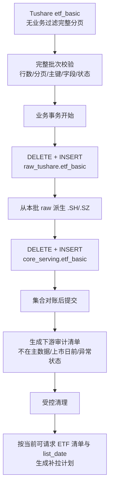

# ETF 基础信息重建与下游数据审计清理技术方案 v1

状态：核心业务口径已确认 / 1 项待拍板 / 尚未实施
创建日期：2026-08-28
适用范围：`etf_basic`、ETF 下游历史数据、ETF 对象池、ETF 查询与运维消费者

---

## 1. 结论

本方案可行，目标不是把旧 `.OF` 代码机械改名为 `.SH/.SZ`，而是重新建立一条清晰的数据身份链：

1. `raw_tushare.etf_basic` 完整保存 Tushare 当前返回的 ETF 基础信息快照。
2. `core_serving.etf_basic` 只发布真正供下游使用的沪深交易所 ETF，即 `.SH/.SZ`。
3. 所有 ETF 下游请求的代码、上市状态和最早请求日期，都必须来自 `core_serving.etf_basic`。
4. 历史 `.OF` 别名不做改名、不与 `.SH/.SZ` 合并；旧别名数据删除后，如交易所代码缺数据，再按交易所代码重新拉取。
5. 首次重建时，ETF 下游数据按获批的主数据快照做代码与上市日期双重清理；以后新增请求继续受当前主数据约束，但主数据代码消失或上市日期变晚不追溯删除既有历史。
6. `ops.etf_series_active` 整套激活池机制退场，不再作为任何 ETF 下游的上游或二次筛选条件。

最关键的实现变化是：`etf_basic` 不能继续使用当前“只 upsert、不删除旧主键”的写法，必须改成受控的完整快照替换。否则每天同步也无法删除源端已经消失的旧 `.OF` 和历史错误代码。

---

## 2. 目标与非目标

### 2.1 目标

1. 将生产 `etf_basic` 重建为与 Tushare 当前源端一致的 raw 快照。
2. 建立只含 `.SH/.SZ` 的 ETF serving 主数据。
3. 让 ETF 历史分钟请求从上市日开始，避免请求上市前不可能存在的数据。
4. 审计并清理 ETF 下游中的旧代码、非交易所代码和上市日前数据。
5. 保证后续每日同步不会重新积累已经从源端消失的主数据。
6. 将 ETF 数据域与公募基金 `.OF` 数据域明确隔离。

### 2.2 非目标

1. 不把 `.OF` 历史行直接更新成 `.SH/.SZ`。
2. 不合并两个代码下的历史行情。
3. 不删除 `fund_basic`、`fund_manager`、`fund_share` 等公募基金域中的合法 `.OF` 数据。
4. 不凭名称相似度自动判定身份。
5. 不在本方案阶段执行生产删表、清表、回填或迁移。
6. 不引入 Kopia，也不使用旧 Lake 路径保存清理备份。

---

## 3. 依据与当前事实

### 3.1 代码事实

当前 `etf_basic` 定义位于：

```text
src/foundation/datasets/definitions/reference_master.py
```

现行契约已经声明：

| 项 | 当前值 |
|---|---|
| 日期模型 | `snapshot/master`，无业务日期输入 |
| raw 表 | `raw_tushare.etf_basic` |
| serving 表 | `core_serving.etf_basic` |
| 分页 | `offset_limit`，单页上限 `5000` |
| 写入路径 | `raw_core_upsert` |

问题在于 `src/foundation/ingestion/writer.py::_write_raw_and_core()` 对 raw 和 serving 都执行 `bulk_upsert()`。它能新增和更新当前返回行，但不会删除本次源端没有返回的旧主键，因此不具备快照替换语义。

当前 ETF 历史分钟规划位于：

```text
src/foundation/ingestion/unit_planner.py::_resolve_etf_mins_targets()
src/foundation/ingestion/unit_planner.py::_build_etf_mins_units()
```

它目前从 `ops.etf_series_active(resource='etf_mins')` 取代码，只校验 `.SH/.SZ`，没有读取 `etf_basic.list_date`，所以无法自动把请求起点收缩到上市日。

### 3.2 Tushare 当前源端快照

以下数字是 2026-08-28 的实测快照，只作为本方案的审计证据，不得写成长期固定数量：

| 项 | 数量 |
|---|---:|
| `etf_basic` 总行数 | 1,825 |
| `.SH` | 1,030 |
| `.SZ` | 792 |
| `.OF` | 3 |
| 按本方案应进入 serving 的 `.SH/.SZ` | 1,822 |
| `list_date` 为空 | 49 |
| 其中 `P` | 41 |
| 其中 `L` | 8 |

当前 3 条 `.OF` 为：

```text
158008.OF
158038.OF
159070.OF
```

它们在 ETF 分钟接口中均未取得数据；对应的交易所代码存在于当前 `.SZ` 主数据中。因此：

1. raw 应原样保留这 3 条源端事实。
2. serving 不发布这 3 条 `.OF`。
3. 下游不把它们当作请求代码。

### 3.3 生产当前差异

2026-08-28 生产只读审计结果：

| 项 | 数量 |
|---|---:|
| 当前 prod `raw_tushare.etf_basic` | 3,405 |
| 当前 prod `core_serving.etf_basic` | 3,405 |
| prod 有、当前源端没有 | 1,585 |
| 其中旧 `.OF` | 1,582 |
| 其中历史 `J` 代码 | 3 |
| 当前源端有、prod 没有 | 5 |

1,585 条旧身份中，1,579 条可以按“相同六位数字 + 当前交易所代码”找到 `.SH/.SZ` 对应项。名称、设立日期、上市日期、管理人、托管人等字段也高度一致。这足以支持“源端代码体系发生了系统性规范化”的判断，但不能把它理解成可安全执行的数据库行改名。

### 3.4 下游当前污染情况

生产只读审计未发现上述 1,585 个旧代码已经进入以下 ETF 事实链：

```text
raw_tushare.etf_minute_bar
raw_tushare.etf_share_size
raw_tushare.etf_sh_cons
raw_tushare.etf_sz_cons
raw_tushare.fund_daily
core_serving.fund_daily_bar
raw_tushare.fund_adj
core.fund_adj_factor
ops.etf_series_active
```

因此当前主要污染集中在 `etf_basic` 本身。但下游规则仍必须落地，否则未来源端再次调整身份时还会重新产生不一致。

`etf_index` 虽然名称带 ETF，但其 `ts_code` 语义是“基准指数代码”，不是“ETF 交易代码”。它通过 `etf_basic.index_code` 与 ETF 发生关系，不能拿 `etf_index.ts_code` 与 ETF 主数据的 `ts_code` 做差集清理，因此明确排除在本次代码身份清理之外。

公募基金域中还存在 `159002.OF`、`159004.OF`、`159006.OF` 等合法 B 类份额。它们不属于当前 ETF serving，也不进入 ETF 后续同步链路，但必须保留在公募基金基础、经理和份额等数据集中，不能被 ETF 清理规则误伤。

### 3.5 代码复用风险

只校验“代码是否仍在当前主数据中”还不够。实测发现：

1. `159908.SZ` 当前上市日期为 2018-12-10，但分钟源端可以返回 2011 年数据。
2. `510680.SH` 当前上市日期为 2015-12-15，但分钟源端可以返回 2013 年数据。

这说明同一个交易代码可能被历史产品使用过。首次清理基准和以后新增请求都必须同时使用当时生效的 `list_date`；不能只凭 `ts_code` 接受上市前数据。首次清理完成后，如源端以后把 `list_date` 改晚，不追溯删除已经验收并落库的历史，按 D15 处理。

---

## 4. 已确认口径

| 编号 | 已确认规则 |
|---|---|
| D1 | `raw_tushare.etf_basic` 是 Tushare 当前返回的完整快照，不主动过滤 `.OF`。 |
| D2 | `core_serving.etf_basic` 只包含当前 raw 中的 `.SH/.SZ` 行。 |
| D3 | 首次重建采用“先完整取数并校验，再在一个业务事务内先删后写”的方式；不得先清空数据库再请求源端。 |
| D4 | `.OF` 不改名、不合并；ETF 专用下游与 ETF serving 中的旧 `.OF` 行直接删除，缺失的 `.SH/.SZ` 数据重新拉取；源端返回范围比 ETF basic 更宽的场内基金 raw 按 P1 处理。 |
| D5 | 所有 ETF 请求的代码、状态与上市日必须以 `core_serving.etf_basic` 为身份依据。 |
| D6 | `L + list_date 有效且不晚于执行日` 才能发起新增历史请求；`P` 和 `L + list_date 为空` 不请求。 |
| D7 | `D` 不再发起新增请求；既有历史可以保留，首次清理时只删除获批基准上市日前的数据。 |
| D8 | 首次重建清理完成时，有日期的 ETF 事实不得早于获批清理快照中的 `list_date`；以后新增请求也不得早于执行时的 `list_date`。 |
| D9 | 当前接口没有 `delist_date`，因此暂不按退市日做上界裁剪。 |
| D10 | 公募基金域中的合法 `.OF` 不因 ETF 主数据重建被删除。 |
| D11 | 3 条当前源端 `.OF` 可以保留在 raw，但不得进入 serving 和后续同步链路。 |
| D12 | `ops.etf_series_active` 整套激活池机制彻底退场；所有 ETF 下游统一以 `core_serving.etf_basic` 为身份上游，共用一套“当前可请求 ETF”判断。 |
| D13 | 下游清理不导出被删除行备份；执行成功后不提供按旧行恢复，只保留审计清单和执行结果。 |
| D14 | `etf_basic` 继续只保存当前态，不新增历史表、SCD 字段或每日快照表；TaskRun 只保留行数、hash 和变更摘要。 |
| D15 | 首次全量清理完成后，若某代码以后从 `etf_basic` 消失，或其 `list_date` 被改晚，只停止该代码后续请求并记录差异，不删除已经验收并落库的历史数据。 |
| D16 | 删除 `ops.etf_series_active` 属于高风险迁移；编码前必须先完成独立 LLD、全量消费者映射、迁移顺序和回归门禁，禁止把“计划已列影响面”当成可以直接删表的依据。 |

### 4.1 两个长期清单与一个一次性清理基准

原方案使用 `M/A/H` 三个字母只是文档缩写，不是现有数据库表，也不是应暴露给运营的业务概念。该写法不直观，并且在 D15 已确认后，“可保留历史集合”也不应继续作为日常删除依据，因此删除这组缩写。

长期运行只保留两个说得清楚的清单：

1. **ETF 主数据清单**：`core_serving.etf_basic` 中全部 `.SH/.SZ` 行，用于回答“平台当前承认哪些 ETF 身份”，其中可以包含 `L/P/D`。
2. **当前可请求 ETF 清单**：ETF 主数据清单中满足 `list_status='L'`、`list_date` 非空且 `list_date <= 执行日` 的行，用于回答“今天可以为哪些 ETF 发起新增请求”。

首次重建另外生成一份**一次性清理基准**：它绑定获批的 `etf_basic` snapshot hash，用来审计并清理旧 `.OF`、未知代码和当时上市日前的数据。它不是长期选择器，也不能在以后代码消失或 `list_date` 变晚时自动重算并删除历史。

“统一提供”是指 Foundation 只实现一次公共判断，下游直接取结果。它不表示所有数据集的请求逻辑都相同：

1. 共同规则——代码后缀、上市状态、上市日期——只能由公共选择器判断。
2. 各下游仍负责自己的源接口规则，例如按日还是按代码请求、时间窗口、频率、分页和缺口计算。
3. 这样可以避免分钟线认为 `P` 可请求、日线又认为 `P` 不可请求之类的口径分叉。

`P`、`D` 和 `L + list_date 为空` 都不进入当前可请求清单。`L + list_date 为空` 如已存在事实行，只进入异常报告，不自动删除。

### 4.2 `etf_basic` 当前没有历史版本

当前代码与源接口都表达“当前态”，不是历史版本：

1. `raw_tushare.etf_basic` 以 `ts_code` 为唯一主键，只有一行当前值。
2. `core_serving.etf_basic` 同样以 `ts_code` 为唯一主键。
3. raw 的 `fetched_at`、serving 的 `created_at/updated_at` 只是抓取或更新时间，不构成历史版本。
4. 当前没有 `snapshot_id/valid_from/valid_to/version` 等历史字段，也没有历史表。
5. Tushare `etf_basic` 没有历史版本或时间区间参数；2026-08-28 显式字段实测只返回指定代码的一行当前属性。

按 D14，继续保持当前态，不新增 SCD 或每日快照历史表。

---

## 5. 目标数据链



硬边界：

1. 源端完整取数和分页结束发生在数据库事务之前。
2. raw 与 serving 的替换发生在同一个业务数据事务内，任何一步失败都回滚到旧快照。
3. TaskRun、进度、审计状态使用独立事务；状态写入失败不得回滚已提交的业务数据。
4. 下游物理删除不与 `etf_basic` 发布放在同一个事务，更不能由数据库级联删除触发。

---

## 6. `etf_basic` 重建设计

### 6.1 源请求

正式发布请求必须：

1. 不传 `ts_code/index_code/list_date/list_status/exchange/mgr` 等业务过滤条件。
2. 显式请求当前 DatasetDefinition 中的 14 个业务字段。
3. 使用 `limit=5000`、`offset` 循环取数，直到返回短页。
4. 当前 1,825 行只需一页，但实现不得依赖“永远少于 5,000 行”。
5. 运营页面上的筛选请求只能做探测或预览，不能写入正式 raw/serving 快照。

这意味着 `etf_basic` 的正式 `maintain` 能力必须收口为“完整快照发布”，不能允许带过滤条件覆盖主表。

### 6.2 发布前门禁

完整批次至少通过以下校验后，才允许触碰数据库：

1. 返回行数大于 0。
2. 分页正常结束，没有达到页数/行数硬上限后被截断。
3. `ts_code` 非空且批次内唯一。
4. 归一化行数等于源端行数；所有 reject 必须有 reason code 和样本。
5. `list_status` 只能是已验证的 `L/P/D`；出现新值时暂停发布并报告。
6. raw 接受 `.SH/.SZ/.OF`；出现其他后缀时暂停发布，不得静默丢弃。
7. `.SH/.SZ` 后缀与 `exchange` 必须一致；不一致进入阻断报告。
8. `list_date` 允许为空，但必须按状态分别统计。
9. 输出与上一版快照的新增、删除、字段变化和数量变化报告。

不能把 `1,825`、`1,822`、`3` 写成永久硬编码。它们只是本次上线验收的对照值。

### 6.3 原子替换

新增 `etf_basic` 专用 snapshot write path，不能继续复用通用 `raw_core_upsert`：

```text
BEGIN
  DELETE FROM raw_tushare.etf_basic
  INSERT 完整源端批次

  DELETE FROM core_serving.etf_basic
  INSERT 本批次中 ts_code 以 .SH/.SZ 结尾的行

  执行 raw/serving 集合与数量对账
COMMIT
```

要求：

1. 使用 `DELETE`，不 drop、不重建表。
2. 事务开始前确认没有另一个 `etf_basic` 发布任务在运行或排队。
3. 事务内的 serving 数据直接来自本次已校验批次，不重新向源端请求。
4. 事务内校验失败立即回滚。
5. 首次生产重建和以后每日维护使用同一条正式路径，不能保留一次性旁路脚本。

### 6.4 发布后不变量

```text
raw 行集合 = 本次 Tushare 完整返回集合
serving 行集合 = raw 中后缀为 .SH/.SZ 的集合
raw 主键重复数 = 0
serving 主键重复数 = 0
serving .OF 行数 = 0
serving 非 .SH/.SZ 行数 = 0
```

---

## 7. 下游审计与清理规则

### 7.1 原因码

所有候选删除行必须先归入明确原因，禁止只输出一条大 SQL 的总行数：

| 原因码 | 含义 | 默认动作 |
|---|---|---|
| `CODE_NOT_IN_ETF_MASTER` | `ts_code` 不在获批的首次清理基准 | 首次重建中的 ETF 专用旧身份删除；日常新变化只报告、不删除 |
| `NON_EXCHANGE_ETF_SUFFIX` | ETF 专用数据出现非 `.SH/.SZ` | 删除 |
| `BEFORE_BASELINE_LIST_DATE` | 事实日期早于获批清理快照中的 `list_date` | 首次重建时删除；以后 `list_date` 变晚不追溯删除 |
| `PENDING_ETF_HAS_FACT` | `P` 状态却已经有行情/规模/申赎事实 | 删除前单列复核 |
| `LISTED_WITHOUT_LIST_DATE_HAS_FACT` | `L` 但无上市日，却已有事实 | 只报告，不自动删除 |
| `OBSOLETE_ACTIVE_POOL_ROW` | 旧 `ops.etf_series_active` 遗留行 | 随激活池机制退场统一删除 |

### 7.2 日期字段映射

| 数据类型 | 用于上市日下界判断的字段 |
|---|---|
| 日线、复权因子、规模、申赎清单 | `trade_date` |
| ETF 历史分钟 | `DATE(trade_time)` |
| 无日期 ETF 快照 | 只做代码集合对齐 |

### 7.3 清理对象矩阵

| 数据集/对象 | 当前物理层 | 对齐依据 | 计划动作 |
|---|---|---|---|
| `etf_mins` | `raw_tushare.etf_minute_bar` | 首次清理基准 + 当前可请求清单 | 首次删除旧身份、非交易所后缀和基准上市日前分钟；以后只按当前可请求清单补拉 |
| `etf_share_size` | raw 表 + serving view | 首次清理基准 + 当前可请求清单 | 首次清理 raw；view 自动跟随；以后不因主数据变化追溯删除 |
| `etf_sh_cons` | raw 表 + serving view | 当前可请求清单且 `.SH` | 首次清理 raw；请求对象直接来自 serving |
| `etf_sz_cons` | raw 表 + serving view | 当前可请求清单且 `.SZ` | 首次清理 raw；请求对象直接来自 serving |
| `fund_daily` serving | `core_serving.fund_daily_bar` | 当前可请求清单 | 首次清理旧身份和基准上市日前数据；以后写入按 serving 主数据过滤，不追溯删除 |
| `fund_daily` raw | `raw_tushare.fund_daily` | 源端当日完整返回 | 先审计；永久口径见待拍板项 P1 |
| `fund_adj` | `raw_tushare.fund_adj`、`core.fund_adj_factor` | 源端当日完整返回 | 先审计；永久口径见待拍板项 P1 |
| 旧 ETF 激活池 | `ops.etf_series_active` | 已退场 | 删除表、模型、DAO、contract、seed、CLI、API、页面与测试，不保留兼容读取 |
| 实时监控池/规则/统计/告警 | `ops.etf_realtime_*` | 当前可请求清单 | 审计孤儿代码；配置与历史事实分开处理 |
| `etf_index` | raw + serving 指数基准表 | 指数代码，不使用 ETF 主数据清单 | 明确排除；只能审计 `etf_basic.index_code -> etf_index.ts_code` 的引用关系 |
| 公募基金基础、经理、份额等 | 公募基金域 raw/current/obs | 不使用 ETF 主数据清单 | 明确排除，合法 `.OF` 保留 |

### 7.4 删除不是改名

禁止执行：

```text
UPDATE ... SET ts_code='100000.SZ' WHERE ts_code='100000.OF'
```

正确处理：

1. 删除 ETF 下游中的 `100000.OF` 候选行。
2. 检查 `100000.SZ` 在对应源接口中是否可取得数据。
3. 如果可取得，按 `100000.SZ` 和当前 `list_date` 重新拉取。
4. 如果源端没有数据，记录为 `SOURCE_NOT_READY`，不制造替代行。

这样可以避免把两个不同代码命名空间的数据错误拼成一条历史序列。

---

## 8. raw 与 serving 的边界

### 8.1 ETF 专用接口

`etf_basic/etf_mins/etf_share_size/etf_sh_cons/etf_sz_cons` 的 `ts_code` 都表达 ETF 交易代码。它们的下游请求身份必须由 ETF serving 主数据约束；历史遗留的非主数据代码属于清理对象。

`etf_index.ts_code` 表达基准指数代码，不属于这一规则，不能因为它不在 ETF 主数据中就删除。

### 8.2 源端返回范围比 ETF basic 更宽的场内基金接口

这里原来写的“混合基金源端全集”过于含糊。它不是指全部公募基金，也不是指把 `.OF` 场外基金混进 ETF。准确含义是：**按交易日不传 `ts_code` 请求 `fund_daily/fund_adj` 时，源端返回它所覆盖的全部场内基金代码；这个范围比当前 `etf_basic` 更宽。**

2026-08-28 对 2026-08-27 交易日的 Tushare 实测：

| 接口 | 当日行数 | 后缀 | 不在当前 `etf_basic` 的代码 |
|---|---:|---|---:|
| `fund_daily` | 2,113 | 1,019 `.SZ` + 1,094 `.SH` | 470 |
| `fund_adj` | 2,134 | 1,036 `.SZ` + 1,098 `.SH` | 490 |

`fund_daily` 多出的 470 个代码全部能在 `fund_basic(market='E', status='L')` 中找到；按名称样本分类，主要包括 309 个 LOF、88 个 REIT，以及其他场内基金。`159002.OF` 在两个接口的 2026 年区间实测均为 0 行。因此当前证据说明它们覆盖“ETF + 其他场内基金”，不支持把它理解成“全部场内外公募基金”。

本地源文档沿用 Tushare 的官方名称“ETF 日线行情”，但当前源端实测返回范围更宽。实现必须以实测范围设计 raw/serving 边界，不能只看接口标题。

现行已落地方案明确：

1. `raw_tushare.fund_daily` 保存源端完整基金日线事实。
2. `core_serving.fund_daily_bar` 才按 ETF 服务范围过滤。

因此不能直接对 `raw_tushare.fund_daily` 做“凡不在 `etf_basic` 就全部删除”，否则会把合法的 LOF、REIT 等场内基金事实一起删掉。这一永久口径需要在 P1 拍板。

不论 P1 如何选择，以下规则不变：

1. ETF 业务消费者只能读取经过 ETF 主数据约束的 serving。
2. 公募基金域的合法 `.OF` 不进入 ETF 清理范围。
3. 当前生产审计中，1,585 个旧 ETF 身份与 `fund_daily/fund_adj` 的交集都是 0，所以 P1 不阻塞本次 `etf_basic` 重建。

### 8.3 “所有下游直接使用 serving”的实现含义

“直接使用 serving”不是让每个 planner、writer、查询服务各自写一套 SQL，而是由 Foundation 统一提供两类查询能力：

```text
读取 ETF 主数据清单
读取指定执行日的当前可请求 ETF 清单
```

所有 ETF planner、writer、实时健康统计和监控候选列表都消费统一结果。禁止下游自行拼接 `.SH/.SZ`、`list_status` 和 `list_date` 这些共同条件，否则很快又会产生多套口径。具体函数名和 DAO 形态在 LLD 决定，技术方案不提前把伪代码名称写成契约。

各下游仍保留源接口特有的拉取规则。例如：

1. `etf_mins`、申赎清单等按代码工作的接口，使用当前可请求 ETF 清单生成代码级请求，再按各自窗口和分页规则执行。
2. `fund_daily` 按 `trade_date` 一次请求当日源端全集并分页，不应为了“先读 basic”改成每只 ETF 各发一次请求；它先读取当前可请求 ETF 清单作为当日 serving 白名单，raw 保存源端当日完整返回，serving 只写入白名单交集。
3. 主数据新增、`P -> L` 或补齐上市日期时，缺口计算只对变化代码生成定向补拉；普通每日任务仍按数据集最省请求额度的原生方式执行。

`ops.etf_realtime_monitor_pool` 是运营选择“重点监控哪些 ETF”的业务配置，不是数据同步激活池。它可以保留，但其候选项与有效性必须由当前可请求 ETF 清单约束。

---

## 9. ETF 历史分钟请求设计

### 9.1 对象来源

`etf_mins` 的全量历史目标直接来自当前可请求 ETF 清单，不再从固定 1,395 激活池取全市场代码。显式单代码请求也必须命中该清单，不能提供主数据中不存在的代码，也不能提供 `P/D/list_date 为空` 的代码。`fund_daily`、ETF 实时流、`etf_sh_cons`、`etf_sz_cons` 等其他 ETF 下游同样使用 serving 的统一判断，不再保留 resource 级激活池。

### 9.2 上市日裁剪

对每个 ETF：

```text
effective_start_date = max(用户或任务要求的 start_date, etf_basic.list_date)
effective_end_date   = 用户或任务要求的 end_date
```

如果 `effective_start_date > effective_end_date`，该 ETF 不生成任何源请求 unit，并记录 `WINDOW_BEFORE_LIST_DATE`，不能向 Tushare 发空请求。

point 请求同样要校验：

```text
trade_date >= list_date
```

### 9.3 继续复用现有切窗

当前五个原生频率及窗口可以继续复用：

| 频率 | 每个 unit 的自然月跨度 |
|---|---:|
| `1min` | 2 |
| `5min` | 12 |
| `15min` | 36 |
| `30min` | 72 |
| `60min` | 120 |

上市日裁剪必须发生在切窗之前。否则 planner 仍会为上市前区间生成大量无效 unit。

### 9.4 请求量门禁

每次全量补拉执行前必须先输出计划预览：

1. 当前可请求 ETF 清单中的 ETF 数量。
2. 因 `list_date` 为空、状态不是 `L`、尚未上市而排除的数量。
3. 按 ETF、频率、窗口拆出的总 unit 数。
4. 每个频率的 unit 数。
5. 按当前 `page_limit=8000` 和每 unit 最大 24,000 行估算的请求页数上界。
6. 已有数据覆盖后真正需要补拉的 unit 数。

只有计划预览和额度影响经确认后才进入大规模补拉。不得用固定的“从 2020-01-01 开始”或同一个全市场起点代替逐 ETF 上市日。

---

## 10. 审计、确认与清理执行

### 10.1 审计清单

每张表生成独立报告，至少包含：

```text
snapshot_id
source_snapshot_hash
table_name
reason_code
ts_code
master_list_status
master_list_date
min_fact_date
max_fact_date
row_count
key_checksum
```

报告必须区分：

1. 确定可删。
2. 只报告、需要人工看。
3. 明确排除。

### 10.2 执行门禁

1. 默认只 dry-run。
2. 每张表独立确认，不允许用一个总开关清理所有业务表。
3. 清理前检查相关 Dataset TaskRun 没有处于 `queued/running/canceling`。
4. 确认报告必须与当前 `etf_basic` snapshot hash 一致；主数据变化后旧报告作废。
5. 实际删除范围只能是已确认报告中的主键集合，不能在 apply 时重新扩大。
6. 大表按可核验批次处理，避免一个超大事务。
7. 每批提交后重新计算剩余候选数和保留集 checksum。

### 10.3 不备份与不可恢复边界

按 D13，本次下游清理不导出被删除行备份。必须明确接受以下边界：

1. 单批事务提交前可以回滚；提交成功后不能恢复旧 `.OF` 或其他被删历史行。
2. 审计 CSV、行数和 checksum 只证明删了什么，不包含完整行，不能用于恢复。
3. 当前 canonical `.SH/.SZ` 数据如需恢复，只能重新向 Tushare 拉取。
4. Tushare 已不再提供的旧别名数据，删除后永久丢弃；这正是本次清理目标。
5. 因为没有备份，apply 必须继续保留逐表确认、snapshot hash、精确主键集合和单表事务门禁。

---

## 11. 失败与回滚

| 场景 | 处理 |
|---|---|
| Tushare 请求失败或分页不完整 | 不开启数据库替换事务，保留旧快照 |
| 批次字段/状态/后缀异常 | 阻断发布，输出异常报告 |
| raw/serving 替换事务失败 | 整体回滚到旧 `etf_basic` |
| Ops 状态写入失败 | 只影响观测，不回滚已经提交的业务数据 |
| 下游清理中途失败 | 保留已提交批次的审计记录，从未完成批次续跑 |
| 清理范围与确认报告不一致 | 拒绝执行 |
| canonical `.SH/.SZ` 源端无数据 | 记录 `SOURCE_NOT_READY`，不从 `.OF` 复制 |

---

## 12. 代码影响面

### 12.1 Foundation

计划涉及：

```text
src/foundation/datasets/definitions/reference_master.py
src/foundation/datasets/definitions/market_fund.py
src/foundation/ingestion/request_builders.py
src/foundation/ingestion/unit_planner.py
src/foundation/ingestion/writer.py
src/foundation/dao/etf_basic_dao.py
```

职责：

1. 把 `etf_basic` 改成完整 snapshot 发布契约。
2. 提供 ETF 主数据清单和当前可请求 ETF 清单的统一查询能力。
3. 在 ETF 下游 planner 中使用主数据和上市日。
4. 在 ETF 专用 writer 中增加主数据门禁。

### 12.2 Ops

计划新增或调整：

```text
ETF 下游对齐审计 service
ETF 下游受控清理 service
现有 fund_daily serving cleanup service
删除 ETF 激活池 model / DAO / contract / adapter / seed / CLI
删除 ETF 激活池审查 API、页面与 realtime health 依赖
实时监控候选列表改读 ETF serving
对应 CLI 与测试
```

现有 `EtfFundDailyServingCleanupService` 只按 `ops.etf_series_active(resource='fund_daily')` 清理 serving，并强制 raw 行数不变。它不能直接承担本方案的全域主数据审计，必须由基于 ETF serving 的统一清理服务替代，旧 pool 语义必须清零。

激活池退场的当前影响面已核对到：

1. `src/foundation`：DAO factory、ETF active DAO/contract、三类 planner universe、`fund_daily` writer。
2. `src/ops`：model、adapter、seed service、cleanup service、review query、realtime health、monitor candidate service。
3. `src/app` 与 CLI：model registry、seed 命令、handlers。
4. 前端：ETF 活跃池审查页、路由/导航、实时监控候选和健康文案。
5. 数据库：`ops.etf_series_active` 表和索引。
6. 测试：model/DAO/seed/planner/writer/API/frontend 全部旧池断言。

### 12.3 Biz 与查询消费者

当前明确消费者包括：

1. ETF 报价标的解析。
2. Ops ETF 活跃池审查中心，随激活池机制一并删除。
3. ETF 实时监控池、名称映射、规则、统计与告警。
4. `fund_daily` serving 写入与读取。

重建后，旧 `.OF` 将不再被 ETF 报价解析为有效 ETF；实时监控候选和其他需要新增请求的 ETF 消费者直接以当前可请求 ETF 清单为准。

### 12.4 架构边界

不改变现有依赖方向：

```text
foundation：主数据、请求规划、归一化、写入
ops：审计、人工确认、清理编排、运行观测
biz：只消费 serving 主数据
app：组合装配
```

不得出现 `foundation -> ops` ORM 反向依赖。激活池退场后，Foundation 的 ETF planner/writer 只读取自身 `core_serving.etf_basic`，同时删除原先为跨边界读取 `ops.etf_series_active` 设置的 contract/DAO。

### 12.5 激活池退场的高风险 LLD 门禁

删除 `ops.etf_series_active` 不能按文件清单机械执行。编码前必须先完成独立 LLD，并至少交付以下审计结果：

1. **全量引用清单**：数据库表与索引、ORM、DAO factory、Foundation contract、Ops adapter、seed service、CLI、planner、writer、cleanup、review API、realtime health、monitor candidate、前端路由/导航/页面及全部测试。
2. **逐消费者替代映射**：每个旧消费者必须明确改读“ETF 主数据清单”还是“当前可请求 ETF 清单”，或确认整项能力删除；禁止笼统写成“改读 serving”。
3. **调用链与边界复核**：使用 CodeGraph 的 symbol impact/caller/callee 结果，再用代码搜索补足动态注册、字符串路由、迁移和前端消费者；不能只依赖某一种工具。
4. **迁移顺序**：先实现并验证新选择器，再切换全部运行时消费者，确认旧引用为 0，最后才删除 API/UI/DAO/contract/model，并在同一正式版本中通过 Alembic 删除表；不提供 fallback 或双读兼容路径。
5. **迁移安全**：新增 Alembic 前重新确认真实 migration head；部署前后分别验证任务规划、日线 serving 写入、分钟规划、申赎清单、实时健康和监控候选。
6. **清零证明**：代码、配置、路由、前端、测试和生产表六个层面都要给出旧口径为 0 的证据，不能只证明 Python import 已删除。

当前 CodeGraph 只能证明已发现一批明确依赖，不能代替开发时的最终 LLD 审计。尤其 `list_active_codes` 是指数池与 ETF 池共用的方法名，宽泛按方法名删除会误伤 `ops.index_series_active`，LLD 必须按 ETF 具体类型与资源逐项区分。

---

## 13. 测试与验收

### 13.1 正向测试

1. 测试批次中的 `.OF` 原样进入 raw，但不进入 serving。
2. 第二次快照少一个代码时，raw/serving 都真正删除旧主键。
3. 快照发布失败时，raw/serving 保持旧版本。
4. `L + list_date 有效` 从上市日开始生成分钟 unit。
5. 用户开始日期晚于上市日时，使用用户开始日期。
6. `D` 不生成新请求，但上市日后的历史不因状态本身被删除。
7. ETF 专用 raw 表清理后，对应 serving view 自动一致。
8. `fund_daily/etf_mins/etf_sh_cons/etf_sz_cons/实时 ETF` 都从统一 serving 选择器取得目标。
9. 实时监控候选只返回当前可请求 ETF，监控池配置本身继续独立存在。
10. `fund_daily` 单日维护只按交易日请求源端全集并分页，不因 ETF 数量拆成逐代码请求；serving 写入使用当前可请求 ETF 清单过滤。
11. 日常同步发现代码消失或 `list_date` 变晚时，停止后续请求并记录差异，既有事实行保持不变。

### 13.2 负向测试

1. 过滤后的 `etf_basic` 请求不得发布正式快照。
2. `.OF`、未知后缀和不在当前可请求 ETF 清单的代码不得生成 ETF 分钟请求。
3. `P`、`L + list_date 为空`、尚未到上市日的 ETF 不得生成请求。
4. 上市日前窗口不得生成 unit。
5. 不能把 `.OF` 行更新成 `.SH/.SZ`。
6. ETF 清理不能命中公募基金域表。
7. 过期 snapshot hash 的确认报告不能 apply。
8. 存在运行中相关 TaskRun 时不能清理。
9. DatasetDefinition、planner、writer、Ops API 和前端不得残留 `ops_etf_series_active` 或固定 1,395 池 fallback。
10. serving 选择器为空时不得回退到旧激活池、seed CSV 或源端全量代码。
11. 日常代码消失或 `list_date` 变晚不得触发下游 DELETE。

### 13.3 生产验收

`etf_basic` 验收：

```text
源端完整行数 = raw 行数
源端 ts_code 集合 = raw ts_code 集合
raw 中 .SH/.SZ 集合 = serving ts_code 集合
serving .OF = 0
serving 未知后缀 = 0
重复主键 = 0
```

首次下游清理验收：

```text
ETF 专用表 CODE_NOT_IN_ETF_MASTER = 0
ETF 专用表 NON_EXCHANGE_ETF_SUFFIX = 0
有日期 ETF 事实 BEFORE_BASELINE_LIST_DATE = 0
运行时代码对 ops.etf_series_active 的引用 = 0
生产 ops.etf_series_active 表 = 不存在
公募基金排除表的行数与 checksum 不因本次清理变化
```

补拉验收：

1. 实际请求的最早 `start_date` 不早于对应 `list_date`。
2. 计划 unit 数、成功 unit 数、失败 unit 数和跳过原因可对账。
3. canonical `.SH/.SZ` 缺失必须区分“尚未请求、请求失败、源端无数据”。
4. 同一补拉计划重复执行不增加重复主键。

---

## 14. 实施里程碑

### M0：口径冻结

1. 确认本方案 D1-D16。
2. 拍板第 15 节 P1。
3. 固化生产只读基线和受影响表清单。

### M1：`etf_basic` 快照发布能力

1. 收口正式发布为无过滤完整请求。
2. 新增专用 snapshot write path。
3. 完成 raw/serving 同事务替换和集合对账。
4. 补正向、负向和失败回滚测试。

### M2：主数据选择器与下游门禁

1. 先完成第 12.5 节要求的激活池退场专项 LLD 和逐消费者替代映射，评审通过前不删代码、不删表。
2. 提供 ETF 主数据清单和当前可请求 ETF 清单的统一查询能力。
3. 所有 ETF planner、writer、实时健康和监控候选统一接入 serving 选择器。
4. ETF 分钟 planner 接入当前可请求 ETF 清单和 `list_date`。
5. 运行时消费者切换并验证完成后，删除 `ops.etf_series_active` model/DAO/contract/adapter/seed/CLI/API/UI 及全部消费者。
6. 最后新增迁移删除 `ops.etf_series_active` 表，不保留兼容读取。
7. 输出真实请求量预览。

### M3：审计与清理能力

1. 建立逐表 dry-run 报告。
2. 建立 snapshot hash、确认报告和 apply 门禁。
3. 明确不导出被删除行备份，只保留候选主键、统计与 checksum。
4. 先在非生产数据验证幂等、事务回滚和断点续跑。

### M4：生产 `etf_basic` 重建

1. 完整拉取并验证当前源端。
2. 使用正式 snapshot 路径原子替换，不做旧行备份。
3. 执行源端/raw/serving 集合验收。

### M5：下游只读审计

1. 逐表生成候选清单。
2. 确认公募基金排除集不受影响。
3. 对每张表的删除行数、代码数、日期范围和不可恢复影响做评审。

### M6：受控清理

1. 每张表单独授权、单独执行、单独验收。
2. 先小表和 Ops 孤儿配置，再处理大表历史行情。
3. 任何异常立即停止后续表，不扩大范围。

### M7：ETF 历史分钟补拉

1. 以当前可请求 ETF 清单和 `list_date` 生成全量差集计划。
2. 先跑最小真实样本，核对源端行数、归一化行数、写入行数和 reject。
3. 确认请求额度与预计耗时后再启动全量补拉。
4. 完成幂等重跑和物理数据对账。

### M8：日常治理

1. 每日 `etf_basic` 使用完整快照发布。
2. 发布前比较新快照与当前 serving，只处理发生变化的代码，不每日全表扫描下游。
3. 新增 ETF 或 `P -> L` 从其 `list_date` 开始进入补拉计划。
4. `L -> D` 立即停止新增请求，但保留合法历史。
5. 代码彻底消失时停止后续请求并记录差异，既有历史不删除。
6. `list_date` 变晚时，后续新增请求使用新日期下界，变更前已验收的历史不追溯删除。

---

## 15. 待拍板事项

### P1：`fund_daily/fund_adj` 的 raw 是否按 ETF basic 裁剪

两个选项：

1. **继续保留源端当日完整返回**：raw 不按 ETF basic 裁剪，ETF serving 才严格对齐。
2. **把整个数据集改成 ETF 专用**：raw 中凡不在 ETF 主数据的代码也删除，以后请求也只围绕 ETF。

人话解释：这里的“源端当日完整返回”不是 3 万多只场内外公募基金。它是调用 `fund_daily(trade_date=某日)` 或 `fund_adj(trade_date=某日)` 时，接口当天实际返回的全部场内代码。2026-08-27 实测中，`fund_daily` 有 470 个代码不在 ETF basic，主要是 LOF、REIT 等合法场内基金；它们不是 ETF 业务对象，但确实是该源接口返回的事实。

建议：**选择 1**。这与已经确认的“raw 保存源站、serving 给下游”原则一致。对 ETF 业务，只要求 `core_serving.fund_daily_bar` 对齐；`fund_adj` 在明确 ETF serving 消费者前先只审计，不做破坏性清理。

### 15.1 待拍板项对实施的影响

| 待拍板项 | 是否阻塞 `etf_basic` 重建 | 是否阻塞下游物理清理 | 是否阻塞分钟全量补拉 |
|---|---|---|---|
| P1 场内基金接口 raw 口径 | 否 | 仅阻塞 `fund_daily/fund_adj` raw | 否，ETF 分钟不受影响 |

---

## 16. CodeGraph 与消费者审计记录

本方案编写前已在仓库根索引完成 CodeGraph 审计，索引状态为 up to date。覆盖：

1. `EtfBasic` 模型、DAO、写入链路和所有明确消费者。
2. `_write_raw_and_core()` 当前 upsert 语义。
3. `_resolve_etf_mins_targets()` 与分钟 unit 构造链。
4. `EtfBasicDAO` 对 `L/P/D` 和 `.OF` 的现有筛选。
5. `EtfSeriesActive` model、DAO、contract、seed、CLI、planner、writer 和 migration。
6. `EtfFundDailyServingCleanupService` 当前按激活池清理的边界。
7. Ops ETF 活跃池审查 API/页面、ETF 实时健康、实时监控候选、ETF 报价解析与相关测试。

2026-08-28 针对激活池退场再次执行了 CodeGraph impact 和全仓代码搜索：`EtfSeriesActiveDAO` 明确影响 DAO factory、实时健康查询/API 和 DAO 测试；`EtfSeriesActiveStore` 影响 Ops adapter 与测试；具体字符串引用还覆盖 Foundation planner/writer、Ops seed/cleanup/review/monitor、App model registry/CLI、Alembic 和多组 Web 测试。宽泛的 `list_active_codes` impact 同时命中指数池，证明开发时不能按同名方法批量删除。

这些结果只是专项 LLD 的输入，不是最终清单。实际开发前仍须按第 12.5 节重新同步 CodeGraph，并对 `DatasetDefinition`、writer write path、激活池删除迁移、动态注册、前端路由和生产表做全量消费者复核。
