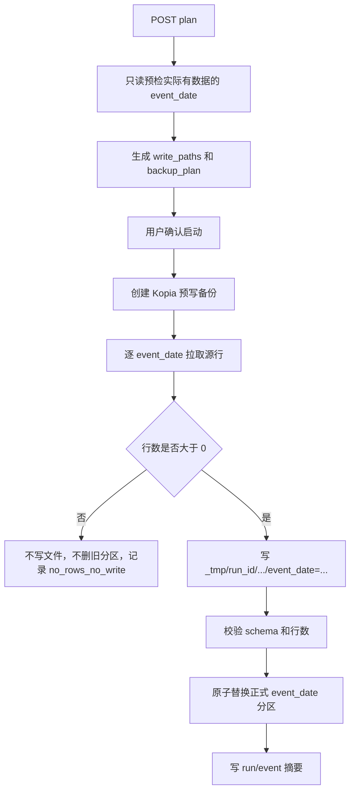

# Local Lake 远程 DB 事件日期同步独立链路方案 v1

- 版本：v1
- 状态：开发中；已完成 profile、plan/API、只读 DB 层、exporter/runner、scanner/catalog/frontend 最小链路，本地限定测试通过；真实小样本验收待执行
- 更新时间：2026-05-16
- 适用范围：`lake_console` 本地 Tushare Parquet Lake
- 目标 profile：`prod_db_event_date`
- 相关文档：
  - [Local Lake 数据集同步扩展方案 v1](/Users/congming/github/goldenshare/docs/architecture/local-lake-dataset-sync-expansion-plan-v1.md)
  - [Local Lake Sync Center Master Review v1](/Users/congming/github/goldenshare/docs/architecture/local-lake-sync-center-master-review-v1.md)
  - [上市公司全量公告数据集接入方案](/Users/congming/github/goldenshare/docs/datasets/anns-d-dataset-development.md)
  - [上证E互动问答数据集接入方案](/Users/congming/github/goldenshare/docs/datasets/irm-qa-sh-dataset-development.md)
  - [深证互动易问答数据集接入方案](/Users/congming/github/goldenshare/docs/datasets/irm-qa-sz-dataset-development.md)
  - [券商研究报告数据集接入方案](/Users/congming/github/goldenshare/docs/datasets/research-report-dataset-development.md)
  - [Local Lake 远程 DB 同步 API 契约 v1](/Users/congming/github/goldenshare/docs/architecture/local-lake-prod-db-sync-api-contract-v1.html)
  - [Local Lake Kopia 预写快照聚合方案 v1](/Users/congming/github/goldenshare/docs/architecture/local-lake-kopia-prewrite-snapshot-aggregation-plan-v1.md)
  - [Local Lake 数据集访问模式检查清单 v1](/Users/congming/github/goldenshare/docs/architecture/local-lake-dataset-access-mode-checklist-v1.md)

---

## 1. 背景

当前 `lake_console` 已有两类通用远程生产 DB 同步能力：

1. `prod_db_daily`：按 `trade_date` 或周/月锚点写入日期分区，区间模式依赖本地交易日历。
2. `prod_db_snapshot_refresh`：刷新 current/snapshot 类数据集，不生成日期分区。

这两类能力都不能直接承载事件日期数据。

事件日期数据的典型特征：

1. 可以按自然日或日期区间拉取。
2. 某一天没有数据是正常事实。
3. 不应该用交易日历判断缺失。
4. 不应该创建空日期分区。
5. 需要按日期分区方便 DuckDB 查询裁剪。

本方案新增一条独立链路：`prod_db_event_date`。

---

## 2. 硬原则

### 2.1 不与旧交易日链路耦合

本 profile 禁止复用以下交易日链路主实现：

1. `build_trade_date_plan`
2. `DbTradeDateExportService`
3. `build_prod_raw_trade_date_query`
4. `build_prod_raw_trade_date_range_query`
5. `load_expected_partition_dates`
6. `resolve_expected_partition_date`
7. `SyncRecommendationService` 的交易日缺口推荐逻辑

原因：

1. 事件日期不是交易日完整性模型。
2. 事件日期区间不能被交易日历过滤。
3. 0 行日期不能被当成缺失分区。
4. 旧链路会生成 `trade_date=...` 路径，不适合事件日期语义。

### 2.2 拉取过程单独设计

生产库拉取过程必须新增独立模块，不复用旧 `prod_raw_db.py` 中的查询构造和游标拉取代码片段。

允许复用的只有无业务语义基础设施：

1. 配置读取。
2. Lake root 写入前检查。
3. Parquet 写入与行数校验。
4. 原子替换。
5. Kopia 预写备份。
6. Sync Center plan/run/event/lock 壳。

禁止复用或改造的业务语义代码：

1. 旧 trade_date planner。
2. 旧 trade_date exporter。
3. 旧 trade_date SQL builder。
4. 旧交易日历锚点计算。
5. 旧 `prod_db_manual_backfill` 的数据集白名单。

### 2.3 前端不拼接事实

前端只能展示后端返回的字段。

禁止前端自行判断：

1. 日期字段叫什么。
2. 目录路径怎么拼。
3. 某个日期是否缺失。
4. coverage label 文案。
5. backup path 和 write path。

### 2.4 本次代码审计结论

当前代码框架可以承载 `prod_db_event_date`，但不能通过“把 4 个数据集塞进旧 profile”落地。

必须补齐的现有边界：

1. `SyncProfileCatalog` 当前只登记 `prod_db_daily`、`prod_db_snapshot_refresh`、`prod_db_manual_backfill`、`lake_reference_refresh` 等旧 profile，没有 `prod_db_event_date`。
2. `SyncProfilePlanner` 当前统一调用 `LakeSyncPlanner.plan(...)`，并把 plan 转成固定字段字典；如果直接复用，`event_date_partitions`、`source_date_field`、`zero_row_dates` 等事件日期明细会被丢掉。
3. `SyncProfileRunner.validate_plan(...)` 当前硬限制旧 profile；`run(...)` 只有 snapshot、trade_date、reference 三类执行分支，没有事件日期执行分支。
4. Sync Center 前端当前硬编码 runnable profile、日期输入规则和 profile 展示信息；不补前端契约时，页面不会给 `prod_db_event_date` 正确传单日或区间日期。
5. scanner 当前只识别 `trade_date`、`trade_month`、`freq`、`indicator` 等目录形态，不识别 `event_date=YYYY-MM-DD`。
6. 数据集总览和 catalog 当前没有事件日期扫描形态；如果只写文件不补 scanner，总览页仍然看不到真实湖内资产。

因此开发时必须同时落下列链路：

```text
profile 登记
  -> 事件日期 plan
  -> Kopia 预写备份计划
  -> 事件日期 runner/exporter
  -> scanner/catalog 识别 event_date
  -> API 原样返回展示事实
  -> 前端只展示后端事实
```

不能只完成其中一段。

### 2.5 本次文档审计结论

现有 Sync Center 文档主要围绕旧四类 profile：

1. `prod_db_daily`
2. `prod_db_snapshot_refresh`
3. `prod_db_manual_backfill`
4. `lake_reference_refresh`

现有 prod db 数据集接入文档的共同要求是：

1. 明确源表。
2. 明确字段白名单。
3. 禁止 `select *`。
4. 排除生产系统字段。
5. 明确写入路径。
6. 真实验证源端行数、归一化行数、写入行数和目标行数。

本方案必须在这些要求之上额外补充事件日期语义：

1. `ann_date` 或源表里的 `trade_date` 只是源字段，不等于交易日完整性。
2. 0 行日期是正常事实，不生成空分区，不进入缺口修复。
3. 计划阶段会做生产库只读预检；这和旧 Sync Center “纯本地生成计划”的口径不同，必须在 API 契约里写清楚。
4. 事件日期分区需要被 scanner/catalog 正式识别，否则数据湖总览仍然不真实。

---

## 3. 数据集范围

### 3.1 本期纳入

| 数据集 | 中文名 | 生产表 | 生产日期字段 | Lake 分区字段 | 是否做连续完整性审计 |
| --- | --- | --- | --- | --- | --- |
| `anns_d` | 上市公司公告 | `raw_tushare.anns_d` | `ann_date` | `event_date` | 否 |
| `irm_qa_sh` | 上证E互动问答 | `raw_tushare.irm_qa_sh` | `trade_date` | `event_date` | 否 |
| `irm_qa_sz` | 深证互动易问答 | `raw_tushare.irm_qa_sz` | `trade_date` | `event_date` | 否 |
| `research_report` | 券商研究报告 | `raw_tushare.research_report` | `trade_date` | `event_date` | 否 |

说明：

1. `event_date` 是 Lake 物理分区字段，用来统一表达“事件日期分区”。
2. Parquet 文件内部继续保留源字段原名。
3. `anns_d` 文件内部保留 `ann_date`。
4. `irm_qa_sh`、`irm_qa_sz`、`research_report` 文件内部保留 `trade_date`。
5. 源字段名叫 `trade_date` 不等于交易日完整性语义。

### 3.2 本期不纳入

| 数据集 | 后续落位 | 原因 |
| --- | --- | --- |
| `bak_basic` | `prod_db_daily` | 真正按交易日维护，应该继续走交易日分区与交易日完整性规则。 |
| `broker_recommend` | `prod_db_monthly` | 月份键模型，应该按 `month=YYYYMM` 同步。 |
| `dividend` | 后续公告日/低频专项 | 生产侧已有 `ann_date` 模型，但本期先不混入本批。 |
| `stk_holdernumber` | 后续公告日/低频专项 | 同上。 |
| `news`、`major_news`、`cctv_news` | 后续新闻专项 | 这些数据集时间字段和源表口径需单独审计，不在本方案夹带。 |

### 3.3 单数据集接入前审计清单

每个事件日期数据集开发前，都必须重新核验当前生产表和既有接口文档，不能只引用本方案里的静态表格。

| 检查项 | `anns_d` | `irm_qa_sh` | `irm_qa_sz` | `research_report` |
| --- | --- | --- | --- | --- |
| 源接口文档 | 必须复核公告接口的 `ann_date`、`start_date`、`end_date` 口径 | 必须复核上证E互动字段 | 必须复核深证互动易字段 | 必须复核研报接口字段 |
| 生产表结构 | 核验字段、类型、是否有系统字段 | 核验字段、类型、是否有系统字段 | 核验字段、类型、是否有系统字段 | 核验字段、类型、`trade_date` 是否可空 |
| 日期字段 | `ann_date` | `trade_date` | `trade_date` | `trade_date` |
| Lake 分区字段 | `event_date` | `event_date` | `event_date` | `event_date` |
| 0 行日期 | 正常，不写空分区 | 正常，不写空分区 | 正常，不写空分区 | 正常，不写空分区 |
| NULL 日期 | 不允许写入，需 blocker | 正常预期应为 0 | 正常预期应为 0 | 必须专项检查，命中则 blocker |
| 行唯一性检查 | 用字段白名单组合检查重复样本 | 用字段白名单组合检查重复样本 | 用字段白名单组合检查重复样本 | 用 `report_code` 及其他字段检查重复样本 |

开发验收时，每个数据集至少保留一组真实样本记录：

1. 源端预检行数。
2. 执行读取行数。
3. 写入 Parquet 行数。
4. 写后 DuckDB 读取行数。
5. 被拒绝行数及 reason code。
6. 写入路径。

如果存在 reject，必须说明到具体原因和样本，不允许把大批 reject 当成正常现象跳过。

---

## 4. 时间语义

### 4.1 输入语义

`prod_db_event_date` 支持两种输入：

1. 单日：`target_date=YYYY-MM-DD`
2. 区间：`start_date=YYYY-MM-DD` + `end_date=YYYY-MM-DD`

含义：

```text
按事件日期窗口从生产 raw_tushare 表只读导出。
```

不允许：

1. 不传日期做全量。
2. 同时传 `target_date` 和 `start_date/end_date`。
3. 用交易日历修正输入日期。
4. 默认自动补最近 N 天。

### 4.2 执行语义

计划阶段先做生产库只读预检：

```sql
select <date_column> as event_date, count(*) as row_count
from <allowed_table>
where <date_column> >= :start_date
  and <date_column> <= :end_date
group by <date_column>
order by <date_column>;
```

执行阶段只允许写计划中确认过的 `event_date`。

如果计划窗口是 `2026-05-13 ~ 2026-05-15`，预检只发现 `2026-05-13` 和 `2026-05-15` 有数据，则：

1. 计划只生成两个写入目标。
2. `2026-05-14` 不进入 backup plan。
3. `2026-05-14` 不创建空目录。
4. 页面展示为“该窗口内 1 个自然日无数据”，而不是缺失。

### 4.3 观测语义

可以展示：

1. 最早事件日期。
2. 最新事件日期。
3. 已有事件日期分区数量。
4. 最近一次同步任务状态。

不能展示为：

1. 交易日覆盖。
2. 连续自然日覆盖。
3. 缺失自然日数量。
4. 应同步到某个交易日。

---

## 5. 物理目录与文件

### 5.1 分区目录

统一使用：

```text
raw_tushare/<dataset_key>/event_date=YYYY-MM-DD/part-000.parquet
```

示例：

```text
raw_tushare/anns_d/event_date=2026-05-15/part-000.parquet
raw_tushare/irm_qa_sh/event_date=2026-05-15/part-000.parquet
raw_tushare/irm_qa_sz/event_date=2026-05-15/part-000.parquet
raw_tushare/research_report/event_date=2026-05-15/part-000.parquet
```

### 5.2 为什么不用 `trade_date=...`

不用 `trade_date` 作为目录名，原因是：

1. 避免 scanner、推荐窗口、总览页把它误认为交易日分区。
2. 避免后续误接入 `prod_db_daily`。
3. 避免前端显示成“交易日覆盖”。
4. 明确这类分区是事件日期，不承诺日期连续。

### 5.3 文件内部字段

Lake 文件内部字段必须是源站事实字段白名单。

`anns_d`：

```text
ann_date, ts_code, name, title, url, rec_time
```

`irm_qa_sh`：

```text
ts_code, name, trade_date, q, a, pub_time
```

`irm_qa_sz`：

```text
ts_code, name, trade_date, q, a, pub_time, industry
```

`research_report`：

```text
report_code, trade_date, abstr, title, report_type, author, name, ts_code, inst_csname, ind_name, url
```

禁止写入生产系统字段：

1. `id`
2. `row_key_hash`
3. `api_name`
4. `fetched_at`
5. `raw_payload`

---

## 6. 生产库只读查询设计

### 6.1 独立模块

新增模块建议：

```text
lake_console/backend/app/services/prod_raw_event_date_db.py
```

该模块只服务 `prod_db_event_date`。

职责：

1. 维护事件日期数据集白名单。
2. 维护生产表名白名单。
3. 维护字段白名单。
4. 维护源日期字段映射。
5. 构造只读预检 SQL。
6. 构造只读分区明细 SQL。
7. 游标分批读取生产库。

不从 `prod_raw_db.py` import 查询 builder。

### 6.2 白名单模型

建议结构：

```python
PROD_RAW_EVENT_DATE_DATASETS = {
    "anns_d": EventDateDatasetSpec(
        table_name="raw_tushare.anns_d",
        source_date_field="ann_date",
        fields=("ann_date", "ts_code", "name", "title", "url", "rec_time"),
        order_by=("ann_date", "ts_code", "rec_time", "url"),
    ),
    ...
}
```

约束：

1. 表名必须来自硬编码白名单。
2. 字段必须来自硬编码白名单。
3. SQL 禁止 `select *`。
4. SQL 禁止接收前端传入的表名、字段、where、order by。
5. 查询只能访问 `raw_tushare` 允许表。

### 6.3 预检查询

预检只返回日期和行数。

输出示例：

```json
[
  {"event_date": "2026-05-13", "source_row_count": 38280},
  {"event_date": "2026-05-15", "source_row_count": 21940}
]
```

如果某天没有行，不出现在结果里。

### 6.4 执行查询

执行阶段按计划中的 event_date 列表逐日拉取。

不允许重新按原始大区间自由拉取，避免计划后新增日期绕过 backup plan。

执行查询示例：

```sql
select <allowed_fields>
from raw_tushare.anns_d
where ann_date = :event_date
order by ann_date, ts_code, rec_time, url;
```

每个 `event_date` 独立拉取、独立写入、独立返回结果。

### 6.5 NULL 日期处理

如果源日期字段为 `NULL`：

1. 不写入 `event_date=unknown`。
2. 不写入根目录散文件。
3. 不静默丢弃。
4. 在 plan 阶段返回 blocker。

`research_report.trade_date` 在生产表里允许为空，因此必须额外预检：

```sql
select count(*) as null_date_count
from raw_tushare.research_report
where trade_date is null
  and <other planned filters if any>;
```

如果本期窗口查询命中 NULL 日期行，计划必须阻断并要求先确认无日期研报策略。

---

## 7. Planner 设计

### 7.1 独立 planner

新增：

```text
lake_console/backend/app/sync/planners/event_date.py
```

职责：

1. 校验 profile 为 `prod_db_event_date`。
2. 校验数据集属于事件日期白名单。
3. 校验日期输入合法。
4. 调用事件日期预检。
5. 生成 `dataset_plans`。
6. 生成 backup plan 输入。
7. 返回后端已经拼好的展示字段。

不调用：

1. `build_trade_date_plan`
2. `load_expected_partition_dates`
3. `resolve_expected_partition_date`

### 7.2 计划输出

单个 dataset plan 必须包含：

```json
{
  "dataset_key": "anns_d",
  "display_name": "上市公司公告",
  "source": "prod-raw-db",
  "mode": "event_date_range",
  "date_axis": "event_date",
  "partition_field": "event_date",
  "source_date_field": "ann_date",
  "request_count": 2,
  "partition_count": 2,
  "write_paths": [
    "raw_tushare/anns_d/event_date=2026-05-13",
    "raw_tushare/anns_d/event_date=2026-05-15"
  ],
  "event_date_partitions": [
    {
      "event_date": "2026-05-13",
      "source_row_count": 38280,
      "write_path": "raw_tushare/anns_d/event_date=2026-05-13"
    }
  ],
  "coverage_label": "事件日期 2026-05-13 至 2026-05-15，2 个有数据日期",
  "zero_row_dates": ["2026-05-14"],
  "notes": [
    "事件日期分区不做连续日期完整性审计。",
    "0 行日期不会创建空分区。"
  ]
}
```

### 7.3 0 行窗口

如果整个请求窗口没有任何数据：

1. `dataset_plan.status = "no_rows_no_write"`。
2. `write_paths = []`。
3. `backup_paths = []`。
4. `can_start = false` 或 `can_start = true 且 run 直接 no-op` 二选一。

本方案建议：

```text
can_start = false
```

原因：没有写入目标时启动任务没有意义，容易让运营误以为做了有效同步。

### 7.4 与现有 plan 对象的契约差异

当前 `LakeSyncPlan` 是偏通用的轻量对象，主要字段是：

1. `dataset_key`
2. `source`
3. `trade_date`
4. `start_date/end_date`
5. `write_paths`
6. `estimate`

问题是：`SyncProfilePlanner` 现在会把 plan 转成固定字段字典，事件日期需要的字段不会自动保留下来。

因此实现时二选一：

1. 为 `prod_db_event_date` 使用独立 planner 输出 `dict` 结构，不经过旧 `LakeSyncPlan` 固定字段转换。
2. 或扩展 `LakeSyncPlan`，增加稳定的 `metadata` 字段，并修改所有消费者确保原样返回。

本方案建议选第 1 种：

```text
prod_db_event_date profile
  -> EventDateSyncPlanner
  -> 直接生成 Sync Center dataset_plan dict
```

原因：

1. 事件日期 plan 有生产库只读预检结果，不是单纯本地路径推导。
2. 事件日期 plan 需要保留 `event_date_partitions`。
3. 事件日期 plan 不应该污染旧 trade_date plan 对象。
4. 事件日期 profile 本来就要求独立链路。

实现门禁：

1. 不允许先生成事件日期明细，再在 `SyncProfilePlanner` 中丢掉。
2. 不允许前端从 `write_paths` 反推事件日期。
3. 不允许把 `event_date` 临时塞进 `trade_date` 字段。

---

## 8. 写入与安全

### 8.1 写入流程



### 8.2 原子写入

每个 `event_date` 是独立 replace 单元。

临时路径：

```text
_tmp/<run_id>/raw_tushare/<dataset_key>/event_date=YYYY-MM-DD/part-000.parquet
```

正式路径：

```text
raw_tushare/<dataset_key>/event_date=YYYY-MM-DD/part-000.parquet
```

规则：

1. 临时文件写完后必须读回行数。
2. 写入行数必须等于本次源端读取行数。
3. schema 必须等于字段白名单。
4. 校验通过后才能替换正式目录。
5. 校验失败不得替换正式目录。

### 8.3 Kopia 备份

backup plan 只包含本次会被替换的已存在分区目录。

示例：

```json
{
  "snapshot_strategy": "prewrite_dataset_root_scope",
  "backup_paths": [
    "raw_tushare/anns_d/event_date=2026-05-13"
  ],
  "path_missing_before_write": [
    "raw_tushare/anns_d/event_date=2026-05-15"
  ]
}
```

规则：

1. 新分区不存在，不需要备份，但要列入 `path_missing_before_write`。
2. 0 行日期不进入 backup plan。
3. `manifest/lake_jobs` 继续按现有 Sync Center 规则备份。
4. Kopia 失败时不得开始写入。

现有 Kopia 方案已经识别到一个风险：如果每个分区目录单独创建 snapshot，区间较大时会产生过多小 snapshot。

因此 `prod_db_event_date` 的 backup plan 必须遵守聚合策略：

1. 默认对本次会替换的同一数据集父目录做一次聚合 snapshot。
2. plan 明细里仍然列出实际将替换的 `event_date=...` 分区。
3. 如果一次计划跨多个数据集，则按数据集聚合，不把整个 lake 作为默认备份范围。
4. 如果将替换的分区数量超过阈值，计划阶段必须给出明确 warning，并展示预计备份范围。
5. 不允许为了减少 backup 数量而跳过 Kopia。

页面展示时，必须区分：

1. `snapshot_paths`：Kopia 实际创建 snapshot 的路径。
2. `write_paths`：本次会被替换的事件日期分区。
3. `path_missing_before_write`：本次新增、无需备份的分区。

### 8.4 计划后源端变化

计划后源端可能发生变化。

执行规则：

1. 执行时只拉取计划中列出的 `event_date`。
2. 如果某个计划日期执行时源端返回 0 行，不替换旧分区，标记 `source_changed_to_zero`。
3. 如果执行时行数大于计划行数，允许写入，但运行结果标记 `source_row_count_changed`。
4. 如果执行时发现计划外日期有数据，不写入，记录 warning。

---

## 9. Scanner / Catalog / API

### 9.1 Catalog 节点

每个事件日期数据集增加 raw 节点：

```python
LakeNodeDefinition(
    layer="raw_tushare",
    node_key="raw_by_event_date",
    node_name="原始事件日期分区",
    scan_profile="event_date",
    path="raw_tushare/anns_d",
    partition_dimensions=("event_date",),
    ...
)
```

### 9.2 Scanner

新增 scan profile：

```text
event_date
```

扫描规则：

```text
raw_tushare/<dataset_key>/event_date=YYYY-MM-DD/*.parquet
```

输出字段：

1. `partition_values.event_date`
2. `partition_locator = event_date=YYYY-MM-DD`
3. `earliest_event_date`
4. `latest_event_date`
5. `event_date_count`
6. `coverage_label`

不能把 `event_date` 塞进 `trade_date` 字段。

### 9.3 API 契约

后端返回必须包含展示所需事实：

```json
{
  "partition_dimensions": ["event_date"],
  "earliest_event_date": "2026-05-13",
  "latest_event_date": "2026-05-15",
  "coverage_label": "事件日期 2026-05-13 至 2026-05-15，2 个有数据日期"
}
```

前端不得：

1. 根据路径解析 `event_date`。
2. 自己拼 `coverage_label`。
3. 把 `event_date` 显示成 `trade_date`。

### 9.4 现有 scanner/catalog 必补项

当前 scanner 的过滤和汇总逻辑主要认识这些字段：

1. `trade_date`
2. `trade_month`
3. `bucket`
4. `freq`
5. `indicator`
6. `params_key`

事件日期链路落地时，必须同步补：

1. `event_date` 分区解析。
2. `event_date_from/event_date_to` 或等价后端过滤能力。
3. `earliest_event_date/latest_event_date/event_date_count` 汇总字段。
4. `partition_dimensions=("event_date",)` 的默认定义。
5. 总览页节点展示字段。

验收重点：

1. `raw_tushare/anns_d/event_date=2026-05-15` 必须被识别成事件日期节点。
2. 非连续日期不能产生风险项。
3. `event_date` 不能出现在 `trade_date_count` 里。
4. 未登记资产扫描不能把已登记事件日期节点的父目录误算成未登记资产。

---

## 10. Sync Center

### 10.1 Profile

新增：

```text
profile_key = prod_db_event_date
display_name = 远程 DB 事件日期同步
profile_status = enabled after runner implemented
requires_kopia_backup = true
default_lookback_days = null
```

数据集：

```text
anns_d
irm_qa_sh
irm_qa_sz
research_report
```

实现约束：

1. 本 profile 第一版必须要求用户显式选择数据集。
2. 空 `dataset_keys` 不代表默认跑全部四个数据集。
3. 如果前端或 CLI 未传数据集，plan 阶段直接 blocker。

原因：

1. 事件数据单日行数可能差异很大。
2. 四个数据集的日期字段和 NULL 风险不同。
3. 第一版目标是安全可控，不是批量自动补全。

### 10.2 Plan 页面

页面输入：

1. profile。
2. 数据集多选。
3. 单日事件日期。
4. 事件日期区间。

页面展示：

1. 数据集。
2. 源日期字段。
3. 计划写入事件日期数量。
4. 源端行数。
5. 0 行日期数量。
6. 将替换的分区。
7. Kopia 备份范围。

页面不展示：

1. 交易日历。
2. 理论应到日期。
3. 落后天数。
4. 缺失交易日数量。

### 10.3 不接推荐窗口

`prod_db_event_date` 第一版不接 `SyncRecommendationService`。

原因：

1. 它不做连续日期完整性审计。
2. 自动推荐容易把无事件日期误判为缺失。
3. 本期目标是安全同步，不是自动判断应该补哪些自然日。

后续如果需要“最近 N 个自然日事件同步建议”，必须单独设计，只能叫“建议拉取窗口”，不能叫“缺口修复”。

### 10.4 API 契约补充

现有 Sync Center API 契约文档还没有 `prod_db_event_date`。

开发前必须同步补齐：

1. profile enum 增加 `prod_db_event_date`。
2. `SyncPlanRequest.target_date` 对本 profile 表示单日事件日期。
3. `SyncPlanRequest.start_date/end_date` 对本 profile 表示事件日期区间。
4. `target_date` 和 `start_date/end_date` 互斥。
5. `dataset_keys` 对本 profile 必填，至少 1 个。
6. plan 阶段允许生产库只读预检；该行为必须在 API 契约中说明。
7. response 增加 `affected_event_dates` 或在每个 `dataset_plan.event_date_partitions` 中完整返回事件日期明细。
8. 无数据窗口返回 blocker，不启动 run。
9. runner 结果必须原样返回每个事件日期的源端行数、写入行数、写入路径和 warning。

建议 response 形态：

```json
{
  "profile_key": "prod_db_event_date",
  "can_start": true,
  "affected_event_dates": ["2026-05-13", "2026-05-15"],
  "dataset_plans": [
    {
      "dataset_key": "anns_d",
      "date_axis": "event_date",
      "source_date_field": "ann_date",
      "event_date_partitions": []
    }
  ]
}
```

如果不新增顶层 `affected_event_dates`，前端也不能自己从 dataset plans 聚合；必须由后端提供用于展示的摘要字段。

### 10.5 前端改动边界

前端只允许做展示适配：

1. 增加 `prod_db_event_date` 的 profile 名称和状态展示。
2. 允许这个 profile 使用单日或区间日期输入。
3. 增加数据集必选校验提示。
4. 展示后端返回的源日期字段、事件日期数量、0 行日期数量、Kopia 范围。
5. 展示后端返回的 warning/blocker。

前端不允许：

1. 自己从路径里切出 `event_date`。
2. 自己计算 0 行日期。
3. 自己判断哪些日期要备份。
4. 自己把 `target_date` 文案改成交易日。
5. 把本 profile 接进现有交易日推荐窗口。

---

## 11. CLI

新增命令建议：

```bash
lake-console sync-profile prod_db_event_date \
  --dataset anns_d \
  --start-date 2026-05-13 \
  --end-date 2026-05-15
```

单日：

```bash
lake-console sync-profile prod_db_event_date \
  --dataset anns_d \
  --target-date 2026-05-15
```

如果继续使用 `sync-dataset` 底层命令，也必须新增独立来源模式：

```bash
lake-console sync-dataset anns_d \
  --from prod-raw-db-event-date \
  --start-date 2026-05-13 \
  --end-date 2026-05-15
```

不允许：

```bash
lake-console sync-dataset anns_d --from prod-raw-db --start-date ...
```

原因：`prod-raw-db` 当前默认指向旧交易日链路，容易混用。

当前代码里的通用 planner 对 source 有白名单限制，新增 `prod-raw-db-event-date` 不能只改命令帮助文本。

实现时二选一：

1. 优先提供 `sync-profile prod_db_event_date`，复用 Sync Center 的 lock、plan、Kopia、runner 主链。
2. 如果必须提供 `sync-dataset --from prod-raw-db-event-date`，必须新增独立 source 常量和独立分支，不能落到旧 `PROD_RAW_DB_SOURCE`。

本方案建议第一版只把 `sync-profile prod_db_event_date` 作为正式入口。

原因：

1. 可以确保每次写入都先走 plan。
2. 可以确保 Kopia 预写备份不被绕过。
3. 可以确保 run/event 观测一致。
4. 可以减少旧 `sync-dataset` 参数语义混乱。

---

## 12. 测试门禁

### 12.1 单元测试

必须覆盖：

1. 事件日期白名单只包含本方案 4 个数据集。
2. SQL 禁止 `select *`。
3. SQL 不包含生产系统字段。
4. `anns_d` 使用 `ann_date` 过滤。
5. `irm_qa_sh` 使用 `trade_date` 过滤，但输出分区仍为 `event_date`。
6. `research_report.trade_date is null` 触发 blocker。
7. 计划阶段 0 行日期不生成 write path。
8. 执行阶段 0 行不删除旧分区。
9. plan 后新增计划外日期不写入。
10. schema 与字段白名单一致。

### 12.2 Scanner 测试

必须覆盖：

1. `event_date=YYYY-MM-DD` 可以被扫描。
2. `event_date` 不写入 `trade_date` 字段。
3. `earliest_event_date/latest_event_date` 正确。
4. 非连续日期不会产生风险项。
5. 总览页指标不把事件日期叫交易日。

### 12.3 Sync Center API 测试

必须覆盖：

1. `prod_db_event_date` plan 成功。
2. 非白名单数据集被拒绝。
3. request body extra forbid。
4. backup plan 只包含将替换的已存在分区。
5. 无数据窗口不允许启动写入。
6. run 结果包含 `event_date_partitions`。
7. 不调用 `SyncRecommendationService`。

### 12.4 小样本真实验证

开发完成后必须做最小真实验证：

1. 单数据集单日：优先 `anns_d`。
2. 单数据集区间：选 2 到 3 天，其中至少包含 1 个 0 行日期或低行数日期。
3. 四个数据集同一小窗口 plan 预览。
4. 确认 Kopia backup、写入路径、行数、scanner、总览页一致。

真实验证记录必须写回本方案文档或对应验收文档。

### 12.5 文档同步门禁

进入开发前，至少需要确认下列文档不会继续描述旧口径：

| 文档 | 必须补齐的内容 |
| --- | --- |
| `local-lake-prod-db-sync-api-contract-v1.html` | 增加 `prod_db_event_date` 的请求、响应、错误和 plan 只读预检说明。 |
| `local-lake-sync-center-master-review-v1.md` | 明确本 profile 是 M6 后新增链路，不属于旧四 profile。 |
| `local-lake-dataset-access-mode-checklist-v1.md` | 增加 `event_date` 访问模式。 |
| `local-lake-dataset-inventory-overview-v1.html` | 增加事件日期节点和 `event_date` 分区口径。 |
| 各数据集接入文档 | 补充该数据集落入 `prod_db_event_date`，并说明不做连续交易日完整性审计。 |

如果实现代码已变更，上述文档仍停留在旧 profile 口径，本任务不得视为完成。

---

## 13. 风险与处理

| 风险 | 处理 |
| --- | --- |
| `anns_d` 单日行数可能很大 | 使用游标分批读取，单分区写入前校验总行数。 |
| `research_report.trade_date` 可能为空 | 不写 unknown 分区，计划阶段 blocker。 |
| 源端计划后变化 | 执行只写计划日期，行数变化进入 warning。 |
| 前端误显示为交易日 | API 返回 event_date 展示字段，前端只展示。 |
| 0 行日期误删旧数据 | 0 行不 replace，不删除旧分区。 |
| 与 `prod_db_daily` 混用 | 独立 profile、独立 source mode、独立 scanner profile。 |

---

## 14. 开发步骤

### Step 1：Catalog / Scanner

1. 新增 `event_date` scan profile。
2. 增加事件日期节点定义。
3. API schema 增加 `earliest_event_date/latest_event_date/event_date_count`。
4. 更新总览页展示口径，前端只展示后端字段。

### Step 2：生产库事件日期只读层

1. 新增 `prod_raw_event_date_db.py`。
2. 增加 4 个数据集白名单。
3. 增加预检查询。
4. 增加逐日期明细查询。
5. 增加字段白名单校验。

### Step 3：独立 planner

1. 新增 `sync/planners/event_date.py`。
2. 接入 `SyncProfilePlanner` 的 `prod_db_event_date` 独立分支。
3. 生成 event_date plan。
4. 生成 backup plan 所需 write paths。
5. 确保 `event_date_partitions`、`source_date_field`、`zero_row_dates` 不被固定字段转换丢弃。

### Step 4：独立 exporter

1. 新增 `DbEventDateExportService`。
2. 按计划日期逐日拉取。
3. 0 行不写。
4. 临时目录写入、读回校验、原子替换。

### Step 5：Sync Center profile / runner

1. 新增 `prod_db_event_date` profile。
2. Runner 新增独立分支。
3. 不加入 `prod_db_manual_backfill`。
4. 不接推荐窗口。

### Step 6：测试与真实验收

1. 补齐单元测试。
2. 补齐 API 测试。
3. 补齐 scanner 测试。
4. 跑最小真实同步。
5. 写回验收记录。

---

## 15. 验收标准

开发完成必须同时满足：

1. 四个数据集可以生成 `prod_db_event_date` plan。
2. plan 不读取交易日历。
3. plan 不生成连续日期缺失项。
4. plan 只列实际有数据的 event_date 分区。
5. 0 行日期不创建目录。
6. 0 行日期不删除旧目录。
7. 写入路径统一为 `event_date=YYYY-MM-DD`。
8. Parquet 内部字段不包含生产系统字段。
9. Kopia 预写备份覆盖所有将被替换的既有分区。
10. scanner 可以识别 event_date 分区。
11. 总览页不把 event_date 显示为 trade_date。
12. `prod_db_event_date` 不进入交易日推荐窗口。
13. `prod_db_daily`、`prod_db_snapshot_refresh`、`prod_db_manual_backfill` 行为不变。

---

## 16. 开发记录

### 16.1 2026-05-16 第一轮实现

已完成：

1. 新增 `prod_db_event_date` Sync Center profile。
2. 新增事件日期数据集白名单：
   - `anns_d`
   - `irm_qa_sh`
   - `irm_qa_sz`
   - `research_report`
3. 新增独立事件日期 planner。
4. 新增生产 `raw_tushare` 事件日期只读查询模块。
5. 新增事件日期 exporter。
6. `SyncProfileRunner` 新增 `prod_db_event_date` 分支。
7. scanner/catalog 新增 `event_date` 分区识别。
8. Sync Center 前端新增 `prod_db_event_date` 最小计划展示入口。

明确未做：

1. 未接 `broker_recommend`。
2. 未实现 `prod_db_monthly`。
3. 未接交易日推荐窗口。
4. 未做新闻专项。
5. 未执行真实生产 DB 小样本写入验收。

本地验证：

```bash
lake_console/.venv/bin/python -m pytest \
  lake_console/backend/tests/test_prod_raw_event_date_db.py \
  lake_console/backend/tests/test_prod_db_event_date_export.py \
  lake_console/backend/tests/test_sync_center_api.py \
  lake_console/backend/tests/test_sync_profile_runner.py \
  lake_console/backend/tests/test_filesystem_scanner_event_date.py \
  -q
```

结果：

```text
28 passed
```

前端验证：

```bash
cd lake_console/frontend && npm run build
```

结果：

```text
tsc -b && vite build 成功
```

### 16.2 真实小样本验收待执行

建议第一轮真实验收只选单数据集单日：

```text
profile: prod_db_event_date
dataset: anns_d
target_date: 待用户确认
```

真实验收会读取生产 `raw_tushare`，并写入本地 Lake 的 `raw_tushare/anns_d/event_date=YYYY-MM-DD` 分区，因此需要在执行前确认：

1. `GOLDENSHARE_PROD_RAW_DB_URL` 已配置。
2. `GOLDENSHARE_LAKE_ROOT` 指向正确移动盘 Lake。
3. Kopia repository 已连接。
4. 目标日期可以写入本地 Lake。
