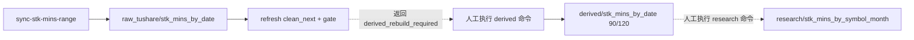
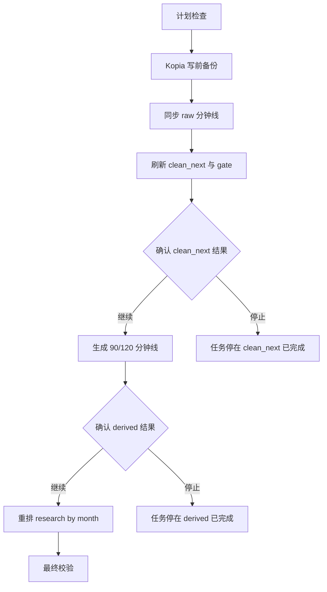

# Local Lake 股票分钟线同步中心可视化流水线方案 v1

- 版本：v1
- 状态：已部分落地；第 1 步“后端只读计划模型与 API 契约”、第 2 步“前端阶段化展示，只接只读 plan”、第 3 步“状态型 run 与人工确认/停止契约”、第 4 步“Kopia 写前备份”和第 5 步“raw + clean_next 到第一个确认点”已实现，90/120、research by month 和最终校验阶段待继续推进
- 更新时间：2026-05-15
- 适用范围：`lake_console` 数据湖同步中心中的 `stk_mins_sync` 专项入口

---

## 1. 目的

本文只解决一个问题：

```text
把股票分钟线从 raw 同步到 clean_next、90/120 分钟派生、research by month 的过程，
放进数据湖同步中心，并让运营能看到每一步、确认每一步，而不是执行一个黑盒命令。
```

这不是普通远程 DB 同步，也不是技术指标计算中心。

本方案只覆盖：

| 范围 | 结论 |
| --- | --- |
| `raw_tushare/stk_mins_by_date` | 覆盖 |
| `research/stk_mins_by_date_clean_next` 与 gate | 覆盖 |
| `derived/stk_mins_by_date` 的 `90/120min` | 覆盖 |
| `research/stk_mins_by_symbol_month` | 覆盖 |
| 分钟技术指标计算 | 不覆盖，后置 |
| `index_mins` | 不覆盖，另行专项 |
| 自研恢复能力 | 不覆盖，恢复继续依赖 Kopia |

---

## 2. 当前代码事实

本节只记录当前实现事实，不按期望推断。

| 事实 | 当前位置 | 结论 |
| --- | --- | --- |
| 已有 `stk_mins_sync` profile | `lake_console/backend/app/services/sync_center_profiles.py` | 目前是 `planned`，不是可执行入口 |
| 同步中心 runner 会拒绝 `stk_mins_sync` | `lake_console/backend/app/services/sync_profile_runner.py` | 只允许普通 DB 同步和本地参考数据刷新 |
| 前端也把 `stk_mins_sync` 当计划中入口 | `lake_console/frontend/src/pages/SyncCenterPage.tsx` | 展示但不能启动 |
| `sync-stk-mins-range` 会触发 raw 到 clean_next | `lake_console/backend/app/services/tushare_stk_mins_sync_service.py` | raw 写完后会刷新 clean_next 和 gate |
| `90/120min` 派生是独立命令 | `lake_console/backend/app/services/stk_mins_derived_service.py` | 不会被 raw 同步自动执行 |
| research by month 是独立命令 | `lake_console/backend/app/services/stk_mins_research_service.py` | 不会被 raw 同步自动执行 |
| 现有同步中心有 plan、run、events、lock、Kopia 备份基础设施 | `lake_console/backend/app/api/sync_center.py`、`lake_console/backend/app/services/lake_job_state.py` | 可以复用，但需要扩展为阶段化流水线 |
| 当前 `POST /api/lake/sync/runs` 是同步执行 | `lake_console/backend/app/api/sync_center.py` | 不适合直接承载长时间分钟线任务 |

当前真实链路是：



所以，运营之前的理解“同步 raw 会一路自动生成 clean_next、90/120、by month”并不是当前实现事实。

---

## 3. 目标体验

目标不是“一个按钮跑到底”，而是：

```text
一键生成计划 -> 分阶段执行 -> 每个关键节点可查看结果 -> 需要时人工确认继续。
```

页面应让运营看到：

| 信息 | 展示方式 |
| --- | --- |
| 这次会影响哪些日期、频率和月份 | 计划摘要 |
| 写入前是否已做 Kopia 备份 | 备份节点 |
| raw 每个频率同步到哪里 | raw 同步节点 |
| clean_next 与 gate 是否通过 | clean_next 节点 |
| 是否继续生成 90/120 | 人工确认节点 |
| 90/120 是否完整 | derived 节点 |
| 是否继续重排 by month | 人工确认节点 |
| research by month 行数是否与来源一致 | research 节点 |
| 最终是否可供研究层消费 | 最终校验节点 |

---

## 4. 非目标

以下内容本轮不做：

1. 不把 `stk_mins_sync` 混进 `prod_db_daily`。
2. 不让前端自己拼接路径、推断行数、推断阶段状态。
3. 不把现有三个 CLI 命令简单串成一个黑盒命令。
4. 不做技术指标自动计算。
5. 不做一键恢复，恢复继续通过 Kopia 页面和命令完成。
6. 不在同步中心暴露 SQL、表名、字段名或任意 where 条件。
7. 不改变现有 raw、clean_next、derived、research 的业务写入规则。

---

## 5. Profile 定位

`stk_mins_sync` 应继续作为同步中心里的独立 profile，但它不能复用普通 `SyncProfileRunner`。

原因很简单：

| 普通 profile | `stk_mins_sync` |
| --- | --- |
| 以数据集为单位执行 | 以流水线阶段执行 |
| 多数任务一次请求很快返回 | 分钟线可能长时间运行 |
| 失败后通常只影响一个数据集分区 | 失败可能影响 raw、clean_next、derived、research 多层 |
| 页面主要看数据集结果 | 页面必须看阶段、门禁、人工确认 |

建议新增专项执行器：

```text
StkMinsPipelinePlanner
StkMinsPipelineRunner
StkMinsPipelineState
```

这些能力仍挂在同步中心下面，不新建一个孤立系统。

---

## 6. 流水线阶段

默认阶段如下：

| 顺序 | 阶段 key | 页面名称 | 是否写数据 | 是否需要人工确认 | 作用 |
| ---: | --- | --- | --- | --- | --- |
| 1 | `plan_preflight` | 计划检查 | 否 | 否 | 检查日期、交易日、频率、影响月份、已存在分区 |
| 2 | `prewrite_backup` | 写前备份 | 否 | 否 | 创建 Kopia 备份点 |
| 3 | `raw_sync` | 同步 raw 分钟线 | 是 | 否 | 执行 raw 全市场分钟线同步 |
| 4 | `clean_next_refresh` | 刷新 clean_next | 是 | 否 | 刷新正式 clean_next 与 gate |
| 5 | `clean_next_review` | clean_next 结果确认 | 否 | 是 | 运营查看 raw/clean/gate 结果后确认是否继续 |
| 6 | `derived_90_120_build` | 生成 90/120 分钟线 | 是 | 否 | 生成 derived 层 `90/120min` |
| 7 | `derived_review` | derived 结果确认 | 否 | 是 | 运营查看 90/120 结果后确认是否继续 |
| 8 | `research_month_rebuild` | 重排 research by month | 是 | 否 | 重排 `research/stk_mins_by_symbol_month` |
| 9 | `final_validation` | 最终校验 | 否 | 否 | 检查 raw/clean/gate/derived/research 是否对齐 |

阶段图：



---

## 7. 阶段状态模型

每个阶段必须由后端返回完整展示信息。前端只展示，不拼接、不猜测。

建议字段：

| 字段 | 含义 |
| --- | --- |
| `stage_key` | 稳定阶段 key |
| `stage_title` | 页面显示名称，由后端返回 |
| `stage_order` | 展示顺序 |
| `stage_status` | `pending`、`running`、`passed`、`failed`、`waiting_confirmation`、`skipped`、`cancelled` |
| `display_summary` | 阶段摘要，由后端返回 |
| `input_summary` | 输入范围、日期、频率、月份 |
| `output_summary` | 输出结果、行数、路径、文件数 |
| `metrics` | 结构化指标，如 rows、files、freqs、trade_dates |
| `artifacts` | 相关文件、目录、Kopia 备份点、事件文件 |
| `issues` | 阻断或警告 |
| `requires_confirmation` | 是否需要人工确认 |
| `confirmation_prompt` | 需要确认时展示的提示 |
| `confirmed_by` | 确认人，本地工具第一期可为空或固定为本机用户 |
| `confirmed_at` | 确认时间 |
| `next_action` | 后端建议的下一步按钮文案和动作 |

示例：

```json
{
  "stage_key": "clean_next_review",
  "stage_title": "clean_next 结果确认",
  "stage_order": 5,
  "stage_status": "waiting_confirmation",
  "display_summary": "clean_next 已刷新，7 个交易日、5 个频率 gate 全部通过。",
  "metrics": {
    "trade_date_count": 7,
    "freq_count": 5,
    "gate_passed_count": 35,
    "gate_failed_count": 0
  },
  "requires_confirmation": true,
  "confirmation_prompt": "确认继续生成 90/120 分钟线。",
  "next_action": {
    "action": "continue",
    "label": "继续生成 90/120"
  }
}
```

---

## 8. API 契约方向

现有同步中心 API 不需要推翻，但要扩展。

### 8.1 Profile 列表

`GET /api/lake/sync/profiles`

目标变化：

| 当前 | 目标 |
| --- | --- |
| `stk_mins_sync` 返回 `planned` | 后端执行器完成后返回 `enabled` |
| 前端本地写死计划中说明 | 前端使用后端返回的显示信息 |

### 8.2 生成计划

`POST /api/lake/sync/profiles/stk_mins_sync/plan`

输入只允许业务参数：

| 参数 | 含义 |
| --- | --- |
| `start_date` | 起始交易日 |
| `end_date` | 结束交易日 |
| `freqs` | `1/5/15/30/60`，默认全频 |
| `scope` | 第一期只允许 `all_market` |
| `mode` | 默认 `manual_gate`，表示关键节点需要人工确认 |

输出必须包含：

| 字段 | 含义 |
| --- | --- |
| `plan_token` | 计划凭证 |
| `profile_key` | 固定 `stk_mins_sync` |
| `normalized_parameters` | 后端归一化后的参数 |
| `pipeline_stages` | 阶段列表 |
| `affected_trade_dates` | 受影响交易日 |
| `affected_months` | 受影响月份 |
| `backup_plan` | 写前备份范围 |
| `blockers` | 阻断项 |
| `warnings` | 警告项 |

计划阶段必须只读，不写数据，不创建 Kopia 备份点。

### 8.3 启动任务

`POST /api/lake/sync/runs`

目标变化：

| 当前 | 目标 |
| --- | --- |
| 请求内同步执行完整任务 | 创建 run 后快速返回，后台执行到第一个停顿点 |
| run 详情主要是数据集结果 | run 详情包含阶段状态 |

分钟线任务不能长期占用一个 HTTP 请求。启动接口应该只完成：

1. 校验 plan。
2. 获取写入锁。
3. 创建 run。
4. 启动后台执行。
5. 返回 `run_id`。

### 8.4 查看任务

`GET /api/lake/sync/runs/{run_id}`

必须返回：

| 字段 | 含义 |
| --- | --- |
| `run_id` | 任务 id |
| `profile_key` | `stk_mins_sync` |
| `run_status` | 总状态 |
| `pipeline_stages` | 当前阶段状态 |
| `current_stage_key` | 当前阶段 |
| `requires_confirmation` | 是否等待人工确认 |
| `next_action` | 下一步动作 |
| `backup` | Kopia 备份结果 |
| `errors` | 错误列表 |

### 8.5 拉取事件

`GET /api/lake/sync/runs/{run_id}/events`

沿用现有事件流，但事件需要带阶段：

| 字段 | 含义 |
| --- | --- |
| `stage_key` | 事件所属阶段 |
| `event_type` | 事件类型 |
| `level` | `info/warning/error` |
| `message` | 给人看的说明 |
| `metrics` | 行数、文件数、耗时等 |

### 8.6 继续或停止

新增：

| API | 职责 |
| --- | --- |
| `POST /api/lake/sync/runs/{run_id}/continue` | 人工确认继续下一阶段 |
| `POST /api/lake/sync/runs/{run_id}/abort` | 人工停止后续阶段 |

这两个 API 只改变当前 run 的推进状态，不允许前端回传新的数据路径或写入范围。

---

## 9. UI 边界

页面仍在“同步中心”里，不新增一个孤立页面。

推荐布局：

| 区域 | 内容 |
| --- | --- |
| 顶部摘要 | profile、日期范围、频率、当前状态、锁状态 |
| 左侧配置 | 选择 `stk_mins_sync`、日期、频率、生成计划 |
| 中间主区 | 阶段时间线，显示每一步状态 |
| 右侧抽屉 | 点击阶段后看详情、行数、目录、错误、事件 |
| 底部事件 | 当前 run 的事件流 |

展示规则：

1. 前端不拼接 `raw_tushare/...`、`research/...` 等路径。
2. 前端不根据 `stage_key` 自己推断标题。
3. 前端不根据行数自己判断成功失败。
4. 前端只使用后端返回的 `stage_title`、`display_summary`、`metrics`、`issues`、`next_action`。
5. 按钮是否可点由后端返回的 `next_action` 决定。

### 9.1 页面主结构草图

页面采用“顶部任务摘要 + 左侧参数区 + 中部阶段表 + 右侧详情抽屉 + 底部事件流”。

不采用大面积说明文案，不把复杂结果塞进主表，不让运营在多个页面之间来回找状态。

```text
┌──────────────────────────────────────────────────────────────────────────────┐
│ 数据湖同步中心 / 股票分钟线专项                         锁：运行中  备份：已完成 │
│ raw -> clean_next -> 90/120 -> research by month             run_20260515_xxx │
├──────────────────────────────────────────────────────────────────────────────┤
│ 日期：2026-05-08 ~ 2026-05-14   频率：1/5/15/30/60   模式：人工确认推进        │
├───────────────┬──────────────────────────────────────────────────────────────┤
│ 配置区         │ 阶段进度                                                     │
│               │                                                              │
│ Profile        │  ✓ 计划检查  ✓ 写前备份  ● 同步 raw  ○ clean_next  ○ derived │
│ 股票分钟线专项 │                                                              │
│               │                                                              │
│ 起始日期        │ ┌────┬────────────────────┬──────────┬──────────────────┬──────┐ │
│ 2026-05-08     │ │ #  │ 阶段                 │ 状态      │ 结果摘要          │ 操作 │ │
│               │ ├────┼────────────────────┼──────────┼──────────────────┼──────┤ │
│ 结束日期        │ │ 1  │ 计划检查             │ 已通过    │ 5频率 / 7交易日    │ 详情 │ │
│ 2026-05-14     │ │ 2  │ Kopia 写前备份        │ 已通过    │ 6组路径 / 1快照    │ 详情 │ │
│               │ │ 3  │ 同步 raw 分钟线       │ 执行中    │ freq=1 处理中     │ 详情 │ │
│ 频率            │ │ 4  │ 刷新 clean_next/gate  │ 待执行    │ -                │ -    │ │
│ 1 / 5 / 15     │ │ 5  │ clean_next 结果确认   │ 待执行    │ -                │ -    │ │
│ 30 / 60        │ │ 6  │ 生成 90/120           │ 待执行    │ -                │ -    │ │
│               │ │ 7  │ derived 结果确认      │ 待执行    │ -                │ -    │ │
│ [生成计划]      │ │ 8  │ 重排 research by month│ 待执行    │ -                │ -    │ │
│ [启动执行]      │ │ 9  │ 最终校验              │ 待执行    │ -                │ -    │ │
│               │ └────┴────────────────────┴──────────┴──────────────────┴──────┘ │
├───────────────┴──────────────────────────────────────────────────────────────┤
│ 事件流：12:01 写前备份完成 · 12:03 raw freq=1 开始 · 12:08 写入 1327428 行       │
└──────────────────────────────────────────────────────────────────────────────┘
```

主页面只回答四件事：

1. 当前任务是谁。
2. 当前跑到哪一步。
3. 这一步结果是否明确通过。
4. 下一步能不能继续。

### 9.2 阶段表字段

阶段表必须高密度、低噪声，但关键信息不能省略。

| 列 | 含义 | 显示来源 | 说明 |
| --- | --- | --- | --- |
| `#` | 阶段顺序 | 后端 `stage_order` | 不由前端排序推断 |
| `阶段` | 阶段名称 | 后端 `stage_title` | 不由前端根据 key 翻译 |
| `状态` | 当前状态 | 后端 `stage_status_label` | 显示中文状态 |
| `结果摘要` | 当前阶段结论 | 后端 `display_summary` | 必须是能独立理解的一句话 |
| `操作` | 可执行动作 | 后端 `next_action` | 无动作时显示 `-` |

状态文案必须无歧义：

| 状态值 | 页面文案 | 含义 |
| --- | --- | --- |
| `pending` | 待执行 | 尚未执行 |
| `running` | 执行中 | 正在执行，不能人工继续 |
| `passed` | 已通过 | 阶段完成且校验通过 |
| `waiting_confirmation` | 等待确认 | 阶段完成，后续写入需要人工确认 |
| `failed` | 失败 | 阶段失败，后续不会继续 |
| `skipped` | 已跳过 | 后端明确判定本阶段不需要执行 |
| `cancelled` | 已停止 | 运营主动停止后续阶段 |

不能出现这些含糊文案：

| 禁用文案 | 问题 |
| --- | --- |
| `完成` | 不知道是写完了，还是校验通过了 |
| `正常` | 不知道依据是什么 |
| `处理中` | 不知道是排队、执行中，还是等待确认 |
| `可用` | 不知道是哪一层可用 |
| `最新` | 不知道最新到哪个交易日 |

### 9.3 人工确认态

当 clean_next 或 derived 阶段完成后，页面必须明确停住，不自动继续。

```text
┌────┬────────────────────┬──────────────┬──────────────────────────────┬──────────────┐
│ 5  │ clean_next 结果确认 │ 等待确认       │ gate 35/35 通过，raw/clean 行数一致 │ 继续生成90/120 │
└────┴────────────────────┴──────────────┴──────────────────────────────┴──────────────┘
```

确认态必须表达清楚：

1. 已经完成了什么。
2. 校验结果是什么。
3. 继续后会写哪一层。
4. 停止后当前数据停在哪一层。

按钮文案不能写成“继续”这种泛词，必须写具体动作：

| 阶段 | 按钮文案 |
| --- | --- |
| `clean_next_review` | `继续生成 90/120` |
| `derived_review` | `继续重排 research by month` |
| 任意确认态 | `停止后续写入` |

### 9.4 详情抽屉

主表只展示结论，细节进入右侧抽屉。

clean_next 确认抽屉示例：

```text
┌────────────────────────────────────────────┐
│ clean_next 结果确认                         │
│ 状态：等待确认                              │
├────────────────────────────────────────────┤
│ 摘要                                        │
│ 7 个交易日 · 5 个频率 · gate 35/35 通过      │
├────────────────────────────────────────────┤
│ 频率   raw rows     clean rows    gate       │
│ 1      9,284,xxx    9,284,xxx     passed     │
│ 5      1,889,xxx    1,889,xxx     passed     │
│ 15       655,xxx      655,xxx     passed     │
│ 30       347,xxx      347,xxx     passed     │
│ 60       192,xxx      192,xxx     passed     │
├────────────────────────────────────────────┤
│ 影响路径                                    │
│ raw_tushare/stk_mins_by_date/...             │
│ research/stk_mins_by_date_clean_next/...     │
├────────────────────────────────────────────┤
│ 最近事件                                    │
│ 12:31 clean_next refresh completed           │
│ 12:31 gate published                         │
├────────────────────────────────────────────┤
│ [停止后续写入]                 [继续生成90/120] │
└────────────────────────────────────────────┘
```

详情抽屉必须按阶段类型展示不同信息：

| 阶段 | 抽屉重点 |
| --- | --- |
| 计划检查 | 日期范围、交易日、频率、影响月份、阻断项、警告项 |
| 写前备份 | Kopia snapshot id、备份路径、新建路径、失败原因 |
| raw 同步 | freq、窗口、请求数、写入行数、quota、失败股票或窗口 |
| clean_next | raw rows、clean rows、gate 状态、问题分区 |
| derived | 90/120 输出行数、来源 30/60 覆盖、缺失分区 |
| research | 影响月份、freq、source rows、research rows、bucket 数 |
| 最终校验 | 各层最终通过情况、可消费到哪个交易日和月份 |

### 9.5 顶部摘要

顶部摘要必须让运营不打开抽屉也能知道任务口径。

必须展示：

| 字段 | 示例 |
| --- | --- |
| profile | `股票分钟线专项` |
| run id | `run_20260515_xxx` |
| 日期范围 | `2026-05-08 ~ 2026-05-14` |
| 频率 | `1/5/15/30/60` |
| 执行模式 | `人工确认推进` |
| 当前阶段 | `同步 raw 分钟线` |
| 写入锁 | `运行中` |
| 写前备份 | `已完成` |

日期必须显示绝对日期，不显示“今天”“昨天”“最新”。

### 9.6 事件流

事件流放在页面底部或详情抽屉内，作为辅助排查，不作为主要信息入口。

事件必须包括：

| 字段 | 示例 |
| --- | --- |
| 时间 | `2026-05-15 12:08:31` |
| 阶段 | `raw_sync` |
| 级别 | `info` |
| 消息 | `freq=1 写入完成` |
| 指标 | `rows=1327428 files=1` |

事件流不能代替阶段表。阶段表必须始终给出当前阶段结论。

### 9.7 无歧义规则

为避免页面看起来“像成功了但其实没跑完”，UI 必须遵守：

1. `raw_sync` 已通过不等于整条链路可用于 research。
2. `clean_next_refresh` 已通过不等于已经生成 90/120。
3. `derived_90_120_build` 已通过不等于 research by month 已经重排。
4. 只有 `final_validation` 已通过，才能展示“本轮链路完成”。
5. 如果停在人工确认点，顶部状态必须显示 `等待确认`，不能显示 `成功`。
6. 如果运营停止后续阶段，顶部状态必须显示停在哪一层，不能显示失败，也不能显示成功。

---

## 10. 写前备份规则

`stk_mins_sync` 写入前必须创建 Kopia 备份点。

备份范围由后端计划生成，至少覆盖：

| 目录 | 说明 |
| --- | --- |
| `raw_tushare/stk_mins_by_date/freq=*/trade_date=*` | 本次会替换或新增的 raw 分区 |
| `research/stk_mins_by_date_clean_next/freq=*/trade_date=*` | 本次会刷新或新增的 clean_next 分区 |
| `derived/stk_mins_by_date/freq=90/trade_date=*` | 本次会生成或替换的 90 分钟分区 |
| `derived/stk_mins_by_date/freq=120/trade_date=*` | 本次会生成或替换的 120 分钟分区 |
| `research/stk_mins_by_symbol_month/freq=*/trade_month=*` | 本次会重排的月度 research 分区 |

如果目标路径写前不存在，不能假装已经备份。必须在备份结果里记录：

```text
path_missing_before_write
```

恢复时，已存在路径走 Kopia restore；新建路径需要人工确认后删除。

---

## 11. 最新交易日规则

同步到“最新”时，后端不能直接使用当天日期。

目标规则：

| 场景 | 默认 end_date |
| --- | --- |
| 今天不是交易日 | 最近一个已开市交易日 |
| 今天是交易日但未到收盘后安全时间 | 上一个已开市交易日 |
| 今天是交易日且已过收盘后安全时间 | 今天 |

第一期可以先要求运营显式填写 `end_date`。如果后续做“同步到最新”按钮，必须由后端基于本地交易日历和安全时间返回目标日期，前端不能自己算。

---

## 12. 失败与暂停语义

失败处理必须保守。

| 位置 | 处理 |
| --- | --- |
| 计划检查失败 | 不创建 run |
| Kopia 备份失败 | 不写任何数据 |
| raw 同步失败 | 停止后续 clean_next、derived、research |
| clean_next gate 不通过 | 停在 `clean_next_review`，不继续生成 90/120 |
| derived 缺源或行数异常 | 停止 research by month |
| research by month 行数不一致 | run 失败，保留备份点和事件 |
| 人工点击停止 | run 进入 `cancelled` 或 `stopped_after_stage` |

任务可以停在中间状态，但必须说清楚停在哪里、已经写了什么、下一步能做什么。

---

## 13. 验收标准

后续开发完成后，至少满足：

1. `stk_mins_sync` profile 能生成只读计划。
2. 计划能列出完整阶段、影响交易日、影响月份、备份范围。
3. 启动 run 前必须完成 Kopia 写前备份。
4. 页面能看到每个阶段状态。
5. clean_next 完成后默认停下等待人工确认。
6. derived 完成后默认停下等待人工确认。
7. run 详情能展示 raw、clean_next、derived、research 的关键行数和校验结果。
8. 前端不拼接路径、不推断成功失败、不自行拼装展示字段。
9. 失败后不会自动继续扩大写入范围。
10. 技术指标计算仍然不被本 profile 自动触发。

---

## 14. 开发顺序建议

第一步只做文档评审，不写代码。

2026-05-15 开发进度：第 1 步“后端计划模型与 API 契约”、第 2 步“前端阶段化展示，只接只读 plan”、第 3 步“状态型 run 与人工确认/停止契约”、第 4 步“Kopia 写前备份”和第 5 步“raw + clean_next 到第一个确认点”已落地。当前 `stk_mins_sync` 支持生成只读计划，返回 `pipeline_stages`、`affected_trade_dates`、`affected_months`、`backup_plan`、`warnings` 等字段；前端只展示后端返回的阶段标题、状态、摘要和指标，不拼接路径、不推断阶段结论；创建 run 会获取同步中心锁、执行 Kopia 写前备份、调用现有 `TushareStkMinsSyncService.sync_range()` 完成 raw 写入与 clean_next/gate 刷新，然后释放锁并停在 `clean_next_review` 等待人工确认；仍不生成 90/120、不重排 research by month、不触发技术指标。

后续建议按以下顺序推进：

| 顺序 | 目标 | 是否写数据 |
| ---: | --- | --- |
| 1 | 后端计划模型与 API 契约 | 否 |
| 2 | 前端阶段化展示，只接 mock 或只读 plan | 否 |
| 3 | run 状态扩展，支持阶段和人工确认 | 否 |
| 4 | 接入 Kopia 写前备份 | 否 |
| 5 | 接入 raw + clean_next 到第一个确认点 | 是 |
| 6 | 接入 derived 90/120 到第二个确认点 | 是 |
| 7 | 接入 research by month 与最终校验 | 是 |

每一步都必须保持同步中心已有普通 profile 可用，不能为了 `stk_mins_sync` 破坏 `prod_db_daily`、`prod_db_snapshot_refresh`、`prod_db_manual_backfill`、`lake_reference_refresh`。
