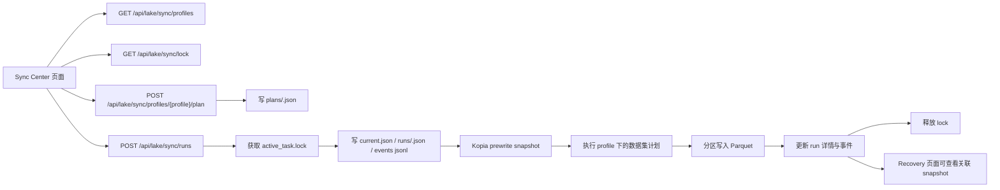
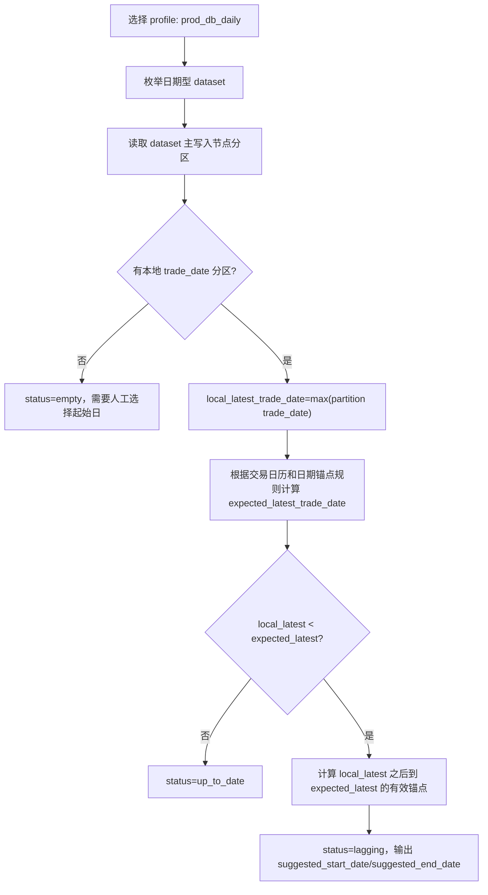

# Local Lake Sync Center 统一设计与链路审计 v1

## 1. 文档目的

本文把 Local Lake 从远程生产库同步数据到本地 Parquet Lake 的长线讨论，统一整理成一个可执行、可审计、可评审的总文档。

它回答五个问题：

1. 当前拍板过的规则是什么。
2. 从页面到后端、备份、写盘、状态记录、恢复提示的整条链路是否闭合。
3. 异常处理是否有断点。
4. 本地磁盘状态文件、字段和 API 是否合理。
5. 后续开发应该按什么节奏推进，哪些 milestone 必须先后完成。

本文只做方案收口和链路审计，不代表代码已经全部实现。

## 2. 关联文档

本总文档以以下文档为输入，并对它们做一致性核对：

1. [Local Lake 从远程 DB 每日同步能力设计 v1（HTML）](/Users/congming/github/goldenshare/docs/architecture/local-lake-prod-db-daily-sync-design-v1.html)
2. [Local Lake Sync Center 页面设计 v1（HTML）](/Users/congming/github/goldenshare/docs/architecture/local-lake-prod-db-sync-center-page-design-v1.html)
3. [Local Lake Sync Center API 契约 v1（HTML）](/Users/congming/github/goldenshare/docs/architecture/local-lake-prod-db-sync-api-contract-v1.html)
4. [Local Lake Kopia 集成恢复管理方案 v1](/Users/congming/github/goldenshare/docs/architecture/local-lake-write-recovery-management-plan-v1.md)
5. [Local Lake Console 架构方案 v1](/Users/congming/github/goldenshare/docs/architecture/local-lake-console-architecture-plan-v1.md)
6. [Local Lake 数据集同步扩展方案 v1](/Users/congming/github/goldenshare/docs/architecture/local-lake-dataset-sync-expansion-plan-v1.md)
7. [Local Lake 数据集接入模式分类与 Checklist v1](/Users/congming/github/goldenshare/docs/architecture/local-lake-dataset-access-mode-checklist-v1.md)

## 3. 已拍板结论

### 3.1 功能边界

1. 本能力属于 `lake_console/` 本地独立工程，不进入生产 `src/app/web`，不进入生产 Ops。
2. 页面叫 Sync Center，用来管理本地 Lake 从远程生产库或本地参考数据源刷新数据。
3. UI 不暴露 SQL，不允许用户输入表名、字段名、where 条件或任意查询片段。
4. 同一时刻只能运行一个写入任务。
5. stale lock 超时时间固定为 6 小时。
6. 默认每日同步窗口是 lookback 1 天。
7. 任何会写 Lake 的任务，写入前必须先做 Kopia prewrite snapshot。
8. prewrite snapshot 默认不 pin，空间退出交给 Kopia retention；阶段性重要快照可人工 pin。

### 3.2 当前实现范围

通用 Profile Runner 当前覆盖 4 个 profile：

| Profile | 定位 | 本期状态 |
| --- | --- | --- |
| `prod_db_daily` | 从远程生产 DB 同步按交易日或周/月锚点更新的数据集 | 本期实现 |
| `prod_db_snapshot_refresh` | 从远程生产 DB 刷新基础资料、current/snapshot 类数据集 | 本期实现 |
| `prod_db_manual_backfill` | 人工选择白名单数据集和日期范围补数 | 本期实现 |
| `lake_reference_refresh` | 刷新本地参考清单，如股票池、交易日历、指数清单 | 已实现 |

专项入口不走普通 Profile Runner：

| Profile | 当前状态 |
| --- | --- |
| `stk_mins_sync` | 已按专项流水线接入 plan/run/continue/abort；仍不进入普通 Profile Runner。当前 catalog summary 返回 `enabled`，页面展示为“专项可执行”，但执行仍走专项流水线分支。 |
| `index_mins_sync` | 指数分钟线也应单独做，不和股票分钟线共用一个入口；当前仍是计划中，不提供启动。 |
| `indicator_compute` | 技术指标计算不是远程 DB 同步，应作为单独计算中心能力；当前仍是计划中，不提供启动。 |

2026-05-15 补充：`stk_mins_sync` 后续不应做成黑盒“一键命令”。它应作为同步中心里的专项可视化流水线，按 raw 同步、clean_next 与 gate、90/120 分钟派生、research by month、最终校验分阶段展示，并在关键节点允许运营确认是否继续。专项方案见 [Local Lake 股票分钟线同步中心可视化流水线方案 v1](/Users/congming/github/goldenshare/docs/architecture/local-lake-stk-mins-sync-center-pipeline-plan-v1.md)。

## 4. 当前代码能力审计

本节基于当前代码逐项核对，不按文档想象。

### 4.1 已具备能力

| 能力 | 当前代码位置 | 结论 |
| --- | --- | --- |
| Lake API 框架 | `lake_console/backend/app/main.py` | 已有 FastAPI app 和 `/api/lake/**`、`/api/recovery/**` 路由装配。 |
| 数据集文件扫描 | `lake_console/backend/app/services/filesystem_scanner.py` | 已用于数据集总览和分区展示。 |
| 命令示例 API | `lake_console/backend/app/api/command_examples.py` | 已有“只展示命令，不执行写入”的页面支撑能力。 |
| Kopia 快照只读查询 | `lake_console/backend/app/services/kopia_recovery_service.py`、`lake_console/backend/app/api/recovery.py` | 已能列快照、看详情、生成恢复提示。 |
| 本地同步 planner | `lake_console/backend/app/sync/planner.py` | 已能为部分数据集生成 `LakeSyncPlan`。 |
| 本地同步 engine | `lake_console/backend/app/sync/engine.py` | 已能调用已有 strategy 执行单数据集同步。 |
| 远程 raw DB 白名单 | `lake_console/backend/app/services/prod_raw_db.py` | 已限制允许表、字段投影和系统字段剔除。 |
| 远程 core DB 白名单 | `lake_console/backend/app/services/prod_core_db.py` | 已支持已批准 index 系列 core serving 导出。 |
| 按交易日导出服务 | `lake_console/backend/app/services/db_trade_date_export_service.py` | 已能按分区写 Parquet，并使用 `_tmp -> replace_directory_atomically`。 |
| current/snapshot 导出服务 | `lake_console/backend/app/services/prod_raw_current_export_service.py` | 已能写 raw 和 manifest 双落盘。 |
| 历史同步摘要 | `lake_console/backend/app/services/manifest_service.py` | 仅有 `manifest/sync_runs.jsonl` 摘要流水。 |
| Sync Center API 路由 | `lake_console/backend/app/api/sync_center.py` | M1-M3 已接入 `/api/lake/sync/*`，只做 profiles、lock、plan、run skeleton、events。 |
| Sync Profile Catalog | `lake_console/backend/app/services/sync_center_profiles.py` | 已定义 4 个 `enabled` 通用 profile；`stk_mins_sync` 也返回 `enabled`，但 API/前端走专项流水线分支；`index_mins_sync`、`indicator_compute` 仍为计划中。 |
| Lake Job 状态模型 | `lake_console/backend/app/services/lake_job_state.py` | M1-M3 已实现 `manifest/lake_jobs/**` 的 plan/run/events/current/lock 原子读写。 |
| Kopia Prewrite Backup 服务 | `lake_console/backend/app/services/kopia_prewrite_backup_service.py` | M1-M3 已实现写前备份服务封装；真实执行前必须先 backup。 |
| Sync Profile Runner | `lake_console/backend/app/services/sync_profile_runner.py` | 已承接 4 个通用 profile；分钟线专项不走该 runner。 |
| `stk_mins_sync` 专项流水线 | `lake_console/backend/app/api/sync_center.py`、`lake_console/backend/app/services/stk_mins_pipeline_planner.py`、`lake_console/backend/app/services/stk_mins_pipeline_run_state.py` | 已支持只读计划、Kopia 写前备份、raw + clean_next、人工确认、derived 90/120、research by month 与最终校验。 |

### 4.2 尚未具备能力

| 缺口 | 说明 |
| --- | --- |
| Profile CLI | 设计中有 `plan-profile` / `sync-profile`，当前尚未实现。 |
| 专项 profile 状态命名 | `stk_mins_sync` catalog summary 已收口为 `enabled`，前端展示“专项可执行”；它仍不进入普通 Profile Runner。 |

结论：当前通用 profile 和 `stk_mins_sync` 专项都已经有独立执行链路；后续新增 qfq、index_mins 或 indicator 能力时，必须先判断属于通用 profile、分钟线专项流水线，还是新的计算中心入口，不能把它们混到同一个 runner 里。

## 5. 端到端链路核对

### 5.1 目标链路



### 5.2 链路一致性结论

| 检查点 | 结论 |
| --- | --- |
| 页面入口与 API 前缀 | 一致，统一使用 `/api/lake/sync/*`。 |
| 先 plan 后 run | 一致，设计中 run 必须带 `plan_token`。 |
| 写入前 Kopia | 一致，三份文档都要求 backup 是硬门禁。 |
| 任务状态存储 | 一致，统一落 `manifest/lake_jobs/**`；代码已实现 plan/run/events/current/lock。 |
| 通用 profile 范围 | 一致，通用 runner 只做 4 个 profile；分钟线和指标不混入通用 runner。 |
| `stk_mins` 与 `index_mins` | 一致，`stk_mins_sync` 已作为阶段化专项接入；`index_mins_sync` 仍是后续独立 profile，不能和股票分钟线合并。 |
| UI 不暴露 SQL | 一致，API contract 已禁止 SQL/表名/字段名输入。 |
| 恢复方式 | 一致，只提供 Kopia 快照和命令提示，不自动 restore。 |

### 5.3 发现的设计断点

| 断点 | 影响 | 收口方式 |
| --- | --- | --- |
| `manifest/sync_runs.jsonl` 不能支撑实时任务页面 | 页面无法知道当前任务、事件、锁、备份映射 | 新增 `manifest/lake_jobs/**` 状态模型 |
| 底层 export service 会直接写盘 | 如果页面绕过 profile runner，会缺 Kopia prewrite backup | Sync Center 只能调用 profile runner，不直接暴露底层 export |
| Kopia recovery 只有只读能力 | 不能完成“写前备份” | 新增 `KopiaPrewriteBackupService` |
| 任务崩溃后的状态恢复未实现 | 页面可能只看到 stale lock，不知道具体停在哪 | 事件流和 run detail 必须持续落盘，stale 后人工处理 |
| 新日期分区不存在时的备份范围容易误解 | 新路径不存在不能 snapshot 目标目录本身 | 记录 `path_missing_before_write`，同时备份 dataset root 的 manifest 状态 |
| 多数据集 profile 的失败策略需要明确 | 若继续执行后续数据集，可能产生更大半成功面 | 本期默认 fail-fast；一个数据集失败后停止后续写入，run 记为 `partial_failed` 或 `failed` |

## 6. 状态文件设计复审

### 6.1 现有文件

当前只有：

```text
manifest/sync_runs.jsonl
```

它适合保留历史同步摘要，但不适合承担 Sync Center 的实时任务状态。

原因很简单：它只是一条条“做完以后追加的摘要”，无法表达“当前正在跑谁、锁是谁持有、计划 token 是否过期、事件进度在哪里、Kopia 快照对应哪次 run”。

### 6.2 新增状态目录

Sync Center 需要新增：

```text
manifest/lake_jobs/
  active_task.lock
  current.json
  plans/
    <plan_token>.json
  runs/
    <run_id>.json
  events/
    <run_id>.jsonl
  backups/
    <run_id>-kopia.json
```

这些文件只记录本地 Lake 任务观测，不是数据集事实源。

### 6.3 字段设计

#### `active_task.lock`

| 字段 | 含义 |
| --- | --- |
| `run_id` | 当前持锁任务。 |
| `profile_key` | 任务所属 profile。 |
| `owner_pid` | 本地进程 id。 |
| `owner_host` | 本机主机名。 |
| `acquired_at` | 拿锁时间。 |
| `last_heartbeat_at` | 最近心跳时间。 |
| `stale_after_seconds` | stale 判定阈值，本期固定 21600。 |
| `status` | `running` 或 `stale`。 |

#### `current.json`

| 字段 | 含义 |
| --- | --- |
| `active_run_id` | 当前任务 id；空表示无运行任务。 |
| `profile_key` | 当前任务入口。 |
| `status` | 当前任务状态。 |
| `started_at` | 启动时间。 |
| `updated_at` | 最近更新时间。 |
| `progress_summary` | 页面顶部展示用的短摘要。 |
| `current_dataset_key` | 当前数据集。 |
| `current_partition` | 当前分区或日期。 |

#### `plans/<plan_token>.json`

| 字段 | 含义 |
| --- | --- |
| `plan_token` | 计划唯一凭证。 |
| `profile_key` | 计划对应 profile。 |
| `created_at` | 生成时间。 |
| `expires_at` | 过期时间，过期后不能启动 run。 |
| `request` | 用户输入的参数快照。 |
| `normalized_parameters` | 后端归一后的参数。 |
| `dataset_plans` | 每个数据集会写哪些分区、路径和来源。 |
| `backup_plan` | 写前要备份哪些已存在路径，哪些路径原本不存在。 |
| `blockers` | 阻断原因。 |
| `warnings` | 可执行但需要提示的风险。 |

#### `runs/<run_id>.json`

| 字段 | 含义 |
| --- | --- |
| `run_id` | 任务 id。 |
| `profile_key` | profile。 |
| `plan_token` | 启动时使用的计划凭证。 |
| `status` | `planned`、`lock_acquired`、`backup_running`、`running`、`success`、`failed`、`partial_failed`、`blocked`、`stale`。 |
| `started_at` | 开始时间。 |
| `finished_at` | 结束时间。 |
| `backup` | Kopia 备份结果。 |
| `progress` | 任务进度摘要。 |
| `dataset_results` | 每个数据集的执行结果。 |
| `errors` | 错误列表。 |

#### `events/<run_id>.jsonl`

| 字段 | 含义 |
| --- | --- |
| `seq` | 单 run 内递增序号。 |
| `event_id` | 事件 id。 |
| `created_at` | 事件时间。 |
| `event_type` | `run_started`、`lock_acquired`、`backup_started`、`backup_completed`、`dataset_started`、`partition_written`、`dataset_failed`、`run_completed`、`run_failed` 等。 |
| `level` | `info`、`warning`、`error`。 |
| `message` | 给人看的说明。 |
| `dataset_key` | 关联数据集，可空。 |
| `partition_locator` | 关联分区，可空。 |
| `metrics` | 行数、文件数、耗时等指标。 |
| `error` | 错误结构，可空。 |

#### `backups/<run_id>-kopia.json`

| 字段 | 含义 |
| --- | --- |
| `run_id` | 对应任务。 |
| `provider` | 固定 `kopia`。 |
| `snapshot_ids` | 创建出的 snapshot id 列表。 |
| `backup_paths` | 实际 snapshot 的路径。 |
| `path_missing_before_write` | 写前不存在、属于新建分区的路径。 |
| `pin_policy` | 默认 `none`。 |
| `created_at` | 备份完成时间。 |
| `repository_summary` | 可选记录 Kopia repo 摘要。 |

### 6.4 状态文件写入原则

1. JSON 覆盖写必须使用临时文件再原子替换。
2. JSONL 事件可以 append，但每行必须是完整 JSON。
3. `plans` 和 `runs` 不覆盖数据集事实，只服务任务观测。
4. 写入前的 lock、plan、backup 是硬前置条件；失败时不能开始写数据。
5. 写数据过程中，事件写入失败不能污染已完成的数据分区，但任务应尽量标记为 `failed` 或 `partial_failed`，并给出人工排查提示。
6. 状态文件不能替代 Kopia。恢复仍以 Kopia snapshot 为准。

## 7. API 设计复审

### 7.1 单一职责原则

API 不做大接口。每个接口只服务一个页面动作：

| 页面动作 | API |
| --- | --- |
| 看有哪些入口 | `GET /api/lake/sync/profiles` |
| 看当前是否有任务运行 | `GET /api/lake/sync/lock` |
| 生成执行计划 | `POST /api/lake/sync/profiles/{profile_key}/plan` |
| 启动任务 | `POST /api/lake/sync/runs` |
| 看当前任务 | `GET /api/lake/sync/runs/current` |
| 看任务详情 | `GET /api/lake/sync/runs/{run_id}` |
| 拉取事件流 | `GET /api/lake/sync/runs/{run_id}/events` |
| 释放 stale lock | `POST /api/lake/sync/lock/release-stale` |

### 7.2 不允许的 API 行为

1. 不允许上传 SQL。
2. 不允许上传表名。
3. 不允许上传字段列表。
4. 不允许上传任意 where 条件。
5. 不允许页面直接指定远程 schema/table。
6. 不允许页面绕过 plan 直接 run。

### 7.3 API 合理性结论

当前 API contract 的方向是合理的：它用小接口拆开 profiles、lock、plan、run、events，避免一个接口返回所有字段。

需要补充到实现层的约束：

1. `POST /runs` 必须验证 `plan_token` 未过期，并重新读取 plan 文件，不能信任前端回传的计划内容。
2. `POST /runs` 只能执行 plan 中已记录的 dataset plans，不能重新按请求参数生成另一个计划。
3. `GET /events` 要支持 cursor，避免页面轮询时每次拉全量事件。
4. `release-stale` 必须写事件，记录谁释放、为什么释放。

## 8. 异常处理复审

### 8.1 异常分类

| 错误码 | 发生位置 | 是否写数据 | 处理方式 |
| --- | --- | --- | --- |
| `LOCK_BUSY` | 启动前 | 否 | 阻断 run，页面提示已有任务。 |
| `LOCK_STALE_REVIEW_REQUIRED` | 启动前 | 否 | 要求人工确认释放 stale lock。 |
| `PLAN_TOKEN_EXPIRED` | 启动前 | 否 | 要求重新 plan。 |
| `PROFILE_DISABLED` | plan/run 启动前 | 否 | profile 当前未开放执行入口。前端应禁用 planned/disabled profile 的“生成计划”；后端仍必须二次校验，防止绕过 UI 或旧 plan 回滚。 |
| `DATASET_NOT_ALLOWED` | plan 阶段 | 否 | 数据集不在 profile 白名单。 |
| `SQL_FIELD_FORBIDDEN` | plan 阶段 | 否 | 前端传入非法 SQL/表/字段类参数。 |
| `KOPIA_BACKUP_FAILED` | 写入前 | 否 | 阻断写入，保留错误详情。 |
| `REMOTE_DB_UNAVAILABLE` | 执行阶段 | 否或部分 | 若尚未写分区则 failed；若已有分区成功则 partial_failed。 |
| `LAKE_ROOT_NOT_WRITABLE` | 写入前 | 否 | 阻断写入。 |
| `PARQUET_WRITE_FAILED` | 写入阶段 | 可能部分 | 当前分区应依靠原子替换避免半成品；任务 failed 或 partial_failed。 |
| `PROCESS_CRASH` | 任意阶段 | 可能部分 | 通过 stale lock、events、runs 文件人工恢复判断。 |
| `STATE_WRITE_FAILED` | 状态记录 | 可能部分 | 启动前发生则阻断；执行中发生则尽量标记 run failed，不能污染数据。 |

### 8.2 当前流程断点

1. 进程在拿锁后崩溃：需要 stale lock 面板和 release-stale API。
2. Kopia 备份成功后、写入前崩溃：没有数据变化，但 run 可能停在 backup_completed；需要 events 说明。
3. 某个分区写入成功后，后续分区失败：不能自动恢复，应标记 `partial_failed` 并提示 Recovery 页面。
4. 新建分区写入前路径不存在：Kopia 没法备份不存在的目标目录，需要记录 `path_missing_before_write`，恢复时删除新建分区。
5. 状态文件写失败：如果发生在写入前，必须阻断；如果发生在写入后，不能回滚数据，但必须尽力写入错误文件或终端日志。
6. 多数据集 profile 中途失败：本期默认 fail-fast，不继续后续数据集，避免扩大半成功范围。

### 8.3 推荐 fail-fast 规则

本期 profile runner 应默认：

1. 一个数据集失败后停止后续数据集。
2. 已成功写入的数据集不自动 restore。
3. run 记为 `partial_failed`。
4. 页面展示已成功、已失败、未执行三类结果。
5. 恢复操作只给 Kopia 命令提示，不自动执行。

这样更符合当前本地 Lake 的安全目标：先保护数据，再追求自动化。

## 9. Profile 与数据集覆盖复审

### 9.1 `prod_db_daily`

适合：

1. 交易日点式数据。
2. 周/月锚点数据。
3. 可由 `target_date` 或 `lookback_days` 推导目标分区的数据。

不适合：

1. 无时间输入的基础资料。
2. current/snapshot 刷新。
3. 分钟线。
4. 技术指标。

### 9.2 `prod_db_snapshot_refresh`

适合：

1. `bse_mapping`
2. `namechange`
3. `stock_company`
4. `st`
5. `etf_basic`
6. `etf_index`
7. `ths_index`
8. `ths_member`
9. 其他被定义为 current/snapshot 的白名单数据集

关键规则：这类数据不能伪造成 `trade_date` 数据。

### 9.3 `prod_db_manual_backfill`

适合：

1. 人工指定数据集。
2. 人工指定日期或日期范围。
3. 仍然必须走白名单、plan、Kopia backup、单任务锁。

不适合：

1. 任意 SQL。
2. 非白名单表。
3. 生产库写入。

### 9.4 `lake_reference_refresh`

适合：

1. `stock_basic`
2. `trade_cal`
3. `index_basic`

这些数据既可作为正式 Lake 数据集，也可能双落 manifest，服务其他本地同步任务。

### 9.5 后续专项

1. `stk_mins_sync`：必须读取独立的 clean_next 链路设计，不能复用普通 prod_db_daily。
2. `index_mins_sync`：必须单独设计 active pool、source、分区和 refresh 规则。
3. `indicator_compute`：只做指标计算，不属于远程 DB 同步。

`stk_mins_sync` 的推进方式已单独收口：它不是普通 profile runner 的一个数据集任务，而是同步中心里的阶段化流水线。页面必须显示每个阶段、阶段结果和人工确认点；前端不得自行拼接路径、行数、状态或下一步动作。

## 10. 开发路径与 Milestone

### M0：文档与评审收口

目标：

1. 本总文档完成。
2. 三份 HTML 设计文档与本总文档没有明显冲突。
3. 通过 docs integrity 检查。

不做：

1. 不写 Sync Center 代码。
2. 不写数据。
3. 不执行 Kopia snapshot。

### M1：后端状态模型与 Profile Catalog

状态：已完成。对应代码为 `lake_console/backend/app/schemas/sync_center.py`、`lake_console/backend/app/services/sync_center_profiles.py`、`lake_console/backend/app/services/lake_job_state.py`。

目标：

1. 新增 sync schemas。
2. 新增 `SyncProfileCatalog`。
3. 新增 `LakeJobStateStore`，负责 `manifest/lake_jobs/**` 原子读写。
4. 新增 `LakeJobLockService`。

门禁：

1. 单元测试覆盖 lock acquire、busy、stale、release。
2. 单元测试覆盖 plans/runs/events 状态文件读写。

不做：

1. 不执行真实数据同步。
2. 不调用 Kopia。

### M2：Plan API

状态：已完成。对应代码为 `lake_console/backend/app/api/sync_center.py`，并已接入 `lake_console/backend/app/main.py`。

目标：

1. 实现 `GET /api/lake/sync/profiles`。
2. 实现 `GET /api/lake/sync/lock`。
3. 实现 `POST /api/lake/sync/profiles/{profile_key}/plan`。
4. plan 只生成计划，不写数据，不创建 Kopia snapshot。

门禁：

1. 禁止 SQL/表名/字段名参数。
2. 数据集必须在 profile 白名单。
3. 未开放专项 profile 返回 planned/disabled 状态，不可生成计划或启动；已开放的 `stk_mins_sync` 返回 enabled，但必须走专项流水线。

### M3：Kopia Prewrite Backup 与 Run API 骨架

状态：已完成。对应代码为 `lake_console/backend/app/services/kopia_prewrite_backup_service.py` 和 `lake_console/backend/app/api/sync_center.py`。

说明：当前 `POST /api/lake/sync/runs` 只验证 `plan_token`、获取锁、创建 Kopia prewrite backup、写入 run/events/backups 状态，然后以 `EXECUTION_NOT_IMPLEMENTED` 安全停止；不执行真实数据写入。

目标：

1. 新增 `KopiaPrewriteBackupService`。
2. 实现 `POST /api/lake/sync/runs` 的启动骨架。
3. 启动流程必须是：验证 plan -> 拿锁 -> 写 run -> Kopia backup -> 再进入执行。

门禁：

1. Kopia 失败时不能写数据。
2. plan 过期时不能启动。
3. lock busy 时不能启动。

### M4：Profile Runner 小样本执行

状态：历史阶段已完成。首个小样本用于证明 `plan -> backup -> write -> events -> run result` 链路；当前通用 Profile Runner 已扩展到 4 个 M6 profile，分钟线专项仍不走该 runner。

真实验证记录：

1. plan：`POST /api/lake/sync/profiles/prod_db_snapshot_refresh/plan`，参数 `dataset_keys=["bse_mapping"]`。
2. run：`POST /api/lake/sync/runs`，状态 `success`。
3. Kopia prewrite backup：已生成 snapshot id。
4. 同步结果：`fetched_rows=248`，`written_rows=248`，`manifest_written_rows=248`。
5. 同步后文件：`raw_tushare/bse_mapping/current/part-000.parquet` 与 `manifest/security_reference/tushare_bse_mapping.parquet` 均为 248 行。

目标：

1. 实现 `SyncProfileRunner`。
2. 先接一个小样本数据集，验证 plan -> backup -> write -> events -> run result。
3. 不接入分钟线和指标。

门禁：

1. 写入前必须有 Kopia snapshot id。
2. 分区写入后 run detail 能看到行数、文件路径、耗时。
3. 失败时 run 能进入 `failed` 或 `partial_failed`。

### M5：Sync Center 前端页面

状态：已完成页面接入和多轮布局优化。对应代码为 `lake_console/frontend/src/pages/SyncCenterPage.tsx`、`lake_console/frontend/src/hooks/useSyncCenterData.ts` 与 `lake_console/frontend/src/services/lakeApi.ts` 的 Sync Center API client。页面展示通用 profile、建议同步窗口和 `stk_mins_sync` 专项流水线入口；前端不得绕过 plan/run/lock/Kopia 链路。

目标：

1. 按已确认页面设计还原右侧主页面。
2. 左侧菜单沿用当前 Lake Console 菜单风格。
3. 接入 profiles、lock、plan、run、events API。

门禁：

1. 页面不拼接后端事实。
2. 页面不暴露 SQL 能力。
3. 页面按 planned/disabled 状态展示未开放专项，并禁用“生成计划”和“启动任务”；`stk_mins_sync` 按“专项可执行”展示。

### M6：本期 4 个 Profile 完整接入

状态：代码接入已完成，真实大范围写入仍必须由运营按小样本逐个启动验证。当前 `SyncProfileRunner` 只开放本期 4 个通用 profile；`stk_mins_sync` 已由专项流水线支持，`index_mins_sync`、`indicator_compute` 仍保持计划中，不允许启动。

目标：

1. 接入 `prod_db_daily`。
2. 接入 `prod_db_snapshot_refresh`。
3. 接入 `prod_db_manual_backfill`。
4. 接入 `lake_reference_refresh`。

实现口径：

1. `prod_db_daily`：只允许从 `prod-raw-db` / `prod-core-db` 白名单读取，复用 `DbTradeDateExportService`，按 `trade_date` 或 `start_date/end_date` 输出分区文件。
2. `prod_db_snapshot_refresh`：只允许从 `prod-raw-db` current/snapshot 白名单读取，复用 `ProdRawCurrentExportService`，替换 raw current 与对应 manifest。
3. `prod_db_manual_backfill`：允许日频/周月锚点类按区间补数，也允许 snapshot 白名单做 current 刷新；仍然必须走 plan -> Kopia -> lock -> runner。
4. `lake_reference_refresh`：只允许 `stock_basic`、`trade_cal`、`index_basic` 三个本地参考数据集，复用现有 Tushare reference service；`trade_cal` 支持不传日期做全量分页刷新。

门禁：

1. 每个 profile 至少有一个小样本真实执行验证。
2. 每个 profile 有失败场景测试。
3. 每个 profile 生成的 backup/run/events 可追溯。
4. 前端只能为 enabled 且已有执行分支的 profile 生成计划和启动任务：通用 profile 走 `SyncProfileRunner`，`stk_mins_sync` 走专项流水线；未开放专项只显示 planned/disabled，不得生成计划或启动。

### M6.5：建议同步窗口（只读决策辅助）

状态：已完成首版代码接入。对应代码为 `lake_console/backend/app/services/sync_recommendation_service.py`、`GET /api/lake/sync/recommendations` 与 `lake_console/frontend/src/pages/SyncCenterPage.tsx` 的建议卡片。首版只读，不生成 plan/run/backup/event，不访问远程 DB。

背景：

运营当前缺少一个直接视角来回答：“这些带日期维度的数据集，本地最新到哪天？按今天的交易日历口径，应该同步到哪天？如果落后，建议补哪段？”

这个能力属于 Sync Center 的只读建议层，不是新的写入 profile。它只负责生成建议，不启动任务、不改文件、不访问远程 DB。

#### M6.5.1 功能边界

只做：

1. 读取本地 Lake 文件事实。
2. 读取本地交易日历 manifest。
3. 读取数据集 catalog / planner 已有日期锚点规则。
4. 给出每个日期型数据集的最新本地分区、理论应到分区、延迟天数、缺失锚点数量和建议同步窗口。
5. 前端允许把建议窗口带入 Sync Center 计划参数。

不做：

1. 不直接启动同步。
2. 不创建 Kopia snapshot。
3. 不写 `raw_tushare` / `manifest` / `derived` / `research`。
4. 不读取远程 DB。
5. 不请求 Tushare。
6. 不自行重新实现一套日期模型。

#### M6.5.2 数据来源

| 数据 | 来源 | 说明 |
| --- | --- | --- |
| 本地最新日期 | `FilesystemScanner` 扫描本地分区 | 只看数据集主写入节点；通常是 `raw_tushare/<dataset_key>`，以 planner 生成的 `write_paths` 和 dataset definition 为准，避免 derived/research 干扰同步建议。 |
| 理论应到日期 | `manifest/trading_calendar/tushare_trade_cal.parquet` | 只使用本地交易日历，不访问生产库。 |
| 日期锚点规则 | `load_expected_partition_dates` / `resolve_expected_partition_date` | 复用现有日频、周锚点、月锚点逻辑。 |
| 可推荐数据集范围 | `SyncProfileCatalog.PROD_DB_DAILY_DATASETS` | 第一版只覆盖 `prod_db_daily` / `prod_db_manual_backfill` 里的日期型数据集。 |

#### M6.5.3 推荐计算规则



状态枚举：

| 状态 | 含义 | 页面动作 |
| --- | --- | --- |
| `up_to_date` | 本地最新分区已经达到理论应到日期。 | 不建议同步。 |
| `lagging` | 本地最新分区早于理论应到日期。 | 展示建议同步窗口，可带入计划参数。 |
| `empty` | 本地没有任何日期分区。 | 不自动推荐起始日，提示人工选择。 |
| `blocked_missing_calendar` | 缺少交易日历或交易日历为空。 | 阻断建议生成，提示先刷新 `trade_cal`。 |
| `not_applicable` | 非日期型或不适合连续日期建议的数据集。 | 不展示同步窗口。 |

#### M6.5.4 “今天是否算应到日期”的 cutoff 规则

推荐能力必须避免在交易日尚未稳定时误报“今天落后”。

新增配置建议：

```text
LAKE_SYNC_RECOMMENDATION_CUTOFF_TIME=20:00
```

口径：

1. 如果今天是开市交易日，且当前本地时间早于 cutoff，则理论应到日期使用上一个开市交易日。
2. 如果今天是开市交易日，且当前本地时间等于或晚于 cutoff，则理论应到日期可以使用今天。
3. 如果今天不是开市交易日，理论应到日期使用最近一个开市交易日。
4. cutoff 只影响建议，不影响真实同步执行。

第一版可先把 cutoff 固定为 `20:00`，后续再决定是否暴露到 `config.local.toml`。

#### M6.5.5 与写入链路的关系

建议同步窗口只是“看本地文件事实后给运营一个建议”。它不能成为第二套调度系统，也不能绕过 Sync Center 已经建立的 plan -> Kopia -> lock -> runner 链路。

如果运营点击“带入计划参数”，后续仍然必须走：

```text
生成 plan -> 用户确认 -> 创建 Kopia prewrite snapshot -> 获取单任务锁 -> 执行 runner
```

也就是说，建议能力只回答“建议补哪段”，不负责“帮你直接补”。

#### M6.5.6 API 设计

新增只读接口：

```http
GET /api/lake/sync/recommendations?profile_key=prod_db_daily
```

返回字段：

| 字段 | 含义 |
| --- | --- |
| `generated_at` | 建议生成时间。 |
| `profile_key` | 当前建议所属 profile。 |
| `cutoff_time` | 使用的 cutoff，例如 `20:00`。 |
| `expected_reference_date` | 本轮建议采用的理论参考日期。 |
| `aggregate_plan_hint` | 全部落后数据集的聚合补数建议。只包含 `lagging` 数据集，不包含 `empty`、`up_to_date` 或不可建议项。 |
| `items` | 数据集建议列表。 |

`items` 单项字段：

| 字段 | 含义 |
| --- | --- |
| `dataset_key` | 数据集 key。 |
| `display_name` | 数据集名称。 |
| `source` | 推荐同步来源，例如 `prod-raw-db` / `prod-core-db`。 |
| `status` | `up_to_date` / `lagging` / `empty` / `blocked_missing_calendar` / `not_applicable`。 |
| `local_latest_trade_date` | 本地最新日期分区。 |
| `expected_latest_trade_date` | 理论应到日期。 |
| `suggested_start_date` | 建议同步开始日期。 |
| `suggested_end_date` | 建议同步结束日期。 |
| `lag_anchor_count` | 缺失的有效锚点数量。 |
| `lag_calendar_days` | 自然日延迟。 |
| `reason` | 给人看的原因说明。 |
| `plan_hint` | 可带入计划页面的最小参数。 |

示例：

```json
{
  "generated_at": "2026-05-14T12:00:00+08:00",
  "profile_key": "prod_db_daily",
  "cutoff_time": "20:00",
  "expected_reference_date": "2026-05-13",
  "aggregate_plan_hint": {
    "profile_key": "prod_db_manual_backfill",
    "dataset_keys": ["daily", "moneyflow"],
    "target_date": null,
    "start_date": "2026-04-25",
    "end_date": "2026-05-13"
  },
  "items": [
    {
      "dataset_key": "moneyflow",
      "display_name": "个股资金流向",
      "source": "prod-raw-db",
      "status": "lagging",
      "local_latest_trade_date": "2026-04-24",
      "expected_latest_trade_date": "2026-05-13",
      "suggested_start_date": "2026-04-25",
      "suggested_end_date": "2026-05-13",
      "lag_anchor_count": 11,
      "lag_calendar_days": 19,
      "reason": "本地最新分区早于交易日历理论应到日期。",
      "plan_hint": {
        "profile_key": "prod_db_manual_backfill",
        "dataset_keys": ["moneyflow"],
        "start_date": "2026-04-25",
        "end_date": "2026-05-13"
      }
    }
  ]
}
```

#### M6.5.7 前端设计

在 Sync Center 页面新增卡片：

```text
建议同步窗口
```

表格列：

1. 数据集
2. 本地最新日期
3. 理论应到日期
4. 延迟自然日
5. 缺失锚点数
6. 建议同步窗口
7. 状态
8. 操作

操作按钮：

```text
带入计划参数
带入每日单日全量
带入全部落后补数
```

单行 `带入计划参数` 行为只允许：

1. 选择 `prod_db_manual_backfill`。
2. 设置当前数据集。
3. 填入 `start_date` / `end_date`。
4. 清空旧 plan。

卡片级 `带入每日单日全量` 行为只允许：

1. 选择 `prod_db_daily`。
2. 设置数据集为 `全部数据集`。
3. 填入 `target_date=expected_reference_date`。
4. 清空旧 plan。
5. 仍需用户手动点击“生成计划”和“启动同步任务”。

卡片级 `带入全部落后补数` 行为只允许：

1. 使用后端返回的 `aggregate_plan_hint`，不得在前端自行计算缺失日期。
2. 选择 `prod_db_manual_backfill`。
3. 设置数据集为 `aggregate_plan_hint.dataset_keys`，即全部 `lagging` 数据集集合。
4. 填入 `start_date=aggregate_plan_hint.start_date` 与 `end_date=aggregate_plan_hint.end_date`。
5. 页面必须明确这是一组“建议集合”，不是 profile 全部数据集。
6. 仍需用户手动点击“生成计划”和“启动同步任务”。

计划参数区的数据集选择必须支持：

1. `全部数据集`：前端传 `dataset_keys=[]`，后端按 profile 默认数据集全集生成计划。
2. 单个数据集：前端传 `dataset_keys=[dataset_key]`，只生成该数据集计划。
3. 建议集合：前端传后端 `aggregate_plan_hint.dataset_keys`，只生成这组落后数据集计划。

按钮不允许：

1. 直接启动 run。
2. 自动创建 backup。
3. 绕过 plan -> Kopia -> lock -> runner。
4. 前端自行推导缺口。
5. 自动把每个落后数据集按各自窗口拆成多个任务。

#### M6.5.8 开发门禁

1. 单测必须覆盖日频、周锚点、月锚点。
2. 单测必须覆盖缺交易日历。
3. 单测必须覆盖本地无分区。
4. 单测必须覆盖 cutoff 前后 expected date 的变化。
5. 前端不得自行计算日期差，只展示后端返回字段。
6. API 只读，不允许写任何 Lake 文件。

### M7：本地自动化与长期维护

目标：

1. 评估是否需要本地 launchd 或 crontab。
2. 如果需要，仍然只调用 profile CLI，不绕过 API/runner 语义。
3. 整理保留策略、Kopia pin/unpin 操作手册。

本阶段不是本期开发前置条件。

## 11. 测试与验证清单

### 文档门禁

```bash
python3 scripts/check_docs_integrity.py
```

### 后端单元测试建议

1. Profile catalog 白名单。
2. Plan token 生成、过期、读取。
3. Lock acquire/busy/stale/release。
4. 状态文件原子写。
5. Kopia backup 失败阻断。
6. 非法参数拦截。
7. 单数据集失败后的 fail-fast。
8. `path_missing_before_write` 记录。

### API smoke 建议

1. `GET /api/lake/sync/profiles`
2. `GET /api/lake/sync/lock`
3. `POST /api/lake/sync/profiles/prod_db_daily/plan`
4. `POST /api/lake/sync/runs` 使用过期 `plan_token` 应失败。
5. `POST /api/lake/sync/runs` 在 lock busy 时应失败。
6. `GET /api/lake/sync/recommendations?profile_key=prod_db_daily` 只读返回建议，不产生任何 plan/run/backup/event。

### 前端 smoke 建议

1. 页面能展示 7 个 profile，其中 4 个通用 profile 可用，`stk_mins_sync` 作为专项可执行入口可用，`index_mins_sync` 和 `indicator_compute` 保持 planned/disabled。
2. 空闲/运行中/stale 三种 lock 状态可展示。
3. Plan 预览能看到 dataset、path、backup scope。
4. Run 事件列表可以轮询刷新。

## 12. 总体结论

### 12.1 一致性结论

当前三份设计文档的主线是一致的：

1. 本期只做 4 个 profile。
2. 写前 Kopia 是硬门禁。
3. UI 不暴露 SQL。
4. 单任务锁 6 小时 stale。
5. 状态文件落 `manifest/lake_jobs/**`。
6. `stk_mins`、`index_mins`、`indicator_compute` 后置为独立专项。

### 12.2 主要缺口

当前 Sync Center 编排层已完成 M1-M6 的主要代码接入，M6.5 只读建议也已接入；剩余缺口集中在真实写入验证与后续专项：

1. 4 个 M6 profile 已进入 runner 白名单，但仍需要按小样本逐个做真实执行验证并记录结果。
2. M6.5 建议同步窗口已实现首版只读 API 与前端展示；后续如扩展 profile 范围，仍必须保持只读，不允许绕过写入链路。
3. `stk_mins_sync` 已有独立专项流水线；`index_mins_sync`、`indicator_compute` 仍是 planned，必须另走独立专项设计，不能复用普通 profile runner。
4. profile CLI 未实现；当前推荐从 Sync Center 页面/API 触发，以保证 Kopia、锁、计划和事件记录完整。

### 12.3 开发建议

建议严格按 M1 到 M6 推进。

不要直接把现有 `sync-dataset` 或底层 export service 接到页面按钮上，因为那会绕过 Kopia、锁、计划和事件记录，等于把安全链路打断。

先把任务状态和门禁打牢，再接真实写盘。这次地基要打深一点，别让移动硬盘当“惊喜盲盒”。
