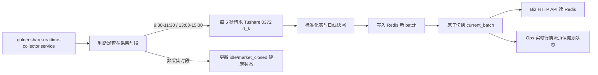
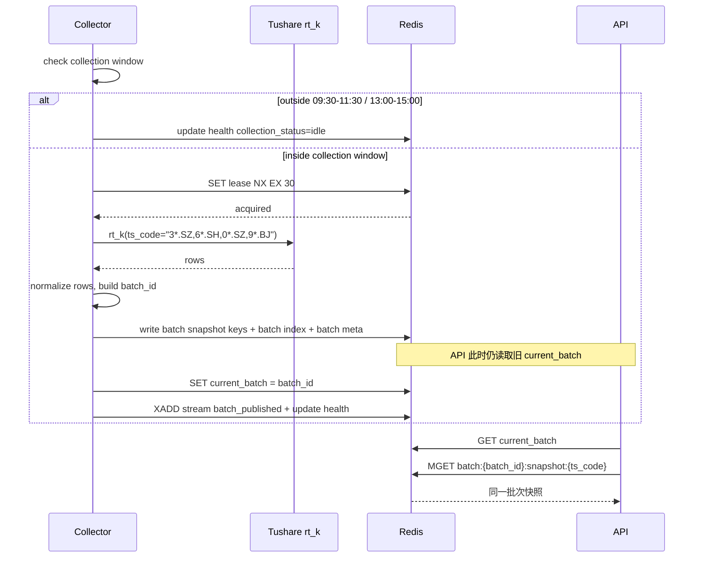

# 股票实时日线流技术落地方案 v1

状态：待评审  
上位方案：[实时行情流架构方案 v1（HTML）](/Users/congming/github/goldenshare/docs/architecture/realtime-market-data-stream-architecture-v1.html)  
源接口事实：[Tushare 0372 A股实时日线](/Users/congming/github/goldenshare/docs/sources/tushare/股票数据/行情数据/0372_A股实时日线.md)  
适用范围：Tushare 0372 `rt_k` 股票实时日线 V1

---

## 1. 目标

本方案把实时行情流 V1 从架构图落成可执行的技术计划。V1 只做一件事：

> 服务端在 A 股连续竞价时段内每 6 秒请求一次 Tushare 0372 `rt_k` 全市场股票实时日线，把最新快照写入 Redis；业务 API 和 Ops 页面只读取 Redis 当前批次。

V1 不进入离线数据集主链，不创建 `DatasetDefinition`，不写 raw/core/serving 历史表，不进入 TaskRun，不参与 freshness/date audit。

---

## 2. 非目标

1. 不落库历史实时行情。
2. 不做分钟线、tick、盘口、指数实时、ETF 实时。
3. 不做用户自定义订阅、复杂权限、复杂行情聚合。
4. 不把实时轮询伪装成 TaskRun 任务。
5. 不把 Redis 健康状态写入离线 freshness 或数据集卡片。
6. 不在 V1 实现 WebSocket，但保留 Redis stream 和协议位置，后续 M5 实现。

---

## 3. 当前代码挂载点

### 3.1 目标目录

```text
src/
  foundation/
    realtime/             # 新增：实时源、collector、Redis 状态层
  biz/
    api/
      realtime.py         # 新增：业务实时快照 API
    queries/
      realtime_stock_rt_daily_query_service.py
    schemas/
      realtime.py
  ops/
    api/
      realtime.py         # 新增：Ops 实时流健康 API
    queries/
      realtime_feed_health_query_service.py
    schemas/
      realtime.py
  app/
    api/v1/router.py      # 只做路由挂载
  cli_parts/
    realtime_handlers.py  # 新增：collector CLI handler
  cli.py                  # 只注册命令
```

### 3.2 依赖边界

```text
foundation/realtime
  不依赖 ops / biz / app

biz/api + biz/queries
  只读取 foundation/realtime 的只读接口
  不知道 Tushare 请求细节

ops/api + ops/queries
  只读取 foundation/realtime 的健康状态
  不写 TaskRun

app/api/v1/router.py
  只 include router
  不写实时业务逻辑
```

边界要求：实时状态写入 Redis 失败，只影响实时服务可用性和 Ops 观测，不影响任何离线业务数据表事务。

---

## 4. V1 数据流



关键点：

1. Redis 不会自己刷新，刷新动作来自服务端 collector。
2. 前端请求不会直接打 Tushare。
3. API 不扫描“最新散 key”，只读 `current_batch` 指向的批次。
4. collector 写完整批次后才切换指针，避免读到半新半旧的数据。
5. collector 只在 9:30-11:30、13:00-15:00 请求 Tushare；非采集时段是正常空闲，不应误报为采集失败。

---

## 5. Tushare 0372 请求设计

### 5.1 请求参数

V1 固定一次拉全市场：

```json
{
  "api_name": "rt_k",
  "params": {
    "ts_code": "3*.SZ,6*.SH,0*.SZ,9*.BJ"
  },
  "fields": "ts_code,name,pre_close,high,open,low,close,vol,amount,num,ask_price1,ask_volume1,bid_price1,bid_volume1,trade_time"
}
```

依据：

1. 源文档明确 `ts_code` 必填。
2. 源文档明确支持股票代码通配符。
3. 源文档示例给出全市场通配符：`3*.SZ,6*.SH,0*.SZ,9*.BJ`。
4. 源文档写明单次最大 6000 条，等同一次提取全市场。
5. V1 目标是全市场最新状态，不按单股票请求，避免 500 次/分钟额度被无意义消耗。

### 5.2 字段要求

所有源文档输出字段都进入 Redis 快照：

| 字段 | 说明 | V1 处理 |
| --- | --- | --- |
| `ts_code` | 股票代码 | 必填，作为快照主键 |
| `name` | 股票名称 | 可空，原样保存 |
| `pre_close` | 昨收价 | 可空，保存为 JSON number 或字符串化 decimal |
| `high` | 最高价 | 可空 |
| `open` | 开盘价 | 可空 |
| `low` | 最低价 | 可空 |
| `close` | 收盘价/最新价 | 可空 |
| `vol` | 成交量 | 可空 |
| `amount` | 成交金额 | 可空 |
| `num` | 成交笔数 | 可空 |
| `ask_price1` | 卖一价 | 可空 |
| `ask_volume1` | 卖一量 | 可空 |
| `bid_price1` | 买一价 | 可空 |
| `bid_volume1` | 买一量 | 可空 |
| `trade_time` | 源端交易时间 | 可空，作为源端时间，不作为唯一新鲜度判断 |

### 5.3 限速

V1 collector 自己控制 10 次/分钟：

```text
poll_interval_seconds = 6
max_calls_per_minute = 10
```

说明：

1. 不依赖全局 `TUSHARE_MAX_CALLS_PER_MINUTE` 作为唯一保护。
2. `TushareHttpClient` 可继续作为 HTTP 客户端，但 realtime collector 必须有自己的 feed 级节奏控制。
3. 后续如果 `rt_k` 进入客户端级限速表，也不能突破 feed 级 10 次/分钟。

### 5.4 采集时间窗口

已确认：V1 只在 A 股连续竞价时段请求 Tushare 源接口。

```text
上午：09:30-11:30
下午：13:00-15:00
时区：Asia/Shanghai
```

说明：

1. 午休、收盘后、夜间不主动请求 Tushare。
2. 非采集时段不等于异常，Ops 页面应显示“非采集时段/空闲”，而不是红色失败。
3. `stale_after_seconds=20` 只用于采集时段内判断 collector 是否滞后。
4. 如果业务 API 在非采集时段读取实时快照，应明确返回当前 Redis 可读批次及其时间，不能伪装成刚刚刷新。

---

## 6. Redis 状态模型

### 6.1 Feed Key

V1 固定：

```text
feed_key = tushare_stock_rt_k
```

### 6.2 Key 设计

| Key | 类型 | 内容 | TTL/保留 |
| --- | --- | --- | --- |
| `rt:feed:{feed_key}:current_batch` | String | 当前可读批次号 | 不短期过期 |
| `rt:feed:{feed_key}:batch:{batch_id}:snapshot:{ts_code}` | String JSON | 某批次内单只股票快照 | 建议 259200 秒 |
| `rt:feed:{feed_key}:batch:{batch_id}:index` | Set | 某批次内有快照的股票代码集合 | 建议 259200 秒 |
| `rt:feed:{feed_key}:batch:{batch_id}:meta` | String JSON | 批次元信息 | 建议 259200 秒 |
| `rt:feed:{feed_key}:batches` | ZSet | 最近批次索引，score 为发布时间戳 | 保留最近 3 个批次 |
| `rt:feed:{feed_key}:stream` | Redis Stream | 短期批次发布事件 | 裁剪最近 5000 条 |
| `rt:feed:{feed_key}:health` | String JSON 或 Hash | feed 健康状态 | 不短期过期 |
| `rt:feed:{feed_key}:lease` | String + TTL | collector 采集租约 | 30 秒 |

说明：

1. `index` 必须放在 batch 下面，不能用全局 `rt:index:{feed_key}` 表达当前事实，否则容易在切批时混入旧批次。
2. `stream` V1 先写批次发布事件，不按每只股票写一条变化事件，避免 6 秒一次全市场时产生过大事件量。
3. M5 WebSocket 阶段再决定是否增加按股票变化的 delta stream。
4. 因为 collector 不在午休和收盘后请求源站，批次 TTL 不能沿用 180 秒这种短 TTL；V1 建议设为 259200 秒（72 小时），同时只保留最近 3 个批次，避免把 Redis 变成历史库。

### 6.3 快照 JSON

```json
{
  "feed_key": "tushare_stock_rt_k",
  "batch_id": "20260514T145804.120000Z",
  "source": "tushare",
  "source_api_name": "rt_k",
  "ts_code": "600000.SH",
  "name": "浦发银行",
  "trade_time": "2026-05-14 14:58:03",
  "received_at": "2026-05-14T14:58:04.120000+08:00",
  "pre_close": "10.01",
  "high": "10.30",
  "open": "10.10",
  "low": "10.02",
  "close": "10.23",
  "vol": "12345600",
  "amount": "125000000",
  "num": "23001",
  "ask_price1": "10.23",
  "ask_volume1": "12000",
  "bid_price1": "10.22",
  "bid_volume1": "10000",
  "raw_payload_hash": "sha256..."
}
```

建议数字字段在 Redis 内保存为字符串，避免 JSON float 精度和前端展示格式出现不一致。API 层可以按前端需要再转换为展示文本或 number。

### 6.4 批次 Meta

```json
{
  "feed_key": "tushare_stock_rt_k",
  "batch_id": "20260514T145804.120000Z",
  "published_at": "2026-05-14T14:58:04.300000+08:00",
  "received_at": "2026-05-14T14:58:04.120000+08:00",
  "source_elapsed_ms": 420,
  "write_elapsed_ms": 38,
  "source_row_count": 5300,
  "snapshot_count": 5300,
  "request_params": {
    "ts_code": "3*.SZ,6*.SH,0*.SZ,9*.BJ"
  }
}
```

### 6.5 Health

```json
{
  "feed_key": "tushare_stock_rt_k",
  "display_name": "股票实时日线",
  "status": "ok",
  "enabled": true,
  "last_request_at": "2026-05-14T14:58:03.700000+08:00",
  "last_success_at": "2026-05-14T14:58:04.300000+08:00",
  "last_error_at": null,
  "last_error_message": null,
  "current_batch_id": "20260514T145804.120000Z",
  "current_batch_age_seconds": 2.1,
  "snapshot_count": 5300,
  "source_row_count": 5300,
  "request_count_last_minute": 10,
  "poll_interval_seconds": 6,
  "collection_sessions": ["09:30-11:30", "13:00-15:00"],
  "collection_status": "open",
  "stale_after_seconds": 20,
  "redis_connected": true,
  "collector_id": "hostname:pid"
}
```

健康状态只表达实时 feed 自己的状态，不表达数据集新鲜度，也不影响离线任务。

---

## 7. 批次发布时序

### 7.1 写入流程



### 7.2 失败处理

| 失败点 | 处理方式 | API 可见结果 |
| --- | --- | --- |
| 非采集时段 | 不请求 Tushare，只更新 health 为 idle/market_closed | API 继续读当前可用批次；页面显示非采集时段 |
| 获取 lease 失败 | 本轮跳过，说明已有 collector 在跑 | API 继续读当前批次 |
| Tushare 请求失败 | 写 health `status=degraded`，不切 current pointer | API 继续读旧批次，超过阈值后返回 stale |
| 标准化失败 | 记录 bad row 样本到 health，整批不发布或剔除坏行需评审 | API 继续读旧批次 |
| Redis 批次写入失败 | 不切 current pointer，写 health 尽力而为 | API 继续读旧批次 |
| current pointer 切换失败 | 新批次不可见，下轮重试 | API 继续读旧批次 |

严禁在 Redis 状态失败时影响任何业务数据表。

---

## 8. Collector 技术设计

### 8.1 新增 CLI

建议新增：

```bash
goldenshare realtime-stock-rt-daily-serve
```

建议支持调试参数：

```bash
goldenshare realtime-stock-rt-daily-serve --max-cycles 1
```

`--max-cycles 1` 用于本地和远程 smoke，不作为业务功能暴露。

### 8.2 配置项

新增到 `src/foundation/config/settings.py`：

| 环境变量 | 默认值 | 说明 |
| --- | --- | --- |
| `REDIS_URL` | `redis://127.0.0.1:6379/0` | Redis 连接 |
| `REALTIME_STOCK_RT_DAILY_ENABLED` | `false` | collector 是否启用 |
| `REALTIME_STOCK_RT_DAILY_POLL_INTERVAL_SECONDS` | `6` | 轮询间隔 |
| `REALTIME_STOCK_RT_DAILY_COLLECTION_SESSIONS` | `09:30-11:30,13:00-15:00` | 源站请求时间窗口，Asia/Shanghai |
| `REALTIME_STOCK_RT_DAILY_MAX_CALLS_PER_MINUTE` | `10` | feed 级限速 |
| `REALTIME_STOCK_RT_DAILY_STALE_AFTER_SECONDS` | `20` | API/Ops 判定采集滞后的阈值 |
| `REALTIME_STOCK_RT_DAILY_SNAPSHOT_TTL_SECONDS` | `259200` | 快照批次 TTL，覆盖午休、隔夜和周末展示 |
| `REALTIME_STOCK_RT_DAILY_KEEP_RECENT_BATCHES` | `3` | 保留最近批次数 |
| `REALTIME_STOCK_RT_DAILY_TS_CODE_PATTERN` | `3*.SZ,6*.SH,0*.SZ,9*.BJ` | 0372 全市场通配符 |

### 8.3 Collector 循环

```text
while running:
  if disabled:
    sleep(interval)
    continue

  if outside collection sessions:
    update health as idle/market_closed
    sleep until next check
    continue

  acquire lease
  if not acquired:
    sleep(interval)
    continue

  started_at = now
  rows = fetch rt_k
  snapshots = normalize rows
  batch = build batch
  write batch keys
  switch current pointer
  write stream batch_published event
  write health ok
  cleanup old batches
  sleep until next 6-second slot
```

### 8.4 非采集时段与交易时段外语义

`trade_time` 是 Tushare 源端行情时间，不等同于采集服务是否健康。

V1 判断建议：

1. 采集时段内：看 `last_success_at` 距离当前时间是否超过 `stale_after_seconds=20`。
2. 源端行情时间：原样展示 `trade_time`，不拿它直接判定 collector 死活。
3. 非采集时段：collector 不请求 Tushare，健康状态应表达“非采集时段/空闲”，不能误报为失败。
4. 收盘后源接口行为要记录为 M1 探测事实；但正式 collector 是否请求源站，以本方案的采集窗口为准。

---

## 9. 业务 API 设计

### 9.1 股票实时日线快照

```http
GET /api/v1/realtime/stock-rt-daily?ts_codes=600000.SH,000001.SZ
```

调用方：

1. 行情页。
2. 股票列表或卡片。
3. 后续需要当前价、开高低收、成交量等实时快照的业务页面。

请求约束：

1. `ts_codes` 必填。
2. 逗号分隔，统一转大写和去空格。
3. 单次请求上限建议 V1 设为 200 个代码，防止页面一次拉全市场。
4. API 不接受 Tushare 通配符，不透出 `rt_k` 参数。

响应示例：

```json
{
  "feed_key": "tushare_stock_rt_k",
  "batch_id": "20260514T145804.120000Z",
  "received_at": "2026-05-14T14:58:04.120000+08:00",
  "published_at": "2026-05-14T14:58:04.300000+08:00",
  "stale": false,
  "stale_after_seconds": 20,
  "collection_status": "open",
  "items": [
    {
      "ts_code": "600000.SH",
      "name": "浦发银行",
      "trade_time": "2026-05-14 14:58:03",
      "close": "10.23",
      "open": "10.10",
      "high": "10.30",
      "low": "10.02",
      "pre_close": "10.01",
      "vol": "12345600",
      "amount": "125000000",
      "num": "23001",
      "bid_price1": "10.22",
      "bid_volume1": "10000",
      "ask_price1": "10.23",
      "ask_volume1": "12000",
      "received_at": "2026-05-14T14:58:04.120000+08:00"
    }
  ],
  "missing_ts_codes": []
}
```

错误语义：

| 场景 | HTTP | code | 说明 |
| --- | --- | --- | --- |
| 未传 `ts_codes` | 400 | `MISSING_TS_CODES` | 调用方必须明确要哪些股票 |
| 单次请求超过上限 | 400 | `TOO_MANY_TS_CODES` | 防止业务 API 被当全市场导出 |
| Redis 无 current batch | 503 | `REALTIME_FEED_UNAVAILABLE` | collector 尚未发布过可读批次 |
| Redis 连接失败 | 503 | `REALTIME_STATE_UNAVAILABLE` | 状态层不可用 |
| 采集时段内快照已滞后 | 200 | `stale=true` | 有旧快照就返回旧快照并标记滞后 |
| 非采集时段 | 200 | `collection_status=idle` | 返回当前可读批次及其时间；不把空闲误报为失败 |

### 9.2 后续 WebSocket 预留

M5 预留路径：

```text
WS /api/v1/realtime/stock-rt-daily/ws
```

M5 不在 V1 实现。后续协议建议：

```json
{"type": "subscribe", "ts_codes": ["600000.SH", "000001.SZ"]}
```

服务端先推当前快照，再推后续更新。更新来源优先基于 Redis stream 的 batch 事件和当前 batch 快照，不直接请求 Tushare。

---

## 10. Ops API 与页面

### 10.1 健康 API

```http
GET /api/v1/ops/realtime/stock-rt-daily/health
```

调用方：数据运营后台“实时行情流”菜单。

响应示例：

```json
{
  "feed_key": "tushare_stock_rt_k",
  "display_name": "股票实时日线",
  "status": "ok",
  "enabled": true,
  "redis_connected": true,
  "collector_running": true,
  "last_request_at": "2026-05-14T14:58:03.700000+08:00",
  "last_success_at": "2026-05-14T14:58:04.300000+08:00",
  "last_error_at": null,
  "last_error_message": null,
  "current_batch_id": "20260514T145804.120000Z",
  "current_batch_age_seconds": 2.1,
  "snapshot_count": 5300,
  "source_row_count": 5300,
  "request_count_last_minute": 10,
  "poll_interval_seconds": 6,
  "collection_sessions": ["09:30-11:30", "13:00-15:00"],
  "collection_status": "open",
  "stale_after_seconds": 20
}
```

### 10.2 页面区域

```text
实时行情流
  ├─ 股票实时日线
  │   ├─ 总状态：正常 / 滞后 / 不可用
  │   ├─ 最近刷新：last_success_at、current_batch_age_seconds
  │   ├─ 上游请求：请求参数、返回行数、耗时、最近错误
  │   ├─ Redis 状态：current_batch、snapshot_count、stream 最新事件
  │   └─ 配置：poll_interval、stale_after、max_calls_per_minute
```

页面禁止项：

1. 不展示 TaskRun 列表。
2. 不展示离线 freshness。
3. 不提供手动同步按钮。
4. 不允许运营在页面修改 Tushare 请求参数。

---

## 11. Redis 部署与发版

### 11.1 生产 Redis

生产服务器需要先安装 Redis：

```bash
sudo apt-get update
sudo apt-get install -y redis-server
sudo systemctl enable --now redis-server
redis-cli ping
```

安全口径：

1. Redis 仅监听 `127.0.0.1`。
2. 不对公网开放。
3. V1 不上 Redis 集群。
4. V1 不把 Redis 当长期历史库。

### 11.2 Python 依赖

`pyproject.toml` 增加：

```toml
"redis>=5.2.0",
```

### 11.3 systemd unit

新增：

```text
scripts/goldenshare-realtime-collector.service
```

建议内容：

```ini
[Unit]
Description=Goldenshare Realtime Stock RT Daily Collector
After=network.target redis-server.service

[Service]
WorkingDirectory=/opt/goldenshare/goldenshare
Environment=GOLDENSHARE_ENV_FILE=/etc/goldenshare/web.env
ExecStart=/opt/goldenshare/goldenshare/.venv/bin/goldenshare realtime-stock-rt-daily-serve
Restart=always
RestartSec=3

[Install]
WantedBy=multi-user.target
```

### 11.4 部署脚本调整

`scripts/deploy-layered-systemd.sh` 需要增加：

1. `REALTIME_COLLECTOR_SERVICE=goldenshare-realtime-collector.service`
2. `REALTIME_COLLECTOR_UNIT_SRC=scripts/goldenshare-realtime-collector.service`
3. unit 同步逻辑。
4. `systemctl restart/status goldenshare-realtime-collector.service`
5. 发布后 smoke：健康 API 能读到 current batch 或明确 unavailable。

`scripts/goldenshare-deploy.sudoers` 需要增加 collector unit 的 install/restart/status 权限。

### 11.5 远程 env

通过 `scripts/remote-web-env.sh` 写入：

```text
REDIS_URL=redis://127.0.0.1:6379/0
REALTIME_STOCK_RT_DAILY_ENABLED=1
REALTIME_STOCK_RT_DAILY_POLL_INTERVAL_SECONDS=6
REALTIME_STOCK_RT_DAILY_COLLECTION_SESSIONS=09:30-11:30,13:00-15:00
REALTIME_STOCK_RT_DAILY_MAX_CALLS_PER_MINUTE=10
REALTIME_STOCK_RT_DAILY_STALE_AFTER_SECONDS=20
REALTIME_STOCK_RT_DAILY_SNAPSHOT_TTL_SECONDS=259200
REALTIME_STOCK_RT_DAILY_KEEP_RECENT_BATCHES=3
REALTIME_STOCK_RT_DAILY_TS_CODE_PATTERN=3*.SZ,6*.SH,0*.SZ,9*.BJ
```

---

## 12. 验证计划

### 12.1 M1 源接口真实探测

必须用真实 Tushare token 验证：

1. `rt_k(ts_code="3*.SZ,6*.SH,0*.SZ,9*.BJ")` 是否稳定返回全市场。
2. 返回行数是否小于 6000。
3. 所有声明字段是否可通过 `fields` 返回。
4. 交易时段中、午休、收盘后分别返回什么样的 `trade_time`。
5. 单次请求耗时是否适合 6 秒轮询。
6. 空值形态是否包含 `None`、空字符串、`nan` 等脏值。

如果全市场请求在真实测试中不稳定，必须停下来重新评审请求策略，不能直接改成分片请求。

收盘后初步探测记录：

| 项目 | 结果 |
| --- | --- |
| 探测时间 | 2026-05-14 收盘后 |
| 请求参数 | `rt_k(ts_code="3*.SZ,6*.SH,0*.SZ,9*.BJ")` |
| 返回行数 | 5521 |
| 耗时 | 约 503ms |
| 字段完整性 | 样本字段均返回；本次统计字段空值为 0 |
| `trade_time` 样本 | `2026-05-14 17:00:00` 到 `2026-05-14 17:00:xx` |

结论：Tushare 收盘后仍可返回实时日线快照，但 V1 collector 按已确认口径只在 9:30-11:30、13:00-15:00 请求源站。开市时段行为仍需次日验证。

### 12.2 单元测试

| 测试 | 目标 |
| --- | --- |
| feed definition 测试 | `feed_key`、字段、请求参数与源文档一致 |
| normalizer 测试 | 数字、空值、`trade_time`、缺 `ts_code` 的处理明确 |
| Redis key builder 测试 | batch key、current pointer、health key 不混乱 |
| batch writer 测试 | 未切 current pointer 前读不到新批次 |
| query service 测试 | 只按 current batch 读取，missing code 正确返回 |
| health query 测试 | Redis 不可用时返回明确 unavailable |

### 12.3 API 测试

1. `GET /api/v1/realtime/stock-rt-daily` 未传 `ts_codes` 返回 400。
2. 传入两个存在代码返回两个快照。
3. 传入不存在代码进入 `missing_ts_codes`。
4. Redis 无 current batch 返回 503。
5. 采集时段内 current batch 超过 `stale_after_seconds` 时返回 200 + `stale=true`。
6. 非采集时段返回 200 + `collection_status=idle`，不误报失败。
7. Ops health API 能展示 `snapshot_count`、`last_success_at`、`request_count_last_minute`、`collection_status`。

### 12.4 远程 smoke

1. `redis-cli ping` 返回 `PONG`。
2. `systemctl status goldenshare-realtime-collector.service` 正常。
3. `goldenshare realtime-stock-rt-daily-serve --max-cycles 1` 能发布一个 batch。
4. Redis 存在 `rt:feed:tushare_stock_rt_k:current_batch`。
5. 业务 API 返回指定股票快照。
6. Ops health API 显示最近成功刷新。

---

## 13. 里程碑

### M1 源接口探测与字段确认

输出：

1. 真实请求验证结果。
2. 字段、空值、交易时段外行为记录。
3. 是否继续采用一次全市场请求的结论。

### M2 Redis 基础设施与状态模型

输出：

1. Redis 依赖和配置项。
2. `foundation/realtime` Redis store。
3. batch pointer 写读测试。

### M3 Collector

输出：

1. Tushare 0372 provider。
2. normalizer。
3. collector loop。
4. CLI `realtime-stock-rt-daily-serve`。
5. 单轮 smoke。

### M4 HTTP API 与 Ops 健康 API

输出：

1. `GET /api/v1/realtime/stock-rt-daily`
2. `GET /api/v1/ops/realtime/stock-rt-daily/health`
3. API 测试。

### M5 Ops 页面

输出：

1. 数据运营后台“实时行情流”菜单。
2. 股票实时日线健康页。
3. 不接 TaskRun，不接 freshness。

### M6 远程部署

输出：

1. Redis 安装和环境变量。
2. collector systemd unit。
3. deploy 脚本和 sudoers。
4. 远程 smoke 通过。

### M7 WebSocket 推送

后续阶段。基于 V1 Redis 当前快照和 stream 扩展，不在 V1 实现。

---

## 14. 待评审项

### D1 `stale_after_seconds`

已确认：V1 设为 20 秒。含义是 collector 超过 20 秒没有成功发布新批次，就认为实时服务滞后。

### D2 业务快照 API 单次 `ts_codes` 上限

这里说的是“下游业务/前端请求我们自己的 `GET /api/v1/realtime/stock-rt-daily` API”时，单次最多查询多少个股票代码，不是请求 Tushare 的上限。上游 Tushare 仍由 collector 用通配符一次拉全市场。

建议 V1 设为 200 个代码。原因是这个 API 面向页面读取，不是全市场导出接口。如果后续确实有大列表行情页，再基于实际页面调整。

### D3 Redis stream 粒度

建议 V1 只写 `batch_published` 事件，不写每只股票一条事件。

| 方案 | 优势 | 劣势 | V1 判断 |
| --- | --- | --- | --- |
| 只写 `batch_published` | 写入量小；Redis 压力低；足够支撑健康观测、批次追踪和后续 WebSocket 起步；不会在没有消费场景时制造每分钟几万条事件 | 不能直接从 stream 还原每只股票每轮变化；WebSocket 若要逐股票推送，需要后续基于 current batch 做 diff 或新增 delta stream | 推荐 V1 采用 |
| 每只股票一条变化事件 | WebSocket 后续可以更直接按股票订阅推送；事件语义更细 | 全市场约 5000+ 行、每 6 秒一轮，写入量和裁剪压力明显增加；V1 暂无逐股票事件消费方；容易先把 Redis 当日志库用 | 不建议 V1 采用 |

### D4 Ops 菜单位置

建议在数据运营后台新增“实时行情流”菜单，V1 只展示“股票实时日线”一个 feed。当前页面设计稿按独立菜单出稿，见 [Ops 实时行情流页面设计 v1](/Users/congming/github/goldenshare/docs/ops/ops-realtime-market-data-page-design-v1.html)；具体作为一级菜单还是数据源下二级菜单，后续实现前再确认。

### D5 交易时段外文案

已确认源站请求时间窗口：9:30-11:30、13:00-15:00。非采集时段页面应显示“非采集时段/空闲”，并展示当前 Redis 可读批次和源端 `trade_time`；不能把非采集时段误报为采集失败。

仍需明天开市后验证：开市时段的返回行数、耗时、字段完整性和 `trade_time` 行为。

---

## 15. 实现门禁

1. 未完成 M1 真实接口探测前，不写 collector 主链。
2. 未完成 Redis batch pointer 测试前，不接业务 API。
3. 未完成 health/unavailable 语义前，不接 Ops 页面。
4. 未完成 systemd 和 sudoers 设计前，不上远程部署。
5. 任何代码不得把实时 feed 接入 DatasetDefinition、TaskRun、freshness、date audit。
6. 任何实现不得绕过 `current_batch` 直接扫描 Redis 拼装快照。
