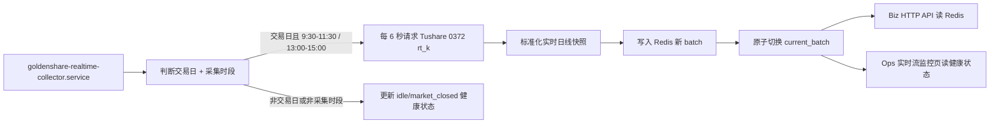
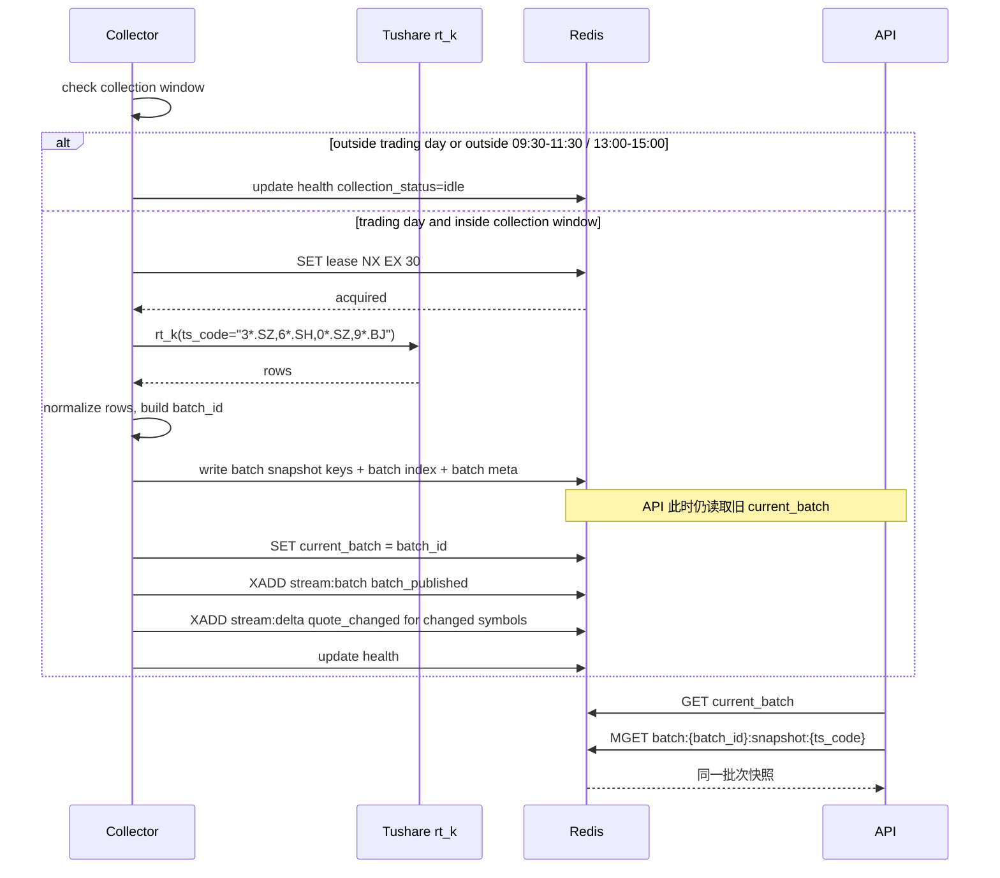

# 股票实时日线流技术落地方案 v1

状态：日线已上线 / 分钟 M7 页面已落地 / 生产配置已切到配置中心 / 收市 idle 验收通过 / 下一交易时段端到端验收已完成
上位方案：[实时行情流架构方案 v1（HTML）](/Users/congming/github/goldenshare/docs/architecture/realtime-market-data-stream-architecture-v1.html)  
源接口事实：[Tushare 0372 A股实时日线](/Users/congming/github/goldenshare/docs/sources/tushare/股票数据/行情数据/0372_A股实时日线.md)  
适用范围：Tushare 0372 `rt_k` 股票实时日线 V1

---

## 0. 全链路审计结论

审计时间：2026-05-14，开市验证时间：2026-05-15
审计范围：源接口、collector、Redis、业务 API、Ops API、前端页面、部署配置、测试验收。

### 0.0 2026-06-03 配置中心收口修订

实时日线 V1 已经上线。配置中心 M2-M8 已把实时流运行配置从旧 `Settings/env -> feed_config.py` 迁出，当前事实为：

修订口径：

1. 可编辑运行配置事实源为 `foundation.realtime_runtime_config`，由实时流配置中心查看、校验和发布。
2. `src/foundation/realtime/runtime_config.py` 读取配置表，结合 `src/foundation/realtime/config_catalog.py` 的锁定事实生成 `RealtimeRuntimeConfig`。
3. `config_catalog.py` 锁定 source api、feed key、通配符、交易时段、exchange 等高风险事实，不允许运营页面编辑。
4. `REDIS_URL` 仍是部署级 env；旧 `REALTIME_STOCK_RT_*` env 已从代码主链、seed 和测试入口退场。
5. Biz realtime API 通过 foundation `RealtimeSnapshotReader` 读取快照事实，不再拼 feed key、stale 或交易时段。
6. `requires_collector_restart` 只是发布影响策略；页面当前是否待重启由 DB 已发布版本和 collector 上报的已应用版本推导。

### 0.0.1 2026-06-01 统一 collector 调度修订

M5 已完成统一 collector 调度收口：`goldenshare realtime-collector-serve` 由 `RealtimeCollectorService` 统一调度实时日线与股票实时分钟 feed。分钟是否启用由 `foundation.realtime_runtime_config` 中 `stock_rt_min.runtime_config_json.enabled` 决定，不再由 `/etc/goldenshare/web.env` 的旧 env 决定；启用分钟后，同一个 systemd 服务内按 feed 独立 due time 调度，日线 6 秒循环不会触发分钟每 6 秒请求。

M6/M7 已完成股票实时分钟业务 API、Ops health API 与“实时流监控”分钟分组展示。WebSocket 仍为后续独立事项，不进入当前 V1 主闭环。

### 0.1 已经收敛的日线主线

| 链路 | 当前结论 |
| --- | --- |
| 上游 | 日线 feed 接 Tushare 0372 `rt_k`，使用 `ts_code=3*.SZ,6*.SH,0*.SZ,9*.BJ` 一次请求全市场；分钟 feed 见实时分钟方案。 |
| 采集 | collector 常驻，但只在交易日的 9:30-11:30、13:00-15:00 请求源站。日线 6 秒，分钟 60 秒。 |
| 限速 | 日线 feed 控制 10 次/分钟；分钟 feed 使用独立配置，五频率全开时约 5 次/分钟。 |
| Redis 一致性 | 使用 `batch_id + current pointer`，先写完整批次，再切换当前批次。 |
| 历史沉淀 | V1 不写业务历史库，不建 DatasetDefinition，不进 TaskRun，不进 freshness/date audit。 |
| 业务 API | `GET /api/v1/realtime/stock-rt-daily` 只读 Redis current batch，不请求 Tushare。 |
| Ops 页面 API | 实时流监控页面只读 Ops health API：日线读 `GET /api/v1/ops/realtime/stock-rt-daily/health`，分钟读 `GET /api/v1/ops/realtime/stock-rt-min/health`。 |
| 前端页面 | 展示“股票实时日线”和“股票实时分钟”分组的实时 feed 健康，不展示任务中心、不展示离线 freshness、不提供手动同步。 |
| 非采集时段 | 显示空闲/非采集时段，不按 20 秒 stale 阈值误报失败。 |
| 配置读取 | 已收口为 `foundation.realtime_runtime_config + runtime_config.py + config_catalog.py`；旧 `REALTIME_STOCK_RT_*` env 和 `feed_config.py` 不作为当前开发基线。 |

### 0.2 本轮发现并已补齐的设计点

1. 前端页面 API 原先只有字段映射，现在补成完整页面契约：接口、鉴权、轮询、状态枚举、字段映射和禁用行为。
2. Redis TTL 原先沿用短实时缓存思路；在“不采集午休/收盘后”的口径下，已改为建议 72 小时 TTL + 只保留最近 3 批，避免非采集时段页面无当前批次。
3. `stale_after_seconds=20` 已明确只适用于采集时段内。
4. 收盘后与开市时段源接口真实探测已落档；远程 collector 已完成收市 idle 验收与交易时段端到端验收。

### 0.3 已确认口径

| 编号 | 事项 | 口径 |
| --- | --- | --- |
| D2 | 业务快照 API 单次 `ts_codes` 上限 | 暂定 200 个。这里指下游调用我们自己的 API，不是 Tushare。 |
| D3 | Redis stream V1 事件粒度 | 已确认同时支持批次事件和逐股票变化事件。 |
| D4 | Ops 菜单名称与挂载 | 已确认一级菜单，名称为“实时流监控”。 |
| D6 | Redis 快照 TTL | 已确认 259200 秒（72 小时）+ 最近 3 批。 |
| D7 | 非交易日是否请求源站 | 已确认必须叠加交易日 + 交易时段，其它时段不请求源站。 |
| D8 | Ops 页面轮询频率 | 已确认只在交易日交易时段内每 1 分钟请求 health API；非交易时段不持续轮询。 |
| M1 | 开市时段真实源接口验证 | 已完成，结论支持全市场通配符请求方案。 |

### 0.4 全链路一致性复核

复核结论：当前文档主链已经收敛为“collector 负责请求源站和刷新 Redis；API 和页面只读 Redis；实时链路不进入离线数据集和 TaskRun”。当前实现按下表保持一致。

| 链路环节 | 当前一致性结论 | 实现约束 |
| --- | --- | --- |
| 源接口 | 日线 feed 接 Tushare 0372 `rt_k`，`ts_code` 必填，使用源文档示例通配符一次拉全市场；分钟 feed 接 Tushare 0374 `rt_min`，按频率独立 feed。 | 请求参数只能由 realtime provider 生成，业务 API 和页面不得透出 Tushare 通配符。 |
| 采集窗口 | 必须同时满足交易日和交易时段；交易时段为 9:30-11:30、13:00-15:00，Asia/Shanghai。 | 非交易日、午休、收盘后、夜间、feed disabled 时不请求源站。 |
| 限速 | collector feed 级限速 10 次/分钟，即 6 秒最多一次。 | 不能依赖全局 Tushare 限速作为唯一保护。 |
| Redis 一致性 | 使用 `batch_id + current pointer`；先写完整新批次，再切换 `current_batch`。 | API 不加读锁，不扫描散 key，不读半新半旧批次。 |
| Redis 保留 | batch snapshot/index/meta TTL 为 259200 秒；只保留最近 3 批。 | 超过 TTL 或 Redis 重启后没有 current batch 时，API 返回明确 unavailable，不伪造快照。 |
| Redis stream | 同时写 `stream:batch` 的 `batch_published` 和 `stream:delta` 的 `quote_changed`。 | delta 只写变化股票；首批不灌全市场；必须按 maxlen 裁剪。 |
| 业务 API | `GET /api/v1/realtime/stock-rt-daily` 只读 Redis current batch，单次 `ts_codes` 暂定 200。 | 不请求 Tushare，不接受通配符，不做全市场导出。 |
| Ops 页面 API | 实时流监控页面只读 `stock-rt-daily/health` 与 `stock-rt-min/health`。 | 页面不得自行拼 Redis key，不调用业务快照 API，不自行推导交易日/交易时段；分钟分组不带 `freq`，由后端返回五频率全量。 |
| 前端轮询 | 页面进入先读一次；仅当 health API 返回 `page_polling_enabled=true` 时，每 1 分钟局部刷新状态。 | 禁止整页刷新；非交易时段停止定时轮询。 |
| 部署 | 生产必须有 Redis 和独立 collector systemd service。 | Redis 只监听本机；部署验收必须覆盖 Redis、collector、业务 API、Ops health API。 |
| 配置收口 | 所有 realtime feed 运行配置必须由统一配置对象输出。 | 不允许 collector、CLI、Biz API、Ops API、前端页面各自读取或硬编码同一类运行事实。 |

### 0.5 当前完成状态与剩余事项

| 优先级 | 事项 | 完成条件 |
| --- | --- | --- |
| P0 | 开市时段真实源接口验证。 | 已完成，结论支持全市场通配符请求方案。 |
| P0 | 生产 Redis 基础设施。 | 已完成：远程服务器 Redis、`REDIS_URL`、collector service 已纳入部署链路。 |
| P0 | Collector + Redis batch pointer 最小闭环。 | 已完成：collector、batch writer、current pointer、stream 与 smoke 命令已落地。 |
| P0 | 业务 API 与 Ops health API。 | 已完成：两个 API 都只读 Redis，错误态、空闲态、stale 态测试覆盖。 |
| P0 | 实时流监控页面。 | 已完成：页面只消费 health API，状态局部刷新，不展示 TaskRun/freshness。 |
| P0 | realtime feed config 单一读取层。 | 已完成：日线与分钟统一从配置对象读取；日线 lease TTL 硬编码退场；配置关系测试通过。 |
| P0 | 股票实时分钟生产配置切换。 | 已完成：生产启停事实已切到 `foundation.realtime_runtime_config`，统一 collector 与 Web 可在无旧 env 情况下启动；当前启停值以配置中心/DB 为准。 |
| P0 | 下一交易时段端到端验收。 | 已完成：已验证日线 6 秒采集、分钟 60 秒五频率采集、Redis current batch、业务 snapshot API、Ops 页面局部刷新。 |
| P1 | WebSocket 推送。 | 基于 V1 Redis current batch 和 delta stream 单独设计，不进入 V1。 |

### 0.6 前端页面 API 设计结论

前端页面 API 已设计，V1 页面只允许调用 Ops health API：

```http
GET /api/v1/ops/realtime/stock-rt-daily/health
GET /api/v1/ops/realtime/stock-rt-min/health
```

页面调用规则：

1. 页面进入时分别读取日线 health 与分钟 health；两个区块独立失败、独立展示。
2. 只有对应响应中的 `page_polling_enabled=true` 时，才按 `recommended_poll_interval_seconds=60` 继续局部刷新该区块。
3. 页面只更新状态卡片、当前批次、错误信息、Redis 保留策略和 stream 指标，不整页刷新。
4. 页面不得调用 `GET /api/v1/realtime/stock-rt-daily` 或 `GET /api/v1/realtime/stock-rt-min`；业务快照 API 是行情业务页面读取快照用的。
5. 页面不得自行计算交易日、交易时段、stale、current batch 或分钟频率列表；这些事实都由 health API 返回。

---

## 1. 目标

本方案最初把股票实时日线 V1 从架构图落成可执行技术计划。当前实时子系统已扩展股票实时分钟和 ETF 实时日线；分钟实现口径见 [A股实时分钟流架构方案 v1](/Users/congming/github/goldenshare/docs/architecture/realtime-stock-minute-stream-architecture-v1.html)，ETF 实时日线口径见 [ETF 实时日线流接入方案 v1](/Users/congming/github/goldenshare/docs/architecture/realtime-etf-daily-stream-plan-v1.md)。本文件保留为股票实时日线 feed 的主技术记录：

> 服务端在交易日的 A 股连续竞价时段内每 6 秒请求一次 Tushare 0372 `rt_k` 全市场股票实时日线，把最新快照写入 Redis；业务 API 和 Ops 页面只读取 Redis 当前批次。

V1 不进入离线数据集主链，不创建 `DatasetDefinition`，不写 raw/core/serving 历史表，不进入 TaskRun，不参与 freshness/date audit。

---

## 2. 非目标

1. 不落库历史实时行情。
2. 本文件不定义股票实时分钟、tick、盘口、指数实时、ETF 实时；股票实时分钟与 ETF 实时日线已由独立方案承接。
3. 不做用户自定义订阅、复杂权限、复杂行情聚合。
4. 不把实时轮询伪装成 TaskRun 任务。
5. 不把 Redis 健康状态写入离线 freshness 或数据集卡片。
6. 不在当前 V1 主闭环实现 WebSocket，但保留 Redis stream 和协议位置，后续单独立项。

---

## 3. 当前代码挂载点

### 3.1 目标目录

```text
src/
  foundation/
    realtime/             # 当前：实时源、collector、Redis 状态层、运行时配置读取层
      runtime_config.py   # 当前：读取 foundation.realtime_runtime_config + REDIS_URL
      config_catalog.py   # 当前：锁定 source api、feed key、交易时段、通配符等事实
  biz/
    api/
      realtime.py         # 当前：业务实时快照 API
    queries/
      realtime_stock_rt_daily_query_service.py
    schemas/
      realtime.py
  ops/
    api/
      realtime.py         # 当前：Ops 实时流健康 API
    queries/
      realtime_feed_health_query_service.py
    schemas/
      realtime.py
  app/
    api/v1/router.py      # 只做路由挂载
  cli_parts/
    realtime_handlers.py  # 当前：collector CLI handler
  cli.py                  # 只注册命令
```

### 3.2 依赖边界

```text
foundation/realtime
  不依赖 ops / biz / app

biz/api + biz/queries
  只读取 foundation/realtime 的只读接口
  不知道 Tushare 请求细节

ops/api + ops/queries
  只读取 foundation/realtime 的健康状态
  不写 TaskRun

app/api/v1/router.py
  只 include router
  不写实时业务逻辑
```

边界要求：实时状态写入 Redis 失败，只影响实时服务可用性和 Ops 观测，不影响任何离线业务数据表事务。

---

## 4. V1 数据流



关键点：

1. Redis 不会自己刷新，刷新动作来自服务端 collector。
2. 前端请求不会直接打 Tushare。
3. API 不扫描“最新散 key”，只读 `current_batch` 指向的批次。
4. collector 写完整批次后才切换指针，避免读到半新半旧的数据。
5. collector 只在交易日的 9:30-11:30、13:00-15:00 请求 Tushare；非交易日和非采集时段是正常空闲/休市，不应误报为采集失败。

---

## 5. Tushare 0372 请求设计

### 5.1 请求参数

V1 固定一次拉全市场：

```json
{
  "api_name": "rt_k",
  "params": {
    "ts_code": "3*.SZ,6*.SH,0*.SZ,9*.BJ"
  },
  "fields": "ts_code,name,pre_close,high,open,low,close,vol,amount,num,ask_price1,ask_volume1,bid_price1,bid_volume1,trade_time"
}
```

依据：

1. 源文档明确 `ts_code` 必填。
2. 源文档明确支持股票代码通配符。
3. 源文档示例给出全市场通配符：`3*.SZ,6*.SH,0*.SZ,9*.BJ`。
4. 源文档写明单次最大 6000 条，等同一次提取全市场。
5. V1 目标是全市场最新状态，不按单股票请求，避免 500 次/分钟额度被无意义消耗。

### 5.2 字段要求

所有源文档输出字段都进入 Redis 快照：

| 字段 | 说明 | V1 处理 |
| --- | --- | --- |
| `ts_code` | 股票代码 | 必填，作为快照主键 |
| `name` | 股票名称 | 可空，原样保存 |
| `pre_close` | 昨收价 | 可空，保存为 JSON number 或字符串化 decimal |
| `high` | 最高价 | 可空 |
| `open` | 开盘价 | 可空 |
| `low` | 最低价 | 可空 |
| `close` | 收盘价/最新价 | 可空 |
| `vol` | 成交量 | 可空 |
| `amount` | 成交金额 | 可空 |
| `num` | 成交笔数 | 可空 |
| `ask_price1` | 卖一价 | 可空 |
| `ask_volume1` | 卖一量 | 可空 |
| `bid_price1` | 买一价 | 可空 |
| `bid_volume1` | 买一量 | 可空 |
| `trade_time` | 源端交易时间 | 可空，作为源端时间，不作为唯一新鲜度判断 |

### 5.3 限速

V1 通过 realtime feed config 同时控制 collector 节奏和 Tushare client 限速，日线默认 10 次/分钟：

```text
poll_interval_seconds = 6
max_calls_per_minute = 10
```

说明：

1. 不依赖全局 `TUSHARE_MAX_CALLS_PER_MINUTE` 作为唯一保护。
2. collector 根据 `poll_interval_seconds` 控制采集节奏。
3. `TushareHttpClient` 对 `api_name=rt_k` 读取 realtime feed config 的 `max_calls_per_minute`，不能回落到通用 Tushare 默认限速。

### 5.4 采集时间窗口

已确认：V1 只在 A 股连续竞价时段请求 Tushare 源接口。

```text
上午：09:30-11:30
下午：13:00-15:00
时区：Asia/Shanghai
```

说明：

1. 午休、收盘后、夜间不主动请求 Tushare。
2. 非采集时段不等于异常，Ops 页面应显示“非采集时段/空闲”，而不是红色失败。
3. `stale_after_seconds=20` 只用于采集时段内判断 collector 是否滞后。
4. 如果业务 API 在非采集时段读取实时快照，应明确返回当前 Redis 可读批次及其时间，不能伪装成刚刚刷新。
5. 时间边界按包含起点和终点处理：`09:30 <= now <= 11:30`、`13:00 <= now <= 15:00`。
6. 已确认必须叠加交易日历判断：只有“交易日 + 采集时段”才请求源站；非交易日显示 `market_closed`。

---

## 6. Redis 状态模型

### 6.1 Feed Key

V1 固定：

```text
feed_key = tushare_stock_rt_k
```

### 6.2 Key 设计

| Key | 类型 | 内容 | TTL/保留 |
| --- | --- | --- | --- |
| `rt:feed:{feed_key}:current_batch` | String | 当前可读批次号 | 不短期过期 |
| `rt:feed:{feed_key}:batch:{batch_id}:snapshot:{ts_code}` | String JSON | 某批次内单只股票快照 | 建议 259200 秒 |
| `rt:feed:{feed_key}:batch:{batch_id}:index` | Set | 某批次内有快照的股票代码集合 | 建议 259200 秒 |
| `rt:feed:{feed_key}:batch:{batch_id}:meta` | String JSON | 批次元信息 | 建议 259200 秒 |
| `rt:feed:{feed_key}:batches` | ZSet | 最近批次索引，score 为发布时间戳 | 保留最近 3 个批次 |
| `rt:feed:{feed_key}:stream:batch` | Redis Stream | 短期批次发布事件 | 裁剪最近 5000 条 |
| `rt:feed:{feed_key}:stream:delta` | Redis Stream | 逐股票变化事件 | 默认裁剪最近 200000 条 |
| `rt:feed:{feed_key}:health` | String JSON 或 Hash | feed 健康状态 | 不短期过期 |
| `rt:feed:{feed_key}:lease` | String + TTL | collector 采集租约 | 30 秒 |

说明：

1. `index` 必须放在 batch 下面，不能用全局 `rt:index:{feed_key}` 表达当前事实，否则容易在切批时混入旧批次。
2. stream V1 同时支持批次事件和逐股票变化事件：批次事件用于观测和批次追踪，逐股票变化事件用于后续 WebSocket 和变化订阅。
3. 逐股票变化事件只写“与上一可读批次相比发生变化的股票”。首个批次只写 `batch_published`，不把全市场股票一次性灌入 delta stream。
4. 因为 collector 不在午休和收盘后请求源站，批次 TTL 不能沿用 180 秒这种短 TTL；V1 已确认设为 259200 秒（72 小时），同时只保留最近 3 个批次，避免把 Redis 变成历史库。

### 6.2.1 Stream 事件设计

V1 使用两个 stream，而不是把所有事件塞到同一个 stream 里：

| Stream | 事件类型 | 用途 | 裁剪策略 |
| --- | --- | --- | --- |
| `rt:feed:{feed_key}:stream:batch` | `batch_published` | 记录每次批次发布，用于 Ops 健康、批次追踪、发布节奏检查。 | `MAXLEN ~ 5000` |
| `rt:feed:{feed_key}:stream:delta` | `quote_changed` | 记录逐股票变化，用于后续 WebSocket 推送和订阅消费。 | `MAXLEN ~ 200000` |

`batch_published` 示例：

```json
{
  "event_type": "batch_published",
  "feed_key": "tushare_stock_rt_k",
  "batch_id": "20260514T145804.120000Z",
  "published_at": "2026-05-14T14:58:04.300000+08:00",
  "snapshot_count": 5300,
  "source_row_count": 5300,
  "delta_count": 1288,
  "source_elapsed_ms": 420,
  "write_elapsed_ms": 38
}
```

`quote_changed` 示例：

```json
{
  "event_type": "quote_changed",
  "feed_key": "tushare_stock_rt_k",
  "batch_id": "20260514T145804.120000Z",
  "ts_code": "600000.SH",
  "trade_time": "2026-05-14 14:58:03",
  "payload_hash": "sha256...",
  "changed_fields": ["close", "vol", "amount", "bid_price1", "ask_price1"],
  "close": "10.23",
  "vol": "12345600",
  "amount": "125000000"
}
```

逐股票变化判定：

1. 对比当前批次与上一可读批次同一 `ts_code` 的 `raw_payload_hash`。
2. hash 只包含源字段，不包含 `batch_id`、`received_at`、`published_at` 这类采集元数据。
3. hash 不变则不写 `quote_changed`。
4. 上一批次不存在时，只发布当前 batch，不写全市场 delta。
5. 如果真实开市验证发现每轮几乎全市场都变化，仍按裁剪上限控制 Redis 体积；WebSocket 阶段再评估是否需要按订阅池过滤 delta。

### 6.3 快照 JSON

```json
{
  "feed_key": "tushare_stock_rt_k",
  "batch_id": "20260514T145804.120000Z",
  "source": "tushare",
  "source_api_name": "rt_k",
  "ts_code": "600000.SH",
  "name": "浦发银行",
  "trade_time": "2026-05-14 14:58:03",
  "received_at": "2026-05-14T14:58:04.120000+08:00",
  "pre_close": "10.01",
  "high": "10.30",
  "open": "10.10",
  "low": "10.02",
  "close": "10.23",
  "vol": "12345600",
  "amount": "125000000",
  "num": "23001",
  "ask_price1": "10.23",
  "ask_volume1": "12000",
  "bid_price1": "10.22",
  "bid_volume1": "10000",
  "raw_payload_hash": "sha256..."
}
```

建议数字字段在 Redis 内保存为字符串，避免 JSON float 精度和前端展示格式出现不一致。API 层可以按前端需要再转换为展示文本或 number。

### 6.4 批次 Meta

```json
{
  "feed_key": "tushare_stock_rt_k",
  "batch_id": "20260514T145804.120000Z",
  "published_at": "2026-05-14T14:58:04.300000+08:00",
  "received_at": "2026-05-14T14:58:04.120000+08:00",
  "source_elapsed_ms": 420,
  "write_elapsed_ms": 38,
  "source_row_count": 5300,
  "snapshot_count": 5300,
  "request_params": {
    "ts_code": "3*.SZ,6*.SH,0*.SZ,9*.BJ"
  }
}
```

### 6.5 Health

```json
{
  "feed_key": "tushare_stock_rt_k",
  "display_name": "股票实时日线",
  "status": "ok",
  "enabled": true,
  "last_request_at": "2026-05-14T14:58:03.700000+08:00",
  "last_success_at": "2026-05-14T14:58:04.300000+08:00",
  "last_error_at": null,
  "last_error_message": null,
  "current_batch_id": "20260514T145804.120000Z",
  "current_batch_age_seconds": 2.1,
  "snapshot_count": 5300,
  "source_row_count": 5300,
  "request_count_last_minute": 10,
  "poll_interval_seconds": 6,
  "is_trading_day": true,
  "collection_sessions": ["09:30-11:30", "13:00-15:00"],
  "collection_status": "open",
  "stale_after_seconds": 20,
  "snapshot_ttl_seconds": 259200,
  "keep_recent_batches": 3,
  "batch_stream_maxlen": 5000,
  "delta_stream_maxlen": 200000,
  "last_batch_event_id": "1715670004300-0",
  "last_delta_event_id": "1715670004300-1288",
  "delta_count_last_batch": 1288,
  "page_polling_enabled": true,
  "recommended_poll_interval_seconds": 60,
  "redis_connected": true,
  "collector_id": "hostname:pid"
}
```

健康状态只表达实时 feed 自己的状态，不表达数据集新鲜度，也不影响离线任务。

### 6.6 Redis 配置检查

| 项目 | 口径 |
| --- | --- |
| 连接 | 通过 `REDIS_URL` 连接，生产建议 `redis://127.0.0.1:6379/0`。 |
| 网络 | Redis 只监听本机，禁止公网访问。 |
| 持久化 | V1 不把 Redis 持久化作为正确性依赖；Redis 重启后由下一个采集窗口重新发布 batch。 |
| TTL | batch snapshot/index/meta 建议 259200 秒，覆盖午休、隔夜和周末展示。 |
| 批次保留 | 只保留最近 3 个 batch，避免 Redis 变成历史行情库。 |
| stream 裁剪 | V1 同时写 `stream:batch` 与 `stream:delta`；批次事件裁剪最近 5000 条，逐股票变化事件默认裁剪最近 200000 条。 |
| 写入失败 | Redis 写入失败只影响实时服务状态，不影响任何业务数据表事务。 |

---

## 7. 批次发布时序

### 7.1 写入流程



### 7.2 失败处理

| 失败点 | 处理方式 | API 可见结果 |
| --- | --- | --- |
| 非采集时段 | 不请求 Tushare，只更新 health 为 idle/market_closed | API 继续读当前可用批次；页面显示非采集时段 |
| 获取 lease 失败 | 本轮跳过，说明已有 collector 在跑 | API 继续读当前批次 |
| Tushare 请求失败 | 写 health `status=degraded`，不切 current pointer | API 继续读旧批次，超过阈值后返回 stale |
| 标准化失败 | 记录 bad row 样本到 health，整批不发布或剔除坏行需评审 | API 继续读旧批次 |
| Redis 批次写入失败 | 不切 current pointer，写 health 尽力而为 | API 继续读旧批次 |
| current pointer 切换失败 | 新批次不可见，下轮重试 | API 继续读旧批次 |

严禁在 Redis 状态失败时影响任何业务数据表。

---

## 8. Collector 技术设计

### 8.1 CLI

当前命令：

```bash
goldenshare realtime-collector-serve
```

已支持调试参数：

```bash
goldenshare realtime-collector-serve --max-cycles 1
```

`--max-cycles 1` 用于本地和远程 smoke，不作为业务功能暴露。

### 8.2 配置项

当前配置事实源分两层：

| 层级 | 存放位置 | 说明 |
| --- | --- | --- |
| 部署级连接配置 | `REDIS_URL` env | Redis 连接串，继续放在本地 `.env.web.local` 和远程 `/etc/goldenshare/web.env`。 |
| 实时流可编辑运行配置 | `foundation.realtime_runtime_config.runtime_config_json` | `stock_rt_daily`、`stock_rt_min`、`etf_rt_daily` 等已注册对象的启停、间隔、限速、TTL、保留批次、stream 裁剪、stale、lease 等配置。 |
| 实时流锁定事实 | `src/foundation/realtime/config_catalog.py` | source api、feed key/pattern、通配符、交易时段、exchange 等高风险事实，不进配置表，不开放编辑。 |

旧 `REALTIME_STOCK_RT_DAILY_*` 与 `REALTIME_STOCK_RT_MIN_*` env 已退场，不再作为运行时、seed 或测试输入。生产启停和参数调整必须通过实时流配置中心发布到 `foundation.realtime_runtime_config`，发布后按页面提示重启统一 collector 生效。

### 8.2.1 实时流配置中心交互口径

实时流配置中心是配置治理页面，不是实时流监控页面。

当前 showcase 口径见 [Ops 实时流配置中心 Showcase v1](/Users/congming/github/goldenshare/docs/ops/ops-realtime-config-center-showcase-v1.html)。

页面层级：

1. 页面级：实时流配置中心。
2. 对象级：股票实时日线、股票实时分钟、单股当日分时序列等“实时流对象”。
3. 配置级：当前对象的采集策略、频率范围、采集窗口、限速保护、Redis 策略、状态判断和配置项明细。

交互模式：

1. 默认进入查看态：左侧对象列表，右侧展示当前对象配置详情。
2. 点击左侧实时流对象，只切换右侧对象配置，不进入编辑。
3. 点击“进入编辑模式”后，同一页面切到编辑态，只编辑当前对象。
4. 编辑态才展示可编辑字段、草稿差异、校验结果、发布影响和发布确认。
5. 查看态不得混入发布校验、草稿差异或提交发布按钮，避免只读信息和编辑流程混排。

控件规则：

1. 集合型值在查看态用标签展示，例如分钟频率 `1MIN/5MIN/15MIN/30MIN/60MIN`。
2. `enabled_freqs` 在编辑态必须用多选控件，不允许让运营手填逗号字符串。
3. 高风险配置如源站通配符、Token、Redis key 默认锁定，不在页面上开放普通编辑。
4. 页面只消费服务端配置读取层输出的事实，不自行拼装配置来源或运行事实。

### 8.3 Collector 循环

```text
while running:
  if disabled:
    sleep(interval)
    continue

  if not trading day or outside collection sessions:
    update health as idle/market_closed
    sleep until next check
    continue

  acquire lease(config.lease_ttl_seconds)
  if not acquired:
    sleep(interval)
    continue

  started_at = now
  rows = fetch rt_k
  snapshots = normalize rows
  batch = build batch
  write batch keys
  switch current pointer
  write stream batch_published event
  write stream quote_changed events for changed symbols
  write health ok
  cleanup old batches
  sleep until next config.poll_interval_seconds slot
```

### 8.4 非采集时段与交易时段外语义

`trade_time` 是 Tushare 源端行情时间，不等同于采集服务是否健康。

V1 判断建议：

1. 采集时段内：看 `last_success_at` 距离当前时间是否超过 `stale_after_seconds=20`。
2. 源端行情时间：原样展示 `trade_time`，不拿它直接判定 collector 死活。
3. 非采集时段：collector 不请求 Tushare，健康状态应表达“非采集时段/空闲”，不能误报为失败。
4. 收盘后源接口行为要记录为 M1 探测事实；但正式 collector 是否请求源站，以本方案的采集窗口为准。

---

## 9. 业务 API 设计

### 9.1 股票实时日线快照

```http
GET /api/v1/realtime/stock-rt-daily?ts_codes=600000.SH,000001.SZ
```

调用方：

1. 行情页。
2. 股票列表或卡片。
3. 后续需要当前价、开高低收、成交量等实时快照的业务页面。

请求约束：

1. `ts_codes` 必填。
2. 逗号分隔，统一转大写和去空格。
3. 单次请求上限 V1 暂定为 200 个代码，防止页面一次拉全市场。
4. API 不接受 Tushare 通配符，不透出 `rt_k` 参数。

响应示例：

```json
{
  "feed_key": "tushare_stock_rt_k",
  "batch_id": "20260514T145804.120000Z",
  "received_at": "2026-05-14T14:58:04.120000+08:00",
  "published_at": "2026-05-14T14:58:04.300000+08:00",
  "stale": false,
  "stale_after_seconds": 20,
  "collection_status": "open",
  "items": [
    {
      "ts_code": "600000.SH",
      "name": "浦发银行",
      "trade_time": "2026-05-14 14:58:03",
      "close": "10.23",
      "open": "10.10",
      "high": "10.30",
      "low": "10.02",
      "pre_close": "10.01",
      "vol": "12345600",
      "amount": "125000000",
      "num": "23001",
      "bid_price1": "10.22",
      "bid_volume1": "10000",
      "ask_price1": "10.23",
      "ask_volume1": "12000",
      "received_at": "2026-05-14T14:58:04.120000+08:00"
    }
  ],
  "missing_ts_codes": []
}
```

错误语义：

| 场景 | HTTP | code | 说明 |
| --- | --- | --- | --- |
| 未传 `ts_codes` | 400 | `MISSING_TS_CODES` | 调用方必须明确要哪些股票 |
| 单次请求超过上限 | 400 | `TOO_MANY_TS_CODES` | 防止业务 API 被当全市场导出 |
| Redis 无 current batch | 503 | `REALTIME_FEED_UNAVAILABLE` | collector 尚未发布过可读批次 |
| Redis 连接失败 | 503 | `REALTIME_STATE_UNAVAILABLE` | 状态层不可用 |
| 采集时段内快照已滞后 | 200 | `stale=true` | 有旧快照就返回旧快照并标记滞后 |
| 非采集时段 | 200 | `collection_status=idle` | 返回当前可读批次及其时间；不把空闲误报为失败 |

### 9.2 后续 WebSocket 预留

M5 预留路径：

```text
WS /api/v1/realtime/stock-rt-daily/ws
```

M5 不在 V1 实现。后续协议建议：

```json
{"type": "subscribe", "ts_codes": ["600000.SH", "000001.SZ"]}
```

服务端先推当前快照，再推后续更新。更新来源优先基于 Redis stream 的 batch 事件和当前 batch 快照，不直接请求 Tushare。

---

## 10. Ops API 与页面

### 10.1 健康 API

```http
GET /api/v1/ops/realtime/stock-rt-daily/health
```

调用方：数据运营后台“实时流监控”菜单。

响应示例：

```json
{
  "feed_key": "tushare_stock_rt_k",
  "display_name": "股票实时日线",
  "status": "ok",
  "enabled": true,
  "redis_connected": true,
  "collector_running": true,
  "last_request_at": "2026-05-14T14:58:03.700000+08:00",
  "last_success_at": "2026-05-14T14:58:04.300000+08:00",
  "last_error_at": null,
  "last_error_message": null,
  "current_batch_id": "20260514T145804.120000Z",
  "current_batch_age_seconds": 2.1,
  "current_batch_received_at": "2026-05-14T14:58:04.120000+08:00",
  "current_batch_published_at": "2026-05-14T14:58:04.300000+08:00",
  "snapshot_count": 5300,
  "source_row_count": 5300,
  "source_elapsed_ms": 420,
  "write_elapsed_ms": 38,
  "request_count_last_minute": 10,
  "max_calls_per_minute": 10,
  "poll_interval_seconds": 6,
  "is_trading_day": true,
  "collection_sessions": ["09:30-11:30", "13:00-15:00"],
  "collection_status": "open",
  "stale_after_seconds": 20,
  "snapshot_ttl_seconds": 259200,
  "keep_recent_batches": 3,
  "batch_stream_maxlen": 5000,
  "delta_stream_maxlen": 200000,
  "last_batch_event_id": "1715670004300-0",
  "last_delta_event_id": "1715670004300-1288",
  "delta_count_last_batch": 1288,
  "page_polling_enabled": true,
  "recommended_poll_interval_seconds": 60
}
```

状态枚举：

| 字段 | 可选值 | 含义 |
| --- | --- | --- |
| `status` | `ok` | 采集时段内最近 20 秒发布过新 batch。 |
| `status` | `idle` | 非采集时段，当前不应请求源站。 |
| `status` | `stale` | 采集时段内超过 20 秒未发布新 batch，但仍有旧 batch 可读。 |
| `status` | `degraded` | 上游或写入发生错误，但旧 batch 仍可读。 |
| `status` | `unavailable` | Redis 不可连接或没有 current batch。 |
| `collection_status` | `open` | 当前在交易日采集窗口内，应请求源站。 |
| `collection_status` | `idle` | 午休、收盘后或夜间，不请求源站。 |
| `collection_status` | `market_closed` | 非交易日，不请求源站。 |
| `collection_status` | `disabled` | feed 被配置关闭。 |

### 10.2 前端页面 API 契约

Ops“实时流监控”页面 V1 只调用页面健康 API：

```http
GET /api/v1/ops/realtime/stock-rt-daily/health
GET /api/v1/ops/realtime/stock-rt-min/health
```

前端规则：

1. 需要管理员/运行管理权限。
2. 页面进入时分别请求日线 health API 与分钟 health API。
3. 页面不得直接读取 Redis。
4. 页面不得调用 Tushare。
5. 页面不得自行计算 stale、current batch、collector 是否应该请求源站、分钟频率列表；这些事实由 health API 返回。
6. 页面不调用 `GET /api/v1/realtime/stock-rt-daily` 或 `GET /api/v1/realtime/stock-rt-min`，二者是行情业务页面读取快照用的业务 API。
7. 页面状态色由 `status` 驱动：`ok=绿色`、`idle=蓝色`、`stale=黄色`、`degraded=黄色/红色按错误级别`、`unavailable=红色`。
8. 页面不得用浏览器整页刷新或重新挂载页面来更新状态，避免闪烁；只能局部更新健康状态、批次、错误和指标展示。
9. 只有对应 health API 返回 `page_polling_enabled=true` 时，该分组才按 `recommended_poll_interval_seconds=60` 继续轮询。
10. 如果对应 health API 返回 `collection_status=idle/market_closed/disabled` 或 `page_polling_enabled=false`，该分组停止定时轮询；用户重新进入页面时再读取一次即可。

这里的“页面轮询”只表示浏览器在交易日交易时段内每 1 分钟请求对应的 Ops health API，让页面上的状态卡片和指标局部刷新。它不触发 collector，不请求 Tushare，也不改变 Redis；Redis 刷新只来自服务端 collector。

字段映射：

| 页面区域 | health API 字段 | 说明 |
| --- | --- | --- |
| 当前总状态 | `status`、`collection_status` | 实时 feed 是否正常、空闲、滞后或不可用。 |
| Collector | `collector_running`、`collector_id`、`last_request_at` | collector 是否在运行。 |
| Redis Current Batch | `current_batch_id`、`current_batch_age_seconds`、`snapshot_count` | 当前可读批次。 |
| Tushare 限速 | `request_count_last_minute`、`max_calls_per_minute` | 最近一分钟请求数与上限。 |
| 采集窗口 | `is_trading_day`、`collection_sessions`、`collection_status` | 当前是否应该请求源站。 |
| 滞后判断 | `stale_after_seconds`、`current_batch_age_seconds` | 仅采集时段内使用。 |
| 上游请求 | `source_row_count`、`source_elapsed_ms`、`last_error_message` | Tushare 请求健康。 |
| Redis 写入 | `write_elapsed_ms`、`snapshot_ttl_seconds`、`keep_recent_batches`、`batch_stream_maxlen`、`delta_stream_maxlen` | Redis 写入与保留策略。 |
| Stream 事件 | `last_batch_event_id`、`last_delta_event_id`、`delta_count_last_batch` | 最近批次事件、最近逐股票变化事件和本批次变化数量。 |
| 页面轮询 | `page_polling_enabled`、`recommended_poll_interval_seconds` | 是否需要前端继续定时刷新；只在交易日交易时段内启用。 |

### 10.3 页面区域

```text
实时流监控
  ├─ 股票实时日线
  │   ├─ 总状态：正常 / 滞后 / 不可用
  │   ├─ 最近刷新：last_success_at、current_batch_age_seconds
  │   ├─ 上游请求：请求参数、返回行数、耗时、最近错误
  │   ├─ Redis 状态：current_batch、snapshot_count、batch stream、delta stream
  │   └─ 配置：poll_interval、collection_sessions、stale_after、max_calls_per_minute
```

页面禁止项：

1. 不展示 TaskRun 列表。
2. 不展示离线 freshness。
3. 不提供手动同步按钮。
4. 不允许运营在页面修改 Tushare 请求参数。

---

## 11. Redis 部署与发版

### 11.1 生产 Redis

生产服务器需要先安装 Redis：

```bash
sudo apt-get update
sudo apt-get install -y redis-server
sudo systemctl enable --now redis-server
redis-cli ping
```

安全口径：

1. Redis 仅监听 `127.0.0.1`。
2. 不对公网开放。
3. V1 不上 Redis 集群。
4. V1 不把 Redis 当长期历史库。

### 11.2 Python 依赖

`pyproject.toml` 增加：

```toml
"redis>=5.2.0",
```

### 11.3 systemd unit

当前 unit 模板：

```text
scripts/goldenshare-realtime-collector.service
```

当前内容：

```ini
[Unit]
Description=Goldenshare Realtime Stock RT Daily Collector
After=network.target redis-server.service

[Service]
WorkingDirectory=/opt/goldenshare/goldenshare
Environment=GOLDENSHARE_ENV_FILE=/etc/goldenshare/web.env
ExecStart=/opt/goldenshare/goldenshare/.venv/bin/goldenshare realtime-collector-serve
Restart=always
RestartSec=3

[Install]
WantedBy=multi-user.target
```

### 11.4 部署脚本调整

`scripts/deploy-layered-systemd.sh` 需要增加：

1. `REALTIME_COLLECTOR_SERVICE=goldenshare-realtime-collector.service`
2. `REALTIME_COLLECTOR_UNIT_SRC=scripts/goldenshare-realtime-collector.service`
3. unit 同步逻辑。
4. `systemctl restart/status goldenshare-realtime-collector.service`
5. 发布后 smoke：健康 API 能读到 current batch 或明确 unavailable。

`scripts/goldenshare-deploy.sudoers` 需要增加 collector unit 的 install/restart/status 权限。

### 11.5 远程 env

通过 `scripts/remote-web-env.sh` 只维护部署级连接配置：

```text
REDIS_URL=redis://127.0.0.1:6379/0
```

`REALTIME_STOCK_RT_*` 已退场，不得继续写入远程 `/etc/goldenshare/web.env`。若远程仍有旧 key，M8 只能通过 `bash scripts/remote-web-env.sh unset KEY` 删除；不得把旧 env 作为配置中心的兼容输入。

---

## 12. 验证计划

### 12.1 M1 源接口真实探测

必须用真实 Tushare token 验证：

1. `rt_k(ts_code="3*.SZ,6*.SH,0*.SZ,9*.BJ")` 是否稳定返回全市场。
2. 返回行数是否小于 6000。
3. 所有声明字段是否可通过 `fields` 返回。
4. 交易时段中、午休、收盘后分别返回什么样的 `trade_time`。
5. 单次请求耗时是否适合 6 秒轮询。
6. 空值形态是否包含 `None`、空字符串、`nan` 等脏值。

如果全市场请求在真实测试中不稳定，必须停下来重新评审请求策略，不能直接改成分片请求。

收盘后初步探测记录：

| 项目 | 结果 |
| --- | --- |
| 探测时间 | 2026-05-14 收盘后 |
| 请求参数 | `rt_k(ts_code="3*.SZ,6*.SH,0*.SZ,9*.BJ")` |
| 返回行数 | 5521 |
| 耗时 | 约 503ms |
| 字段完整性 | 样本字段均返回；本次统计字段空值为 0 |
| `trade_time` 样本 | `2026-05-14 17:00:00` 到 `2026-05-14 17:00:xx` |

结论：Tushare 收盘后仍可返回实时日线快照，但 V1 collector 按已确认口径只在 9:30-11:30、13:00-15:00 请求源站。开市时段行为仍需次日验证。

开市时段验证记录：

| 项目 | 结果 |
| --- | --- |
| 探测时间 | 2026-05-15 09:32-09:35，A 股连续竞价时段 |
| 请求参数 | `rt_k(ts_code="3*.SZ,6*.SH,0*.SZ,9*.BJ")` |
| 单次返回行数 | 5523 |
| 连续 3 轮返回行数 | 5523 / 5523 / 5523 |
| 单次耗时 | 约 648ms - 1208ms |
| 字段完整性 | `ts_code/name/pre_close/high/open/low/close/vol/amount/num/ask_price1/ask_volume1/bid_price1/bid_volume1/trade_time` 均返回 |
| 空值统计 | 本次 15 个字段空值计数均为 0 |
| 交易所后缀分布 | `BJ=313`，`SH=2315`，`SZ=2895` |
| 今日 `trade_time` 行数 | 5517 |
| 非今日 `trade_time` 行数 | 6 |
| 观测到的旧 `trade_time` 样本 | 退市/特殊/停牌类股票，如 `立方退`、`东通退`、`长药退`、`*ST精伦`、`德邦股份` |

开市验证结论：

1. V1 可以继续使用全市场通配符一次请求方案，不需要为了 M1 改成分片请求。
2. `trade_time` 是源端行情时间，不是 collector 健康时间；同一批次内允许少数股票保留旧 `trade_time`。
3. collector 健康必须以 `last_success_at/current_batch_published_at/current_batch_age_seconds` 判断，不能用所有行 `trade_time` 是否等于今天判断。
4. 业务 API 应原样返回单只股票的 `trade_time`，让调用方知道该证券自身最新行情时间。

### 12.2 单元测试

| 测试 | 目标 |
| --- | --- |
| feed definition 测试 | `feed_key`、字段、请求参数与源文档一致 |
| normalizer 测试 | 数字、空值、`trade_time`、缺 `ts_code` 的处理明确 |
| Redis key builder 测试 | batch key、current pointer、health key 不混乱 |
| batch writer 测试 | 未切 current pointer 前读不到新批次 |
| query service 测试 | 只按 current batch 读取，missing code 正确返回 |
| health query 测试 | Redis 不可用时返回明确 unavailable |

### 12.3 API 测试

1. `GET /api/v1/realtime/stock-rt-daily` 未传 `ts_codes` 返回 400。
2. 传入两个存在代码返回两个快照。
3. 传入不存在代码进入 `missing_ts_codes`。
4. Redis 无 current batch 返回 503。
5. 采集时段内 current batch 超过 `stale_after_seconds` 时返回 200 + `stale=true`。
6. 非采集时段返回 200 + `collection_status=idle`，不误报失败。
7. 非交易日返回 200 + `collection_status=market_closed`，不请求源站。
8. Ops health API 能展示 `snapshot_count`、`last_success_at`、`request_count_last_minute`、`collection_status`。
9. 交易日交易时段内 health API 返回 `page_polling_enabled=true`、`recommended_poll_interval_seconds=60`。
10. 午休、收盘后、夜间、非交易日、feed disabled 时 health API 返回 `page_polling_enabled=false`。

### 12.4 远程 smoke

1. `redis-cli ping` 返回 `PONG`。
2. `systemctl status goldenshare-realtime-collector.service` 正常。
3. `goldenshare realtime-collector-serve --max-cycles 1` 能发布一个 batch。
4. Redis 存在 `rt:feed:tushare_stock_rt_k:current_batch`。
5. 业务 API 返回指定股票快照。
6. Ops health API 显示最近成功刷新。

---

## 13. 里程碑

### M1 源接口探测与字段确认

输出：

1. 真实请求验证结果。
2. 字段、空值、交易时段外行为记录。
3. 是否继续采用一次全市场请求的结论。

### M2 Redis 基础设施与状态模型

输出：

1. Redis 依赖和配置项。
2. `foundation/realtime` Redis store。
3. batch pointer 写读测试。

### M3 Collector

输出：

1. Tushare 0372 provider。
2. normalizer。
3. collector loop。
4. CLI `realtime-collector-serve`。
5. 单轮 smoke。

### M4 HTTP API 与 Ops 健康 API

输出：

1. `GET /api/v1/realtime/stock-rt-daily`
2. `GET /api/v1/ops/realtime/stock-rt-daily/health`
3. API 测试。

### M5 Ops 页面

输出：

1. 数据运营后台“实时流监控”菜单。
2. 股票实时日线健康页。
3. 不接 TaskRun，不接 freshness。

说明：分钟分组已在后续 M7 落地，页面同菜单展示股票实时日线与股票实时分钟。

### M6 远程部署

输出：

1. Redis 安装和环境变量。
2. collector systemd unit。
3. deploy 脚本和 sudoers。
4. 远程 smoke 通过。

### M7 WebSocket 推送

后续阶段。基于 V1 Redis 当前快照和 stream 扩展，不在 V1 实现。

### 13.1 当前推进状态（2026-06-02）

已完成：

1. 生产服务器 Redis 基础设施已安装并验证：Ubuntu 24.04 apt 源 Redis `7.0.15`，仅监听 `127.0.0.1/[::1]`，`redis-cli ping` 返回 `PONG`。
2. 远程 Web 环境已写入 `REDIS_URL=redis://127.0.0.1:6379/0`。
3. 代码已加入实时配置项、`foundation/realtime` Redis batch pointer 状态层、业务快照 API 骨架、Ops health API 骨架。
4. 数据运营后台已加入一级菜单“实时流监控”，页面只消费 health API，并按 `page_polling_enabled/recommended_poll_interval_seconds` 做局部状态刷新。
5. 已补最小测试覆盖：Redis key/current batch 语义、业务快照 API、Ops health API，以及前端类型检查。
6. 开市时段 M1 真实验证已完成，结论支持全市场通配符请求方案。
7. 已新增 Tushare 0372 provider、实时日线 normalizer、collector loop、CLI `realtime-collector-serve`、collector systemd unit 与部署脚本挂载。
8. 远程已发版至 `793070d3`，`goldenshare-realtime-collector.service` 已安装、启动并启用开机自启动，ExecStart 为 `goldenshare realtime-collector-serve`。
9. 股票实时分钟 M4-M7 已完成：provider/normalizer/feed、统一 collector 调度、业务 API、Ops health API、实时流监控分钟分组均已落地。
10. 生产实时流配置入口已切到 `foundation.realtime_runtime_config`，旧 env 清理后已重启 collector 与 Web；当前启停值以配置中心/DB 为准。
11. 远程收市验收通过：统一 collector active/running，股票实时分钟五频率 feed 被调度但因非采集时段显示 idle，不请求源站或写行情批次。

后续阶段：

1. WebSocket 推送仍是后续阶段，不在本轮范围内。

---

## 14. 已确认口径

### D1 `stale_after_seconds`

已确认：V1 设为 20 秒。仅在采集时段内使用；非采集时段不按 stale 判失败。

### D2 业务快照 API 单次 `ts_codes` 上限

这里说的是“下游业务/前端请求我们自己的 `GET /api/v1/realtime/stock-rt-daily` API”时，单次最多查询多少个股票代码，不是请求 Tushare 的上限。上游 Tushare 仍由 collector 用通配符一次拉全市场。

已确认：V1 暂定 200 个代码。原因是这个 API 面向页面读取，不是全市场导出接口。如果后续确实有大列表行情页，再基于实际页面调整。

### D3 Redis stream 粒度

已确认：V1 同时支持两个 stream，分别写批次发布事件和逐股票变化事件。

| 方案 | 优势 | 风险/约束 | V1 判断 |
| --- | --- | --- | --- |
| `stream:batch` 写 `batch_published` | 写入量小；Redis 压力低；足够支撑健康观测、批次追踪和发布节奏检查。 | 只能说明“某批发布了”，不能表达每只股票是否变化。 | 必做 |
| `stream:delta` 写 `quote_changed` | 后续 WebSocket 可以直接按变化事件推送；也能观察每批实际变化股票数。 | 写入量明显更大，必须只写变化股票、首批不灌全市场、并用 `MAXLEN` 裁剪。 | 必做，但严格受裁剪和 diff 规则约束 |

这不是把 Redis 当历史库。`stream:batch` 和 `stream:delta` 都是短期事件流，只服务实时推送和观测；长期历史仍不在 V1 范围内。

### D4 Ops 菜单位置

已确认：在数据运营后台新增一级菜单“实时流监控”，当前页面展示“股票实时日线”和“股票实时分钟”两个分组。页面设计稿见 [Ops 实时流监控页面设计 v1](/Users/congming/github/goldenshare/docs/ops/ops-realtime-market-data-page-design-v1.html)。

### D5 交易时段外文案

已确认源站请求窗口：交易日 9:30-11:30、13:00-15:00。非采集时段页面应显示“非采集时段/空闲”，非交易日显示 `market_closed`；页面展示当前 Redis 可读批次和源端 `trade_time`，不能把非采集时段误报为采集失败。

开市验证已完成：全市场通配符请求方案可用，开市时段字段完整性与耗时满足 V1 采集口径。

### D6 Redis 快照 TTL

已确认：V1 使用 259200 秒（72 小时）作为 batch snapshot/index/meta TTL，同时只保留最近 3 个 batch。

理由：collector 不在午休、收盘后、夜间请求源站；如果 TTL 过短，非采集时段页面会没有 current batch。72 小时覆盖隔夜和周末，但不会沉淀长期历史。

### D7 非交易日请求策略

已确认：必须叠加交易日历判断。只有“交易日 + 9:30-11:30/13:00-15:00”才请求 Tushare；非交易日 health 返回 `collection_status=market_closed`。

### D8 前端页面轮询频率

已确认：Ops 页面进入时先请求一次 health API；只有处于交易日交易时段时，才每 1 分钟继续请求 health API，只局部更新状态区域、批次信息、错误信息和指标展示。午休、收盘后、夜间、非交易日、feed disabled 时不持续轮询。页面不得整页刷新，不得重新挂载整个页面，避免页面闪烁。这里的轮询只是浏览器刷新页面状态，不触发 collector，不请求 Tushare，不写 Redis。前端页面不直接读 Redis，不调用 Tushare，不自行计算事实字段。

实现口径：health API 返回 `page_polling_enabled` 和 `recommended_poll_interval_seconds`，前端按服务端返回决定是否继续轮询，禁止前端自己按本地时间推导交易日或交易时段。

---

## 15. 实现门禁

1. 未完成 M1 真实接口探测前，不写 collector 主链。
2. 未完成 Redis batch pointer 测试前，不接业务 API。
3. 未完成 health/unavailable 语义前，不接 Ops 页面。
4. 未完成 systemd 和 sudoers 设计前，不上远程部署。
5. 任何代码不得把实时 feed 接入 DatasetDefinition、TaskRun、freshness、date audit。
6. 任何实现不得绕过 `current_batch` 直接扫描 Redis 拼装快照。
