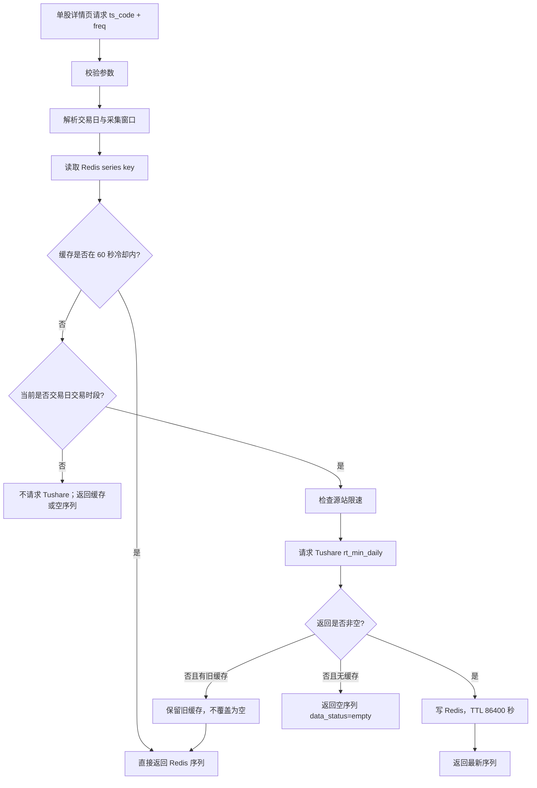

# 股票当日分时序列按需查询方案 v1

状态：开盘初期真实验证已完成 / 午休、下午盘、收盘后待补测 / 待开发  
日期：2026-06-02  
源接口文档：[Tushare 0457 A股实时分钟-日累计](/Users/congming/github/goldenshare/docs/sources/tushare/股票数据/行情数据/0457_A股实时分钟-日累计.md)  
关联方案：[A股实时分钟流架构方案 v1](/Users/congming/github/goldenshare/docs/architecture/realtime-stock-minute-stream-architecture-v1.html)

---

## 1. 结论

`rt_min_daily` 不进入全市场实时分钟 collector，也不作为历史分钟线主来源。它只做一件事：

> 给单股详情页提供“单只股票、当前交易日、指定频率”的当日分时序列按需查询能力。

推荐 V1 形态：

1. 后端提供只读业务 API：`GET /api/v1/realtime/stock-intraday-minutes?ts_code=600000.SH&freq=1MIN`。
2. API 先查 Redis；只有交易时段内缓存过期时才请求 Tushare `rt_min_daily`。
3. 同一个 `ts_code + freq + series_date` 最多 60 秒刷新一次源站。
4. Redis TTL 不等于刷新间隔，V1 建议 TTL 为 86400 秒。
5. 非交易时段不请求源站，避免把已有缓存刷新成空数组。
6. 不落库，不进 `DatasetDefinition`，不进 TaskRun，不进 freshness/date audit。

---

## 2. 已确认事实

### 2.1 源接口文档事实

`rt_min_daily` 文档口径：

| 项 | 事实 |
| --- | --- |
| 接口名 | `rt_min_daily` |
| 语义 | 获取 A 股当日盘中历史分钟数据，可提取单只股票当日开盘以来的所有分钟数据 |
| 必填参数 | `freq`、`ts_code` |
| 可选参数 | 文档列出 `limit`、`offset` |
| 输出字段 | 文档写 `ts_code`、`freq`、`time`、`open`、`close`、`high`、`low`、`vol`、`amount` |

注意：当前 `tushareMcp.rt_min_daily` 工具只暴露 `freq`、`ts_code`、`fields`，没有暴露 `limit/offset`。后续已用 Tushare SDK 验证：即使传入 `limit/offset`，源端仍返回当前完整序列，因此 V1 不依赖分页。

### 2.2 非交易时段实测事实

实测时间：`2026-06-02 01:31 CST`，非交易时段。  
实测工具：`tushareMcp.rt_min_daily`。  
实测请求字段：`ts_code,freq,time,open,close,high,low,vol,amount`。

| 请求 | 返回 |
| --- | --- |
| `600000.SH + 1MIN` | `[]` |
| `600000.SH + 5MIN` | `[]` |
| `600000.SH + 15MIN` | `[]` |
| `600000.SH + 30MIN` | `[]` |
| `600000.SH + 60MIN` | `[]` |
| `000001.SZ + 1MIN` | `[]` |

结论：

1. 非交易时段返回空数组是正常源端行为，不能直接当作接口失败。
2. 非交易时段不应主动请求源站，否则可能把白天已有缓存覆盖为空。
3. 是否在收盘后仍可返回当天完整序列，必须等开市日收盘后再实测确认；开发前不能凭文档假设。

### 2.3 开盘初期实测事实

实测时间：`2026-06-02 09:47 CST`，开盘初期。  
实测工具：`tushareMcp.rt_min_daily` 与 Tushare SDK。  
样本股票：`600000.SH`、`000001.SZ`、`300750.SZ`。  
验证频率：`1MIN`、`5MIN`、`15MIN`、`30MIN`、`60MIN`。

实测汇总：

| 频率 | 每只样本返回行数 | 首条时间 | 末条时间 | 频率字段 |
| --- | ---: | --- | --- | --- |
| `1MIN` | 17 | `2026-06-02 09:30:00` | `2026-06-02 09:46:00` | 等于请求值 |
| `5MIN` | 4 | `2026-06-02 09:30:00` | `2026-06-02 09:45:00` | 等于请求值 |
| `15MIN` | 2 | `2026-06-02 09:30:00` | `2026-06-02 09:45:00` | 等于请求值 |
| `30MIN` | 1 | `2026-06-02 09:30:00` | `2026-06-02 09:30:00` | 等于请求值 |
| `60MIN` | 1 | `2026-06-02 09:30:00` | `2026-06-02 09:30:00` | 等于请求值 |

结论：

1. 开盘初期三只样本、五个频率均可返回当日累计序列。
2. 源端返回顺序为按 `time` 升序；后端仍应保守排序一次，避免未来源端顺序变化影响页面。
3. 单次请求耗时大多约 `40-60ms`，实测最高约 `202ms`；当前 `source_timeout_seconds=20` 秒足够。
4. 多代码请求 `600000.SH,000001.SZ` 会被源端拒绝，错误为 `50101 参数校验失败`。
5. 通配符请求 `6*.SH` 会被源端拒绝，错误为 `50101 参数校验失败`。
6. 非法频率 `BAD` 会被源端拒绝，错误为 `50101 请输入正确的频率`。

字段修正：

1. 源接口真实返回股票代码字段为 `code`，不是 `ts_code`。
2. 不传 `fields` 时默认返回 `code,freq,time,open,close,high,low,vol,amount`。
3. 显式请求 `ts_code,freq,time,open,close,high,low,vol,amount` 时，返回中没有 `ts_code` 字段。
4. 显式请求 `code,freq,time,open,close,high,low,vol,amount` 时，返回中有 `code` 字段。
5. Provider 应请求 `code,freq,time,open,close,high,low,vol,amount`；对外 API 仍统一返回 `ts_code`，由 `row.code` 或请求参数 `ts_code` 归一化得到。

分页修正：

1. SDK 传 `limit=5, offset=0` 仍返回当前完整序列。
2. SDK 传 `limit=5, offset=5` 仍返回当前完整序列。
3. V1 不依赖 `limit/offset`，对外 API 继续禁止 `limit/offset`。

### 2.4 与现有 `rt_min` 的区别

| 能力 | `rt_min` | `rt_min_daily` |
| --- | --- | --- |
| 主用途 | 全市场最新一根分钟 K 线快照 | 单股当日开盘以来分钟序列 |
| 请求对象 | 支持全市场通配符 | 单只股票 |
| 是否进 collector | 已进入统一 realtime collector | 不进入 collector |
| 是否写 Redis | 写全市场当前批次快照 | 按需写单股序列缓存 |
| 是否适合历史分钟线 | 不适合 | 不适合作为主来源 |

---

## 3. 目标与非目标

### 3.1 目标

1. 给单股详情页提供当日分时图数据。
2. 以 `ts_code + freq` 为业务输入，后端按需请求 `rt_min_daily`。
3. 使用 Redis 做短期序列缓存，减少重复请求源站。
4. 对非交易时段、空返回、源站失败给出明确状态，不误报为离线数据问题。
5. 与现有全市场 `rt_min` collector 保持边界清晰。

### 3.2 非目标

1. 不遍历股票池，不做全市场后台刷新。
2. 不把 `rt_min_daily` 接入 `RealtimeCollectorService`。
3. 不写 `raw_tushare`、`core`、`core_serving` 或任何业务历史表。
4. 不进入 `DatasetDefinition`、`DatasetExecutionPlan`、TaskRun、freshness、date audit。
5. 不作为 `stk_mins` 历史分钟线的补数链路。
6. 不实现 WebSocket，不提供订阅推送。
7. 不向前端暴露 Tushare 的 `limit/offset`。

---

## 4. API 设计

### 4.1 业务 API

```http
GET /api/v1/realtime/stock-intraday-minutes?ts_code=600000.SH&freq=1MIN
```

鉴权：复用行情读取权限 `require_quote_access`。

请求参数：

| 参数 | 必填 | 规则 |
| --- | --- | --- |
| `ts_code` | 是 | 单只股票代码，必须是标准 Tushare 股票代码，如 `600000.SH` |
| `freq` | 是 | `1MIN`、`5MIN`、`15MIN`、`30MIN`、`60MIN` |

禁止项：

1. 不接受多股票代码。
2. 不接受 `*` 通配符。
3. 不接受缺省 `freq`。
4. 不接受 `limit/offset` 作为对外参数。

### 4.2 响应结构

建议响应：

```json
{
  "ts_code": "600000.SH",
  "freq": "1MIN",
  "series_date": "20260602",
  "source": "tushare",
  "source_api_name": "rt_min_daily",
  "collection_status": "open",
  "data_status": "ok",
  "cached": false,
  "cache_age_seconds": 0.8,
  "refresh_cooldown_seconds": 60,
  "cache_ttl_seconds": 86400,
  "fetched_at": "2026-06-02T10:15:06+08:00",
  "items": [
    {
      "ts_code": "600000.SH",
      "freq": "1MIN",
      "time": "2026-06-02 09:30:00",
      "open": 10.05,
      "close": 10.06,
      "high": 10.07,
      "low": 10.05,
      "vol": 133400,
      "amount": 1340670
    }
  ]
}
```

字段说明：

| 字段 | 含义 |
| --- | --- |
| `series_date` | 本次序列对应的交易日期，格式 `YYYYMMDD` |
| `collection_status` | 采集窗口状态：`open`、`idle`、`market_closed` |
| `data_status` | 数据状态：`ok`、`empty`、`no_cache`、`source_empty_preserved_cache`、`source_error_preserved_cache` |
| `cached` | 是否直接命中 Redis 缓存 |
| `cache_age_seconds` | 当前返回缓存距离写入 Redis 的秒数 |
| `items` | 当日分时序列，按 `time` 升序 |

说明：源接口真实字段为 `code`，对外响应仍使用 `ts_code`。后端必须在 provider/normalizer 中把 `row.code` 或请求参数 `ts_code` 统一归一化为响应字段 `ts_code`。

### 4.3 错误码

| 场景 | HTTP | code |
| --- | --- | --- |
| 缺少 `ts_code` | 400 | `MISSING_TS_CODE` |
| 非单只股票 | 400 | `UNSUPPORTED_TS_CODE_LIST` |
| 股票代码通配符 | 400 | `UNSUPPORTED_TS_CODE_PATTERN` |
| 缺少 `freq` | 400 | `MISSING_FREQ` |
| 非法 `freq` | 400 | `INVALID_FREQ` |
| 带 `limit/offset` | 400 | `UNSUPPORTED_QUERY_PARAM` |
| Redis 不可用且必须读写缓存 | 503 | `REALTIME_STATE_UNAVAILABLE` |
| 源站失败且无可用缓存 | 503 | `REALTIME_SOURCE_UNAVAILABLE` |
| 源站限流且无可用缓存 | 429 | `REALTIME_SOURCE_RATE_LIMITED` |

说明：非交易时段无缓存时，建议返回 `200 + items=[] + data_status=no_cache`，不是 503。

---

## 5. Redis 缓存模型

### 5.1 Key 设计

```text
rt:series:tushare_stock_rt_min_daily:{series_date}:{freq}:{ts_code}
```

示例：

```text
rt:series:tushare_stock_rt_min_daily:20260602:1MIN:600000.SH
```

设计理由：

1. `series_date` 防止不同日期串数据。
2. `freq` 防止不同频率互相覆盖。
3. `ts_code` 保证单股序列独立。
4. 不使用全市场 `current_batch` 指针，因为它不是全市场批次快照。

### 5.2 Payload

Redis value 建议为单个 JSON：

```json
{
  "ts_code": "600000.SH",
  "freq": "1MIN",
  "series_date": "20260602",
  "source": "tushare",
  "source_api_name": "rt_min_daily",
  "request_params": {
    "ts_code": "600000.SH",
    "freq": "1MIN"
  },
  "fetched_at": "2026-06-02T10:15:06+08:00",
  "source_row_count": 122,
  "items": []
}
```

### 5.3 刷新冷却与 TTL

这两个概念必须分开：

| 项 | V1 建议值 | 作用 |
| --- | --- | --- |
| `refresh_cooldown_seconds` | 60 | 控制同一个 `ts_code + freq + series_date` 多少秒内不重复请求 Tushare |
| `cache_ttl_seconds` | 86400 | 控制 Redis 序列缓存保留多久 |

不能把 TTL 设成 60 秒。原因：

1. 收盘后页面仍应能读取当天已有分时序列。
2. 非交易时段源站实测返回空，短 TTL 会导致页面无数据并诱发错误请求。
3. `series_date` 已经隔离日期，不需要靠短 TTL 防串日。

### 5.4 空返回保护

源站返回 `[]` 时必须区分场景：

| 场景 | 处理 |
| --- | --- |
| 非交易时段 | 不请求源站；有缓存返回缓存，无缓存返回空序列 |
| 交易时段内有旧缓存，源站返回 `[]` | 不覆盖旧缓存，返回旧缓存并标记 `data_status=source_empty_preserved_cache` |
| 交易时段内无旧缓存，源站返回 `[]` | 返回空序列并标记 `data_status=empty` |
| 源站异常且有旧缓存 | 返回旧缓存并标记 `data_status=source_error_preserved_cache` |
| 源站异常且无旧缓存 | 返回 503 |

---

## 6. 请求时序



---

## 7. 配置项审计

本需求尚未进入开发。M8 配置中心收口后，单股当日分时序列不得再新增独立 `REALTIME_STOCK_RT_*` env 口径；进入开发前必须重新按配置中心原则审计。V1 候选配置应作为一个独立配置对象，例如 `stock_intraday_minutes_on_demand`，其持久化位置需在开发前拍板：进入 `foundation.realtime_runtime_config`，或另建更适合按需查询的受控配置表。未拍板前，不允许把这些配置写进 `Settings`、前端常量或 provider 私有常量。

| 候选配置字段 | 建议值 | 待定持久化 | 作用范围 | 消费者 | 依赖关系 | 测试门禁 |
| --- | --- | --- | --- | --- | --- | --- |
| `enabled` | `true` | 待配置中心方案确认 | 是否启用单股当日分时序列 API 的源站刷新能力 | Biz API / query service | 关闭时只读缓存，不请求源站 | disabled 时不打 Tushare |
| `refresh_cooldown_seconds` | `60` | 待配置中心方案确认 | 同 key 刷新冷却时间 | query service | 应小于 TTL；应大于等于 1min 最小业务粒度 | 60 秒内重复请求命中缓存 |
| `cache_ttl_seconds` | `86400` | 待配置中心方案确认 | Redis 序列缓存保留时间 | Redis series store | 必须大于刷新冷却时间 | 写缓存时 TTL 正确 |
| `source_timeout_seconds` | `20` | 待配置中心方案确认 | 单次源站请求超时 | provider | 应小于 API 可接受超时 | provider 初始化使用该值 |
| `max_calls_per_minute` | `120` | 待配置中心方案确认 | 按需查询源站全局限速 | query service / Tushare client | 与 `rt_k`、`rt_min` 共享 Token 额度，不能超过源站权限 | 超限时返回缓存或 429 |

说明：

1. `refresh_cooldown_seconds=60` 是产品刷新口径，不是 Redis TTL。
2. `cache_ttl_seconds=86400` 是 V1 建议值；后续如果希望周末仍展示最近交易日分时，可以单独评审是否调整为 72 小时。
3. `max_calls_per_minute=120` 是保护值，不代表性能目标；实际请求量由页面访问量和缓存命中率决定。

### 7.1 实时流配置中心展示口径

单股当日分时序列在数据运营后台“实时流配置中心”中的展示，归入本 `rt_min_daily` 按需查询需求一起开发，不作为实时流配置中心当前 V1 的独立前置任务。

它应作为一个独立实时流对象展示，但它不是 collector feed。

展示与编辑边界：

1. 查看态左侧对象列表显示“单股当日分时序列”，右侧展示按需查询、短缓存、刷新冷却、非 collector、非 TaskRun、非历史分钟替代等配置事实。
2. 它不进入“股票实时分钟”的五频率 collector 配置，不和 `stock_rt_min.enabled_freqs` 混在一起。
3. 编辑态只允许修改该对象自己的按需查询配置，例如启用状态、缓存 TTL、刷新冷却和源站限速。
4. `freq` 仍是业务 API 必填参数，配置中心不得提供“默认频率”开关。
5. 发布校验只在编辑态展示，查看态不混入草稿差异或发布确认。
6. 若实时流配置中心先于 `rt_min_daily` 开发完成，该对象最多只作为“待接入/只读规划”展示；不能开放编辑和发布。

当前交互参考：[Ops 实时流配置中心 Showcase v1](/Users/congming/github/goldenshare/docs/ops/ops-realtime-config-center-showcase-v1.html)。

---

## 8. 开市真实验证计划

开发前必须先做开市真实验证，不能只看文档或凌晨空结果。当前开盘初期验证已完成，午休、下午盘、收盘后仍需补测。

当前状态补充：`2026-06-02 15:30 CST` 已收盘，且已错过本日收盘后短时间验证窗口。下一步不进入开发，等待下一个开市日按下面计划补齐 M0。

### 8.1 验证时间点

建议至少覆盖：

1. 开盘初期：`09:35-09:45`，已于 `2026-06-02 09:47 CST` 完成
2. 盘中：`10:30-11:00`，下一开市日补测
3. 午休：`11:30-13:00`，下一开市日补测
4. 下午盘：`13:30-14:30`，下一开市日补测
5. 收盘后短时间：`15:05-15:20`，下一开市日补测

### 8.2 验证对象

最小样本：

| 股票 | 目的 |
| --- | --- |
| `600000.SH` | 沪市主板样本 |
| `000001.SZ` | 深市主板样本 |
| `300750.SZ` | 创业板样本 |

频率：

```text
1MIN,5MIN,15MIN,30MIN,60MIN
```

### 8.3 验证问题

必须记录：

1. 每个频率是否返回代码字段、`freq/time/open/close/high/low/vol/amount`。开盘初期实测源端代码字段为 `code`，不是 `ts_code`。
2. `freq` 是否稳定等于请求值。
3. `time` 是否从当日 `09:30:00` 开始累计到当前分钟。
4. `items` 是否按时间升序或源端返回顺序是否需要后端排序。
5. 午休期间是否继续返回上午累计序列。
6. 收盘后是否仍返回当天完整序列。
7. 源站返回空数组时对应的真实时段。
8. MCP 未暴露 `limit/offset`；SDK 实测 `limit/offset` 不生效，V1 不依赖分页。
9. 单次请求耗时和行数，评估 API 超时与缓存冷却是否合理。

开盘初期已完成项：

1. 三只样本股、五个频率均有返回。
2. `freq` 稳定等于请求值。
3. 返回序列从当日 `09:30:00` 开始累计，按 `time` 升序。
4. 多代码、通配符、非法频率均被源端拒绝。
5. 字段口径已修正为源端 `code`，对外 API `ts_code`。
6. SDK `limit/offset` 已确认不能作为 V1 分页能力。

仍需补测项：

1. 盘中 `10:30-11:00` 是否继续累计，尤其 `30MIN/60MIN` 是否按预期新增。
2. 午休 `11:30-13:00` 是否继续返回上午累计序列。
3. 下午盘 `13:30-14:30` 是否接着上午累计，时间序列是否连续、排序是否稳定。
4. 收盘后 `15:05-15:20` 是否仍返回当天完整序列。

下一开市日执行顺序：

1. `10:30-11:00`：验证盘中持续累计。
2. `11:30-13:00`：验证午休返回行为。
3. `13:30-14:30`：验证下午盘累计行为。
4. `15:05-15:20`：验证收盘后完整序列可用性。
5. 补齐独立验证记录文档，并同步修正本文档。

### 8.4 验证记录落档

完整验证完成后新增事实记录文档：

```text
docs/architecture/realtime-stock-intraday-minutes-open-market-validation-YYYYMMDD.md
```

记录内容：

1. 验证时间与工具。
2. 请求参数与字段。
3. 返回行数与耗时。
4. 样本首尾行。
5. 空返回或异常样本。
6. 对本方案需要修正的点。

若真实行为与本方案冲突，先修本文档，再开发。

---

## 9. 开发里程碑

| 阶段 | 目标 | 输出 |
| --- | --- | --- |
| M0 | 开市真实验证 | 开盘初期已完成；盘中、午休、下午盘、收盘后待下一开市日补测；M0 未完成前不进入 M1 开发 |
| M1 | 配置与 provider | 新增配置读取；新增 `rt_min_daily` provider；显式 fields |
| M2 | Redis series cache | 新增按 `series_date + freq + ts_code` 的序列缓存读写能力 |
| M3 | Biz query service/API | 新增参数校验、缓存命中、源站刷新、空返回保护 |
| M4 | 测试 | provider、cache、API、非交易时段、空返回保护、限速测试 |
| M5 | 文档与前端对接准备 | API 契约文档；给单股详情页接入留清晰字段；将“单股当日分时序列”作为独立对象接入实时流配置中心展示 |

---

## 10. 测试门禁

开发时至少覆盖：

1. API 缺 `ts_code`、缺 `freq`、非法 `freq`、多代码、通配符、`limit/offset` 均返回 400。
2. 交易时段内首次请求会调用 `rt_min_daily` 并写 Redis。
3. 60 秒冷却内第二次请求不调用源站。
4. 非交易时段不调用源站。
5. 源站返回非空时写 Redis，TTL 为 86400。
6. 源站返回空且已有缓存时，不覆盖旧缓存。
7. 源站返回空且无缓存时，返回空序列和 `data_status=empty`。
8. 源站异常且已有缓存时，返回缓存并带 `source_error_preserved_cache`。
9. 源站异常且无缓存时，返回 503。
10. 源站限流且无缓存时，返回 429。

---

## 11. 待确认事项

当前没有阻塞开发的产品口径待确认；M0 开盘初期验证已完成，但午休、下午盘、收盘后仍需补测并落档。

若验证发现以下情况，需要重新评审：

1. 收盘后源站不返回当天完整序列。
2. `freq` 字段缺失或与请求值不一致。
3. 单次请求耗时明显超过 20 秒。
4. 源站返回顺序不稳定且存在重复时间。
5. `limit/offset` 对返回完整性有实际影响。
