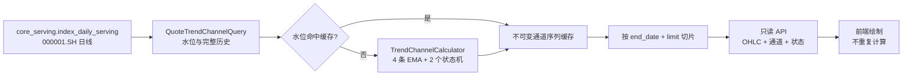

# 上证指数日线趋势通道实时计算方案 v1

状态：已拍板，待开发

日期：2026-08-10

适用标的：`000001.SH`（上证指数）

适用周期：日线

公式版本：`sse-daily-trend-channel-v1`

代码级实施合同：[上证指数日线趋势通道实时计算 LLD v1](/Users/congming/github/goldenshare/docs/architecture/sse-daily-trend-channel-realtime-computation-low-level-design-v1.md)

关联事实源：

- `core_serving.index_daily_serving`
- `src/foundation/models/core_serving/index_daily_serving.py`
- `src/biz/api/quote.py`
- `src/biz/queries/quote_query_service.py`

关联但不被本方案修改的专项：

- [Dagster 指数技术数据资产接入方案 v1](/Users/congming/github/goldenshare/lake_console/docs/design/dagster-index-technical-datasets-onboarding-plan-v1.html)
- [Dagster 指数技术数据资产接入 LLD v1](/Users/congming/github/goldenshare/lake_console/docs/design/dagster-index-technical-datasets-onboarding-low-level-design-v1.html)

---

## 1. 结论

上证指数日线趋势通道 v1 采用下面的确定性公式：

1. 短期上轨：`EMA(high, 25)`。
2. 短期下轨：`EMA(low, 25)`。
3. 长期上轨：`EMA(high, 90)`。
4. 长期下轨：`EMA(low, 90)`。
5. 收盘价突破上轨时，通道状态切换为 `UP`。
6. 收盘价跌破下轨时，通道状态切换为 `DOWN`。
7. 收盘价留在通道内部时，状态保持上一交易日不变。

实现上采用“权威日线历史 + 后端按需计算 + 进程内小缓存”：

- 数据加载完成后，约 6,445 根日线计算四条 EMA 和两组状态的本机实测中位数为 `2.274ms`，P95 为 `2.430ms`。
- 不新建数据库结果表，不新建 `DatasetDefinition`，不新增 Dagster/Lake 资产。
- 请求链路只读查询 `core_serving.index_daily_serving`，首次或数据修订后全历史重算，其他请求命中不可变缓存后直接切片。
- 前端只绘图，不重复计算 EMA，也不自行推断通道状态。
- 当前代码没有指数盘中实时 OHLC feed，所以 v1 只发布已落入 `index_daily_serving` 的正式日线结果，`is_provisional=false`。
- 未来若引入经验证的指数盘中 OHLC，使用“上一根正式状态 + 当前盘中 OHLC 快照”做 O(1) 临时覆盖；不得把每次盘中快照递推成下一次 EMA 输入。

这套方案优先解决“计算快、结果一致、可复现、可直接绘图”。只有规模或复用量达到本文门槛后，才转为预计算持久化。

---

## 2. 方案性质与可信边界

### 2.1 本方案冻结的是 Goldenshare 正式公式，不冒充原软件源码

原图只能提供视觉和点位证据，不能证明原软件内部源码。管理员已于 2026-08-10 拍板：Goldenshare v1 正式采用 `25/90` 高低价 EMA 双通道，不再把周期作为待拟合参数。

因此产品和数据层统一采用独立版本名 `sse-daily-trend-channel-v1`。后续若得到更强证据，需要：

1. 新增公式版本，不得静默覆盖 v1。
2. 重放全部历史。
3. 对比金标日期的轨道值、状态和状态切换日期。
4. 明确前端选择的公式版本。

### 2.2 通道是技术研究数据，不是交易指令

`UP`、`DOWN` 只表示按本文规则得到的通道状态，不表示预测一定上涨或下跌，也不直接产生买入、卖出建议。

---

## 3. 当前代码与数据事实

### 3.1 正式日线输入已经存在

`IndexDailyServing` 以 `(ts_code, trade_date)` 为复合主键，提供 `open/high/low/close` 等日线字段，并继承 `created_at/updated_at`。

本方案固定读取：

```text
table: core_serving.index_daily_serving
ts_code: 000001.SH
price adjustment: none
order: trade_date ASC
```

不从前端可见窗口反向计算，也不在 API 请求路径直接扫描 Lake 的逐日 Parquet glob。

### 3.2 现有 Quote API 已能读取指数日线

当前 `GET /api/v1/quote/detail/kline` 已通过 `QuoteQueryService` 识别 `security_type=index` 并读取 `IndexDailyServing`。

本方案沿用该 API 模块、鉴权和标的解析规则，但通道计算放入独立服务，避免继续扩大已经较重的 `QuoteQueryService`。

### 3.3 当前没有指数盘中 OHLC feed

当前 realtime 基座只有：

- `stock_rt_daily`
- `stock_rt_min`
- `etf_rt_daily`

没有指数实时日线或指数实时分钟的 provider、normalizer、feed key 和已验证源契约。因此 v1 不得用股票 feed、ETF feed、页面点位或昨日收盘伪造指数盘中 OHLC。

### 3.4 为什么不走 Lake 请求路径

本机只读测量中，扫描当前上证指数日线逐日 Parquet glob 的中位耗时约为 `302.59ms`。慢点不在 EMA，而在打开大量小文件。

正式页面请求应从查询友好的 serving 表读取；Lake 继续承担历史数据资产和离线研究职责，不进入本 API 热路径。

---

## 4. 目标与非目标

### 4.1 目标

1. 为上证指数日线图返回可直接绘制的短期、长期趋势通道。
2. 公式、种子、精度、状态转换和数据修订行为全部可复现。
3. 首次全历史计算足够快，日常请求以缓存切片为主。
4. 支持数据源新增正式交易日、历史修订和公式升级后的自动失效重算。
5. 为未来盘中临时通道保留明确接口字段，但当前不伪造盘中能力。

### 4.2 非目标

1. 不支持上证指数以外的指数。
2. 不支持周线、月线、分钟线或 120 分钟线。
3. 不接入 Tushare 新接口，不调整现有 Tushare 请求参数。
4. 不新增数据库表、迁移、Lake 文件、Dagster asset、schedule 或 sensor。
5. 不实现九转、波浪、买卖点、收益预测或胜率。
6. 不允许前端传入 EMA 周期、状态规则、种子规则等公式参数。
7. 不把缓存命中、计算成功写入 TaskRun 或业务数据表。

---

## 5. 输入合同

### 5.1 单根输入

每个交易日只使用以下字段：

| 字段 | 类型 | 规则 |
| --- | --- | --- |
| `ts_code` | string | 必须等于 `000001.SH` |
| `trade_date` | date | 唯一、严格升序 |
| `open` | decimal | 非空且大于 0 |
| `high` | decimal | 非空且大于 0 |
| `low` | decimal | 非空且大于 0 |
| `close` | decimal | 非空且大于 0 |
| `updated_at` | timestamp | 参与缓存水位计算 |

### 5.2 行级校验

每根 K 线必须满足：

```text
low <= min(open, close)
max(open, close) <= high
```

出现以下任一情况时失败关闭，不做填充：

1. 重复 `trade_date`。
2. 任一 OHLC 为空、非有限数或小于等于 0。
3. 高低价关系非法。
4. 行数超过 v1 安全上限 `10,000`。
5. 请求标的或周期不属于 v1 支持范围。

不得使用前值填充、零值填充或跳过坏行后继续计算，因为这会改变所有后续 EMA 和状态。

### 5.3 时间与因果口径

1. 第 `t` 日结果只使用 `trade_date <= t` 的数据。
2. 不使用未来 K 线回填过去状态。
3. 历史查询的 `end_date` 是因果截断点。
4. 计算从当前可用历史的最早交易日开始，完成后再按 `limit` 切出响应窗口。

---

## 6. 精确计算公式

### 6.1 EMA 定义

周期 `N` 的平滑系数：

```text
alpha(N) = 2 / (N + 1)
```

递推公式：

```text
EMA_t(x, N) = alpha(N) * x_t + (1 - alpha(N)) * EMA_(t-1)(x, N)
```

第一个有效交易日使用首值种子：

```text
EMA_0(x, N) = x_0
```

该定义等价于常见数据工具中的递推 EMA，也就是 `adjust=False` 语义；不是对历史权重重新归一化的 `adjust=True`。

### 6.2 四条轨道

短期周期：

```text
N_short = 25
alpha_short = 2 / 26 = 0.076923076923...
```

长期周期：

```text
N_long = 90
alpha_long = 2 / 91 = 0.021978021978...
```

四条轨道：

```text
short_upper_t = EMA_t(high, 25)
short_lower_t = EMA_t(low, 25)
long_upper_t  = EMA_t(high, 90)
long_lower_t  = EMA_t(low, 90)
```

因为同一周期使用相同的平滑系数且原始 `high >= low`，理论上对应上轨始终不低于下轨；实现仍需保留断言。

### 6.3 当日位置

对任一通道 `(upper_t, lower_t)`：

```text
if close_t > upper_t: position_t = ABOVE
elif close_t < lower_t: position_t = BELOW
else: position_t = INSIDE
```

等于上轨或下轨都算 `INSIDE`，只有严格突破才改变状态。

### 6.4 带滞后的通道状态

状态枚举：

```text
UNKNOWN | UP | DOWN
```

第一个交易日：

```text
state_0 = UNKNOWN
```

后续交易日：

```text
if position_t == ABOVE: state_t = UP
elif position_t == BELOW: state_t = DOWN
else: state_t = state_(t-1)
```

短期和长期分别执行同样的状态机。`INSIDE` 保留旧状态是本方案的“通道状态”核心；如果每天只按通道内部位置重新染色，图形会与趋势状态语义不同。

### 6.5 组合状态

组合状态仅压缩短期和长期状态，不附加交易含义：

| `short_state` | `long_state` | `combined_state` |
| --- | --- | --- |
| `UP` | `UP` | `UP_UP` |
| `UP` | `DOWN` | `UP_DOWN` |
| `DOWN` | `UP` | `DOWN_UP` |
| `DOWN` | `DOWN` | `DOWN_DOWN` |
| 任一 `UNKNOWN` | 任意 | `UNKNOWN` |

### 6.6 数值精度

1. 输入按数据库原始精度转为 IEEE-754 `float64` 计算。
2. EMA 递推和状态比较使用未四舍五入的内部值。
3. API 输出轨道值统一量化到小数点后 4 位。
4. 单元测试对未量化值使用绝对误差 `1e-8`，对 API 输出使用 4 位小数精确断言。
5. 不允许先把每日 EMA 四舍五入再作为下一日输入。

---

## 7. 历史全量算法

### 7.1 伪代码

```python
def calculate(rows):
    validate_rows(rows)
    alpha_short = 2.0 / 26.0
    alpha_long = 2.0 / 91.0

    short_state = "UNKNOWN"
    long_state = "UNKNOWN"
    output = []

    for i, row in enumerate(rows):
        if i == 0:
            short_upper = row.high
            short_lower = row.low
            long_upper = row.high
            long_lower = row.low
        else:
            short_upper = alpha_short * row.high + (1 - alpha_short) * short_upper
            short_lower = alpha_short * row.low + (1 - alpha_short) * short_lower
            long_upper = alpha_long * row.high + (1 - alpha_long) * long_upper
            long_lower = alpha_long * row.low + (1 - alpha_long) * long_lower

        short_position = locate(row.close, short_upper, short_lower)
        long_position = locate(row.close, long_upper, long_lower)
        short_state = transition(short_state, short_position)
        long_state = transition(long_state, long_position)

        output.append(build_row(...))

    return output
```

### 7.2 复杂度

设历史行数为 `n`：

```text
time: O(n)
memory: O(n)  用于缓存和响应切片
incremental finalized bar: O(1)
```

单纯追加一根正式日线时，公式本身可以 O(1) 递推；v1 仍在水位变化时统一全历史重算，因为当前规模很小，而且同一条路径可以正确覆盖历史修订，不需要再维护“追加”与“修订”两套状态恢复逻辑。

### 7.3 为什么必须先算完整历史再切窗口

EMA 和滞后状态都依赖前序状态。若页面只请求最近 300 根并从第 1 根重新种子：

1. 前段轨道会出现系统性偏差。
2. 第一个 `UP/DOWN` 切换日期会变化。
3. 同一日期会因页面 `limit` 不同而返回不同通道值。

因此 `limit` 只控制返回数量，不控制计算起点。

---

## 8. 正式日线实时生成策略

这里的“实时”指 `index_daily_serving` 出现新正式日线或修订后，页面无需等待离线指标任务，可以在第一次请求时立即得到新通道。

### 8.1 数据水位

每次请求先执行一个轻量水位查询：

```sql
select
    count(*) as row_count,
    max(trade_date) as max_trade_date,
    max(updated_at) as max_updated_at
from core_serving.index_daily_serving
where ts_code = '000001.SH';
```

缓存身份：

```text
(
  ts_code,
  formula_version,
  row_count,
  max_trade_date,
  max_updated_at
)
```

它同时覆盖：

- 新增交易日：`row_count` 或 `max_trade_date` 改变。
- 修订历史行：`max_updated_at` 改变。
- 升级公式：`formula_version` 改变。

### 8.2 缓存命中

水位不变时：

1. 不重新查全历史。
2. 不重新计算 EMA。
3. 从不可变结果数组按 `end_date + limit` 切片。

### 8.3 缓存失效

水位变化时：

1. 查询 `000001.SH` 截至当前最大日期的全部有效日线，按日期升序。
2. 执行输入校验。
3. 全历史重算。
4. 构造新的不可变缓存对象。
5. 原子替换进程内旧缓存。

并发请求使用单飞锁：同一水位只允许一个请求重算，其余请求等待结果，不并行重复扫描。

### 8.4 为什么 v1 采用进程内缓存

1. 当前只有一个标的、一个周期、一个公式版本。
2. 全历史计算只有毫秒级，多进程各保留一份成本可接受。
3. 不引入 Redis TTL、新配置项、序列化格式和跨服务一致性问题。
4. 缓存丢失只导致下一次请求重算，不影响正确性。

缓存固定最多保留两个水位版本，不新增可配置参数。若未来需要跨进程共享缓存，必须先做配置项审计和缓存失效契约设计。

---

## 9. 未来盘中临时通道

### 9.1 启用前置条件

只有同时满足以下条件才可启用：

1. 存在经文档和真实请求验证的上证指数盘中 OHLC 来源。
2. 明确 `open/high/low/close` 的日累计语义和交易时间。
3. 有独立 feed key、源状态、批次时间和 stale 判定。
4. 能区分正式日线与盘中临时快照。
5. 已完成开盘、午休、下午盘、收盘后和非交易日验收。

### 9.2 O(1) 临时计算

令上一根正式日线状态为 `t-1`，当前盘中日累计 OHLC 为 `t*`：

```text
short_upper_t* = alpha_short * high_t* + (1 - alpha_short) * short_upper_(t-1)
short_lower_t* = alpha_short * low_t*  + (1 - alpha_short) * short_lower_(t-1)
long_upper_t*  = alpha_long  * high_t* + (1 - alpha_long)  * long_upper_(t-1)
long_lower_t*  = alpha_long  * low_t*  + (1 - alpha_long)  * long_lower_(t-1)
```

状态同样从上一根正式状态出发计算。

### 9.3 禁止盘中快照串联递推

09:31、09:32、09:33 的快照都必须独立使用同一个 `t-1` 正式状态作为基线：

```text
official(t-1) + current_snapshot(t*) -> provisional(t*)
```

禁止：

```text
provisional(09:31) -> provisional(09:32) -> provisional(09:33)
```

否则同一天被重复计入多次，结果会依赖刷新频率而不是日线公式。

### 9.4 收盘归并

正式日线落入 `index_daily_serving` 后：

1. 丢弃临时覆盖。
2. 由正式日线触发水位变化。
3. 按 v1 正式日线水位失效流程重算。
4. 返回 `is_provisional=false`。

盘中能力不在本轮开发范围内。

---

## 10. API 合同

### 10.1 路径

在现有 Quote API 模块新增独立只读端点：

```http
GET /api/v1/quote/detail/trend-channel
```

选择独立端点而不是直接扩展全部 K 线响应，原因是：

1. 当前只支持一个指数和一个周期。
2. 避免给股票、ETF、周线和月线的共享 `QuoteKlineBar` 增加大量永远为空的字段。
3. 避免修改现有 K 线消费者合同。
4. 返回 OHLC 与通道同一行，前端无需再按日期拼接两个响应。

鉴权复用 `require_quote_access`。

### 10.2 请求参数

| 参数 | 必填 | 默认值 | v1 规则 |
| --- | --- | --- | --- |
| `ts_code` | 是 | 无 | 只接受 `000001.SH` |
| `period` | 否 | `day` | 只接受 `day` |
| `end_date` | 否 | 最新正式交易日 | 因果计算和返回截断日期 |
| `limit` | 否 | `500` | `1..2000`，只影响响应切片 |

不接受公式参数、周期参数、种子参数、复权参数或盘中模式参数。

### 10.3 响应示例

```json
{
  "instrument": {
    "ts_code": "000001.SH",
    "name": "上证指数",
    "security_type": "index"
  },
  "period": "day",
  "adjustment": "none",
  "formula": {
    "key": "high-low-ema-hysteresis",
    "version": "sse-daily-trend-channel-v1",
    "short_period": 25,
    "long_period": 90,
    "seed": "first_observation",
    "state_rule": "strict_close_breakout_inside_retention"
  },
  "data_status": {
    "status": "READY",
    "observed_trade_date": "2026-08-07",
    "as_of_time": "2026-08-10T10:00:00+08:00",
    "is_provisional": false
  },
  "bars": [
    {
      "trade_date": "2026-08-07",
      "open": "3896.4900",
      "high": "3940.9300",
      "low": "3885.6200",
      "close": "3940.0371",
      "short_channel": {
        "upper": "3918.6886",
        "lower": "3861.5773",
        "position": "ABOVE",
        "state": "UP"
      },
      "long_channel": {
        "upper": "4008.2599",
        "lower": "3953.5230",
        "position": "BELOW",
        "state": "DOWN"
      },
      "combined_state": "UP_DOWN",
      "is_provisional": false
    }
  ],
  "meta": {
    "bar_count": 500,
    "limit": 500,
    "start_date": "2024-07-29",
    "end_date": "2026-08-07",
    "has_more_history": true,
    "next_end_date": "2024-07-26"
  }
}
```

示例轨道值是 v1 公式的复算参考。当前 API 基线中的 `Decimal` 会序列化为四位小数字符串，因此 OHLC 和通道数值统一按字符串展示。正式金标必须从固定快照独立生成，不允许手抄示例作为实现输入。

### 10.4 数据状态

| 状态 | 含义 |
| --- | --- |
| `READY` | 已返回正式日线通道 |
| `EMPTY` | 权威日线为空，或请求的 `end_date` 之前没有可返回行 |

成功响应只允许 `READY/EMPTY`。数据校验、查询或计算失败通过统一 HTTP 错误合同返回，不在 200 响应中伪装成 `ERROR`。未来若启用盘中能力，再增加 `PROVISIONAL`，本轮不得提前返回该状态。

### 10.5 错误合同

| 场景 | HTTP | code |
| --- | ---: | --- |
| 非 `000001.SH` | 400 | `UNSUPPORTED_TREND_CHANNEL_SYMBOL` |
| 非日线周期 | 400 | `UNSUPPORTED_TREND_CHANNEL_PERIOD` |
| `limit` 越界 | 422 | 沿用 FastAPI 参数校验 |
| 源数据重复或 OHLC 非法 | 503 | `TREND_CHANNEL_SOURCE_INVALID` |
| 计算断言失败 | 500 | `TREND_CHANNEL_COMPUTE_FAILED` |

---

## 11. 前端绘制合同

前端只做以下工作：

1. 按 `trade_date` 绘制 K 线。
2. 在相同横坐标上绘制 `short_channel.upper/lower` 和 `long_channel.upper/lower`。
3. 每个交易日都必须连接该日上轨与下轨；相邻交易日分别连接上轨与上轨、下轨与下轨，不能抽样省略竖线。
4. 页面按每个交易日单独判色，不允许把整段可见窗口统一染成一种颜色。短期 `close_t < short_lower_t` 为绿色，否则为红色；长期 `close_t < long_lower_t` 为蓝色，否则为粉色。等于下轨归入“下轨上方/未跌破”颜色，即短期红色、长期粉色。
5. 交易日 `t` 的竖线，以及从 `t` 连向下一交易日 `t+1` 的上轨、下轨线段，都使用交易日 `t` 的判定颜色；到 `t+1` 重新判定，因此颜色可以在交易日边界切换。最后一个交易日只绘制本日竖线，不虚构下一段。
6. 页面判色不使用后端趋势 `state`。`state` 继续作为严格突破/区间继承的客观输出，不改变计算契约。
7. 不填充通道区域，不绘制中轴或辅助分区。
8. tooltip 同时显示上下轨、当日位置和状态。
9. `is_provisional=true` 时使用虚线或临时标识；v1 始终为 `false`。

前端不得：

1. 根据当前可见窗口重新计算 EMA。
2. 根据颜色反向推断状态。
3. 自行补齐缺失日期或坏数据。
4. 把 `UP/DOWN` 转换成买卖信号。

---

## 12. 推荐代码落点

本轮只落方案文档。后续开发建议按以下边界实施：

| 层 | 推荐文件 | 职责 |
| --- | --- | --- |
| API | `src/biz/api/quote.py` | 新端点、参数与异常映射 |
| Schema | `src/biz/schemas/quote_trend_channel.py` | 独立响应合同 |
| Query | `src/biz/queries/quote_trend_channel_query.py` | 水位与完整历史查询 |
| Service | `src/biz/services/quote_trend_channel_calculator.py` | 纯公式、校验、状态机 |
| Service | `src/biz/services/quote_trend_channel_query_service.py` | 缓存、切片、响应装配 |
| Test | `tests/test_quote_trend_channel_calculator.py` | 公式与状态金标 |
| Fixture | `tests/fixtures/quote_trend_channel/000001_sh_daily_input.json` | 固定正式日线 OHLC 输入快照 |
| Fixture | `tests/fixtures/quote_trend_channel/000001_sh_daily_expected_v1.json` | 与输入 SHA-256 绑定的逐日独立金标 |
| Test | `tests/test_quote_trend_channel_query_service.py` | 完整历史查询、水位一致性、缓存与并发单飞 |
| Test | `tests/web/test_quote_trend_channel_api.py` | API、权限、错误与缓存失效 |

依赖方向：

```text
src/app -> src/biz -> src/foundation
```

不新增 `foundation -> biz` 反向依赖，不修改 `platform/operations` legacy 目录。

---

## 13. 数据流



---

## 14. 性能预算与拒绝门槛

### 14.1 当前规模

| 项 | v1 规模 |
| --- | ---: |
| 标的数 | 1 |
| 周期数 | 1 |
| 公式版本 | 1 |
| 当前正式日线行数 | 1,599（2020-01-02 至 2026-08-07 的 M0 固定快照） |
| 每行派生值 | 4 条轨道、2 个位置、2 个状态、1 个组合状态 |
| 外部源请求 | 0 |
| API 默认返回 | 500 行 |
| API 最大返回 | 2,000 行 |

### 14.2 请求成本

| 场景 | DB 请求 | 计算 | 目标 |
| --- | ---: | --- | --- |
| 缓存命中 | 1 次水位聚合 | 只切片 | API P95 `< 100ms` |
| 新交易日/历史修订 | 1 次水位 + 1 次完整历史 | O(n) 全量 | API P95 `< 500ms` |
| 后续盘中快照 | 读取上一正式状态 + 当前快照 | O(1) | 计算 P95 `< 5ms` |

计算内核验收目标：

- 1,000 行完整计算 P95 `< 10ms`。
- 结果内存 `< 10MB`。
- 同一输入重复运行字节级 API 输出一致。

### 14.3 不可接受量级

出现以下任一情况时停止扩大按需计算范围，重新评审是否物化：

1. 单序列超过 `10,000` 行。
2. 扩展到超过 50 个指数。
3. 扩展到超过 3 个周期。
4. 冷请求 P95 连续三次基准超过 `500ms`。
5. 该派生序列需要被三个以上独立下游批量复用。
6. 需要独立 freshness、审计、回溯版本或跨服务订阅。

达到门槛后另立“趋势通道物化数据集”方案，重新完成 DatasetDefinition、Lake、Dagster、表结构和生产验收设计；不得在本方案内顺手加表。

---

## 15. 测试合同

### 15.1 公式单元测试

1. 第一根的四条 EMA 分别等于第一根 `high/low`。
2. 第二根按 `alpha=2/(N+1)` 精确递推。
3. 与 `adjust=False` 参考实现逐行一致。
4. 不能与 `adjust=True` 结果混淆。
5. 输出四舍五入不反向污染下一根计算。

### 15.2 状态机测试

1. `close > upper` 切换为 `UP`。
2. `close < lower` 切换为 `DOWN`。
3. `close == upper/lower` 保持上一状态。
4. `INSIDE` 连续多日保留旧状态。
5. 尚未突破时保持 `UNKNOWN`。
6. 短期和长期状态互不污染。

### 15.3 数据质量负向测试

1. 重复日期拒绝。
2. 无序输入在 query 层排序，calculator 若收到无序输入则拒绝。
3. 空 OHLC、零值、负值、NaN、Infinity 拒绝。
4. `low > high`、`open/close` 越界拒绝。
5. 超过 10,000 行拒绝。
6. 只给最近 300 根计算的错误实现必须与完整历史金标不一致，以防窗口种子回归。

### 15.4 缓存测试

1. 相同水位复用结果。
2. 新交易日使缓存失效。
3. 历史行更新使 `max(updated_at)` 改变并失效。
4. 公式版本改变使缓存失效。
5. 并发同水位只重算一次。
6. 缓存清空后结果与清空前完全一致。

### 15.5 API 测试

1. `000001.SH + day` 正常返回。
2. 其他标的、其他周期拒绝。
3. `limit` 只影响返回行数，不影响相同日期的轨道值。
4. `end_date` 后的数据不参与计算。
5. 返回 OHLC、轨道和状态日期严格对齐。
6. v1 所有行 `is_provisional=false`。
7. 现有 `/api/v1/quote/detail/kline` 响应合同不变。

### 15.6 固定快照金标

开发前从 `core_serving.index_daily_serving` 导出截至 2026-08-07 的 `000001.SH` 完整可用正式日线，并保存：

1. 原始 OHLC。
2. 未量化四条轨道。
3. 4 位小数 API 轨道。
4. 短期、长期位置和状态。
5. 组合状态。

金标生成脚本与生产 calculator 必须是两套独立实现，避免同一个错误自证正确。

固定文件为：

1. `tests/fixtures/quote_trend_channel/000001_sh_daily_input.json`。
2. `tests/fixtures/quote_trend_channel/000001_sh_daily_expected_v1.json`。

独立金标主算法使用 pandas `ewm(span=period, adjust=False)`，同时使用显式 `float64` 递推交叉校验。M1 的生产 calculator 不得参与金标生成，并必须再与金标逐日对账。

---

## 16. 分阶段实施与验收

### M0：金标冻结

1. 以已拍板的 `25/90`、首值种子、严格突破和内部保留规则生成独立参考结果。
2. 固定公式版本名 `sse-daily-trend-channel-v1`。
3. 固定金标快照、状态切换日期和预期输出。

验收：输入文件 SHA-256 固定；pandas EWM 与显式 `float64` 递推最大绝对误差 `< 1e-8`；生产 calculator 对金标的逐日验收属于 M1 门禁。

### M1：纯计算内核

1. 实现输入类型、校验、EMA 和状态机。
2. 完成单元测试与 1,000 行性能基准。
3. 不接数据库和 API。

验收：公式、负向样本、无未来数据和性能门禁全部通过。

### M2：查询、水位与缓存

1. 实现水位查询和完整历史读取。
2. 实现不可变进程缓存和单飞锁。
3. 验证新增日线、历史修订和清空缓存。

验收：三类失效路径结果正确；整个链路保持只读，不写入或影响业务数据事务。

### M3：API

1. 新增独立只读端点和 schema。
2. 接入统一鉴权与异常格式。
3. 完成 API 回归，确认现有 K 线合同不变。

验收：冷/热请求性能与全部契约测试通过。

### M4：前端绘图

1. 增加两组通道 band。
2. 增加状态和 tooltip。
3. 校验缩放、窗口切换和历史分页后的日期对齐。

验收：页面不包含 EMA 计算代码；同一日期的图示值等于 API。

### M5：盘中能力，另立范围

只有指数盘中 OHLC 源完成真实合同验证后，才设计 provider、缓存和临时覆盖。M5 不属于 v1 当前开发范围。

---

## 17. 持久化决策

### 17.1 v1 不提前存结果

原因：

1. 当前只有一个日线序列，计算耗时不是瓶颈。
2. 持久化会新增迁移、任务、回补、修订、freshness 和版本治理成本。
3. 公式仍来自逆向拟合，需要先通过使用和金标验证稳定性。
4. serving 表已经提供快速、权威的基础 OHLC。

### 17.2 何时改为预计算

满足第 14.3 节任一规模门槛，或出现下面需求时再物化：

1. 多指数、多周期批量筛选。
2. 研究任务需要反复全历史扫描。
3. 通道成为跨页面、跨服务共享事实。
4. 需要独立数据版本、freshness 和完整性审计。
5. 需要对外提供大规模历史下载。

物化后，API 仍应返回同一个公式版本合同；前端不应感知计算来源从按需变为预计算。

---

## 18. 计划硬口径对账

| 硬口径 | 实现落点 | 必须有的验证 |
| --- | --- | --- |
| 只支持 `000001.SH` | API 参数校验 | 其他代码负向测试 |
| 只支持日线 | API 参数校验 | 周/月/分钟负向测试 |
| 固定 25/90 | calculator 常量与 formula metadata | 公式金标 |
| 上轨用 high、下轨用 low | calculator | 手算两根样本 |
| `adjust=False` 首值种子 | calculator | 与独立参考实现对账 |
| 通道内部保留状态 | 状态机 | 连续 inside 样本 |
| 完整历史后切片 | query service | 不同 limit 同日值一致 |
| 不使用未来数据 | end_date 截断 | 前缀不变性测试 |
| v1 不做盘中伪实时 | data status | 全部返回 `is_provisional=false` |
| 不新增表和 Lake/Dagster 资产 | 架构边界 | 变更文件与迁移清单为空 |
| 前端不计算 | 前端 adapter/chart | 代码审计与 API 对账 |

---

## 19. 风险与后续决策

### 19.1 公式证据风险

`25/90` 来自逆向研究，不是原软件公开源码；但它已经被正式拍板为 Goldenshare v1 产品公式。通过公式版本化、固定金标和状态切换日期对账保证自身可复现，不把它描述成原软件已证实源码。

### 19.2 历史修订风险

历史 OHLC 修订会改变修订点之后全部 EMA。`max(updated_at)` 水位可以触发重算；API metadata 需要保留公式版本和观测日期，研究结果另行保留 as-of 时间。

### 19.3 盘中来源风险

当前没有指数盘中 OHLC feed。未完成源接口和当前代码合同验证前，不能承诺盘中更新频率或开启 `PROVISIONAL`。

### 19.4 共享合同风险

已拍板使用独立 API，避免修改现有共享 K 线条目。实施时禁止把字段合并进 `/quote/detail/kline`；任何改变都必须另立范围并重新做 `QuoteKlineBar`、`QuoteKlineResponse`、所有 API 调用方和前端类型的全量消费者审计。

---

## 20. 已拍板结论

管理员于 2026-08-10 确认：

1. `25/90` 作为 Goldenshare v1 正式周期。
2. 通道内部保留上一状态，同时单独返回 `position`。
3. v1 只返回正式日线，不做盘中临时值。
4. 使用独立 `/api/v1/quote/detail/trend-channel`，不修改共享 K 线合同。

管理员于 2026-08-11 补充确认页面消费规则：

5. 指数详情页只对 `000001.SH` 消费该接口，其余指数不开发适配层。
6. 短期/长期通道各自按收盘点相对下轨的位置着色；同日连接上下轨、跨日连接同名轨道，不填充区域、不绘制中轴。该规则只改变展示，不改变既有后端 `position/state` 契约。

以上六项是 LLD 和后续开发的硬约束，不再作为实现阶段的可选项。
