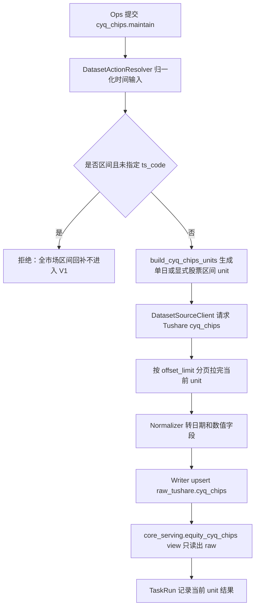

# Tushare 每日筹码分布（`cyq_chips`）数据集接入方案（评审稿）

## 1. 目标与边界

- 目标：新增 `cyq_chips` 数据集，打通 Tushare 源站拉取、生产库 `raw_tushare` 落库、`core_serving` view 服务层、Ops 手动任务与数据状态 freshness 观测。
- 本期边界：只做 Tushare 单源接入，不引入多源融合，不做 Lake 导出，不新增用户侧功能。
- 本期不加入 `daily_market_close_maintenance` 工作流。
- 本期不支持默认股票池的全市场区间回补；默认股票池只支持单日维护。
- 架构主线：数据集事实进入 `DatasetDefinition`，执行计划进入 `DatasetExecutionPlan`，任务观测走 TaskRun 主链。

## 2. 依据与现有代码审计

| 类型 | 位置 | 结论 |
| --- | --- | --- |
| 根规则 | `AGENTS.md` | 新增数据集必须实测源接口，拆清时间输入、unit、freshness 三层语义。 |
| 数据集模板 | `docs/templates/dataset-development-template.md` | 本文按模板补齐源端行为、字段对账、消费者审计和验收门禁。 |
| 源站文档 | `docs/sources/tushare/股票数据/特色数据/0294_每日筹码分布.md` | `api_name=cyq_chips`，`ts_code` 必填，支持 `trade_date/start_date/end_date/limit/offset`。 |
| 同类数据集 | `src/foundation/datasets/definitions/market_equity.py` 中 `cyq_perf` | `cyq_perf` 可按 `trade_date` 拉全市场；`cyq_chips` 必须带 `ts_code`，不能照搬。 |
| 请求构造 | `src/foundation/ingestion/request_builders.py` | 需要新增专用 request builder，把 unit 中的 `ts_code` 和日期锚点转成源端参数。 |
| unit 规划 | `src/foundation/ingestion/unit_planner.py` | generic planner 目前只支持 `none/no_pool`；股票池展开需要新增清晰的 custom unit builder。 |
| 分页 | `src/foundation/ingestion/source_client.py` | 现有 `offset_limit` 会自动追加 `limit/offset` 并循环到当页不足 `page_limit`。 |
| 展示分组 | `src/ops/catalog/dataset_catalog_views.py` | `cyq_perf` 在 `technical_indicators`，`cyq_chips` 建议同组展示。 |
| freshness | `src/foundation/datasets/freshness_policies.py` | 需要新增 `cyq_chips -> continuous_open_day`。 |

## 3. 源站接口事实

### 3.1 源站说明

| 项 | 内容 |
| --- | --- |
| API | `cyq_chips` |
| 中文名 | 每日筹码分布 |
| 数据含义 | A 股每日各成本价格档位对应的筹码占比 |
| 数据起点 | 2018 年开始 |
| 更新时间 | 每天 18:00~19:00 左右更新当日数据 |
| 调用限制 | 单次最大 2000 条；文档建议按股票代码和日期循环提取 |
| 权限与频率 | 5000 积分：每天 20000 次、每分钟 200 次；10000 积分：每天 200000 次；15000 积分不限总量 |

### 3.2 输入参数

| 参数名 | 必填 | 类型 | 含义 | 是否暴露给运营 | 本期使用方式 |
| --- | --- | --- | --- | --- | --- |
| `ts_code` | 是 | str | 股票代码 | 是，可选过滤 | 单日默认维护时由系统按股票池展开；手动指定时只维护指定股票。 |
| `trade_date` | 否 | str | 交易日期，`YYYYMMDD` | 是 | 单日维护由 resolver 生成日期锚点后传给 request builder。 |
| `start_date` | 否 | str | 开始日期 | 是 | 只允许和显式 `ts_code` 一起做局部区间维护；默认股票池不支持区间。 |
| `end_date` | 否 | str | 结束日期 | 是 | 同上。 |
| `limit` | 否 | int | 单页返回数量 | 否 | 内部分页参数，由 `DatasetSourceClient` 追加。 |
| `offset` | 否 | int | 分页偏移 | 否 | 内部分页参数，由 `DatasetSourceClient` 追加。 |

### 3.3 输出字段

| 字段名 | 类型 | 含义 | raw | serving | 清洗规则 |
| --- | --- | --- | --- | --- | --- |
| `ts_code` | str | 股票代码 | 是 | 是 | 去空格、转大写；主键字段。 |
| `trade_date` | str | 交易日期 | 是 | 是 | 转为 `date`；主键字段。 |
| `price` | float | 成本价格 | 是 | 是 | 转 `Numeric(18, 4)`；主键字段。 |
| `percent` | float | 价格占比，单位 `%` | 是 | 是 | 转 `Numeric(10, 4)`；业务值字段。 |

身份键必须是 `(ts_code, trade_date, price)`。同一只股票同一天会返回多个价格档位，如果只用 `(ts_code, trade_date)` 会把有效行互相覆盖或冲突。

## 4. TushareMcp 实测记录

> 说明：本次使用 `tushareMcp.cyq_chips` 做了真实请求。MCP 工具 schema 要求 `ts_code` 必填，且未暴露 `limit/offset`；这与本地源文档“支持 `limit/offset`”存在适配层差异。编码前必须用项目真实 connector 再补一条分页 smoke，确认 `DatasetSourceClient` 追加的 `limit/offset` 能被源端接受。

| 请求形态 | 实际请求参数 | 返回情况 | 是否分页 | 样本字段 | 结论 |
| --- | --- | --- | --- | --- | --- |
| 不传业务参数 | MCP schema 不允许省略 `ts_code`；源文档也标记 `ts_code` 必填 | 无法发起 | 不适用 | 不适用 | 不支持按日期直接拉全市场。 |
| 只传对象过滤 | `ts_code=600000.SH`，显式字段 `ts_code/trade_date/price/percent` | 返回多日筹码分布，输出过长被 MCP 截断，可见从最近交易日向历史日期返回 | 源文档说单次最大 2000，MCP 不暴露分页参数 | `600000.SH / 20260515 / price / percent` | 支持按股票代码取历史，但大范围必须分页，不能作为全市场默认方案。 |
| 只传时间点 | `ts_code=600000.SH, trade_date=20260424` | 返回 139 行价格档位 | 单日单股未触发分页 | `ts_code, trade_date, price, percent` | 默认股票池单日维护只能走这种形态，单日请求次数约等于上市股票数。 |
| 传时间区间 | `ts_code=600000.SH, start_date=20260420, end_date=20260424` | 返回多个交易日的价格档位，输出较长 | 可能需要分页 | `ts_code, trade_date, price, percent` | 区间能力只用于显式 `ts_code` 的局部维护，不用于默认股票池全市场回补。 |
| 分页第二页 | MCP schema 未暴露 `limit/offset` | 未能通过 MCP 验证 | 待编码前 smoke | `limit/offset` | 文档支持分页；实现必须保留 `offset_limit` 并补 connector 测试。 |

## 5. 请求量测算与同步策略修正

前一版“默认股票池 × 交易日”的区间设计不可接受，必须收回。按当前股票规模粗算：

| 场景 | 请求量级 | 按 200 次/分钟理论耗时 | 结论 |
| --- | --- | --- | --- |
| 默认股票池单日 | 约 5500 次请求 | 约 27.5 分钟，不含网络、写库和重试 | 可以作为手动单日能力，但不进入每日工作流。 |
| 默认股票池一年，按“股票 × 交易日” | 约 5500 × 240 = 132 万次请求 | 约 110 小时 | 不可接受，禁止作为实现方案。 |
| 默认股票池一年，按“股票 × 年区间 + 分页” | 约 5500 × 17 = 9.35 万次请求，按 139 行/日、2000 行/页粗估 | 约 7.8 小时 | 比逐日好很多，但仍然太重，不作为 V1 默认能力。 |
| 显式单只股票一年区间 | 约 17 次请求，按样本粗估 | 数分钟内 | 可以接受，适合作为局部维护能力。 |

因此 V1 同步策略改为：

1. 默认不填 `ts_code` 时，只支持单日维护，系统按当前上市股票池 `list_status='L'` 展开股票。
2. 填写显式 `ts_code` 时，支持单日和区间；区间直接传 `start_date/end_date` 给源端并分页，不再按交易日拆开。
3. 不支持“不填 `ts_code` + 区间”的全市场回补；resolver/planner 必须直接拒绝，并提示“全市场区间回补请求量过大，请指定股票代码或改为单日维护”。
4. 如果未来确实要补全历史，应单独设计离线补数方案，不把它混进运营手动任务主链。

## 6. 三层语义拆分

| 语义层 | 本数据集答案 |
| --- | --- |
| 时间输入语义 | 默认维护只接受单日；显式 `ts_code` 局部维护支持单日或区间。 |
| 执行 / unit 语义 | 默认单日：按当前上市股票池展开，unit 是 `一个股票 + 一个交易日`。显式 `ts_code` 区间：unit 是 `一个股票 + 一个日期区间`，源端请求参数为 `ts_code + start_date + end_date`，内部按分页拉完。 |
| freshness / audit 语义 | 本期只接 freshness，采用 `continuous_open_day` 判断最近业务日期；不接日期完整性审计，也不做日期-股票矩阵审计。 |

## 7. DatasetDefinition 设计

### 7.1 基本事实

| 项 | 建议值 |
| --- | --- |
| `dataset_key` | `cyq_chips` |
| `display_name` | `每日筹码分布` |
| `domain_key` | `equity_market` |
| `domain_display_name` | `股票行情` |
| `source_key_default` | `tushare` |
| `api_name` | `cyq_chips` |
| `source_doc_id` | `tushare.cyq_chips` |
| `source_fields` | `("ts_code", "trade_date", "price", "percent")` |
| `request_builder_key` | `_cyq_chips_params` |
| `freshness_policy` | `continuous_open_day` |
| Ops 分组 | `technical_indicators / 技术指标`，排序建议放在 `cyq_perf` 之后 |

### 7.2 日期模型

```python
date_model = {
    "date_axis": "trade_open_day",
    "bucket_rule": "every_open_day",
    "window_mode": "point_or_range",
    "input_shape": "trade_date_or_start_end",
    "observed_field": "trade_date",
    "audit_applicable": False,
    "not_applicable_reason": None,
}
```

说明：`audit_applicable=False` 是本期只接 freshness 的明确口径，不代表数据集没有交易日语义。

### 7.3 输入模型

- 时间字段：`trade_date`、`start_date`、`end_date`，沿用股票交易日类数据集的标准控件。
- 过滤字段：`ts_code`，可选。
- 默认不填 `ts_code` 时，只允许单日。
- 填写 `ts_code` 时，允许单日或区间。
- 不暴露 `limit/offset`。

### 7.4 规划模型

建议新增专用 unit builder：`build_cyq_chips_units`。

原因：

1. generic planner 目前不会读取股票池。
2. `cyq_chips` 的默认全市场维护必须按股票池扇出。
3. `cyq_chips` 的区间能力只允许显式 `ts_code`，需要在 planner 中封死默认股票池区间。
4. 直接复用 `stk_mins` 的 custom builder 不合适，分钟线有频率和时间窗口概念，而 `cyq_chips` 是交易日点状数据。

建议的规划事实：

```python
planning = {
    "universe_policy": "pool",
    "universe": {
        "request_field": "ts_code",
        "override_fields": ("ts_code",),
        "sources": (
            {"type": "core_security_active_equities", "resource": "tushare_preferred"},
        ),
    },
    "pagination_policy": "offset_limit",
    "page_limit": 2000,
    "unit_builder_key": "build_cyq_chips_units",
}
```

股票池读取口径已确认：从 `core_serving.security_serving` 读取 Tushare 当前上市股票，只取 `list_status='L'`。

planner 规则：

1. `mode=point` 且没有显式 `ts_code`：读取 `list_status='L'` 股票池，为每只股票生成一个 `ts_code + trade_date` unit。
2. `mode=point` 且有显式 `ts_code`：只为指定股票生成 `ts_code + trade_date` unit。
3. `mode=range` 且有显式 `ts_code`：为每只指定股票生成一个 `ts_code + start_date + end_date` unit。
4. `mode=range` 且没有显式 `ts_code`：直接失败，不生成 unit。

### 7.5 请求构造

新增 `_cyq_chips_params(request, anchor_date, enum_values)`：

1. `enum_values["ts_code"]` 必须存在，否则失败。
2. 单日 unit 输出：

```python
{
    "ts_code": "600000.SH",
    "trade_date": "20260424",
}
```

3. 区间 unit 输出：

```python
{
    "ts_code": "600000.SH",
    "start_date": "20260420",
    "end_date": "20260424",
}
```

`limit/offset` 由 `DatasetSourceClient` 根据 `pagination_policy=offset_limit` 自动追加，不在 request builder 中手写。

## 8. 表结构设计

### 8.1 Raw 表

| 项 | 内容 |
| --- | --- |
| 表名 | `raw_tushare.cyq_chips` |
| 主键 | `(ts_code, trade_date, price)` |
| 字段 | `ts_code`, `trade_date`, `price`, `percent`, `api_name`, `fetched_at`, `raw_payload` |
| 索引 | `trade_date`；`ts_code, trade_date` |

### 8.2 Serving view

| 项 | 内容 |
| --- | --- |
| view 名 | `core_serving.equity_cyq_chips` |
| 来源 | `raw_tushare.cyq_chips` |
| 字段 | `ts_code`, `trade_date`, `price`, `percent` |
| 约束 | 普通 view，不复制数据，不建第二张物理 serving 表。 |

### 8.3 写入路径

- 使用现有 `raw_only_upsert`。
- `raw_dao_name=raw_cyq_chips`。
- `core_dao_name=raw_cyq_chips`，满足 writer 当前对 raw/core DAO 的存在性检查，实际只写 raw。
- `target_table=raw_tushare.cyq_chips`。
- `delivery_mode=raw_with_serving_view`。
- `layer_plan=raw->serving_view`。
- `serving_table=core_serving.equity_cyq_chips`。

## 9. 执行流程



关键约束：

1. 不允许默认股票池区间回补。
2. 显式 `ts_code` 的区间维护可以把 `start_date/end_date` 传给源端，并按分页拉取。
3. 默认股票池单日维护只能传 `ts_code + trade_date`。
4. 不新增 checkpoint/acquire 语义。
5. 状态写入失败不得影响 raw 业务数据提交。

## 10. Ops 与自动任务

### 10.1 手动任务

- 维护对象：`每日筹码分布`。
- 时间模式：单日 / 区间。
- 可选过滤：证券代码。
- 不填证券代码时，只允许单日。
- 填写证券代码时，允许区间。
- 页面不展示分页参数。
- 任务详情进度建议显示：当前股票代码、交易日、获取行数、写入行数、拒绝行数。

### 10.2 自动任务

本期不加入 `daily_market_close_maintenance` 工作流。

原因：

1. 源站约 18:00~19:00 更新，当天盘后工作流可承载。
2. 默认全市场维护约等于“股票数 × 交易日数”的请求量；单日大约 5000 多次请求，会明显占用 Tushare 当日额度。
3. 当前阶段先保证手动单日、小范围显式股票区间链路正确，不把慢任务塞进每日工作流。

## 11. 测试与验收计划

### 11.1 单元测试

| 测试 | 目的 |
| --- | --- |
| definition registry | `cyq_chips` 定义完整，freshness policy 已登记，Ops catalog 已配置。 |
| request builder | 单日生成 `ts_code + trade_date`；区间生成 `ts_code + start_date + end_date`。 |
| unit planner point | 不填 `ts_code` 时，point 只展开 `list_status='L'` 股票池。 |
| unit planner range | 不填 `ts_code` 的 range 必须失败；显式 `ts_code` 的 range 只按股票生成区间 unit。 |
| source client pagination | `offset_limit/page_limit=2000` 能追加 `limit/offset` 并停止在不足页。 |
| normalizer | `trade_date` 转日期，`price/percent` 转 Decimal。 |
| writer | 只写 raw，主键是 `(ts_code, trade_date, price)`，重复运行可幂等覆盖。 |
| serving view | `core_serving.equity_cyq_chips` 从 raw 直出，不存在第二张物理 serving 表。 |

### 11.2 真实最小验收

编码完成后必须做最小真实同步：

1. 单股单日：`600000.SH + 2026-04-24`，预期约 139 行。
2. 单股区间：`600000.SH + 2026-04-20 ~ 2026-04-24`，确认多交易日可落库。
3. 小股票池单日：用测试池 2~3 只股票跑一个交易日，确认 unit、TaskRun、数据源卡片、freshness 一致。
4. 不填 `ts_code` 的区间请求必须失败，不能进入长任务。

验收必须记录：源端 fetched 行数、normalized 行数、raw written 行数、rejected 行数、reject reason code、raw 表实际行数、serving view 查询行数。

## 12. 主要风险

| 风险 | 影响 | 处理 |
| --- | --- | --- |
| 全市场单日请求量高 | 挤占 Tushare 当日额度 | 本期不加入每日工作流；默认股票池只支持单日手动维护。 |
| 全市场区间回补请求量极大 | 一年可能达到百万级或十万级请求 | V1 直接禁止默认股票池区间维护。 |
| 股票池口径不清 | 漏拉退市历史或拉取过多 | 已确认只取当前上市股票 `list_status='L'`。 |
| MCP 未暴露分页参数 | 分页真实行为需再确认 | 编码前用项目真实 connector 做分页 smoke。 |
| 完整性审计只看日期 | 某日部分股票缺失时可能被误判为完整 | 本期不接完整性审计，只接 freshness。 |

## 13. 里程碑

| 里程碑 | 内容 |
| --- | --- |
| M1 | 补分页 smoke；确认不填 `ts_code` 的区间请求 fail fast。 |
| M2 | 新增 raw ORM、DAO、Alembic 迁移与 `core_serving.equity_cyq_chips` view；补模型发现测试。 |
| M3 | 新增 `DatasetDefinition`、freshness policy、Ops catalog 配置；`audit_applicable=False`。 |
| M4 | 新增 request builder 与 `build_cyq_chips_units`；补 resolver/planner 测试。 |
| M5 | 补 normalizer/writer/source pagination/view 测试。 |
| M6 | 接入手动任务；不接入 `daily_market_close_maintenance`。 |
| M7 | 做最小真实同步验收，记录 fetched/normalized/written/rejected/表行数。 |
| M8 | 更新数据集接入盘点、Ops 工作流文档和 README。 |

## 14. 已拍板结论

| 编号 | 结论 |
| --- | --- |
| D1 | 默认股票池只取当前上市股票 `list_status='L'`。 |
| D2 | 首期不加入 `daily_market_close_maintenance`。 |
| D3 | 历史回补问题不再作为 V1 可选项；默认股票池区间维护直接禁止。显式 `ts_code` 的局部区间维护保留。 |
| D4 | 一期只接 freshness，不接日期完整性审计和日期-股票矩阵审计。 |
| D5 | 只写 raw 物理表，`core_serving.equity_cyq_chips` 作为普通 view 从 raw 直出。 |
