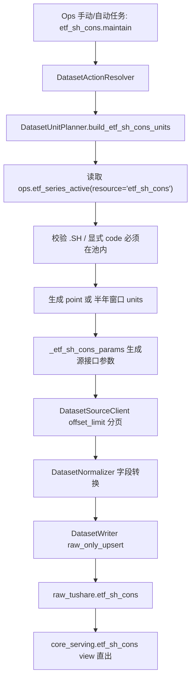

# ETF 申赎清单（`etf_sh_cons`）低层设计 LLD v1

状态：已按业务口径拍板，待开发  
对应方案：[ETF 申赎清单数据集开发说明](/Users/congming/github/goldenshare/docs/datasets/etf-sh-cons-dataset-development.md)  
最后更新：2026-06-19

## 1. 结论

当前没有新的业务拍板项。

本 LLD 固化以下代码层实现：

- `etf_sh_cons` 新增为 DatasetDefinition 主线数据集。
- ETF code 只来自 `ops.etf_series_active(resource='etf_sh_cons')`。
- 池内和显式输入都只允许 `.SH` ETF code。
- 单日 unit 请求 `trade_date + ts_code`。
- 区间 unit 请求 `ts_code + 自然半年窗口 start_date/end_date`。
- source client 继续统一追加 `limit/offset`，不把分页参数暴露给 Ops。
- writer 只写 `raw_tushare.etf_sh_cons`。
- `core_serving.etf_sh_cons` 是普通 view，字段按 raw 直出，不做派生计算。
- 首期不加入 `daily_market_close_maintenance` 工作流。

## 2. 开发前审计记录

本轮 LLD 已审计：

| 范围 | 代码 / 文档 | 结论 |
| --- | --- | --- |
| 仓库规则 | `AGENTS.md`、`src/AGENTS.md`、`src/foundation/AGENTS.md`、`src/ops/AGENTS.md` | 新实现必须走 `foundation / ops` 主线，不回流 legacy。 |
| 数据集文档规则 | `docs/AGENTS.md`、`docs/datasets/AGENTS.md` | 新数据集文档放 `docs/datasets/`，源站事实补到 `docs/sources/tushare/**`。 |
| Definition 样板 | `src/foundation/datasets/definitions/market_fund.py`、`market_equity.py` | ETF/基金行情定义在 `market_fund.py`；raw-only/view 可参考 `cyq_chips`。 |
| Date model | `src/foundation/datasets/models.py` | 支持 `trade_open_day + every_open_day + point_or_range`。 |
| Freshness | `src/foundation/datasets/freshness_policies.py`、`src/ops/dataset_definition_projection.py` | freshness policy 必须集中登记；target table 走 Definition 投影。 |
| Planner | `src/foundation/ingestion/unit_planner.py` | 需要新增 custom builder，generic 不支持本轮的 active 池门禁和半年窗口。 |
| Request builder | `src/foundation/ingestion/request_builders.py` | 新增 `_etf_sh_cons_params`，只格式化 planner 已归一化的 unit 值。 |
| Source client | `src/foundation/ingestion/source_client.py` | 已有 `offset_limit` 分页，会自动追加 `limit/offset`。 |
| Writer | `src/foundation/ingestion/writer.py` | 已有 `raw_only_upsert`，无需新增 writer 分支。 |
| DAO | `src/foundation/dao/factory.py` | 需要新增 `RawEtfShCons` import 和 `raw_etf_sh_cons` GenericDAO。 |
| ETF 激活池 | `src/foundation/dao/etf_series_active_dao.py`、`src/ops/services/etf_series_active_seed_service.py` | 需要允许 `resource='etf_sh_cons'`；seed service 当前只允许 `fund_daily / etf_rt_daily`。 |
| Ops 展示目录 | `src/ops/catalog/dataset_catalog_views.py` | `etf_fund` 分组已存在；新增 `DatasetCatalogItem("etf_sh_cons", "etf_fund", ...)`。 |
| 工作流 | `src/ops/action_catalog.py` | 不加入 `daily_market_close_maintenance`。 |
| 测试样板 | `tests/test_dataset_definition_registry.py`、`tests/test_dataset_action_resolver.py`、`tests/test_dataset_writer_cyq_chips.py` | 可覆盖 Definition、planner、request builder、raw-only writer。 |

CodeGraph 使用范围：

- `codegraph_explore`：覆盖 `market_fund`、`unit_planner`、`request_builders`、`writer`、`dataset_catalog_views`、`freshness_policies`、`etf_series_active`。
- 结论：影响面集中在 DatasetDefinition、ingestion planner/request builder、raw model/DAO、Ops catalog、ETF active seed 白名单和测试，不需要跨子系统重构。

## 3. 源接口契约

已实测事实：

| 事实 | 结论 |
| --- | --- |
| API | `etf_sh_cons` |
| 字段 | `trade_date, ts_code, con_code, con_name, qty, sub_flag, cpr, rdr, sca, exchange` |
| 单日单 code | `trade_date + ts_code` 可返回数据。 |
| 区间单 code | `ts_code + start_date/end_date` 可返回区间数据。 |
| 单日全市场 | 高 offset 深分页会源站报错，不作为正式主链。 |
| 多 code | 逗号拼接 `ts_code` 返回 0 行，不支持。 |
| 通配符 | `ts_code` 通配符返回 0 行，不支持。 |
| 单页上限 | 按 `page_limit=3000` 处理。 |
| 限速 | 使用现有 Tushare 共享限速器，不新增配置。 |

源站事实文档门禁：

- 当前本地 `docs/sources/tushare/**` 尚无 `etf_sh_cons` 文档。
- 开发 M0 必须补齐源文档，并同步 `docs/sources/tushare/docs_index.csv`。
- 若源文档与实测行为冲突，以“当前代码 + 实测行为”为实现依据，并把差异写入数据集开发文档。

## 4. 总体链路



事务边界：

- 每个 unit 一个业务写入事务。
- 一个 unit 是“一个 ETF code + 一个交易日”或“一个 ETF code + 一个自然半年窗口”。
- unit 内分页全部拉取并 normalize 后，再进入 writer upsert。
- Ops / TaskRun / freshness / snapshot 状态写入失败，不得影响 raw 业务数据写入事务。

## 5. Schema 与 ORM

## 5.1 Alembic

新增迁移文件：

- `alembic/versions/<next_revision>_add_etf_sh_cons_dataset.py`

开发前必须先执行迁移 head 检查，`down_revision` 只能接真实 head。当前审计时最新文件为 `20260618_000117_add_etf_series_active.py`，但实施时不得凭文件名猜，必须以实际 `alembic heads` 为准。

升级逻辑：

```sql
CREATE SCHEMA IF NOT EXISTS raw_tushare;
CREATE SCHEMA IF NOT EXISTS core_serving;

CREATE TABLE IF NOT EXISTS raw_tushare.etf_sh_cons (
    trade_date DATE NOT NULL,
    ts_code VARCHAR(16) NOT NULL,
    con_code VARCHAR(16) NOT NULL,
    con_name VARCHAR(128),
    qty NUMERIC(24, 6),
    sub_flag VARCHAR(16),
    cpr VARCHAR(32),
    rdr VARCHAR(32),
    sca VARCHAR(32),
    exchange VARCHAR(16),
    api_name VARCHAR(32) NOT NULL DEFAULT 'etf_sh_cons',
    fetched_at TIMESTAMPTZ NOT NULL DEFAULT now(),
    raw_payload TEXT,
    CONSTRAINT pk_raw_tushare_etf_sh_cons PRIMARY KEY (trade_date, ts_code, con_code)
);

CREATE INDEX IF NOT EXISTS idx_raw_tushare_etf_sh_cons_trade_date
ON raw_tushare.etf_sh_cons (trade_date);

CREATE INDEX IF NOT EXISTS idx_raw_tushare_etf_sh_cons_ts_code_trade_date
ON raw_tushare.etf_sh_cons (ts_code, trade_date);

CREATE INDEX IF NOT EXISTS idx_raw_tushare_etf_sh_cons_con_code
ON raw_tushare.etf_sh_cons (con_code);

CREATE OR REPLACE VIEW core_serving.etf_sh_cons AS
SELECT
    trade_date,
    ts_code,
    con_code,
    con_name,
    qty,
    sub_flag,
    cpr,
    rdr,
    sca,
    exchange,
    api_name,
    fetched_at,
    raw_payload
FROM raw_tushare.etf_sh_cons;
```

降级逻辑：

```sql
DROP VIEW IF EXISTS core_serving.etf_sh_cons;
DROP TABLE IF EXISTS raw_tushare.etf_sh_cons;
```

说明：

- `cpr/rdr/sca` 按字符串保留，因为实测存在 `-`。
- `qty` 是唯一数值字段，进入 Decimal 转换。
- view 字段与 raw 字段一致，不做 rename、不做派生、不过滤列。

## 5.2 ORM

新增文件：

- `src/foundation/models/raw/raw_etf_sh_cons.py`

类名：

- `RawEtfShCons`

字段与迁移一致，主键顺序必须与迁移一致：

- `trade_date`
- `ts_code`
- `con_code`

新增测试：

- `tests/test_extended_models.py::test_etf_sh_cons_raw_model_matches_expected_keys`
- `tests/test_foundation_table_model_registry.py` 增加 `raw_tushare.etf_sh_cons -> RawEtfShCons`

不新增 `core_serving.etf_sh_cons` ORM。原因：

- V1 freshness 和 snapshot 读取 `definition.storage.target_table`。
- 本数据集 `target_table` 设计为 `raw_tushare.etf_sh_cons`。
- serving view 只是查询出口，不作为 freshness 观测表。

## 5.3 DAOFactory

修改文件：

- `src/foundation/dao/factory.py`

改动：

- import `RawEtfShCons`
- 在 `DAOFactory.__init__` 中新增：

```python
self.raw_etf_sh_cons = GenericDAO(session, RawEtfShCons)
```

不新增专用 DAO。原因：

- 本数据集只需要标准 bulk upsert。
- 无跨表业务编排。
- 特殊对象池读取走已有 `EtfSeriesActiveDAO`。

## 6. DatasetDefinition

修改文件：

- `src/foundation/datasets/definitions/market_fund.py`

新增 `DATASET_ROWS` 条目。

关键字段：

```python
"identity": {
    "dataset_key": "etf_sh_cons",
    "display_name": "ETF 申赎清单",
    "description": "维护上交所 ETF 申赎清单数据。",
    "aliases": (),
},
"domain": {
    "domain_key": "index_fund",
    "domain_display_name": "指数 / ETF",
},
"source": {
    "source_key_default": "tushare",
    "source_keys": ("tushare",),
    "adapter_key": "tushare",
    "api_name": "etf_sh_cons",
    "source_fields": (
        "trade_date",
        "ts_code",
        "con_code",
        "con_name",
        "qty",
        "sub_flag",
        "cpr",
        "rdr",
        "sca",
        "exchange",
    ),
    "source_doc_id": "tushare.etf_sh_cons",
    "request_builder_key": "_etf_sh_cons_params",
    "base_params": {},
},
"date_model": {
    "date_axis": "trade_open_day",
    "bucket_rule": "every_open_day",
    "window_mode": "point_or_range",
    "input_shape": "trade_date_or_start_end",
    "observed_field": "trade_date",
    "audit_applicable": False,
    "not_applicable_reason": "ETF 申赎清单 V1 只接 freshness，不接日期-ETF 完整性审计。",
},
"completeness": {
    "scope": "not_applicable",
},
"storage": {
    "raw_dao_name": "raw_etf_sh_cons",
    "core_dao_name": "raw_etf_sh_cons",
    "target_table": "raw_tushare.etf_sh_cons",
    "delivery_mode": "raw_with_serving_view",
    "layer_plan": "raw->serving_view",
    "std_table": None,
    "serving_table": "core_serving.etf_sh_cons",
    "raw_table": "raw_tushare.etf_sh_cons",
    "conflict_columns": ("trade_date", "ts_code", "con_code"),
    "write_path": "raw_only_upsert",
},
"planning": {
    "universe_policy": "pool",
    "universe": {
        "request_field": "ts_code",
        "override_fields": ("ts_code",),
        "sources": ({"type": "ops_etf_series_active", "resource": "etf_sh_cons"},),
    },
    "pagination_policy": "offset_limit",
    "page_limit": 3000,
    "unit_builder_key": "build_etf_sh_cons_units",
},
"normalization": {
    "date_fields": ("trade_date",),
    "decimal_fields": ("qty",),
    "required_fields": ("trade_date", "ts_code", "con_code"),
    "row_transform_name": "_etf_sh_cons_row_transform",
},
"capabilities": {
    "actions": ({
        "action": "maintain",
        "manual_enabled": True,
        "schedule_enabled": True,
        "retry_enabled": True,
        "supported_time_modes": ("point", "range"),
    },),
},
"observability": {
    "progress_label": "etf_sh_cons",
    "observed_field": "trade_date",
    "audit_applicable": False,
},
"quality": {
    "reject_policy": "record_rejections",
    "required_fields": ("trade_date", "ts_code", "con_code"),
},
"transaction": {
    "commit_policy": "unit",
    "idempotent_write_required": True,
    "write_volume_assessment": (
        "单个事务限定为一个 ETF code + 单日/自然半年窗口 unit；"
        "区间维护不拆成 ETF code × 每个交易日，源端按 offset_limit 分页拉完后一次提交。"
    ),
},
```

说明：

- `target_table` 使用 raw 表，参考 `cyq_chips` raw-only/view 模式。
- `serving_table` 保留 view 名，用于数据卡片和文档说明。
- V1 不接日期完整性审计，避免在本轮引入“日期 × ETF 激活池”矩阵审计需求。

## 7. Freshness

修改文件：

- `src/foundation/datasets/freshness_policies.py`

新增：

```python
"etf_sh_cons": CONTINUOUS_OPEN_DAY,
```

原因：

- 该数据集以交易日 `trade_date` 观测最新业务日期。
- freshness 只判断最近业务日期是否跟上预期交易日。
- 不做 date-subject completeness。

测试：

- `tests/test_dataset_definition_registry.py::test_dataset_definition_registry_covers_freshness_policy_mapping`
- 新增 `test_dataset_definition_projects_etf_sh_cons_raw_view_facts`

## 8. Unit Planner

修改文件：

- `src/foundation/ingestion/unit_planner.py`

新增常量：

```python
ETF_SH_CONS_RESOURCE = "etf_sh_cons"
```

新增 helper：

```python
def _split_calendar_half_year_windows(start_date: date, end_date: date) -> list[tuple[date, date]]:
    ...
```

规则：

- 自然上半年：`01-01 ~ 06-30`
- 自然下半年：`07-01 ~ 12-31`
- 首尾按用户输入区间裁剪。

新增对象池解析：

```python
def _resolve_etf_sh_cons_targets(planner, request, definition) -> list[str]:
    ...
```

规则：

1. Definition 必须是 `universe_policy="pool"`。
2. `universe.request_field` 必须是 `ts_code`。
3. `universe.override_fields` 必须是 `("ts_code",)`。
4. `universe.sources` 必须是 `(("ops_etf_series_active", "etf_sh_cons"),)`。
5. 读取 `planner.dao.etf_series_active.list_active_codes("etf_sh_cons")`。
6. 池为空：抛 `universe_empty`，提示先配置 `etf_sh_cons` ETF 激活池。
7. 池内任意 code 不是 `.SH`：抛 `invalid_enum`，提示移除非 `.SH`。
8. 显式 `ts_code`：
   - 只支持单个 code。
   - 必须 `.SH`。
   - 必须在池内。
   - 不允许逗号多 code 绕过 UI 单值控制。
9. 未显式 `ts_code`：返回池内全部 `.SH` code，按字典序排序。

新增 builder：

```python
def _build_etf_sh_cons_units(planner, request, definition) -> list[PlanUnitSnapshot]:
    ...
```

单日：

- `request.run_profile == "point_incremental"`
- 必须有 `request.trade_date`
- windows = `[(trade_date, trade_date)]`
- 每个 ETF code 一个 unit
- `unit.trade_date = trade_date`
- `request_params = {"ts_code": code, "trade_date": "YYYYMMDD"}`

区间：

- `request.run_profile == "range_rebuild"`
- 必须有 `start_date/end_date`
- windows = `_split_calendar_half_year_windows(start_date, end_date)`
- 每个 ETF code + 半年窗口一个 unit
- `unit.trade_date = None`
- `request_params = {"ts_code": code, "start_date": "YYYYMMDD", "end_date": "YYYYMMDD"}`

progress context：

```python
{"unit": "etf", "ts_code": code, "trade_date": "..."}
```

或：

```python
{"unit": "etf", "ts_code": code, "start_date": "...", "end_date": "..."}
```

注册：

```python
_CUSTOM_UNIT_BUILDERS["build_etf_sh_cons_units"] = _build_etf_sh_cons_units
```

禁止：

- 不使用 generic builder。
- 不展开交易日序列。
- 不把 source 参数拼接逻辑放到 Ops 或前端。
- 不做源端失败后的自动季度降级；若半年窗口真实失败，任务暴露 code + window 后再评审。

## 9. Request Builder

修改文件：

- `src/foundation/ingestion/request_builders.py`

新增：

```python
def _etf_sh_cons_params(request, anchor_date: date | None, enum_values: dict[str, Any]) -> dict[str, Any]:
    ts_code = str(enum_values.get("ts_code") or "").strip().upper()
    if not ts_code:
        raise ValueError("ETF 申赎清单缺少 ETF 代码")
    if request.run_profile == "point_incremental":
        target_date = anchor_date or request.trade_date
        if target_date is None:
            raise ValueError("ETF 申赎清单单日维护缺少交易日期")
        return {"ts_code": ts_code, "trade_date": target_date.strftime("%Y%m%d")}
    if request.run_profile == "range_rebuild":
        start_date = enum_values.get("start_date", request.start_date)
        end_date = enum_values.get("end_date", request.end_date)
        if start_date is None or end_date is None:
            raise ValueError("ETF 申赎清单区间维护必须同时填写开始日期和结束日期")
        return {
            "ts_code": ts_code,
            "start_date": _format_yyyymmdd(start_date),
            "end_date": _format_yyyymmdd(end_date),
        }
    raise ValueError(f"ETF 申赎清单不支持该运行模式：{request.run_profile}")
```

约束：

- 不设置 `limit/offset`。
- 不从 `request.params` 直接读取 `ts_code` 生成源参数；`ts_code` 必须来自 planner 的 `enum_values`。
- 不支持多 code 拼接。

## 10. Normalizer

修改文件：

- `src/foundation/ingestion/row_transforms.py`

新增：

```python
def _etf_sh_cons_row_transform(row: dict[str, Any]) -> dict[str, Any]:
    ...
```

规则：

- `ts_code`、`con_code`、`exchange`：转大写并去空白。
- `con_name`、`sub_flag`、`cpr`、`rdr`、`sca`：去首尾空白，空字符串转 `None`。
- `cpr/rdr/sca` 不做 Decimal 转换，`-` 原样保留。
- 不生成派生字段。

注册：

- 把 `_etf_sh_cons_row_transform` 加入 `__all__` 列表。

Definition 配置：

- `date_fields=("trade_date",)`
- `decimal_fields=("qty",)`
- `required_fields=("trade_date", "ts_code", "con_code")`

## 11. Writer

不修改 `src/foundation/ingestion/writer.py`。

原因：

- 已有 `raw_only_upsert` 分支。
- `raw_dao_name == core_dao_name == "raw_etf_sh_cons"`，满足 writer 当前 DAO 存在检查。
- 不写 serving 物理表。

测试必须证明：

- writer 只调用 `raw_etf_sh_cons.bulk_upsert(...)`。
- conflict columns 是 `["trade_date", "ts_code", "con_code"]`。
- `result.target_table == "raw_tushare.etf_sh_cons"`。

## 12. ETF 激活池

## 12.1 DAO

不修改 `src/foundation/dao/etf_series_active_dao.py`。

原因：

- `list_active_codes(resource)` 已支持任意 resource。
- 资源白名单不应放在 foundation DAO 中。

## 12.2 Seed Service

修改文件：

- `src/ops/services/etf_series_active_seed_service.py`

改动：

```python
ETF_SERIES_ACTIVE_RESOURCES = frozenset({"fund_daily", "etf_rt_daily", "etf_sh_cons"})
```

新增 resource-specific 校验：

- `resource == "etf_sh_cons"` 时，只允许 `.SH`。
- `resource == "etf_sh_cons"` 时，不做固定行数校验，只要求 seed CSV 非空、`ts_code` 唯一、日期字段合法。
- `fund_daily / etf_rt_daily` 维持现有口径，不在本轮改动。

注意：

- `ETF_SERIES_ACTIVE_SEED_EXPECTED_ROWS = 1395` 是现有 seed CSV 的固定行数。
- 该固定行数只适用于 `fund_daily / etf_rt_daily` 当前 seed 文件。
- `etf_sh_cons` 的 seed CSV 来自可用代码验证报告，但 ETF 激活池是运营可调整对象池，行数不能写死在代码里。
- 因此 seed service 必须把行数校验改成按 resource 判断：旧资源继续固定 `1395`，`etf_sh_cons` 不固定行数。

建议实现：

```python
ETF_SERIES_ACTIVE_SEED_EXPECTED_ROWS_BY_RESOURCE = {
    "fund_daily": 1395,
    "etf_rt_daily": 1395,
}
```

`etf_sh_cons` 不进入 `ETF_SERIES_ACTIVE_SEED_EXPECTED_ROWS_BY_RESOURCE`。  
如果后续 `etf_sh_cons` seed CSV 行数变化，不需要改代码；但必须保留对应的验证报告，证明这些 `.SH` ETF code 在源站可返回数据。

测试：

- `tests/test_cli_ops_seed_etf_series_active.py`：允许 `--resource etf_sh_cons`。
- `tests/test_etf_series_active_dao.py`：resource 隔离仍成立。
- 新增 seed service 单测：`etf_sh_cons` 下 `.SH` 通过，`.SZ/.OF` 失败。
- 新增 seed service 单测：`etf_sh_cons` 下非空、小批量 `.SH` seed 也能通过，证明不绑定固定 `803` 行。
- 保留旧资源单测：`fund_daily / etf_rt_daily` 行数不等于 `1395` 时仍失败，证明旧口径没有被放宽。

## 13. Ops 可见性

## 13.1 Catalog

修改文件：

- `src/ops/catalog/dataset_catalog_views.py`

新增：

```python
DatasetCatalogItem("etf_sh_cons", "etf_fund", 40)
```

排序建议：

- `etf_index`: 10
- `fund_adj`: 20
- `fund_daily`: 30
- `etf_sh_cons`: 40

## 13.2 Action Catalog / Workflow

不修改 `WORKFLOW_DEFINITION_REGISTRY`。

明确禁止：

- 不加入 `daily_market_close_maintenance`。
- 不加入 `reference_data_refresh`。

原因：

- 用户已拍板首期不加入每日工作流。
- 维护入口来自 DatasetDefinition 派生的 `etf_sh_cons.maintain`，不需要手写 workflow step。

## 14. 测试计划

## 14.1 Definition / Registry

文件：

- `tests/test_dataset_definition_registry.py`

新增测试：

- `test_dataset_definition_projects_etf_sh_cons_raw_view_facts`
- 同步更新现有 registry 总量断言：新增后数据集总数从 `73` 调整为 `74`。
- 同步更新 universe policy 计数断言：新增后 `pool` 从 `8` 调整为 `9`，`no_pool` 维持 `65`。
- 同步更新架构 guardrail 的 domain key 清单：`market_fund` 从 `fund_daily / fund_adj` 增加 `etf_sh_cons`。

断言：

- `api_name == "etf_sh_cons"`
- `source_fields` 完整。
- `request_builder_key == "_etf_sh_cons_params"`
- `date_model.input_shape == "trade_date_or_start_end"`
- `date_model.audit_applicable is False`
- `completeness.scope == "not_applicable"`
- `storage.raw_table == "raw_tushare.etf_sh_cons"`
- `storage.target_table == "raw_tushare.etf_sh_cons"`
- `storage.serving_table == "core_serving.etf_sh_cons"`
- `storage.write_path == "raw_only_upsert"`
- `storage.conflict_columns == ("trade_date", "ts_code", "con_code")`
- `planning.universe_policy == "pool"`
- `planning.unit_builder_key == "build_etf_sh_cons_units"`
- `planning.page_limit == 3000`
- `observability.freshness_policy == "continuous_open_day"`
- `normalization.decimal_fields == ("qty",)`
- `supported_time_modes == ("point", "range")`

## 14.2 Planner / Request Builder

文件：

- `tests/test_dataset_action_resolver.py`

新增用例：

1. 默认单日：
   - active pool 有 `510300.SH / 510500.SH`
   - 输入 `trade_date=2026-06-18`
   - 生成 2 个 unit
   - 每个 unit 参数是 `ts_code + trade_date`
2. 显式单 code：
   - 输入 `ts_code=510300.SH`
   - 只生成 1 个 unit
   - 必须调用 active pool 校验。
3. 显式 code 不在池内：
   - 抛 `invalid_enum`。
4. 池为空：
   - 抛 `universe_empty`。
5. 池内存在 `.SZ`：
   - 抛 `invalid_enum`，不静默跳过。
6. 区间半年窗口：
   - 输入 `2025-03-10 ~ 2026-05-29`
   - 单 code 生成 3 个 unit：
     - `2025-03-10 ~ 2025-06-30`
     - `2025-07-01 ~ 2025-12-31`
     - `2026-01-01 ~ 2026-05-29`
   - 不调用交易日历逐日展开。
7. 多 code 逗号输入：
   - 抛 `invalid_enum`，证明不支持逗号拼接。

## 14.3 Source Fields / Normalizer

文件：

- `tests/test_fields_constants.py`
- 新增或扩展 normalizer 测试

断言：

- connector payload fields 等于完整源字段列表。
- `trade_date` 转 `date`。
- `qty` 转 Decimal。
- `cpr/rdr/sca == "-"` 不被 reject。
- 缺 `trade_date/ts_code/con_code` 进入明确 reject reason。

## 14.4 Writer

新增文件：

- `tests/test_dataset_writer_etf_sh_cons.py`

参考：

- `tests/test_dataset_writer_cyq_chips.py`

断言 raw-only 写入。

## 14.5 Model / DAO / Migration

文件：

- `tests/test_extended_models.py`
- `tests/test_foundation_table_model_registry.py`
- `tests/test_extended_daos.py`

断言：

- raw model 主键、索引、字段类型。
- table model registry 包含 raw 表。
- DAOFactory 暴露 `raw_etf_sh_cons`。

## 14.6 Ops

文件：

- `tests/web/test_ops_manual_actions_api.py`
- `tests/web/test_ops_catalog_api.py`
- `tests/test_ops_action_catalog.py`
- `tests/test_cli_ops_seed_etf_series_active.py`

断言：

- `etf_sh_cons.maintain` 出现在手动任务。
- 过滤项只包含单值 `ts_code`。
- 数据源卡片分组是 `etf_fund`。
- `daily_market_close_maintenance` 不包含 `etf_sh_cons`。
- seed CLI 支持 `etf_sh_cons` resource。

## 15. 最小真实验收

开发完成后，至少执行以下真实验收：

| 场景 | 输入 | 验收 |
| --- | --- | --- |
| 单 ETF 单日 | `510300.SH + 20260618` | fetched、normalized、written、raw 表行数一致，reject=0。 |
| 单 ETF 半年 | `510300.SH + 2026-01-01 ~ 2026-06-18` | unit 只有 1 个半年窗口，分页正常，reject=0 或可解释。 |
| 小池单日 | 3 个 `.SH` ETF + 单日 | 每个 ETF 一个 unit，不走全市场深分页。 |
| 小池跨半年 | 3 个 `.SH` ETF + `2025-03-10 ~ 2026-05-29` | 每个 ETF 3 个窗口。 |
| 非 `.SH` 配置 | active 池插入 `.SZ` 样本 | planner 失败，不发源站请求。 |

真实验收记录必须写清：

- 源端 fetched 行数
- normalized 行数
- written 行数
- rejected 行数
- reject reason code
- raw 表行数
- view 表行数
- 关键请求参数样本

## 16. 回归命令

建议本轮开发完成后执行：

```bash
uv run ruff check \
  src/foundation/datasets/definitions/market_fund.py \
  src/foundation/datasets/freshness_policies.py \
  src/foundation/dao/factory.py \
  src/foundation/ingestion/unit_planner.py \
  src/foundation/ingestion/request_builders.py \
  src/foundation/ingestion/row_transforms.py \
  src/foundation/models/raw/raw_etf_sh_cons.py \
  src/ops/catalog/dataset_catalog_views.py \
  src/ops/services/etf_series_active_seed_service.py \
  tests

uv run pytest -q \
  tests/test_dataset_definition_registry.py \
  tests/test_dataset_action_resolver.py \
  tests/test_dataset_writer_etf_sh_cons.py \
  tests/test_extended_models.py \
  tests/test_foundation_table_model_registry.py \
  tests/test_extended_daos.py \
  tests/test_cli_ops_seed_etf_series_active.py \
  tests/web/test_ops_manual_actions_api.py

uv run pytest -q \
  tests/architecture/test_subsystem_dependency_matrix.py \
  tests/architecture/test_dataset_runtime_registry_guardrails.py \
  tests/architecture/test_dataset_codebook_guardrails.py

uv run goldenshare ingestion-lint-definitions
python3 scripts/check_docs_integrity.py
```

## 17. 不做事项

本轮明确不做：

- 不新增 serving 物理表。
- 不把 `etf_sh_cons` 加入每日收盘工作流。
- 不支持多 ETF code 拼接请求。
- 不支持 `ts_code` 通配符。
- 不做单日全市场深分页。
- 不做源端失败自动降级到季度/月度窗口。
- 不接日期-ETF 完整性审计。
- 不新增配置项。
- 不改 writer 主链。
- 不改 TaskRun / scheduler / frontend 页面逻辑。
- 不清表、不删表、不迁移已有业务数据。

## 18. 实施顺序

1. M0：补源文档和 docs index，确认 Alembic head。
2. M1：新增 migration、raw model、DAOFactory 注册。
3. M2：新增 DatasetDefinition、freshness policy、Ops catalog、seed service resource。
4. M3：新增 planner、request builder、row transform。
5. M4：补测试护栏。
6. M5：跑静态检查、单测、ingestion lint、docs check。
7. M6：最小真实验收。

如果 M0 发现源文档、实测行为、当前代码假设三者冲突，必须停止编码并回到方案文档说明差异。
