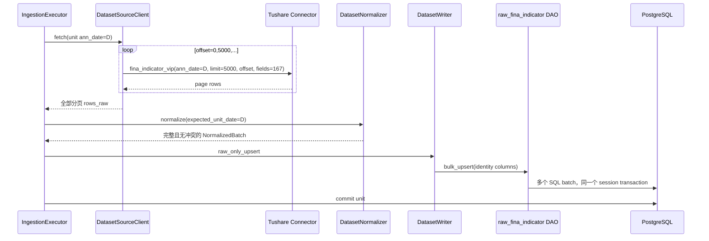

# A 股财务指标（`fina_indicator`）低层设计 v1

状态：**代码已实现，待运营部署与验收**
编写日期：2026-08-29
上位方案：[A 股财务指标数据集接入技术方案 v1](/Users/congming/github/goldenshare/docs/datasets/fina-indicator-dataset-development.md)
源接口：[Tushare 财务指标数据](/Users/congming/github/goldenshare/docs/sources/tushare/股票数据/财务数据/0079_财务指标数据.md)

## 1. 结论先行

本需求可以在现有 DatasetDefinition / DatasetExecutionPlan / TaskRun 主链内完成，不需要新建执行框架，也不需要修改共享数据集模型。

代码落地后的主链固定为：

```text
Ops 手动任务 / 普通自动任务
  -> TaskRun(fina_indicator.maintain)
  -> DatasetActionResolver
  -> 逐公告自然日 PlanUnitSnapshot
  -> fina_indicator_vip(ann_date=D, fields=167 fields, limit/offset)
  -> DatasetNormalizer
  -> raw_fina_indicator.bulk_upsert(...)
  -> 单 unit 业务事务 commit
  -> core_serving.equity_fina_indicator 普通 view 立即可见
```

严格边界：

1. 只新增 `fina_indicator` 自身契约、raw ORM/DAO、migration、Definition、request builder、row transform、Ops 目录/freshness 登记和测试。
2. 复用现有自然日 unit builder、offset/limit 分页、raw-only writer、GenericDAO、成功游标自动任务策略。
3. 不改 `DatasetDefinition` dataclass、不改通用 planner、不改 source client、不改通用 writer/DAO、不改前端组件或 API schema。
4. 不加入 workflow，不新增 probe，不接入日期完整性审计。
5. 本文只定义开发实现，不授权部署、数据库 migration、生产同步或数据清理。

## 2. 审计范围与事实依据

### 2.1 已审计代码链路

本 LLD 不是按文件名推测，而是逐链审计了以下当前实现：

| 层级 | 已审计入口 | 结论 |
| --- | --- | --- |
| Definition | `src/foundation/datasets/definitions/low_frequency.py`、`models.py`、`definitions/_builder.py` | 可用现有声明能力表达，不新增共享 contract 字段 |
| 计划解析 | `validator.py`、`resolver.py`、`unit_planner.py` | `build_natural_day_point_units` 已支持 point/range 按自然日逐日展开 |
| 请求构造 | `request_builders.py` | 新增数据集专属 `_fina_indicator_vip_params` 即可 |
| 源端分页 | `source_client.py` | 已统一追加 `limit/offset`，满页继续、短页结束，并向 connector 传完整 `source_fields` |
| 归一化 | `normalizer.py`、`row_transforms.py`、`observed_snapshot.py` | 可复用 Decimal/date 转换、完整字段哈希、同批重复/冲突门禁 |
| 写入 | `writer.py`、`dao/base_dao.py`、`dao/factory.py` | `raw_only_upsert + GenericDAO` 已满足同身份覆盖，不需要专用 writer |
| ORM 注册 | `models/raw/**`、`models/table_model_registry.py`、`models/all_models.py` | raw 模型会被动态注册；`all_models.py` 仍需显式导出保持既有导入契约 |
| Ops 投影 | `dataset_catalog_views.py`、`dataset_definition_projection.py`、manual/catalog/card queries | 新 Definition 自动进入通用页面；只需目录和 freshness policy 登记 |
| 自动任务 | `dataset_schedule_time_policy_resolver.py`、`task_run_service.py`、schedule tests | `since_last_success_day_range` 已完整支持，无需新策略 |
| Freshness | `freshness_policies.py`、`freshness_query_service.py`、snapshot service | `event_run_trace` 按 TaskRun 成功事实判断，不扫描连续公告日期 |
| 架构门禁 | runtime registry、Definition registry、table registry、Ops API tests | 需要把新 dataset key 加入固定集合并补投影断言 |

### 2.2 CodeGraph 影响面

开发前已从仓库根 CodeGraph 复核：

```text
DatasetDefinition
  -> DatasetCatalogViewResolver
  -> manual actions / catalog / dataset cards
  -> DatasetScheduleTimePolicyResolver / TaskRunService
  -> DatasetActionResolver / DatasetUnitPlanner
  -> DatasetSourceClient / DatasetNormalizer / DatasetWriter
  -> DatasetFreshnessProjection / snapshot rebuild
```

影响面结论：

1. `get_dataset_definition()` 是广泛共享入口，不能为了本数据集增加特殊分支。
2. `raw_with_serving_view` 的 `target_table` 必须是 raw 物理表；`serving_table` 才是 view。这样 writer 结果、freshness 扫描和 ORM registry 都指向同一 raw 事实。
3. 前端已经消费 catalog 中的时间字段、自动任务能力和交付模式，不应增加 `fina_indicator` 私有拼装逻辑。

### 2.3 源端硬事实

实现必须继续遵守上位方案记录的实测事实：

1. 使用 `fina_indicator_vip`，不用普通接口逐股票请求。
2. 一个 unit 只传一个 `ann_date`；禁止把 Ops 区间传给源端 `start_date/end_date`。
3. 显式请求全部 167 个字段；默认 108 字段不能作为契约。
4. `page_limit=5000`；源端单报告期已实测超过 5000 行，分页不可省略。
5. 周末可以有公告，range 不能经过交易日历过滤。

## 3. 代码结构与职责

### 3.1 新增文件

| 文件 | 新增内容 | 职责 |
| --- | --- | --- |
| `src/foundation/datasets/fina_indicator_contracts.py` | 字段、身份、Decimal 字段常量及 row transform 所需辅助函数 | 让 Definition、ORM 测试、normalizer 共用同一字段事实，避免复制 167 字段 |
| `src/foundation/models/raw/raw_fina_indicator.py` | `RawFinaIndicator` | raw 物理表 ORM |
| `alembic/versions/20260829_000160_add_fina_indicator_dataset.py` | HDD fail-closed DDL | 创建 raw 表、PK、二级索引和 serving view |
| `tests/test_fina_indicator_dataset.py` | 主契约、计划、分页、归一化、写入、Ops/迁移测试 | 本数据集集中护栏 |

实施时已读取唯一真实 Alembic head `20260829_000159`；新增 migration 为 `20260829_000160`，并以 `20260829_000159` 作为 `down_revision`。

### 3.2 修改文件

| 文件 | 精确改动 |
| --- | --- |
| `src/foundation/datasets/definitions/low_frequency.py` | 新增一条 `fina_indicator` Definition；字段从 contracts 导入 |
| `src/foundation/ingestion/request_builders.py` | 新增并导出 `_fina_indicator_vip_params` |
| `src/foundation/ingestion/row_transforms.py` | 新增并导出 `_fina_indicator_row_transform` |
| `src/foundation/dao/factory.py` | 导入 `RawFinaIndicator`，增加 `raw_fina_indicator = GenericDAO(...)` |
| `src/foundation/models/all_models.py` | 导入并导出 `RawFinaIndicator` |
| `src/foundation/datasets/freshness_policies.py` | 增加 `fina_indicator: EVENT_RUN_TRACE` |
| `src/ops/catalog/dataset_catalog_views.py` | 加入 `equity_financial`，排序 20 |
| `tests/architecture/test_dataset_runtime_registry_guardrails.py` | `low_frequency` 固定集合加入 `fina_indicator` |
| `tests/test_dataset_definition_registry.py` | 增加 storage/date/capability/freshness 投影与 raw-view 集合断言 |
| `tests/test_foundation_table_model_registry.py` | 增加 raw 模型映射断言 |
| `tests/web/test_ops_catalog_api.py` | 增加手动入口和自动任务能力契约 |
| `tests/web/test_ops_schedule_api.py`、`tests/web/test_ops_runtime.py` | 增加成功游标策略创建、冻结窗口和成功游标推进测试 |
| `docs/sources/tushare/股票数据/财务数据/0079_财务指标数据.md` | 补充实测支持的 `update_flag` 输入差异说明，不把它暴露给 Ops |
| 上位方案、本文、`docs/README.md` | 开发后同步真实状态 |

### 3.3 明确不修改

以下共享代码已经满足需求，禁止为了“看起来完整”而修改：

1. `src/foundation/datasets/models.py`
2. `src/foundation/datasets/definitions/_builder.py`
3. `src/foundation/ingestion/resolver.py`
4. `src/foundation/ingestion/validator.py`
5. `src/foundation/ingestion/unit_planner.py`
6. `src/foundation/ingestion/source_client.py`
7. `src/foundation/ingestion/normalizer.py`
8. `src/foundation/ingestion/writer.py`
9. `src/foundation/dao/base_dao.py`
10. 前端页面和共享 API schema

若实施时发现必须修改其中任一文件，说明本 LLD 与当前代码事实发生冲突，必须停止并重新评审，不能顺手扩大范围。

## 4. 字段单一事实源

### 4.1 Contracts 文件

`src/foundation/datasets/fina_indicator_contracts.py` 固定声明：

```python
FINA_INDICATOR_IDENTITY_FIELDS = (
    "ts_code",
    "ann_date",
    "end_date",
    "update_flag",
)

FINA_INDICATOR_SOURCE_FIELDS = (
    # 按本地源文档顺序完整列出 167 个字段
)

FINA_INDICATOR_DECIMAL_FIELDS = FINA_INDICATOR_SOURCE_FIELDS[3:-1]
```

字段数量门禁：

```text
source fields  = 167
identity/text/date fields = ts_code, ann_date, end_date, update_flag
decimal fields = 163
```

完整字段名单以该常量为代码单一事实源。Definition 引用它，migration/ORM 测试用它做集合对账；禁止在 Definition、row transform、测试中各复制一份字段名单。

### 4.2 指纹算法

`source_content_hash` 使用现有：

```python
compute_source_content_hash(
    row=normalized_row,
    source_fields=FINA_INDICATOR_SOURCE_FIELDS,
)
```

哈希输入规则：

1. 严格按 167 字段声明顺序。
2. 日期已经转为 `date`，数值已经转为 `Decimal`。
3. `ts_code` 和 `update_flag` 先清除 NUL、去空白；`ts_code` 转大写。
4. `None`、类型和值均进入 canonical envelope。
5. 不包含 `source_content_hash` 自身、`api_name`、`fetched_at`。

不新增哈希算法，不用 `str(row)`，不用数据库触发器。

## 5. DatasetDefinition 细化

### 5.1 Definition 目标值

```python
{
    "identity": {
        "dataset_key": "fina_indicator",
        "display_name": "财务指标",
        "description": "按公告自然日维护 A 股全市场财务指标源站事实。",
        "aliases": (),
    },
    "domain": {
        "domain_key": "low_frequency",
        "domain_display_name": "低频数据",
    },
    "source": {
        "source_key_default": "tushare",
        "source_keys": ("tushare",),
        "adapter_key": "tushare",
        "api_name": "fina_indicator_vip",
        "source_fields": FINA_INDICATOR_SOURCE_FIELDS,
        "source_doc_id": "tushare.fina_indicator",
        "request_builder_key": "_fina_indicator_vip_params",
        "base_params": {},
    },
    "date_model": {
        "date_axis": "natural_day",
        "bucket_rule": "not_applicable",
        "window_mode": "point_or_range",
        "input_shape": "ann_date_or_start_end",
        "observed_field": "ann_date",
        "audit_applicable": False,
        "not_applicable_reason": "财务指标是公告事件数据，不要求每个自然日都有记录。",
    },
    "input_model": {
        "time_fields": <复用 ann_date/start_date/end_date 声明>,
        "filters": (),
    },
    "storage": {
        "raw_dao_name": "raw_fina_indicator",
        "core_dao_name": "raw_fina_indicator",
        "raw_table": "raw_tushare.fina_indicator",
        "target_table": "raw_tushare.fina_indicator",
        "serving_table": "core_serving.equity_fina_indicator",
        "std_table": None,
        "delivery_mode": "raw_with_serving_view",
        "layer_plan": "raw->serving_view",
        "conflict_columns": FINA_INDICATOR_IDENTITY_FIELDS,
        "write_path": "raw_only_upsert",
    },
    "planning": {
        "universe_policy": "no_pool",
        "pagination_policy": "offset_limit",
        "page_limit": 5000,
        "max_units_per_execution": None,
        "unit_builder_key": "build_natural_day_point_units",
        "fetch_concurrency": 1,
    },
    "normalization": {
        "date_fields": ("ann_date", "end_date"),
        "decimal_fields": FINA_INDICATOR_DECIMAL_FIELDS,
        "required_fields": (*FINA_INDICATOR_IDENTITY_FIELDS, "source_content_hash"),
        "row_transform_name": "_fina_indicator_row_transform",
    },
    "quality": {
        "reject_policy": "fail_unit_on_any_rejection",
        "required_fields": (*FINA_INDICATOR_IDENTITY_FIELDS, "source_content_hash"),
        "unit_date_field": "ann_date",
        "duplicate_key_policy": "allow",
        "batch_unique_key_fields": FINA_INDICATOR_IDENTITY_FIELDS,
        "source_multiplicity_policy": "deduplicate_identical",
    },
    "transaction": {
        "commit_policy": "unit",
        "idempotent_write_required": True,
    },
}
```

`core_dao_name` 与 raw DAO 相同是当前 raw-only Definition 的既有完整性要求，不表示 writer 会写两次；`write_path=raw_only_upsert` 只解析并调用 `raw_dao_name`。

### 5.2 自动任务声明

`maintain` action：

```python
{
    "manual_enabled": True,
    "schedule_enabled": True,
    "retry_enabled": True,
    "supported_time_modes": ("point", "range"),
    "schedule_time_policy": {
        "policy": "since_last_success_day_range",
        "schedule_types": ("cron",),
        "cron_repeat_modes": ("daily", "weekly", "monthly"),
        "explicit_time_input": "forbidden",
        "generated_time_mode": "range",
        "generated_time_field": "start_date_end_date",
        "policy_parameters": (<required initial_start_date>,),
    },
}
```

复用后的真实行为：

1. 首次：`initial_start_date .. 触发日前一自然日`。
2. 后续：同一 schedule 最后成功 TaskRun 的 `end_date + 1` 到触发日前一自然日。
3. `failed/canceled` 不推进成功游标。
4. 已覆盖到目标日时不创建空 TaskRun。
5. 只有重新覆盖旧 `ann_date`，才会吸收源端对旧公告日的修订。

## 6. 计划与请求链路

### 6.1 TimeInput 到 unit

point 示例：

```json
{
  "time_input": {
    "mode": "point",
    "ann_date": "2026-04-30"
  },
  "filters": {}
}
```

生成一个 unit：

```json
{
  "trade_date": "2026-04-30",
  "request_params": {"ann_date": "20260430"},
  "progress_context": {
    "ann_date": "2026-04-30",
    "date_field": "ann_date"
  },
  "pagination_policy": "offset_limit",
  "page_limit": 5000
}
```

`PlanUnitSnapshot.trade_date` 在通用执行计划中只是“当前 unit 的日期锚点”；在本数据集里它明确承载 `ann_date`，不代表交易日。

range 示例 `2026-04-29 .. 2026-05-01` 必须生成三个 unit，包括自然日和节假日，不查询 `TradeCalendar`。

### 6.2 Request builder

新增：

```python
def _fina_indicator_vip_params(request, anchor_date, enum_values):
    del request
    del enum_values
    if anchor_date is None:
        raise ValueError("财务指标维护缺少公告日期锚点")
    return {"ann_date": anchor_date.strftime("%Y%m%d")}
```

禁止复用 `_express_vip_params`。两者当前参数形状相同，但 API 名称和故障诊断语义不同；用独立 builder 避免未来任一数据集调整时互相影响。

### 6.3 分页时序



任何后续分页失败时，`fetch()` 不返回部分 `SourceFetchResult`，因此不会进入 normalize/write。

## 7. Normalizer 与修订处理

### 7.1 Row transform

`_fina_indicator_row_transform` 只做以下事情：

1. 复制输入行。
2. `ts_code` 清 NUL、trim、uppercase；空值抛 `normalize.empty_not_allowed:ts_code`。
3. `update_flag` 清 NUL、trim；空值抛 `normalize.empty_not_allowed:update_flag`。
4. 确认 `ann_date/end_date` 已是 `date`；否则使用现有非空错误码。
5. 调用 contracts 中的指纹函数写入 `source_content_hash`。

不改指标值，不填默认数值，不推断 update flag，不生成业务选择标记。

### 7.2 同批重复与冲突

现有 normalizer 的执行顺序是：

```text
coerce date/Decimal
  -> 计算内部完整源字段 hash
  -> row transform + 持久化 source_content_hash
  -> required fields
  -> unit ann_date 校验
  -> deduplicate_identical
  -> batch_unique_key_fields 校验
```

行为矩阵：

| 同批情况 | 结果 |
| --- | --- |
| 167 字段完全相同 | `deduplicate_identical` 只保留一行 |
| 四字段身份不同 | 各自保留 |
| 四字段身份相同、任一源字段不同 | `normalize.batch_unique_key_conflicting`，整个 unit 失败 |
| 任一显式源字段缺失 | `normalize.source_content_hash_invalid`，整个 unit 失败 |
| `ann_date` 与 unit 锚点不同 | `normalize.unit_date_mismatch`，整个 unit 失败 |

现有错误码已经登记在 ingestion codebook，本轮不新增 reason code。

### 7.3 数据库内修订覆盖

数据库冲突键固定为四字段身份。`BaseDAO.bulk_upsert()` 会更新除冲突键外的所有表字段，因此：

```text
数据库无相同身份
  -> INSERT

数据库有相同身份，内容相同
  -> ON CONFLICT UPDATE，行数不增长，业务值不变，fetched_at 刷新

数据库有相同身份，内容变化
  -> ON CONFLICT UPDATE 覆盖 163 个指标、source_content_hash、api_name、fetched_at
```

V1 不保留被覆盖旧版本。`update_flag=0` 和 `update_flag=1` 因身份不同可同时存在。

## 8. ORM、表和 view

### 8.1 Raw ORM

`RawFinaIndicator`：

```python
class RawFinaIndicator(Base):
    __tablename__ = "fina_indicator"
    __table_args__ = (
        Index("idx_raw_tushare_fina_indicator_ann_date_ts_code", "ann_date", "ts_code"),
        Index(
            "idx_raw_tushare_fina_indicator_ts_code_end_ann_update",
            "ts_code",
            desc("end_date"),
            desc("ann_date"),
            "update_flag",
        ),
        {"schema": "raw_tushare"},
    )
```

类型：

| 字段 | ORM / PostgreSQL |
| --- | --- |
| `ts_code` | `String(16)`, PK, non-null |
| `ann_date` | `Date`, PK, non-null |
| `end_date` | `Date`, PK, non-null |
| `update_flag` | `String(8)`, PK, non-null |
| 163 个指标 | `Decimal | None` / `Numeric()` |
| `source_content_hash` | `String(64)`, non-null |
| `api_name` | `String(32)`, non-null, default `fina_indicator_vip` |
| `fetched_at` | timezone datetime, non-null, default `now()` |

不使用 `Float`，不设置未经证实的 `Numeric(p,s)`，不保存 `raw_payload`。

### 8.2 View 字段

`core_serving.equity_fina_indicator` 明确逐列 SELECT：

```text
167 source fields
+ source_content_hash
+ api_name
+ fetched_at
= 170 columns
```

禁止 `SELECT *`，避免未来 raw 表增加内部列时悄悄改变 serving contract。

### 8.3 模型注册

`table_model_registry()` 动态扫描 foundation model modules，因此 raw 模型文件会形成：

```text
raw_tushare.fina_indicator -> RawFinaIndicator
```

Definition 的 `target_table` 指向 raw 表，freshness 通过该映射读取 `ann_date`。普通 view 不需要单独 ORM，也不应伪装成第二张物理模型。

## 9. HDD Migration 设计

### 9.1 迁移前门禁

`upgrade()` 第一项必须是 PostgreSQL tablespace 检查：

```python
exists = op.get_bind().execute(
    sa.text("SELECT 1 FROM pg_tablespace WHERE spcname = :name"),
    {"name": "gs_raw_cold_hdd"},
).scalar()
if not exists:
    raise RuntimeError(...)
```

检查必须发生在 `CREATE SCHEMA`、`CREATE TABLE`、`CREATE VIEW`、`CREATE INDEX` 之前。

### 9.2 DDL 顺序

1. 读取实际 Alembic head，设置唯一 `down_revision`。
2. 确认 dialect 为 PostgreSQL；非 PostgreSQL 不伪造生产 DDL 成功。
3. fail-closed 检查 `gs_raw_cold_hdd`。
4. 创建 schema（若不存在）。
5. `op.create_table(..., postgresql_tablespace="gs_raw_cold_hdd")`。
6. `ALTER INDEX raw_tushare.pk_raw_tushare_fina_indicator SET TABLESPACE gs_raw_cold_hdd`。
7. 两个二级索引使用显式 `TABLESPACE gs_raw_cold_hdd`。
8. 创建普通 serving view。

主键与索引物理位置不能只依赖 table 默认 tablespace；每个 relation 都要显式验收。

### 9.3 Downgrade

```python
def downgrade() -> None:
    raise RuntimeError("财务指标表保存业务事实，不支持自动 downgrade 删除数据。")
```

不生成 drop table/view 的自动回滚路径，避免误删生产数据。

### 9.4 发布后只读验收 SQL

开发测试之外，运营实际 migration 后需通过 PostgreSQL catalog 只读确认：

```sql
select
  n.nspname,
  c.relname,
  c.relkind,
  coalesce(t.spcname, 'pg_default') as tablespace
from pg_class c
join pg_namespace n on n.oid = c.relnamespace
left join pg_tablespace t on t.oid = c.reltablespace
where n.nspname = 'raw_tushare'
  and c.relname in (
    'fina_indicator',
    'pk_raw_tushare_fina_indicator',
    'idx_raw_tushare_fina_indicator_ann_date_ts_code',
    'idx_raw_tushare_fina_indicator_ts_code_end_ann_update'
  );
```

四个物理 relation 必须全部为 `gs_raw_cold_hdd`。

## 10. 事务与性能

### 10.1 事务边界

一个公告日对应一个业务事务：

```text
拉完该日所有分页
  -> 归一化全部行
  -> 同批重复/冲突检查
  -> DAO 分批发 SQL
  -> unit commit
```

DAO 的 SQL 批次不是事务拆分。`BaseDAO._resolve_batch_size()` 会按 PostgreSQL 65535 bind 参数上限自动缩小 batch；170 列宽行约允许每批不超过 385 行，所有 batch 仍由 executor 在同一 unit transaction 中提交。

### 10.2 请求量

1. point：1 个 unit，通常 1 次请求；超过 5000 行时追加分页。
2. range：自然日数量 = unit 数；不乘股票数。
3. 不设任意日期跨度硬阈值；运营可按耗时分多个普通任务提交。
4. `fetch_concurrency=1`，V1 不给 167 字段宽表增加并发内存压力。

### 10.3 开发性能门禁

自动化测试至少构造 5000 行、170 列写入 payload，并验证：

1. DAO 计算出的 SQL batch 不超过 bind 参数上限。
2. writer 没有调用 serving DAO。
3. 任一 reject 时 raw DAO 调用次数为 0。
4. 后一页异常时 writer 调用次数为 0。

真实内存、耗时和 WAL 数值属于实施验收证据，不在 LLD 中拍脑袋设置阈值；若样本明显不可接受，停止发布并重新评审事务设计。

## 11. Ops 与页面投影

### 11.1 目录

```python
DatasetCatalogItem("express", "equity_financial", 10)
DatasetCatalogItem("fina_indicator", "equity_financial", 20)
```

不修改底层 `domain` 来做页面分组。

### 11.2 API 和页面

现有通用链路自动提供：

1. catalog action `fina_indicator.maintain`。
2. 手动任务的公告日 point/range 输入。
3. 自动任务的 `since_last_success_day_range` 配置。
4. 数据卡片的“原始数据直出”交付模式。
5. `event_run_trace` 新鲜度。

前端不增加条件判断，不自行拼接表名、freshness、日期字段或自动任务规则。

### 11.3 明确排除

1. `list_workflow_definitions()` 中不得出现 `fina_indicator`。
2. probe condition 列表必须为空。
3. 日期完整性审计 catalog 不得包含该数据集。
4. 不新增 Biz API；下游需要时直接另立基于 serving view 的业务契约。

## 12. 测试设计

### 12.1 Definition / planner

| 用例 | 断言 |
| --- | --- |
| Definition 字段 | `len(source_fields)==167`，顺序与 contracts 一致 |
| 日期模型 | natural day、point/range、`ann_date_or_start_end`、audit false |
| point | 一日一个 unit，只含 `ann_date` |
| range | 周末/节假日也逐日生成 |
| 长范围 | 超过 366 日仍可规划 |
| filters | `ts_code/period/update_flag/limit/offset` 均 `unknown_params` |
| 对象池 | `universe_policy=no_pool`，不调用任何 pool DAO |

### 12.2 Request / source client

| 用例 | 断言 |
| --- | --- |
| builder | 只输出 `ann_date=YYYYMMDD` |
| fields | connector 每页收到同一 167 fields tuple |
| 分页 | 5000 满页继续，短页停止 |
| 第二页失败 | 无部分 fetch result、无写入 |
| 空公告日 | 0 行正常完成，不构造假数据 |

### 12.3 Normalizer

| 用例 | 断言 |
| --- | --- |
| 类型 | 日期为 `date`，163 指标为 `Decimal` |
| NUL/大小写 | 代码和 update flag 规范化后再持久化指纹 |
| 缺字段 | 任一 167 source field 缺失时 fail closed |
| 完全重复 | 去重为 1 行 |
| 同身份冲突 | `normalize.batch_unique_key_conflicting` |
| 日期错位 | `normalize.unit_date_mismatch` |
| hash | 相同内容稳定；任一指标改变 hash 改变 |

### 12.4 Writer / ORM

| 用例 | 断言 |
| --- | --- |
| raw-only | 只调用 `raw_fina_indicator.bulk_upsert` |
| 首次写入 | 新增身份行 |
| 幂等重跑 | 行数不增长 |
| 源端修订 | 同身份覆盖指标和 hash，不新增版本行 |
| update flags | 0/1 两行可并存 |
| reject | raw DAO 完全不调用 |
| ORM | 170 列集合准确，无 `raw_payload` |
| batch | 宽行批次受 bind 上限保护 |

### 12.5 Migration / Ops / 架构

| 用例 | 断言 |
| --- | --- |
| Alembic head | 新 migration 接实施时真实唯一 head |
| HDD 顺序 | tablespace 检查先于所有 relation DDL |
| DDL | table、PK、两个索引显式 HDD |
| downgrade | 不含 drop table，主动拒绝 |
| view | 精确 170 列且来自 raw |
| registry | raw table 映射 `RawFinaIndicator` |
| catalog | 分组、顺序、时间字段、交付模式准确 |
| schedule | 只支持普通 cron 和成功游标策略 |
| negative | workflow/probe/date audit 均无登记 |
| dependency | 不产生 foundation -> ops/biz/app 反向依赖 |

## 13. 实施步骤

### M0：开工门禁与源文档校准

1. 重读根和目标目录逐级 `AGENTS.md`、上位方案、本文。
2. CodeGraph sync/status 后重新复核 Definition、request、normalizer、writer、Ops 消费者。
3. 执行 `uv run alembic heads`；如果不是唯一 head，停止。
4. 在源文档补 `update_flag` 实测差异说明。
5. 确认当前工作区无本需求文件冲突；精确修改，禁止 `git add .`。

### M1：字段契约与模型

1. 新增 `fina_indicator_contracts.py`，冻结 167 字段、四字段身份和 163 Decimal 字段。
2. 新增 `RawFinaIndicator` ORM。
3. 加入 DAOFactory 和 all_models。
4. 先运行字段数、模型列集合、table registry 测试。

### M2：HDD Migration

1. 以真实 head 创建 migration。
2. 写入 fail-closed tablespace 检查。
3. 创建 raw 表、PK、两个索引和普通 view。
4. 增加 migration 顺序、列集合、无自动 drop 测试。
5. 本阶段只写 migration，不执行生产升级。

### M3：Definition 与执行计划

1. 在 `low_frequency.py` 增加 Definition。
2. 在 freshness policy 和 Ops catalog 登记。
3. 更新 runtime registry 固定集合。
4. 验证 point/range、长范围、非法 filters、无对象池。

### M4：请求、归一化与写入

1. 增加独立 request builder。
2. 增加 row transform 和持久化 hash。
3. 验证 167 fields 分页、空公告日、第二页失败。
4. 验证同批冲突 fail closed、DB 内修订覆盖、0/1 并存。
5. 验证 reject 前不发生 raw DML。

### M5：Ops 与自动任务

1. 验证 manual action/catalog/card 投影。
2. 验证普通 cron `since_last_success_day_range` 创建和 TaskRun 冻结窗口。
3. 验证失败不推进游标、成功推进游标。
4. 验证 frontend 无需私有代码改动。
5. 验证 workflow/probe/date audit 排除。

### M6：完整回归与性能护栏

1. 运行定向 Ruff 和 Pytest。
2. 运行 architecture、Definition lint、ingestion codebook 和文档完整性检查。
3. 运行 5000 行宽记录的 batch/事务测试。
4. 用项目 connector 再做有数据公告日和空公告日只读验证；不写生产库。

### M7：计划对账与交接

1. 对照 FI-01..FI-10 逐条记录代码、测试和证据。
2. 更新方案/LLD 状态为“代码已实现，待运营部署与验收”。
3. 明确生产 deployment、migration、同步和页面验收不在开发动作内。

实施结果：M0-M5 与 M7 已完成；M6 中的生产 migration、真实同步、HDD catalog 和页面验收由运营在部署后执行，本轮未连接或修改生产环境。

## 14. 验证命令

实施完成后至少运行：

```bash
uv run ruff check \
  src/foundation/datasets/fina_indicator_contracts.py \
  src/foundation/datasets/definitions/low_frequency.py \
  src/foundation/ingestion/request_builders.py \
  src/foundation/ingestion/row_transforms.py \
  src/foundation/models/raw/raw_fina_indicator.py \
  src/foundation/dao/factory.py \
  tests/test_fina_indicator_dataset.py

uv run pytest -q \
  tests/test_fina_indicator_dataset.py \
  tests/test_dataset_definition_registry.py \
  tests/test_foundation_table_model_registry.py \
  tests/architecture/test_dataset_runtime_registry_guardrails.py \
  tests/architecture/test_dataset_codebook_guardrails.py

uv run pytest -q \
  tests/web/test_ops_catalog_api.py \
  tests/web/test_ops_schedule_api.py \
  tests/web/test_ops_runtime.py

uv run goldenshare ingestion-lint-definitions
uv run python scripts/check_docs_integrity.py
```

## 15. 硬需求追溯账本

| ID | 硬需求 | 实现落点 | 正向测试 | 负向测试 |
| --- | --- | --- | --- | --- |
| FI-01 | VIP 公告日全市场请求 | Definition + builder | `ann_date` unit 命中 | 普通接口/股票池不得出现 |
| FI-02 | 167 字段完整保存 | contracts + ORM + migration + view | 167/170 列对账 | 默认 108 字段失败 |
| FI-03 | 自然日逐日 unit | existing natural builder | 周末生成 unit | 不查交易日历、不传宽区间 |
| FI-04 | 四字段身份与修订覆盖 | transform + quality + PK + upsert | 0/1 并存、修订覆盖 | 同批冲突不得 last wins |
| FI-05 | raw 单写/view 直出 | storage + writer + migration | 只调 raw DAO | 无 serving 物理写入 |
| FI-06 | 全部物理 relation 落 HDD | migration | catalog 全 HDD | 缺 tablespace 零 relation |
| FI-07 | event freshness | policy + projection | 空日成功有效 | 不按连续公告日判迟 |
| FI-08 | 手动 + 普通 cron | capabilities + catalog | 两种入口可用 | workflow/probe 不出现 |
| FI-09 | 无任意跨度硬阈值 | Definition | 超 366 日可规划 | 不得出现 366/367 常量 |
| FI-10 | Ops 状态隔离业务事务 | 复用 executor/TaskRun 边界 | raw commit 独立 | 不新增状态写入到 writer |

## 16. 停止条件

实施时遇到以下任一情况必须停止，不得打补丁绕过：

1. `fina_indicator_vip` 显式 167 fields 与当前源文档/实测不一致。
2. 同一个公告日的 offset 分页无法闭合，或出现不可解释的同身份不同内容。
3. migration 不是唯一 head，或 `gs_raw_cold_hdd` 不存在。
4. 需要修改共享 planner/source client/writer/DAO 才能继续。
5. 5000 行宽 unit 无法在现有事务模型下稳定完成。
6. 任一 reject 无法解释到既有码本 reason code。
7. 当前工作区同一目标文件出现无法归属的外部修改。

## 17. 待拍板项

无。上位方案中的身份、指纹、修订覆盖、HDD、时间模型、自动任务和范围边界均已确认；本文已把它们映射到当前真实代码与测试点。
