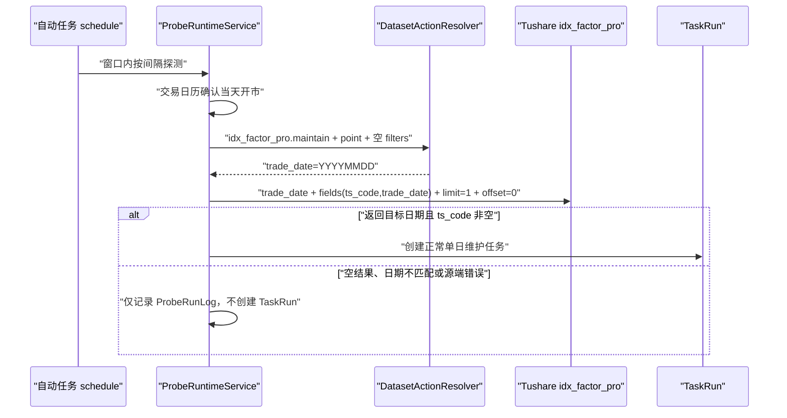

# 指数技术因子（专业版）`idx_factor_pro` 数据集接入方案

状态：开发中；M1 Foundation 主链、M2 Ops 目录/任务入口和 M3 源站探测后端已完成，自动任务页面待实现

更新时间：2026-08-01

依据：[数据集开发说明模板](/Users/congming/github/goldenshare/docs/templates/dataset-development-template.md)、[指数技术因子（专业版）源文档](</Users/congming/github/goldenshare/docs/sources/tushare/指数专题/0358_指数技术因子(专业版).md>)、[数据集日期模型消费指南](/Users/congming/github/goldenshare/docs/architecture/dataset-date-model-consumer-guide-v1.md)。

## 实施进度

| 阶段 | 状态 | 已验证结果 |
| --- | --- | --- |
| M1：Foundation 主链 | 已完成 | `DatasetDefinition`、request builder、raw ORM、serving view ORM、DAO、Alembic、freshness 映射与 raw-only writer 护栏已落地；定向测试 210 项通过，Definition lint 通过。 |
| M2：Ops 目录与任务入口 | 已完成 | 已配置 `index_market_data` 第 45 位；手动任务和自动任务配置由 Definition 派生，测试确认没有 `ts_code` 输入，也未进入任何既有 workflow。 |
| M3：源站探测后端 | 已完成 | `remote_idx_factor_pro_ready` 已接入绑定校验和 ProbeRuntime；只在当日开市、源端返回目标日有效行时创建空 filters 的标准单日 TaskRun。空结果、日期错配、字段缺失、非开市日与 source error 都不会创建任务。 |
| M4：自动任务页面 | 待开始 | 仅展示本数据集的源站探测条件，不暴露 `ts_code`。 |
| M5：全量验证与发布验收 | 待开始 | 迁移与真实单日同步必须在获得部署授权后执行。 |

## 1. 结论与范围

接入 Tushare `idx_factor_pro`，数据集 key 固定为 `idx_factor_pro`，展示名为“指数技术因子（专业版）”。

- 原始事实表：`raw_tushare.idx_factor_pro`。
- 对外服务入口：`core_serving.index_factor_pro` 普通 view，直接读取 raw；不写第二份 serving 物理表。
- 每次只按一个交易日请求源端全量指数数据；区间维护由 resolver 展开为多个交易日 unit。
- 首期不暴露 `ts_code`、`start_date`、`end_date` 等源接口过滤参数给运营。运营意图只允许“处理某一交易日”或“处理一个交易日区间”。
- 首期不接入 Dagster、不预置自动任务、不改现有工作流；`schedule_enabled=True` 表示运营可在自动任务页自行配置该数据集。
- 为运营自动任务增加“源站已有指数技术因子”探测条件。该条件只判断源端是否已开始返回目标交易日数据；不替代全量维护后的 freshness 或日期完整性审计。具体口径见第 12 节。
- 不创建、清空、删除或重建任何现有生产表。

这样设计的原因：源端不允许不带 `ts_code` 或 `trade_date` 的请求；`trade_date` 是唯一能一次取得当日完整指数集合的入口。允许运营按单指数拉历史，既不能满足“保留源站全量事实”，也会在超过 8,000 行时被源端截断。

## 2. 生产与代码现状审计

2026-08-01 通过只读生产库查询确认：

| 审计项 | 范围 | 结果 |
| --- | --- | --- |
| 已有业务表 | `raw_tushare`、`core`、`core_serving` 中名称匹配 `idx/index + factor` 的表 | 0 张 |
| 已有字段 | 上述候选表的 `information_schema.columns` | 0 行 |
| 历史任务 | `ops.task_run.resource_key in ('idx_factor_pro', 'index_factor_pro')`，最多 20 条 | 0 条 |
| 状态快照 | `ops.dataset_status_snapshot.dataset_key in ('idx_factor_pro', 'index_factor_pro')` | 0 条 |

仓库检索也未发现 `idx_factor_pro` 的 `DatasetDefinition`、ORM、DAO、Alembic、请求 builder 或测试。因此这是新数据集接入，不是对既有实现的修补。

### 2.1 指数日线激活池与源端覆盖审计

这是接入前的一次性兼容性审计，不是本数据集运行时的对象池规则。2026-08-01 使用 `tushareMcp.idx_factor_pro` 拉取 `trade_date=20260731` 的全量代码集合，并通过只读生产查询对照 `ops.index_series_active`：

| 比较集合 | 代码数 | 与 2026-07-31 `idx_factor_pro` 重合 | 当日未返回技术因子的代码数 | 结论 |
| --- | ---: | ---: | ---: | --- |
| `index_daily` 服务激活池 | 1,216 | 1,212（99.67%） | 4 | 不能假设日线激活池的每个代码在每个交易日都有技术因子。 |
| `index_daily_raw` 源端请求池 | 3,052 | 2,049（67.14%） | 1,003 | 它是日线源端请求池，不是本数据集的请求范围。 |
| `idx_factor_pro` 当日源端集合 | 3,146 | 1,212 个代码位于 `index_daily` 服务激活池 | 1,934 个代码不在该服务池 | 源端集合明显大于当前日线服务激活池。 |

`index_daily` 服务激活池中当日没有返回 `idx_factor_pro` 的 4 个代码为：`480055.CNI`、`480056.CNI`、`480057.CNI`、`931598.CSI`。

本次结论只描述 2026-07-31 这一天的源端事实，不能外推为这些代码永久不支持技术因子。它不改变本数据集“按 `trade_date` 请求源端全量、raw 与 view 保留源端事实”的设计，也不引入 active pool 过滤。若将来需要以日线激活池作为技术因子服务门禁，必须另行定义代码级可用性规则，不能复用这次单日审计结果。

2026-08-01 同时只读核验了 Dagster 当前的指数日线运行时动态分区 `cn_a_index_ts_codes`：该集合有 820 个代码，全部出现在同日 `idx_factor_pro` 源端返回中，覆盖率为 100%。DG 动态分区是本地 Lake 指数日线的独立运行时集合，不等同于生产 `index_daily` 或 `index_daily_raw` 激活池；本数据集不得读取它作为请求、过滤或审计条件。

## 3. 源接口真实行为验证

接口文档声明单次最大 8,000 行；5000 积分为 30 次/分钟，8000 积分以上为 500 次/分钟。以下均由 `tushareMcp.idx_factor_pro` 于 2026-08-01 实测，不以文档替代。

| 请求形态 | 实际参数 | 结果 | 结论 |
| --- | --- | --- | --- |
| 不传业务参数 | `fields=[ts_code,trade_date]` | `50101`，提示至少传 `ts_code` 或 `trade_date` | 不存在无条件全量拉取入口 |
| 只传交易日 | `trade_date=20260731`，`fields=[ts_code,trade_date]` | 3,146 行、3,146 个不同 `ts_code` | 单日能取得源端当日全量指数集合；当前未触及 8,000 行上限 |
| 分页第一页 | 上述单日请求加 `limit=1, offset=0` | 1 行，`000094.SH` | `limit/offset` 生效 |
| 分页第二页 | 上述单日请求加 `limit=1, offset=1` | 1 行，`000096.SH` | 第二页与第一页不同，`offset` 生效 |
| 只传对象 | `ts_code=000001.SH`，`fields=[ts_code,trade_date]` | 恰好 8,000 行，日期 `19930908 ~ 20260731` | 单指数全历史被单次上限截断，不能作为无窗口主链 |
| 传对象与区间 | `ts_code=000001.SH,start_date=20260701,end_date=20260731` | 23 行，日期 `20260701 ~ 20260731` | 源端支持单指数区间过滤，但首期不将其作为运营输入 |
| 只传时间区间 | `start_date=20260730,end_date=20260731` | `50101`，仍要求 `ts_code` 或 `trade_date` | 全市场区间不能直接请求，必须按 `trade_date` 扇出 |
| 显式完整字段 | 单指数 2026-07 短区间，显式传 89 个文档字段 | 23 行，每行恰好 89 字段，和本地源文档完全一致 | 89 个源字段均可实际请求，全部必须落库 |

MCP 工具的公开 schema 没有列出 `limit/offset`，但实际服务接受这两个参数并返回不同分页页，因此 implementation 必须继续走现有 `DatasetSourceClient` 的 `offset_limit` 主链，而不是把分页参数暴露给 Ops。

### 3.1 源站探测可行性验证

2026-08-01 对下列五个代表指数逐个实测 `ts_code + trade_date=20260731`、`fields=[ts_code, trade_date]`、`limit=1`、`offset=0`，均返回请求的代码和目标交易日：

```text
000001.SH  399001.SZ  399300.SZ  000016.SH  000905.SH
```

这证明源接口支持“指数代码 + 交易日”的精确小请求，但**不能直接作为本数据集探测主链**：当前接入方案的 `DatasetDefinition.input_model.filters=()`，`DatasetActionResolver` 会拒绝未定义的 `ts_code`。不能为了探测在 Ops、resolver 或页面绕过这项校验，也不能新增一个只对页面隐藏的 `ts_code` 输入字段。

因此，推荐的探测请求保持与正式维护同一条参数主线：由 resolver 把空 filters 的 point 意图归一化为 `trade_date=YYYYMMDD`，再仅附加探测专用的 `fields=[ts_code, trade_date]`、`limit=1`、`offset=0`。它读取该交易日源端全量入口的第一页；返回一条带有目标日期和非空代码的记录，即表示源站已开始发布当天数据。

## 4. 三层语义

| 语义层 | 本数据集定义 | 已核验依据 |
| --- | --- | --- |
| 时间输入 | 运营提交一个交易日，或一个起止日期区间；日期指指数行情业务交易日 | `trade_date` 单日全量实测；接口拒绝无 `trade_date/ts_code` |
| 执行 / unit | point 生成 1 个 `trade_date` unit；range 按交易日历展开为每个开市日 1 个 unit；每个 unit 只请求该日全量指数、分页拉取、单独提交 | 当前 `DatasetUnitPlanner` 的 `trade_open_day + every_open_day` generic 行为；单日 3,146 行实测 |
| freshness / audit | 要求每个开市日都有一批源端指数技术因子；只做日期级完整性，不按激活池做代码矩阵审计 | 数据源是当日全量快照，不以 index active pool 定义源端事实 |

计划中的 `DatasetDefinition.date_model`：

```text
date_axis=trade_open_day
bucket_rule=every_open_day
window_mode=point_or_range
input_shape=trade_date_or_start_end
observed_field=trade_date
audit_applicable=True
```

## 5. 表与存储设计

### 5.1 Raw 表

新增 `raw_tushare.idx_factor_pro`：

- 主键：`(ts_code, trade_date)`。
- 索引：仅新增 `idx_raw_tushare_idx_factor_pro_trade_date (trade_date)`；主键已经提供 `(ts_code, trade_date)` 索引，禁止重复创建同列顺序的冗余索引。
- `ts_code` 使用 `VARCHAR(16)`，`trade_date` 使用 `DATE`。
- 其余 87 个源站数值字段使用 `DOUBLE PRECISION`，与已落地的 `stk_factor_pro` 宽表一致，避免为技术因子宽表引入不必要的高精度存储成本。
- 追加内部审计字段：`api_name VARCHAR(32) NOT NULL DEFAULT 'idx_factor_pro'`、`fetched_at TIMESTAMPTZ NOT NULL DEFAULT now()`、`raw_payload TEXT`。它们不是源字段，不进入 `source_fields`。

### 5.2 Serving view

新增 `core_serving.index_factor_pro` 普通 view：

```sql
SELECT
  <raw 的全部 89 个源字段>,
  'tushare'::varchar(32) AS source,
  fetched_at AS created_at,
  fetched_at AS updated_at
FROM raw_tushare.idx_factor_pro;
```

view 不复制数据，也不承接 writer。它让业务查询使用稳定的 `core_serving` 命名，同时 raw 层保留完整 Tushare 事实。

### 5.3 逐列字段对账

下表是实施门禁。`source_fields`、raw ORM、Alembic raw 表与 serving view 必须逐列一致；不允许只取少数技术指标。

| 源字段 | 源类型 | raw / view 类型 | 处理 |
| --- | --- | --- | --- |
| `ts_code` | str | `VARCHAR(16)` | 主键，原样保留 |
| `trade_date` | str | `DATE` | 主键，归一化为日期 |
| `open` | float | `DOUBLE PRECISION` | 原样保留 |
| `high` | float | `DOUBLE PRECISION` | 原样保留 |
| `low` | float | `DOUBLE PRECISION` | 原样保留 |
| `close` | float | `DOUBLE PRECISION` | 原样保留 |
| `pre_close` | float | `DOUBLE PRECISION` | 原样保留 |
| `change` | float | `DOUBLE PRECISION` | 原样保留 |
| `pct_change` | float | `DOUBLE PRECISION` | 原样保留 |
| `vol` | float | `DOUBLE PRECISION` | 原样保留 |
| `amount` | float | `DOUBLE PRECISION` | 原样保留 |
| `asi_bfq` | float | `DOUBLE PRECISION` | 原样保留 |
| `asit_bfq` | float | `DOUBLE PRECISION` | 原样保留 |
| `atr_bfq` | float | `DOUBLE PRECISION` | 原样保留 |
| `bbi_bfq` | float | `DOUBLE PRECISION` | 原样保留 |
| `bias1_bfq` | float | `DOUBLE PRECISION` | 原样保留 |
| `bias2_bfq` | float | `DOUBLE PRECISION` | 原样保留 |
| `bias3_bfq` | float | `DOUBLE PRECISION` | 原样保留 |
| `boll_lower_bfq` | float | `DOUBLE PRECISION` | 原样保留 |
| `boll_mid_bfq` | float | `DOUBLE PRECISION` | 原样保留 |
| `boll_upper_bfq` | float | `DOUBLE PRECISION` | 原样保留 |
| `brar_ar_bfq` | float | `DOUBLE PRECISION` | 原样保留 |
| `brar_br_bfq` | float | `DOUBLE PRECISION` | 原样保留 |
| `cci_bfq` | float | `DOUBLE PRECISION` | 原样保留 |
| `cr_bfq` | float | `DOUBLE PRECISION` | 原样保留 |
| `dfma_dif_bfq` | float | `DOUBLE PRECISION` | 原样保留 |
| `dfma_difma_bfq` | float | `DOUBLE PRECISION` | 原样保留 |
| `dmi_adx_bfq` | float | `DOUBLE PRECISION` | 原样保留 |
| `dmi_adxr_bfq` | float | `DOUBLE PRECISION` | 原样保留 |
| `dmi_mdi_bfq` | float | `DOUBLE PRECISION` | 原样保留 |
| `dmi_pdi_bfq` | float | `DOUBLE PRECISION` | 原样保留 |
| `downdays` | float | `DOUBLE PRECISION` | 原样保留 |
| `updays` | float | `DOUBLE PRECISION` | 原样保留 |
| `dpo_bfq` | float | `DOUBLE PRECISION` | 原样保留 |
| `madpo_bfq` | float | `DOUBLE PRECISION` | 原样保留 |
| `ema_bfq_10` | float | `DOUBLE PRECISION` | 原样保留 |
| `ema_bfq_20` | float | `DOUBLE PRECISION` | 原样保留 |
| `ema_bfq_250` | float | `DOUBLE PRECISION` | 原样保留 |
| `ema_bfq_30` | float | `DOUBLE PRECISION` | 原样保留 |
| `ema_bfq_5` | float | `DOUBLE PRECISION` | 原样保留 |
| `ema_bfq_60` | float | `DOUBLE PRECISION` | 原样保留 |
| `ema_bfq_90` | float | `DOUBLE PRECISION` | 原样保留 |
| `emv_bfq` | float | `DOUBLE PRECISION` | 原样保留 |
| `maemv_bfq` | float | `DOUBLE PRECISION` | 原样保留 |
| `expma_12_bfq` | float | `DOUBLE PRECISION` | 原样保留 |
| `expma_50_bfq` | float | `DOUBLE PRECISION` | 原样保留 |
| `kdj_bfq` | float | `DOUBLE PRECISION` | 原样保留 |
| `kdj_d_bfq` | float | `DOUBLE PRECISION` | 原样保留 |
| `kdj_k_bfq` | float | `DOUBLE PRECISION` | 原样保留 |
| `ktn_down_bfq` | float | `DOUBLE PRECISION` | 原样保留 |
| `ktn_mid_bfq` | float | `DOUBLE PRECISION` | 原样保留 |
| `ktn_upper_bfq` | float | `DOUBLE PRECISION` | 原样保留 |
| `lowdays` | float | `DOUBLE PRECISION` | 原样保留 |
| `topdays` | float | `DOUBLE PRECISION` | 原样保留 |
| `ma_bfq_10` | float | `DOUBLE PRECISION` | 原样保留 |
| `ma_bfq_20` | float | `DOUBLE PRECISION` | 原样保留 |
| `ma_bfq_250` | float | `DOUBLE PRECISION` | 原样保留 |
| `ma_bfq_30` | float | `DOUBLE PRECISION` | 原样保留 |
| `ma_bfq_5` | float | `DOUBLE PRECISION` | 原样保留 |
| `ma_bfq_60` | float | `DOUBLE PRECISION` | 原样保留 |
| `ma_bfq_90` | float | `DOUBLE PRECISION` | 原样保留 |
| `macd_bfq` | float | `DOUBLE PRECISION` | 原样保留 |
| `macd_dea_bfq` | float | `DOUBLE PRECISION` | 原样保留 |
| `macd_dif_bfq` | float | `DOUBLE PRECISION` | 原样保留 |
| `mass_bfq` | float | `DOUBLE PRECISION` | 原样保留 |
| `ma_mass_bfq` | float | `DOUBLE PRECISION` | 原样保留 |
| `mfi_bfq` | float | `DOUBLE PRECISION` | 原样保留 |
| `mtm_bfq` | float | `DOUBLE PRECISION` | 原样保留 |
| `mtmma_bfq` | float | `DOUBLE PRECISION` | 原样保留 |
| `obv_bfq` | float | `DOUBLE PRECISION` | 原样保留 |
| `psy_bfq` | float | `DOUBLE PRECISION` | 原样保留 |
| `psyma_bfq` | float | `DOUBLE PRECISION` | 原样保留 |
| `roc_bfq` | float | `DOUBLE PRECISION` | 原样保留 |
| `maroc_bfq` | float | `DOUBLE PRECISION` | 原样保留 |
| `rsi_bfq_12` | float | `DOUBLE PRECISION` | 原样保留 |
| `rsi_bfq_24` | float | `DOUBLE PRECISION` | 原样保留 |
| `rsi_bfq_6` | float | `DOUBLE PRECISION` | 原样保留 |
| `taq_down_bfq` | float | `DOUBLE PRECISION` | 原样保留 |
| `taq_mid_bfq` | float | `DOUBLE PRECISION` | 原样保留 |
| `taq_up_bfq` | float | `DOUBLE PRECISION` | 原样保留 |
| `trix_bfq` | float | `DOUBLE PRECISION` | 原样保留 |
| `trma_bfq` | float | `DOUBLE PRECISION` | 原样保留 |
| `vr_bfq` | float | `DOUBLE PRECISION` | 原样保留 |
| `wr_bfq` | float | `DOUBLE PRECISION` | 原样保留 |
| `wr1_bfq` | float | `DOUBLE PRECISION` | 原样保留 |
| `xsii_td1_bfq` | float | `DOUBLE PRECISION` | 原样保留 |
| `xsii_td2_bfq` | float | `DOUBLE PRECISION` | 原样保留 |
| `xsii_td3_bfq` | float | `DOUBLE PRECISION` | 原样保留 |
| `xsii_td4_bfq` | float | `DOUBLE PRECISION` | 原样保留 |

## 6. DatasetDefinition 与执行设计

| Definition 分段 | 固定设计 |
| --- | --- |
| `identity` | `dataset_key=idx_factor_pro`，`display_name=指数技术因子（专业版）` |
| `domain` | 底层领域 `index_fund / 指数 / ETF`；Ops 展示目录单独归入 `index_market_data / A股指数行情`，不把页面分组写回领域事实 |
| `source` | `adapter_key=tushare`，`api_name=idx_factor_pro`，`source_doc_id=tushare.idx_factor_pro`，89 个字段全部写入 `source_fields` |
| `input_model` | 只提供 `trade_date`、`start_date`、`end_date`；没有对象筛选字段 |
| `planning` | `universe_policy=no_pool`，`unit_builder_key=generic`，`pagination_policy=offset_limit`，`page_limit=8000` |
| `normalization` | `date_fields=(trade_date,)`；其余 87 个数值字段统一进 `decimal_fields`；不设 row transform |
| `storage` | `raw_dao_name=raw_idx_factor_pro`，`core_dao_name=index_factor_pro`，`raw_table=raw_tushare.idx_factor_pro`，`serving_table=core_serving.index_factor_pro`，`write_path=raw_only_upsert` |
| `capabilities` | 唯一动作 `maintain`；手动、自动配置、重试均开启；仅支持 `point/range` |
| `observability` | `observed_field=trade_date`，`freshness_policy=continuous_open_day`，日期审计启用 |
| `transaction` | `commit_policy=unit`，幂等 upsert；一个 unit 是一个交易日，业务数据写入与 Ops 状态写入保持事务隔离 |

请求参数只由新增 `_idx_factor_pro_params()` 生成：

```text
输入意图：2026-07-31
resolver unit：anchor_date=2026-07-31
源端参数：{"trade_date": "20260731"}
分页参数：DatasetSourceClient 统一追加 limit/offset
```

范围 `2026-07-01 ~ 2026-07-31` 不会直接传给源端。resolver 先按交易日历得到 23 个开市日，再生成 23 个 `trade_date` unit。这样每个事务和单次全量源请求都有明确边界，且不会触发“全市场区间请求缺参数”的源端错误。

## 7. 性能与容量评估

| 项目 | 已验证事实或计算方式 | 结论 |
| --- | --- | --- |
| 单日源端规模 | 2026-07-31 实测 3,146 行 | 当前 1 页即可完成 |
| 单页上限 | Tushare 8,000 行 | `page_limit=8000`；未来单日超过上限时自动继续 offset 分页 |
| 单日请求数 | `ceil(当日行数 / 8000)` | 当前为 1 次 |
| 区间请求数 | `交易日数量 × ceil(当天行数 / 8000)` | 例如 23 个开市日约 23 次，而不是指数代码数乘日期数 |
| 单日事务规模 | 当前约 3,146 行、89 个源字段 | 一个交易日一次 raw upsert，再提交该 unit |
| 限速 | 30 或 500 次/分钟，取决于账号积分 | 1 次/交易日，不会按 3,146 个指数逐 code 请求 |

首期明确拒绝两种低效路径：

1. `指数代码 × 每日` fan-out：把单日 1 次全量请求放大成数千次请求。
2. 单指数不带日期拉全历史：实测会被截在 8,000 行，完整性不可证明。

## 8. DatasetDefinition 消费者审计

| 消费方 | 读取事实 | 本次改动 | 已核验代码位置 |
| --- | --- | --- | --- |
| 手动任务 | `date_model`、`input_model`、`capabilities` | Definition 自动派生单日/区间表单；无额外前端规则 | `src/ops/catalog/dataset_catalog_view_resolver.py`、`frontend/src/pages/ops-v21-task-manual-tab.tsx` |
| 自动任务 | `capabilities`、日期选择规则 | 允许运营创建 point/range 自动任务；首期不预置任务 | `src/ops/services/operations_schedule_service.py`、`frontend/src/pages/ops-v21-task-auto-tab.tsx` |
| 源站就绪探测 | schedule 的 `probe_config`、TaskRun 意图 | 增加 `remote_idx_factor_pro_ready`；命中后创建正常单日维护 TaskRun，不直接写业务表 | `src/ops/services/schedule_probe_binding_service.py`、`src/ops/services/operations_probe_runtime_service.py` |
| Ops 目录 | 展示目录配置 | 在 `index_market_data` 增加 `DatasetCatalogItem('idx_factor_pro', ..., 45)` | `src/ops/catalog/dataset_catalog_views.py` |
| resolver / planner | `date_model`、`planning`、`input_model` | 复用 generic trade-day unit，不新增对象池或 custom unit builder | `src/foundation/ingestion/resolver.py`、`src/foundation/ingestion/unit_planner.py` |
| request builder | 源字段映射 | 新增只生成 `trade_date` 的 `_idx_factor_pro_params` | `src/foundation/ingestion/request_builders.py` |
| source client | `source_fields`、pagination | 复用 `offset_limit`，client 统一追加 `limit/offset` 并将 89 字段传给 connector | `src/foundation/ingestion/source_client.py` |
| normalizer | `date_fields`、`decimal_fields`、`required_fields` | 复用通用类型转换，无 dataset 特例 | `src/foundation/ingestion/normalizer.py` |
| writer | `storage.write_path` | 复用 `raw_only_upsert`；禁止写 serving view | `src/foundation/ingestion/writer.py` |
| freshness / 卡片 | `observed_field`、freshness policy、target/raw table | 注册 `continuous_open_day`；投影直接读取 Definition | `src/foundation/datasets/freshness_policies.py`、`src/ops/dataset_definition_projection.py`、`src/ops/queries/freshness_query_service.py` |
| snapshot rebuild | Definition 投影与 model registry | 新增 view ORM，供 `core_serving.index_factor_pro.trade_date` 观测 | `src/foundation/models/table_model_registry.py`、`src/ops/dataset_observation_registry.py` |
| 日期完整性审计 | `audit_applicable`、`bucket_rule` | 仅日期级交易日审计，不新增 index active pool 代码矩阵规则 | `src/ops/services/date_completeness_audit_service.py` |
| 工作流 | action catalog / step 定义 | 不修改任一既有 workflow | `src/ops/action_catalog.py`、`src/ops/workflows/` |
| ORM / DAO | 表模型、DAOFactory | 新增 raw/view ORM 和两条 factory 属性 | `src/foundation/models/all_models.py`、`src/foundation/dao/factory.py` |

## 9. 实施清单

1. 在 `src/foundation/datasets/definitions/index_series.py` 注册 `idx_factor_pro` 的完整 Definition。
2. 在 `src/foundation/ingestion/request_builders.py` 新增 `_idx_factor_pro_params()`；不得复用名称不相符的 builder。
3. 新增 `RawIdxFactorPro` 和 `IndexFactorPro` ORM，均从 Definition 的 89 个 `source_fields` 生成同名宽字段；加入 `all_models.py` 与 `DAOFactory`。
4. 新增 Alembic migration。实施前必须先读取真实 migration head；创建 raw 表、日期索引和显式字段 view。不得删除任何旧 relation。
5. 在 `src/foundation/datasets/freshness_policies.py` 增加 `idx_factor_pro: continuous_open_day`，并在 Ops 展示目录加入“A股指数行情”分组。
6. 补齐 Definition、resolver、request builder、source pagination、normalizer、writer、catalog、freshness projection、runtime registry 和 migration/view contract 测试。
7. 发版后只做最小真实验收：单日同步一个最近开市日，逐项对账源端 fetched、normalized、written、rejected、raw 行数、view 行数和 89 字段集合；任何 reject 必须按 reason code 查样本。
8. 新增 Ops 探测服务、自动任务条件、TaskRun 创建与前后端测试；不得更改 ingestion、writer、表结构或既有 workflow。

## 10. 测试门禁

| 测试 | 必须证明 |
| --- | --- |
| Definition registry | 89 个 `source_fields`、日期模型、raw/view 映射、`raw_only_upsert`、freshness policy 完整 |
| Resolver / planner | point 为 1 个 `trade_date` unit；range 只展开开市日；不读取任何指数 active pool |
| Request builder | 只传 `trade_date=YYYYMMDD`；不接受 Ops 传入 `limit/offset` 或未定义 `ts_code` |
| Source client | 89 字段会传给 connector；满 8,000 行时继续请求 offset 第二页；不足页停止 |
| Normalizer | `trade_date` 正确转 `DATE`，数值字段可写入宽表，缺 `ts_code/trade_date` 有明确 reject reason |
| Writer | 只调用 `raw_idx_factor_pro` upsert，从不调用或写入 `index_factor_pro` view DAO |
| Ops catalog | 出现在“A股指数行情”；手动任务显示日期点/范围；不出现在既有 workflow |
| Freshness / audit | 卡片从 Definition 投影，按交易日连续性计算；不引入 active pool 代码完整性判断 |
| 源站探测 | 仅在当日开市日、探测窗口内读取源端 `trade_date` 全量入口的第一页；命中才创建一个 point TaskRun，miss/error 不创建 |
| 真实验收 | 源端、normalizer、writer、raw 与 view 的行数/字段集合一致 |

## 11. 已确认决策

### D1. 不加入既有每日工作流

首期不加入 `daily_market_close_maintenance` 或任何其他既有 workflow；只开放手动维护和运营侧自动任务配置，不预置自动任务。

原因：把新数据集直接塞进既有工作流，会把“接口接入”扩大为批量编排和失败传播问题。源站探测是该数据集自身的自动任务触发能力，与既有 workflow 无关；即使第 12 节获批，也不得因此加入 workflow。

## 12. 源站就绪探测（已确认）

### 12.1 固定边界

条件 key 为 `remote_idx_factor_pro_ready`，展示名为“源站已有指数技术因子”。它的职责只有一件事：在运营配置的探测窗口内确认 Tushare 是否已开始返回**当天开市日**的 `idx_factor_pro` 数据。命中后创建一条正常的 `idx_factor_pro.maintain` 单日 TaskRun；后续全量请求、分页、归一化、raw 写入、view 直出、freshness 与日期完整性仍走既有数据集主链。



探测不读取 `index_daily`、`index_daily_raw`、Dagster 动态分区或任何激活池；也不按源端返回代码数判断“全量齐备”。这与第 2.1 节的静态覆盖审计彻底分离。

### 12.2 已确认决策

| 编号 | 已确认项 | 结论 | 原因 |
| --- | --- | --- | --- |
| D2-A | 探测命中标准 | 确认采用单日全量入口的轻量请求命中：只请求 `trade_date`，返回一条目标日期记录即命中。 | 与既有 Definition 的“运营不输入 `ts_code`”硬约束一致；每轮只 1 次请求；不需要新增隐藏参数或绕过 resolver。 |
| D2-B | 五个固定指数全部命中 | 确认不采用。 | 虽已实测五个代码都支持精确请求，但它需要为仅探测目的扩展 `ts_code` 内部输入能力，当前仓库没有该能力；会扩大 DatasetDefinition、validator、manual/auto 页面和契约审计范围。 |
| D3 | 可用触发方式 | 确认同时支持“探测触发”和“定时 + 探测兜底”。 | 与 `index_daily` / `index_mins` 的现有用户交互一致；兜底会复用现有“当天已有有效 probe TaskRun 则不重复创建”的 schedule 语义。 |
| D4 | 探测频率与每日触发上限 | 确认服务端最小间隔 300 秒，`max_triggers_per_day` 强制为 1。 | 每轮仅 1 次源端请求，5 分钟已足够；命中后只需要创建一次当日全量维护任务，避免运营误配造成同日重复下载。 |

源文档没有给出确定的日内发布时间，因此不建议凭印象为该数据集写死探测起止时间；运营仍在页面按实际源站发布节奏设置窗口。

## 13. 明确不做

- 不按指数 active pool 过滤请求或写入。该数据集的 raw 和 view 都保留 Tushare 单日全量返回。
- 不暴露 `ts_code` 单指数历史维护入口。
- 不新增 serving 物理表，不双写。
- 不加入现有每日工作流，不新增补漏、状态表或与自动任务无关的前端特例。
- 不为探测新增 `ts_code` 运营输入、隐藏输入、对象池依赖或代码级全量完整性判定。
- 不接入 Dagster / Lake；如后续需要，再按 Lake 模板单独评审。
