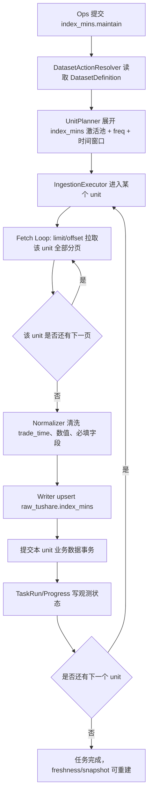

# 指数历史分钟行情（index_mins）数据集开发说明

文档状态：待评审
适用数据集：`index_mins`
源接口：Tushare `idx_mins`
源接口文档：[/Users/congming/github/goldenshare/docs/sources/tushare/指数专题/0419_股票历史分钟行情.md](/Users/congming/github/goldenshare/docs/sources/tushare/指数专题/0419_股票历史分钟行情.md)
开发模板依据：[/Users/congming/github/goldenshare/docs/templates/dataset-development-template.md](/Users/congming/github/goldenshare/docs/templates/dataset-development-template.md)

> 说明：源站文档标题写的是“股票历史分钟行情”，但接口 `idx_mins` 查询的是指数分钟行情。本文按接口真实语义建模，不按文档标题误导命名。

---

## 0. 架构基线与禁止项

### 0.1 当前必须遵守的主线

1. 数据集事实源必须落在 `src/foundation/datasets/**` 的 `DatasetDefinition`。
2. 维护动作统一为 `action=maintain`，动作 key 为 `index_mins.maintain`。
3. 执行计划由 `DatasetActionResolver` 按 `DatasetDefinition` 生成，不在 Ops 或前端展开源接口参数。
4. 源接口参数只允许在 `src/foundation/ingestion/request_builders.py` 中生成。
5. 任务观测只走 TaskRun 主链，不新增旧任务表或旧执行路由。
6. Ops 展示分组只走 Ops 展示目录配置，不把 UI 分组绑定到底层 `DatasetDefinition.domain`。

### 0.2 禁止项

1. 禁止复用已退场的旧维护入口语义。
2. 禁止使用 `__ALL__`、`ALL`、空字符串等伪全量值传给 Tushare。
3. 禁止引入 checkpoint / acquire / 定点跳过能力。
4. 禁止 per-page 提交；分页只用于降低单次源接口返回规模，不改变事务语义。
5. 禁止把 `limit`、`offset` 暴露给运营用户填写。
6. 禁止让状态写入失败影响 `raw_tushare.index_mins` 的业务数据写入事务。
7. 禁止把 `idx_mins` 的“只传 ts_code + freq 会返回一段默认数据”建模成平台主维护方式，因为这个默认窗口不清晰，不能表达明确运营意图。

### 0.3 开发前置硬检查

#### 0.3.0 源接口真实行为验证表

验证日期：2026-05-06
验证接口：Tushare `idx_mins`
验证样例指数：`000001.SH`
验证频率：`30min`
验证交易日：`2026-04-30`

| 请求形态 | 实际请求参数 | 源端返回行数 | 是否分页 | 关键样本字段 | 结论 |
| --- | --- | ---: | --- | --- | --- |
| 不传业务参数 | `{}` | 0，返回错误 `50101`，提示必填 `ts_code` | 否 | 无 | 不能拉全集，`ts_code` 是源接口必填参数 |
| 只传对象过滤 | `{"ts_code": "000001.SH", "freq": "30min"}` | 36 | 源端可返回，但默认窗口不明确 | `trade_time` 最近一段分钟数据 | 不能作为平台主维护方式，只能说明源端有默认窗口 |
| 只传时间点 | `{"ts_code": "000001.SH", "freq": "30min", "start_date": "2026-04-30 09:00:00", "end_date": "2026-04-30 19:00:00", "limit": 8000, "offset": 0}` | 9 | 单页完成 | `ts_code`、`trade_time`、`freq`、`exchange`、`vwap` | 单日窗口可明确拉取 |
| 传时间区间 | `{"ts_code": "000001.SH", "freq": "30min", "start_date": "2026-04-29 09:00:00", "end_date": "2026-04-30 19:00:00", "limit": 8000, "offset": 0}` | 18 | 单页完成 | 两个交易日各 9 条 | 区间窗口可明确拉取 |
| 分页第二页 | 同单日窗口，`limit=5, offset=5` | 第 2 页 4 条 | 是 | 第二页首条 `trade_time=2026-04-30 11:00:00` | `limit/offset` 生效，结束条件为返回行数小于 `limit` |

激活池探测结论：

| 探测项 | 结果 |
| --- | --- |
| 基准池 | `ops.index_series_active` 中 `resource=index_daily` 的 1130 个激活指数 |
| 探测日期 | `2026-04-30` |
| 探测频率 | `30min` |
| 有分钟线数据的指数 | 530 个 |
| 无分钟线数据的指数 | 600 个 |
| API 错误 | 0 |
| 字段缺失 | 0 |
| 总返回行数 | 4770 |
| 有数据指数基本信息报告 | [/Users/congming/github/goldenshare/reports/idx_mins_20260430_30min_available_index_basic.csv](/Users/congming/github/goldenshare/reports/idx_mins_20260430_30min_available_index_basic.csv) |
| 激活池写入 | 已按 `resource=index_mins` 写入 530 个指数 |

硬结论：

1. `index_mins` 不是 no-time snapshot 数据集。
2. 平台主维护方式必须是“指数代码池 + 时间区间 + 频率”。
3. 默认维护代码池使用 `ops.index_series_active.resource = "index_mins"`，不是 `index_daily` 全池。
4. 源端分页能力存在，但分页不是事务边界。

#### 0.3.1 三层语义拆分表

| 语义层 | 必须回答的问题 | 本数据集答案 | 是否已从代码/源文档核验 |
| --- | --- | --- | --- |
| 时间输入语义 | 用户或调度到底在提交什么意图？ | 用户提交单个交易日或交易日区间，再选择 `freq`。系统把单日转成 `YYYY-MM-DD 09:00:00 ~ YYYY-MM-DD 19:00:00`，把区间转成 `start_date 09:00:00 ~ end_date 19:00:00`。 | 是，源文档定义 `start_date/end_date` 为 `datetime`，真实请求验证通过 |
| 执行 / unit 语义 | resolver 会如何展开执行计划？单个事务边界在哪里？ | 默认按 `resource=index_mins` 激活池展开指数代码，再按 `freq` 展开。一个 unit = 一个指数代码 + 一个 freq + 一个时间窗口。该 unit 内可以分页拉取，拉完后归一化并一次写入该 unit。 | 是，已审计现有 `stk_mins` unit builder、`index_active_codes` 代码池能力、request builder 与 source client |
| freshness / audit 语义 | 平台是否要求连续日期桶？ | freshness 使用 `trade_time` 推导最近同步时间/日期；日期完整性审计 V1 不接入，因为分钟线完整性需要交易时段、频率、指数是否有分钟数据等规则，不能用普通交易日桶判断。 | 是，已对照 `stk_mins` 当前 `date_model` 与审计退出原因 |

补充说明：

1. `bucket_rule` 不等于“不支持时间输入”。`index_mins` 支持时间输入，但不纳入日期完整性审计。
2. `observed_field` 使用 `trade_time`，用于数据源卡片最近同步展示。
3. 该数据集不要求“每天必须所有 1130 个指数都有分钟线”，因为真实探测已经证明只有 530 个指数在 2026-04-30 有 `30min` 数据。

#### 0.3.2 DatasetDefinition 消费者审计表

| 消费方 | 读取了哪些 Definition 事实 | 本次是否受影响 | 需要怎么改 | 已核验代码位置 |
| --- | --- | --- | --- | --- |
| manual actions | `date_model`、`input_model`、`capabilities` | 是 | 新增 `index_mins.maintain`，展示交易日 point/range 控件、`freq` 选择、可选 `ts_code` 过滤 | `src/ops/queries/manual_action_query_service.py` |
| catalog | 展示分组、展示顺序、参数摘要 | 是 | 在 Ops 展示目录新增 `index_mins`，分到 `index_market_data` | `src/ops/catalog/dataset_catalog_views.py`、`src/ops/queries/catalog_query_service.py` |
| workflow | step 时间模式、默认参数、日期制度 | 暂不接入 | V1 不加入现有 workflow，避免把分钟线塞入日级工作流 | `src/ops/services/workflow_execution_service.py`、`src/ops/workflows/definitions.py` |
| resolver / unit planner | `date_model`、`planning`、`input_shape` | 是 | 新增或抽象分钟线 unit builder，按代码池 + freq + 时间窗口生成 units | `src/foundation/ingestion/unit_planner.py` |
| request builder | 源接口字段映射、日期格式化 | 是 | 新增 `_idx_mins_params()`，只生成 `ts_code/freq/start_date/end_date/limit/offset` | `src/foundation/ingestion/request_builders.py` |
| freshness | `observed_field`、`date_axis`、`bucket_rule` | 是 | 用 `trade_time` 作为 observed field，最近同步来自 raw 表最大 `trade_time` 与运行健康 | `src/ops/services/freshness_query_service.py` |
| dataset cards | 卡片状态、最近同步、原始层状态 | 是 | 通过 catalog + freshness 自动展示；不在前端拼字段 | `frontend/src/features/data-sources/**`、`src/ops/queries/catalog_query_service.py` |
| snapshot rebuild | status snapshot / layer snapshot 投影 | 是 | 新 raw ORM 必须能被 registry 发现，snapshot rebuild 才能统计行数和最近时间 | `src/foundation/models/table_model_registry.py`、`src/ops/services/dataset_status_snapshot_service.py` |
| date completeness audit | `audit_applicable`、`bucket_rule`、`not_applicable_reason` | 是 | V1 明确 `audit_applicable=False`，原因写分钟线完整性规则尚未建模 | `src/ops/queries/date_completeness_query_service.py` |
| 自动任务 / calendar policy | `date_selection_rule`、默认时间模式 | 是 | V1 启用自动任务，但不加入 workflow；自动任务参数与手动维护一致，`freq` 未选按全选处理 | `src/ops/services/schedule_definition_service.py` |
| 前端时间控件 | point/range/none/month 控件与选择规则 | 是 | 使用现有 point/range 交易日控件；`freq` 用枚举选择 | `frontend/src/features/tasks/**` |
| 测试与文档 | 单测、集成测试、文档索引 | 是 | 新增真实探测测试、definition/request/unit/writer/ops 测试，更新 README | `tests/integration/test_tushare_idx_mins_active_pool_probe.py`、`docs/README.md` |

---

## 1. 标准交付流程

| 步骤 | 交付物 | 本数据集状态 |
| --- | --- | --- |
| 固定源站事实 | 0419 源站文档、真实请求验证表 | 已完成 |
| 三张硬检查表 | 0.3.0、0.3.1、0.3.2 | 已填写 |
| 源站文档 | `docs/sources/tushare/指数专题/0419_股票历史分钟行情.md` | 已存在 |
| 数据集开发文档 | 本文档 | 待评审 |
| ORM / DAO / Alembic | `raw_tushare.index_mins` 物理表 | 已实现并通过定向门禁 |
| DatasetDefinition | `src/foundation/datasets/definitions/index_series.py` | 已实现并通过定向门禁 |
| ingestion 能力 | unit builder、request builder、row transform、writer | 已实现并通过定向门禁 |
| Ops 能力 | catalog、manual action、TaskRun 展示、freshness | 已接入派生能力并通过定向门禁 |
| 测试 | definition、planner、request、writer、Ops、真实探测 | 已补定向测试，真实探测脚本可复跑 |
| 本地门禁 | docs check、pytest 定向测试 | 已通过 |
| 真实验收 | 530 个指数最小窗口同步 | 待实现 |

---

## 2. 基本信息

- 数据集 key：`index_mins`
- 中文显示名：`指数历史分钟行情`
- 所属定义文件：`src/foundation/datasets/definitions/index_series.py`
- 所属域：`index_fund`
- 所属域中文名：`指数 / ETF`
- 数据源：`tushare`
- 源站 API 名称：`idx_mins`
- 源站文档链接：Tushare 指数专题 0419
- 本地源站文档路径：[/Users/congming/github/goldenshare/docs/sources/tushare/指数专题/0419_股票历史分钟行情.md](/Users/congming/github/goldenshare/docs/sources/tushare/指数专题/0419_股票历史分钟行情.md)
- 文档抓取日期：`2026-05-01 22:20:24`
- 是否对外服务：是
- 是否多源融合：否
- 是否纳入自动任务：是
- 是否纳入 workflow：否
- 是否纳入日期完整性审计：否
- Ops 展示分组 key：`index_market_data`
- Ops 展示分组名称：`A股指数行情`
- Ops 展示分组顺序：沿用现有 `index_market_data` 分组顺序

---

## 3. 源站接口分析

### 3.1 输入参数

| 参数名 | 类型 | 必填 | 说明 | 类别 | 是否给运营用户填写 | 对应 `DatasetInputField` | 备注 |
| --- | --- | --- | --- | --- | --- | --- | --- |
| `ts_code` | str | 是 | 指数代码 | 代码 | 可选填写 | `ts_code` | 平台默认从 `resource=index_mins` 激活池展开；用户填写时作为单代码维护 |
| `freq` | str | 是 | 分钟频度，支持 `1min/5min/15min/30min/60min` | 枚举 | 是 | `freq` | 用户可多选；若一个都没选，平台按全选处理并按 freq 扇开 |
| `start_date` | datetime | 否 | 开始时间 | 时间 | 否 | 由 point/range 生成 | request builder 内部生成 |
| `end_date` | datetime | 否 | 结束时间 | 时间 | 否 | 由 point/range 生成 | request builder 内部生成 |
| `limit` | int | 否 | 单页条数 | 分页 | 否 | 不暴露 | 内部固定，最大 8000 |
| `offset` | int | 否 | 分页偏移 | 分页 | 否 | 不暴露 | 内部分页游标 |

### 3.2 输出字段

| 字段名 | 类型 | 含义 | 是否落 raw | 是否进入 serving/core | 清洗规则 |
| --- | --- | --- | --- | --- | --- |
| `ts_code` | str | 指数代码 | 是 | 是 | 必填，保持源字段名 |
| `trade_time` | datetime | 交易时间 | 是 | 是 | 必填，解析为 timestamp |
| `close` | float | 收盘点位 | 是 | 是 | 允许空值，数值型 |
| `open` | float | 开盘点位 | 是 | 是 | 允许空值，数值型 |
| `high` | float | 最高点位 | 是 | 是 | 允许空值，数值型 |
| `low` | float | 最低点位 | 是 | 是 | 允许空值，数值型 |
| `vol` | int / float | 成交量 | 是 | 是 | 源样本可能表现为浮点数，建议 raw 用 `DOUBLE PRECISION` |
| `amount` | float | 成交金额 | 是 | 是 | 允许空值，数值型 |
| `freq` | str | 频率 | 是 | 是 | 必填，建议保留源值如 `30min` |
| `exchange` | str | 交易所 | 是 | 是 | 允许空值 |
| `vwap` | float | 成交均价 | 是 | 是 | 允许空值 |

说明：

1. 本数据集按用户要求采用 raw 直出，不再单独存一份 core 物理表。
2. serving/core 层建议使用 view 暴露，不做二次物理落表。
3. raw 表字段名保持源站输出字段名，避免后续维护时出现字段映射特例。

### 3.3 源端行为

- 是否分页：是。
- 单次返回上限：源文档写明单次最多 8000 行。
- 分页参数与结束条件：`limit/offset`；当返回行数小于 `limit` 时结束。
- 是否限速或有积分限制：源文档提示需要单独分钟权限；实现和验收时应按 Tushare 限速运行。
- 是否需要按代码池拆分请求：是，按 `resource=index_mins` 激活指数池展开。
- 是否需要按日期拆分请求：不按日期 fan-out；按用户提交的时间窗口请求。
- 是否需要按枚举拆分请求：是，按用户选择的 `freq` 展开；未选择时按 `1min/5min/15min/30min/60min` 全部展开。
- 是否有上游脏值或缺字段风险：分钟数据可能存在部分指数无数据；这不是 reject，应该按 0 行成功处理该 unit。
- 是否有级联依赖：有，依赖 `index_basic` 与 `ops.index_series_active(resource=index_mins)` 维护指数代码池。

硬结论：

1. `ts_code` 和 `freq` 是源端必填。
2. `start_date/end_date` 虽然源端非必填，但平台必须显式生成，避免落入源端不透明默认窗口。
3. 分页只控制源接口拉取，不代表业务事务必须分页提交。

---

## 4. DatasetDefinition 事实设计

### 4.1 `identity`

```python
"identity": {
    "dataset_key": "index_mins",
    "display_name": "指数历史分钟行情",
    "description": "Tushare 指数分钟行情，按指数代码、时间窗口和频率拉取。",
    "aliases": ("idx_mins",),
    "logical_key": None,
    "logical_priority": 100,
}
```

### 4.2 `domain`

```python
"domain": {
    "domain_key": "index_fund",
    "domain_display_name": "指数 / ETF",
    "cadence": "intraday",
}
```

说明：

1. `domain` 是底层领域事实，不等于 Ops 用户可见分组。
2. 用户可见分组走 Ops 展示目录：`index_market_data / A股指数行情`。

### 4.3 `source`

```python
"source": {
    "source_key_default": "tushare",
    "source_keys": ("tushare",),
    "adapter_key": "tushare",
    "api_name": "idx_mins",
    "source_fields": (
        "ts_code",
        "trade_time",
        "close",
        "open",
        "high",
        "low",
        "vol",
        "amount",
        "freq",
        "exchange",
        "vwap",
    ),
    "source_doc_id": "tushare.idx_mins",
    "request_builder_key": "_idx_mins_params",
    "base_params": {},
}
```

### 4.4 `date_model`

```python
"date_model": {
    "date_axis": "trade_open_day",
    "bucket_rule": "every_open_day",
    "window_mode": "point_or_range",
    "input_shape": "trade_date_or_start_end",
    "observed_field": "trade_time",
    "audit_applicable": False,
    "not_applicable_reason": "minute completeness audit requires trading-session and frequency rules",
    "bucket_window_rule": None,
    "bucket_applicability_rule": "always",
}
```

口径说明：

1. 用户选择的是交易日或交易日区间。
2. request builder 把交易日转成源接口 datetime 窗口。
3. freshness 可以用 `trade_time` 展示最近同步。
4. 日期完整性审计不接入，因为分钟线完整性不能只靠“这一天有没有数据”判断。

### 4.5 `storage`

```python
"storage": {
    "raw_dao_name": "raw_index_mins",
    "core_dao_name": "raw_index_mins",
    "target_table": "raw_tushare.index_mins",
    "delivery_mode": "raw_collection",
    "layer_plan": "raw-only",
    "std_table": None,
    "serving_table": None,
    "raw_table": "raw_tushare.index_mins",
    "conflict_columns": None,
    "write_path": "raw_only_upsert",
}
```

说明：

1. `raw_tushare.index_mins` 是唯一物理业务数据表。
2. `core_serving.index_minute_bar` 是只读 view，不是 writer 写入目标，也不作为 TaskRun/freshness 主观测表。
3. DAO 可以复用 `GenericDAO`。

### 4.6 `planning`

```python
"planning": {
    "unit_builder_key": "build_index_mins_units",
    "universe_policy": "index_active_codes",
    "enum_fanout_defaults": {"freq": ("1min", "5min", "15min", "30min", "60min")},
    "pagination_policy": "offset_limit",
    "page_limit": 8000,
    "unit_axes": ("ts_code", "freq", "time_window"),
}
```

执行策略：

1. 默认代码池：`ops.index_series_active.resource = "index_mins"`。
2. 默认代码池规模：当前 530 个，来自 2026-04-30 `30min` 探测。
3. 用户不填 `ts_code` 时，按激活池展开。
4. 用户填写 `ts_code` 时，V1 只允许激活池内指数，见决策点 D5。
5. 用户可选择一个或多个 `freq`；若未选择，按全部 `1min/5min/15min/30min/60min` 处理；每个 `freq` 独立生成 unit。
6. 一个 unit 内按 `limit/offset` 分页拉取，全部页面完成后再写入该 unit。
7. 不做按交易日 fan-out；如果未来需要超大区间维护，必须基于真实估算另立题评审。

### 4.7 `input_model`

```python
"input_model": {
    "time_fields": {
        "trade_date": "point",
        "start_date": "range_start",
        "end_date": "range_end",
    },
    "filters": (
        {
            "name": "ts_code",
            "display_name": "指数代码",
            "field_type": "code",
            "required": False,
        },
        {
            "name": "freq",
            "display_name": "分钟频率",
            "field_type": "list",
            "required": False,
            "multi_value": True,
            "allowed_values": ("1min", "5min", "15min", "30min", "60min"),
            "default": None,
        },
    ),
}
```

说明：

1. `limit/offset` 不进入 `input_model`。
2. `start_date/end_date` 在用户层是日期，不是 datetime；datetime 拼接只在 request builder 内完成。
3. `freq` 必须是枚举多选，不允许自由输入。
4. `freq` 未选择不是缺参；planner 必须把它解释为全选五个频率。
5. 这一点与当前股票分钟线“未选 freq 报错”的实现不同；本数据集只参考股票分钟线的多选与扇开方式，不照搬缺省行为。

### 4.8 `capabilities`

```python
"capabilities": {
    "manual_enabled": True,
    "schedule_enabled": True,
    "supported_time_modes": ("point", "range"),
    "supports_code_filter": True,
    "supports_enum_filter": True,
}
```

V1 口径：

1. 启用手动维护。
2. 启用自动任务配置。
3. 不加入 workflow。
4. 自动任务里的 `freq` 与手动维护一致，支持多选；未选择时按全选处理。

### 4.9 `observability`

```python
"observability": {
    "progress_label": "指数分钟行情",
    "unit_label_field": "ts_code",
    "unit_name_lookup": "index_basic",
    "observed_field": "trade_time",
    "task_context_fields": ("ts_code", "index_name", "freq", "start_date", "end_date"),
}
```

页面展示建议：

1. 任务主名称：`指数历史分钟行情`
2. 任务记录处理范围：单日或日期区间。
3. 阶段进展当前对象：`指数代码 + 指数名称 + freq`，例如 `000001.SH 上证指数 30min`。
4. 问题展示：按 TaskRun issue 展示，不重复展示同一个技术错误。

### 4.10 `quality`

```python
"quality": {
    "required_fields": ("ts_code", "trade_time", "freq"),
    "identity_fields": ("ts_code", "freq", "trade_time"),
    "reject_on_invalid_datetime": True,
    "allow_empty_unit": True,
}
```

说明：

1. 单个指数无分钟线是 0 行成功，不是失败。
2. `trade_time` 无法解析才 reject。
3. `open/high/low/close/vol/amount/vwap/exchange` 允许空值，不能因为单个数值为空拒绝整行。

---

## 5. 数据表设计

### 5.1 raw 表

建议表名：`raw_tushare.index_mins`

| 字段名 | 建议类型 | 可空 | 说明 |
| --- | --- | --- | --- |
| `ts_code` | `VARCHAR(32)` | 否 | 指数代码 |
| `trade_time` | `TIMESTAMP WITHOUT TIME ZONE` | 否 | 分钟时间 |
| `close` | `DOUBLE PRECISION` | 是 | 收盘点位 |
| `open` | `DOUBLE PRECISION` | 是 | 开盘点位 |
| `high` | `DOUBLE PRECISION` | 是 | 最高点位 |
| `low` | `DOUBLE PRECISION` | 是 | 最低点位 |
| `vol` | `DOUBLE PRECISION` | 是 | 成交量 |
| `amount` | `DOUBLE PRECISION` | 是 | 成交金额 |
| `freq` | `VARCHAR(16)` | 否 | 频率，保留源值如 `30min` |
| `exchange` | `VARCHAR(16)` | 是 | 交易所 |
| `vwap` | `DOUBLE PRECISION` | 是 | 成交均价 |

主键：

```sql
PRIMARY KEY (ts_code, freq, trade_time)
```

索引：

```sql
CREATE INDEX ix_raw_tushare_index_mins_trade_time
    ON raw_tushare.index_mins (trade_time);

CREATE INDEX ix_raw_tushare_index_mins_ts_code_trade_time
    ON raw_tushare.index_mins (ts_code, trade_time);

CREATE INDEX ix_raw_tushare_index_mins_freq_trade_time
    ON raw_tushare.index_mins (freq, trade_time);
```

索引防 null 说明：

1. 主键字段 `ts_code/freq/trade_time` 均不可空。
2. `exchange` 可空，不进入唯一约束。
3. 数值字段可空，不进入查询主索引。

### 5.2 serving view

建议 view：`core_serving.index_minute_bar`

用途：

1. 对上层查询提供稳定的指数分钟线读取入口。
2. 避免再复制一份 core 物理表，节省服务器空间。
3. 可以在 view 中补出 `trade_date = trade_time::date` 供查询使用。

示意：

```sql
CREATE OR REPLACE VIEW core_serving.index_minute_bar AS
SELECT
    ts_code,
    trade_time,
    trade_time::date AS trade_date,
    freq,
    exchange,
    open,
    high,
    low,
    close,
    vol,
    amount,
    vwap,
    'tushare'::varchar(32) AS source
FROM raw_tushare.index_mins;
```

---

## 6. 执行链路设计

### 6.1 请求生成

用户意图：

```json
{
  "action_key": "index_mins.maintain",
  "time_input": {
    "mode": "range",
    "start_date": "2026-04-30",
    "end_date": "2026-04-30"
  },
  "filters": {
    "freq": ["30min"]
  }
}
```

执行计划 unit：

```json
{
  "dataset_key": "index_mins",
  "unit_id": "index_mins:000001.SH:30min:2026-04-30:2026-04-30",
  "params": {
    "ts_code": "000001.SH",
    "freq": "30min",
    "start_date": "2026-04-30 09:00:00",
    "end_date": "2026-04-30 19:00:00"
  }
}
```

Tushare 请求：

```json
{
  "api_name": "idx_mins",
  "fields": [
    "ts_code",
    "trade_time",
    "close",
    "open",
    "high",
    "low",
    "vol",
    "amount",
    "freq",
    "exchange",
    "vwap"
  ],
  "params": {
    "ts_code": "000001.SH",
    "freq": "30min",
    "start_date": "2026-04-30 09:00:00",
    "end_date": "2026-04-30 19:00:00",
    "limit": 8000,
    "offset": 0
  }
}
```

### 6.2 执行流程图



关键约束：

1. Fetch Loop 必须拉完一个 unit 的所有分页后，才进入该 unit 的归一化和写入。
2. 分页不是提交边界。
3. 状态写入在业务数据提交之后，状态失败不得回滚业务数据。

### 6.3 单元规模与事务评估

不设置拍脑袋硬阈值。实现前必须按真实输入估算：

```text
单 unit 预估行数 = 交易日数量 * 该 freq 每日分钟 bar 数
整任务预估行数 = 单 unit 预估行数 * 指数代码数量 * freq 数量
```

当前真实探测参考：

| freq | 日期 | 指数数 | 实际行数 | 单指数单日行数 |
| --- | --- | ---: | ---: | ---: |
| `30min` | `2026-04-30` | 530 | 4770 | 9 |

开发要求：

1. 任务预览和日志必须能看出代码数、freq 数、时间范围。
2. 如果未来要支持很大区间自动同步，应单独评审切分策略，不在本数据集初版里顺手扩展。

---

## 7. Ops 与前端展示

### 7.1 数据源卡片

- 分组：`A股指数行情`
- 卡片名称：`指数历史分钟行情`
- 最近同步：来自 `raw_tushare.index_mins.trade_time` 的最大值和任务运行健康。
- 状态：不纳入日期完整性审计，不因“不是每个交易日都有所有指数分钟线”显示失败。

### 7.2 手动任务

维护对象：

```text
A股指数行情 / 指数历史分钟行情
```

输入项：

1. 时间：只处理一天 / 处理时间区间。
2. 频率：`1min / 5min / 15min / 30min / 60min`，支持多选；不选表示全选。
3. 指数代码：可选；不填则使用 `index_mins` 激活池。

任务记录处理范围：

```text
2026-04-30，30min，530 个指数
```

### 7.3 自动任务

V1 接入自动任务，但不接入 workflow。

自动任务配置口径：

1. 维护对象：`指数历史分钟行情`。
2. 时间模式：沿用 point/range，由调度日期策略生成实际交易日或区间。
3. 频率：支持 `1min/5min/15min/30min/60min` 多选；未选择时按全选处理。
4. 指数代码：默认不填，使用 `resource=index_mins` 的 530 个激活指数；填写时必须限制在该激活池内。
5. workflow：不接入现有 workflow，避免把分钟线维护塞进日级工作流。

### 7.4 日期完整性审计

V1 不接入。原因：

1. 完整性不是简单的“某交易日是否有数据”。
2. 要判断完整性，需要交易时段、freq、指数是否有分钟行情权限和该指数是否实际产出。
3. 真实探测显示同一交易日 1130 个激活指数中只有 530 个有 `30min` 数据，不能把 600 个无数据直接判失败。

---

## 8. 测试与验收

### 8.1 必补自动化测试

| 测试类型 | 目标 | 建议文件 |
| --- | --- | --- |
| Definition 注册测试 | `index_mins` 能被 registry 发现，action key 正确 | `tests/foundation/datasets/test_index_series_definitions.py` |
| input_model 测试 | point/range + freq 多选正确派生给 manual action 和 schedule action | `tests/ops/test_manual_action_query_service.py`、`tests/ops/test_schedule_definition_service.py` |
| Unit planner 测试 | 使用 `resource=index_mins` 激活池展开 units；`freq` 未选时按 5 个频率全选 | `tests/foundation/ingestion/test_unit_planner.py` |
| Request builder 测试 | 生成 `idx_mins` 参数，日期格式为 datetime，分页参数内部生成 | `tests/foundation/ingestion/test_request_builders.py` |
| Row transform 测试 | `trade_time`、数值、必填字段、freq 清洗正确 | `tests/foundation/ingestion/test_row_transforms.py` |
| Writer 测试 | 主键 upsert，重复行幂等 | `tests/foundation/ingestion/test_writer.py` |
| Ops catalog 测试 | 数据源页、手动任务分组能看到 `index_mins` | `tests/ops/test_dataset_catalog_views.py` |
| Freshness 测试 | `trade_time` 能进入最近同步展示 | `tests/ops/test_freshness_query_service.py` |
| 真实源接口探测 | 530 个激活指数探测可复跑 | `tests/integration/test_tushare_idx_mins_active_pool_probe.py` |

### 8.2 最小真实同步验收

建议验收输入：

```json
{
  "time_input": {
    "mode": "point",
    "trade_date": "2026-04-30"
  },
  "filters": {
    "freq": ["30min"]
  }
}
```

验收必须记录：

| 项目 | 预期 |
| --- | --- |
| 计划 unit 数 | 530 |
| 源端 fetched 行数 | 约 4770，以真实运行为准 |
| normalized 行数 | 等于 fetched，除非有明确 reject reason |
| written 行数 | 等于 normalized 或因 upsert 重复而保持幂等 |
| rejected 行数 | 0；如非 0，必须列 reason code 和样本 |
| 目标表行数 | 与写入窗口、freq、代码池可解释一致 |
| 数据源卡片最近同步 | 显示 `2026-04-30` 对应最新 `trade_time` |
| 任务详情 | 不重复展示同一个错误；当前对象显示指数代码/名称/freq |

### 8.3 文档与门禁

必须执行：

```bash
python3 scripts/check_docs_integrity.py
```

实现后建议执行：

```bash
pytest -q tests/foundation/ingestion/test_request_builders.py
pytest -q tests/foundation/ingestion/test_unit_planner.py
pytest -q tests/ops/test_dataset_catalog_views.py
```

真实探测测试默认跳过，需显式环境变量开启：

```bash
RUN_TUSHARE_IDX_MINS_ACTIVE_POOL_PROBE=1 pytest -q tests/integration/test_tushare_idx_mins_active_pool_probe.py -s
```

---

## 9. 实施里程碑

### M1：文档评审与决策冻结

1. 确认本文档的决策点。
2. 冻结 `dataset_key`、表名、view 名、raw 字段类型、是否启用自动任务、freq 范围。

### M2：表与模型

1. 新增 `RawIndexMins` ORM。
2. 新增 Alembic 迁移，迁移前先确认真实 head。
3. 注册 DAO。
4. 新增 `core_serving.index_minute_bar` view。

### M3：DatasetDefinition

1. 在 `index_series.py` 新增 `index_mins`。
2. 新增 source、date_model、storage、planning、input_model、capabilities、quality。
3. 新增 Ops 展示目录 item。

### M4：Ingestion 主链

1. 新增 `idx_mins` request builder。
2. 新增或抽象分钟线 unit builder。
3. 新增 row transform。
4. 确认 writer upsert 幂等。

### M5：Ops 与前端派生验证

1. 手动任务可选择 `index_mins`。
2. 数据源页卡片展示在 `A股指数行情`。
3. 自动任务可选择 `index_mins`，但 workflow 不包含该数据集。
4. 任务详情显示指数代码、指数名称、freq、处理范围。
5. freshness 最近同步来自 `trade_time`。

### M6：测试与真实验收

1. 补定向单测。
2. 跑文档与代码门禁。
3. 跑 2026-04-30 / `30min` / 530 指数最小真实同步。
4. 对齐 fetched、normalized、written、rejected、目标表行数。

---

## 10. 已拍板决策

### D1：内部数据集 key

结论：使用 `index_mins`。

理由：平台内部已有 `index_daily/index_weekly/index_monthly/index_weight/index_basic` 命名体系，`index_mins` 更一致；Tushare 源接口名仍保留为 `idx_mins`，不会丢失源端映射。

### D2：raw 表 `freq` 字段类型

结论：`VARCHAR(16)`，保留源值如 `30min`。

理由：源接口输出字段就是字符串 `freq`；本数据集强调 raw 直出，保留源字段值能降低后续理解成本。若后续为了极限存储优化要改成 smallint，应单独评估，不在首版中引入认知转换。

补充口径：

1. `freq` 用户可多选。
2. `freq` 未选择时，planner 按全选处理。
3. 扇开维度为 `ts_code x freq x time_window`。

### D3：表名与 view 名

结论：

- 物理表：`raw_tushare.index_mins`
- serving view：`core_serving.index_minute_bar`

理由：物理表贴近数据集 key；view 名表达对上查询语义，避免上层直接依赖 raw 表。

### D4：V1 是否启用自动任务

结论：启用自动任务，不加入 workflow。

理由：自动任务属于运营维护能力，应接入；workflow 属于批量流程编排，本轮先不接，避免扩大范围。

### D5：用户填写非激活池指数代码时如何处理

结论：V1 拒绝非 `resource=index_mins` 激活池内代码。

理由：你已经确认“就同步这 530 个就够了”。允许任意指数代码会重新引入大量空请求和不可解释状态。

### D6：V1 支持哪些 `freq`

结论：支持源端全部枚举 `1min/5min/15min/30min/60min`。

说明：当前真实探测先验证了 `30min` 的 530 个指数覆盖；实现层必须支持全部五个频率，验收时可以先用 `30min` 做最小闭环，再按需补其他 freq 样本验证。

### D7：是否后续建设分钟线完整性审计

结论：本轮不接日期完整性审计。

理由：分钟线完整性需要交易时段、freq、指数是否实际产出、停牌/异常时段等规则，不适合套现有日期完整性审计。
