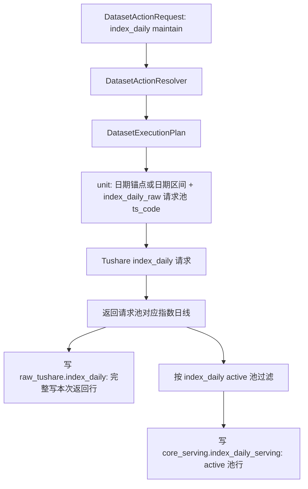
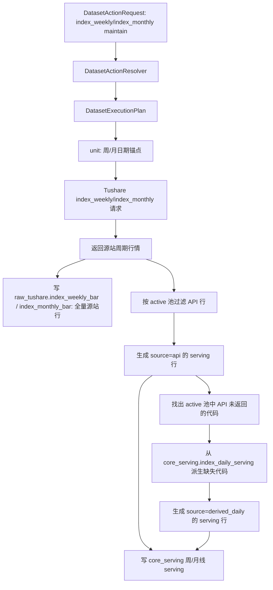
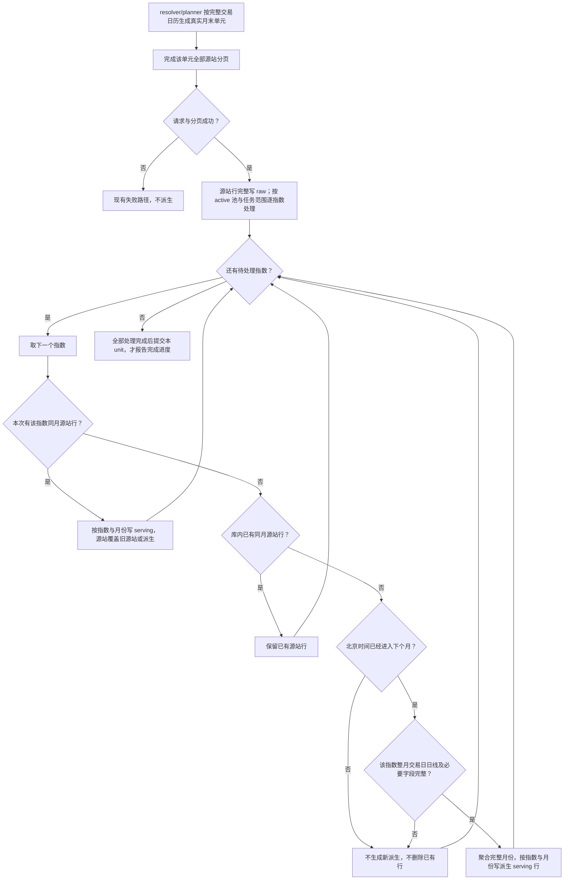

# 指数行情 raw / serving 分层语义对齐改造方案 v1

状态：分层基线已实施；指数月线完整月份与覆盖修复已确认，待开发
创建日期：2026-05-05
修订日期：2026-09-04
适用范围：`index_daily`、`index_weekly`、`index_monthly`

> 本次只更新技术方案，不修改代码或生产数据。第 11 节是 2026-09-04 确认的指数月线修复口径，尚未实现。原分层改造记录不代表此次修复已完成；日线、周线不因本次月线规则确认而扩大改造范围。

---

## 1. 目标

本方案只解决一件事：让指数日线、周线、月线的 raw 层和 serving 层名副其实。

目标口径：

1. `index_daily` 源站请求范围由 `ops.index_series_active resource='index_daily_raw'` 决定，按该请求池逐 `ts_code` 请求 Tushare。
2. raw 层对齐“本次源站请求返回事实”：请求返回多少，就写入多少，不按 serving active 池过滤，不写派生数据。
3. `core_serving` 层对齐平台服务事实：只服务 `ops.index_series_active resource='index_daily'` active 池中的指数代码。
4. 指数周线、月线的 serving 层以源站 API 数据优先。月线仅在自然月已经结束、成功完成源站请求但该指数当月无月线、库内也无源站月线、该指数整月日线完整时允许派生；详细规则见第 11 节。周线原有行为不在本次修复范围内。
5. 不引入新的领域概念，不新建表，不改 TaskRun，不改前端展示，不改 active 池模型。

说人话：

- raw 是“本次源站请求给我的原始事实”。
- serving 是“平台对外使用的业务事实”。
- `index_daily_raw` 池决定日线请求哪些指数；`index_daily` 池只作为 `core_serving` 入库门禁，不参与 raw 写入裁剪。
- 显式 `ts_code` 只是源站请求参数，不是绕过 active 池写入 `core_serving` 的特权。

---

## 2. 不做什么

本轮严禁掺杂以下事情：

1. 不调整 `ops.index_series_active` 的模型、来源、审阅流程。
2. 不新增用户自定义指数池、自动选池、active 池生成规则。
3. 不改 TaskRun 表、TaskRun view API、任务详情页面。
4. 不修改日期模型枚举或周线口径。本次月线修复按既有 `month_last_open_day` 纠正实际日期展开，不能继续把所选范围内的最后一天当成完整月末。
5. 不清空、不删除、不重建任何线上数据表。后续如需重建数据，必须另走用户明确指令、备份方案、逐表清单。
6. 不改其它数据集的 `raw_core_upsert` 行为。

---

## 3. 问题定位与当前确认口径

### 3.1 `index_daily`

当前定义位置：

- [src/foundation/datasets/definitions/index_series.py](/Users/congming/github/goldenshare/src/foundation/datasets/definitions/index_series.py)

历史关键配置：

```text
dataset_key = index_daily
raw_table = raw_tushare.index_daily
serving_table = core_serving.index_daily_serving
write_path = raw_core_upsert
unit_builder_key = build_index_daily_units
universe_policy = no_pool
```

当前确认配置：

```text
dataset_key = index_daily
raw_table = raw_tushare.index_daily
serving_table = core_serving.index_daily_serving
write_path = raw_index_daily_serving_upsert
unit_builder_key = build_index_daily_units
universe_policy = no_pool
request_pool = ops.index_series_active resource='index_daily_raw'
serving_gate = ops.index_series_active resource='index_daily'
```

当前执行行为：

1. `build_index_daily_units` 默认读取 `ops.index_series_active resource='index_daily_raw'`，把任务拆成多个 `ts_code` unit。
2. `_index_daily_params` 要求必须有 `ts_code`。
3. writer 使用 `raw_index_daily_serving_upsert`：同一批 `rows_normalized` 先完整写 raw，再按 `resource='index_daily'` active 池过滤写 serving。
4. 因为请求阶段按 `index_daily_raw` 池拆代码，raw 覆盖的是请求池返回事实；serving 覆盖的是 `index_daily` active 池命中的业务事实。

问题：

早期文档曾写过另一套“源站直取”口径。该口径已经废弃。当前确认口径是：用 `index_daily_raw` 请求池逐代码请求，raw 全写本次返回，serving 再由 `index_daily` active 池过滤。

### 3.2 `index_weekly` / `index_monthly`

当前定义位置：

- [src/foundation/datasets/definitions/index_series.py](/Users/congming/github/goldenshare/src/foundation/datasets/definitions/index_series.py)

当前关键配置：

```text
dataset_key = index_weekly / index_monthly
raw_table = raw_tushare.index_weekly_bar / raw_tushare.index_monthly_bar
serving_table = core_serving.index_weekly_serving / core_serving.index_monthly_serving
write_path = raw_index_period_serving_upsert
unit_builder_key = generic
```

当前写入行为位置：

- [src/foundation/ingestion/writer.py](/Users/congming/github/goldenshare/src/foundation/ingestion/writer.py)

原分层改造前的 `_write_index_period_serving` 行为（历史问题，不是当前代码）：

1. 读取 `resource='index_daily'` 的 active 池。
2. 先把 Tushare 返回行按 active 池过滤成 `filtered_rows`。
3. raw 表只写 `filtered_rows`。
4. serving 表写 `filtered_rows`，并把 active 池中 API 缺失的代码用日线派生补齐。

问题：

原分层改造前，raw 写入也被 active 池过滤，不符合源站事实层口径。当前代码已改为 raw 写全部返回行；2026-09-04 新确认的月线日期与覆盖缺陷另见第 11 节，不能把原分层验收理解成月线完整性已得到保证。

---

## 4. 目标写入流程

统一规则：

```text
源站请求结果
  -> normalize
  -> raw 写完整本次请求返回
  -> serving active 池过滤
  -> core_serving 只写 active 命中的数据
```

这条规则对 `index_daily`、`index_weekly`、`index_monthly` 一致适用。手动任务、自动任务、单个 `ts_code` 请求都不能绕过这条规则。

### 4.1 指数日线


```mermaid
flowchart TD
  A["DatasetActionRequest: index_daily maintain"] --> B["DatasetActionResolver"]
  B --> C["DatasetExecutionPlan"]
  C --> D["unit: 日期锚点或日期区间 + index_daily_raw 请求池 ts_code"]
  D --> E["Tushare index_daily 请求"]
  E --> F["返回请求池对应指数日线"]
  F --> G["写 raw_tushare.index_daily: 完整写本次返回行"]
  F --> H["按 index_daily active 池过滤"]
  H --> I["写 core_serving.index_daily_serving: active 池行"]
```

落地要点：

1. 默认维护按 `ops.index_series_active resource='index_daily_raw'` 拆 `ts_code` 请求。
2. `_index_daily_params` 必须带 `ts_code`，同时按单日或区间传 `trade_date` / `start_date,end_date`。
3. raw 写入完整 API 返回行，不再按 `resource='index_daily'` serving active 池裁剪。
4. serving 写入 raw 同批数据中命中 `resource='index_daily'` active 池的行。
5. 如果用户显式指定 `ts_code`，只影响源站请求范围；返回数据仍先写 raw，再经过 active 池门禁决定是否写入 serving。
6. 如果显式指定的 `ts_code` 不在 active 池，raw 可以写入，serving 必须不写入。

### 4.2 指数周线 / 月线

下图记录原分层流程。对于月线，图中“派生缺失代码”必须受第 11 节完整月份、整月日线校验与来源优先级约束；不能直接从“本次未返回”跳到派生。


```mermaid
flowchart TD
  A["DatasetActionRequest: index_weekly/index_monthly maintain"] --> B["DatasetActionResolver"]
  B --> C["DatasetExecutionPlan"]
  C --> D["unit: 周/月日期锚点"]
  D --> E["Tushare index_weekly/index_monthly 请求"]
  E --> F["返回源站周期行情"]
  F --> G["写 raw_tushare.index_weekly_bar / index_monthly_bar: 全量源站行"]
  F --> H["按 active 池过滤 API 行"]
  H --> I["生成 source=api 的 serving 行"]
  I --> J["找出 active 池中 API 未返回的代码"]
  J --> K["从 core_serving.index_daily_serving 派生缺失代码"]
  K --> L["生成 source=derived_daily 的 serving 行"]
  I --> M["写 core_serving 周/月线 serving"]
  L --> M
```

落地要点：

1. raw 写完整 API 返回行，不按 active 池过滤。
2. serving 继续只写 active 池。
3. serving 中 API 返回行标记 `source='api'`。
4. serving 中日线派生行标记 `source='derived_daily'`。
5. 对非 active 代码，不再记录为“业务规则过滤拒绝”；它们是合法 raw 源站事实，只是不进入 serving。
6. 显式 `ts_code` 请求也必须经过 active 池门禁；非 active 代码不能通过 API 行或日线派生写入 serving。

---

## 5. 代码改造方案

### 5.1 `index_daily` planner / request builder

涉及文件：

- [src/foundation/ingestion/unit_planner.py](/Users/congming/github/goldenshare/src/foundation/ingestion/unit_planner.py)
- [src/foundation/ingestion/request_builders.py](/Users/congming/github/goldenshare/src/foundation/ingestion/request_builders.py)
- [src/foundation/datasets/definitions/index_series.py](/Users/congming/github/goldenshare/src/foundation/datasets/definitions/index_series.py)

改造方向：

1. `index_daily` 默认维护 unit 由 `resource='index_daily_raw'` 请求池展开。
2. `index_daily` 默认请求参数必须带 `ts_code`。
3. `index_daily` 仍保留显式 `ts_code` 输入能力；显式输入只表示源站局部请求范围，不表示 serving 写入特权。
4. DatasetDefinition 当前为 `universe_policy='no_pool'`，但 custom unit builder 会读取 `index_daily_raw` 请求池；如后续要把该来源写入 `planning.universe`，必须单独立项，不能在本方案中顺手改。

边界：

- 不改 active 池表。
- 不改其它使用 `raw_core_upsert` 的数据集。
- 不把 serving 过滤逻辑放到 request builder；request builder 只负责源接口参数。

### 5.2 `index_daily` writer

涉及文件：

- [src/foundation/ingestion/writer.py](/Users/congming/github/goldenshare/src/foundation/ingestion/writer.py)
- [src/foundation/datasets/definitions/index_series.py](/Users/congming/github/goldenshare/src/foundation/datasets/definitions/index_series.py)

改造方向：

1. 为 `index_daily` 使用独立写入分支，避免改动通用 `raw_core_upsert`。
2. raw DAO 写入完整 `batch.rows_normalized`。
3. serving DAO 只写 active 池过滤后的行。
4. raw 写入与 serving 写入仍属于同一个 planned unit 的业务数据事务。
5. 当前 `_resolve_active_index_codes()` 只读取 `resource='index_daily'`，为空时 serving 不写入；不存在回退到 `index_basic` 的路径。本次不改变对象池规则。
6. 显式 `ts_code` 返回非 active 数据时，writer 只写 raw，不写 serving。

说明：

这里不是新增业务概念，只是把 `index_daily` 的写入实现从通用“raw/core 同批同口径”里拆出来，因为它现在明确需要 raw 与 serving 不同口径。

### 5.3 `index_weekly` / `index_monthly` writer

涉及文件：

- [src/foundation/ingestion/writer.py](/Users/congming/github/goldenshare/src/foundation/ingestion/writer.py)

改造方向：

1. `_write_index_period_serving` 保留为周线/月线唯一写入入口。
2. `batch.rows_normalized` 全量写 raw。
3. active 池过滤只用于 serving。
4. `full_date_refresh` 清理 raw 时，按全量 API 返回行的 `trade_date` 清理 raw，而不是按 active 过滤后的行。
5. 月线 serving 的 replace / insert 必须按第 11 节统一“指数 + 月份”身份及来源优先级；不能继续仅按本次 `trade_date` 替换。周线保持既有行为并做共享函数回归。
6. 取消把非 active 源站行计入 `write.filtered_by_business_rule:ts_code` 的行为。
7. 显式 `ts_code` 请求如果不在 active 池，只允许写 raw，不允许写 serving，也不允许触发日线派生写入 serving。

边界：

- 不改 OHLC、成交量、成交额等聚合公式；本次只为月线补齐派生资格检查与同月替换规则，不改变周线派生行为。
- 不改 `period_start_date` 计算。
- 不改 TaskRun 的来源统计，TaskRun 仍只读最终 serving 表。

---

## 6. 历史数据处理边界

原分层改造曾提出六张表清空重建建议，该建议是历史方案，不是本次月线修复的前置条件或执行授权，不得按旧清单执行。

本次修复依靠同一指数、同一月份的正常覆盖写入校正旧派生记录，不要求清空 raw 或 serving。未获得有效替代结果时，不删除已有记录；不符合新规则的旧派生记录也不能被误认为已经校正。若需单独清理历史错误数据，必须另获用户明确授权，并列出备份方案和逐表、逐月范围。

---

## 7. 验收标准

### 7.1 表语义验收

1. `raw_tushare.index_daily` 可以包含不在 `resource='index_daily'` serving active 池内、但在 `resource='index_daily_raw'` 请求池或显式请求范围内的指数。
2. `raw_tushare.index_weekly_bar` 可以包含非 active 池指数。
3. `raw_tushare.index_monthly_bar` 可以包含非 active 池指数。
4. `core_serving.index_daily_serving` 只能包含 active 池指数。
5. `core_serving.index_weekly_serving` 只能包含 active 池指数。
6. `core_serving.index_monthly_serving` 只能包含 active 池指数。
7. 显式同步非 active `ts_code` 时，raw 可以新增或更新，`core_serving` 不得新增或更新该代码。

### 7.2 周线/月线来源验收

1. `core_serving.index_weekly_serving.source='api'` 表示来自 Tushare 周线接口。
2. `core_serving.index_weekly_serving.source='derived_daily'` 表示由日线 serving 派生。
3. `core_serving.index_monthly_serving.source='api'` 表示来自 Tushare 月线接口。
4. `core_serving.index_monthly_serving.source='derived_daily'` 表示由日线 serving 派生。
5. 同一个 active 指数同一个周期只能有一条 serving 结果。

### 7.3 任务观测验收

1. TaskRun 详情页周线/月线来源统计仍来自最终 serving 表。
2. TaskRun 观测不参与 raw/serving 写入决策。
3. TaskRun 状态写入失败不得影响 raw/serving 业务数据事务。

---

## 8. 测试计划

### 8.1 单元测试

建议新增或更新测试覆盖：

1. `index_daily` 默认请求按 `resource='index_daily_raw'` 请求池展开代码。
2. `index_daily` 默认请求参数必须带 `ts_code`。
3. `index_daily` writer：raw 全写本次返回，serving 只写 active。
4. `index_weekly` writer：raw 写全量，serving 只写 active + derived。
5. `index_monthly` writer：raw 写全量，serving 只写 active + derived。
6. 非 active 源站行不计入 rejected reason。
7. 显式非 active `ts_code` 请求不会写穿 `core_serving`。

### 8.2 回归测试

最低回归门禁：

```bash
pytest -q tests/test_dataset_definition_registry.py tests/test_dataset_action_resolver.py
pytest -q tests/architecture/test_subsystem_dependency_matrix.py
pytest -q tests/architecture/test_dataset_runtime_registry_guardrails.py
```

如涉及 writer 测试，补充对应 writer 专项测试后一起执行。

### 8.3 文档门禁

```bash
python3 scripts/check_docs_integrity.py
```

---

## 9. 原分层改造里程碑（历史记录）

本节不作为 2026-09-04 月线修复的执行清单；此次修复按第 11.7 节推进。

### M1：方案评审

交付物：

- 本方案文档。

验收：

- raw / serving 目标口径确认。
- 不做范围确认。

### M2：测试先行

交付物：

- 覆盖 index daily 按 `index_daily_raw` 请求池展开、raw 全写本次返回、serving active 过滤的测试。
- 覆盖 index weekly/monthly raw 全量、serving active + derived 的测试。

验收：

- 测试能准确表达目标行为。
- 不改生产代码。

### M3：日线 planner/request/writer 收口

交付物：

- `index_daily` 默认按 `index_daily_raw` 请求池请求。
- `index_daily` raw 全写本次返回。
- `index_daily` serving 写 active。

验收：

- 单日任务 raw 与 serving code 集合允许不同：raw 可包含 `index_daily_raw` 请求池命中的非 serving active 代码。
- serving code 集合不超出 active 池。

### M4：周线/月线 writer 收口

交付物：

- `index_weekly` raw 写全量 API 返回。
- `index_monthly` raw 写全量 API 返回。
- 周线/月线 serving 保持 active + derived。

验收：

- raw 可包含非 active 源站行。
- serving 只包含 active 池。
- `source='api'/'derived_daily'` 语义不变。

### M5：文档同步

交付物：

- 更新 [指数行情 active 池与周/月线派生机制说明](/Users/congming/github/goldenshare/docs/datasets/index-series-active-sync-mechanism.md)。
- 如 DatasetDefinition 口径变更，更新相关架构/数据集文档。

验收：

- 文档不再说 raw 按 active 池过滤。
- 文档不误导后续开发。

### M6：数据重建执行清单

交付物：

- 逐表备份清单。
- 逐表清理清单。
- 重跑顺序。
- 验收 SQL。

验收：

- 只有在用户明确指令后才允许执行。
- 不把清表逻辑写进开发、迁移或测试脚本。

---

## 10. 风险控制

1. `raw_core_upsert` 是通用写入路径，不能为了 `index_daily` 改全局行为。
2. raw 全写本次请求返回后，raw 表行数可能高于 serving，这是目标结果，不是异常。
3. serving 仍受 active 池约束，因此前端、业务 API、审查中心默认不应直接消费 raw 表。
4. 周线/月线派生依赖日线 serving，因此重跑顺序必须是日线先完成，再跑周线和月线。
5. 任何清表、重建、远程执行都不属于本方案文档创建动作，必须单独确认。
6. `resource='index_daily'` active 池门禁只能放在 serving 写入前，不允许前移到 raw 写入前；日线源站请求范围由 `resource='index_daily_raw'` 请求池决定。

---

## 11. 指数月线完整月份与覆盖修复（2026-09-04 已确认，待开发）

### 11.1 事故证据与根因

以下是本次 Prod 只读审计结果，不代表修复已执行：

| 证据 | 已核实事实 |
| --- | --- |
| TaskRun 6891 | 2026-07-31 07:14:55 开始的手动月线任务，范围为 2026-04-30 至 2026-07-30；计划包含 7 月 30 日单元 |
| 交易日历 | SSE 的 2026-07-31 为开市日，7 月 30 日不是该月最后一个交易日 |
| 旧月线 | 1,212 条 7 月月线的 `trade_date=2026-07-30`、`source=derived_daily`，创建时间均为 2026-07-31 07:15:03，落在任务 6891 执行期间 |
| TaskRun 10869 | 2026-09-04 更新 2026-06-30 至 2026-09-01；6 月单元已提交，7 月 31 日单元发生写入失败；计划还错误包含 9 月 1 日单元 |
| 冲突记录 | `000001.SH` 的旧行日期为 7 月 30 日、新行日期为 7 月 31 日，但所属月份均为 7 月；触发 `uq_index_monthly_serving_ts_period` |

根因分为三处：

1. `_resolve_anchors -> _compress_to_month_end` 只压缩用户区间内的开市日，把“所选范围内最后一天”当成“整个月最后交易日”。
2. `_build_index_period_derived_rows_for_single_code` 直接聚合已有日线，没有检查自然月已结束，也没有校验整月交易日日线是否完整。
3. 全范围分支 `_replace_index_period_serving_rows_by_trade_dates` 只删除本次日期的旧行再插入，遗漏同月份、不同截至日期的旧派生记录。单代码分支与全范围分支因此没有遵守同一周期身份。

### 11.2 月份与日期硬口径

1. “月份已经过完”以实际执行时间的北京时间判断：已经进入目标月份的下一个自然月。用户把结束日期填到月末或未来，不能提前放行派生。
2. 即使当月最后一个交易日已经收盘、日线已经齐全，只要尚未进入下个月，也不派生当月月线。这是已确认的保守边界。
3. 月线 `trade_date` 必须是完整交易日历中该月最后一个开市日，不是用户区间中的最后一个开市日；`period_start_date` 沿用该月第一个开市日，不改变现有字段含义。
4. 区间维护只能选取落在用户范围内的真实月末交易日，不能把被截断的月份拼成月线。例如区间结束于 7 月 30 日，不生成 7 月单元；结束于 9 月 1 日，不生成 9 月 1 日月线单元。
5. 单日维护也不能把任意交易日当月末。日期判断必须留在 resolver/planner，不在 Ops、页面或 request builder 另算一套。
6. 月份结束门禁控制的是“日线派生”。本次不禁止 raw 保存成功取得的源站事实，也不新增源站请求参数或调整工作流、自动任务配置。

运维影响：月末当天任务仍可接收源站月线，但缺失指数不会当场派生；最早下个月再次维护该月份时才具备派生资格。同步日线不会自动触发月线重算，本次不新增自动补跑机制。

### 11.3 派生资格：逐指数、逐月份检查

以下条件必须全部满足，才允许为该指数派生月线：

1. 指数属于既有 `resource='index_daily'` serving active 池，且属于本次任务处理范围。
2. 目标自然月已经结束，目标日期是该月真实最后一个交易日，交易日历足以确定完整月份。
3. 本次 Tushare 请求成功且所有分页完成；成功结果中没有该指数对应月份的月线。网络异常、限流、请求或分页失败不是“源站无数据”，必须沿现有错误路径处理，不能改走派生假装成功。
4. 库中没有该指数同月份的 `source='api'` 月线。本次未返回不代表之前取得的源站月线失效。
5. `core_serving.index_daily_serving` 中该指数当月应有的全部交易日日线齐全，包括月初、月中、月末；必须比较日期集合，不能仅看 `max(trade_date)` 或行数相等。
6. 参与 OHLC、涨跌与成交量额计算的必要字段有效，不能让 SQL 聚合忽略空值后悄悄生成不完整结果。不填零、不跨日补齐、不缩短月区间。

任何一项不满足，则不生成该指数当月的新派生行，不把该月份当作完整结果；其他符合条件的指数可以继续处理。不新增指数上市期间豁免、对象池自动调整或隐藏数据补录规则。

### 11.4 来源优先级与覆盖规则

月线业务身份统一为“指数代码 + 所属月份”，通过现有 `(ts_code, period_start_date)` 唯一约束表达；不能因新旧 `trade_date` 不同就保留两条同月记录。

| 库中状态 | 本次结果 | 目标行为 |
| --- | --- | --- |
| 已有派生月线 | 取得同月源站月线 | 源站覆盖派生，更新为 `source='api'`，校正截至日期与全部行情字段 |
| 已有源站月线 | 取得同月源站修订 | 覆盖为最新取得的源站事实，不保留重复月份行 |
| 已有源站月线 | 成功请求但本次未返回 | 保留原源站行，不删除，不降级为派生 |
| 无源站月线，可已有派生 | 本次无源站行且全部派生条件满足 | 新建或刷新派生月线，使用完整月份与真实月末日期 |
| 无源站月线 | 月份未结束、日线不全或必要字段无效 | 不新增派生，不以空结果清理已有行；旧派生若不合格，仍是待校正数据 |
| 任意状态 | 源站调用或分页失败 | 报告请求失败，不转派生；不以失败结果删除已有行 |

同月替换必须在同一个 unit 的业务事务内完成，替换失败回滚该 unit，旧行不能因先删后写失败而丢失；之前已提交的 unit 保留。不能移除唯一约束或用忽略冲突代替覆盖修正。手动、自动、单指数、全范围维护必须执行相同规则。

raw 只保存源站事实，派生只写 serving；Ops/TaskRun 观测写入不参与业务事务决定。

### 11.5 目标流程


```mermaid
flowchart TD
  A["resolver/planner 按完整交易日历生成真实月末单元"] --> B["完成该单元全部源站分页"]
  B --> C{"请求与分页成功？"}
  C -- 否 --> E["现有失败路径，不派生"]
  C -- 是 --> R["源站行完整写 raw；按 active 池与任务范围逐指数处理"]
  R --> N{"还有待处理指数？"}
  N -- 是 --> V["取下一个指数"]
  V --> D{"本次有该指数同月源站行？"}
  D -- 是 --> W["按指数与月份写 serving，源站覆盖旧源站或派生"]
  D -- 否 --> P{"库内已有同月源站行？"}
  P -- 是 --> K["保留已有源站行"]
  P -- 否 --> F{"北京时间已经进入下个月？"}
  F -- 否 --> S["不生成新派生，不删除已有行"]
  F -- 是 --> G{"该指数整月交易日日线及必要字段完整？"}
  G -- 否 --> S
  G -- 是 --> H["聚合完整月份，按指数与月份写派生 serving 行"]
  W --> N
  K --> N
  S --> N
  H --> N
  N -- 否 --> J["全部处理完成后提交本 unit，才报告完成进度"]
```

图中 raw 写入、serving 替换均在既有 unit 事务内，不表示 raw 已提前提交。空结果或不具备派生资格不授权整月清理；图中写入为目标实现，当前代码尚未具备全部门禁。

### 11.6 已核代码与影响边界

| 代码点 | 当前事实 / 后续修复责任 |
| --- | --- |
| `index_series.py` 的 `index_monthly` Definition | 已声明 `month_last_open_day`，无需新造日期模型；保持 active、raw/serving 路径与分页事实 |
| `DatasetUnitPlanner._resolve_anchors` / `_compress_to_month_end` | 修正截断范围导致伪月末的问题；不得通过改通用日历压缩函数误伤其他数据集 |
| `_index_monthly_params` | 继续只格式化计划中的日期与代码，不承接日期选择或月份完整性判断 |
| `DatasetWriter._write_index_period_serving` / 派生辅助方法 | 月线分支加入已结束月份、整月日线与必要字段检查，检查已有 API 行；周线行为不随本次扩大修改 |
| 月线 serving replace 方法 / `IndexMonthlyServing` | 按现有月份身份统一覆盖，保留主键和月份唯一约束，不新增表或迁移 |
| `IngestionExecutor` / TaskRun | 保留既有 unit 提交、失败回滚和观测隔离，不改调度、页面或公共 API |

已通过 CodeGraph `codegraph_callers` 核对：日期入口被 generic、成分和其他数据集 planner 复用；按日期替换方法由 `_write_index_period_serving` 调用，而该入口同时服务周线和月线。实施前必须再次读取当前代码和测试，不能直接全局替换共享行为。

### 11.7 后续实施顺序与验收

本轮只落文档。后续获得开发指令后，按以下顺序实施：

1. 先补能复现 task 6891 截断月末与 task 10869 同月冲突的测试，再锁定月线共享函数影响面。
2. 修正月线实际月末规划与单日校验，不改源接口字段、周线或其他数据集日期语义。
3. 增加月线派生资格检查，再统一同月来源优先级与事务内替换。
4. 跑 planner、writer、真实数据库唯一约束、事务与共享周线回归；文档状态只有在开发与验证完成后才能升级。

必须覆盖的验收用例：

| 场景 | 预期 |
| --- | --- |
| 实际 7 月执行，输入结束日期填到 7 月末或更晚 | 不提前派生 7 月月线 |
| 7 月末当日收盘后，最后交易日日线齐全 | 尚未跨自然月，仍不派生 |
| 8 月执行 7 月末维护，源站无该指数月线，整月日线完整 | 允许派生，日期为 7 月真实最后交易日 |
| 范围截至 7 月 30 日或 9 月 1 日 | 不生成伪月末 7 月 30 日或 9 月 1 日单元 |
| 月底为周末或节假日 | 锚点仍取完整交易日历的最后开市日，派生仍等待进入下个自然月 |
| 月末日线缺失，或月末存在但月中缺一天 | 该指数不派生；其他完整指数不受影响 |
| 日期集合齐全，但聚合必要字段缺失 | 不生成看似完整的月线，不填零替代 |
| 源站请求报错，或前页成功后后页失败 | 不按空结果派生，不写部分分页结果 |
| 已有7月30日派生，取得7月31日源站月线 | 原子覆盖为同月唯一的源站月线，不报月份唯一键冲突 |
| 已有源站月线，本次空返回；或源站后来修订字段 | 空返回保留原行；修订时正确覆盖 |
| 已有派生，日线后来补齐或修订 | 满足完整性规则后重跑可更新派生；不覆盖已有 API 行 |
| serving 替换失败 | 当前 unit 回滚保留旧行，先前成功 unit 不回滚 |
| 单指数/全范围、手动/自动、非 active 代码 | 来源优先级一致；非 active 代码不能写 serving 或派生 |
| 周线及其他共享 planner 消费者 | 保持原行为，不因月线修复变更范围或日期规则 |

生产部署、历史月份重跑和数据清理均不属于本轮文档修改；没有自动清表或自动补跑授权。不满足新规则的旧派生数据须如实保留待校正状态，不能仅因文档更新就宣称历史数据已修复。
