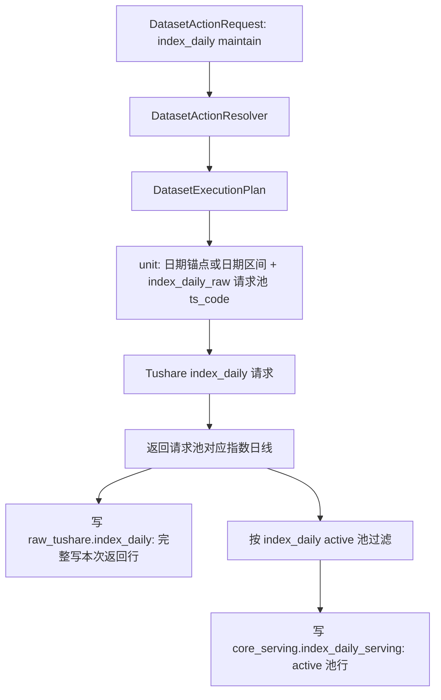
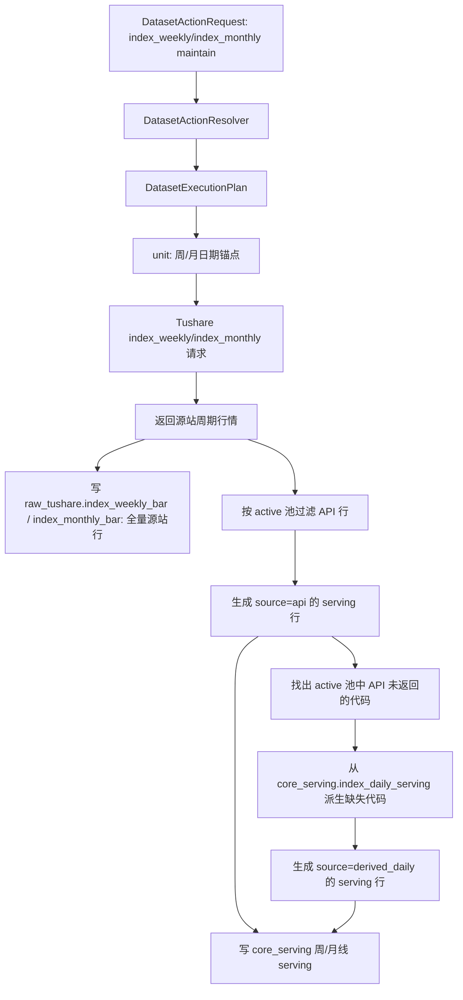

# 指数行情 raw / serving 分层语义对齐改造方案 v1

状态：已实施
创建日期：2026-05-05
适用范围：`index_daily`、`index_weekly`、`index_monthly`

---

## 1. 目标

本方案只解决一件事：让指数日线、周线、月线的 raw 层和 serving 层名副其实。

目标口径：

1. `index_daily` 源站请求范围由 `ops.index_series_active resource='index_daily_raw'` 决定，按该请求池逐 `ts_code` 请求 Tushare。
2. raw 层对齐“本次源站请求返回事实”：请求返回多少，就写入多少，不按 serving active 池过滤，不写派生数据。
3. `core_serving` 层对齐平台服务事实：只服务 `ops.index_series_active resource='index_daily'` active 池中的指数代码。
4. 指数周线、月线的 serving 层继续按现有机制补齐 active 池：源站有则用源站 API 数据，源站没有则由日线 serving 数据派生。
5. 不引入新的领域概念，不新建表，不改 TaskRun，不改前端展示，不改 active 池模型。

说人话：

- raw 是“本次源站请求给我的原始事实”。
- serving 是“平台对外使用的业务事实”。
- `index_daily_raw` 池决定日线请求哪些指数；`index_daily` 池只作为 `core_serving` 入库门禁，不参与 raw 写入裁剪。
- 显式 `ts_code` 只是源站请求参数，不是绕过 active 池写入 `core_serving` 的特权。

---

## 2. 不做什么

本轮严禁掺杂以下事情：

1. 不调整 `ops.index_series_active` 的模型、来源、审阅流程。
2. 不新增用户自定义指数池、自动选池、active 池生成规则。
3. 不改 TaskRun 表、TaskRun view API、任务详情页面。
4. 不改日期模型，不改周线/月线锚点口径。
5. 不清空、不删除、不重建任何线上数据表。后续如需重建数据，必须另走用户明确指令、备份方案、逐表清单。
6. 不改其它数据集的 `raw_core_upsert` 行为。

---

## 3. 问题定位与当前确认口径

### 3.1 `index_daily`

当前定义位置：

- [src/foundation/datasets/definitions/index_series.py](/Users/congming/github/goldenshare/src/foundation/datasets/definitions/index_series.py)

历史关键配置：

```text
dataset_key = index_daily
raw_table = raw_tushare.index_daily
serving_table = core_serving.index_daily_serving
write_path = raw_core_upsert
unit_builder_key = build_index_daily_units
universe_policy = no_pool
```

当前确认配置：

```text
dataset_key = index_daily
raw_table = raw_tushare.index_daily
serving_table = core_serving.index_daily_serving
write_path = raw_index_daily_serving_upsert
unit_builder_key = build_index_daily_units
universe_policy = no_pool
request_pool = ops.index_series_active resource='index_daily_raw'
serving_gate = ops.index_series_active resource='index_daily'
```

当前执行行为：

1. `build_index_daily_units` 默认读取 `ops.index_series_active resource='index_daily_raw'`，把任务拆成多个 `ts_code` unit。
2. `_index_daily_params` 要求必须有 `ts_code`。
3. writer 使用 `raw_index_daily_serving_upsert`：同一批 `rows_normalized` 先完整写 raw，再按 `resource='index_daily'` active 池过滤写 serving。
4. 因为请求阶段按 `index_daily_raw` 池拆代码，raw 覆盖的是请求池返回事实；serving 覆盖的是 `index_daily` active 池命中的业务事实。

问题：

早期文档曾写过另一套“源站直取”口径。该口径已经废弃。当前确认口径是：用 `index_daily_raw` 请求池逐代码请求，raw 全写本次返回，serving 再由 `index_daily` active 池过滤。

### 3.2 `index_weekly` / `index_monthly`

当前定义位置：

- [src/foundation/datasets/definitions/index_series.py](/Users/congming/github/goldenshare/src/foundation/datasets/definitions/index_series.py)

当前关键配置：

```text
dataset_key = index_weekly / index_monthly
raw_table = raw_tushare.index_weekly_bar / raw_tushare.index_monthly_bar
serving_table = core_serving.index_weekly_serving / core_serving.index_monthly_serving
write_path = raw_index_period_serving_upsert
unit_builder_key = generic
```

当前写入行为位置：

- [src/foundation/ingestion/writer.py](/Users/congming/github/goldenshare/src/foundation/ingestion/writer.py)

当前 `_write_index_period_serving` 行为：

1. 读取 `resource='index_daily'` 的 active 池。
2. 先把 Tushare 返回行按 active 池过滤成 `filtered_rows`。
3. raw 表只写 `filtered_rows`。
4. serving 表写 `filtered_rows`，并把 active 池中 API 缺失的代码用日线派生补齐。

问题：

周线/月线 serving 口径是对的，但 raw 写入也被 active 池过滤了，所以 raw 不是源站事实。

---

## 4. 目标写入流程

统一规则：

```text
源站请求结果
  -> normalize
  -> raw 写完整本次请求返回
  -> serving active 池过滤
  -> core_serving 只写 active 命中的数据
```

这条规则对 `index_daily`、`index_weekly`、`index_monthly` 一致适用。手动任务、自动任务、单个 `ts_code` 请求都不能绕过这条规则。

### 4.1 指数日线


```mermaid
flowchart TD
  A["DatasetActionRequest: index_daily maintain"] --> B["DatasetActionResolver"]
  B --> C["DatasetExecutionPlan"]
  C --> D["unit: 日期锚点或日期区间 + index_daily_raw 请求池 ts_code"]
  D --> E["Tushare index_daily 请求"]
  E --> F["返回请求池对应指数日线"]
  F --> G["写 raw_tushare.index_daily: 完整写本次返回行"]
  F --> H["按 index_daily active 池过滤"]
  H --> I["写 core_serving.index_daily_serving: active 池行"]
```

落地要点：

1. 默认维护按 `ops.index_series_active resource='index_daily_raw'` 拆 `ts_code` 请求。
2. `_index_daily_params` 必须带 `ts_code`，同时按单日或区间传 `trade_date` / `start_date,end_date`。
3. raw 写入完整 API 返回行，不再按 `resource='index_daily'` serving active 池裁剪。
4. serving 写入 raw 同批数据中命中 `resource='index_daily'` active 池的行。
5. 如果用户显式指定 `ts_code`，只影响源站请求范围；返回数据仍先写 raw，再经过 active 池门禁决定是否写入 serving。
6. 如果显式指定的 `ts_code` 不在 active 池，raw 可以写入，serving 必须不写入。

### 4.2 指数周线 / 月线


```mermaid
flowchart TD
  A["DatasetActionRequest: index_weekly/index_monthly maintain"] --> B["DatasetActionResolver"]
  B --> C["DatasetExecutionPlan"]
  C --> D["unit: 周/月日期锚点"]
  D --> E["Tushare index_weekly/index_monthly 请求"]
  E --> F["返回源站周期行情"]
  F --> G["写 raw_tushare.index_weekly_bar / index_monthly_bar: 全量源站行"]
  F --> H["按 active 池过滤 API 行"]
  H --> I["生成 source=api 的 serving 行"]
  I --> J["找出 active 池中 API 未返回的代码"]
  J --> K["从 core_serving.index_daily_serving 派生缺失代码"]
  K --> L["生成 source=derived_daily 的 serving 行"]
  I --> M["写 core_serving 周/月线 serving"]
  L --> M
```

落地要点：

1. raw 写完整 API 返回行，不按 active 池过滤。
2. serving 继续只写 active 池。
3. serving 中 API 返回行标记 `source='api'`。
4. serving 中日线派生行标记 `source='derived_daily'`。
5. 对非 active 代码，不再记录为“业务规则过滤拒绝”；它们是合法 raw 源站事实，只是不进入 serving。
6. 显式 `ts_code` 请求也必须经过 active 池门禁；非 active 代码不能通过 API 行或日线派生写入 serving。

---

## 5. 代码改造方案

### 5.1 `index_daily` planner / request builder

涉及文件：

- [src/foundation/ingestion/unit_planner.py](/Users/congming/github/goldenshare/src/foundation/ingestion/unit_planner.py)
- [src/foundation/ingestion/request_builders.py](/Users/congming/github/goldenshare/src/foundation/ingestion/request_builders.py)
- [src/foundation/datasets/definitions/index_series.py](/Users/congming/github/goldenshare/src/foundation/datasets/definitions/index_series.py)

改造方向：

1. `index_daily` 默认维护 unit 由 `resource='index_daily_raw'` 请求池展开。
2. `index_daily` 默认请求参数必须带 `ts_code`。
3. `index_daily` 仍保留显式 `ts_code` 输入能力；显式输入只表示源站局部请求范围，不表示 serving 写入特权。
4. DatasetDefinition 当前为 `universe_policy='no_pool'`，但 custom unit builder 会读取 `index_daily_raw` 请求池；如后续要把该来源写入 `planning.universe`，必须单独立项，不能在本方案中顺手改。

边界：

- 不改 active 池表。
- 不改其它使用 `raw_core_upsert` 的数据集。
- 不把 serving 过滤逻辑放到 request builder；request builder 只负责源接口参数。

### 5.2 `index_daily` writer

涉及文件：

- [src/foundation/ingestion/writer.py](/Users/congming/github/goldenshare/src/foundation/ingestion/writer.py)
- [src/foundation/datasets/definitions/index_series.py](/Users/congming/github/goldenshare/src/foundation/datasets/definitions/index_series.py)

改造方向：

1. 为 `index_daily` 使用独立写入分支，避免改动通用 `raw_core_upsert`。
2. raw DAO 写入完整 `batch.rows_normalized`。
3. serving DAO 只写 active 池过滤后的行。
4. raw 写入与 serving 写入仍属于同一个 planned unit 的业务数据事务。
5. active 池为空时继续沿用当前 `_resolve_active_index_codes()` 行为：先读 `ops.index_series_active`，为空再 fallback 到 `index_basic` 未终止指数。
6. 显式 `ts_code` 返回非 active 数据时，writer 只写 raw，不写 serving。

说明：

这里不是新增业务概念，只是把 `index_daily` 的写入实现从通用“raw/core 同批同口径”里拆出来，因为它现在明确需要 raw 与 serving 不同口径。

### 5.3 `index_weekly` / `index_monthly` writer

涉及文件：

- [src/foundation/ingestion/writer.py](/Users/congming/github/goldenshare/src/foundation/ingestion/writer.py)

改造方向：

1. `_write_index_period_serving` 保留为周线/月线唯一写入入口。
2. `batch.rows_normalized` 全量写 raw。
3. active 池过滤只用于 serving。
4. `full_date_refresh` 清理 raw 时，按全量 API 返回行的 `trade_date` 清理 raw，而不是按 active 过滤后的行。
5. serving 的 replace / insert 逻辑继续按现有 `source='api'` + `source='derived_daily'` 合并规则执行。
6. 取消把非 active 源站行计入 `write.filtered_by_business_rule:ts_code` 的行为。
7. 显式 `ts_code` 请求如果不在 active 池，只允许写 raw，不允许写 serving，也不允许触发日线派生写入 serving。

边界：

- 不改周线/月线派生算法。
- 不改 `period_start_date` 计算。
- 不改 TaskRun 的来源统计，TaskRun 仍只读最终 serving 表。

---

## 6. 数据重建方案

代码改完后，历史数据要想完全符合新语义，必须重建指数三张 raw 表与三张 serving 表。

但本方案文档不执行任何清表动作。后续如果要重建，必须单独获得用户明确指令，并先列出备份和清理清单。

建议重建顺序：

```text
1. 备份 raw_tushare.index_daily
2. 备份 raw_tushare.index_weekly_bar
3. 备份 raw_tushare.index_monthly_bar
4. 备份 core_serving.index_daily_serving
5. 备份 core_serving.index_weekly_serving
6. 备份 core_serving.index_monthly_serving
7. 清空上述 6 张表
8. 重跑 index_daily
9. 重跑 index_weekly
10. 重跑 index_monthly
```

原因：

1. 周线/月线 serving 派生依赖日线 serving。
2. raw 语义变化后，旧 raw 数据无法通过增量自然修正为请求池完整返回事实。
3. serving 语义虽然已基本接近目标，但为避免新旧写法混杂，建议与 raw 一起重建。

---

## 7. 验收标准

### 7.1 表语义验收

1. `raw_tushare.index_daily` 可以包含不在 `resource='index_daily'` serving active 池内、但在 `resource='index_daily_raw'` 请求池或显式请求范围内的指数。
2. `raw_tushare.index_weekly_bar` 可以包含非 active 池指数。
3. `raw_tushare.index_monthly_bar` 可以包含非 active 池指数。
4. `core_serving.index_daily_serving` 只能包含 active 池指数。
5. `core_serving.index_weekly_serving` 只能包含 active 池指数。
6. `core_serving.index_monthly_serving` 只能包含 active 池指数。
7. 显式同步非 active `ts_code` 时，raw 可以新增或更新，`core_serving` 不得新增或更新该代码。

### 7.2 周线/月线来源验收

1. `core_serving.index_weekly_serving.source='api'` 表示来自 Tushare 周线接口。
2. `core_serving.index_weekly_serving.source='derived_daily'` 表示由日线 serving 派生。
3. `core_serving.index_monthly_serving.source='api'` 表示来自 Tushare 月线接口。
4. `core_serving.index_monthly_serving.source='derived_daily'` 表示由日线 serving 派生。
5. 同一个 active 指数同一个周期只能有一条 serving 结果。

### 7.3 任务观测验收

1. TaskRun 详情页周线/月线来源统计仍来自最终 serving 表。
2. TaskRun 观测不参与 raw/serving 写入决策。
3. TaskRun 状态写入失败不得影响 raw/serving 业务数据事务。

---

## 8. 测试计划

### 8.1 单元测试

建议新增或更新测试覆盖：

1. `index_daily` 默认请求按 `resource='index_daily_raw'` 请求池展开代码。
2. `index_daily` 默认请求参数必须带 `ts_code`。
3. `index_daily` writer：raw 全写本次返回，serving 只写 active。
4. `index_weekly` writer：raw 写全量，serving 只写 active + derived。
5. `index_monthly` writer：raw 写全量，serving 只写 active + derived。
6. 非 active 源站行不计入 rejected reason。
7. 显式非 active `ts_code` 请求不会写穿 `core_serving`。

### 8.2 回归测试

最低回归门禁：

```bash
pytest -q tests/test_dataset_definition_registry.py tests/test_dataset_action_resolver.py
pytest -q tests/architecture/test_subsystem_dependency_matrix.py
pytest -q tests/architecture/test_dataset_runtime_registry_guardrails.py
```

如涉及 writer 测试，补充对应 writer 专项测试后一起执行。

### 8.3 文档门禁

```bash
python3 scripts/check_docs_integrity.py
```

---

## 9. 实施里程碑

### M1：方案评审

交付物：

- 本方案文档。

验收：

- raw / serving 目标口径确认。
- 不做范围确认。

### M2：测试先行

交付物：

- 覆盖 index daily 按 `index_daily_raw` 请求池展开、raw 全写本次返回、serving active 过滤的测试。
- 覆盖 index weekly/monthly raw 全量、serving active + derived 的测试。

验收：

- 测试能准确表达目标行为。
- 不改生产代码。

### M3：日线 planner/request/writer 收口

交付物：

- `index_daily` 默认按 `index_daily_raw` 请求池请求。
- `index_daily` raw 全写本次返回。
- `index_daily` serving 写 active。

验收：

- 单日任务 raw 与 serving code 集合允许不同：raw 可包含 `index_daily_raw` 请求池命中的非 serving active 代码。
- serving code 集合不超出 active 池。

### M4：周线/月线 writer 收口

交付物：

- `index_weekly` raw 写全量 API 返回。
- `index_monthly` raw 写全量 API 返回。
- 周线/月线 serving 保持 active + derived。

验收：

- raw 可包含非 active 源站行。
- serving 只包含 active 池。
- `source='api'/'derived_daily'` 语义不变。

### M5：文档同步

交付物：

- 更新 [指数行情 active 池与周/月线派生机制说明](/Users/congming/github/goldenshare/docs/datasets/index-series-active-sync-mechanism.md)。
- 如 DatasetDefinition 口径变更，更新相关架构/数据集文档。

验收：

- 文档不再说 raw 按 active 池过滤。
- 文档不误导后续开发。

### M6：数据重建执行清单

交付物：

- 逐表备份清单。
- 逐表清理清单。
- 重跑顺序。
- 验收 SQL。

验收：

- 只有在用户明确指令后才允许执行。
- 不把清表逻辑写进开发、迁移或测试脚本。

---

## 10. 风险控制

1. `raw_core_upsert` 是通用写入路径，不能为了 `index_daily` 改全局行为。
2. raw 全写本次请求返回后，raw 表行数可能高于 serving，这是目标结果，不是异常。
3. serving 仍受 active 池约束，因此前端、业务 API、审查中心默认不应直接消费 raw 表。
4. 周线/月线派生依赖日线 serving，因此重跑顺序必须是日线先完成，再跑周线和月线。
5. 任何清表、重建、远程执行都不属于本方案文档创建动作，必须单独确认。
6. `resource='index_daily'` active 池门禁只能放在 serving 写入前，不允许前移到 raw 写入前；日线源站请求范围由 `resource='index_daily_raw'` 请求池决定。
