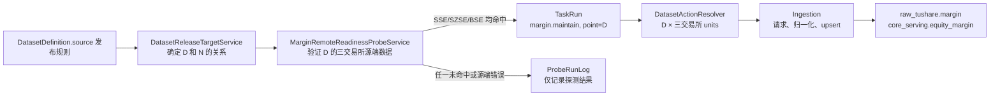

# 融资融券交易汇总（`margin`）数据集开发与源端发布探测方案

- 文档状态：已接入；源端发布时序改造已实现，待生产验收
- 最后审计：2026-08-01
- 数据集：`margin`（融资融券交易汇总）
- 源接口：`tushare.margin`
- 源站事实：[0058_融资融券交易汇总.md](/Users/congming/github/goldenshare/docs/sources/tushare/股票数据/两融及转融通/0058_融资融券交易汇总.md)
- 事实源：`DatasetDefinition`、`DatasetActionResolver`、`DatasetReleaseTargetService`、TaskRun / ProbeRunLog

---

## 1. 本次结论

`margin` 已完成数据集接入，但其自动维护时序此前定义错误：它被放入收盘后工作流，在业务日期当天请求；实际源站发布时间是**下一个开市日的上午**。

确认的业务规则：

> 对于开市日 `D` 的融资融券汇总，系统只能在下一个开市日 `N` 的上午探测源站；源站已完整返回后，正式维护任务处理的仍是 `D`，不是 `N`。

示例：

| `D` 数据所属交易日 | `N` 探测日期 | 正式任务日期 |
| --- | --- | --- |
| 周四 2026-07-30 | 周五 2026-07-31 上午 | 2026-07-30 |
| 周五 2026-07-31 | 周一 2026-08-03 上午 | 2026-07-31 |
| 节前最后一个开市日 | 节后第一个开市日上午 | 节前最后一个开市日 |

本次不改变 `margin` 的请求、归一化、落库或表结构。改造只调整“何时认为源端可用、何时创建正式维护任务”。

---

## 2. 已审计的当前实现

### 2.1 数据集事实与执行链路

| 项目 | 当前实现 | 结论 |
| --- | --- | --- |
| 数据集定义 | `market_equity.py` 的 `margin` Definition | 已定义为开市日、单日或区间、`trade_date` 观测 |
| 默认对象范围 | `exchange_id` 扇出 `SSE/SZSE/BSE` | 正确，自动维护必须保留三交易所全量口径 |
| 单元语义 | 一个交易日 × 一个交易所 | 正确 |
| 请求参数 | `_margin_params()` 生成 `trade_date=YYYYMMDD` 与单个 `exchange_id` | 正确，不允许 Ops 自行拼源接口参数 |
| 存储 | `raw_tushare.margin` 与 `core_serving.equity_margin` 同步 upsert | 正确，主键均为 `(trade_date, exchange_id)` |
| 手动维护 | 支持单日和区间 | 保留，不受本次影响 |

关键代码：

- [DatasetDefinition](/Users/congming/github/goldenshare/src/foundation/datasets/definitions/market_equity.py)
- [请求参数构建](/Users/congming/github/goldenshare/src/foundation/ingestion/request_builders.py)
- [raw 模型](/Users/congming/github/goldenshare/src/foundation/models/raw/raw_margin.py)

### 2.2 已确认的问题

1. `margin` 当前在 `daily_market_close_maintenance` 中执行；生产上存在两条收盘后工作流调度，分别在 `18:30`、`21:02` 触发。
2. 源端当时返回空列表时，通用 executor 会把空批次以 `0 fetched / 0 written / 0 rejected` 提交为成功；因此 TaskRun 表面成功，实际没有业务数据。
3. 生产 `raw_tushare.margin` 最新业务日期仍为 `2026-06-18`。`2026-06-22 ~ 2026-07-31` 的 30 个开市日均未落库。
4. 另有独立自动任务每天重复维护固定历史范围 `2026-05-11 ~ 2026-05-15`。该任务不涉及当前日期；由运营手动下掉，不进入本次代码改造。
5. 当前源站实测：`2026-07-30` 三交易所均可返回；`2026-07-31` 当时仅 SSE 可返回。由此证明“按单个交易所返回”不能作为该数据集的可用标准。

### 2.3 为什么不能沿用现有发布策略

当前发布策略只有：

| 策略 | 当前使用方 | 为什么不适合 `margin` |
| --- | --- | --- |
| `same_day` | 默认策略 | 会在 `D` 当天请求 `D`，早于融资融券汇总发布 |
| `next_calendar_day_0830` | `kpl_list` | 周五数据会指向周六，和“下一个开市日”不一致 |

现有 [DatasetReleaseTargetService](/Users/congming/github/goldenshare/src/ops/services/dataset_release_target_service.py) 和 [freshness 查询](/Users/congming/github/goldenshare/src/ops/queries/freshness_query_service.py) 目前只实现上述两种策略。因此不能复制 `kpl_list` 的自然日逻辑。

---

## 3. 目标架构与硬边界

### 3.1 职责分层



| 层级 | 负责内容 | 明确不负责 |
| --- | --- | --- |
| `DatasetDefinition.source` | 该源数据相对交易日的发布日期语义 | 自动任务窗口、页面文案、源接口参数 |
| `DatasetReleaseTargetService` | 从交易日历和当前时间得出可探测的目标业务日 | 请求 Tushare、写 TaskRun、写业务表 |
| Margin probe | 验证目标业务日的三交易所源端事实 | 直接写 raw/core、拼接正式源接口参数 |
| Ops schedule | 配置何时发起探测、多久探测一次 | 决定交易日归属、提前展开日期或参数 |
| `DatasetActionResolver` | 将 `point=D` 归一化为三个执行单元 | 保存调度状态、猜测源端发布时间 |
| request builder / writer | 生成源参数、写业务数据 | 解释发布日期、调度探测 |

### 3.2 本次硬约束

1. 正式任务必须使用 `margin.maintain + time_input={mode: point, trade_date: D}`；不得传 `N`。
2. 只有 SSE、SZSE、BSE 三者均返回 `trade_date=D` 时，才算源端就绪。
3. 探测 miss、源端异常、交易日历缺失都只能写 `ProbeRunLog`，不得创建 TaskRun，不得写业务表。
4. `margin` 必须退出 `daily_market_close_maintenance`。否则收盘后工作流会绕过探测条件，继续创建空任务。
5. `remote_margin_ready` 只允许绑定 `dataset_action: margin.maintain` 的纯探测模式；禁止 workflow、`schedule_probe_fallback`、固定日期、日期策略和交易所筛选。
6. 不新增状态表、业务表、API、迁移或第二套日期规则；所有状态仍使用既有 `ProbeRule / ProbeRunLog / TaskRun`。
7. Ops 状态写入与业务表事务隔离。Probe 日志失败不得阻断已创建 TaskRun；TaskRun 状态失败不得回滚 raw/core 业务数据。

---

## 4. 时间口径

日期语义与时钟边界必须分开，不能把“周五到周一”的规则写成一个脆弱的固定 cron。

### 4.1 已确认：源端发布时间截止点

发布截止时点确定为：**下一个开市日 09:30（Asia/Shanghai）**。

- `09:00` 前：不发起融资融券源端探测；数据尚未齐备时保持 `unconfirmed`。
- `09:00 ~ 09:30`：在探测窗口内验证前一个开市日 `D` 的三交易所源端数据。
- `09:30`：执行窗口内最后一次探测。
- `09:30` 后：若 `D` 仍未完整到库，freshness 才显示 `stale`；不得创建空数据 TaskRun。

该时间是数据集事实，收敛到 `DatasetDefinition.source.release_policy` 的明确枚举 `next_open_day_0930`，而不是散落在前端、snapshot 或自动任务中。不新增泛化配置字段，避免只为一个数据集引入难以审计的配置模型。

### 4.2 已确认：探测窗口

探测窗口确定为：**下一个开市日 `09:00 ~ 09:30`（Asia/Shanghai）**。

它是运营调度配置，不是数据集发布日期事实；探测服务只消费“当前是否处于窗口内”，不自行计算固定 cron。

约束：

- 探测窗口必须完全落在下一个开市日；非开市日不得探测。
- 窗口覆盖 `09:30` 截止点，避免截止前停止探测、截止后直接误报滞后。
- 每轮固定三次源端请求，开销极小；无需并发或分页。
- 纯探测触发不显示“执行时间”；页面只显示探测窗口和间隔。

### 4.3 已确认：探测间隔

探测间隔确定为：**每 5 分钟一次（`300` 秒）**。

- 探测轮次：`09:00`、`09:05`、`09:10`、`09:15`、`09:20`、`09:25`、`09:30`。
- 每轮请求：SSE、SZSE、BSE 各一次，共 3 次。
- 单个开市日最多：7 轮 × 3 次 = 21 次 Tushare 请求。
- `09:30` 是窗口的最后一轮，也是发布截止后的最终判定。

该间隔属于 Ops 调度配置，不写入 `DatasetDefinition`；但 `remote_margin_ready` 的服务端 binding 必须固定校验窗口 `09:00~09:30`、间隔 `300` 秒和每日最多触发 `1` 次，防止后续配置漂移。

---

## 5. 低层设计（LLD）

本节是已经确认的精确代码设计。`09:00 ~ 09:30`、`next_open_day_0930` 与 `300` 秒间隔均为固定口径。

### 5.1 Definition 与发布目标

涉及文件：

- `src/foundation/datasets/source_release_policies.py`
- `src/foundation/datasets/definitions/market_equity.py`
- `src/foundation/ingestion/linter.py`
- `src/ops/services/dataset_release_target_service.py`
- `src/ops/queries/freshness_query_service.py`

实现规则：

1. 在 source release policy 常量集中新增 `next_open_day_0930`；加入 `SUPPORTED_SOURCE_RELEASE_POLICIES`。
2. 仅为 `margin` 的 `DatasetDefinition.source.release_policy` 显式配置 `next_open_day_0930`；不得批量修改其他数据集。
3. `DatasetReleaseTargetService.resolve()` 对该策略：
   - 将 `now` 转为 `Asia/Shanghai`；
   - 只接受当前自然日为开市日；非开市日返回 `is_resolved=False`，不猜测周末目标；
   - 当前开市日为 `N` 时，返回 `N` 的前一个开市日 `D`；
   - 周一与节后首个开市日自然由交易日历得到上一个开市日；
   - 未找到前一个开市日时返回未解析结果，不请求源端；
   - `09:00` 起返回 `D`，供 probe 真实验证源端；
   - `is_release_due` 只在 `09:30` 起为真，表示 freshness 可以开始判迟。
4. `OpsFreshnessQueryService` 与 probe 共用同一个 `DatasetReleaseTargetService`。freshness 只在 `is_release_due=true` 后把 `D` 作为应到日期；此前显示 `unconfirmed`。
5. `release_policy` 不写入 `ops.dataset_status_snapshot`；snapshot 每次通过 Definition / projection 读取当前策略并计算结果。

### 5.2 `MarginRemoteReadinessProbeService`

新增文件：`src/ops/services/margin_remote_probe_service.py`。

常量：

```python
MARGIN_REMOTE_READY_CONDITION = "remote_margin_ready"
MARGIN_REMOTE_READY_LABEL = "源站已完整发布融资融券汇总"
MARGIN_ACTION_KEY = "margin.maintain"
MARGIN_DATASET_KEY = "margin"
MARGIN_REQUIRED_EXCHANGES = ("SSE", "SZSE", "BSE")
MARGIN_REMOTE_PROBE_FIELDS = ("trade_date", "exchange_id")
```

`evaluate(session, rule, current)` 的顺序：

1. 校验 rule 的数据集、动作、时间输入和筛选条件。
2. 调用 `DatasetReleaseTargetService.resolve()` 得到 `D`。
3. 未解析时返回 `matched=False`；`sample_request_count=0`，不调用 connector。
4. 对每个必需交易所构造 `DatasetActionRequest(dataset_key="margin", action="maintain", time_input=point(D), filters={"exchange_id": exchange})`。
5. 必须经 `DatasetActionResolver` 生成 unit，再从该 unit 的 `request_params` 调用 Tushare；只追加探测专用 `limit=1`、`offset=0`、`fields=(trade_date, exchange_id)`。
6. 每个返回行必须同时满足：`trade_date == D`、`exchange_id == 当前交易所`。空行、日期不符、交易所不符都记为该交易所未命中。
7. 三个交易所均命中才返回 `matched=True`；任意未命中返回 `matched=False`。
8. connector 抛错不在服务内吞掉；交由 `ProbeRuntimeService` 按现有语义记为 `ProbeRunLog.status=failed`，不创建 TaskRun。

结果 payload 必须包含：

```json
{
  "dataset_key": "margin",
  "condition_type": "remote_margin_ready",
  "business_date": "N",
  "target_trade_date": "D",
  "required_exchanges": ["SSE", "SZSE", "BSE"],
  "matched_exchanges": ["..."],
  "missing_exchanges": ["..."],
  "sample_request_count": 3,
  "sample_hits": [{"exchange_id": "SSE", "trade_date": "D"}],
  "message": "..."
}
```

该 payload 是 ProbeRunLog 的运行事实，用于页面解释，不是第二份数据集配置。

### 5.3 Probe binding 与 TaskRun runtime

涉及文件：

- `src/ops/services/schedule_probe_binding_service.py`
- `src/ops/services/operations_probe_runtime_service.py`

Binding 规则：

| 校验项 | 规则 | 原因 |
| --- | --- | --- |
| `target_type` | 只能是 `dataset_action` | 不允许工作流绕开源端判断 |
| `target_key` | 只能是 `margin.maintain` | 绑定数据集与维护语义唯一 |
| `trigger_mode` | 只能是 `probe` | 兜底定时会重引入空结果任务 |
| `filters` | 必须为空 | 单个交易所不代表汇总数据完整 |
| `calendar_policy` | 必须为空 | 数据归属由发布策略和交易日历决定 |
| 固定日期/区间 | 禁止 | `D` 必须由 release target 推导 |
| `window_start/window_end` | 固定 `09:00/09:30` | 只在下一个开市日上午等待源端发布 |
| `probe_interval_seconds` | 固定 `300` | 每 5 分钟探测一次，窗口内共 7 轮 |
| `max_triggers_per_day` | 固定为 1 | 同一 `D` 只创建一次正式任务 |

Runtime 规则：

1. `ProbeRuntimeService._evaluate_rule()` 注册 `remote_margin_ready` 分支。
2. `_remote_source_probe_action_key()`、label、binding error 增加 `margin` 映射。
3. `_enqueue_on_match()` 从 payload 读取 `target_trade_date=D`，创建 `time_input={mode: point, trade_date: D}` 的 TaskRun。
4. `_has_effective_target_task()` 将 `remote_margin_ready` 纳入按 `schedule_id + resource_key + action + D` 的去重范围。`queued/running/canceling/success/partial_success` 均为有效；`failed/canceled` 不阻止下一次探测重新入队。
5. 本轮探测命中且已有有效任务时，记录 `deduplicated` ProbeRunLog，不再创建第二条 TaskRun。
6. ProbeRunLog、TaskRun 与业务数据事务保持隔离；probe 不直接调用 writer。

### 5.4 工作流与自动任务页面

涉及文件：

- `src/ops/action_catalog.py`
- `frontend/src/pages/ops-v21-task-auto-tab.tsx`

实现规则：

1. 从 `daily_market_close_maintenance` 删除 `margin` step；只删除该一个步骤，不调整其他步骤顺序或内容。
2. 自动任务表单仅在 `dataset_action + margin.maintain` 时增加选项“源站已完整发布融资融券汇总”。
3. 选择该条件时只允许纯探测触发；显示“系统在下一个开市日上午依次验证 SSE、SZSE、BSE，全部返回前一开市日数据后才发起正式维护”。
4. 纯探测模式隐藏执行时间；窗口、间隔和每日最多触发次数固定展示为 `09:00~09:30 / 300 秒 / 1 次`，不可编辑。
5. 前端不自行计算 `D/N`、交易日或发布时间；只展示后端返回的 ProbeRunLog 与 schedule 配置。
6. 旧的固定历史范围自动任务由运营删除；部署代码不会自动删除、修改或清空任何运营配置或业务数据。

### 5.5 不改动的链路

以下内容必须保持原样：

- `DatasetActionResolver` 的交易日、交易所扇出和区间手动维护逻辑。
- `_margin_params()` 的单日 `trade_date + exchange_id` 参数生成逻辑。
- SourceClient 分页/限流机制。
- normalizer、writer、raw/core 模型、DAO、Alembic 与已有数据。
- `stk_mins`、`index_daily`、`index_mins`、`kpl_list`、`idx_factor_pro` 的探测条件和调度行为。

---

## 6. 测试与验收

### 6.1 单元与服务测试

| 测试组 | 必须证明的事实 |
| --- | --- |
| 发布目标服务 | 周五 -> 周一；节前 -> 节后首个开市日；非开市日不解析；09:00 起解析前一开市日供探测；09:30 前 freshness 不判迟，09:30 后开始判迟 |
| Definition / linter | 只有 `margin` 使用新增策略；非法策略触发 `invalid_source_release_policy` |
| freshness | 截止点前 `unconfirmed`；截止点后按 `D` 判断 `normal/stale`；snapshot 不保存策略副本 |
| Margin probe | 三交易所都返回 `D` 才命中；任一空/日期错/交易所错即 miss；未解析目标时零次源端请求；异常只记 failed probe log |
| 参数来源 | 三个探测请求均由 resolver unit 生成，分别带正确的单个 `exchange_id` 和 `trade_date=D` |
| runtime | 命中创建 `point=D` TaskRun；已有有效同日任务去重；失败/取消任务允许下一轮重新入队 |
| binding | 拒绝 workflow、fallback、筛选交易所、固定日期、日期策略和非 `margin.maintain` 目标 |
| workflow | `daily_market_close_maintenance` 不再含 `margin`，其余步骤不变 |

### 6.2 前端测试

1. `margin.maintain` 显示新的探测条件，其他数据集不显示。
2. 新条件只能以纯 probe 保存；不接受交易所筛选。
3. 纯探测不显示执行时间，只显示探测窗口与间隔。
4. 自动任务详情能读取既有 ProbeRunLog 的命中、miss、错误和缺失交易所说明。

### 6.3 最小真实验收

在首个可用日验证：

1. 选定目标 `D`，通过 Tushare MCP 分别确认三交易所都返回 `D`。
2. 执行一次 probe，确认只创建一个 `margin.maintain(point=D)` TaskRun。
3. 确认执行计划为三个 unit，分别对应 SSE、SZSE、BSE。
4. 确认 TaskRun 的 fetched/written 均为 3，`raw_tushare.margin` 与 `core_serving.equity_margin` 均新增或覆盖三个 `(D, exchange_id)` 键。
5. 同一日重复 probe 不再创建新 TaskRun。
6. 将一个交易所的 probe fake 为无返回，确认不创建 TaskRun，只留下可读的 miss 日志。
7. 注入 `09:00`、`09:05`、`09:30` 验证均允许探测；`08:59`、`09:31` 均不探测。
8. 验证服务端拒绝非 `09:00~09:30` 窗口、非 `300` 秒间隔与 `max_triggers_per_day != 1` 的自动任务配置。

---

## 7. 实施顺序与完成门禁

1. **M0：开发前复核。** 复核当前 migration head、release policy、probe binding/runtime、workflow 与前端消费者；不改业务数据。
2. **M1：发布策略。** 已实现：Definition、`next_open_day_0930`、linter、目标日期服务和 freshness 已收口。
3. **M2：严格源端探测。** 已实现：margin probe、固定窗口/间隔 binding、runtime、TaskRun 去重与后端测试已完成。
4. **M3：调度入口收口。** 已实现：每日收盘工作流已移除 `margin`，自动任务页面已增加固定探测条件与前端测试。
5. **M4：真实验收。** 待生产验收：使用三交易所实际返回验证；运营删除旧的固定历史范围任务，创建新的纯 probe 自动任务。
6. **M5：历史缺口处理。** 与自动任务改造分开，先按日期完整性审计确认缺口，再由运营通过普通区间维护补齐；不得在发布探测改造中擅自清表或自动大范围重跑。

完成标准：新自动任务只会在下一个开市日上午、三交易所源端齐备后，为前一个开市日创建一个正式维护任务；收盘后工作流和固定历史自动任务不再参与 `margin` 的日常更新。

---

## 8. 影响面与风险控制

CodeGraph 审计范围：

- `DatasetReleaseTargetService`：Definition 发布策略到目标日期与 freshness 的消费者。
- `ProbeRuntimeService`：probe 评估、TaskRun 创建、同日目标去重与 ProbeRunLog。
- `ScheduleProbeBindingService`：自动任务到 ProbeRule 的服务端硬校验。
- `daily_market_close_maintenance`：收盘工作流定义及 runtime / catalog 测试。
- 自动任务页面：条件可见性、表单校验、探测运行记录展示。

边界结论：本需求会同时触及 `foundation` 的静态数据集事实与 `ops` 的运行编排，但依赖方向保持 `ops -> foundation`；不新增 `foundation -> ops` 依赖，不影响 `biz`、业务数据结构或其他数据集执行链路。

风险控制：

1. 绝不把 `next_calendar_day_0830` 复用于 `margin`，防止周末错位。
2. 绝不允许 fallback 定时运行，防止重新产生空数据成功任务。
3. 绝不允许单交易所探测触发正式任务，防止部分汇总被误判完整。
4. 不把发布日期策略复制到 snapshot、页面或任务参数，避免多份事实漂移。
5. 不在本需求中自动删除、清空、重建历史业务数据；历史缺口单独审计、单独补齐。
