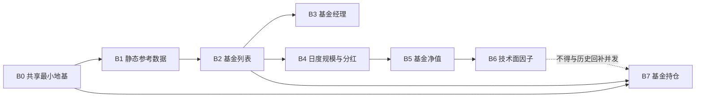

# 公募基金九数据集接入总览与分批推进计划 v1

状态：**B0/B1/B2 已实现并通过隔离与生产验收；B1/B2 均尚未创建 schedule。B3-M0、LLD、M1、M2 及 M3 生产部署/migration 已完成，B3 首次生产同步待单独授权；后续批次待进入。**
确认日期：2026-08-05
适用范围：Tushare 公募基金菜单的九个数据集接入 Prod

## 1. 目标与边界

本专项将九个公募基金数据集接入 Goldenshare Prod。目标不是一次性上线九个接口，而是在每一批的源端契约、存储、Ops/UI、最小真实同步和对账都闭环后，再推进下一批。

本文件只记录整体顺序、依赖、已定口径和批次门禁；它不是任何数据集的 LLD，也不替代下列各自的发现审计与后续 LLD。

| 数据集 | 接口 | 本专项内角色 | 发现审计 |
| --- | --- | --- | --- |
| 基金管理人 | `fund_company` | 静态机构主数据 | [审计](fund-company-onboarding-discovery-audit.md) |
| 基金业绩基准 | `mkt_idx_bmk` | 静态指数参考库 | [审计](fund-performance-benchmark-onboarding-discovery-audit.md) |
| 基金列表 | `fund_basic` | 全市场基金主数据、持仓对象池前置 | [审计](fund-basic-onboarding-discovery-audit.md) |
| 基金经理 | `fund_manager` | 任职事实快照 | [审计](fund-manager-onboarding-discovery-audit.md) / [B3 LLD](public-fund-b3-fund-manager-low-level-design-v1.md) |
| 基金规模 | `fund_share` | 日度规模事实 | [审计](fund-share-onboarding-discovery-audit.md) |
| 基金分红 | `fund_div` | 公告日事件事实 | [审计](fund-div-onboarding-discovery-audit.md) |
| 基金净值 | `fund_nav` | 高优先级日度净值与修订 | [审计](fund-nav-onboarding-discovery-audit.md) |
| 基金技术面因子（专业版） | `fund_factor_pro` | 宽表日度技术因子 | [审计](fund-factor-pro-onboarding-discovery-audit.md) |
| 基金持仓 | `fund_portfolio` | 季度持仓明细 | [审计](fund-portfolio-onboarding-discovery-audit.md) |

## 2. 已定的全局口径

1. 每个数据集必须显式请求并保存其全部 Tushare `source_fields`；不得依赖默认返回字段，也不得以展示需求裁剪入库字段。
2. “全量”只有一个含义：完整保存 Tushare 当前返回的全部源记录。不得用 ETF 池、市场后缀、`status`、前端筛选或任意页数上限缩小源范围。
3. Ops 新增“公募基金”分组；所有九项均支持手动和普通定时自动任务，不接 probe。
4. 所有业务表、叶分区、索引落 HDD。PostgreSQL 集群共享 WAL 保持当前 SSD，不为本专项迁移 `pg_wal`。
5. 直接服务（direct-serving）、原始字段保真、主键/观察版本和时间模型必须由每个数据集的 LLD 固化；本专项不预先替代这些 LLD 决策。
6. 每个批次完成后，必须先通过本批的源端行数、归一化行数、写入行数、拒绝原因、目标唯一行数对账，才可进入下一批。
7. 大历史回补不并发：`fund_factor_pro` 与 `fund_portfolio` 的历史任务不得与其他大回补并行。

## 3. 推进原则

- **由简单到复杂**：先静态小快照，再全市场分页主数据，再日度/事件模型，最后高量宽表和季度持仓。
- **每批只引入一种新的共享复杂度**：不在同一批同时引入新分页语义、新时间调度和大规模历史回补。
- **先建立上游再使用下游**：`fund_basic` 完整对象池验收后，才可启动 `fund_portfolio`。
- **不以代码特例解决共性问题**：版本化直出、自然日展开、相对时间、活动 unit 防重和页流式写入，若进入实现，必须是有契约和回归测试的共享能力。
- **LLD 按批编写**：只为当前获准推进的批次编写 LLD；其他未进入批次不得提前用猜测冻结实施细节。

## 4. 批次依赖

`B3` 与 `B4` 在 B2 验收后可分别排期，但默认串行推进，避免同时扩大迁移、Ops/UI 和真实同步排查面。

## 5. 分批推进计划

| 批次 | 数据集与范围 | 本批新增复杂度 | 进入条件 | 退出门禁 |
| --- | --- | --- | --- | --- |
| B0 | 无业务数据集；仅最小共享能力 | 仅“完整无时间快照的当前源记录 + 观察版本”直出写入协议；不含 HDD、Catalog、分页或基金身份 | 本专项确认 | LLD、全量消费者审计、正反向测试；不允许产生业务表写入 |
| B1 | `fund_company`、`mkt_idx_bmk` | 小型无时间分页快照、观察版本、HDD 物理表与公募基金 Ops 条目 | B0 验收 | ✅ 项目 connector 实测全量/短页行为、全部字段、身份与版本、迁移、Ops/API、两次隔离真实同步及生产首次完整同步五段对账闭环；尚未创建 schedule；两表不做文本关联 |
| B2 | `fund_basic` | E/O 全市场分页主数据、25 字段 | ✅ B1 生产迁移与首次生产同步对账通过 | ✅ LLD、M1/M2/M3 验收通过：生产单个无 market 完整分页 unit、25 字段、17 页、32,342 行、0 reject，source/current/observation 六向差集为 0，6 个 relation 位于生产 HDD；`fund_portfolio` 可使用该生产已验收对象池；尚未创建 schedule |
| B3 | `fund_manager` | 任职事实、分页快照、跨基金聚合辅助字段 | ✅ B2 验收；✅ M0 源端复审；✅ [LLD](public-fund-b3-fund-manager-low-level-design-v1.md)；✅ M1 Definition、身份/唯一性、显式表/HDD migration、Ops 与本地回归；✅ M2 隔离 migration、真实 84,357 行和 100,000 行容量/原子性验收；✅ M3 生产部署、migration 与真实 HDD placement | M3 尚需首次生产完整同步五段对账；schedule 频率延后且不阻塞同步 |
| B4 | 先 `fund_share`，后 `fund_div` | 通用自然日 fan-out；逐日分页与事件散列 | B2 验收；同批内 `fund_share` 先验收 | `fund_share` 保留 SH/SZ/O；`fund_div` 使用全日期签名和显式空值标记；自然日无事件不计作缺数；各自对账闭环 |
| B5 | `fund_nav` | E/O 来源分片身份、相对时间、日任务与 90 日修订、按 unit 活动租约防重 | B4 验收 | 通用逐自然日展开、相对时间策略、重叠拒绝/跳过均有后端和前端验证；E/O 全源分页、版本修订和两条自动任务分别验收 |
| B6 | `fund_factor_pro` | 90 列宽表、交易日历史、容量与限流治理 | B5 验收；HDD/WAL 容量预检通过 | 90 字段和双日期字段校验；历史任务限速、分页、HDD/WAL 水位、停止阈值与最小真实同步对账闭环；不与 B7 大回补并发 |
| B7 | `fund_portfolio` | `(period, ts_code)` 逻辑 unit、2,000 行页流式写入、报告期历史盘点、全源 A/B 对账 | B2、B0 验收；报告期历史规模盘点与容量/配额预算完成 | 不设页数上限；short page 成功语义、页失败幂等重放、全源基线 A/B 与逐基金身份并集一致；单报告期全链路对账后才允许历史回补 |

## 6. 各批 LLD 的最低交付物

每一批开始前必须单独编写 LLD，并至少包含：

1. 本批数据集的 `DatasetDefinition`、时间输入、执行 unit、freshness/audit 语义和 source request contract。
2. 全字段 E2E 映射：`source_fields`、归一化、ORM、迁移、DAO、冲突键/版本策略和 nullable 规则。
3. HDD 表、分区、索引和 WAL 容量影响；不把 tablespace 误写成 WAL 迁移。
4. Ops Catalog/API/前端的“公募基金”、手动、普通定时、无 probe 约束及消费者测试。
5. 正反向测试、项目 connector 分页验证、最小真实同步和五段对账证据。
6. 本批特有风险的拒绝策略：例如宽区间截断、公告日局部结果、身份冲突、源端变动、限流、磁盘水位或活动 unit 重叠。

## 7. 当前禁止项与后续动作

- 未完成对应批次 LLD 和门禁前，不创建 Definition、表、迁移、自动任务或远程回补。
- 不把 `fund_nav` 的相对时间/重叠规则复制为数据集 key 特例；不把 `fund_portfolio` 的页流式逻辑复制成单接口私有实现。
- `fund_portfolio` 尚未完成历史 `period` 盘点，禁止用样本基金起始日期或“固定 57 个季度”估算回补量。
- B0/B1/B2 已完成实现、生产迁移与首次完整生产同步五段对账；B1/B2 schedule 均需运营明确给出频率与 cron/once 意图后手工创建。B2 验收已解除 B3/B4/B7 的对象池前置门禁；B3-M0、LLD、M1、M2 及 M3 生产部署/migration 与真实 HDD 核验已完成，下一门禁为单独授权 B3 首次生产完整同步。B3 schedule 频率延后，不构成同步阻塞。其他批次仍须先完成自己的 LLD 与源端审计。

## 8. 依据与维护规则

- 每个数据集的源端参数、字段、样本行数和分页事实，以其发现审计引用的本地 Tushare 源文档与 `tushareMcp` 实测为准。
- 代码、迁移、测试和真实同步结果必须反向更新对应单数据集审计及其 LLD；本专项只维护批次状态、跨数据集依赖和全局门禁。
- 本文状态不得领先代码和真实验证；未完成的批次一律写“待进入”，不写“完成”。
