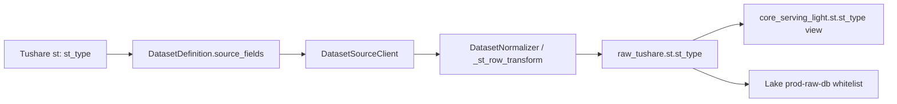

# ST 风险警示事件源字段契约收口专项 LLD v1

状态：本地已实现，待部署与生产验收

日期：2026-08-12
范围：Tushare `st` 数据集、`raw_tushare.st`、`core_serving_light.st` 和其 Lake 只读导出消费者。

## 1. 目标与根因

目标是将 ST 风险警示事件的类型字段彻底收口为源站当前事实 `st_type`，消除任务 `8080` 的全量拒绝故障，不保留字段别名或旧字段兼容。

已核验事实：

1. TaskRun `8080` 的 `st` 节点拉到 `4147` 行后，全部因缺少旧字段而被拒绝。
2. 2026-08-12 的 `tushareMcp` 实测显示：默认响应及显式请求 `st_type` 都返回 `st_type`；显式请求旧拼写时，源端静默省略该字段。
3. 生产 `raw_tushare.st` 现存 `4126` 行，类型值均有效；失败任务没有写入新事实。

根因不是任务参数、工作流或写入器，而是源站字段、`DatasetDefinition`、ORM、视图和 Lake 白名单仍共同沿用已失效的旧拼写。源端静默省略字段后，normalizer 按 Definition 的必填字段拒绝了全部行。

## 2. 目标字段契约

| 层级 | 唯一字段名 | 职责 |
| --- | --- | --- |
| Tushare 请求/响应 | `st_type` | 源端风险警示类型字段 |
| `DatasetDefinition.source.source_fields` | `st_type` | 请求字段单一事实源 |
| normalizer / `_st_row_transform` | `st_type` | 必填校验、清洗与幂等哈希输入 |
| `raw_tushare.st` | `st_type` | 原始事实持久化 |
| `core_serving_light.st` | `st_type` | raw 直出轻量视图 |
| Lake `prod-raw-db` 导出白名单 | `st_type` | 只读导出字段 |

`st_tpye` 不再是可接受的请求字段、响应字段、ORM 属性、数据库列、视图列或导出字段。仅在历史创建迁移和本 LLD 的根因说明中保留为历史证据。

## 3. 数据流与职责

写入仍是 `raw_only_upsert`：writer 只写 `raw_tushare.st`，`core_serving_light.st` 只读取 raw。Ops、工作流、日期模型、分页策略和事务边界不因本次字段修正改变。

## 4. 实现设计

### 4.1 代码收口

1. `reference_master.py` 的 source fields、normalization required fields 和 quality required fields 统一使用 `st_type`。
2. `_st_row_transform` 读取、清洗和哈希使用 `st_type`。哈希的字段值、顺序和分隔符保持不变，因此既有 `row_key_hash` 无需重算。
3. `RawSt`、`StLight` 和低频 `stock_st` 重建读取器统一使用 `st_type` 属性。
4. Lake 的 `ST_FIELDS` 白名单使用 `st_type`，使其 SQL 在数据库列改名后仍可读取。

### 4.2 数据库迁移

迁移 `20260812_000133` 只执行以下两项 DDL：

1. 将 `raw_tushare.st.st_tpye` 重命名为 `st_type`。
2. 将 `core_serving_light.st` 的输出列重命名为 `st_type`。

迁移前必须确认 raw 是物理表、light 是普通视图，且两者都存在旧列而不存在新列；任一条件不符合即报错停止。迁移后再次确认 raw 与视图都只存在新列。

已在隔离的 PostgreSQL 18.4 临时实例复现该顺序：重命名 raw 表列后，视图的输出列仍保留旧名；执行视图列重命名后，raw 与视图才都暴露 `st_type`。因此迁移明确包含两条 DDL，不能只改 raw 表。

不执行 `DELETE`、`TRUNCATE`、重建表、重放数据或哈希回灌。字段重命名只调整元数据，既有行、索引、主键和 `row_key_hash` 保持不变。downgrade 被明确禁止，避免重新引入源端已失效的字段契约。

## 5. 消费者审计结论

| 消费者 | 审计结论 | 本轮处理 |
| --- | --- | --- |
| `DatasetSourceClient -> Tushare` | 直接透传 Definition 的字段列表 | Definition 改为 `st_type`，增加请求字段测试 |
| `DatasetNormalizer` | 根据 Definition 做必填校验 | 改 transform 与 required fields，旧拼写负向拒绝 |
| `DatasetWriter / DAO` | 通用 raw-only upsert，按 ORM 字段过滤 | `RawSt` 属性改名，增加 raw-only writer 测试 |
| `core_serving_light.st` | raw 直出视图 | 迁移同步改输出列，已审计无下游视图依赖 |
| `stock_st` 低频重建工具 | 读取 `RawSt` 形成领域对象 `st_type` | ORM 属性改名，领域语义不变 |
| Lake prod-raw-db 导出 | 静态字段白名单直读 raw 表 | 白名单、导出测试和文档同步改为 `st_type` |
| Ops workflow / 页面 | 只使用数据集 action 身份和任务结果 | 无字段消费者，不改动 |

## 6. 测试与验收

本地测试护栏：

1. Definition 精确断言 source fields 和 required fields。
2. Source client 精确断言向 Tushare 请求 `st_type`。
3. normalizer 正向验证 `st_type`、既有哈希输入对应的固定 `row_key_hash`，负向验证旧拼写必被拒绝，确保没有隐式别名回流或幂等键漂移。
4. writer 验证 `st` 仍只写 raw，不生成第二份 serving 物理表。
5. migration 静态测试验证真实 Alembic head、列重命名、视图重命名、无删数据语句和禁止 downgrade。
6. Lake 导出测试验证 SQL 白名单只读取 `st_type`。

部署后生产验收顺序：

1. 执行迁移后检查 raw 与 light view 都仅暴露 `st_type`，并核对迁移前后 `count(*)`、`count(distinct row_key_hash)` 一致。
2. 手动执行一次 `st.maintain`，确认 `fetched / normalized / written` 正常且 `rejected=0`。
3. 执行一次 Lake 的 `st` 全量只读导出，确认 Parquet 字段为 `st_type`。

本轮未执行迁移、未改写或清理任何生产数据；生产验收必须在部署后单独执行。
