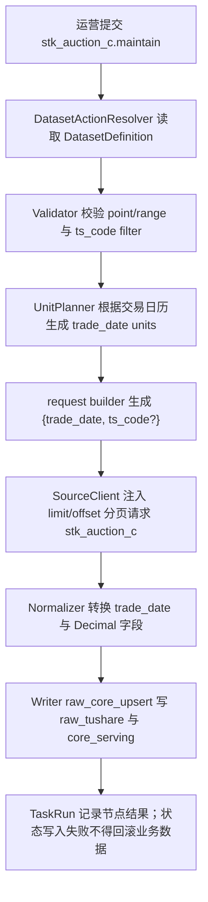

# 股票收盘集合竞价数据集接入方案（`stk_auction_c`）

> 状态：数据集接入已落地；`P1-B3-stk_auction_c-M0/M1/M2/M3a` 已通过，生产已切换为 Raw 唯一物理事实表与 0 B Serving view；M3b 待下一次自然工作流观察
> 日期：2026-05-16  
> raw 直出 M0 复审：2026-08-29
> 文档模板：[数据集开发说明模板](/Users/congming/github/goldenshare/docs/templates/dataset-development-template.md)  
> 源站文档：[0354_股票收盘集合竞价数据.md](/Users/congming/github/goldenshare/docs/sources/tushare/股票数据/特色数据/0354_股票收盘集合竞价数据.md)

## 0. 架构基线与本轮边界

本方案已落地 `stk_auction_c` 数据集的 Definition、请求参数、ORM/DAO、Alembic 迁移、Ops 展示目录、freshness 与盘后工作流接入。本文档仍作为后续验收与维护口径。

已读取并遵守：

- 仓库根规则：`AGENTS.md`
- 文档规则：`docs/AGENTS.md`
- 数据集文档规则：`docs/datasets/AGENTS.md`
- 日期模型基线：[dataset-date-model-consumer-guide-v1.md](/Users/congming/github/goldenshare/docs/architecture/dataset-date-model-consumer-guide-v1.md)
- DatasetDefinition 主线：[dataset-definition-single-source-refactor-plan-v1.md](/Users/congming/github/goldenshare/docs/architecture/dataset-definition-single-source-refactor-plan-v1.md)
- ExecutionPlan 主线：[dataset-execution-plan-refactor-plan-v1.md](/Users/congming/github/goldenshare/docs/architecture/dataset-execution-plan-refactor-plan-v1.md)

本方案遵守三层分离：

- Ops / TaskRun / Schedule 只保存用户或调度意图。
- `DatasetActionResolver` 根据 `DatasetDefinition.date_model` 生成执行计划与日期 unit。
- request builder 只把执行锚点映射成 Tushare 源接口参数。

## 1. 基本信息

| 项 | 设计 |
| --- | --- |
| 数据集 key | `stk_auction_c` |
| 中文显示名 | 股票收盘集合竞价 |
| 所属定义文件 | `src/foundation/datasets/definitions/market_equity.py` |
| 底层领域 | `equity_market` / 股票行情 |
| 数据源 | `tushare` |
| 源站 API | `stk_auction_c` |
| 源站接口含义 | 股票收盘 15:00 集合竞价数据，每天盘后更新 |
| Tushare 权限 | 需要开通股票分钟权限 |
| 是否对外服务 | 是，进入 `core_serving` |
| 是否多源融合 | 否 |
| 是否纳入自动任务 | 是，支持盘后按交易日自动维护 |
| 是否纳入默认工作流 | 已确认纳入 `daily_market_close_maintenance`；实现时必须新增 workflow step，并确认执行顺序 |
| 是否纳入日期完整性审计 | 是 |
| Ops 展示分组 | `equity_market` / A股行情 |
| Ops 展示顺序建议 | `84`，放在股票开盘集合竞价之后 |

说明：`DatasetDefinition.domain` 只表达底层领域事实；运营后台分组必须通过 `src/ops/catalog/dataset_catalog_views.py` 的 Ops 展示目录配置。

## 2. 源站接口事实

### 2.1 输入参数

| 参数名 | 类型 | 必填 | 源站说明 | 类别 | 是否给运营填写 | 对应 `DatasetInputField` | 备注 |
| --- | --- | --- | --- | --- | --- | --- | --- |
| `ts_code` | string | 否 | 股票代码 | 代码过滤 | 是 | `filters.ts_code` | 可用于单股局部维护 |
| `trade_date` | string | 否 | 交易日期 | 时间点 | 是 | `time_fields.trade_date` | 格式由 request builder 转成 `YYYYMMDD` |
| `start_date` | string | 否 | 开始日期 | 时间区间 | 是 | `time_fields.start_date` | 上层表达区间意图，主链不直接打大区间 |
| `end_date` | string | 否 | 结束日期 | 时间区间 | 是 | `time_fields.end_date` | 上层表达区间意图，主链不直接打大区间 |
| `limit` | int | 否 | 单页条数 | 分页 | 否 | 不暴露 | `DatasetSourceClient` 根据 `page_limit` 注入 |
| `offset` | int | 否 | 偏移量 | 分页 | 否 | 不暴露 | `DatasetSourceClient` 根据分页循环注入 |

### 2.2 输出字段

| 字段名 | 含义 | 是否落 raw | 是否进入 serving | 清洗规则 |
| --- | --- | --- | --- | --- |
| `ts_code` | 股票代码 | 是 | 是 | 必填，字符串去空格并转大写 |
| `trade_date` | 交易日期 | 是 | 是 | 必填，`YYYYMMDD` 转 `date` |
| `close` | 集合竞价收盘价 | 是 | 是 | Decimal，允许 0 |
| `open` | 集合竞价开盘价 | 是 | 是 | Decimal，允许 0 |
| `high` | 集合竞价最高价 | 是 | 是 | Decimal，允许 0 |
| `low` | 集合竞价最低价 | 是 | 是 | Decimal，允许 0 |
| `vol` | 成交量 | 是 | 是 | Decimal，允许 0 |
| `amount` | 成交金额 | 是 | 是 | Decimal，允许 0 |
| `vwap` | 均价 | 是 | 是 | Decimal，允许 0 |

## 3. 源接口真实行为验证

验证方式：已使用 `tushare-data` 技能流程读取源文档，并用 `tushareMcp.stk_auction_c` 与本地 Tushare SDK 真实请求验证。

| 请求形态 | 实际请求参数 | 源端返回 | 是否分页 | 样本 / 结论 |
| --- | --- | --- | --- | --- |
| 不传业务参数 | `limit=5, offset=0` | 5 行 | 是 | 返回最近交易日数据；源端支持，但平台维护不采用无时间意图 |
| 只传对象过滤 | `ts_code=000001.SZ, limit=5` | 5 行 | 是 | 返回该股票最近多日数据；`ts_code` 只能作为 filter，不改变日期主模型 |
| 只传时间点 | `trade_date=20260515, limit=10000` | 5515 行 | 是 | 单日全市场可取，常规单日低于接口上限 10000 |
| 传时间区间 | `ts_code=000001.SZ, start_date=20260514, end_date=20260515` | 2 行 | 否 | 单代码区间可取；平台区间维护仍按交易日 fan-out，不直接打全市场大区间 |
| 分页第二页 | `trade_date=20260515, limit=3, offset=3` | 3 行 | 是 | `limit/offset` 生效，分页策略必须保留 |

关键样本：

```json
{
  "ts_code": "000001.SZ",
  "trade_date": "20260515",
  "close": 10.99,
  "open": 10.99,
  "high": 10.99,
  "low": 10.96,
  "vol": 20843508.48,
  "amount": 228867686.4,
  "vwap": 10.98
}
```

风险记录：

- `tushareMcp` 单日单代码与单代码区间请求均成功。
- 单日全市场实测 5515 行，虽然低于 10000，仍保留 `offset_limit` 分页，防止源端扩容或后续字段变化导致截断。

## 4. 三层语义拆分

| 语义层 | 本数据集答案 | 已核验依据 |
| --- | --- | --- |
| 时间输入语义 | 运营提交单个交易日，或提交交易日起止区间；可选填写股票代码做局部维护 | 源文档输入参数与真实请求验证 |
| 执行 / unit 语义 | `point` 生成 1 个交易日 unit；`range` 根据交易日历扇出为多个交易日 unit；每个 unit 内部分页拉取并以 unit 为事务边界写入 | `DatasetUnitPlanner._resolve_anchors` 当前按 `trade_open_day + every_open_day` 扇出 |
| freshness / audit 语义 | 全市场收盘集合竞价应按每个开市日连续维护，使用 `continuous_open_day`，日期完整性审计适用 | `freshness_policies.py` 当前同类行情数据使用 `continuous_open_day` |

## 5. DatasetDefinition 事实设计

### 5.1 `identity`

```python
"identity": {
    "dataset_key": "stk_auction_c",
    "display_name": "股票收盘集合竞价",
    "description": "维护股票收盘 15:00 集合竞价数据。",
    "aliases": (),
}
```

### 5.2 `domain`

```python
"domain": {
    "domain_key": "equity_market",
    "domain_display_name": "股票行情",
}
```

### 5.3 `source`

```python
"source": {
    "source_key_default": "tushare",
    "source_keys": ("tushare",),
    "adapter_key": "tushare",
    "api_name": "stk_auction_c",
    "source_fields": (
        "ts_code", "trade_date", "close", "open", "high",
        "low", "vol", "amount", "vwap",
    ),
    "source_doc_id": "tushare.stk_auction_c",
    "request_builder_key": "_stk_auction_c_params",
    "base_params": {},
}
```

说明：不复用 `_trade_date_or_start_end_params`。该通用 builder 在 `range_rebuild` 下会生成 `start_date/end_date`，而本数据集主链需要每个交易日 unit 传 `trade_date`，与 `daily`、`stk_limit` 这类单日行情保持一致。

### 5.4 `date_model`

```python
"date_model": {
    "date_axis": "trade_open_day",
    "bucket_rule": "every_open_day",
    "window_mode": "point_or_range",
    "input_shape": "trade_date_or_start_end",
    "observed_field": "trade_date",
    "audit_applicable": True,
    "not_applicable_reason": None,
}
```

### 5.5 `input_model`

```python
"input_model": {
    "time_fields": (
        {"name": "trade_date", "field_type": "date", "display_name": "处理日期", "description": "交易日"},
        {"name": "start_date", "field_type": "date", "display_name": "开始日期", "description": "起始交易日"},
        {"name": "end_date", "field_type": "date", "display_name": "结束日期", "description": "结束交易日"},
    ),
    "filters": (
        {"name": "ts_code", "field_type": "string", "display_name": "股票代码", "description": "可选，单股局部维护"},
    ),
}
```

### 5.6 `storage`

```python
"storage": {
    "raw_dao_name": "raw_stk_auction_c",
    "core_dao_name": "equity_auction_close",
    "target_table": "core_serving.equity_auction_close",
    "delivery_mode": "single_source_serving",
    "layer_plan": "raw->serving",
    "std_table": None,
    "serving_table": "core_serving.equity_auction_close",
    "raw_table": "raw_tushare.stk_auction_c",
    "conflict_columns": None,
    "write_path": "raw_core_upsert",
}
```

表设计：

| 表 | 主键 | 索引 | 字段 |
| --- | --- | --- | --- |
| `raw_tushare.stk_auction_c` | `(ts_code, trade_date)` | `idx_raw_tushare_stk_auction_c_trade_date` | 源字段 + `api_name` + `fetched_at` + `raw_payload` |
| `core_serving.equity_auction_close` | `(ts_code, trade_date)` | `idx_equity_auction_close_trade_date` | 源字段 + `created_at` + `updated_at` |

价格字段使用 `Numeric(18, 4)`；`vol`、`amount` 使用 `Numeric(20, 4)`。

### 5.7 `planning`

```python
"planning": {
    "universe_policy": "no_pool",
    "enum_fanout_fields": (),
    "enum_fanout_defaults": {},
    "pagination_policy": "offset_limit",
    "page_limit": 10000,
    "chunk_size": None,
    "max_units_per_execution": None,
    "unit_builder_key": "generic",
}
```

说明：

- 不按股票池自动扇出；源端支持单日全市场返回，`ts_code` 只是可选过滤。
- `range` 由 `DatasetUnitPlanner` 按交易日历扇成多个 `trade_date` unit。
- `limit/offset` 由 `DatasetSourceClient` 注入，不暴露给运营用户。

### 5.8 `normalization`

```python
"normalization": {
    "date_fields": ("trade_date",),
    "decimal_fields": ("close", "open", "high", "low", "vol", "amount", "vwap"),
    "required_fields": ("trade_date", "ts_code"),
    "row_transform_name": None,
}
```

### 5.9 `capabilities`

```python
"capabilities": {
    "actions": (
        {
            "action": "maintain",
            "manual_enabled": True,
            "schedule_enabled": True,
            "retry_enabled": True,
            "supported_time_modes": ("point", "range"),
        },
    ),
}
```

### 5.10 `observability` / `quality` / `transaction`

```python
"observability": {
    "progress_label": "stk_auction_c",
    "observed_field": "trade_date",
    "audit_applicable": True,
}

"quality": {
    "reject_policy": "record_rejections",
    "required_fields": ("trade_date", "ts_code"),
}

"transaction": {
    "commit_policy": "unit",
    "idempotent_write_required": False,
    "write_volume_assessment": "单日全市场实测约 5500 行；按交易日 unit 写入，单 unit 内分页拉取后一次提交。",
}
```

`src/foundation/datasets/freshness_policies.py` 必须登记：

```python
"stk_auction_c": CONTINUOUS_OPEN_DAY
```

## 6. 执行流程



## 7. 消费者审计

| 消费方 | 是否受影响 | 需要改动 | 已核验代码位置 |
| --- | --- | --- | --- |
| manual actions | 是 | 新增 action 后由 Definition 派生表单 | `src/ops/queries/manual_action_query_service.py` |
| catalog | 是 | 新增 Ops 展示目录 item | `src/ops/catalog/dataset_catalog_views.py` |
| workflow | 是 | 新增 `daily_market_close_maintenance` workflow step，并确认执行顺序 | `src/ops/action_catalog.py` |
| resolver / unit planner | 是 | 复用 `trade_open_day + every_open_day + generic` | `src/foundation/ingestion/resolver.py`，`src/foundation/ingestion/unit_planner.py` |
| request builder | 是 | 新增 `_stk_auction_c_params`，按 anchor 生成 `trade_date` | `src/foundation/ingestion/request_builders.py` |
| freshness | 是 | 登记 `continuous_open_day` | `src/foundation/datasets/freshness_policies.py`，`src/ops/queries/freshness_query_service.py` |
| dataset cards | 是 | 由 DatasetDefinition / freshness 派生 | `src/ops/queries/dataset_card_query_service.py` |
| snapshot rebuild | 是 | 新增 Definition 后纳入 snapshot rebuild | `src/ops/services/operations_dataset_status_snapshot_service.py` |
| date completeness audit | 是 | `audit_applicable=True` 后自动纳入 | `src/ops/services/date_completeness_run_service.py` |
| 自动任务 / calendar policy | 是 | 使用交易日选择规则，无需新增 policy | `src/ops/services/operations_schedule_service.py` |
| 前端时间控件 | 是 | 根据 `trade_date_or_start_end` 展示交易日 point/range | `src/ops/queries/manual_action_query_service.py` |
| 测试与文档 | 是 | 新增定义、请求、分页、Ops、文档测试 | `tests/**` |

## 8. 测试与验收清单

实现阶段至少补齐：

- `tests/test_dataset_definition_registry.py`：`stk_auction_c` 定义、日期模型、freshness policy。
- `tests/test_fields_constants.py`：`source_fields` 与源文档字段一致。
- `tests/test_dataset_action_resolver.py`：point 生成 1 个 unit，range 按交易日扇出。
- `tests/test_ingestion_request_builders.py`：range unit request params 使用 `trade_date`，不是 `start_date/end_date`。
- `tests/test_ingestion_source_client.py`：`offset_limit` 注入 `limit/offset`。
- `tests/test_extended_models.py`：raw 与 serving 主键、索引、字段类型。
- `tests/web/test_ops_manual_actions_api.py`：手动任务表单显示交易日 point/range 与 `ts_code`。
- `tests/web/test_ops_catalog_api.py`：数据源卡片展示分组为 A股行情。
- `tests/web/test_ops_freshness_api.py`：freshness policy 为 `continuous_open_day`。
- `python3 scripts/check_docs_integrity.py`。

真实验收必须记录：

- 源端 fetched 行数。
- normalized 行数。
- raw 写入行数。
- raw-backed serving view 对应行数；M1 后 writer 不再写 serving。
- rejected 行数与 reason code。
- `core_serving.equity_auction_close` 对应交易日实际行数。

## 9. 已确认口径

| 编号 | 决策项 | 建议 |
| --- | --- | --- |
| D1 | 是否本次实现就加入 `daily_market_close_maintenance` 默认工作流 | 已确认加入。实现阶段必须同步更新 workflow step、相关测试与验收记录 |

## 10. 明确不做

- 不使用 `stk_auction` 接口。`stk_auction` 是“当日集合竞价”接口，字段和业务含义不同，应作为未来单独数据集评审。
- 不把 `limit` / `offset` 暴露给运营填写。
- 不做无时间维度 snapshot 维护；即使源端不传参数能返回最近数据，本平台维护仍要求明确交易日或交易日区间。
- 不引入股票池自动扇出。

## 11. 2026-08-29 raw 直出 M0 复审结论

本轮只读复审严格限定为 `P1-B3-stk_auction_c-M0`：没有修改代码、请求 Tushare、创建 TaskRun、部署、执行 migration、暂停 schedule 或写生产数据库。目标是确认当前双写实现、生产两层事实、消费者与查询性能是否允许进入独立 M1。

### 11.1 当前实现与影响面

1. Definition 仍显式请求并保存 9 个 source fields：`ts_code, trade_date, close, open, high, low, vol, amount, vwap`；按交易日 point/range 规划，range 按开市日逐 unit 展开，单 unit 使用 `limit/offset`、`page_limit=10,000` 分页，允许可选 `ts_code`。
2. 当前 storage 仍为 `raw_core_upsert`：同一个归一化批次分别写入 `raw_tushare.stk_auction_c` 与 `core_serving.equity_auction_close`；两层业务主键均为 `(ts_code, trade_date)`，没有额外 serving 冲突消解。
3. 仓库内未发现 Biz、QTF、DG、前端或 Lake Console 对 `core_serving.equity_auction_close` 的直接读取，也未发现 `ServingPublishService` 或显式 serving DML 旁路。已知消费者为 Definition 驱动的 Ops Catalog、freshness、日期完整性、TaskRun 观测，以及 `daily_market_close_maintenance` 工作流。
4. 生产自动入口是 schedule #24（18:30）和 schedule #2（21:02）。最近自然运行中，18:30 节点为空短页，21:02 节点返回约 5,550 行；这属于源端就绪时序，不是 raw 直出异常。未来 M3a 必须同时暂停并恢复两个 schedule，M3b 也必须分别核对两个自然入口。
5. raw 直出只改变 storage contract 与物理 relation 形态，不修改 source fields、请求参数、分页、日期模型、planner、unit、schedule 时间或工作流顺序，也不新增共享 writer/DAO 框架。

### 11.2 生产物理合同与全量等价

生产只读快照时间为 `2026-08-29 05:25+08`，Alembic head 为 `20260828_000156`：

| 项目 | Raw | Serving |
| --- | ---: | ---: |
| relation | `raw_tushare.stk_auction_c` 物理表 | `core_serving.equity_auction_close` 物理表 |
| 总大小 | 424,484,864 B（404.82 MiB） | 390,266,880 B（372.19 MiB） |
| 总行数 | 2,255,593 | 2,255,593 |
| 唯一 `(ts_code, trade_date)` | 2,255,593 | 2,255,593 |
| 日期范围 | `2025-01-02..2026-08-28` | `2025-01-02..2026-08-28` |

两表列类型、非空合同、主键与交易日索引一致；索引均 valid/ready。未发现外键、外部 view/materialized view、用户 trigger、RLS、publication、扩展统计或安全标签依赖。Raw 额外向 `lake_raw_reader` 授予 `SELECT`，未来 migration 必须动态保留两边 owner、ACL 和注释合同。

对全部 20 个自然月逐月比较 9 个业务字段的双向 `EXCEPT ALL`，每个月 raw-only 与 serving-only 均为 0；全表行数、身份数和日期范围也一致。月峰值为 `2025-07` 的 132,619 行。`raw.fetched_at = serving.updated_at` 对全部 2,255,593 行成立；93,769 行的 `serving.created_at != serving.updated_at`，因此未来 view 把 `created_at/updated_at` 都投影为 `fetched_at` 会改变历史创建时间值，但当前仓库内没有该字段消费者，这仍属于已公开的物理透明性边界。

M1 的本数据集 migration 容量门禁固定为每层每自然月最多 160,000 行：它高于当前月峰值约 20.6%，按实测最大业务行宽 97 B 计算，单层业务投影约 14.80 MiB。M2 必须证明 160,000 行通过、160,001 行在任何 serving DDL 前 fail-closed；不能因为 `stk_auction_o` 使用相同数值就省略本数据集的独立边界测试。

### 11.3 查询与运行门禁

生产代表查询的 Raw/Serving 结果摘要完全一致，Raw 计划均使用自身主键或交易日索引；三轮中位数如下：

| 查询 | Raw | Serving | Raw 相对变化 |
| --- | ---: | ---: | ---: |
| 单日完整字段 | 11.516 ms | 11.041 ms | +4.30% |
| 单股票历史 | 1.162 ms | 1.236 ms | -5.99% |
| 5 日范围 | 58.333 ms | 56.401 ms | +3.43% |
| 日期完整性范围 | 61.834 ms | 54.941 ms | +12.55% |

日期完整性这一最慢代表查询仍低于 20% 停止阈值，且没有临时块；当前 M0 无性能阻塞。`max(trade_date)` 两边均为亚毫秒 index-only scan，绝对耗时受抖动主导，不用其百分比作为迁移判断。Raw 的 all-visible 页比例为 95.21%，无需在 M0 擅自执行 vacuum；M3a 仍须在同一维护窗口实时复测任务、锁、磁盘与查询性能。

### 11.4 M0 判断与下一阶段

`P1-B3-stk_auction_c-M0` **通过**，可以在另行授权后进入 M1。M1 只允许修改本数据集 Definition storage contract、必要的 raw ORM 索引 metadata、独立 Alembic revision 和专项测试；可以沿用已经验证的 raw-backed view 与数据库拒写合同，但必须基于本数据集 9 字段、160,000 行/月和两个收盘工作流入口独立实现，不得新增共享框架或照搬前一数据集的生产结论。

M0 不构成 M1、M2 或生产 M3a 授权。生产 M3a 前仍须重新确认真实 Alembic head、开放 TaskRun 为 0、schedule #2/#24 均已暂停、目标 worker 已停止、无目标锁/长事务、根盘和 WAL 水位安全，并重跑全量等价与代表查询。仓库外 SQL、BI、人工脚本若依赖 OID、relkind、约束 catalog、历史审计时间或 serving DML，仍须由运营登记。

## 12. 2026-08-29 raw 直出 M1 实现结论

### 12.1 Alembic 先决条件更新

M0 生产只读快照的 Alembic head 是 `20260828_000156`，这是当时生产事实，继续保留。M1 编码开始前，本地线性迁移链已经由 ETF active pool 退场 revision 推进到唯一 head `20260829_000157`；因此本数据集新增独立 revision `20260829_000158`，并明确设置 `down_revision = 20260829_000157`。`alembic heads` 只返回 158，没有产生分叉或复用 157。

### 12.2 Definition 与写入合同

`stk_auction_c` 只修改 storage contract：

- `raw_dao_name/core_dao_name` 均为 `raw_stk_auction_c`；
- `target_table/raw_table` 均为 `raw_tushare.stk_auction_c`；
- `delivery_mode=raw_with_serving_view`；
- `layer_plan=raw->serving_view`；
- `write_path=raw_only_upsert`；
- `serving_table` 仍为 `core_serving.equity_auction_close`。

九个 source fields、`_stk_auction_c_params`、交易日 point/range、可选 `ts_code`、每开市日一个 unit、10,000 行 `limit/offset` 分页、手动/schedule/retry 能力、工作流顺序和两个生产 schedule 均未改变。`RawStkAuctionC` 已经声明生产既有 `(ts_code, trade_date)` 主键和单列 `trade_date` 索引，DAOFactory 也已有 raw DAO，因此 M1 没有修改 ORM、DAO、writer、resolver、request builder、normalizer、Ops、前端、QTF、DG 或 Lake。

### 12.3 独立 migration

revision 158 与前一项 migration 物理分离，只处理 `raw_tushare.stk_auction_c` 和 `core_serving.equity_auction_close`：

1. 设置事务级 `lock_timeout=15s`、`statement_timeout=120s`、`work_mem=16MB`，不修改全局配置和 `temp_file_limit`。
2. DDL 前验证两张 relation 必须仍是当前角色拥有的非分区物理表；Raw heap、主键和交易日索引必须继续位于 SSD `pg_default`。
3. 验证两层完整列签名、主键、唯一/二级索引、约束、ACL、trigger、RLS、view/function/rewrite 依赖、扩展统计、安全标签与 publication；任何未知合同直接失败。
4. 先按 Raw→Serving 顺序取得 `SHARE` 锁，再按自然月比较 9 个业务字段和两列身份唯一性。每层每月最多 160,000 行；超限或任一双向 `EXCEPT ALL` 差异在 Serving 独占锁和 DDL 前失败。
5. 验证既有 `core_serving.reject_raw_direct_serving_view_dml()` 的 owner、语言、安全与权限合同，不在本 revision 创建或重写共享函数。
6. 取得 Serving `ACCESS EXCLUSIVE` 锁后，无 `CASCADE` 删除原物理 Serving 表，创建显式 11 列 Raw-backed view；`created_at/updated_at` 均投影 Raw `fetched_at`。
7. 动态恢复原 owner、非 owner SELECT/grant option、relation/column comments，并创建本 relation 独立的三类 DML 拒绝 trigger；完成后再次验证 view 列、owner、trigger 与共享函数合同。
8. 禁止自动 downgrade；恢复物理 Serving 必须另行设计和授权前向 migration。

### 12.4 自动化验证与边界

M1 新增专项测试，覆盖 Definition/plan、`ts_code` 正反例、Raw/Serving 字段及索引合同、ServingPublish 旁路不存在、Raw-only writer、freshness/date-completeness Raw target、revision 158→157 迁移链、160,000 行门禁、月度差异、未知依赖、锁与 DDL 顺序、显式 view、ACL/comment、三类 DML 和禁止 downgrade，并完成 PostgreSQL offline SQL 渲染。

`P1-B3-stk_auction_c-M1` **通过**，但只证明代码与静态 migration 合同。没有连接任何数据库、请求 Tushare、部署、执行 migration、创建 TaskRun 或修改 schedule；生产仍是两张物理表和原双写代码。下一阶段只能在独立授权后进入 M2，在隔离 PostgreSQL 真实应用 revision 158，验证 160,000/160,001 行边界、差异/依赖 fail-closed、权限、三类 DML、事务回滚、Raw 写入后 view 即时可见和代表查询计划。M1 不构成生产 M3a 授权。

## 13. 2026-08-29 `P1-B3-stk_auction_c-M2` 隔离 PostgreSQL 验证

M2 使用 PostgreSQL 18.4 的一次性隔离实例，实例仅监听随机 Unix socket，`listen_addresses=''`、`inet_server_addr=NULL`。每次 Alembic 前均通过应用最终 `get_settings()` URL 和数据库连接核对数据库名、应用用户、socket、端口及 data directory，避免 `.env` 优先级把迁移带到其它数据库。没有连接 Prod、请求 Tushare、部署、创建 TaskRun、修改 schedule 或执行生产 DDL。六个场景完成后临时实例已停止，数据目录已删除；机器可读证据保留在 `/private/tmp/goldenshare_stk_auction_c_m2_report.json`。

1. 正向库在同一自然月构造 **160,000 行/层**，revision `20260829_000157 -> 20260829_000158` 成功。Raw OID `16391`、主键索引 OID `16402`、日期索引 OID `16404` 均保持不变，两个索引继续 valid/ready 且位于 `pg_default`；Serving 从 OID `16405` 的物理表切换为 OID `16421`、0 B 普通 view。
2. 切换后 Raw/view 均为 160,000 行和 160,000 个唯一 `(ts_code, trade_date)`；九字段双向 `EXCEPT ALL` 与 `fetched_at -> created_at/updated_at` 审计投影差异均为 0。view 列、owner、Raw reader、Serving `SELECT WITH GRANT OPTION`、relation/column comments 及独立拒写 trigger 全部恢复。
3. Serving `INSERT/UPDATE/DELETE` 均返回 SQLSTATE `55000`。Raw 的插入、更新和删除在同一事务内立即反映到 view，回滚后行数及测试身份无残留。正式 `DatasetWriter` 对一个既有身份返回 `rows_written=1`、目标为 `raw_tushare.stk_auction_c`，Raw/view 同时出现新值；事务回滚后原值及原时间戳完整恢复。
4. **160,001 行/月**明确触发 `monthly reconciliation exceeds safety cap`；另三个负向库分别注入业务字段差异、身份差异和外部 view 依赖，均在 Serving DDL 前失败。四个负向库的 revision、relation OID/类型、索引、行数、comments 和 trigger 快照均保持原状。
5. 独立回滚库在同一 migration transaction 完成 `DROP TABLE -> CREATE VIEW -> trigger` 后注入失败；回滚后 revision 157、两张物理表、Raw/Serving OID、索引 OID/定义/valid/ready、ACL、comments、行数与零用户 trigger 全部恢复。
6. 单日、单股票、最大日期和 10 日日期完整性四类查询切换前后结果行数与 SHA-256 一致，计划分别从 Serving 索引下推到 Raw 的日期索引或主键，临时块均为 0。两类有代表性的批量查询耗时为单日 `2.653 -> 2.577 ms`、日期完整性 `8.419 -> 8.757 ms`；单股票和最大日期均小于 `0.01 ms`，只视为计划形态证据，不用微秒级抖动推导生产性能。

`P1-B3-stk_auction_c-M2` **通过**，revision 158 无需修改。该结论只证明 migration 在隔离 PostgreSQL 满足容量、原子性、权限、拒写、writer、即时可见和查询计划合同；生产仍为 revision 156、两张物理表及已部署的双写代码，尚未释放 Serving 空间。下一阶段只能在另行授权后进入生产 M3a：重新做生产只读预检，暂停 schedule #2/#24，确认开放 TaskRun、目标 node、锁和长事务为 0，停止目标 worker，实时复测代表查询门禁后再安装 Raw-only 代码并显式应用 revision 158。M2 不授权部署、生产 migration 或最小 TaskRun。

## 14. 2026-08-29 `P1-B3-stk_auction_c-M3a` 生产切换与即时验收

M3a 于 `16:26..16:32+08` 按维护窗口顺序完成，没有使用会在门禁前自动迁移并重启服务的标准完整部署：

1. 生产实时预检确认 Alembic 为 `20260829_000157`，schedule #2/#24 均为 active 且合同仍为 `daily_market_close_maintenance`、`Asia/Shanghai`、`30 18 * * 1,2,3,4,5` 与 `2 21 * * 1,2,3,4,5`。开放 TaskRun、目标 node、目标锁、等待锁和超过 30 秒事务均为 0；根盘可用 `51,424,526,336 B`。
2. Raw/Serving 切换前均为 2,255,593 行和同数唯一 `(ts_code, trade_date)`，日期范围 `2025-01-02..2026-08-28`。20 个自然月逐月九字段双向 `EXCEPT ALL` 全部为 0，月峰值 132,619；外键、用户 trigger、列 ACL、RLS、依赖 view/function、rewrite rule、扩展统计、security label 与 publication 均无阻塞。
3. 切换前五类查询结果 hash 一致、计划命中对应 Raw/Serving 日期索引或主键、临时块为 0。Raw 相对旧 Serving 最大正向退化出现在单日查询，为 `11.856/11.066 ms`、约 7.14%，低于 20% 停止阈值；Raw all-visible page 为 95.21%，本数据集不需要复制 `stk_auction_o` 的生产 vacuum 步骤。
4. schedule #2/#24 通过正式 `OpsScheduleCommandService` 暂停，config revision `123/124` 记录 paused；scheduler 与通用 worker 停止后再次完成同一组全量对账和任务/锁门禁。随后只使用 `bash scripts/deploy-systemd.sh dev-interface --maintenance-migration` 安装远端 commit `3030524987a15740333240c4bf4edf49df4ff383` 并应用 revision `157 -> 158`；该模式没有构建前端/Wealth、seed、同步 unit、创建任务或自动重启服务。
5. Raw relation OID `808835` 与 PK/日期索引保持不变，索引 valid/ready 且继续位于 SSD `pg_default`。Serving 由 390,266,880 B 物理表切为 OID `2038214`、0 B 普通 view，显式投影九个业务字段以及 `fetched_at AS created_at/updated_at`。owner 和 Raw 的 `lake_raw_reader SELECT` 保持不变，Serving 独立拒写 trigger 存在；`INSERT/UPDATE/DELETE` 均以 SQLSTATE `55000` 拒绝且没有测试行残留。
6. Web、日期完整性 worker 与 TaskRun 收尾 worker 已重启回收连接池，两个健康端点均返回 200。仓库审计未发现 QTF 对该 relation 的消费者，因此没有做无关 QTF 重启。切换后五类 Raw/view 查询 hash 继续一致，view 全部下推 Raw 索引且无临时块；view 相对 Raw 最大中位数开销为 `0.004 ms`（最大百分比约 3.25% 的 `max(trade_date)` 查询），批量查询最大开销约 1.2%。
7. 通用 worker 单独启动后，正式 Manual Action 创建 TaskRun `10111`，只请求 `2026-08-28` 一个 point unit。父任务 `1/1` 成功、0 失败；目标 node 1 页短页读取/保存 `5,551/5,551`，reject、去重和重试均为 0。目标日 5,551 行全部在任务时间窗内刷新，Raw/view 各 5,551 行和唯一身份，九字段双向差异为 0；全表仍为 2,255,593 行，证明既有日期原位更新且没有制造重复。Raw upsert 验收以 `rows_saved` 和任务时间窗内 `fetched_at` 为准，诊断中的 immutable-fact 插入/匹配子字段不适用于本 writer，未拿它们冒充对账指标。
8. 开放任务归零后，schedule #2/#24 通过正式服务恢复为 active，config revision `125/126` 记录 resumed；cron、时区、`next_run_at=2026-08-31 18:30/21:02+08` 与 `last_triggered_at` 均保持不变。Web、generic worker、scheduler、日期完整性、TaskRun 收尾和 QTF worker 最终均为 active，健康端点为 200，开放任务、目标 node、目标锁、等待锁和长事务均为 0；最终 Raw/view 全表仍各为 2,255,593 行及同数唯一身份，根盘可用 `51,782,873,088 B`。文件系统瞬时变化包含依赖安装、WAL 和运行噪声，确定性释放量只认原 Serving relation 的 390,266,880 B。

`P1-B3-stk_auction_c-M3a` 据此**通过**。生产现已是 Raw 唯一物理事实表与读取透明的 0 B Serving view，M0/M1/M2/M3a 全部闭环。M3b 只等待 schedule #24（18:30）与 #2（21:02）的下一次自然工作流，分别核对父 TaskRun 和 `stk_auction_c` node；该待观察项不授权额外 Tushare 请求，也不阻塞后续数据集独立 M0/M1/M2/M3a。
