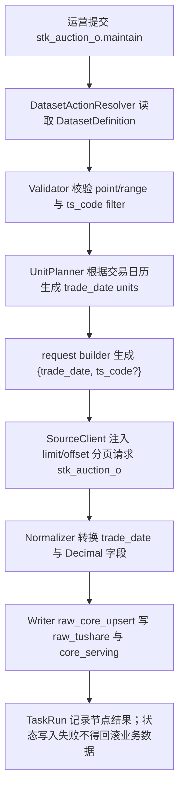

# 股票开盘集合竞价数据集接入方案（`stk_auction_o`）

> 状态：数据集接入及 raw 直出 `P1-B3-stk_auction_o-M0/M1/M2/M3a/M3b` 已通过并结案；生产已是 raw 唯一物理事实表和 0 B serving view
> 日期：2026-05-16
> raw 直出 M0 复审：2026-08-28
> raw 直出 M1 实现：2026-08-28
> raw 直出 M2 隔离验证：2026-08-28
> raw 直出 M3a 生产验收：2026-08-28
> raw 直出 M3b 自然运行验收：2026-08-29
> 文档模板：[数据集开发说明模板](/Users/congming/github/goldenshare/docs/templates/dataset-development-template.md)
> 源站文档：[0353_股票开盘集合竞价数据.md](/Users/congming/github/goldenshare/docs/sources/tushare/股票数据/特色数据/0353_股票开盘集合竞价数据.md)

## 0. 架构基线与本轮边界

本方案已落地 `stk_auction_o` 数据集的 Definition、请求参数、ORM/DAO、Alembic 迁移、Ops 展示目录、freshness 与盘后工作流接入。本文档仍作为后续验收与维护口径。

已读取并遵守：

- 仓库根规则：`AGENTS.md`
- 文档规则：`docs/AGENTS.md`
- 数据集文档规则：`docs/datasets/AGENTS.md`
- 日期模型基线：[dataset-date-model-consumer-guide-v1.md](/Users/congming/github/goldenshare/docs/architecture/dataset-date-model-consumer-guide-v1.md)
- DatasetDefinition 主线：[dataset-definition-single-source-refactor-plan-v1.md](/Users/congming/github/goldenshare/docs/architecture/dataset-definition-single-source-refactor-plan-v1.md)
- ExecutionPlan 主线：[dataset-execution-plan-refactor-plan-v1.md](/Users/congming/github/goldenshare/docs/architecture/dataset-execution-plan-refactor-plan-v1.md)

本方案遵守三层分离：

- Ops / TaskRun / Schedule 只保存用户或调度意图。
- `DatasetActionResolver` 根据 `DatasetDefinition.date_model` 生成执行计划与日期 unit。
- request builder 只把执行锚点映射成 Tushare 源接口参数。

## 1. 基本信息

| 项 | 设计 |
| --- | --- |
| 数据集 key | `stk_auction_o` |
| 中文显示名 | 股票开盘集合竞价 |
| 所属定义文件 | `src/foundation/datasets/definitions/market_equity.py` |
| 底层领域 | `equity_market` / 股票行情 |
| 数据源 | `tushare` |
| 源站 API | `stk_auction_o` |
| 源站接口含义 | 股票开盘 9:30 集合竞价数据，每天盘后更新 |
| Tushare 权限 | 需要开通股票分钟权限 |
| 是否对外服务 | 是，进入 `core_serving` |
| 是否多源融合 | 否 |
| 是否纳入自动任务 | 是，支持盘后按交易日自动维护 |
| 是否纳入默认工作流 | 已确认纳入 `daily_market_close_maintenance`；实现时必须新增 workflow step，并确认执行顺序 |
| 是否纳入日期完整性审计 | 是 |
| Ops 展示分组 | `equity_market` / A股行情 |
| Ops 展示顺序建议 | `82`，放在股票日线附近 |

说明：`DatasetDefinition.domain` 只表达底层领域事实；运营后台分组必须通过 `src/ops/catalog/dataset_catalog_views.py` 的 Ops 展示目录配置。

## 2. 源站接口事实

### 2.1 输入参数

| 参数名 | 类型 | 必填 | 源站说明 | 类别 | 是否给运营填写 | 对应 `DatasetInputField` | 备注 |
| --- | --- | --- | --- | --- | --- | --- | --- |
| `ts_code` | string | 否 | 股票代码 | 代码过滤 | 是 | `filters.ts_code` | 可用于单股局部维护 |
| `trade_date` | string | 否 | 交易日期 | 时间点 | 是 | `time_fields.trade_date` | 格式由 request builder 转成 `YYYYMMDD` |
| `start_date` | string | 否 | 开始日期 | 时间区间 | 是 | `time_fields.start_date` | 上层表达区间意图，主链不直接打大区间 |
| `end_date` | string | 否 | 结束日期 | 时间区间 | 是 | `time_fields.end_date` | 上层表达区间意图，主链不直接打大区间 |
| `limit` | int | 否 | 单页条数 | 分页 | 否 | 不暴露 | `DatasetSourceClient` 根据 `page_limit` 注入 |
| `offset` | int | 否 | 偏移量 | 分页 | 否 | 不暴露 | `DatasetSourceClient` 根据分页循环注入 |

### 2.2 输出字段

| 字段名 | 含义 | 是否落 raw | 是否进入 serving | 清洗规则 |
| --- | --- | --- | --- | --- |
| `ts_code` | 股票代码 | 是 | 是 | 必填，字符串去空格并转大写 |
| `trade_date` | 交易日期 | 是 | 是 | 必填，`YYYYMMDD` 转 `date` |
| `close` | 集合竞价收盘价 | 是 | 是 | Decimal，允许 0 |
| `open` | 集合竞价开盘价 | 是 | 是 | Decimal，允许 0 |
| `high` | 集合竞价最高价 | 是 | 是 | Decimal，允许 0 |
| `low` | 集合竞价最低价 | 是 | 是 | Decimal，允许 0 |
| `vol` | 成交量 | 是 | 是 | Decimal，允许 0 |
| `amount` | 成交金额 | 是 | 是 | Decimal，允许 0 |
| `vwap` | 均价 | 是 | 是 | Decimal，允许 0 |

## 3. 源接口真实行为验证

验证方式：已使用 `tushare-data` 技能流程读取源文档，并用 `tushareMcp.stk_auction_o` 与本地 Tushare SDK 真实请求验证。

| 请求形态 | 实际请求参数 | 源端返回 | 是否分页 | 样本 / 结论 |
| --- | --- | --- | --- | --- |
| 不传业务参数 | `limit=5, offset=0` | 5 行 | 是 | 返回最近交易日数据；源端支持，但平台维护不采用无时间意图 |
| 只传对象过滤 | `ts_code=000001.SZ, limit=5` | 5 行 | 是 | 返回该股票最近多日数据；`ts_code` 只能作为 filter，不改变日期主模型 |
| 只传时间点 | `trade_date=20260515, limit=10000` | 5488 行 | 是 | 单日全市场可取，常规单日低于接口上限 10000 |
| 传时间区间 | `ts_code=000001.SZ, start_date=20260514, end_date=20260515` | 2 行 | 否 | 单代码区间可取；平台区间维护仍按交易日 fan-out，不直接打全市场大区间 |
| 分页第二页 | `trade_date=20260515, limit=3, offset=3` | 3 行 | 是 | `limit/offset` 生效，分页策略必须保留 |

关键样本：

```json
{
  "ts_code": "000001.SZ",
  "trade_date": "20260515",
  "close": 11.05,
  "open": 11.05,
  "high": 11.06,
  "low": 11.05,
  "vol": 571500.0,
  "amount": 6315253.76,
  "vwap": 11.05
}
```

风险记录：

- `tushareMcp` 单日单代码请求成功。
- `tushareMcp` 的 `ts_code + start_date/end_date` 请求曾出现 30 秒超时，但本地 Tushare SDK 同参数成功；因此主链必须避免大区间直打源站，按交易日 unit 执行更稳。
- 单日全市场实测 5488 行，虽然低于 10000，仍保留 `offset_limit` 分页，防止源端扩容或后续字段变化导致截断。

## 4. 三层语义拆分

| 语义层 | 本数据集答案 | 已核验依据 |
| --- | --- | --- |
| 时间输入语义 | 运营提交单个交易日，或提交交易日起止区间；可选填写股票代码做局部维护 | 源文档输入参数与真实请求验证 |
| 执行 / unit 语义 | `point` 生成 1 个交易日 unit；`range` 根据交易日历扇出为多个交易日 unit；每个 unit 内部分页拉取并以 unit 为事务边界写入 | `DatasetUnitPlanner._resolve_anchors` 当前按 `trade_open_day + every_open_day` 扇出 |
| freshness / audit 语义 | 全市场开盘集合竞价应按每个开市日连续维护，使用 `continuous_open_day`，日期完整性审计适用 | `freshness_policies.py` 当前同类行情数据使用 `continuous_open_day` |

## 5. DatasetDefinition 事实设计

### 5.1 `identity`

```python
"identity": {
    "dataset_key": "stk_auction_o",
    "display_name": "股票开盘集合竞价",
    "description": "维护股票开盘 9:30 集合竞价数据。",
    "aliases": (),
}
```

### 5.2 `domain`

```python
"domain": {
    "domain_key": "equity_market",
    "domain_display_name": "股票行情",
}
```

### 5.3 `source`

```python
"source": {
    "source_key_default": "tushare",
    "source_keys": ("tushare",),
    "adapter_key": "tushare",
    "api_name": "stk_auction_o",
    "source_fields": (
        "ts_code", "trade_date", "close", "open", "high",
        "low", "vol", "amount", "vwap",
    ),
    "source_doc_id": "tushare.stk_auction_o",
    "request_builder_key": "_stk_auction_o_params",
    "base_params": {},
}
```

说明：不复用 `_trade_date_or_start_end_params`。该通用 builder 在 `range_rebuild` 下会生成 `start_date/end_date`，而本数据集主链需要每个交易日 unit 传 `trade_date`，与 `daily`、`stk_limit` 这类单日行情保持一致。

### 5.4 `date_model`

```python
"date_model": {
    "date_axis": "trade_open_day",
    "bucket_rule": "every_open_day",
    "window_mode": "point_or_range",
    "input_shape": "trade_date_or_start_end",
    "observed_field": "trade_date",
    "audit_applicable": True,
    "not_applicable_reason": None,
}
```

### 5.5 `input_model`

```python
"input_model": {
    "time_fields": (
        {"name": "trade_date", "field_type": "date", "display_name": "处理日期", "description": "交易日"},
        {"name": "start_date", "field_type": "date", "display_name": "开始日期", "description": "起始交易日"},
        {"name": "end_date", "field_type": "date", "display_name": "结束日期", "description": "结束交易日"},
    ),
    "filters": (
        {"name": "ts_code", "field_type": "string", "display_name": "股票代码", "description": "可选，单股局部维护"},
    ),
}
```

### 5.6 `storage`

```python
"storage": {
    "raw_dao_name": "raw_stk_auction_o",
    "core_dao_name": "raw_stk_auction_o",
    "target_table": "raw_tushare.stk_auction_o",
    "delivery_mode": "raw_with_serving_view",
    "layer_plan": "raw->serving_view",
    "std_table": None,
    "serving_table": "core_serving.equity_auction_open",
    "raw_table": "raw_tushare.stk_auction_o",
    "conflict_columns": None,
    "write_path": "raw_only_upsert",
}
```

表设计：

| 表 | 主键 | 索引 | 字段 |
| --- | --- | --- | --- |
| `raw_tushare.stk_auction_o` | `(ts_code, trade_date)` | `idx_raw_tushare_stk_auction_o_trade_date` | 源字段 + `api_name` + `fetched_at` + `raw_payload` |
| `core_serving.equity_auction_open` | 普通只读 view，不再有独立主键/索引物理对象 | 查询下推 raw 的 `trade_date` 索引 | 显式投影 9 个源字段，`fetched_at` 投影为 `created_at/updated_at` |

价格字段使用 `Numeric(18, 4)`；`vol`、`amount` 使用 `Numeric(20, 4)`。

### 5.7 `planning`

```python
"planning": {
    "universe_policy": "no_pool",
    "enum_fanout_fields": (),
    "enum_fanout_defaults": {},
    "pagination_policy": "offset_limit",
    "page_limit": 10000,
    "chunk_size": None,
    "max_units_per_execution": None,
    "unit_builder_key": "generic",
}
```

说明：

- 不按股票池自动扇出；源端支持单日全市场返回，`ts_code` 只是可选过滤。
- `range` 由 `DatasetUnitPlanner` 按交易日历扇成多个 `trade_date` unit。
- `limit/offset` 由 `DatasetSourceClient` 注入，不暴露给运营用户。

### 5.8 `normalization`

```python
"normalization": {
    "date_fields": ("trade_date",),
    "decimal_fields": ("close", "open", "high", "low", "vol", "amount", "vwap"),
    "required_fields": ("trade_date", "ts_code"),
    "row_transform_name": None,
}
```

### 5.9 `capabilities`

```python
"capabilities": {
    "actions": (
        {
            "action": "maintain",
            "manual_enabled": True,
            "schedule_enabled": True,
            "retry_enabled": True,
            "supported_time_modes": ("point", "range"),
        },
    ),
}
```

### 5.10 `observability` / `quality` / `transaction`

```python
"observability": {
    "progress_label": "stk_auction_o",
    "observed_field": "trade_date",
    "audit_applicable": True,
}

"quality": {
    "reject_policy": "record_rejections",
    "required_fields": ("trade_date", "ts_code"),
}

"transaction": {
    "commit_policy": "unit",
    "idempotent_write_required": False,
    "write_volume_assessment": "单日全市场实测约 5500 行；按交易日 unit 写入，单 unit 内分页拉取后一次提交。",
}
```

`src/foundation/datasets/freshness_policies.py` 必须登记：

```python
"stk_auction_o": CONTINUOUS_OPEN_DAY
```

## 6. 执行流程



## 7. 消费者审计

| 消费方 | 是否受影响 | 需要改动 | 已核验代码位置 |
| --- | --- | --- | --- |
| manual actions | 是 | 新增 action 后由 Definition 派生表单 | `src/ops/queries/manual_action_query_service.py` |
| catalog | 是 | 新增 Ops 展示目录 item | `src/ops/catalog/dataset_catalog_views.py` |
| workflow | 是 | 新增 `daily_market_close_maintenance` workflow step，并确认执行顺序 | `src/ops/action_catalog.py` |
| resolver / unit planner | 是 | 复用 `trade_open_day + every_open_day + generic` | `src/foundation/ingestion/resolver.py`，`src/foundation/ingestion/unit_planner.py` |
| request builder | 是 | 新增 `_stk_auction_o_params`，按 anchor 生成 `trade_date` | `src/foundation/ingestion/request_builders.py` |
| freshness | 是 | 登记 `continuous_open_day` | `src/foundation/datasets/freshness_policies.py`，`src/ops/queries/freshness_query_service.py` |
| dataset cards | 是 | 由 DatasetDefinition / freshness 派生 | `src/ops/queries/dataset_card_query_service.py` |
| snapshot rebuild | 是 | 新增 Definition 后纳入 snapshot rebuild | `src/ops/services/operations_dataset_status_snapshot_service.py` |
| date completeness audit | 是 | `audit_applicable=True` 后自动纳入 | `src/ops/services/date_completeness_run_service.py` |
| 自动任务 / calendar policy | 是 | 使用交易日选择规则，无需新增 policy | `src/ops/services/operations_schedule_service.py` |
| 前端时间控件 | 是 | 根据 `trade_date_or_start_end` 展示交易日 point/range | `src/ops/queries/manual_action_query_service.py` |
| 测试与文档 | 是 | 新增定义、请求、分页、Ops、文档测试 | `tests/**` |

## 8. 测试与验收清单

实现阶段至少补齐：

- `tests/test_dataset_definition_registry.py`：`stk_auction_o` 定义、日期模型、freshness policy。
- `tests/test_fields_constants.py`：`source_fields` 与源文档字段一致。
- `tests/test_dataset_action_resolver.py`：point 生成 1 个 unit，range 按交易日扇出。
- `tests/test_ingestion_request_builders.py`：range unit request params 使用 `trade_date`，不是 `start_date/end_date`。
- `tests/test_ingestion_source_client.py`：`offset_limit` 注入 `limit/offset`。
- `tests/test_extended_models.py`：raw 与 serving 主键、索引、字段类型。
- `tests/web/test_ops_manual_actions_api.py`：手动任务表单显示交易日 point/range 与 `ts_code`。
- `tests/web/test_ops_catalog_api.py`：数据源卡片展示分组为 A股行情。
- `tests/web/test_ops_freshness_api.py`：freshness policy 为 `continuous_open_day`。
- `python3 scripts/check_docs_integrity.py`。

真实验收必须记录：

- 源端 fetched 行数。
- normalized 行数。
- raw 写入行数。
- serving 写入行数。
- rejected 行数与 reason code。
- `core_serving.equity_auction_open` 对应交易日实际行数。

## 9. 已确认口径

| 编号 | 决策项 | 建议 |
| --- | --- | --- |
| D1 | 是否本次实现就加入 `daily_market_close_maintenance` 默认工作流 | 已确认加入。实现阶段必须同步更新 workflow step、相关测试与验收记录 |

## 10. 明确不做

- 不使用 `stk_auction` 接口。`stk_auction` 是“当日集合竞价”接口，字段和业务含义不同，应作为未来单独数据集评审。
- 不把 `limit` / `offset` 暴露给运营填写。
- 不做无时间维度 snapshot 维护；即使源端不传参数能返回最近数据，本平台维护仍要求明确交易日或交易日区间。
- 不引入股票池自动扇出。

## 11. 2026-08-28 `P1-B3-stk_auction_o-M0` raw 直出只读复审

本轮只读取当前代码、CodeGraph 与生产 PostgreSQL，没有请求 Tushare、创建 TaskRun、部署、迁移、暂停 schedule 或修改业务数据。结论是：**业务数据合同、对象合同、消费者边界和有界迁移容量已通过 M0，允许另行授权 M1/M2；生产 M3a 暂不放行，必须先关闭日期完整性查询的可见性性能门禁。**

### 11.1 当前实现与消费者

1. 当前 Definition 仍是 `raw_core_upsert`：同一归一化批次分别写入 `raw_tushare.stk_auction_o` 与 `core_serving.equity_auction_open`；显式请求 9 个 source fields，单交易日 unit，`limit/offset` 分页和 `page_limit=10000` 均保持不变。
2. 两层主键均为 `(ts_code, trade_date)`，均有等价的 `trade_date` 二级索引；未发现 serving 专属转换、行过滤、聚合、冲突消解、ServingPublish 旁路或仓库内 serving DML。
3. 未发现 Biz、QTF、DG、前端或 Lake Console 对 `core_serving.equity_auction_open` 的直接读取；当前已知消费者是 Ops Catalog、freshness、日期完整性与 TaskRun 观测。仓库外 SQL、BI 和依赖 relation catalog 的工具仍需在生产切换前由运营登记。
4. 自动入口不是独立 dataset schedule，而是 `daily_market_close_maintenance` 的两个 active schedule：#24 在 18:30，#2 在 21:02。最近自然任务中，18:30 节点按当前源端时机返回 0 行；21:02 节点返回约 5,500 行、1 页短页、0 reject/去重/重试。未来维护窗口必须同时暂停、恢复并分别验收两个入口，不能只处理其中一个。

### 11.2 生产物理合同与全量数据等价

1. PostgreSQL 16.13、Alembic revision `20260828_000155`；raw/serving 当前均为 `pg_default` 普通物理表，没有外部 view 依赖、用户 trigger、RLS、publication 或扩展统计对象。
2. raw 与 serving 各有 **2,183,621 行**和同等数量的唯一 `(ts_code, trade_date)`，无空身份，日期范围均为 `2025-01-02..2026-08-27`。
3. 按全部 20 个自然月对 9 个业务字段执行双向 `EXCEPT ALL`，每月 raw-only 和 serving-only 都为 0。月峰值是 `2026-07` 的 126,364 行；后续独立 migration 的 fail-closed 月容量门禁固定为 **160,000 行/层/月**，必须验证 160,001 行在任何 serving DDL 前失败。
4. 当前 raw 总大小为 411,148,288 B（392.10 MiB）；serving 总大小为 382,353,408 B（364.64 MiB）。后者是本项当前 catalog 毛释放量，不能用文件系统瞬时差值替代。
5. `raw.fetched_at = serving.updated_at` 对全部行成立；93,560 行的 `serving.created_at` 早于最新同步时间。raw-backed view 会把 `fetched_at` 投影为 `created_at/updated_at`，因此不承诺历史审计时间逐行透明；当前代码未发现这些字段的业务消费者。

### 11.3 查询基线与未关闭门禁

三轮交错只读基准的结果校验值均一致：最大日期 `0.112/0.135 ms`、单日全字段 5,512 行 `11.551/11.129 ms`、单股全历史 401 行 `1.475/1.293 ms`、五个交易日全市场 27,506 行 `54.081/53.961 ms`，前者均为 raw/serving 中位耗时且没有临时块读写。

日期完整性代表查询返回相同 81 个交易日，但 raw/serving 中位耗时为 `75.683/54.636 ms`，raw 慢 38.5%，超过一期 20% 门禁。计划确认两层都使用日期索引；差异来自 raw 只有 80.18% heap page 为 all-visible、发生 456,208 次 heap fetch，而 serving 为 92.91% 和 188,095 次。两表约 9.9 万 dead tuple，默认 autovacuum 阈值约为 42 万行，短期不会靠默认阈值自行关闭。

因此 M1 不得修改 source fields、分页、日期模型、planner、workflow 或共享 writer；只能准备本数据集 raw-only Definition、独立 migration 与测试。M2 必须在隔离 PostgreSQL 验证 160,000/160,001 行、逐月全字段差异、事务回滚、权限、三类 serving DML 拒绝、view 即时可见及上述代表查询。未来 M3a 在暂停 schedule #2/#24、停止相关 worker 且无开放任务/长事务后，须先对 raw 执行经授权的普通 `VACUUM (ANALYZE)`，再重复三轮日期完整性基准；结果仍慢于 serving 超过 20% 时，必须在 migration 前停止，不得删除 serving 表。

## 12. 2026-08-28 `P1-B3-stk_auction_o-M1` 编码与自动化验证

M1 严格限于本数据集的 Definition storage contract、独立 Alembic revision、专项测试与现行文档。没有连接 PostgreSQL、请求 Tushare、部署、执行 migration、创建 TaskRun、暂停 schedule 或运行 `VACUUM`；source fields、日期/unit、`ts_code` filter、10,000 行分页、request builder、normalizer、共享 writer、workflow/freshness 和前端合同均未改变。

1. Definition 已从 raw/core 双写收敛为 `raw_only_upsert`：`raw_dao_name/core_dao_name` 均指向既有 `raw_stk_auction_o`，正式写入目标改为 `raw_tushare.stk_auction_o`；`core_serving.equity_auction_open` 名称继续作为 serving view 对下游提供原 11 列合同。
2. `RawStkAuctionO` 已完整声明生产现有的 `(ts_code, trade_date)` 主键和单列 `trade_date` 索引，业务字段与原 serving ORM 名称、类型、nullability 完全一致，因此 M1 没有修改 ORM、DAO factory、索引或共享 writer。参数化 writer 测试证明正式写入只调用 raw DAO，serving 不再获得第二份物理写入。
3. 新增独立 revision `20260828_000156`，其 `down_revision` 连接编码时唯一真实 head `20260828_000155`。migration 在任何 serving DDL 前验证两层均为预期普通物理表、owner、raw SSD tablespace、精确列/主键/索引、未知依赖、ACL/RLS/publication/security label 与共享拒写函数合同；raw 先取 `SHARE` 锁，serving 后取 `SHARE` 锁，九字段逐自然月双向 `EXCEPT ALL` 通过后才获取 serving `ACCESS EXCLUSIVE` 锁。
4. 月度容量上限按 M0 证据固定为每层 160,000 行；160,001 行、任一身份/字段差异或未知对象合同都必须在 `DROP TABLE` 前失败并由同一事务整体回滚。migration 不创建或修改 raw 索引，不写 raw 数据，不使用 `CASCADE`，也禁止自动 downgrade。
5. 切换后的普通 view 使用显式 11 列投影：九个源字段加 `fetched_at AS created_at/updated_at`；原 owner、非 owner `SELECT` 权限、relation/column comments 被动态恢复，并使用已有 `reject_raw_direct_serving_view_dml()` 与本 relation 独立 trigger 拒绝 `INSERT/UPDATE/DELETE`。这保持表名和查询列透明，但不承诺原 relation OID、relkind、PK/index catalog 或历史 `created_at` 值透明。
6. 专项测试已覆盖 Definition/plan/filter、全部 source fields、分页、raw-only writer、ORM 字段和索引、ServingPublish 无旁路、migration 原子顺序/资源上限/依赖门禁/显式投影/拒写函数/离线 SQL 与禁止 downgrade；既有 registry、resolver、字段常量、workflow/freshness 和架构回归继续作为不变合同门禁。

M1 结论为**通过**。当前生产仍是 revision 155，raw/serving 仍是两张物理表；下一阶段只能在独立授权后进入 `P1-B3-stk_auction_o-M2`，于隔离 PostgreSQL 真实验证 revision 156、160,000/160,001 行边界、事务回滚、权限恢复、三类 DML、raw 写入/view 即时可见和代表查询计划。M0 记录的日期完整性性能门禁继续阻塞 M3a，不能由 M1 静态测试替代。

## 13. 2026-08-28 `P1-B3-stk_auction_o-M2` 隔离 PostgreSQL 验证

M2 使用 PostgreSQL 18.4 的一次性隔离实例，实例仅监听随机 Unix socket，`listen_addresses=''`、`inet_server_addr=NULL`；每次 Alembic 前都核对最终 `get_settings()` URL、数据库名、应用用户、socket、端口和 data directory。没有连接 Prod、请求 Tushare、部署、创建 TaskRun、修改 schedule 或运行生产 vacuum。全部场景结束后临时实例停止，成功实例数据目录已删除，证据报告仅保留在 `/private/tmp/goldenshare_stk_auction_o_m2_report.json`。

1. 正向库在同一自然月构造 **160,000 行/层**，revision `20260828_000155 -> 20260828_000156` 成功。Raw OID `16391`、主键索引 OID `16402`、日期索引 OID `16404` 均保持不变，两个索引继续 valid/ready 且位于 `pg_default`；Serving 从 OID `16405` 的物理表切换为 OID `16421`、0 B 普通 view。
2. 切换后 Raw/view 均为 160,000 行和 160,000 个唯一 `(ts_code, trade_date)`；九字段双向 `EXCEPT ALL` 和 `fetched_at -> created_at/updated_at` 审计投影差异均为 0。view 列顺序、owner、Raw reader 权限、Serving `SELECT WITH GRANT OPTION`、relation/column comments 和独立拒写 trigger 全部恢复。
3. 对 Serving 执行 `INSERT/UPDATE/DELETE` 均以 SQLSTATE `55000` 拒绝。对 Raw 的插入、更新、删除在同一事务内立即反映到 view，回滚后行数和测试身份无残留。正式 `DatasetWriter` 对一个既有身份返回 `rows_written=1`、目标表为 `raw_tushare.stk_auction_o`，Raw/view 同时看到新值；事务回滚后原值和原时间戳完整恢复。
4. **160,001 行/月**明确触发 `monthly reconciliation exceeds safety cap`；另三个负向库分别注入业务字段差异、身份差异和外部 view 依赖，均在 Serving DDL 前失败，revision、relation OID/类型、索引、行数、comments 和 trigger 快照保持不变。
5. 独立回滚库在同一事务完成 `DROP TABLE -> CREATE VIEW -> trigger` 后注入除零失败；回滚后 revision 155、两张物理表、Raw/Serving OID、全部索引 OID/定义/valid/ready、ACL、comments、行数和零用户 trigger 与执行前完全一致。
6. 四类代表查询切换前后结果行数和 SHA-256 均一致且无临时块：单日 5,714 行由 Serving 日期索引下推为 Raw 日期索引，`2.520 -> 2.661 ms`；单股单日由 Serving PK 下推 Raw PK，`0.005 -> 0.007 ms`；最大日期由日期 index-only scan 下推，`0.005 -> 0.007 ms`；10 日日期完整性汇总继续使用日期索引，`8.306 -> 8.758 ms`。隔离数据上的最大正向退化约 5.4%，只证明计划形态与结果稳定，不替代生产 M3a 的可见页/vacuum 性能门禁。

M2 结论为**通过**，revision 156 无需修改。生产仍是 revision 155，Raw/Serving 仍为两张物理表。下一阶段只有在另行授权后才能进入 `P1-B3-stk_auction_o-M3a`：实时只读预检后暂停 schedule #2/#24、停止目标 worker，先对生产 Raw 执行已设计的普通 `VACUUM (ANALYZE)` 并交错重测日期完整性；只有相对退化不超过 20%、结果/计划/临时块合同同时通过，才允许应用 revision 156。M2 不授权任何生产操作。

## 14. 2026-08-28 `P1-B3-stk_auction_o-M3a` 生产即时验收

M3a 于 `14:56..15:05+08` 完成。开始只读预检时发现，运营侧一次标准完整部署已在暂停 schedule/worker 之前拉取包含 M1 的 commit `bbb3befc`、自动应用 revision 156，并于 `14:58` 重启 Web、scheduler 与 worker。该顺序不符合本文固定维护窗口合同，已经作为发布流程偏差保留；本轮没有重复执行 migration，也没有倒推或补造迁移前门禁证据。发现时生产代码已包含 raw-only Definition，Serving 已是 view，开放 TaskRun、目标 node、等待锁和长事务均为 0，未出现旧双写代码向 view 写入的窗口。

1. 迁移后 Raw OID 仍为 `808825`，主键与日期索引 OID/定义不变且 valid/ready；`core_serving.equity_auction_open` 为 OID `2032797` 的 0 B 普通 view，显式投影九个源字段及 `fetched_at AS created_at/updated_at`。owner、Raw 的 `lake_raw_reader SELECT` 和 Serving 原权限均存在；Serving `INSERT/UPDATE/DELETE` 分别以 SQLSTATE `55000` 拒绝。
2. schedule #2/#24 经正式 `OpsScheduleCommandService` 暂停，config revision `113/114` 记录 `paused`；通用 worker 随后停止。再次确认开放 TaskRun、开放目标 node、目标锁、等待锁和超过 30 秒事务均为 0，根盘可用 `52,920,033,280 B`。
3. 在维护窗口执行普通 `VACUUM (ANALYZE) raw_tushare.stk_auction_o`，未使用 `VACUUM FULL`、未改 OID/索引/表空间。Raw 的 all-visible page 从 80.18% 提升至 100%，`n_dead_tup` 统计归零；普通 vacuum 不计入空间释放量。
4. M0 旧物理 Serving 的日期完整性三轮中位数为 `54.636 ms`；vacuum 后 Raw 为 `50.751 ms`，相对约快 7.1%，20% 性能门禁关闭。当前 Raw/Serving view 的五类查询结果校验值全部一致，计划均下推 Raw 的日期索引或主键索引，无临时块；其中日期完整性 Raw/view 为 `50.751/53.614 ms`。由于 Serving 已提前成为 view，本轮明确以 M0 留存的旧物理 Serving 基线作历史对照，不宣称补做了同一时点的迁移前测试。
5. Web、日期完整性 worker 与 TaskRun 收尾 worker 的连接池已回收，健康端点正常；通用 worker 恢复后，通过正式 `ManualActionCommandService -> DatasetActionResolver -> TaskRun` 创建最小 TaskRun `9726`，只请求 `2026-08-27` 一个 point unit。任务 `1/1` 成功，1 页短页读取/保存 `5,512/5,512`，reject、去重、重试均为 0，无截断。
6. TaskRun 时间窗内目标日 5,512 行全部刷新；Raw/view 均为 5,512 行和 5,512 个唯一 `(ts_code, trade_date)`，九字段双向差异为 0。全表最终均为 2,183,621 行和 2,183,621 个唯一身份，日期范围 `2025-01-02..2026-08-27`。
7. TaskRun 完成且开放任务归零后，schedule #2/#24 通过正式 service 原样恢复，config revision `115/116` 记录 `resumed`；cron、时区、`next_run_at` 和 `last_triggered_at` 未被改写。最终 Web、scheduler、通用 worker、日期完整性 worker 与 TaskRun 收尾 worker均为 active，健康端点正常，目标锁和长事务为 0。

M3a 结论为**通过，但保留“标准部署在维护门禁前自动应用 migration”的流程偏差**。原 Serving 物理 relation 的 `382,353,408 B（364.64 MiB）` 已释放；最终 view 为 0 B，Raw 继续位于 SSD `pg_default`。

## 15. 2026-08-29 `P1-B3-stk_auction_o-M3b` 自然运行验收

schedule #24 的 TaskRun `9747` 与 schedule #2 的 TaskRun `9773` 均成功处理 `2026-08-28`。18:30 的目标节点为 1 页空短页、读取/保存 `0/0`；21:02 的目标节点为 1 页短页、读取/保存 `5,508/5,508`。两个节点的 reject、去重、重试均为 0，均未截断。最终 Raw/view 各 5,508 行和 5,508 个唯一 `(ts_code, trade_date)`，九字段及审计时间投影双向差异为 0，必填身份无空值；最终数据覆盖 BJ 296、SH 2,315、SZ 2,897 行。

这两次自然运行证明的是源端就绪时序：18:30 尚无数据，21:02 已返回完整单日结果，不能把它们伪装成两次相同非空快照的幂等试验。生产 TaskRun `9726` 已对已有日期 `2026-08-27` 重跑 5,512 行且目标日和全表行数未增加，结合当前 `(ts_code, trade_date)` 主键，幂等门禁已由该证据闭环。`P1-B3-stk_auction_o-M3b` 据此通过，M0/M1/M2/M3a/M3b 全部完成，本数据集结案；标准部署提前应用 revision 156 的历史流程偏差继续保留。
