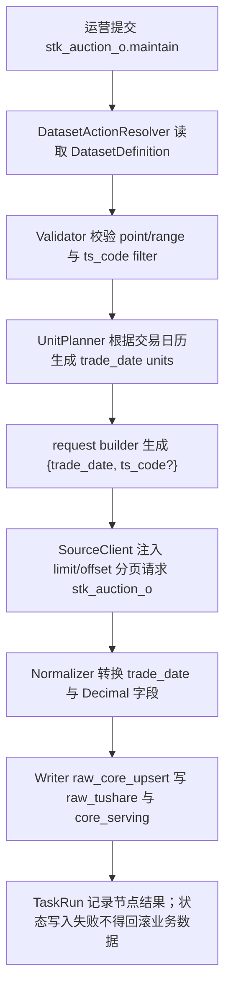

# 股票开盘集合竞价数据集接入方案（`stk_auction_o`）

> 状态：已落地  
> 日期：2026-05-16  
> 文档模板：[数据集开发说明模板](/Users/congming/github/goldenshare/docs/templates/dataset-development-template.md)  
> 源站文档：[0353_股票开盘集合竞价数据.md](/Users/congming/github/goldenshare/docs/sources/tushare/股票数据/特色数据/0353_股票开盘集合竞价数据.md)

## 0. 架构基线与本轮边界

本方案已落地 `stk_auction_o` 数据集的 Definition、请求参数、ORM/DAO、Alembic 迁移、Ops 展示目录、freshness 与盘后工作流接入。本文档仍作为后续验收与维护口径。

已读取并遵守：

- 仓库根规则：`AGENTS.md`
- 文档规则：`docs/AGENTS.md`
- 数据集文档规则：`docs/datasets/AGENTS.md`
- 日期模型基线：[dataset-date-model-consumer-guide-v1.md](/Users/congming/github/goldenshare/docs/architecture/dataset-date-model-consumer-guide-v1.md)
- DatasetDefinition 主线：[dataset-definition-single-source-refactor-plan-v1.md](/Users/congming/github/goldenshare/docs/architecture/dataset-definition-single-source-refactor-plan-v1.md)
- ExecutionPlan 主线：[dataset-execution-plan-refactor-plan-v1.md](/Users/congming/github/goldenshare/docs/architecture/dataset-execution-plan-refactor-plan-v1.md)

本方案遵守三层分离：

- Ops / TaskRun / Schedule 只保存用户或调度意图。
- `DatasetActionResolver` 根据 `DatasetDefinition.date_model` 生成执行计划与日期 unit。
- request builder 只把执行锚点映射成 Tushare 源接口参数。

## 1. 基本信息

| 项 | 设计 |
| --- | --- |
| 数据集 key | `stk_auction_o` |
| 中文显示名 | 股票开盘集合竞价 |
| 所属定义文件 | `src/foundation/datasets/definitions/market_equity.py` |
| 底层领域 | `equity_market` / 股票行情 |
| 数据源 | `tushare` |
| 源站 API | `stk_auction_o` |
| 源站接口含义 | 股票开盘 9:30 集合竞价数据，每天盘后更新 |
| Tushare 权限 | 需要开通股票分钟权限 |
| 是否对外服务 | 是，进入 `core_serving` |
| 是否多源融合 | 否 |
| 是否纳入自动任务 | 是，支持盘后按交易日自动维护 |
| 是否纳入默认工作流 | 已确认纳入 `daily_market_close_maintenance`；实现时必须新增 workflow step，并确认执行顺序 |
| 是否纳入日期完整性审计 | 是 |
| Ops 展示分组 | `equity_market` / A股行情 |
| Ops 展示顺序建议 | `82`，放在股票日线附近 |

说明：`DatasetDefinition.domain` 只表达底层领域事实；运营后台分组必须通过 `src/ops/catalog/dataset_catalog_views.py` 的 Ops 展示目录配置。

## 2. 源站接口事实

### 2.1 输入参数

| 参数名 | 类型 | 必填 | 源站说明 | 类别 | 是否给运营填写 | 对应 `DatasetInputField` | 备注 |
| --- | --- | --- | --- | --- | --- | --- | --- |
| `ts_code` | string | 否 | 股票代码 | 代码过滤 | 是 | `filters.ts_code` | 可用于单股局部维护 |
| `trade_date` | string | 否 | 交易日期 | 时间点 | 是 | `time_fields.trade_date` | 格式由 request builder 转成 `YYYYMMDD` |
| `start_date` | string | 否 | 开始日期 | 时间区间 | 是 | `time_fields.start_date` | 上层表达区间意图，主链不直接打大区间 |
| `end_date` | string | 否 | 结束日期 | 时间区间 | 是 | `time_fields.end_date` | 上层表达区间意图，主链不直接打大区间 |
| `limit` | int | 否 | 单页条数 | 分页 | 否 | 不暴露 | `DatasetSourceClient` 根据 `page_limit` 注入 |
| `offset` | int | 否 | 偏移量 | 分页 | 否 | 不暴露 | `DatasetSourceClient` 根据分页循环注入 |

### 2.2 输出字段

| 字段名 | 含义 | 是否落 raw | 是否进入 serving | 清洗规则 |
| --- | --- | --- | --- | --- |
| `ts_code` | 股票代码 | 是 | 是 | 必填，字符串去空格并转大写 |
| `trade_date` | 交易日期 | 是 | 是 | 必填，`YYYYMMDD` 转 `date` |
| `close` | 集合竞价收盘价 | 是 | 是 | Decimal，允许 0 |
| `open` | 集合竞价开盘价 | 是 | 是 | Decimal，允许 0 |
| `high` | 集合竞价最高价 | 是 | 是 | Decimal，允许 0 |
| `low` | 集合竞价最低价 | 是 | 是 | Decimal，允许 0 |
| `vol` | 成交量 | 是 | 是 | Decimal，允许 0 |
| `amount` | 成交金额 | 是 | 是 | Decimal，允许 0 |
| `vwap` | 均价 | 是 | 是 | Decimal，允许 0 |

## 3. 源接口真实行为验证

验证方式：已使用 `tushare-data` 技能流程读取源文档，并用 `tushareMcp.stk_auction_o` 与本地 Tushare SDK 真实请求验证。

| 请求形态 | 实际请求参数 | 源端返回 | 是否分页 | 样本 / 结论 |
| --- | --- | --- | --- | --- |
| 不传业务参数 | `limit=5, offset=0` | 5 行 | 是 | 返回最近交易日数据；源端支持，但平台维护不采用无时间意图 |
| 只传对象过滤 | `ts_code=000001.SZ, limit=5` | 5 行 | 是 | 返回该股票最近多日数据；`ts_code` 只能作为 filter，不改变日期主模型 |
| 只传时间点 | `trade_date=20260515, limit=10000` | 5488 行 | 是 | 单日全市场可取，常规单日低于接口上限 10000 |
| 传时间区间 | `ts_code=000001.SZ, start_date=20260514, end_date=20260515` | 2 行 | 否 | 单代码区间可取；平台区间维护仍按交易日 fan-out，不直接打全市场大区间 |
| 分页第二页 | `trade_date=20260515, limit=3, offset=3` | 3 行 | 是 | `limit/offset` 生效，分页策略必须保留 |

关键样本：

```json
{
  "ts_code": "000001.SZ",
  "trade_date": "20260515",
  "close": 11.05,
  "open": 11.05,
  "high": 11.06,
  "low": 11.05,
  "vol": 571500.0,
  "amount": 6315253.76,
  "vwap": 11.05
}
```

风险记录：

- `tushareMcp` 单日单代码请求成功。
- `tushareMcp` 的 `ts_code + start_date/end_date` 请求曾出现 30 秒超时，但本地 Tushare SDK 同参数成功；因此主链必须避免大区间直打源站，按交易日 unit 执行更稳。
- 单日全市场实测 5488 行，虽然低于 10000，仍保留 `offset_limit` 分页，防止源端扩容或后续字段变化导致截断。

## 4. 三层语义拆分

| 语义层 | 本数据集答案 | 已核验依据 |
| --- | --- | --- |
| 时间输入语义 | 运营提交单个交易日，或提交交易日起止区间；可选填写股票代码做局部维护 | 源文档输入参数与真实请求验证 |
| 执行 / unit 语义 | `point` 生成 1 个交易日 unit；`range` 根据交易日历扇出为多个交易日 unit；每个 unit 内部分页拉取并以 unit 为事务边界写入 | `DatasetUnitPlanner._resolve_anchors` 当前按 `trade_open_day + every_open_day` 扇出 |
| freshness / audit 语义 | 全市场开盘集合竞价应按每个开市日连续维护，使用 `continuous_open_day`，日期完整性审计适用 | `freshness_policies.py` 当前同类行情数据使用 `continuous_open_day` |

## 5. DatasetDefinition 事实设计

### 5.1 `identity`

```python
"identity": {
    "dataset_key": "stk_auction_o",
    "display_name": "股票开盘集合竞价",
    "description": "维护股票开盘 9:30 集合竞价数据。",
    "aliases": (),
}
```

### 5.2 `domain`

```python
"domain": {
    "domain_key": "equity_market",
    "domain_display_name": "股票行情",
}
```

### 5.3 `source`

```python
"source": {
    "source_key_default": "tushare",
    "source_keys": ("tushare",),
    "adapter_key": "tushare",
    "api_name": "stk_auction_o",
    "source_fields": (
        "ts_code", "trade_date", "close", "open", "high",
        "low", "vol", "amount", "vwap",
    ),
    "source_doc_id": "tushare.stk_auction_o",
    "request_builder_key": "_stk_auction_o_params",
    "base_params": {},
}
```

说明：不复用 `_trade_date_or_start_end_params`。该通用 builder 在 `range_rebuild` 下会生成 `start_date/end_date`，而本数据集主链需要每个交易日 unit 传 `trade_date`，与 `daily`、`stk_limit` 这类单日行情保持一致。

### 5.4 `date_model`

```python
"date_model": {
    "date_axis": "trade_open_day",
    "bucket_rule": "every_open_day",
    "window_mode": "point_or_range",
    "input_shape": "trade_date_or_start_end",
    "observed_field": "trade_date",
    "audit_applicable": True,
    "not_applicable_reason": None,
}
```

### 5.5 `input_model`

```python
"input_model": {
    "time_fields": (
        {"name": "trade_date", "field_type": "date", "display_name": "处理日期", "description": "交易日"},
        {"name": "start_date", "field_type": "date", "display_name": "开始日期", "description": "起始交易日"},
        {"name": "end_date", "field_type": "date", "display_name": "结束日期", "description": "结束交易日"},
    ),
    "filters": (
        {"name": "ts_code", "field_type": "string", "display_name": "股票代码", "description": "可选，单股局部维护"},
    ),
}
```

### 5.6 `storage`

```python
"storage": {
    "raw_dao_name": "raw_stk_auction_o",
    "core_dao_name": "equity_auction_open",
    "target_table": "core_serving.equity_auction_open",
    "delivery_mode": "single_source_serving",
    "layer_plan": "raw->serving",
    "std_table": None,
    "serving_table": "core_serving.equity_auction_open",
    "raw_table": "raw_tushare.stk_auction_o",
    "conflict_columns": None,
    "write_path": "raw_core_upsert",
}
```

表设计：

| 表 | 主键 | 索引 | 字段 |
| --- | --- | --- | --- |
| `raw_tushare.stk_auction_o` | `(ts_code, trade_date)` | `idx_raw_tushare_stk_auction_o_trade_date` | 源字段 + `api_name` + `fetched_at` + `raw_payload` |
| `core_serving.equity_auction_open` | `(ts_code, trade_date)` | `idx_equity_auction_open_trade_date` | 源字段 + `created_at` + `updated_at` |

价格字段使用 `Numeric(18, 4)`；`vol`、`amount` 使用 `Numeric(20, 4)`。

### 5.7 `planning`

```python
"planning": {
    "universe_policy": "no_pool",
    "enum_fanout_fields": (),
    "enum_fanout_defaults": {},
    "pagination_policy": "offset_limit",
    "page_limit": 10000,
    "chunk_size": None,
    "max_units_per_execution": None,
    "unit_builder_key": "generic",
}
```

说明：

- 不按股票池自动扇出；源端支持单日全市场返回，`ts_code` 只是可选过滤。
- `range` 由 `DatasetUnitPlanner` 按交易日历扇成多个 `trade_date` unit。
- `limit/offset` 由 `DatasetSourceClient` 注入，不暴露给运营用户。

### 5.8 `normalization`

```python
"normalization": {
    "date_fields": ("trade_date",),
    "decimal_fields": ("close", "open", "high", "low", "vol", "amount", "vwap"),
    "required_fields": ("trade_date", "ts_code"),
    "row_transform_name": None,
}
```

### 5.9 `capabilities`

```python
"capabilities": {
    "actions": (
        {
            "action": "maintain",
            "manual_enabled": True,
            "schedule_enabled": True,
            "retry_enabled": True,
            "supported_time_modes": ("point", "range"),
        },
    ),
}
```

### 5.10 `observability` / `quality` / `transaction`

```python
"observability": {
    "progress_label": "stk_auction_o",
    "observed_field": "trade_date",
    "audit_applicable": True,
}

"quality": {
    "reject_policy": "record_rejections",
    "required_fields": ("trade_date", "ts_code"),
}

"transaction": {
    "commit_policy": "unit",
    "idempotent_write_required": False,
    "write_volume_assessment": "单日全市场实测约 5500 行；按交易日 unit 写入，单 unit 内分页拉取后一次提交。",
}
```

`src/foundation/datasets/freshness_policies.py` 必须登记：

```python
"stk_auction_o": CONTINUOUS_OPEN_DAY
```

## 6. 执行流程



## 7. 消费者审计

| 消费方 | 是否受影响 | 需要改动 | 已核验代码位置 |
| --- | --- | --- | --- |
| manual actions | 是 | 新增 action 后由 Definition 派生表单 | `src/ops/queries/manual_action_query_service.py` |
| catalog | 是 | 新增 Ops 展示目录 item | `src/ops/catalog/dataset_catalog_views.py` |
| workflow | 是 | 新增 `daily_market_close_maintenance` workflow step，并确认执行顺序 | `src/ops/action_catalog.py` |
| resolver / unit planner | 是 | 复用 `trade_open_day + every_open_day + generic` | `src/foundation/ingestion/resolver.py`，`src/foundation/ingestion/unit_planner.py` |
| request builder | 是 | 新增 `_stk_auction_o_params`，按 anchor 生成 `trade_date` | `src/foundation/ingestion/request_builders.py` |
| freshness | 是 | 登记 `continuous_open_day` | `src/foundation/datasets/freshness_policies.py`，`src/ops/queries/freshness_query_service.py` |
| dataset cards | 是 | 由 DatasetDefinition / freshness 派生 | `src/ops/queries/dataset_card_query_service.py` |
| snapshot rebuild | 是 | 新增 Definition 后纳入 snapshot rebuild | `src/ops/services/operations_dataset_status_snapshot_service.py` |
| date completeness audit | 是 | `audit_applicable=True` 后自动纳入 | `src/ops/services/date_completeness_run_service.py` |
| 自动任务 / calendar policy | 是 | 使用交易日选择规则，无需新增 policy | `src/ops/services/operations_schedule_service.py` |
| 前端时间控件 | 是 | 根据 `trade_date_or_start_end` 展示交易日 point/range | `src/ops/queries/manual_action_query_service.py` |
| 测试与文档 | 是 | 新增定义、请求、分页、Ops、文档测试 | `tests/**` |

## 8. 测试与验收清单

实现阶段至少补齐：

- `tests/test_dataset_definition_registry.py`：`stk_auction_o` 定义、日期模型、freshness policy。
- `tests/test_fields_constants.py`：`source_fields` 与源文档字段一致。
- `tests/test_dataset_action_resolver.py`：point 生成 1 个 unit，range 按交易日扇出。
- `tests/test_ingestion_request_builders.py`：range unit request params 使用 `trade_date`，不是 `start_date/end_date`。
- `tests/test_ingestion_source_client.py`：`offset_limit` 注入 `limit/offset`。
- `tests/test_extended_models.py`：raw 与 serving 主键、索引、字段类型。
- `tests/web/test_ops_manual_actions_api.py`：手动任务表单显示交易日 point/range 与 `ts_code`。
- `tests/web/test_ops_catalog_api.py`：数据源卡片展示分组为 A股行情。
- `tests/web/test_ops_freshness_api.py`：freshness policy 为 `continuous_open_day`。
- `python3 scripts/check_docs_integrity.py`。

真实验收必须记录：

- 源端 fetched 行数。
- normalized 行数。
- raw 写入行数。
- serving 写入行数。
- rejected 行数与 reason code。
- `core_serving.equity_auction_open` 对应交易日实际行数。

## 9. 已确认口径

| 编号 | 决策项 | 建议 |
| --- | --- | --- |
| D1 | 是否本次实现就加入 `daily_market_close_maintenance` 默认工作流 | 已确认加入。实现阶段必须同步更新 workflow step、相关测试与验收记录 |

## 10. 明确不做

- 不使用 `stk_auction` 接口。`stk_auction` 是“当日集合竞价”接口，字段和业务含义不同，应作为未来单独数据集评审。
- 不把 `limit` / `offset` 暴露给运营填写。
- 不做无时间维度 snapshot 维护；即使源端不传参数能返回最近数据，本平台维护仍要求明确交易日或交易日区间。
- 不引入股票池自动扇出。
