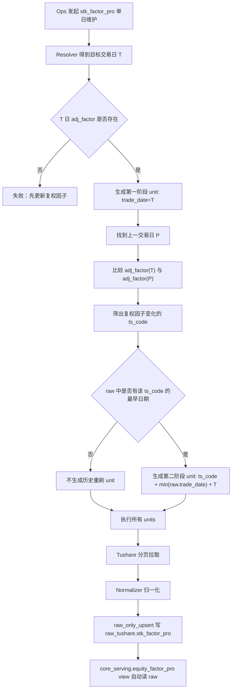

# 股票技术面因子基于复权因子变化的历史重刷方案 v1

状态：已落地。当前代码实现与本文件口径一致，核心逻辑收敛在 `stk_factor_pro` 自己的 planner 与 request builder 中。

## 1. 目标

`stk_factor_pro` 包含前复权、后复权相关字段。股票发生除权除息后，复权因子会变化，历史上的前复权、后复权指标值也可能跟着变化。

本方案解决的问题是：每天维护 `stk_factor_pro` 时，不只刷当天数据，还要把当天复权因子发生变化的股票筛出来，对这些股票做历史区间重刷。

一句话：

```text
每天先刷 stk_factor_pro 当天数据；再看当天哪些股票复权因子变了；变了的股票从库里已有最早日期刷到本次目标交易日；写入用 upsert 覆盖，不先删。
```

## 2. 硬口径

| 项 | 口径 |
| --- | --- |
| 是否新增状态表 | 不新增。不要“小账本”，不要维护额外刷新状态。 |
| 是否改 `adj_factor` 代码 | 不改。`adj_factor` 只负责维护复权因子事实，不负责通知或驱动 `stk_factor_pro`。 |
| 触发位置 | 放在 `stk_factor_pro` 自己的规划逻辑里。 |
| 第一阶段 | 刷一次本次目标交易日的 `stk_factor_pro` 数据。 |
| 第二阶段 | 审计 `adj_factor`，找出本次目标交易日复权因子发生变化的 `ts_code`，对这些 `ts_code` 做历史区间重刷。 |
| 变化判断 | `T` 日 `adj_factor` 与上一交易日 `P` 日 `adj_factor` 不一致。 |
| 历史重刷 `start_date` | 取该 `ts_code` 当前在 `raw_tushare.stk_factor_pro` 中已有数据的最早 `trade_date`。 |
| 历史重刷 `end_date` | 取本次 `stk_factor_pro` 任务目标交易日。 |
| 写入方式 | 不先删，按 `(ts_code, trade_date)` 幂等 upsert 覆盖。 |
| 失败处理 | 失败后重跑即可；不记录已完成状态，不做断点续跑，不引入 checkpoint。 |
| serving 口径 | `core_serving.equity_factor_pro` 是 view，直接读取 raw。 |

## 3. 当前实现基础

当前已经完成的基础能力：

1. `daily_market_close_maintenance` 工作流中，`adj_factor` 排在 `stk_factor_pro` 前面。
2. `stk_factor_pro` 已改为 `raw_only_upsert`，只写 `raw_tushare.stk_factor_pro`。
3. `core_serving.equity_factor_pro` 已改为普通 view，直接读取 raw。
4. `stk_factor_pro` planner 已有门禁：目标交易日缺少 `core.equity_adj_factor` 时，直接失败并提示“先更新复权因子”。

本轮落地的能力：

1. `_stk_factor_pro_params()` 支持单日 `trade_date` 请求，也支持第二阶段单股 `ts_code + start_date + end_date` 区间请求。
2. planner 在默认单日维护时，先生成当天 unit，再基于 `adj_factor(T) != adj_factor(P)` 追加历史重刷 unit。
3. planner 从 `raw_tushare.stk_factor_pro` 查询指定 `ts_code` 的最早已有日期，作为历史重刷 `start_date`。
4. 显式传入 `ts_code` 的单日维护、以及区间维护，均不触发全市场复权变化审计。

## 4. 两阶段执行逻辑

以本次目标交易日 `T = 2026-05-29` 为例。

### 4.1 第一阶段：刷当天

先生成一个普通单日 unit：

```json
{
  "trade_date": "20260529"
}
```

这个 unit 的意义是：拉取 `2026-05-29` 当天全市场 `stk_factor_pro` 数据。

这一步就是每日收盘后维护工作流当前已经具备的效果。

### 4.2 第二阶段：找出需要历史重刷的股票

先找到 `T` 的上一个交易日 `P`。

然后比较 `core.equity_adj_factor`：

```sql
select
  today.ts_code
from core.equity_adj_factor today
join core.equity_adj_factor previous
  on previous.ts_code = today.ts_code
where today.trade_date = :target_trade_date
  and previous.trade_date = :previous_trade_date
  and today.adj_factor is distinct from previous.adj_factor;
```

说明：

1. `today` 是目标交易日 `T` 的复权因子。
2. `previous` 是上一交易日 `P` 的复权因子。
3. 两天因子值不同，说明这只股票的复权口径发生变化，需要历史重刷。
4. 不能用“`T` 日有 `adj_factor` 行”作为判断标准，因为每天 `adj_factor` 都会有全市场数据。真正要看的是数值是否变化。

### 4.3 第二阶段：为每只股票生成历史重刷 unit

对每个需要重刷的 `ts_code`，先查它在 `raw_tushare.stk_factor_pro` 中已有数据的最早日期：

```sql
select min(trade_date)
from raw_tushare.stk_factor_pro
where ts_code = :ts_code;
```

如果查到：

```text
min(trade_date) = 2025-01-02
```

就生成历史重刷 unit：

```json
{
  "ts_code": "000001.SZ",
  "start_date": "20250102",
  "end_date": "20260529"
}
```

如果查不到最早日期，说明本地还没有这只股票的历史 `stk_factor_pro` 数据，本轮不额外生成历史重刷 unit。第一阶段的当天 unit 已经会尝试拉取当天数据。

## 5. 请求参数规则

`stk_factor_pro` 后续需要支持两类请求参数。

### 5.1 单日全市场请求

用于第一阶段：

```json
{
  "trade_date": "20260529"
}
```

### 5.2 单股历史区间请求

用于第二阶段：

```json
{
  "ts_code": "000001.SZ",
  "start_date": "20250102",
  "end_date": "20260529"
}
```

注意：

1. 第二阶段不是“股票 × 每日”拆分。
2. 第二阶段是一只股票一个历史区间 unit。
3. 分页仍由 source client 按 `limit/offset` 处理。

## 6. 写入规则

历史重刷不先删旧数据。

写入方式统一保持：

```text
raw_only_upsert
```

主键：

```text
(ts_code, trade_date)
```

含义：

1. 如果返回行对应的 `(ts_code, trade_date)` 已存在，就覆盖更新。
2. 如果不存在，就插入。
3. 如果任务中途失败，已经写入的行保留；下次重跑继续 upsert 覆盖。
4. 不会因为先删后写失败而留下真实数据缺口。

只有当源站明确删除了某些历史日期的数据，而且本地必须同步删除这些行时，才需要另行讨论“先删再写”。本方案不处理这种场景。

## 7. 执行流程图



## 8. 代码改动点

### 8.1 `src/foundation/ingestion/unit_planner.py`

扩展 `build_stk_factor_pro_units`：

1. 保留现有复权因子门禁。
2. 单日模式下先生成普通当天 unit。
3. 单日模式下追加第二阶段审计逻辑：
   - 找上一交易日。
   - 找复权因子变化的 `ts_code`。
   - 找每个 `ts_code` 在 raw 中已有最早日期。
   - 为有历史数据的 `ts_code` 生成历史区间 unit。
4. 区间模式继续按当前日期模型展开，不额外做复权变化审计，避免用户选择区间时被系统暗中扩大请求范围。

### 8.2 `src/foundation/ingestion/request_builders.py`

扩展 `_stk_factor_pro_params()`：

1. 当 unit 带 `ts_code + start_date + end_date` 时，生成区间请求参数。
2. 否则保持当前 `trade_date` 单日请求参数。
3. 不暴露分页参数给 Ops；分页继续由 source client 统一追加。

### 8.3 `tests/test_dataset_action_resolver.py`

新增测试：

1. 缺少 `T` 日 `adj_factor` 时失败，提示“先更新复权因子”。
2. `T` 日和 `P` 日复权因子无变化时，只生成当天 unit。
3. `T` 日和 `P` 日复权因子有变化时，生成当天 unit + 单股历史区间 unit。
4. 变化股票 raw 中没有历史数据时，不生成历史重刷 unit。
5. 显式 `ts_code` 单日维护不触发第二阶段审计。
6. 区间模式不触发第二阶段审计。

### 8.4 `tests/test_dataset_writer_stk_factor_pro.py`

继续守住：

1. 只写 raw DAO。
2. 不写 serving DAO。
3. target table 仍是 `core_serving.equity_factor_pro`，但只是对外 view 入口。

## 9. SQL 语义细节

### 9.1 找上一交易日

使用交易日历，不凭自然日减一天。

逻辑：

```text
P = 目标交易日 T 之前最近的交易日
```

### 9.2 找复权变化股票

只比较同时存在于 `T` 和 `P` 的股票。

新上市股票可能没有 `P` 日记录，这种股票不进入历史重刷集合。它会被第一阶段当天 unit 覆盖。

### 9.3 找历史起点

历史起点必须来自 raw 表里该股票已有数据的最早日期：

```text
start_date = min(raw_tushare.stk_factor_pro.trade_date where ts_code = 当前股票)
```

不要使用：

1. 全局固定日期。
2. 股票上市日期。
3. 配置文件里的历史起点。
4. 额外状态表记录的起点。

## 10. 验收标准

1. 单日维护 `stk_factor_pro` 时，第一阶段始终生成当天 `trade_date` unit。
2. `adj_factor` 无变化时，不生成历史重刷 unit。
3. `adj_factor` 有变化时，只对变化股票生成历史区间 unit。
4. 历史区间 unit 的 `start_date` 等于该股票在 `raw_tushare.stk_factor_pro` 中的 `min(trade_date)`。
5. 历史区间 unit 的 `end_date` 等于本次目标交易日。
6. 写入不先删，继续按 `(ts_code, trade_date)` upsert 覆盖。
7. 不新增任何刷新状态表、checkpoint、账本或断点续跑能力。
8. `adj_factor` 代码不承担驱动 `stk_factor_pro` 重刷的职责。

## 11. 不做事项

本方案明确不做：

1. 不新增 `stk_factor_pro_refresh_state` 之类的状态表。
2. 不在 `adj_factor` 写入完成后主动触发 `stk_factor_pro`。
3. 不做已完成 unit 记录。
4. 不做 checkpoint/acquire/断点续跑。
5. 不先删除历史区间再写入。
6. 不把“有 `adj_factor` 行”误判成“复权因子变化”。
