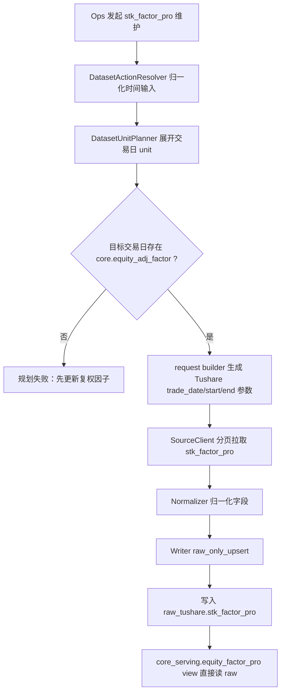

# 股票技术面因子 raw 直出与复权因子门禁方案 v1

## 1. 目标

本轮只处理 `stk_factor_pro` 的两件事：

1. `core_serving.equity_factor_pro` 改为从 `raw_tushare.stk_factor_pro` 直出的普通 view，不再维护第二份物理 serving 表。
2. `stk_factor_pro` 执行前增加复权因子门禁：目标交易日必须已经存在 `core.equity_adj_factor` 数据，否则任务直接失败，并提示“先更新复权因子”。

本轮不做受除权事件影响股票的自动历史重刷机制；该能力由
[股票技术面因子基于复权因子变化的历史重刷方案 v1](/Users/congming/github/goldenshare/docs/datasets/stk-factor-pro-adj-factor-driven-refresh-plan-v1.md)
承接。

## 2. 当前事实

- `raw_tushare.stk_factor_pro` 是 Tushare 原始数据落库表，主键为 `(ts_code, trade_date)`。
- `core_serving.equity_factor_pro` 当前仍是物理表，与 raw 存在重复存储。
- `DatasetWriter` 已支持 `raw_only_upsert`，但现有 writer 入口会先检查 raw DAO 和 core DAO 是否存在，因此 `core_dao_name` 暂时仍需保留为 writer 内部占位；保留不等于写 serving。
- `stk_factor_pro` 数据包含前复权、后复权字段，复权结果依赖 `adj_factor`。如果目标日期的复权因子未先更新，继续同步会得到不可靠结果。

## 3. 拍板口径

| 项 | 结论 |
| --- | --- |
| 写入路径 | `write_path="raw_only_upsert"` |
| raw 表 | `raw_tushare.stk_factor_pro` |
| serving 入口 | `core_serving.equity_factor_pro` |
| serving 形态 | 普通 view，直接读取 raw |
| `target_table` | 继续填 `core_serving.equity_factor_pro`，因为这是对外服务入口 |
| `serving_table` | 继续填 `core_serving.equity_factor_pro` |
| `core_dao_name` | 暂保留 `equity_factor_pro`，只用于当前 writer DAO 存在性校验，不允许发生 serving 写入 |
| 复权因子门禁 | 每个目标交易日必须能在 `core.equity_adj_factor` 查到数据 |
| 门禁失败提示 | `先更新复权因子` |
| 历史数据清理 | 需要清理时只清 `raw_tushare.stk_factor_pro`，不做整表备份；执行清理必须由运营明确发起 |

## 4. 数据读写链路



## 5. 实施范围

1. 新增 Alembic 迁移：
   - 删除旧 `core_serving.equity_factor_pro` 物理表。
   - 创建同名 view，字段从 `raw_tushare.stk_factor_pro` 投影，并补充 `source/created_at/updated_at` 以满足现有 ORM 查询。
   - 不删除、不清空 `raw_tushare.stk_factor_pro`。
2. 更新 `DatasetDefinition`：
   - `write_path` 改为 `raw_only_upsert`。
   - `layer_plan` 改为 `raw->serving_view`。
   - `unit_builder_key` 改为 `build_stk_factor_pro_units`。
3. 更新 planner：
   - `build_stk_factor_pro_units` 先按现有日期模型展开目标交易日。
   - 对每个目标交易日检查 `core.equity_adj_factor` 是否已有数据。
   - 缺失则抛出结构化规划错误，不进入源接口请求。
4. 更新测试：
   - Definition 测试锁定 raw-only/view 口径。
   - Resolver 测试覆盖缺复权因子失败、有复权因子通过、区间部分缺失失败。
   - Writer 测试证明只调用 raw DAO，不写 serving DAO。

## 6. 生产清理操作

本方案只定义清理方式，不在开发过程中执行。

清理前轻量审计：

```sql
select
  count(*) as row_count,
  min(trade_date) as min_trade_date,
  max(trade_date) as max_trade_date
from raw_tushare.stk_factor_pro;
```

若运营确认要重刷历史数据，清理命令为：

```sql
truncate table raw_tushare.stk_factor_pro;
```

清理后由运营重新发起 `stk_factor_pro` 维护任务。

## 7. 验收标准

- `DatasetDefinition("stk_factor_pro")` 显示 raw-only/view 口径。
- 无 `adj_factor` 当日数据时，任务在 planner 阶段失败，错误信息是“先更新复权因子”。
- 有 `adj_factor` 当日数据时，任务能生成正常 `stk_factor_pro` unit。
- writer 只写 `raw_tushare.stk_factor_pro`。
- `core_serving.equity_factor_pro` 由 view 直出 raw 数据。
