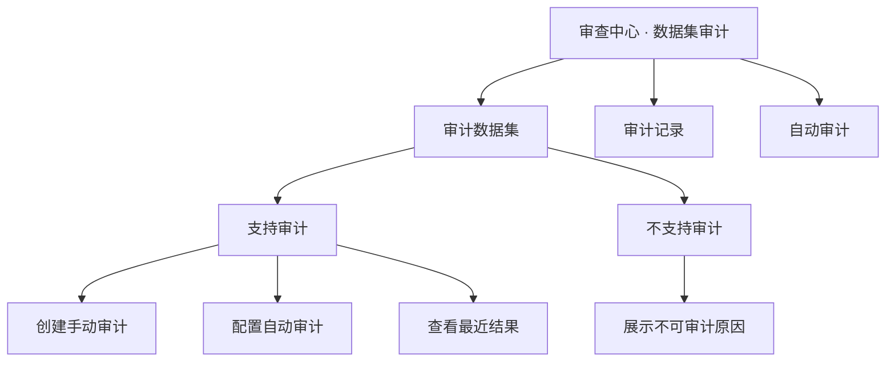

# 前端数据集审计页面设计 v1

- 版本：v1
- 状态：可开发
- 更新时间：2026-04-30
- 适用范围：运营后台审查中心新增“数据集审计”页面
- 技术方案：[数据集日期完整性审计设计 v2](/Users/congming/github/goldenshare/docs/ops/dataset-date-completeness-audit-design-v2.md)
- 设计依据：[前端设计 Tokens 与组件目录 v2](/Users/congming/github/goldenshare/docs/frontend/frontend-design-tokens-and-component-catalog-v1.md)、[前端组件 Showcase v1](/Users/congming/github/goldenshare/docs/frontend/frontend-component-showcase-v1.html)

---

## 1. 页面目标

页面只回答一件事：指定数据集在指定日期范围内是否存在缺失日期桶。

用户要能快速完成：

1. 看哪些数据集支持日期完整性审计。
2. 对支持审计的数据集创建手动审计。
3. 配置自动审计计划。
4. 查看最近审计结论和缺口区间。
5. 对不支持审计的数据集，只理解原因，不误以为能操作。

---

## 2. 信息架构

入口：`审查中心 -> 数据集审计`

页面名称使用“数据集审计”，当前第一期能力是“日期完整性审计”。后续若增加字段质量、主外键一致性、多源对账等能力，可以在同一页面下扩展新的审计类型。

页面 Tab：

1. `审计数据集`
2. `审计记录`
3. `自动审计`

核心分组：

1. `支持审计`：可创建手动审计，可配置自动审计，可查看最近结果。
2. `不支持审计`：只展示不可审计原因，不展示创建按钮，不展示审计操作。



---

## 3. 视觉与组件原则

遵守当前组件规范：

1. 使用中性灰阶作为页面主体，品牌蓝只用于主按钮、选中态、链接和焦点。
2. 页面底色使用浅灰，主内容使用白色 surface 卡片。
3. 信息密度靠对齐、分组和表格秩序，不靠堆叠卡片。
4. 状态色只用于审计结论和风险提示。
5. 不使用大面积渐变、玻璃拟态、过量动画。

组件映射：

| 场景 | 建议组件 |
|---|---|
| 页面标题 | `PageHeader` |
| 数据集分组 | `SegmentedTabs` / 分组卡片 |
| 筛选 | `FilterBar` |
| 统计摘要 | `StatCard` |
| 数据集列表 | `DataTable` |
| 审计详情 | `Drawer` |
| 创建审计 | `Modal` 或右侧 `Drawer` |
| 状态提示 | `Badge` / `Alert` |
| 空状态 | `EmptyState` |

---

## 4. Tab 一：审计数据集

### 4.1 页面结构

```text
PageHeader
  标题：数据集审计
  副标题：检查数据集在指定日期范围内是否存在缺失日期桶

StatCards
  支持审计数据集
  不支持审计数据集
  最近不通过
  自动审计启用

SegmentedTabs
  支持审计
  不支持审计

FilterBar
  领域
  日期规则
  关键词

DataTable
```

### 4.2 支持审计列表

列建议：

| 列 | 说明 |
|---|---|
| 数据集 | 展示中文名和 `dataset_key` |
| 领域 | 如资金流向、股票行情、指数 / ETF |
| 日期规则 | 运营可读文案，如“每个开市交易日” |
| 目标表 | 弱化展示 |
| 最近审计 | 最近一次结果与时间 |
| 自动审计 | 已启用 / 未启用 |
| 操作 | 创建审计、配置自动审计、查看记录 |

操作规则：

1. `创建审计` 打开手动审计 Drawer。
2. `配置自动审计` 打开自动审计配置 Drawer。
3. `查看记录` 跳转到审计记录 Tab 并带上 dataset filter。

### 4.3 不支持审计列表

列建议：

| 列 | 说明 |
|---|---|
| 数据集 | 中文名和 `dataset_key` |
| 领域 | 数据集领域 |
| 当前日期模型 | 如 `none + not_applicable` |
| 不支持原因 | 直接展示 `not_applicable_reason` |

禁止：

1. 不显示创建审计按钮。
2. 不显示配置自动审计按钮。
3. 不提供隐藏操作入口。

---

## 5. 手动审计交互

入口：支持审计列表的 `创建审计`。

使用 Drawer，避免离开当前列表上下文。

表单：

1. 数据集：只读展示。
2. 日期规则：只读说明。
3. 审计范围：根据 `input_shape` 渲染。
4. 说明区：提示本审计只读取已提交业务数据，不影响同步任务。

范围控件：

| `input_shape` | 控件 |
|---|---|
| `trade_date_or_start_end` | 交易日区间 |
| `ann_date_or_start_end` | 自然日区间，文案使用“公告日” |
| `month_or_range` | 月份区间 |
| `start_end_month_window` | 自然月窗口区间 |

提交后：

1. 创建审计 run。
2. Drawer 切换为运行状态。
3. 页面轮询 `GET /runs/{run_id}`。
4. 完成后展示摘要和“查看缺口详情”。

---

## 6. Tab 二：审计记录

筛选项：

1. 数据集
2. 结论：通过 / 不通过 / 执行错误
3. 运行状态：排队 / 运行中 / 已完成 / 失败 / 已取消
4. 时间范围

列表列：

| 列 | 说明 |
|---|---|
| 审计对象 | 数据集名和 key |
| 审计范围 | start/end |
| 结论 | 状态 badge |
| 期望 / 实际 / 缺失 | 数字摘要 |
| 缺口区间 | gap range count |
| 运行时间 | started/finished |
| 发起方式 | 手动 / 自动 |
| 操作 | 查看详情 |

详情 Drawer：

1. 顶部摘要：结论、审计范围、缺失数量。
2. 规则快照：date axis、bucket rule、observed field。
3. 缺口区间表：range start、range end、missing count。
4. 技术诊断：仅 `result_status=error` 时展示。

---

## 7. Tab 三：自动审计

自动审计使用独立配置表 `ops.dataset_date_completeness_schedule`，不复用任务中心自动任务。

列表列：

| 列 | 说明 |
|---|---|
| 计划名称 | display name |
| 数据集 | dataset |
| 窗口 | 固定范围 / 滚动窗口 |
| 频率 | cron 可读说明 |
| 状态 | active / paused |
| 最近结果 | last run result |
| 下次运行 | next run at |
| 操作 | 编辑、暂停、恢复、删除 |

配置 Drawer：

1. 数据集：只能选择支持审计的数据集。
2. 窗口模式：
   - 固定范围：填写 `start_date/end_date`。
   - 滚动窗口：填写 `lookback_count/lookback_unit`。
3. 交易日历：
   - 第一版默认 `default_cn_market`，不暴露复杂选择。
   - UI 预留“日历口径”只读项：默认 A 股交易日历。
4. 频率：选择每日 / 每周 / 自定义 cron。
5. 启用状态：默认 active。

滚动窗口文案：

```text
每次运行时，系统按运行日期自动计算最近 N 个自然日 / 开市交易日 / 自然月作为审计范围。
```

---

## 8. 状态文案

| 后端状态 | 页面文案 | 视觉 |
|---|---|---|
| `passed` | 通过 | success badge |
| `failed` | 不通过 | error badge |
| `error` | 执行错误 | warning/error badge |
| `queued` | 排队中 | muted badge |
| `running` | 审计中 | info badge |
| `canceled` | 已取消 | muted badge |

不支持审计统一文案：

```text
该数据集暂不支持日期完整性审计：{not_applicable_reason}
```

---

## 9. 页面线框

### 9.1 审计数据集

```text
┌──────────────────────────────────────────────────────────────┐
│ 数据集审计                                                    │
│ 检查数据集在指定日期范围内是否存在缺失日期桶                   │
├──────────────┬──────────────┬──────────────┬──────────────┤
│ 支持审计 48  │ 不支持 9     │ 最近不通过 3 │ 自动启用 12  │
├──────────────────────────────────────────────────────────────┤
│ [支持审计] [不支持审计]                                      │
│ 领域 [全部]  日期规则 [全部]  关键词 [              ]         │
├──────────────────────────────────────────────────────────────┤
│ 数据集             日期规则          最近审计     操作        │
│ 板块资金流向(DC)   每个开市交易日    通过         创建/自动/记录 │
│ 券商月度金股推荐   每个自然月        不通过       创建/自动/记录 │
└──────────────────────────────────────────────────────────────┘
```

### 9.2 审计详情 Drawer

```text
┌──────────────────────────────┐
│ 板块资金流向(DC)              │
│ 2026-04-01 ~ 2026-04-24       │
├──────────────────────────────┤
│ 结论：不通过                  │
│ 期望 17 / 实际 16 / 缺失 1    │
├──────────────────────────────┤
│ 缺口区间                      │
│ 2026-04-17 ~ 2026-04-17  1天  │
└──────────────────────────────┘
```

---

## 10. 验收点

1. 支持审计和不支持审计必须分组展示。
2. 不支持审计的数据集不能创建手动审计，不能配置自动审计。
3. 页面不出现 TaskRun、同步任务、freshness 混用文案。
4. 自动审计配置使用 `fixed_range / rolling`，滚动窗口使用 `lookback_count/lookback_unit`。
5. 默认交易日历文案为“默认 A 股交易日历”，不暴露未实现的港股选择。
6. 视觉遵守现有 token、表格、卡片、状态组件规范。
