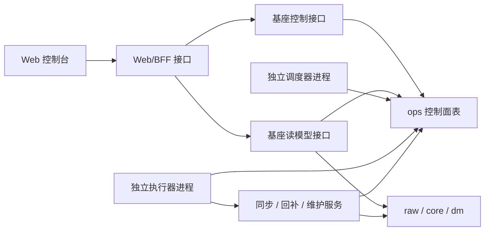

# 运维系统执行解耦设计

> 历史文档（归档）：本文用于记录执行解耦过程。当前实现以 [current-architecture-baseline.md](/Users/congming/github/goldenshare/docs/current-architecture-baseline.md) 与现行代码为准。

## 1. 背景

当前运维系统已经具备：

- 任务请求模型：`ops.job_execution`
- 调度模型：`ops.job_schedule`
- 执行步骤、事件、底层日志：
  - `ops.job_execution_step`
  - `ops.job_execution_event`
  - `ops.sync_run_log`
- Web 控制台页面：
  - 今日运行
  - 自动运行
  - 手动同步
  - 任务记录
  - 数据状态

但当前实现存在一个严重架构问题：

**Web 进程仍然直接承载任务执行。**

目前“手动同步”“立即开始”“重新执行”等操作，会在 Web 进程中通过后台任务或直接调用 runtime 执行同步逻辑。这会导致：

- Web 重启时，正在跑的任务被中断
- Python 热重载影响任务执行
- 前端页面与执行器生命周期耦合
- 页面体验被迫暴露内部机制
- Web 服务承担了不该承担的重型任务

这与系统边界不符。

## 2. 核心原则

### 2.1 领域边界

数据相关的事情归数据基座：

- 同步
- 回补
- 调度
- 重试
- 取消
- 进度
- 日志
- 新鲜度计算

Web 只负责：

- 发起任务请求
- 查询任务状态
- 展示任务进展
- 发取消/重试等控制命令

### 2.2 新能力的开发顺序

如果页面需要一种新的同步方式：

1. 先在数据基座中实现能力
2. 再通过控制接口暴露出来
3. 最后由 Web 页面调用该接口

**禁止为了页面需求，绕过数据基座直接在 Web 中写执行逻辑。**

## 3. 目标架构

### 解释

- Web 不直接执行同步
- Web 只向 `ops` 写入任务请求，或读取任务状态
- `scheduler` 独立运行，负责把到点的调度转换成任务请求
- `worker` 独立运行，负责消费等待中的任务请求

## 4. 模块职责

### 4.1 数据基座执行层

位置：

- `src/services/*`
- `src/operations/*`
- `src/cli.py`

负责：

- `JobSpec` / `WorkflowSpec`
- 创建 execution
- 调度 enqueue
- worker 消费 execution
- 调用 sync/backfill/maintenance service
- 写入 execution / event / step / sync_run_log

### 4.2 Web 交互层

位置：

- `src/web/api/*`
- `frontend/src/*`

负责：

- 创建任务请求
- 查询任务详情
- 查询数据状态
- 展示页面
- 提示用户下一步

不负责：

- 跑同步
- 跑回补
- 直接调度 worker

## 5. 当前问题清单

### 5.1 Web 直接承载执行

当前问题：

- `BackgroundTasks` 在 Web 进程里直接执行任务
- Web API 存在“run-now / retry-now / worker-run / scheduler-tick”这类直接运行行为

影响：

- Web 服务不是纯交互层
- 页面与执行器生命周期耦合

### 5.2 页面语义被内部机制污染

当前问题：

- 页面文案容易让用户误以为 Web 会立即执行任务
- “立即开始”“重新执行并立刻跑”等行为与独立执行器架构不一致

### 5.3 任务详情页读模型不足

当前问题：

- 前端需要从事件字符串中解析进度
- 阶段性结果缺乏稳定结构化字段

## 6. 目标改造

## 6.1 执行请求模型

用户在页面点击“开始同步”后：

1. Web 调用创建任务请求接口
2. 数据基座写入 `job_execution`
3. 返回任务编号和当前状态（通常为 `queued`）
4. 页面跳到任务详情页查看状态

**注意：这一步不执行同步逻辑。**

## 6.2 独立调度器

调度器是独立进程，负责：

- 扫描 `job_schedule`
- 创建新的 `job_execution`

不直接执行任务。

建议运行入口：

- `goldenshare ops-scheduler-serve`

## 6.3 独立执行器

执行器是独立进程，负责：

- 轮询 `queued` 状态的 execution
- 抢占并运行任务
- 将进度、步骤、事件、日志持续写回 `ops`

建议运行入口：

- `goldenshare ops-worker-serve`

## 6.4 Web 接口重定义

### 保留的接口语义

- `POST /api/v1/ops/executions`
  - 创建任务请求
- `POST /api/v1/ops/executions/{id}/retry`
  - 创建新的重试任务请求
- `POST /api/v1/ops/executions/{id}/cancel`
  - 发取消请求
- `GET /api/v1/ops/executions/*`
  - 查询任务状态

### 需要废弃的接口语义

以下接口不应继续在 Web 中直接执行任务：

- `/api/v1/ops/executions/run-now`
- `/api/v1/ops/executions/{id}/retry-now`
- `/api/v1/ops/executions/{id}/run-now`
- `/api/v1/ops/runtime/scheduler-tick`
- `/api/v1/ops/runtime/worker-run`

第一阶段可以保留路径兼容，但必须去掉“Web 内直接执行”的实现。

## 7. 页面设计影响

### 7.1 手动同步页

提交后行为改成：

- “任务已提交”
- 自动跳到任务详情页
- 系统会继续处理

不再承诺：

- 立即开始
- 当前请求内完成

### 7.2 任务记录页

失败任务默认动作改成：

- `重新提交`

而不是：

- `重新执行（立刻在 Web 中跑）`

等待中的任务不再提供：

- `立即开始`

页面只显示：

- 等待系统开始处理

### 7.3 今日运行页

不再提供直接运行 scheduler/worker 的按钮。

今天的页面只是：

- 看状态
- 看异常
- 去任务记录 / 数据状态处理

## 8. 数据基座新增能力建议

### 8.1 任务进度快照

当前前端需要从 `step_progress` 文本中提取 `651/5814`。

建议新增结构化字段，例如：

- `progress_current`
- `progress_total`
- `progress_percent`
- `progress_message`
- `last_progress_at`

可选位置：

- `ops.job_execution`
- 或单独进度表

当前已经采用第一种方式，结构化进度字段进入 `ops.job_execution`：

- `progress_current`
- `progress_total`
- `progress_percent`
- `progress_message`
- `last_progress_at`

这样页面可以优先展示基座已经计算好的进展，再把事件文本作为旧数据兼容兜底。

### 8.2 用户可读问题摘要

建议在基座层生成：

- `user_facing_summary`
- `user_facing_error_summary`
- `user_facing_recovery_hint`

避免前端直接消费原始技术错误。

## 9. 迁移步骤

### 第一阶段：切断 Web 执行

- Web 只创建 execution
- 去掉 `BackgroundTasks` 执行链路
- 前端不再使用 `run-now` 接口

### 第二阶段：补独立运行入口

- 增加长期运行的 scheduler / worker CLI 入口
- 用于本地开发和生产部署

### 第三阶段：收敛 Web 页面文案

- 去掉“立即开始”“重新执行会立刻跑”之类误导性文案
- 页面统一表达为：
  - 任务已提交
  - 等待系统开始处理
  - 当前进展

### 第四阶段：增强任务详情读模型

- 提供结构化进度
- 提供用户可读摘要

## 10. 第一阶段完成标准

- Web 进程中不再执行同步/回补任务
- 手动同步只创建 `queued` execution
- 重试只创建新的 `queued` execution
- 正在跑的任务与 Web 生命周期解耦
- 前端页面文案与执行解耦后的架构一致

## 11. 后续非目标

本次改造的第一阶段暂不包含：

- 分布式调度
- 多 worker 并发竞争控制优化
- 独立 RPC 服务
- 复杂权限分层
- 任务优先级系统

这些可以在执行解耦完成后继续演进。
