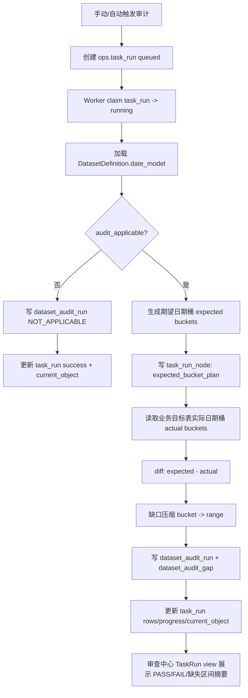

# 数据集日期完整性审计设计 v1（审查中心）

- 版本：v1
- 状态：待评审（基于当前 `DatasetDefinition.date_model` 的新版设计稿；尚未进入开发）
- 更新时间：2026-04-26
- 适用范围：`src/ops` 审查中心 + 任务执行链路（手动审计/自动审计）
- 前置事实源：`DatasetDefinition.date_model`
- 执行观测前置方案：[Ops TaskRun 执行观测模型重设计方案 v1](/Users/congming/github/goldenshare/docs/ops/ops-task-run-observability-redesign-plan-v1.md)

> 当前口径：本文不再维护独立的审计日期规则表。
> 日期完整性审计必须读取 [数据集日期模型消费指南 v1](/Users/congming/github/goldenshare/docs/architecture/dataset-date-model-consumer-guide-v1.md) 定义的 `DatasetDefinition.date_model` 消费口径。
> 当前 `DatasetDefinition` 已改为读取静态定义，审计模块、ops 查询层和前端都不得直接依赖旧 contract。
> 旧草案中的 `calendar_type/anchor_rule` 已被替换为 `date_model.date_axis/bucket_rule`，不得在审计模块、前端或 ops 查询层重新建立第二套规则。

---

## 1. 目标与边界

### 1.1 目标

建立一个**确定性**的数据日期完整性审计能力，用于检查“按日期桶组织”的数据集是否存在中间缺失日期/月份/窗口，并明确给出缺失日期或缺失区间。

目标输出只有三类：

1. `PASS`：审计范围内期望桶均存在数据。
2. `FAIL`：审计范围内存在缺失桶，并返回缺失明细。
3. `NOT_APPLICABLE`：该数据集不适合日期完整性审计，必须返回原因。

不使用模糊等级（如 full/sparse/一般/严重）。

### 1.2 业务边界

1. 审计对象：当前 `DatasetDefinition` registry 全量 `57` 个数据集。
2. 审计维度：以“日期桶完整性”为核心，不做逐字段值级校验。
3. 规则来源：只读 `DatasetDefinition.date_model`；目标表、展示名、观测字段从同一个 `DatasetDefinition` 派生。
4. 任务入口：
   - 手动审计
   - 自动审计（定时）
5. 落位位置：审查中心新增“数据完整性审计”模块，并接入 ops 任务执行体系。

### 1.3 非目标

1. 本期不替代 freshness（新鲜度）状态判定。
2. 本期不做多源逐字段对账。
3. 本期不改业务侧 biz API 返回契约。
4. 本期不做分钟级完整性审计；`stk_mins` 需要交易时段、频度、午休等更细模型，第一期标记为 `NOT_APPLICABLE`。
5. 本期不重构同步引擎、写入事务或数据集同步策略。

---

## 2. 规则模型（单一事实源）

### 2.1 核心原则

每个数据集的日期审计规则由 `DatasetDefinition.date_model` 表达，审计模块只消费以下字段：

| 字段 | 含义 | 审计用途 |
|---|---|---|
| `date_axis` | 日期集合来源 | 决定期望桶从交易日、自然日、月份键、自然月窗口还是无日期模型生成 |
| `bucket_rule` | 日期桶抽取规则 | 决定范围内哪些桶必须有数据 |
| `window_mode` | 请求窗口语义 | 仅用于展示/任务参数说明，不作为审计规则副本 |
| `input_shape` | 对外输入形态 | 用于手动审计表单推导输入控件 |
| `observed_field` | 目标表观测字段 | 用于查询实际桶 |
| `audit_applicable` | 是否可审计 | 决定可执行审计还是返回 `NOT_APPLICABLE` |
| `not_applicable_reason` | 不可审计原因 | `audit_applicable=false` 时必须展示 |

说明：

1. 不再设计 `supports_manual_audit` / `supports_auto_audit`。
2. 可审计的数据集必须同时支持手动审计与自动审计。
3. 不可审计的数据集不能创建审计任务，页面直接展示 `not_applicable_reason`。
4. 前端不得复制数据集规则，只消费后端 API 从 `DatasetDefinition` 派生出的结果。

### 2.2 字段组合语义

| `date_axis` | `bucket_rule` | 期望桶生成方式 | 典型数据集 |
|---|---|---|---|
| `trade_open_day` | `every_open_day` | 范围内每个开市交易日 | `daily`、`moneyflow`、`margin`、`stk_factor_pro` |
| `trade_open_day` | `week_last_open_day` | 每周最后一个开市交易日 | `index_weekly`、`stk_period_bar_week` |
| `trade_open_day` | `month_last_open_day` | 每月最后一个开市交易日 | `index_monthly`、`stk_period_bar_month` |
| `natural_day` | `every_natural_day` | 范围内每个自然日 | `dividend`、`stk_holdernumber`、`trade_cal` |
| `month_key` | `every_natural_month` | 范围内每个自然月键 `YYYYMM` | `broker_recommend` |
| `month_window` | `month_window_has_data` | 每个自然月窗口至少有 1 个实际桶 | `index_weight` |
| `none` | `not_applicable` | 不生成期望桶 | 快照/主数据、分钟线第一期 |

### 2.3 与 freshness 的关系

1. freshness 关注“最新业务日期是否滞后”。
2. 日期完整性审计关注“范围中间有没有缺桶”。
3. 两者都读取 `date_model.observed_field`，但结果模型、状态语义和页面入口不同。
4. 审计失败不应直接覆盖 freshness 状态；页面应并列展示“新鲜度状态”和“完整性审计结果”。

---

## 3. 领域流程与模块

### 3.0 数据源边界

审计能力涉及以下数据源，职责必须分开：

| 数据源 | 用途 | 说明 |
|---|---|---|
| `DatasetDefinition.date_model` | 日期规则事实源 | 决定是否可审计、期望桶如何生成、实际桶读取哪个字段 |
| `DatasetDefinition.storage/identity/observability` | 数据集展示与目标表事实源 | 提供目标表、展示名、观测字段、可审计标记 |
| `DatasetExecutionPlan` | 可选执行计划快照 | 审计任务进入 TaskRun 后可保存计划摘要，但不作为审计规则事实源 |
| 业务目标表 | 实际桶事实源 | 例如 `core_serving.equity_daily_bar`、`core_serving.equity_moneyflow` |
| `ops.task_run/task_run_node/task_run_issue` | 任务观测事实源 | 记录审计任务状态、进度、节点、问题诊断 |
| `ops.dataset_audit_run/dataset_audit_gap` | 审计结果事实源 | 记录审计结果快照与缺失区间 |

硬规则：

1. 审计任务状态、进度、错误上报必须走 TaskRun 模型。
2. 不再使用旧任务观测链路作为审计任务详情页数据源。
3. 完整技术错误只允许落在 `ops.task_run_issue`，`dataset_audit_run` 只保存结构化审计状态与结果摘要。
4. 审查中心页面的任务详情只消费 `GET /api/v1/ops/task-runs/{id}/view`；审计结果详情可在该 view 中附带摘要，或由审计结果 API 按需读取。

### 3.1 审计流程



### 3.2 模块职责

1. `DatasetAuditRuleResolver`
   - 根据 `dataset_key` 读取 `DatasetDefinition.date_model`。
   - 不维护本地规则表。
   - 对缺失 dataset definition 或缺失 date_model 直接报错。
2. `ExpectedBucketPlanner`
   - 根据 `date_axis + bucket_rule + start/end` 生成期望桶。
   - 只负责时间桶，不关心源接口请求策略。
3. `ActualBucketReader`
   - 根据 `dataset_key + observed_field` 读取目标表实际桶。
   - 查询必须走目标表日期索引或等价高效路径，避免全表扫描。
4. `GapDetector`
   - 计算缺失桶并压缩为区间。
5. `DatasetAuditRunService`
   - 组合上述模块。
   - 产出 `PASS/FAIL/NOT_APPLICABLE/ERROR`。
   - 写审计结果表。
   - 通过 TaskRun 写入进度、节点与问题诊断。

### 3.3 TaskRun 节点建议

审计任务不引入追加式 event stream，过程统一表达为节点：

| `node_type` | `node_key` 示例 | 用途 |
|---|---|---|
| `dataset_plan` | `audit_plan:{dataset_key}` | 规则解析与期望桶计划 |
| `dataset_unit` | `audit_read_actual:{dataset_key}` | 读取实际桶 |
| `dataset_unit` | `audit_detect_gap:{dataset_key}` | diff 与缺口压缩 |
| `system_action` | `audit_persist_result:{dataset_key}` | 写审计结果与缺口 |

节点统计字段映射：

| TaskRun 字段 | 审计语义 |
|---|---|
| `unit_total` | 期望桶数量或计划节点数量，第一版建议使用计划节点数量，避免把大日期范围渲染成大量节点 |
| `unit_done` | 已完成节点数量 |
| `rows_fetched` | 实际桶数量 `actual_bucket_count` |
| `rows_saved` | 审计结果写入数量，通常为 `1 + gap_count` |
| `rows_rejected` | 缺失桶数量 `missing_bucket_count`，用于页面快速观察异常规模 |
| `current_object_json` | 当前审计对象，按 TaskRun 展示模型保存 `entity/time/attributes` |

说明：

1. `rows_rejected` 在审计任务中不是“写入拒绝行”，而是“发现的缺失桶数量”。前端展示时应根据 `task_type=dataset_audit` 使用审计文案，避免误读。
2. `current_object_json` 必须复用现有 TaskRun 展示模型，建议结构为：

```json
{
  "entity": {"kind": "dataset", "code": "moneyflow", "name": "资金流向（基础）"},
  "time": {"start_date": "2026-04-01", "end_date": "2026-04-24"},
  "attributes": {
    "date_axis": "trade_open_day",
    "bucket_rule": "every_open_day",
    "expected_bucket_count": 17,
    "actual_bucket_count": 16,
    "missing_bucket_count": 1
  }
}
```

---

## 4. 任务模型与运行语义

### 4.1 手动审计

输入参数：

1. `dataset_key`（必填）
2. `start_date`（必填；按 `date_model.input_shape` 校验）
3. `end_date`（必填；按 `date_model.input_shape` 校验）
4. `mode=manual`

语义：

1. 仅审计该时间范围。
2. 如果 `audit_applicable=false`，不创建执行任务，直接返回 `NOT_APPLICABLE` 原因。
3. 如果 `audit_applicable=true`，结束后给出缺失桶与压缩区间明细。

### 4.2 自动审计

输入参数（来自调度）：

1. `dataset_key`（必填）
2. `lookback_days` 或固定 `start_date/end_date`（至少一种）
3. `mode=auto`

语义：

1. 按调度窗口周期执行。
2. 每次落库一条审计 run 记录。
3. 自动审计只允许调度 `audit_applicable=true` 的数据集。

### 4.3 与 TaskRun 执行体系关系

1. 审计任务必须接入 TaskRun 任务执行体系，便于复用任务记录、进度、错误展示和自动调度。
2. 审计产物单独落库，不混入同步状态表、freshness snapshot 或数据集同步状态。
3. 任务详情页只读取 `GET /api/v1/ops/task-runs/{id}/view`。
4. `task_run.current_object_json` 统一保存当前审计对象，按现有 TaskRun view 的 `current_object` 展示协议组织：
   - `entity.kind=dataset`
   - `entity.code=dataset_key`
   - `entity.name=display_name`
   - `time.start_date`
   - `time.end_date`
   - `attributes.date_axis`
   - `attributes.bucket_rule`
   - `attributes.expected_bucket_count`
   - `attributes.actual_bucket_count`
   - `attributes.missing_bucket_count`
   - `attributes.gap_range_count`
5. 审计执行失败必须写 `task_run_issue`，完整技术错误不能复制到 `task_run`、`task_run_node` 或 `dataset_audit_run`。

---

## 5. 数据模型设计（新增）

### 5.1 `ops.dataset_audit_run`

一条审计任务一次执行对应一条 run。

| 字段 | 类型 | 约束 | 含义 |
|---|---|---|---|
| `id` | bigint PK | 硬约束 | 审计运行 ID |
| `task_run_id` | bigint FK | 硬约束、唯一 | 关联 `ops.task_run.id` |
| `dataset_key` | varchar(64) | 硬约束 | 数据集键 |
| `audit_mode` | varchar(16) | 硬约束 | `manual` / `auto` |
| `status` | varchar(32) | 硬约束 | `passed` / `failed` / `not_applicable` / `error` |
| `start_date` | date | 可空策略：NA 可空，其余必填 | 审计起始日期 |
| `end_date` | date | 可空策略：NA 可空，其余必填 | 审计结束日期 |
| `expected_bucket_count` | int | 硬约束，默认 0 | 期望桶数量 |
| `actual_bucket_count` | int | 硬约束，默认 0 | 实际桶数量 |
| `missing_bucket_count` | int | 硬约束，默认 0 | 缺失桶数量 |
| `date_axis` | varchar(32) | 硬约束 | `date_model.date_axis` 快照 |
| `bucket_rule` | varchar(32) | 硬约束 | `date_model.bucket_rule` 快照 |
| `window_mode` | varchar(32) | 硬约束 | `date_model.window_mode` 快照 |
| `input_shape` | varchar(32) | 硬约束 | `date_model.input_shape` 快照 |
| `observed_field` | varchar(64) | 可空 | 本次观测字段 |
| `not_applicable_reason` | text | 可空 | NA 原因 |
| `error_code` | varchar(64) | 可空 | 结构化错误码 |
| `error_message` | text | 可空 | 给运营看的短错误摘要；完整技术错误必须在 `task_run_issue` |
| `primary_issue_id` | bigint FK | 可空 | 关联 `ops.task_run_issue.id`，仅错误状态使用 |
| `started_at` | timestamptz | 硬约束 | 审计开始时间 |
| `finished_at` | timestamptz | 可空 | 审计完成时间 |
| `created_at` | timestamptz | 硬约束 | 创建时间 |
| `updated_at` | timestamptz | 硬约束 | 更新时间 |

关键约束：

1. `start_date <= end_date`（当两者非空）。
2. `missing_bucket_count >= 0`。
3. `status=passed` 时 `missing_bucket_count=0`。
4. `status=failed` 时 `missing_bucket_count>0`。
5. `status=not_applicable` 时必须有 `not_applicable_reason`。

说明：

1. 这里保存 `date_model` 快照字段，是为了保留审计运行当时的规则语义，便于后续复盘。
2. 快照字段不是第二套规则源，不允许由人工配置。
3. `dataset_audit_run` 不作为任务详情的数据源；任务详情读取 TaskRun view，审计结果 API 只负责审计领域结果。

### 5.2 `ops.dataset_audit_gap`

记录缺失区间（压缩后）。

| 字段 | 类型 | 约束 | 含义 |
|---|---|---|---|
| `id` | bigint PK | 硬约束 | 缺口 ID |
| `audit_run_id` | bigint FK | 硬约束 | 关联 `dataset_audit_run.id` |
| `dataset_key` | varchar(64) | 硬约束 | 冗余字段，便于索引检索 |
| `bucket_kind` | varchar(32) | 硬约束 | `trade_date` / `natural_date` / `month_key` / `month_window` |
| `range_start` | date | 硬约束 | 缺失区间起点 |
| `range_end` | date | 硬约束 | 缺失区间终点 |
| `missing_count` | int | 硬约束 | 区间缺失桶数量 |
| `sample_values_json` | jsonb | 可空 | 可选样本，如月份键、窗口标签 |
| `created_at` | timestamptz | 硬约束 | 创建时间 |

---

## 6. API 与页面设计

### 6.1 API（新增）

前缀建议：`/api/v1/ops/review/audit`

1. `GET /rules`
   - 返回所有数据集的审计能力。
   - 数据来自 `DatasetDefinition`。
   - 返回字段包含 `dataset_key/display_name/target_table/date_axis/bucket_rule/input_shape/observed_field/audit_applicable/not_applicable_reason`。
2. `POST /runs`
   - 创建手动审计任务。
   - 入参：`dataset_key,start_date,end_date`。
   - 不接受前端传入 `date_axis/bucket_rule`。
   - 内部创建 `ops.task_run`，`task_type=dataset_audit`，返回 `task_run_id`。
   - 当前 `TaskRunDispatcher` 只支持 `dataset_action/workflow/system_job`，开发时必须新增 `dataset_audit` 分支，不能复用旧 execution 链路。
   - 页面跳转到 TaskRun 详情页，而不是审计模块自建任务详情。
3. `GET /runs`
   - 查询审计结果历史，支持 dataset/status/时间过滤。
   - 用于审计记录 Tab 的结果列表；任务运行中状态仍以 TaskRun 列表为准。
4. `GET /runs/{run_id}`
   - 查询单次审计结果与缺失区间。
5. `POST /schedules`
   - 创建自动审计计划，本质接入 ops 调度体系。

TaskRun 通用 API：

1. `GET /api/v1/ops/task-runs?task_type=dataset_audit`
   - 查询审计任务运行记录。
2. `GET /api/v1/ops/task-runs/{id}/view`
   - 查询审计任务详情主视图。
3. `GET /api/v1/ops/task-runs/{id}/issues/{issue_id}`
   - 按需查询技术诊断详情。

### 6.2 审查中心页面

新增页面：`审查中心 - 数据完整性审计`

Tab：

1. `手动审计`
2. `自动审计`
3. `审计记录`

展示重点：

1. 审计状态：通过 / 不通过 / 不适用 / 错误。
2. 审计范围。
3. 期望桶、实际桶、缺失桶数量。
4. 缺失日期区间列表。
5. 最近一次审计时间。
6. 不适用原因。

页面数据源：

| 页面区域 | 数据源 |
|---|---|
| 手动审计表单 | `GET /api/v1/ops/review/audit/rules` |
| 自动审计配置 | `GET /api/v1/ops/review/audit/rules` + ops schedule API |
| 审计任务运行中详情 | `GET /api/v1/ops/task-runs/{id}/view` |
| 审计失败技术诊断 | `GET /api/v1/ops/task-runs/{id}/issues/{issue_id}` |
| 审计记录结果列表 | `GET /api/v1/ops/review/audit/runs` |
| 单次缺口详情 | `GET /api/v1/ops/review/audit/runs/{run_id}` |

禁止事项：

1. 页面不得读取旧 `/executions/{id}/steps`、`/events`、`/logs`。
2. 页面不得直接读取 `dataset_audit_gap` 拼任务进度。
3. 页面不得从多个接口拼装同一任务详情；任务详情以 TaskRun view 为准。

### 6.3 前端交互原则

1. 前端通过 `GET /rules` 获取可审计数据集与输入形态。
2. `input_shape=trade_date_or_start_end`：展示交易日区间选择。
3. `input_shape=month_or_range`：展示月份区间选择。
4. `input_shape=start_end_month_window`：展示自然月窗口选择。
5. `input_shape=ann_date_or_start_end`：展示自然日区间选择，文案明确“公告日”。
6. `input_shape=none` 或 `audit_applicable=false`：不展示创建按钮，只展示不可审计原因。

---

## 7. 逐数据集审计规则（全量 57）

说明：

1. 本表是从当前 `DatasetDefinition.date_model` 口径整理的展示版，不是新的规则源。
2. 代码实现必须读取 `DatasetDefinition`，不得复制本表到 ops 或前端常量。
3. “通过条件”统一指该数据集在给定审计范围内满足规则。
4. `audit_applicable=false` 的数据集不会创建审计任务，页面直接展示原因。

| dataset_key | 数据集 | 目标表 | date_axis | bucket_rule | observed_field | 可审计 | 通过条件/说明 |
|---|---|---|---|---|---|---|---|
| `adj_factor` | 复权因子 | `core.equity_adj_factor` | `trade_open_day` | `every_open_day` | `trade_date` | yes | 范围内每个开市交易日均有数据 |
| `biying_equity_daily` | BIYING 股票日线 | `raw_biying.equity_daily_bar` | `trade_open_day` | `every_open_day` | `trade_date` | yes | 范围内每个开市交易日均有数据 |
| `biying_moneyflow` | BIYING 资金流向 | `core_serving.equity_moneyflow` | `trade_open_day` | `every_open_day` | `trade_date` | yes | 范围内每个开市交易日均有数据 |
| `block_trade` | 大宗交易 | `core_serving.equity_block_trade` | `trade_open_day` | `every_open_day` | `trade_date` | yes | 范围内每个开市交易日均有数据 |
| `broker_recommend` | 券商每月荐股 | `core_serving.broker_recommend` | `month_key` | `every_natural_month` | `month` | yes | 范围内每个月份键 `YYYYMM` 均有数据 |
| `cyq_perf` | 每日筹码及胜率 | `core_serving.equity_cyq_perf` | `trade_open_day` | `every_open_day` | `trade_date` | yes | 范围内每个开市交易日均有数据 |
| `daily` | 股票日线 | `core_serving.equity_daily_bar` | `trade_open_day` | `every_open_day` | `trade_date` | yes | 范围内每个开市交易日均有数据 |
| `daily_basic` | 股票日指标 | `core_serving.equity_daily_basic` | `trade_open_day` | `every_open_day` | `trade_date` | yes | 范围内每个开市交易日均有数据 |
| `dc_daily` | 东方财富板块行情 | `core_serving.dc_daily` | `trade_open_day` | `every_open_day` | `trade_date` | yes | 范围内每个开市交易日均有数据 |
| `dc_hot` | 东方财富热榜 | `core_serving.dc_hot` | `trade_open_day` | `every_open_day` | `trade_date` | yes | 范围内每个开市交易日均有数据 |
| `dc_index` | 东方财富概念板块 | `core_serving.dc_index` | `trade_open_day` | `every_open_day` | `trade_date` | yes | 范围内每个开市交易日均有数据 |
| `dc_member` | 东方财富板块成分 | `core_serving.dc_member` | `trade_open_day` | `every_open_day` | `trade_date` | yes | 范围内每个开市交易日均有数据 |
| `dividend` | 分红送转 | `core_serving.equity_dividend` | `natural_day` | `every_natural_day` | `ann_date` | yes | 范围内每个自然公告日均有数据 |
| `etf_basic` | ETF 基本信息 | `core_serving.etf_basic` | `none` | `not_applicable` | `-` | no | 不适用：snapshot/master dataset |
| `etf_index` | ETF 基准指数列表 | `core_serving.etf_index` | `none` | `not_applicable` | `-` | no | 不适用：snapshot/master dataset |
| `fund_adj` | 基金复权因子 | `core.fund_adj_factor` | `trade_open_day` | `every_open_day` | `trade_date` | yes | 范围内每个开市交易日均有数据 |
| `fund_daily` | 基金日线 | `core_serving.fund_daily_bar` | `trade_open_day` | `every_open_day` | `trade_date` | yes | 范围内每个开市交易日均有数据 |
| `hk_basic` | 港股列表 | `core_serving.hk_security` | `none` | `not_applicable` | `-` | no | 不适用：snapshot/master dataset |
| `index_basic` | 指数主数据 | `core_serving.index_basic` | `none` | `not_applicable` | `-` | no | 不适用：snapshot/master dataset |
| `index_daily` | 指数日线 | `core_serving.index_daily_serving` | `trade_open_day` | `every_open_day` | `trade_date` | yes | 范围内每个开市交易日均有数据 |
| `index_daily_basic` | 指数日指标 | `core_serving.index_daily_basic` | `trade_open_day` | `every_open_day` | `trade_date` | yes | 范围内每个开市交易日均有数据 |
| `index_monthly` | 指数月线 | `core_serving.index_monthly_serving` | `trade_open_day` | `month_last_open_day` | `trade_date` | yes | 范围内每月最后一个开市交易日均有数据 |
| `index_weekly` | 指数周线 | `core_serving.index_weekly_serving` | `trade_open_day` | `week_last_open_day` | `trade_date` | yes | 范围内每周最后一个开市交易日均有数据 |
| `index_weight` | 指数成分权重 | `core_serving.index_weight` | `month_window` | `month_window_has_data` | `trade_date` | yes | 范围内每个自然月窗口至少存在 1 条记录 |
| `kpl_concept_cons` | 开盘啦题材成分 | `core_serving.kpl_concept_cons` | `trade_open_day` | `every_open_day` | `trade_date` | yes | 范围内每个开市交易日均有数据 |
| `kpl_list` | 开盘啦榜单 | `core_serving.kpl_list` | `trade_open_day` | `every_open_day` | `trade_date` | yes | 范围内每个开市交易日均有数据 |
| `limit_cpt_list` | 最强板块统计 | `core_serving.limit_cpt_list` | `trade_open_day` | `every_open_day` | `trade_date` | yes | 范围内每个开市交易日均有数据 |
| `limit_list_d` | 涨跌停榜 | `core_serving.equity_limit_list` | `trade_open_day` | `every_open_day` | `trade_date` | yes | 范围内每个开市交易日均有数据 |
| `limit_list_ths` | 同花顺涨跌停榜单 | `core_serving.limit_list_ths` | `trade_open_day` | `every_open_day` | `trade_date` | yes | 范围内每个开市交易日均有数据 |
| `limit_step` | 涨停天梯 | `core_serving.limit_step` | `trade_open_day` | `every_open_day` | `trade_date` | yes | 范围内每个开市交易日均有数据 |
| `margin` | 融资融券交易汇总 | `core_serving.equity_margin` | `trade_open_day` | `every_open_day` | `trade_date` | yes | 范围内每个开市交易日均有数据 |
| `moneyflow` | 资金流向（基础） | `core_serving.equity_moneyflow` | `trade_open_day` | `every_open_day` | `trade_date` | yes | 范围内每个开市交易日均有数据 |
| `moneyflow_cnt_ths` | 概念板块资金流向（同花顺） | `core_serving.concept_moneyflow_ths` | `trade_open_day` | `every_open_day` | `trade_date` | yes | 范围内每个开市交易日均有数据 |
| `moneyflow_dc` | 个股资金流向（东方财富） | `core_serving.equity_moneyflow_dc` | `trade_open_day` | `every_open_day` | `trade_date` | yes | 范围内每个开市交易日均有数据 |
| `moneyflow_ind_dc` | 板块资金流向（东方财富） | `core_serving.board_moneyflow_dc` | `trade_open_day` | `every_open_day` | `trade_date` | yes | 范围内每个开市交易日均有数据 |
| `moneyflow_ind_ths` | 行业资金流向（同花顺） | `core_serving.industry_moneyflow_ths` | `trade_open_day` | `every_open_day` | `trade_date` | yes | 范围内每个开市交易日均有数据 |
| `moneyflow_mkt_dc` | 市场资金流向（东方财富） | `core_serving.market_moneyflow_dc` | `trade_open_day` | `every_open_day` | `trade_date` | yes | 范围内每个开市交易日均有数据 |
| `moneyflow_ths` | 个股资金流向（同花顺） | `core_serving.equity_moneyflow_ths` | `trade_open_day` | `every_open_day` | `trade_date` | yes | 范围内每个开市交易日均有数据 |
| `stk_factor_pro` | 股票技术面因子（专业版） | `core_serving.equity_factor_pro` | `trade_open_day` | `every_open_day` | `trade_date` | yes | 范围内每个开市交易日均有数据 |
| `stk_holdernumber` | 股东户数 | `core_serving.equity_holder_number` | `natural_day` | `every_natural_day` | `ann_date` | yes | 范围内每个自然公告日均有数据 |
| `stk_limit` | 每日涨跌停价格 | `core_serving.equity_stk_limit` | `trade_open_day` | `every_open_day` | `trade_date` | yes | 范围内每个开市交易日均有数据 |
| `stk_mins` | 股票历史分钟行情 | `raw_tushare.stk_mins` | `trade_open_day` | `every_open_day` | `trade_date` | no | 不适用：minute completeness audit requires trading-session calendar |
| `stk_nineturn` | 神奇九转指标 | `core_serving.equity_nineturn` | `trade_open_day` | `every_open_day` | `trade_date` | yes | 范围内每个开市交易日均有数据 |
| `stk_period_bar_adj_month` | 股票复权月线 | `core_serving.stk_period_bar_adj` | `trade_open_day` | `month_last_open_day` | `trade_date` | yes | 范围内每月最后一个开市交易日均有数据 |
| `stk_period_bar_adj_week` | 股票复权周线 | `core_serving.stk_period_bar_adj` | `trade_open_day` | `week_last_open_day` | `trade_date` | yes | 范围内每周最后一个开市交易日均有数据 |
| `stk_period_bar_month` | 股票月线 | `core_serving.stk_period_bar` | `trade_open_day` | `month_last_open_day` | `trade_date` | yes | 范围内每月最后一个开市交易日均有数据 |
| `stk_period_bar_week` | 股票周线 | `core_serving.stk_period_bar` | `trade_open_day` | `week_last_open_day` | `trade_date` | yes | 范围内每周最后一个开市交易日均有数据 |
| `stock_basic` | 股票主数据 | `core_serving.security_serving` | `none` | `not_applicable` | `-` | no | 不适用：snapshot/master dataset |
| `stock_st` | ST股票列表 | `core_serving.equity_stock_st` | `trade_open_day` | `every_open_day` | `trade_date` | yes | 范围内每个开市交易日均有数据 |
| `suspend_d` | 每日停复牌信息 | `core_serving.equity_suspend_d` | `trade_open_day` | `every_open_day` | `trade_date` | yes | 范围内每个开市交易日均有数据 |
| `ths_daily` | 同花顺板块行情 | `core_serving.ths_daily` | `trade_open_day` | `every_open_day` | `trade_date` | yes | 范围内每个开市交易日均有数据 |
| `ths_hot` | 同花顺热榜 | `core_serving.ths_hot` | `trade_open_day` | `every_open_day` | `trade_date` | yes | 范围内每个开市交易日均有数据 |
| `ths_index` | 同花顺概念和行业指数 | `core_serving.ths_index` | `none` | `not_applicable` | `-` | no | 不适用：snapshot/master dataset |
| `ths_member` | 同花顺板块成分 | `core_serving.ths_member` | `none` | `not_applicable` | `-` | no | 不适用：snapshot/master dataset |
| `top_list` | 龙虎榜 | `core_serving.equity_top_list` | `trade_open_day` | `every_open_day` | `trade_date` | yes | 范围内每个开市交易日均有数据 |
| `trade_cal` | 交易日历 | `core_serving.trade_calendar` | `natural_day` | `every_natural_day` | `trade_date` | yes | 范围内每个自然日均有数据；后续可按交易所维度细化 |
| `us_basic` | 美股列表 | `core_serving.us_security` | `none` | `not_applicable` | `-` | no | 不适用：snapshot/master dataset |

---

## 8. 计算细节（确保可实现）

### 8.1 期望桶生成

1. `trade_open_day + every_open_day`
   - 读取交易日历开市日序列。
2. `trade_open_day + week_last_open_day`
   - 开市日按周分组，取该周最后一个开市日。
3. `trade_open_day + month_last_open_day`
   - 开市日按月分组，取该月最后一个开市日。
4. `natural_day + every_natural_day`
   - 生成自然日连续序列。
5. `month_key + every_natural_month`
   - 生成 `YYYYMM` 连续月份序列。
6. `month_window + month_window_has_data`
   - 生成自然月窗口，每月一个桶。
7. `none + not_applicable`
   - 不生成期望桶。

### 8.2 实际桶读取

统一策略：

1. 按 `dataset_key` 定位目标表。
2. 按 `DatasetDefinition.observability.observed_field` 或 `date_model.observed_field` 查询实际桶；两者当前由同一事实源派生，若不一致必须视为配置错误。
3. 只取审计范围内数据。
4. 查询必须优先使用日期字段索引；没有索引的数据集进入开发前必须补索引或明确不能审计。

特例：

1. `broker_recommend`：读取 `month`，按 `YYYYMM` 比较。
2. `index_weight`：按 `trade_date` 映射到自然月窗口，判断每月是否至少有数据。
3. `dividend/stk_holdernumber`：读取 `ann_date`。
4. `trade_cal`：第一期默认按主交易所口径审计；如果要支持多交易所，需要在 API 查询协议中显式增加 `exchange`。
5. `stk_mins`：第一期不读取实际桶，不做日期完整性审计。

### 8.3 缺失区间压缩

1. 先得到缺失桶排序列表。
2. 按桶类型判断“连续性”：
   - 自然日：+1 天
   - 交易日：下一开市日
   - 月份键：下一月
   - 月窗口：下一自然月窗口
3. 连续桶压缩为 `[range_start, range_end]`。

---

## 9. 风险与前置门禁

### 9.1 主要风险

1. `dividend/stk_holdernumber` 是低频事件型数据，按公告日连续性审计可能产生业务争议；进入开发前需再次确认是否真要对每个自然日强约束。
2. `trade_cal` 多交易所维度如果不显式建模，可能出现误判。
3. 大表审计（如 `daily/moneyflow/stk_factor_pro/stk_mins`）如果没有索引或范围条件，会造成慢查询。
4. `stk_mins` 的分钟级完整性不能用日级规则替代，第一期必须保持不可审计。
5. 审计结果不能与 freshness 混写，否则会造成“最新但不完整”与“完整但滞后”的状态混乱。

### 9.2 开发前门禁

1. `DatasetDefinition.date_model` 必须覆盖所有数据集定义。
2. `audit_applicable=True` 的数据集必须有 `observed_field`。
3. `audit_applicable=False` 的数据集必须有 `not_applicable_reason`。
4. 进入实现前，先补一组 `DatasetDefinition` 到审计规则投影的单测，确保不会复制第二套规则。
5. 大表审计前必须确认目标表日期字段索引存在。

### 9.3 实现后门禁

1. 审计规则投影测试：所有 dataset definition 都能投影到 API rule。
2. 审计引擎单测：每种 `date_axis + bucket_rule` 至少一例。
3. API 集成测试：手动审计创建/查询、NA 返回、错误返回。
4. 自动审计调度测试：可创建、可执行、可查询历史。
5. TaskRun 观测测试：审计任务创建后必须写 `task_run`，失败必须写 `task_run_issue`。
6. 页面冒烟：手动审计执行、TaskRun view 展示、缺失区间展示、不可审计原因展示。

---

## 10. 主要 Milestone

说明：

1. 本节是后续开发的执行拆分，不代表已经实现。
2. 每个 Milestone 应独立提交、独立验证，禁止夹带无关重构。
3. 若任一 Milestone 发现规则口径不清，必须停下来回到文档评审，不得猜实现。

| Milestone | 目标 | 主要产物 | 验证重点 |
|---|---|---|---|
| M0 | 评审定稿与风险收口 | 本文档评审通过；确认待评审问题处理结论 | 不进入编码；确认 `DatasetDefinition.date_model` 与 TaskRun 是唯一前置 |
| M1 | 审计规则投影 | 从 `DatasetDefinition.date_model` 投影 `AuditRuleView`；新增规则 API 草图/后端 schema | 不复制第二套规则；57 个 dataset definition 全覆盖 |
| M2 | 审计引擎核心 | `ExpectedBucketPlanner`、`ActualBucketReader`、`GapDetector` | 覆盖所有 `date_axis + bucket_rule` 组合；缺口压缩正确 |
| M3 | 审计结果模型 | 新增 `ops.dataset_audit_run`、`ops.dataset_audit_gap` ORM 与 Alembic | 只存审计结果，不承担任务详情数据源 |
| M4 | TaskRun 接入 | 审计任务创建、运行、进度节点、失败 issue 全部接入 `task_run/task_run_node/task_run_issue`；新增 `dataset_audit` dispatcher 分支 | 任务状态、进度、错误上报只走 TaskRun |
| M5 | Ops API | 新增审计规则、创建审计、审计历史、审计详情 API；复用 TaskRun view/issue API | 手动审计、NA、失败、缺口详情均可查询 |
| M6 | 审查中心页面 | 新增“数据完整性审计”页面：手动审计、自动审计、审计记录三个 Tab | 页面不拼旧执行接口；任务详情跳转/嵌入 TaskRun view |
| M7 | 自动审计与远程验证 | 自动审计计划接入调度；远程小范围 smoke；文档与 runbook 更新 | 自动任务可运行；PASS/FAIL/NA 三种路径均验证 |

### M0：评审定稿与风险收口

目标：

1. 确认本文的业务口径、TaskRun 接入方式、不可审计数据集处理方式。
2. 明确第 11 章待评审问题的结论。
3. 确认本能力不解决 freshness、不做逐字段对账、不做分钟级审计。

完成条件：

1. 本文档从“待评审”更新为“可开发”。
2. `dividend/stk_holdernumber`、`trade_cal`、`rows_rejected` 语义、`stk_mins` 后续路径有明确结论。

### M1：审计规则投影

目标：

1. 从 `DatasetDefinition.date_model` 派生审计规则视图。
2. 为审查中心提供数据集可审计性、输入形态、不可审计原因。
3. 建立防止第二套规则表的测试门禁。

建议产物：

1. `AuditRuleView` schema。
2. `DatasetAuditRuleResolver`。
3. `GET /api/v1/ops/review/audit/rules` 后端接口。
4. 单测：57 个 dataset definition 全部可投影；`audit_applicable=false` 必须有原因。

边界：

1. 不做实际审计执行。
2. 不新增审计结果表。
3. 不改 `date_model` 事实源。

### M2：审计引擎核心

目标：

1. 生成期望桶。
2. 读取实际桶。
3. 计算缺失桶与压缩区间。

建议产物：

1. `ExpectedBucketPlanner`。
2. `ActualBucketReader`。
3. `GapDetector`。
4. 审计引擎单测。

重点测试：

1. `trade_open_day + every_open_day`
2. `trade_open_day + week_last_open_day`
3. `trade_open_day + month_last_open_day`
4. `natural_day + every_natural_day`
5. `month_key + every_natural_month`
6. `month_window + month_window_has_data`
7. `none + not_applicable`

边界：

1. 查询实际桶时必须走范围条件。
2. 大表缺少日期索引时，不允许继续上线该数据集审计。

### M3：审计结果模型

目标：

1. 新增审计领域结果表。
2. 保留审计运行当时的 `date_model` 快照。
3. 保存缺失区间明细。

建议产物：

1. `ops.dataset_audit_run`
2. `ops.dataset_audit_gap`
3. ORM 模型、schema、迁移脚本。

边界：

1. `dataset_audit_run/gap` 不作为任务详情页数据源。
2. 完整技术错误不得写入审计结果表，只能写 `task_run_issue`。

### M4：TaskRun 接入

目标：

1. 审计任务创建后写 `ops.task_run`。
2. 审计执行过程写 `ops.task_run_node`。
3. 审计失败写 `ops.task_run_issue`。
4. TaskRun view 可展示审计任务运行状态。
5. 在 `TaskRunDispatcher` 中新增 `task_type=dataset_audit` 分支；不得塞进 `dataset_action` 或旧 execution 兼容链路。

建议节点：

1. `audit_plan:{dataset_key}`
2. `audit_read_actual:{dataset_key}`
3. `audit_detect_gap:{dataset_key}`
4. `audit_persist_result:{dataset_key}`

边界：

1. 不使用旧任务观测链路。
2. 不引入追加式 event stream。
3. 不在多个表复制完整错误。

### M5：Ops API

目标：

1. 审计规则可查询。
2. 手动审计可创建。
3. 审计结果历史可查询。
4. 单次审计缺口详情可查询。
5. 技术诊断继续使用 TaskRun issue API。

建议 API：

1. `GET /api/v1/ops/review/audit/rules`
2. `POST /api/v1/ops/review/audit/runs`
3. `GET /api/v1/ops/review/audit/runs`
4. `GET /api/v1/ops/review/audit/runs/{run_id}`
5. `GET /api/v1/ops/task-runs/{id}/view`
6. `GET /api/v1/ops/task-runs/{id}/issues/{issue_id}`

边界：

1. 前端不能传入 `date_axis/bucket_rule`。
2. 前端不能绕过 TaskRun view 自行拼任务详情。

### M6：审查中心页面

目标：

1. 新增 `审查中心 -> 数据完整性审计`。
2. 提供手动审计、自动审计、审计记录三个 Tab。
3. 页面能清楚展示“缺不缺、缺哪天、要不要处理”。

页面模块：

1. 手动审计表单：读取 rules，按 `input_shape` 渲染输入。
2. 最近一次审计结果：展示 PASS/FAIL/NA、期望/实际/缺失数量、缺失区间。
3. 自动审计计划：展示数据集、窗口、频率、最近结果。
4. 审计记录：展示历史结果，支持 dataset/status/时间过滤。
5. 任务详情：跳转或嵌入 TaskRun view。

边界：

1. 页面不展示重复技术错误。
2. 技术诊断按需打开 TaskRun issue drawer。

### M7：自动审计与远程验证

目标：

1. 自动审计计划可配置、可执行、可查看结果。
2. 远程环境用小窗口验证 PASS/FAIL/NOT_APPLICABLE 三条路径。
3. 更新运行说明和回归清单。

建议远程验证集：

1. `margin` 或 `moneyflow`：交易日连续模型。
2. `broker_recommend`：月份键模型。
3. `index_weight`：自然月窗口模型。
4. `stock_basic`：不可审计模型。

完成条件：

1. 手动审计和自动审计均能创建 TaskRun。
2. TaskRun view 能展示运行状态和摘要。
3. 审计结果 API 能展示缺口详情。
4. 页面 smoke 通过。

---

## 11. 当前待评审问题

1. `dividend/stk_holdernumber` 是否坚持按每个自然公告日审计，还是改为“有公告日才要求数据”的事件型规则。
2. `trade_cal` 第一版是否固定主交易所，还是 API 一期就暴露 `exchange`。
3. 审计任务接入 TaskRun 后，`rows_rejected` 是否用于表达缺失桶数量，还是新增审计专用 summary 字段。
4. `stk_mins` 是否需要单独设计分钟级完整性审计，包括交易时段、频度、午休与停牌语义。

---

## 12. 最新代码影响审查（2026-04-26）

本节用于记录本方案与当前代码现实的对齐结论，避免后续开发沿用旧重构阶段的假设。

### 12.1 已确认的当前事实

1. 数据集事实源已经收敛到 `src/foundation/datasets/**`：
   - 入口：`src.foundation.datasets.registry.list_dataset_definitions`
   - 单数据集：`src.foundation.datasets.registry.get_dataset_definition`
   - 日期模型字段：`DatasetDefinition.date_model`
2. 当前 `DatasetDefinition` 已经是审计模块唯一可消费的数据集事实入口，审计模块不得读取历史执行契约或历史任务规格。
3. 数据维护执行计划已经收敛到 `src/foundation/ingestion/**` 的 `DatasetExecutionPlan`。日期完整性审计可以借鉴该计划快照方式，但不应把审计任务伪装成数据维护 `dataset_action`。
4. TaskRun 主链已经落在 `src/ops/**`，当前任务详情 API 为：
   - `GET /api/v1/ops/task-runs/{id}/view`
   - `GET /api/v1/ops/task-runs/{id}/issues/{issue_id}`
5. 当前 TaskRun 模型使用 `current_object_json`，对外 schema 映射为 `progress.current_object`；旧字段名 `current_context_json` 不存在，不得在新方案中继续使用。
6. 当前 `TaskRunDispatcher` 只支持：
   - `dataset_action`
   - `workflow`
   - `system_job`
   因此本方案落地时必须新增 `dataset_audit` 分支，不能假设已有 dispatcher 能直接执行审计任务。
7. 手动维护页面相关 query/service 已经通过 `DatasetDefinition` 暴露 date_model 信息，审计规则 API 可以复用类似投影方式，但不能复制前端常量。

### 12.2 对原方案的修正结论

1. 原方案中所有“读取历史执行契约 date_model”的表述，统一修正为“读取 `DatasetDefinition.date_model`”。
2. 原方案中所有 `current_context_json` 表述，统一修正为 `current_object_json`。
3. 审计执行入口不复用旧任务观测链路或旧任务 API。
4. 审计任务新增 `task_type=dataset_audit`，并在 TaskRun dispatcher 中建立独立分支。
5. `dataset_audit_run/gap` 只保存审计领域结果，不承担任务详情页事实源；任务状态、进度、错误仍以 TaskRun view/issue 为准。

### 12.3 开发时需要额外核对的代码点

1. `DatasetDefinition.observability.observed_field` 与 `DatasetDefinition.date_model.observed_field` 当前应一致；若发现不一致，必须停下来修事实源，不允许在审计模块内临时兜底。
2. `TaskRunQueryService` 现有 `current_object` 展示逻辑依赖 `entity/time/attributes` 结构；审计任务写入 `current_object_json` 时必须按该结构组织。
3. 自动审计如接入调度体系，需要确认 `ops` schedule spec 是否支持 `task_type=dataset_audit`；若不支持，应在 M7 单独扩展，不得绕回 legacy job spec。
4. 大表审计开发前必须逐表确认日期字段索引；缺索引的数据集不能直接开放自动审计。
