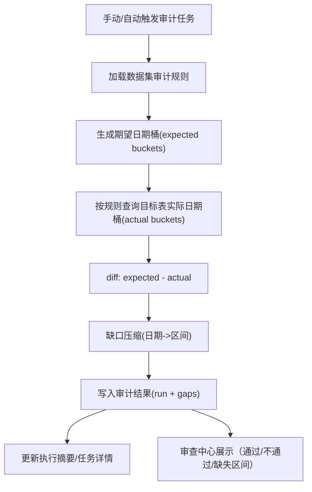

# 数据集日期完整性审计设计 v1（审查中心）

- 版本：v1
- 状态：待重新评审（历史草案；不得直接按本文开发）
- 更新时间：2026-04-24
- 适用范围：`src/ops` 审查中心 + 任务执行链路（手动审计/自动审计）

> 重要说明：本文是日期完整性审计能力的早期方案草案，不是当前可执行开发方案。  
> [数据集日期模型收敛方案 v1](/Users/congming/github/goldenshare/docs/architecture/dataset-date-model-convergence-plan-v1.md) 已将 `DatasetSyncContract.date_model` 收敛为单一事实源；审计能力后续必须重新评审交互设计、API 查询协议、任务模型与结果展示，再进入开发。  
> 本文中 `calendar_type/anchor_rule` 等早期术语后续应改写为读取 `date_model.date_axis/bucket_rule/observed_field/audit_applicable`，不要再新增独立审计规则源。

---

## 1. 目标与边界

### 1.1 目标

建立一个**确定性**的数据完整性审计能力，用于检查“按日期更新”的数据集是否存在中间缺失日期，并明确给出缺失日期/日期区间。

目标输出只有三类：

1. 通过（PASS）
2. 不通过（FAIL）
3. 不适用（NOT_APPLICABLE，必须有原因）

不使用模糊等级（如 full/sparse/一般/严重）。

### 1.2 业务边界

1. 审计对象：当前 `SYNC_SERVICE_REGISTRY` 全量 56 个数据集。
2. 审计维度：以“日期桶完整性”为核心，不做逐字段值级校验。
3. 任务入口：
   - 手动审计
   - 自动审计（定时）
4. 落位位置：审查中心新增“数据完整性审计”模块，并接入现有任务执行体系。

### 1.3 非目标

1. 本期不替代 freshness（新鲜度）状态判定。
2. 本期不做多源逐字段对账。
3. 本期不改业务侧 API 返回契约。

---

## 2. 规则模型（核心口径）

## 2.1 核心原则

每个数据集必须有一条明确规则，规则由以下字段表达：

1. `audit_applicable`：是否可审计（是/否）
2. `calendar_type`：期望日期集合来源
3. `anchor_rule`：从集合中抽取“应存在日期桶”的规则
4. `observed_field`：在目标表中用于观测的日期字段（或月键字段）
5. `not_applicable_reason`：不可审计时的必填原因

> 说明：不再设计 `supports_manual_audit` / `supports_auto_audit`。  
> 可审计就必须支持手动与自动；不可审计则统一通过 `not_applicable_reason` 表达。

## 2.2 `calendar_type` 与 `anchor_rule` 的关系

两者不是重复字段，职责如下：

1. `calendar_type` 解决“从哪里取日期集合”
2. `anchor_rule` 解决“集合里哪些点必须有数据”

示例：

1. `calendar_type=trade_open_day` + `anchor_rule=every_open_day`
   - 含义：范围内每个开市交易日都必须有数据
2. `calendar_type=trade_open_day` + `anchor_rule=week_last_open_day`
   - 含义：只要求每周最后一个交易日有数据
3. `calendar_type=month_window` + `anchor_rule=month_window_has_data`
   - 含义：每个自然月至少有 1 条记录，不要求固定到某一天

## 2.3 本期规则枚举

### `calendar_type`

1. `trade_open_day`：来自交易日历且 `is_open=true`
2. `natural_day`：来自自然日序列
3. `month_key`：按自然月键（`YYYYMM`）序列
4. `month_window`：按自然月窗口（每月一桶）
5. `none`：不适用（快照主数据）

### `anchor_rule`

1. `every_open_day`
2. `week_last_open_day`
3. `month_last_open_day`
4. `every_natural_day`
5. `every_natural_month`
6. `month_window_has_data`
7. `not_applicable`

---

## 3. 领域流程与模块

## 3.1 审计流程

## 3.2 模块职责

1. `AuditRuleRegistry`（规则注册）
   - 返回数据集规则
   - 对不存在规则的情况直接报错
2. `ExpectedBucketPlanner`
   - 根据 `calendar_type + anchor_rule + 时间范围` 生成期望桶
3. `ActualBucketReader`
   - 从目标表读取实际桶（distinct 日期或月份）
4. `GapDetector`
   - 计算缺失桶并压缩为区间
5. `AuditRunService`
   - 组合上述模块
   - 产出 PASS/FAIL/NOT_APPLICABLE
   - 写库并回写任务摘要

---

## 4. 任务模型与运行语义

## 4.1 手动审计

输入参数：

1. `dataset_key`（必填）
2. `start_date`（必填）
3. `end_date`（必填）
4. `mode=manual`

语义：

1. 仅审计该时间范围
2. 结束后给出缺失区间明细

## 4.2 自动审计

输入参数（来自调度）：

1. `dataset_key`（必填）
2. `lookback_days` 或固定 `start_date/end_date`（至少一种）
3. `mode=auto`

语义：

1. 按调度窗口周期执行
2. 每次落库一条审计 run 记录

## 4.3 与现有执行体系关系

1. 复用现有 `ops.job_execution` / `ops.job_execution_step` / `ops.job_execution_unit`
2. 新增审计结果表存放审计产物（不混入同步状态表）
3. `summary_message` 统一输出：
   - `expected=... actual=... missing=...`
   - 缺失区间数量

---

## 5. 数据模型设计（新增）

## 5.1 `ops.dataset_audit_run`

一条审计任务一次执行对应一条 run。

| 字段 | 类型 | 约束 | 含义 |
|---|---|---|---|
| `id` | bigint PK | 硬约束 | 审计运行 ID |
| `execution_id` | bigint | 硬约束、唯一 | 关联 `ops.job_execution.id` |
| `dataset_key` | varchar(64) | 硬约束 | 数据集键 |
| `audit_mode` | varchar(16) | 硬约束 | `manual` / `auto` |
| `status` | varchar(32) | 硬约束 | `passed` / `failed` / `not_applicable` / `error` |
| `start_date` | date | 可空策略：NA 可空，其余必填 | 审计起始日期 |
| `end_date` | date | 可空策略：NA 可空，其余必填 | 审计结束日期 |
| `expected_bucket_count` | int | 硬约束，默认 0 | 期望桶数量 |
| `actual_bucket_count` | int | 硬约束，默认 0 | 实际桶数量 |
| `missing_bucket_count` | int | 硬约束，默认 0 | 缺失桶数量 |
| `calendar_type` | varchar(32) | 硬约束 | 审计规则快照 |
| `anchor_rule` | varchar(32) | 硬约束 | 审计规则快照 |
| `observed_field` | varchar(64) | 可空 | 本次观测字段 |
| `not_applicable_reason` | text | 可空 | NA 原因 |
| `error_code` | varchar(64) | 可空 | 错误码 |
| `error_message` | text | 可空 | 错误信息 |
| `started_at` | timestamptz | 硬约束 | 审计开始时间 |
| `finished_at` | timestamptz | 可空 | 审计完成时间 |
| `created_at` | timestamptz | 硬约束 | 创建时间 |
| `updated_at` | timestamptz | 硬约束 | 更新时间 |

关键约束：

1. `start_date <= end_date`（当两者非空）
2. `missing_bucket_count = expected_bucket_count - actual_bucket_count`（非负）

## 5.2 `ops.dataset_audit_gap`

记录缺失区间（压缩后）。

| 字段 | 类型 | 约束 | 含义 |
|---|---|---|---|
| `id` | bigint PK | 硬约束 | 缺口 ID |
| `audit_run_id` | bigint FK | 硬约束 | 关联 `dataset_audit_run.id` |
| `dataset_key` | varchar(64) | 硬约束 | 冗余字段，便于索引检索 |
| `bucket_kind` | varchar(32) | 硬约束 | `trade_date` / `natural_date` / `month_key` / `month_window` |
| `range_start` | date | 硬约束 | 缺失区间起点 |
| `range_end` | date | 硬约束 | 缺失区间终点 |
| `missing_count` | int | 硬约束 | 区间缺失桶数量 |
| `sample_values_json` | jsonb | 可空 | 可选样本（如月份键） |
| `created_at` | timestamptz | 硬约束 | 创建时间 |

---

## 6. API 与页面设计

## 6.1 API（新增）

前缀建议：`/api/v1/ops/review/audit`

1. `GET /rules`
   - 返回所有数据集审计规则（含 `not_applicable_reason`）
2. `POST /runs`
   - 创建手动审计任务
   - 入参：`dataset_key,start_date,end_date`
3. `GET /runs`
   - 查询审计历史（支持 dataset/status/时间过滤）
4. `GET /runs/{run_id}`
   - 查询单次结果与缺失区间
5. `POST /schedules`
   - 创建自动审计计划（本质写入 `ops.job_schedule`）

## 6.2 审查中心页面

新增一级页面：`审查中心 - 数据完整性审计`

Tab：

1. `手动审计`
2. `自动审计`
3. `审计记录`

展示重点：

1. 审计状态（通过/不通过/不适用）
2. 审计范围
3. 缺失日期区间列表
4. 最近一次审计时间

---

## 7. 逐数据集审计规则（全量 56）

说明：

1. 本表按当前 `SYNC_SERVICE_REGISTRY` 与现有目标表编制。
2. “通过条件”统一指该数据集在给定审计范围内满足规则。
3. `none/not_applicable` 数据集不会创建审计任务，页面直接展示原因。

| dataset_key | 数据集 | 目标表 | calendar_type | anchor_rule | observed_field | 通过条件/说明 |
|---|---|---|---|---|---|---|
| `adj_factor` | 复权因子 | `core.equity_adj_factor` | `trade_open_day` | `every_open_day` | `trade_date` | 通过：范围内每个开市交易日均有数据 |
| `biying_equity_daily` | BIYING 股票日线 | `raw_biying.equity_daily_bar` | `trade_open_day` | `every_open_day` | `trade_date` | 通过：范围内每个开市交易日均有数据 |
| `biying_moneyflow` | BIYING 资金流向 | `core_serving.equity_moneyflow` | `trade_open_day` | `every_open_day` | `trade_date` | 通过：范围内每个开市交易日均有数据 |
| `block_trade` | 大宗交易 | `core_serving.equity_block_trade` | `trade_open_day` | `every_open_day` | `trade_date` | 通过：范围内每个开市交易日均有数据 |
| `broker_recommend` | 券商每月荐股 | `core_serving.broker_recommend` | `month_key` | `every_natural_month` | `month` | 通过：范围内每个月份键(YYYYMM)均有数据 |
| `cyq_perf` | 每日筹码及胜率 | `core_serving.equity_cyq_perf` | `trade_open_day` | `every_open_day` | `trade_date` | 通过：范围内每个开市交易日均有数据 |
| `daily` | 股票日线 | `core_serving.equity_daily_bar` | `trade_open_day` | `every_open_day` | `trade_date` | 通过：范围内每个开市交易日均有数据 |
| `daily_basic` | 股票日指标 | `core_serving.equity_daily_basic` | `trade_open_day` | `every_open_day` | `trade_date` | 通过：范围内每个开市交易日均有数据 |
| `dc_daily` | 东方财富板块行情 | `core_serving.dc_daily` | `trade_open_day` | `every_open_day` | `trade_date` | 通过：范围内每个开市交易日均有数据 |
| `dc_hot` | 东方财富热榜 | `core_serving.dc_hot` | `trade_open_day` | `every_open_day` | `trade_date` | 通过：范围内每个开市交易日均有数据 |
| `dc_index` | 东方财富概念板块 | `core_serving.dc_index` | `trade_open_day` | `every_open_day` | `trade_date` | 通过：范围内每个开市交易日均有数据 |
| `dc_member` | 东方财富板块成分 | `core_serving.dc_member` | `trade_open_day` | `every_open_day` | `trade_date` | 通过：范围内每个开市交易日均有数据 |
| `dividend` | 分红送转 | `core_serving.equity_dividend` | `natural_day` | `every_natural_day` | `ann_date` | 通过：范围内自然日（映射到ann_date）连续有数据 |
| `etf_basic` | ETF 基本信息 | `core_serving.etf_basic` | `none` | `not_applicable` | `-` | 不适用（快照/主数据，无连续日期完整性语义） |
| `etf_index` | ETF 基准指数列表 | `core_serving.etf_index` | `none` | `not_applicable` | `-` | 不适用（快照/主数据，无连续日期完整性语义） |
| `fund_adj` | 基金复权因子 | `core.fund_adj_factor` | `trade_open_day` | `every_open_day` | `trade_date` | 通过：范围内每个开市交易日均有数据 |
| `fund_daily` | 基金日线 | `core_serving.fund_daily_bar` | `trade_open_day` | `every_open_day` | `trade_date` | 通过：范围内每个开市交易日均有数据 |
| `hk_basic` | 港股列表 | `core_serving.hk_security` | `none` | `not_applicable` | `-` | 不适用（快照/主数据，无连续日期完整性语义） |
| `index_basic` | 指数主数据 | `core_serving.index_basic` | `none` | `not_applicable` | `-` | 不适用（快照/主数据，无连续日期完整性语义） |
| `index_daily` | 指数日线 | `core_serving.index_daily_serving` | `trade_open_day` | `every_open_day` | `trade_date` | 通过：范围内每个开市交易日均有数据 |
| `index_daily_basic` | 指数日指标 | `core_serving.index_daily_basic` | `trade_open_day` | `every_open_day` | `trade_date` | 通过：范围内每个开市交易日均有数据 |
| `index_monthly` | 指数月线 | `core_serving.index_monthly_serving` | `trade_open_day` | `month_last_open_day` | `trade_date` | 通过：范围内每月最后交易日均有数据 |
| `index_weekly` | 指数周线 | `core_serving.index_weekly_serving` | `trade_open_day` | `week_last_open_day` | `trade_date` | 通过：范围内每周最后交易日均有数据 |
| `index_weight` | 指数成分权重 | `core_serving.index_weight` | `month_window` | `month_window_has_data` | `trade_date` | 通过：范围内每自然月至少存在1个trade_date记录 |
| `kpl_concept_cons` | 开盘啦题材成分 | `core_serving.kpl_concept_cons` | `trade_open_day` | `every_open_day` | `trade_date` | 通过：范围内每个开市交易日均有数据 |
| `kpl_list` | 开盘啦榜单 | `core_serving.kpl_list` | `trade_open_day` | `every_open_day` | `trade_date` | 通过：范围内每个开市交易日均有数据 |
| `limit_cpt_list` | 最强板块统计 | `core_serving.limit_cpt_list` | `trade_open_day` | `every_open_day` | `trade_date` | 通过：范围内每个开市交易日均有数据 |
| `limit_list_d` | 涨跌停榜 | `core_serving.equity_limit_list` | `trade_open_day` | `every_open_day` | `trade_date` | 通过：范围内每个开市交易日均有数据 |
| `limit_list_ths` | 同花顺涨跌停榜单 | `core_serving.limit_list_ths` | `trade_open_day` | `every_open_day` | `trade_date` | 通过：范围内每个开市交易日均有数据 |
| `limit_step` | 涨停天梯 | `core_serving.limit_step` | `trade_open_day` | `every_open_day` | `trade_date` | 通过：范围内每个开市交易日均有数据 |
| `margin` | 融资融券交易汇总 | `core_serving.equity_margin` | `trade_open_day` | `every_open_day` | `trade_date` | 通过：范围内每个开市交易日均有数据 |
| `moneyflow` | 资金流向（基础） | `core_serving.equity_moneyflow` | `trade_open_day` | `every_open_day` | `trade_date` | 通过：范围内每个开市交易日均有数据 |
| `moneyflow_cnt_ths` | 概念板块资金流向（同花顺） | `core_serving.concept_moneyflow_ths` | `trade_open_day` | `every_open_day` | `trade_date` | 通过：范围内每个开市交易日均有数据 |
| `moneyflow_dc` | 个股资金流向（东方财富） | `core_serving.equity_moneyflow_dc` | `trade_open_day` | `every_open_day` | `trade_date` | 通过：范围内每个开市交易日均有数据 |
| `moneyflow_ind_dc` | 板块资金流向（东方财富） | `core_serving.board_moneyflow_dc` | `trade_open_day` | `every_open_day` | `trade_date` | 通过：范围内每个开市交易日均有数据 |
| `moneyflow_ind_ths` | 行业资金流向（同花顺） | `core_serving.industry_moneyflow_ths` | `trade_open_day` | `every_open_day` | `trade_date` | 通过：范围内每个开市交易日均有数据 |
| `moneyflow_mkt_dc` | 市场资金流向（东方财富） | `core_serving.market_moneyflow_dc` | `trade_open_day` | `every_open_day` | `trade_date` | 通过：范围内每个开市交易日均有数据 |
| `moneyflow_ths` | 个股资金流向（同花顺） | `core_serving.equity_moneyflow_ths` | `trade_open_day` | `every_open_day` | `trade_date` | 通过：范围内每个开市交易日均有数据 |
| `stk_factor_pro` | 股票技术面因子(专业版) | `core_serving.equity_factor_pro` | `trade_open_day` | `every_open_day` | `trade_date` | 通过：范围内每个开市交易日均有数据 |
| `stk_holdernumber` | 股东户数 | `core_serving.equity_holder_number` | `natural_day` | `every_natural_day` | `ann_date` | 通过：范围内自然日（映射到ann_date）连续有数据 |
| `stk_limit` | 每日涨跌停价格 | `core_serving.equity_stk_limit` | `trade_open_day` | `every_open_day` | `trade_date` | 通过：范围内每个开市交易日均有数据 |
| `stk_nineturn` | 神奇九转指标 | `core_serving.equity_nineturn` | `trade_open_day` | `every_open_day` | `trade_date` | 通过：范围内每个开市交易日均有数据 |
| `stk_period_bar_adj_month` | 股票复权月线 | `core_serving.stk_period_bar_adj` | `trade_open_day` | `month_last_open_day` | `trade_date` | 通过：范围内每月最后交易日均有数据 |
| `stk_period_bar_adj_week` | 股票复权周线 | `core_serving.stk_period_bar_adj` | `trade_open_day` | `week_last_open_day` | `trade_date` | 通过：范围内每周最后交易日均有数据 |
| `stk_period_bar_month` | 股票月线 | `core_serving.stk_period_bar` | `trade_open_day` | `month_last_open_day` | `trade_date` | 通过：范围内每月最后交易日均有数据 |
| `stk_period_bar_week` | 股票周线 | `core_serving.stk_period_bar` | `trade_open_day` | `week_last_open_day` | `trade_date` | 通过：范围内每周最后交易日均有数据 |
| `stock_basic` | 股票主数据 | `core_serving.security_serving` | `none` | `not_applicable` | `-` | 不适用（快照/主数据，无连续日期完整性语义） |
| `stock_st` | ST股票列表 | `core_serving.equity_stock_st` | `trade_open_day` | `every_open_day` | `trade_date` | 通过：范围内每个开市交易日均有数据 |
| `suspend_d` | 每日停复牌信息 | `core_serving.equity_suspend_d` | `trade_open_day` | `every_open_day` | `trade_date` | 通过：范围内每个开市交易日均有数据 |
| `ths_daily` | 同花顺板块行情 | `core_serving.ths_daily` | `trade_open_day` | `every_open_day` | `trade_date` | 通过：范围内每个开市交易日均有数据 |
| `ths_hot` | 同花顺热榜 | `core_serving.ths_hot` | `trade_open_day` | `every_open_day` | `trade_date` | 通过：范围内每个开市交易日均有数据 |
| `ths_index` | 同花顺概念和行业指数 | `core_serving.ths_index` | `none` | `not_applicable` | `-` | 不适用（快照/主数据，无连续日期完整性语义） |
| `ths_member` | 同花顺板块成分 | `core_serving.ths_member` | `none` | `not_applicable` | `-` | 不适用（快照/主数据，无连续日期完整性语义） |
| `top_list` | 龙虎榜 | `core_serving.equity_top_list` | `trade_open_day` | `every_open_day` | `trade_date` | 通过：范围内每个开市交易日均有数据 |
| `trade_cal` | 交易日历 | `core_serving.trade_calendar` | `natural_day` | `every_natural_day` | `trade_date` | 通过：范围内自然日连续有数据（按exchange维度可选审计） |
| `us_basic` | 美股列表 | `core_serving.us_security` | `none` | `not_applicable` | `-` | 不适用（快照/主数据，无连续日期完整性语义） |

---

## 8. 计算细节（确保可实现）

## 8.1 期望桶生成

1. `trade_open_day + every_open_day`
   - 取交易日历开市日序列
2. `trade_open_day + week_last_open_day`
   - 开市日按周分组取最后一天
3. `trade_open_day + month_last_open_day`
   - 开市日按月分组取最后一天
4. `natural_day + every_natural_day`
   - 生成自然日连续序列
5. `month_key + every_natural_month`
   - 生成 `YYYYMM` 连续月份序列
6. `month_window + month_window_has_data`
   - 生成自然月桶（每月一个桶）

## 8.2 实际桶读取

统一策略：

1. 按 `dataset_key` 定位目标表和 `observed_field`
2. 查询 `distinct observed_field`（或月份映射）
3. 只取审计范围内数据

### 特例

1. `broker_recommend`：读取 `month`
2. `index_weight`：按 `trade_date` 映射到月份桶
3. `dividend/stk_holdernumber`：读取 `ann_date`

## 8.3 缺失区间压缩

1. 先得到缺失桶排序列表
2. 按桶类型判断“连续性”：
   - 自然日：+1 天
   - 交易日：下一开市日
   - 月份键：下一月
3. 连续桶压缩为 `[range_start, range_end]`

---

## 9. 风险与前置门禁

## 9.1 主要风险

1. 低频事件（`dividend/stk_holdernumber`）天然可能稀疏，规则需明确“以公告日连续性为准”
2. `trade_cal` 若多交易所混用，需在审计参数中支持 `exchange` 过滤（默认 `SSE`）
3. 大表审计（如 `daily/moneyflow`）需依赖日期索引，避免全表扫描

## 9.2 门禁

1. 规则注册完整性测试（56 个数据集必须全覆盖）
2. 审计引擎单测：
   - 每种 `calendar_type + anchor_rule` 至少一例
3. API 集成测试：
   - 手动审计创建/查询
   - 自动审计计划落地
4. 页面冒烟：
   - 手动审计执行与缺失区间展示
   - 自动审计记录展示

---

## 10. 分期实施建议

### Phase A：规则与引擎

1. 落地规则注册（56 条）
2. 落地期望桶生成 + 缺口计算
3. 单测跑通

### Phase B：任务接入与结果存储

1. 接入 `job_execution` 执行链
2. 新增 `dataset_audit_run/gap` 模型与迁移
3. API 联调

### Phase C：审查中心页面

1. 新增手动审计/自动审计/审计记录页面
2. 接入缺失区间可视化
3. 回归验证与灰度上线
