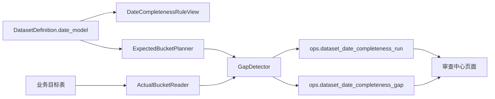
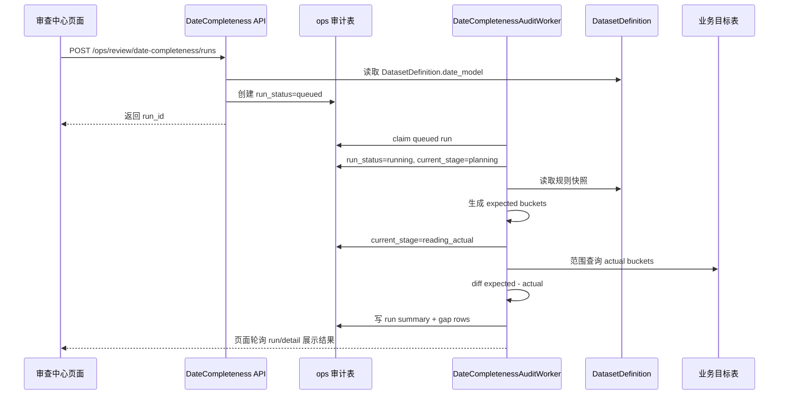

# 数据集日期完整性审计设计 v2（独立审计系统）

- 版本：v2
- 状态：M7 已完成本地验证（手动审计、独立 worker、自动审计配置与 tick 已接入；M8 远程验证待做）
- 更新时间：2026-04-30
- 适用范围：`src/ops` 审查中心的数据日期完整性审计能力
- 前置事实源：`src/foundation/datasets/**` 的 `DatasetDefinition.date_model`
- 替代文档：[数据集日期完整性审计设计 v1（历史稿）](/Users/congming/github/goldenshare/docs/ops/dataset-date-completeness-audit-design-v1.md)
- 相关基线：[数据集日期模型消费指南 v1](/Users/congming/github/goldenshare/docs/architecture/dataset-date-model-consumer-guide-v1.md)

---

## 0. 本版核心决策

本版与 v1 最大区别：日期完整性审计是独立的数据观测系统，不复用 TaskRun，不混入数据维护任务链路，不混入 freshness/status/snapshot。

硬口径：

1. 审计任务模型独立，不写 `ops.task_run`、`ops.task_run_node`、`ops.task_run_issue`。
2. 审计执行器独立，可以由单独 worker 进程消费审计队列。
3. 审计结果独立，只写日期完整性审计自己的结果表和缺口表。
4. 审计只读业务目标表，不写业务数据表。
5. 审计不刷新 freshness，不写 dataset status snapshot，不影响同步任务状态。
6. 审计规则只来自 `DatasetDefinition.date_model`，不得在 ops、API、前端复制第二套规则。
7. 同步任务正在运行时同时触发审计的并发一致性问题，本期不处理；后续通过统一运维协调机制解决。

---

## 1. 目标与非目标

### 1.1 目标

建立一个确定性的日期完整性审计能力，用于回答：

1. 某个数据集在指定时间范围内，按它的日期模型应该有哪些日期桶。
2. 业务目标表里实际有哪些日期桶。
3. 缺哪些日期桶，缺口能否压缩成区间。
4. 审计结论是通过、不通过，还是审计执行错误。

审计 run 结论只允许三类；不适用数据集不创建 run，只在规则列表展示原因：

| 结论 | 含义 |
|---|---|
| `passed` | 范围内期望桶均有数据 |
| `failed` | 范围内存在缺失桶 |
| `error` | 审计执行失败，例如目标表不可读、规则缺失、SQL 失败 |

### 1.2 非目标

1. 不替代 freshness。freshness 看“最新日期是否滞后”，完整性审计看“范围中间是否缺桶”。
2. 不做字段级质量校验。
3. 不做多源逐字段对账。
4. 不做分钟级完整性审计。`stk_mins` 第一版保持不可审计。
5. 不协调同步任务与审计任务之间的并发关系。
6. 不复用 TaskRun，不改数据维护执行链路。

---

## 2. 系统边界



允许读取：

1. `DatasetDefinition`：数据集身份、展示名、目标表、日期模型、可审计标记。
2. 交易日历表：生成交易日期望桶。
3. 业务目标表：读取实际日期桶。
4. 审计自己的表：读取历史任务、结果、缺口。

禁止读取或写入作为事实源：

1. `ops.task_run` / `ops.task_run_node` / `ops.task_run_issue`
2. `ops.dataset_status_snapshot`
3. `ops.dataset_layer_snapshot_current`
4. `ops.dataset_layer_snapshot_history`
5. 旧任务观测链路和旧同步状态表

说明：审计页面可以在 UI 上与 freshness 并列展示，但两者不能共享状态表，也不能互相覆盖结论。

---

## 3. 规则模型

### 3.1 单一事实源

审计规则只消费 `DatasetDefinition.date_model`：

| 字段 | 用途 |
|---|---|
| `date_axis` | 决定日期集合来源 |
| `bucket_rule` | 决定期望桶抽取规则 |
| `window_mode` | 用于审计表单输入说明 |
| `input_shape` | 用于审计表单控件推导 |
| `observed_field` | 决定业务目标表实际桶读取字段 |
| `audit_applicable` | 决定是否允许审计 |
| `not_applicable_reason` | 不适用时展示原因 |

硬规则：

1. `audit_applicable=true` 时必须有 `observed_field`。
2. `audit_applicable=false` 时必须有 `not_applicable_reason`。
3. `DatasetDefinition.observability.observed_field` 与 `date_model.observed_field` 若不一致，视为 Definition 配置错误，审计模块不得兜底。
4. `dividend` / `stk_holdernumber` 等低频事件型数据，也以 Definition 的 date model 为准；如果业务口径要变，必须先改 Definition。
5. 多个逻辑数据集共用同一目标表与同一观测字段时，必须由 `DatasetDefinition.storage.row_identity_filters` 显式声明行级归属条件；审计 SQL 不得按 `dataset_key` 硬编码。

`row_identity_filters` 是存储事实，不是审计专用规则。第一版只允许简单等值过滤，例如股票周/月线共用 `core_serving.stk_period_bar` 时：

| 数据集 | 目标表 | 观测字段 | 实际桶过滤 |
|---|---|---|---|
| `stk_period_bar_week` | `core_serving.stk_period_bar` | `trade_date` | `freq=week` |
| `stk_period_bar_month` | `core_serving.stk_period_bar` | `trade_date` | `freq=month` |
| `stk_period_bar_adj_week` | `core_serving.stk_period_bar_adj` | `trade_date` | `freq=week` |
| `stk_period_bar_adj_month` | `core_serving.stk_period_bar_adj` | `trade_date` | `freq=month` |

约束：

1. 过滤字段必须是合法列名。
2. 过滤值只允许字符串、整数、布尔值。
3. 过滤条件必须通过 SQL 参数绑定消费，不允许拼接 raw SQL。

### 3.2 日期桶规则

| `date_axis` | `bucket_rule` | 期望桶生成方式 |
|---|---|---|
| `trade_open_day` | `every_open_day` | 范围内每个开市交易日 |
| `trade_open_day` | `week_last_open_day` | 范围内每周最后一个开市交易日 |
| `trade_open_day` | `month_last_open_day` | 范围内每月最后一个开市交易日 |
| `natural_day` | `every_natural_day` | 范围内每个自然日 |
| `natural_day` | `week_friday` | 范围内每个自然周周五 |
| `natural_day` | `month_last_calendar_day` | 范围内每个自然月最后一天 |
| `month_key` | `every_natural_month` | 范围内每个自然月键 `YYYYMM` |
| `month_window` | `month_window_has_data` | 范围内每个自然月窗口至少存在一条数据 |
| `none` | `not_applicable` | 不生成期望桶 |

交易日历第一版使用系统默认交易所口径。若未来要支持多交易所审计，必须在 `DatasetDefinition` 或审计请求协议中显式建模，不允许在 SQL 内写死临时规则。

---

## 4. 独立审计任务模型

### 4.1 表：`ops.dataset_date_completeness_run`

一条 run 是一次审计任务实例，同时保存本次审计的运行状态、规则快照和结果摘要。

| 字段 | 类型 | 含义 |
|---|---|---|
| `id` | bigint PK | 审计任务 ID |
| `dataset_key` | varchar(96) | 数据集键 |
| `display_name` | varchar(160) | 数据集展示名快照 |
| `target_table` | varchar(160) | 本次审计读取的目标表快照 |
| `run_mode` | varchar(16) | `manual` / `scheduled` |
| `run_status` | varchar(24) | `queued` / `running` / `succeeded` / `failed` / `canceled` |
| `result_status` | varchar(24) | `passed` / `failed` / `error`，运行中为空 |
| `start_date` | date | 审计范围起点 |
| `end_date` | date | 审计范围终点 |
| `date_axis` | varchar(32) | `date_model.date_axis` 快照 |
| `bucket_rule` | varchar(32) | `date_model.bucket_rule` 快照 |
| `window_mode` | varchar(32) | `date_model.window_mode` 快照 |
| `input_shape` | varchar(32) | `date_model.input_shape` 快照 |
| `observed_field` | varchar(64) | 实际桶观测字段快照 |
| `row_identity_filters_json` | json | 目标表行级归属过滤条件快照 |
| `expected_bucket_count` | int | 期望桶数量 |
| `actual_bucket_count` | int | 实际桶数量 |
| `missing_bucket_count` | int | 缺失桶数量 |
| `gap_range_count` | int | 压缩后的缺口区间数量 |
| `current_stage` | varchar(64) | 当前阶段，如 `planning`、`reading_actual`、`detecting_gap`、`persisting` |
| `operator_message` | text | 给运营看的短消息 |
| `technical_message` | text | 技术诊断；只保存在本审计模型内，不复制到 TaskRun |
| `requested_by_user_id` | bigint | 手动发起人 |
| `schedule_id` | bigint | 自动审计配置 ID，可空 |
| `requested_at` | timestamptz | 创建时间 |
| `started_at` | timestamptz | 开始执行时间 |
| `finished_at` | timestamptz | 结束时间 |
| `created_at` | timestamptz | 行创建时间 |
| `updated_at` | timestamptz | 行更新时间 |

约束：

1. `run_status=succeeded` 时 `result_status` 必须非空。
2. `result_status=passed` 时 `missing_bucket_count=0`。
3. `result_status=failed` 时 `missing_bucket_count>0`。
4. `start_date <= end_date`。

### 4.2 表：`ops.dataset_date_completeness_gap`

记录压缩后的缺失区间。

| 字段 | 类型 | 含义 |
|---|---|---|
| `id` | bigint PK | 缺口 ID |
| `run_id` | bigint FK | 关联 `dataset_date_completeness_run.id` |
| `dataset_key` | varchar(96) | 数据集键，便于检索 |
| `bucket_kind` | varchar(32) | `trade_date` / `natural_date` / `month_key` / `month_window` |
| `range_start` | date | 缺口起点 |
| `range_end` | date | 缺口终点 |
| `missing_count` | int | 区间内缺失桶数量 |
| `sample_values_json` | jsonb | 可选样本，如月份键列表 |
| `created_at` | timestamptz | 创建时间 |

### 4.3 表：`ops.dataset_date_completeness_schedule`

自动审计配置独立于 `ops.schedule`。

| 字段 | 类型 | 含义 |
|---|---|---|
| `id` | bigint PK | 审计计划 ID |
| `dataset_key` | varchar(96) | 数据集键 |
| `display_name` | varchar(160) | 计划名称 |
| `status` | varchar(16) | `active` / `paused` |
| `window_mode` | varchar(32) | `fixed_range` / `rolling` |
| `start_date` | date | 固定窗口起点 |
| `end_date` | date | 固定窗口终点 |
| `lookback_count` | int | 滚动窗口数量 |
| `lookback_unit` | varchar(32) | `calendar_day` / `open_day` / `month` |
| `calendar_scope` | varchar(32) | `default_cn_market` / `cn_a_share` / `hk_market` / `custom_exchange` |
| `calendar_exchange` | varchar(32) | 具体交易所代码，可空 |
| `cron_expr` | varchar(64) | 定时表达式 |
| `timezone` | varchar(64) | 默认 `Asia/Shanghai` |
| `next_run_at` | timestamptz | 下次运行时间 |
| `last_run_id` | bigint | 最近一次审计 run |
| `created_by_user_id` | bigint | 创建人 |
| `updated_by_user_id` | bigint | 更新人 |
| `created_at` | timestamptz | 创建时间 |
| `updated_at` | timestamptz | 更新时间 |

窗口语义：

1. `window_mode=fixed_range`：每次自动审计都使用固定 `start_date/end_date`，适合历史专项核查。
2. `window_mode=rolling`：每次自动审计按运行时刻动态计算审计窗口，适合日常巡检。
3. `lookback_count=10, lookback_unit=open_day`：表示回看最近 10 个开市交易日。
4. `lookback_count=30, lookback_unit=calendar_day`：表示回看最近 30 个自然日。
5. `lookback_count=6, lookback_unit=month`：表示回看最近 6 个自然月窗口。

交易日历语义：

1. 第一版默认 `calendar_scope=default_cn_market`，使用系统默认 A 股交易日历。
2. 若未来支持港股，新增 `calendar_scope=hk_market` 或 `custom_exchange + calendar_exchange=HKEX`，不改表结构。
3. 审计 SQL 不允许临时写死交易所；交易所口径必须来自 schedule 或请求协议。

说明：自动审计第一版必须使用本独立 schedule 表，不挂到 `ops.schedule`。

---

## 5. 执行流程



阶段说明：

1. `planning`：读取 Definition，校验可审计性，生成期望桶。
2. `reading_actual`：按目标表和 observed_field 范围读取实际桶。
3. `detecting_gap`：计算缺失桶并压缩区间。
4. `persisting`：写 run 结果和 gap 明细。
5. `finished`：更新最终状态。

事务边界：

1. 审计 run/gap 写入使用 ops 审计事务。
2. 业务目标表只读，不参与审计写事务。
3. 审计状态写入失败不得影响业务数据。
4. 审计失败只影响本次审计 run，不影响同步链路。

---

## 6. 核心模块

建议落位在 `src/ops/**`，因为它是运维审查能力，不是数据维护执行主链。

| 模块 | 职责 |
|---|---|
| `DateCompletenessRuleService` | 从 `DatasetDefinition` 投影规则视图 |
| `ExpectedBucketPlanner` | 根据 `date_axis + bucket_rule + range` 生成期望桶 |
| `ActualBucketReader` | 从业务目标表读取实际桶 |
| `GapDetector` | 计算缺失桶并压缩区间 |
| `DateCompletenessRunService` | 创建、查询、取消审计 run |
| `DateCompletenessAuditExecutor` | 执行单个 run |
| `DateCompletenessAuditWorker` | 独立消费 queued run |
| `DateCompletenessScheduleService` | 管理自动审计计划，若第一版启用自动审计 |

禁止事项：

1. 不调用 `TaskRunCommandService`。
2. 不调用 `TaskRunDispatcher`。
3. 不写 `ops.task_run*`。
4. 不写 freshness/status/snapshot 表。
5. 不从前端传入 `date_axis`、`bucket_rule`、`observed_field`。

---

## 7. API 设计

前缀：`/api/v1/ops/review/date-completeness`

### 7.1 `GET /rules`

返回全量数据集审计能力。数据来自 `DatasetDefinition`。

返回重点字段：

1. `dataset_key`
2. `display_name`
3. `domain_key`
4. `domain_display_name`
5. `target_table`
6. `date_axis`
7. `bucket_rule`
8. `input_shape`
9. `observed_field`
10. `audit_applicable`
11. `not_applicable_reason`

### 7.2 `POST /runs`

创建手动审计 run。

请求体：

```json
{
  "dataset_key": "moneyflow_ind_dc",
  "start_date": "2026-04-01",
  "end_date": "2026-04-24"
}
```

返回：

```json
{
  "run_id": 1001,
  "run_status": "queued"
}
```

规则：

1. API 不接受前端传入 `date_axis`、`bucket_rule`、`observed_field`。
2. `audit_applicable=false` 的数据集不可创建 run，后端返回 422，前端不展示创建入口。
3. 范围参数按 `input_shape` 校验。

### 7.3 `GET /runs`

查询审计 run 列表，支持：

1. `dataset_key`
2. `run_status`
3. `result_status`
4. `start_date/end_date`
5. `page/page_size`

### 7.4 `GET /runs/{run_id}`

查询单次审计 run 摘要。

### 7.5 `GET /runs/{run_id}/gaps`

查询单次审计缺口区间。

### 7.6 自动审计 API

第一版包含自动审计，新增：

1. `GET /schedules`
2. `POST /schedules`
3. `GET /schedules/{schedule_id}`
4. `PATCH /schedules/{schedule_id}`
5. `POST /schedules/tick`
6. `POST /schedules/{schedule_id}/pause`
7. `POST /schedules/{schedule_id}/resume`
8. `DELETE /schedules/{schedule_id}`

自动审计必须使用 `ops.dataset_date_completeness_schedule`，不得复用 `ops.schedule` 作为临时方案。

调度入口：

1. API tick：`POST /schedules/tick`，用于一次性扫描 due schedule 并创建 `run_mode=scheduled` 的审计 run。
2. CLI tick：`goldenshare ops-date-completeness-scheduler-tick --limit N`，用于独立调度进程或系统定时器调用。
3. 审计执行仍由 `DateCompletenessAuditWorker` 消费 queued run；调度只创建 run，不直接读取业务表。

---

## 8. 页面设计

新增页面：`审查中心 -> 数据集审计`

说明：页面名称为“数据集审计”，本方案是该页面第一期能力“日期完整性审计”的技术设计。后续其他审计能力不得与本期日期完整性结果表混写。

Tab：

1. `手动审计`
2. `审计记录`
3. `自动审计`，可后置

页面数据源：

| 区域 | 数据源 |
|---|---|
| 数据集选择与可审计说明 | `GET /rules` |
| 创建审计 | `POST /runs` |
| 运行状态轮询 | `GET /runs/{run_id}` |
| 缺口明细 | `GET /runs/{run_id}/gaps` |
| 历史记录 | `GET /runs` |
| 自动审计配置 | `/schedules*`，若启用 |

展示原则：

1. 页面只表达日期完整性，不混入 freshness。
2. 结果用“通过 / 不通过 / 执行错误”；不适用只在规则列表展示，不进入审计记录。
3. 重点展示审计范围、期望日期数、实际日期数、缺失日期数、缺失区间。
4. 不展示 TaskRun 信息，不跳转任务详情页。
5. 不适用数据集展示原因，不展示创建按钮。

---

## 9. 当前数据集规则快照

说明：

1. 本表来自当前 `DatasetDefinition`，用于评审，不是第二套规则源。
2. 代码实现必须运行时读取 Definition，不得复制本表。
3. 当前共 59 个数据集，49 个可审计，10 个不可审计。

| 组合 | 数量 |
|---|---:|
| `trade_open_day + every_open_day + trade_date` | 37 |
| `trade_open_day + week_last_open_day + trade_date` | 1 |
| `trade_open_day + month_last_open_day + trade_date` | 1 |
| `natural_day + every_natural_day + ann_date` | 2 |
| `natural_day + every_natural_day + date` | 1 |
| `natural_day + every_natural_day + trade_date` | 1 |
| `natural_day + week_friday + trade_date` | 2 |
| `natural_day + month_last_calendar_day + trade_date` | 2 |
| `month_key + every_natural_month + month` | 1 |
| `month_window + month_window_has_data + trade_date` | 1 |
| `trade_open_day + every_open_day + trade_time` | 1 |
| `natural_day + not_applicable + pub_time` | 1 |
| `none + not_applicable + -` | 8 |
| `trade_open_day + every_open_day + trade_time`，不可审计 | 1 |
| `none + not_applicable` | 8 |

不可审计数据集：

| dataset_key | 数据集 | 原因 |
|---|---|---|
| `etf_basic` | ETF 基础信息 | snapshot/master dataset |
| `etf_index` | ETF 跟踪指数 | snapshot/master dataset |
| `hk_basic` | 港股基础信息 | snapshot/master dataset |
| `index_basic` | 指数基础信息 | snapshot/master dataset |
| `stk_mins` | 股票历史分钟行情 | minute completeness audit requires trading-session calendar |
| `stock_basic` | 股票主数据 | snapshot/master dataset |
| `ths_index` | 同花顺板块列表 | snapshot/master dataset |
| `ths_member` | 同花顺板块成分 | snapshot/master dataset |
| `us_basic` | 美股基础信息 | snapshot/master dataset |

---

## 10. 计算细节

### 10.1 期望桶生成

1. `trade_open_day + every_open_day`：读取开市交易日。
2. `trade_open_day + week_last_open_day`：按 ISO 周分组，取该周最后一个开市交易日。
3. `trade_open_day + month_last_open_day`：按自然月分组，取该月最后一个开市交易日。
4. `natural_day + every_natural_day`：生成自然日序列。
5. `natural_day + week_friday`：生成范围内所有自然周周五。
6. `natural_day + month_last_calendar_day`：生成范围内所有自然月最后一天。
7. `month_key + every_natural_month`：生成连续月份键。
8. `month_window + month_window_has_data`：每个自然月窗口一个桶，判断窗口内是否至少存在数据。

### 10.2 实际桶读取

统一读取策略：

1. 从 Definition 获取 `storage.target_table`。
2. 从 Definition 获取 `date_model.observed_field`。
3. 根据审计范围生成 where 条件。
4. 只查询 distinct bucket，不扫描非范围数据。
5. 大表必须确认日期字段索引；缺索引不得开放自动审计。

特例：

1. `broker_recommend`：读取 `month`，按 `YYYYMM` 比较。
2. `index_weight`：读取 `trade_date`，按自然月窗口归并。
3. `dividend` / `stk_holdernumber`：读取 `ann_date`，按 Definition 当前规则审计。
4. `trade_cal`：读取 `trade_date`，第一版按默认交易所口径处理。
5. `stk_mins`：不可审计，不读取实际桶。

### 10.3 缺口压缩

1. 先得到排序后的缺失桶。
2. 按桶类型判断连续性：
   - 自然日：下一天
   - 交易日：下一个开市交易日
   - 月份键：下一个自然月
   - 月窗口：下一个自然月窗口
3. 连续缺失桶压缩为一个 gap range。

---

## 11. 并发与一致性

本期明确不处理同步任务与审计任务之间的协调。

当前口径：

1. 审计只看查询时已提交的业务数据。
2. 如果同步正在运行，审计可能读到“部分已提交”的状态。
3. 这种结果不代表同步失败，只代表审计时刻的已提交视图。
4. 页面需要展示审计开始时间和结束时间，避免把审计结果理解成永久事实。

后续可选方案：

1. 审计前读取数据维护状态，提示相关数据集当前可能正在维护。
2. 引入数据集级维护窗口协调。
3. 审计基于指定快照版本或数据批次。

这些都不进入第一版，避免过早复杂化。

---

## 12. 风险与门禁

开发前门禁：

1. Definition 全量投影测试：57 个数据集均能生成规则视图。
2. `audit_applicable=true` 必须有 observed field。
3. `audit_applicable=false` 必须有 not applicable reason。
4. 目标表和 observed field 必须可解析。
5. 大表日期字段索引必须确认。

实现后门禁：

1. 每种 `date_axis + bucket_rule` 至少一个单测。
2. `passed / failed / error` 三类 run 结果路径都有测试；不适用数据集必须覆盖 422 校验路径。
3. API 不允许前端传规则字段。
4. 前端不允许复制规则常量。
5. 审计执行不写 TaskRun、freshness、snapshot 表。
6. 文档和 AGENTS 不得描述“日期完整性审计接入 TaskRun”。

---

## 13. Milestone

| Milestone | 目标 | 产物 | 验收 |
|---|---|---|---|
| M0 | 方案评审定稿 | 本文档状态从待评审改为可开发 | 独立模型、不复用 TaskRun 的口径确认 |
| M1 | 规则投影 | Rule service + `/rules` schema | 57 个 Definition 全覆盖 |
| M2 | 核心审计引擎 | Expected planner、actual reader、gap detector | 所有 date model 组合有单测 |
| M3 | 独立审计表 | run/gap ORM + Alembic | 不依赖 TaskRun，不写 freshness |
| M4 | 手动审计 API | 创建 run、查询 run/gap | 不适用数据集返回 422，API 不接受前端传规则字段 |
| M5 | 独立 worker | 执行 run、`DateCompletenessAuditWorker` 与一次性消费命令 | queued -> running -> succeeded/failed，PASS/FAIL/ERROR 路径 |
| M6 | 审查中心页面 | 手动审计 + 审计记录 | 页面不读取 TaskRun view |
| M7 | 自动审计 | 独立 schedule 表、schedule API、scheduler tick、前端自动审计 Tab | 可配置、可暂停/恢复/删除、可查看最近结果 |
| M8 | 远程验证 | 小窗口真实执行验证 | 覆盖交易日、月份键、月窗口、不适用路径 |

建议第一批验证数据集：

1. `moneyflow_ind_dc`：交易日连续模型。
2. `broker_recommend`：月份键模型。
3. `index_weight`：月窗口模型。
4. `stock_basic`：不可审计模型。

---

## 14. 待评审决策点

### 14.1 已确认决策

1. `audit_applicable=false` 时不可创建审计 run；前端不展示创建入口，后端收到请求直接返回校验错误。
2. 第一版创建独立 `DateCompletenessAuditWorker`，不使用 TaskRun，不使用数据维护 worker。
3. 第一版包含自动审计。
4. 第一版创建 `ops.dataset_date_completeness_schedule`，它就是自动审计配置表。
5. 第一版使用默认交易所口径；表结构保留 `calendar_scope/calendar_exchange`，为未来港股或自定义交易所留扩展口。

### 14.2 剩余待评审

1. 自动审计默认推荐窗口：例如交易日数据默认 `lookback_count=10, lookback_unit=open_day`，月度数据默认 `lookback_count=6, lookback_unit=month`。
2. 审计详情页是否默认展开全部缺口区间，还是只展示摘要并按需展开。
