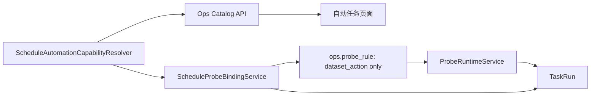

# Ops 自动任务能力契约收敛方案 v1

状态：已拍板，待开发
日期：2026-08-03
适用范围：`src/ops/**`、`frontend/src/pages/ops-v21-task-auto-tab.tsx`、`GET /api/v1/ops/catalog`。
配套 LLD：[Ops 自动任务能力契约 LLD v1](/Users/congming/github/goldenshare/docs/ops/ops-automation-capability-contract-lld-v1.md)。

---

## 1. 一句话结论

自动任务的配置能力必须由 Ops 后端统一定义并随 Catalog 返回；前端只渲染该契约，不能再按 `action_key` 维护 condition、固定窗口、日期、filters 或来源的特殊白名单。

`probe` 是**自动任务目标的触发能力**，不是数据集永久拥有的执行方式：

1. 单独配置为 `dataset_action` 自动任务的数据集，可以有 source-ready probe。
2. 工作流只能按普通 `schedule` 触发，不能使用 `probe` 或 `schedule_probe_fallback`，也不能派生 `ops.probe_rule`。
3. 支持 source-ready probe 的数据集可以作为工作流步骤存在；在工作流中它和其他步骤一样按工作流的时间/参数直接执行，不继承或调用 probe。
4. probe 的来源由系统按目标数据集和 condition 决定；运营端不可选择、不可覆盖来源。

## 2. 已拍板的语义边界

| 场景 | 是否允许 probe | 实际行为 |
| --- | --- | --- |
| 单独的 dataset action 自动任务 | 按该目标 capability 决定 | 允许时先确认源端就绪，再创建一条该数据集的 TaskRun |
| 工作流自动任务 | 否 | 到点直接创建工作流 TaskRun，由工作流逐步执行 |
| 工作流中的 source-ready 数据集步骤 | 否 | 使用工作流传入的日期和 filters 直接执行，不等待源端 probe |
| maintenance action 自动任务 | 否 | 到点直接执行维护动作 |
| 手动 dataset action / 手动工作流 | 否 | 用户显式提交后直接执行；本方案不改变手动任务契约 |

因此，`index_daily` 继续保留在 `index_extension_maintenance` 和 `index_kline_maintenance_pipeline` 两个工作流中；两者不会产生 `remote_index_daily_ready` ProbeRule。只有运营单独配置 `index_daily.maintain` 自动任务时，才可选择其 source-ready probe。

### 2.1 系统默认来源

source-ready probe 的来源不是运营配置项：

1. Catalog 只返回“系统默认来源”，不返回可选择来源列表。
2. 自动任务创建/编辑请求不接受可写 `source_key`；直接 API 携带该字段返回 `422 source_key.operator_forbidden`。
3. `ProbeRule.source_key` 继续仅作运行诊断记录，但只能由后端依据 `DatasetDefinition.source.source_key_default` 和 condition 生成。
4. Runtime 不得以请求或 ProbeRule 中的运营输入选择 connector；各 source-ready service 继续使用其系统默认 source。

## 3. 已核验基线与根因

当前规则分散在三处：

1. `ScheduleProbeBindingService` 校验并派生 `ops.probe_rule`。
2. `ProbeRuntimeService` 按 condition 调用真实探测器，并在命中后创建 TaskRun。
3. 自动任务前端页按 action key 硬编码默认 condition、可选项、固定窗口、filters/日期清空和提交校验。

第三处导致新增数据集容易漏接；`margin_detail` 的表单遗漏正是这个结构性问题。本轮逐行审计还确认：

1. 当前 binding 会把 workflow 的 probe 配置展开到步骤，甚至接受 `workflow_dataset_keys`；该路径必须删除。
2. `WorkflowDefinition.probe_trigger_enabled` 没有运行消费者，是历史死字段，必须删除。
3. 当前有 76 个可排程数据集动作、1 个维护动作、4 个工作流，共 81 个目标；7 个 source-ready condition 都对应精确的 dataset action。
4. 2026-08-03 生产只读审计得到 28 条 `ops.schedule`、6 条 `ops.probe_rule`；没有 workflow ProbeRule，也没有 `margin_detail` 自动任务。实现时仍须正式只读预检。

## 4. 目标与非目标

### 4.1 目标

1. 建立 `src/ops` 内唯一的自动任务能力事实源。
2. 每个 Catalog 目标都返回 `automation_capability`；不可排程目标返回 `null`。
3. 前端只按 Catalog 契约决定触发方式、condition、日期、filters、窗口、频率和来源展示。
4. 后端在创建、更新、恢复和预检时使用同一 resolver；直接 API 不能绕过限制。
5. workflow probe、workflow ProbeRule、`workflow_dataset_keys` 和 `probe_trigger_enabled` 退出主链。
6. 存量配置只读预检为零 mismatch 后发布；不重配、不重建、不自动修复。

### 4.2 非目标

1. 不改变 `DatasetDefinition`、数据维护执行计划、源接口请求或业务数据写入。
2. 不合并 7 个 source-ready 探测器，不改变其完成判定、去重或 TaskRun 语义。
3. 不把手动维护表单并入自动任务 capability。
4. 不新增数据库表、迁移、seed 排程或批量重建 ProbeRule。
5. 不从工作流中移除 `index_daily` 等步骤；只禁止 workflow 的 probe 触发。

## 5. 目标架构



| 组件 | 负责 | 不承担 |
| --- | --- | --- |
| `ScheduleAutomationCapabilityResolver` | 按 `target_type + target_key` 给出配置能力 | 调用源端、创建 TaskRun |
| Catalog Query | 投影 resolver 结果 | 推导特殊白名单 |
| Binding Service | 校验保存意图；仅为 dataset probe 派生 rule | 展开 workflow 探测步骤 |
| 前端 | 渲染契约并构造合法请求 | 根据 action key 识别特例 |
| Probe Runtime | 运行已保存的 dataset ProbeRule | 决定工作流/UI 能配置什么 |

## 6. 能力覆盖策略

### 6.1 Context-first capability

能力由自动任务**目标上下文**决定：

```text
resolve(target_type, target_key) -> AutomationCapability | null
```

同一个 `index_daily.maintain` 作为单独 dataset action 时可有 `remote_index_daily_ready`；作为 workflow 的步骤时只接受直接执行请求，不读取该 condition。

### 6.2 契约形状

可排程目标采用“触发方式 + probe 条件”两层结构，避免把两个列表误组合：

```json
{
  "version": 1,
  "default_trigger_mode": "schedule",
  "trigger_options": [
    {"mode": "schedule", "allowed_schedule_types": ["cron", "once"]}
  ],
  "probe_conditions": []
}
```

工作流和 maintenance action 永远采用上例。具备 probe 的 dataset action 则只在 `probe` / `schedule_probe_fallback` option 下引用允许的 `probe_conditions`。

### 6.3 七类 source-ready condition

| condition | 精确 dataset action | 允许触发方式 | 关键限制 |
| --- | --- | --- | --- |
| `remote_stk_mins_ready` | `stk_mins.maintain` | probe / fallback | 禁日期；`freq` 必填且受限 |
| `remote_index_daily_ready` | `index_daily.maintain` | probe / fallback | 禁日期与 calendar policy |
| `remote_index_mins_ready` | `index_mins.maintain` | probe / fallback | 禁日期；五个分钟频率完整；最小 300 秒 |
| `remote_kpl_list_ready` | `kpl_list.maintain` | 仅 probe | 禁日期与 calendar policy |
| `remote_idx_factor_pro_ready` | `idx_factor_pro.maintain` | probe / fallback | 禁 filters、日期；最小 300 秒、每日一次 |
| `remote_margin_ready` | `margin.maintain` | 仅 probe | 禁 filters、日期；固定 09:00–09:30、300 秒、每日一次 |
| `remote_margin_detail_ready` | `margin_detail.maintain` | 仅 probe | 与 margin 相同，但独立 condition/service |

`freshness_latest_open` 也必须由 resolver 明确给出。`index_mins`、`idx_factor_pro`、`margin`、`margin_detail` 作为单独 dataset action 自动任务时，不能用普通 `schedule + freshness_latest_open` 绕过 source-ready 规则；不得把这一限制误用于 workflow 的直接步骤。

## 7. 存量配置、风险与发布

新增只读 capability audit，稳定排序分页扫描 schedule 和 ProbeRule：

1. 目标、trigger、condition、日期/日历、filters、窗口、间隔和上限必须符合 capability。
2. 仅 dataset probe/fallback schedule 可以有正确的一条 ProbeRule。
3. workflow/maintenance schedule 不能有 ProbeRule；否则报告 `probe_rule.target_forbidden`。
4. ProbeRule 的来源、on-success action 与系统默认/精确 dataset action 一致。

生产 28 条 schedule、6 条 ProbeRule 必须零 mismatch；不一致时逐条评审，禁止自动修复。

发布顺序：先实现 resolver、Catalog、binding 和预检；只读预检通过后，前端完全切为 contract 驱动；最后复核 Catalog、持久化配置和浏览器表单。全程不创建 TaskRun、不修改存量自动任务。`margin_detail` 的第一条自动任务仍属于 M5b 的独立授权。

| 风险 | 控制 |
| --- | --- |
| workflow probe 被直接 API 绕过 | workflow capability 仅 `schedule`；API/binding 反例测试 |
| dataset probe 误作用于 workflow 步骤 | target-context resolver；workflow 从不展开 ProbeRule |
| 来源字段仍被篡改 | 请求拒绝 `source_key`；规则来源服务端生成 |
| 前端继续漏改 | 无 action-key fallback；缺 capability 失败关闭 |
| 存量受影响 | 上线前全量只读预检 |

## 8. 实施阶段与验收

| 阶段 | 交付 | 验收 |
| --- | --- | --- |
| P1 | capability 类型、resolver、workflow probe 旧字段/路径清理 | 81 个目标可解析；workflow 仅 schedule；7 条规则逐项断言 |
| P2 | Catalog API、请求 schema、前端类型 | 字段完整；`source_key` 不可写；API 契约测试通过 |
| P3 | binding/runtime 收口、前端删除白名单 | workflow probe 422；workflow 内 `index_daily` 直接执行回归；直接绕过 422 |
| P4 | 只读预检与发布验证 | 28 schedule / 6 ProbeRule 零 mismatch；无写入、无 TaskRun |

开发开始前必须按 LLD 的追溯账本逐条映射实现、正反测试和浏览器验证；任一硬约束没有落点时不得进入 P4。
