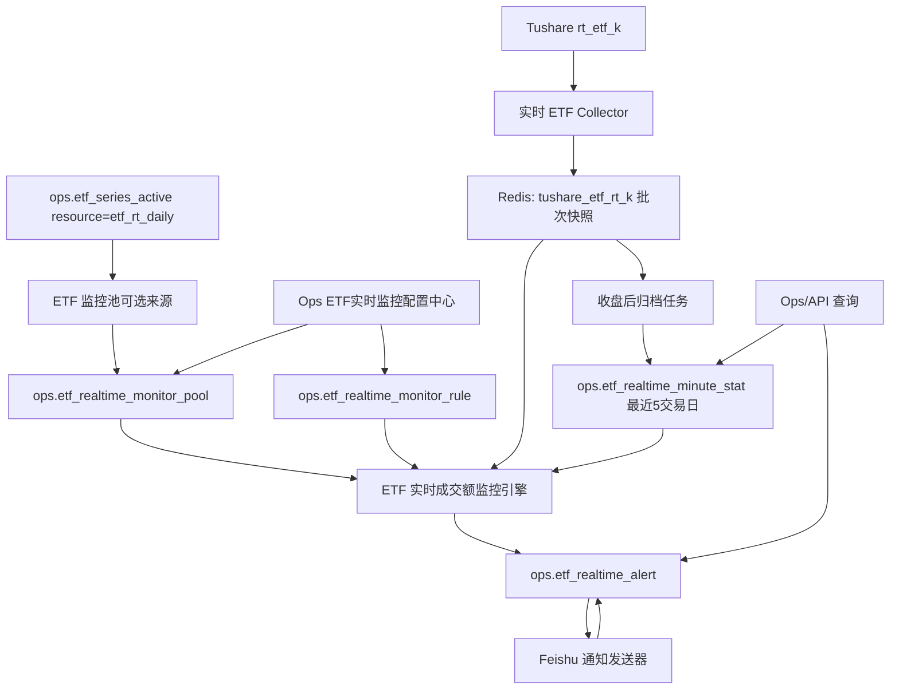
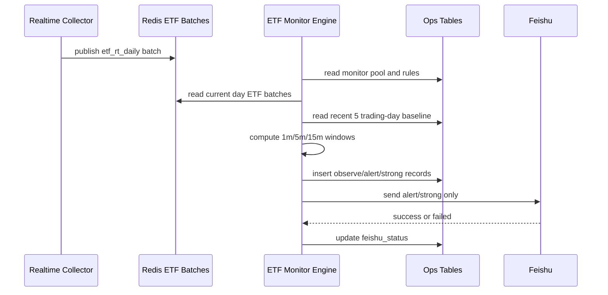
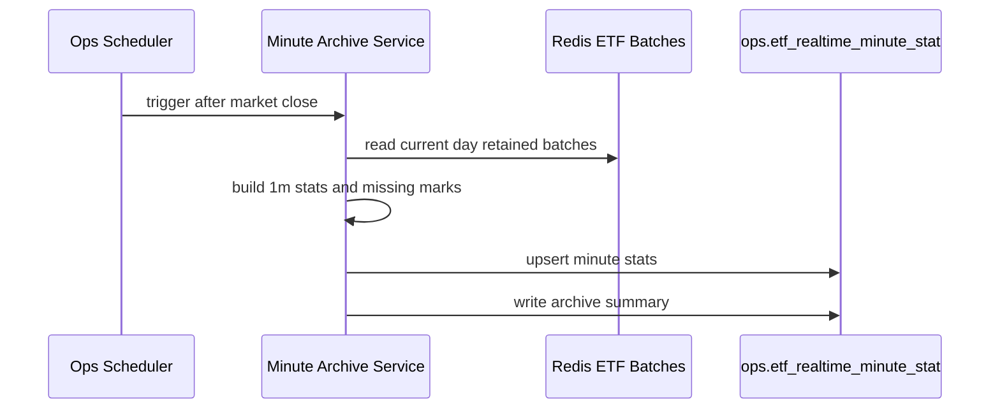

# ETF 实时成交额异动监控方案 v1

状态：M8.1/M8.2/M8.3 本地代码与测试完成 / 待重新部署验收；M9 ETF 规模展示与展示排序退场本地代码与测试完成，待重新部署和页面验收
创建日期：2026-08-22
适用范围：ETF 实时日线 Redis 批次、ETF 监控池、成交额异动判断、Feishu 通知、Ops 配置与复盘能力
关联上位文档：

- [实时行情流架构方案 v1](/Users/congming/github/goldenshare/docs/architecture/realtime-market-data-stream-architecture-v1.html)
- [ETF 实时日线流接入方案 v1](/Users/congming/github/goldenshare/docs/architecture/realtime-etf-daily-stream-plan-v1.md)
- [ETF 活跃池设计方案 v1](/Users/congming/github/goldenshare/docs/architecture/etf-active-pool-design-plan-v1.md)
- [ETF 活跃池低层设计 LLD v1](/Users/congming/github/goldenshare/docs/architecture/etf-active-pool-low-level-design-v1.md)
- [Ops 实时流配置中心技术方案 v1](/Users/congming/github/goldenshare/docs/ops/ops-realtime-config-center-technical-plan-v1.html)
- [ETF 实时成交额异动监控 LLD v1](/Users/congming/github/goldenshare/docs/ops/ops-etf-realtime-volume-anomaly-monitor-lld-v1.md)

---

## 1. 背景

当前 `etf_rt_daily` 已经接入实时流主线：

```text
Tushare rt_etf_k
  -> RealtimeCollectorService
  -> Redis feed tushare_etf_rt_k
  -> Ops health / 实时流监控页
```

已有事实：

1. ETF 实时日线每轮采集保存源端全市场快照，不按业务池裁剪。
2. Redis 使用 `batch_id + current pointer` 保存批次，读取侧不会读到半新半旧批次。
3. ETF 业务认可范围由 `ops.etf_series_active(resource='etf_rt_daily')` 表达。
4. 当前实时流监控只回答“采集是否正常、当前有多少快照、活跃池命中多少”，还不负责计算成交额异动。

本方案新增的是“实时 ETF 成交额监控层”，不是新增 Tushare 数据集，也不是重做实时 ETF 源采集。

## 2.1 本轮收口状态（2026-08-22）

生产前置已完成只读复核：`etf_rt_daily.keep_recent_batches=260`，collector 已应用配置版本 `3`，休市期间状态为 `market_closed`，未发现本轮相关业务表写入。

M8.1/M8.2/M8.3 已在本地代码与测试中完成：告警先提交后通知、Feishu 结果独立回写、名称快照、单项异常隔离、真实交易日/分钟桶、午休边界、缺失不转零、最新有效快照、归档幂等，以及后端 API/前端契约测试。下一步只等待重新部署和运营验收；本轮不执行生产迁移、清理、监控池/规则/Feishu 配置或服务重启。

---

## 2. 目标

V1 目标用一句话描述：

> 从 Redis 保存的 ETF 实时批次中计算 1/5/15 分钟成交额变化，和最近 5 个交易日同一时间桶的历史基准比较；满足阈值时记录告警，并按规则发送 Feishu 通知。

具体目标：

1. 支持运营单独维护 ETF 监控池，只监控有代表性的活跃宽基 ETF 和头部主题 ETF。
2. 支持每只 ETF 单独配置阈值，允许不同 ETF case by case 调整。
3. 支持 `1m`、`5m`、`15m` 三类窗口。
4. 基准使用最近 5 个交易日同一时间桶，不使用自然日，也不使用相邻时间点环比。
5. 缺采分钟必须标记为 `missing`，不能当作 0。
6. `observe` 级别只入库复盘，不发 Feishu。
7. `alert` / `strong` 级别按规则发送 Feishu，发送失败不得影响计算。
8. 每天收盘后把 1 分钟统计值落到 PostgreSQL，作为后续历史基准与复盘数据。

---

## 3. 非目标

1. V1 不引入 Doris。当前先用 Redis 当前日数据 + PostgreSQL 历史统计表闭环。
2. V1 不监控所有 ETF，只监控运营维护的 ETF 监控池。
3. V1 不改变 `rt_etf_k` provider、Redis snapshot key、collector systemd 服务数量。
4. V1 不进入 `DatasetDefinition`、TaskRun、freshness、date audit。
5. V1 不把 Feishu webhook、token 等密钥放入数据库或前端。
6. V1 不做机器学习异常检测，只做可解释的历史同期倍数判断。
7. V1 不做面向普通用户的行情功能；若后续要面向用户开放接口，需要单独确认权限、限流和产品呈现。

---

## 4. 总体架构



说人话：

1. Redis 负责保存实时源端快照。
2. 监控池决定“看哪些 ETF”。
3. 规则表决定“多大算异动、发不发通知”。
4. 监控引擎负责计算、判级、去重。
5. 告警表负责复盘和通知结果。
6. 每天收盘后把当天 1 分钟统计值落库，第二天开始可以作为历史基准。

---

## 5. 数据来源与计算事实

### 5.1 源字段

ETF 实时源接口 `rt_etf_k` 的本地 source 文档已确认：

| 字段 | 含义 | 单位 |
|---|---|---|
| `ts_code` | ETF 代码 | - |
| `trade_time` | 源端交易时间 | - |
| `vol` | 成交量 | 股 |
| `amount` | 成交金额 | 元 |

V1 在监控层统一使用：

```text
amount_yuan
```

硬规则：

1. 计算、入库、API、页面统一使用“元”。
2. 禁止页面自己把 `amount` 换算成万元、亿元后再参与逻辑判断。
3. 页面展示可以格式化为“亿”，但 API 与数据库字段必须保留 `amount_yuan` 语义。

### 5.2 Redis 保留策略

当前 `etf_rt_daily` 默认只保留最近 3 批，无法覆盖全天实时计算。

V1 需要通过实时流配置中心把：

```text
etf_rt_daily.keep_recent_batches = 260
```

说明：

1. 交易时段约 240 分钟。
2. 采集间隔为 60 秒。
3. 260 批可以覆盖全天，并给网络抖动留出余量。
4. TTL 继续使用 72 小时。
5. 这只是实时监控运行依赖，不等于把 Redis 当历史库。

容量估算基于已观测的 `etf_rt_daily` 批次：

| 项 | 估算 |
|---|---:|
| 单批 ETF 快照数 | 约 2300 |
| 单批 snapshot/index/meta | 约 1.9 MB |
| 260 批 snapshot/index/meta | 约 500 MB |
| 加 Redis stream 与分配器余量 | 建议按 0.6-0.7 GB 预算 |

验收时必须复测 Redis 内存，不允许只按估算上线。

---

## 6. 监控池

### 6.1 监控对象

监控池不是 ETF 活跃池本身。

```text
ops.etf_series_active(resource='etf_rt_daily')
  -> 可选 ETF 范围

ops.etf_realtime_monitor_pool
  -> 实际监控 ETF 范围
```

运营只关注两类 ETF：

1. 成交活跃、有代表性的宽基 ETF。
2. 成交额较大的头部主题 ETF。

所以监控池必须单独维护，不能默认把 1395 只活跃 ETF 全部纳入告警。

### 6.2 Ops 页面

新增独立页面：

```text
ETF实时监控配置中心
```

菜单位置：

```text
实时流监控
  实时流配置中心
  ETF实时监控配置中心
```

页面核心能力：

1. 从当前激活 ETF 列表中选择 ETF 加入监控池。
2. 激活 ETF 选择列表每页 50 条。
3. 支持按 ETF 名称关键字搜索。
4. 列表字段至少包括：代码、名称、交易所、ETF 类型、上市日期、上市状态。
5. 支持监控池 ETF 的启用、停用、分组、排序；页面不提供备注输入。
6. V1 不做批量导入，不做审批流。

### 6.3 页面设计原则

本页面是正式运营后台页面，不是 showcase，也不是解释型 demo。设计必须遵循现有数据运营后台视觉与组件规范：

1. 使用现有 Mantine 与共享组件体系：`PageHeader`、`SectionCard`、`FilterBar`、`TableShell`、`OpsTable`、`StatCard`、`EmptyState`、`Badge`、`Alert`、`Drawer`。
2. 视觉风格沿用运营后台当前基线：中性灰、深蓝、低阴影或无阴影、明确边框、统一字号和间距；禁止引入新的渐变、玻璃拟态、展板式大标题或与后台不一致的色彩语言。
3. 只读展示和编辑动作必须分开。主页面负责看清当前事实，新增、编辑、校验、提交放到抽屉或弹窗里完成。
4. 页面少写解释性长文案。信息通过标题、筛选项、表格列、状态标签和空态提示表达。
5. 页面层级固定为“监控池 / 阈值规则 / 告警记录”三类工作任务，不用“Feed 目录”这类容易混淆颗粒度的名称。
6. 数值、状态、频率、窗口、告警等级使用统一标签或数字展示规则；同一表格内不要出现有的靠左、有的靠右的混乱对齐。
7. ETF 选择器必须来自当前激活 ETF 列表，分页 50 条，支持关键词搜索，并在翻页或筛选时保留上一页数据，避免页面闪烁。
8. 必须覆盖加载、空、错误、正常、提交成功、提交失败、版本冲突等状态；错误只影响当前区块，不让整个页面不可用。

页面交互应让运营一眼知道三件事：

1. 现在监控哪些 ETF。
2. 每只 ETF 使用什么阈值规则。
3. 最近触发了哪些异动，以及 Feishu 是否真的发送成功。

### 6.4 ETF 规模展示（M9）

本节只解决“添加 ETF 抽屉”和“已添加 ETF 列表”如何展示与排序 ETF 规模；不改变实时采集、成交额计算、监控池写入或告警规则。

#### 规模事实与时间口径

唯一来源是已接入的数据集 `etf_share_size`：

```text
raw_tushare.etf_share_size
  -> core_serving.etf_share_size（只读 view）
```

Ops 查询实现直接使用 foundation 的 `RawEtfShareSize` 模型读取 raw 事实。每次列表请求先确定该表的**全局最新 `trade_date`**，两张列表都只关联这一天的同一份全市场快照：

| API 字段 | 来源列 | 单位 | 说明 |
| --- | --- | --- | --- |
| `size_trade_date` | `trade_date` | 日期 | 本次规模快照的统一截至日 |
| `total_share_wan` | `total_share` | 万份 | ETF 总份额 |
| `total_size_wan` | `total_size` | 万元 | ETF 总规模 |

硬规则：

1. 不按单只 ETF 回退到旧日期。某只 ETF 在全局最新快照中没有规模值时，API 返回 `null`，页面显示 `—`；不能把旧规模伪装成最新规模。
2. 缺失规模不是 0，不参与数值换算；排序一律 `NULLS LAST`。
3. 页面只格式化展示，不换算后回传、不自行拼接最新日期、不自行排序。总份额可显示为“万份/亿份”，总规模可显示为“万元/亿元”，但 API 与数据库字段始终保留原始单位语义。
4. 截至 2026-08-22 的生产只读核验：最新规模日为 `2026-08-21`；`etf_rt_daily` 活跃池 1,395 只 ETF 全部有该日记录，`total_share` 全部非空，`total_size` 有 1,360 只非空、35 只为空。空规模样本均保留为源端缺值，不做补值。

#### 两处列表行为

**添加 ETF 抽屉**

1. `GET /active-etfs` 返回总份额、总规模和规模截至日；默认按 `total_size_wan DESC NULLS LAST, ts_code ASC` 排序后分页。
2. 抽屉表格新增“总份额”“总规模”两列；现有关键词搜索仍仅搜索代码与名称，搜索结果保持同一规模排序。
3. 抽屉继续使用加宽布局，不在抽屉内增加横向滚动；新列不改变既定的名称主显示、代码次显示、行内添加和添加后继续操作规则。

**已添加 ETF 列表**

1. `GET /pool` 返回同一组规模字段，并在主表新增“总份额”“总规模”两列。
2. “ETF 类别”在本页面固定指运营维护的监控分组 `group_key`（当前为 `broad_base` 宽基 ETF、`theme` 主题 ETF），不是 `etf_basic.etf_type` 的源端分类字段。
3. 先按既定监控分组顺序（宽基 ETF、主题 ETF）排列；每个分组内按 `total_size_wan DESC NULLS LAST` 排列；相同规模时按 `ts_code ASC` 稳定排序。
4. `display_order` 已从监控池页面、API、ORM 和数据库结构完整退场；旧请求携带该字段必须被拒绝，不能静默忽略。

#### API 与边界

不新增 endpoint、不新增表、不做迁移、不触发 Tushare 请求。仅扩展现有只读响应：

```text
GET /api/v1/ops/realtime/etf-monitor/active-etfs
GET /api/v1/ops/realtime/etf-monitor/pool
```

两个 item 都增加：

```json
{
  "size_trade_date": "2026-08-21",
  "total_share_wan": "2348148.770000",
  "total_size_wan": "10996615.504800"
}
```

数值以 decimal 字符串返回，保留精度与单位；前端 TypeScript 使用 `string | null`。规模快照暂时不可用时，列表仍正常返回，只是这三个字段均为 `null`，不能因此阻断监控池管理。

M9 实现状态：查询已落在 `src/ops/services/etf_realtime_monitor_pool_service.py`，响应契约在 `src/ops/schemas/etf_realtime_monitor.py` 与 `frontend/src/shared/api/etf-realtime-monitor-types.ts`，页面在 `frontend/src/pages/ops-etf-realtime-monitor-config-page.tsx`。本地已验证规模关联、排序、空值展示和现有行内添加流程；待部署后由运营进行页面验收。

---

## 7. 异动判断口径

### 7.1 时间窗口

支持三个窗口：

| 窗口 | 说明 |
|---|---|
| `1m` | 单个 1 分钟成交额变化 |
| `5m` | 最近一个完整 5 分钟桶成交额合计 |
| `15m` | 最近一个完整 15 分钟桶成交额合计 |

窗口必须按交易时间桶聚合：

| 窗口 | 示例桶 |
|---|---|
| `1m` | `09:31`、`09:32` |
| `5m` | `09:35`、`09:40` |
| `15m` | `09:45`、`10:00` |

硬规则：

1. 午休不能跨窗。
2. 上午最后一个桶到 `11:30` 结束。
3. 下午重新从 `13:00` 开始切桶。
4. 未闭合窗口不计算告警。
5. `trade_time` 不在当前窗口内的 ETF 行，不能强行塞进当前窗口。

### 7.2 分钟成交额计算

`rt_etf_k.amount` 是当日累计成交金额。

1 分钟成交额应按差分计算：

```text
amount_delta_yuan = 当前分钟累计 amount_yuan - 上一分钟累计 amount_yuan
```

如果上一分钟缺采、当前分钟缺采、源端时间异常或差分为负，则该分钟标记为 `missing` 或 `invalid`，不能当作 0。

5 分钟与 15 分钟成交额从 1 分钟统计聚合：

```text
5m_amount_yuan = sum(5 个 1m amount_delta_yuan)
15m_amount_yuan = sum(15 个 1m amount_delta_yuan)
```

如果窗口内任意 1 分钟是 `missing`，该窗口默认不触发告警，只记录数据质量问题。

### 7.3 历史基准

历史基准使用最近 5 个交易日同一时间桶。

例如当前判断：

```text
ETF: 510300.SH
窗口: 5m
当前桶: 10:15
```

基准取：

```text
最近 5 个交易日中，每天 10:15 这个 5m 桶的成交额
```

不使用：

1. 最近 5 个自然日。
2. 前一个 5 分钟桶。
3. 当日开盘后的平均值。

原因：

1. 开盘、收盘天然成交密集，和临近窗口比容易误报。
2. 午休前后、尾盘集合阶段也有固定时段特征。
3. 历史同期更适合判断“这个时点是否异常放量”。

### 7.4 基准可用性

建议 V1 规则：

1. 最近 5 个交易日中至少有 3 个可用基准样本，才计算异动。
2. 可用样本必须是同 ETF、同窗口、同时间桶，且 `data_quality='ok'`。
3. 基准不足时不发 Feishu，只记录 `baseline_insufficient`。
4. 历史基准取平均值作为 V1 主口径。

---

## 8. 告警分级与阈值

### 8.1 分级

V1 使用三档：

| 等级 | 用途 | 是否发 Feishu |
|---|---|---|
| `observe` | 观察记录，方便复盘 | 否 |
| `alert` | 普通提醒 | 是 |
| `strong` | 强提醒 | 是 |

`observe` 必须入库。它的价值是帮助后续回看阈值是否太松或太严。

### 8.2 初始阈值

阈值最终由运营配置。V1 默认阈值已拍板如下：

| 等级 | 建议倍数 |
|---|---:|
| `observe` | 当前窗口成交额 >= 历史同期均值 `2.0` 倍 |
| `alert` | 当前窗口成交额 >= 历史同期均值 `3.0` 倍 |
| `strong` | 当前窗口成交额 >= 历史同期均值 `5.0` 倍 |

说明：

1. 不设置统一绝对成交额底线，因为 ETF 间成交额差异很大。
2. 阈值必须支持单只 ETF 级别覆盖。
3. 后续可根据 `observe` 入库记录复盘调整。
4. 默认阈值不通过 Alembic 迁移自动写库；规则页提供显式“创建默认全局规则”动作，运营确认后再创建 1m/5m/15m 三条全局规则。

### 8.3 阈值优先级

同一个 ETF、同一个窗口，规则按以下优先级生效：

```text
ETF 专属规则 > 分组规则 > 全局默认规则
```

示例：

```text
510300.SH 有 ETF 专属 5m 规则 -> 用 ETF 专属规则
510300.SH 没有 ETF 专属 15m 规则，但属于 broad_base -> 用 broad_base 分组 15m 规则
如果分组也没有 -> 用 global 15m 规则
```

---

## 9. 冷却与升级

### 9.1 冷却

同一 ETF、同一窗口、同一规则，在冷却期内只发一次 Feishu。

默认冷却期已拍板：

```text
cooldown_minutes = 15
```

冷却键建议：

```text
trade_date + ts_code + window_minutes + rule_id
```

### 9.2 升级

冷却期内允许从 `alert` 升级到 `strong` 再发一次。

示例：

1. `10:15` 达到 `alert`，已发 Feishu。
2. `10:20` 仍在冷却期，但达到 `strong`。
3. 系统允许再发一条强提醒。

反过来不允许降级重复提醒：

1. 已发 `strong`。
2. 冷却期内又达到 `alert`。
3. 不再发送。

---

## 10. Feishu 通知

### 10.1 非阻塞原则

Feishu 通知失败不得影响：

1. Redis 实时采集。
2. 成交额计算。
3. 告警记录入库。
4. 后续 ETF 的计算与通知。

建议流程：

```text
计算出 alert/strong
  -> 写 ops.etf_realtime_alert
  -> 提交事务
  -> 尝试发送 Feishu
  -> 成功/失败状态回写 alert 表
```

如果 Feishu 失败：

1. 记录 `feishu_status='failed'` 和错误摘要。
2. 可进行有限重试。
3. 不回滚告警记录。
4. 不阻塞下一轮计算。

### 10.2 通知内容

Feishu 内容建议包含：

1. ETF 代码与名称。
2. 所属监控分组。
3. 窗口：`1m/5m/15m`。
4. 当前窗口成交额。
5. 最近 5 个交易日同期平均成交额。
6. 当前倍数。
7. 告警等级。
8. 触发时间桶。
9. 当前阈值来源：ETF 专属、分组、全局。

---

## 11. 数据表设计

V1 建议新增 4 张表，全部放在 `ops` schema。

### 11.1 `ops.etf_realtime_monitor_pool`

用途：ETF 实时监控池。决定“哪些 ETF 需要监控”。

建议字段：

| 字段 | 类型 | 说明 |
|---|---|---|
| `id` | bigserial | 主键 |
| `ts_code` | varchar(16) | ETF 代码，唯一 |
| `group_key` | varchar(64) | 分组 key，例如 `broad_base`、`theme` |
| `group_name` | varchar(64) | 分组中文名 |
| `enabled` | boolean | 是否启用监控 |
| `note` | text | 后端保留字段；V1 页面不展示、不提交 |
| `created_by_user_id` | bigint | 创建人 |
| `updated_by_user_id` | bigint | 更新人 |
| `created_at` | timestamptz | 创建时间 |
| `updated_at` | timestamptz | 更新时间 |

约束与索引：

```text
unique(ts_code)
index(group_key, enabled)
```

硬规则：

1. `ts_code` 必须存在于 `ops.etf_series_active(resource='etf_rt_daily')`。
2. 删除监控池 ETF 不删除历史统计和历史告警。
3. 停用 ETF 后不再计算新告警，但历史记录保留。

### 11.2 `ops.etf_realtime_monitor_rule`

用途：阈值规则。决定“多大算异动，是否通知”。

建议字段：

| 字段 | 类型 | 说明 |
|---|---|---|
| `id` | bigserial | 主键 |
| `scope_type` | varchar(16) | `global`、`group`、`etf` |
| `scope_key` | varchar(64) | `global` 使用 `__GLOBAL__`，分组用 `group_key`，ETF 用 `ts_code` |
| `window_minutes` | smallint | 只允许 `1`、`5`、`15` |
| `observe_ratio` | numeric(10,4) | 观察阈值倍数 |
| `alert_ratio` | numeric(10,4) | 普通提醒阈值倍数 |
| `strong_ratio` | numeric(10,4) | 强提醒阈值倍数 |
| `cooldown_minutes` | integer | 冷却分钟数 |
| `feishu_enabled` | boolean | 是否发送 Feishu |
| `enabled` | boolean | 规则是否启用 |
| `created_by_user_id` | bigint | 创建人 |
| `updated_by_user_id` | bigint | 更新人 |
| `created_at` | timestamptz | 创建时间 |
| `updated_at` | timestamptz | 更新时间 |

约束与索引：

```text
unique(scope_type, scope_key, window_minutes)
check(window_minutes in (1, 5, 15))
check(0 < observe_ratio <= alert_ratio <= strong_ratio)
check(cooldown_minutes > 0)
```

硬规则：

1. ETF 级规则的 `scope_key` 必须是监控池内 ETF。
2. 分组级规则的 `scope_key` 必须是监控池中存在的分组。
3. 全局规则每个窗口最多一条。
4. 阈值读取 DB，使用 60 秒短缓存，配置变更 1 分钟内生效。

### 11.3 `ops.etf_realtime_minute_stat`

用途：保存收盘后归档的 1 分钟统计值，作为历史基准与复盘依据。

建议字段：

| 字段 | 类型 | 说明 |
|---|---|---|
| `trade_date` | date | 交易日 |
| `minute_bucket` | time | 1 分钟桶结束时间，例如 `09:31:00` |
| `ts_code` | varchar(16) | ETF 代码 |
| `source_trade_time` | timestamptz | 源端交易时间 |
| `source_batch_id` | varchar(64) | 当前批次 |
| `previous_batch_id` | varchar(64) | 上一分钟参考批次 |
| `cumulative_amount_yuan` | numeric(24,4) | 当前累计成交金额，元 |
| `amount_delta_yuan` | numeric(24,4) | 本分钟成交金额，元 |
| `cumulative_vol` | numeric(24,4) | 当前累计成交量 |
| `vol_delta` | numeric(24,4) | 本分钟成交量 |
| `data_quality` | varchar(16) | `ok`、`missing`、`invalid` |
| `missing_reason` | varchar(128) | 缺失原因 |
| `created_at` | timestamptz | 创建时间 |

主键：

```text
(trade_date, minute_bucket, ts_code)
```

索引：

```text
index(ts_code, trade_date)
index(trade_date, minute_bucket)
```

硬规则：

1. 只保存 1 分钟统计值。
2. 5m/15m 基准从 1m 统计聚合，不新增 5m/15m 物理表。
3. `missing` 记录要入库，不能缺行伪装成 0。
4. 对外展示或计算必须明确区分 `ok` 与 `missing`。

### 11.4 `ops.etf_realtime_alert`

用途：保存异动判断与通知结果，支持复盘。

建议字段：

| 字段 | 类型 | 说明 |
|---|---|---|
| `id` | bigserial | 主键 |
| `trade_date` | date | 交易日 |
| `triggered_at` | timestamptz | 触发时间 |
| `bucket_end_time` | time | 当前窗口结束时间 |
| `window_minutes` | smallint | `1`、`5`、`15` |
| `ts_code` | varchar(16) | ETF 代码 |
| `etf_name` | varchar(128) | ETF 名称快照 |
| `group_key` | varchar(64) | 分组 key 快照 |
| `group_name` | varchar(64) | 分组名快照 |
| `rule_id` | bigint | 命中的规则 |
| `severity` | varchar(16) | `observe`、`alert`、`strong` |
| `current_amount_yuan` | numeric(24,4) | 当前窗口成交额 |
| `baseline_amount_yuan` | numeric(24,4) | 历史同期基准 |
| `ratio` | numeric(12,4) | 当前 / 基准 |
| `baseline_trade_dates_json` | jsonb | 参与基准的交易日 |
| `cooldown_key` | varchar(256) | 冷却去重 key |
| `feishu_status` | varchar(16) | `skipped`、`pending`、`success`、`failed` |
| `feishu_message_id` | varchar(128) | Feishu 返回消息 ID |
| `feishu_error` | text | 失败摘要 |
| `notified_at` | timestamptz | 实际通知成功时间 |
| `created_at` | timestamptz | 创建时间 |

索引：

```text
index(trade_date, ts_code, window_minutes)
index(triggered_at)
index(severity, triggered_at)
index(cooldown_key, triggered_at)
```

说明：

1. `observe` 入库，`feishu_status='skipped'`。
2. `alert` / `strong` 入库后再尝试 Feishu。
3. Feishu 失败记录为 `failed`，不删除告警。
4. 同一冷却期内重复事件由服务层判断，不依赖唯一键硬拦死升级场景。

---

## 12. 服务划分

建议新增服务职责如下。

### 12.1 `EtfRealtimeMonitorPoolService`

归属：`src/ops/services/**`

职责：

1. 维护监控池。
2. 从 `ops.etf_series_active(resource='etf_rt_daily')` 查询可选 ETF。
3. 提供分页、搜索、增删改查。
4. 校验新增 ETF 必须在实时 ETF 活跃池中。

### 12.2 `EtfRealtimeMonitorRuleService`

归属：`src/ops/services/**`

职责：

1. 维护阈值规则。
2. 校验 ETF、分组、窗口、阈值顺序、冷却期。
3. 提供 60 秒短缓存读取能力。
4. 对监控引擎提供“某 ETF 某窗口的最终生效规则”。

### 12.3 `EtfRealtimeVolumeMonitorEngine`

归属：`src/foundation/realtime/**` 或 `src/ops/services/**` 需开发前最终确认。

建议原则：

1. 读取 Redis 批次、计算时间桶、处理数据质量，这部分更接近 realtime foundation 能力。
2. 读取监控池、规则、写告警、Feishu 通知，这部分属于 ops 能力。
3. 不允许 `foundation` import `ops` ORM 或 Ops service。

因此 V1 更推荐拆成两层：

```text
foundation.realtime.etf_volume_metrics
  -> 只负责从 Redis batch 推导成交额指标

ops.services.etf_realtime_monitor_service
  -> 读取监控池与规则，调用指标计算，写 alert，触发通知
```

### 12.4 `EtfRealtimeMinuteArchiveService`

归属：`src/ops/services/**`

职责：

1. 收盘后读取当天 Redis 批次。
2. 生成所有监控池 ETF 的 1 分钟统计。
3. 写入 `ops.etf_realtime_minute_stat`。
4. 记录 `missing`，不伪造 0。

### 12.5 `EtfRealtimeFeishuAlertService`

归属：`src/ops/services/**`。

职责：

1. 读取 ETF 告警专用 Feishu webhook 配置。
2. 发送 `alert` / `strong` 通知。
3. 失败时返回结构化错误，不抛出影响主计算。
4. 不在前端、DB 明文展示 webhook。

当前代码中已有 `FeishuTaskNotificationService`，它服务于 TaskRun 完成通知。ETF 异动告警可以复用签名、超时、错误解析等经验，但不能直接把 ETF 告警塞进任务完成通知服务，避免把两类消息的启停、模板、失败语义混在一起。

Feishu 通道口径已拍板：

1. ETF 告警使用新建 Feishu 机器人通道，不复用 TaskRun 完成通知通道。
2. V1 新增 ETF 专用部署级 env，例如 `ETF_REALTIME_ALERT_FEISHU_WEBHOOK_URL`。
3. `ETF_REALTIME_ALERT_FEISHU_WEBHOOK_SECRET` 允许为空；为空时不生成签名，按无签名 webhook 发送。
4. 是否发送仍由规则表 `feishu_enabled` 控制；secret 不进入数据库或前端。

---

## 13. API 设计

### 13.1 监控池 API

```http
GET /api/v1/ops/realtime/etf-monitor/active-etfs?page=1&page_size=50&keyword=沪深300
GET /api/v1/ops/realtime/etf-monitor/pool?page=1&page_size=50&keyword=沪深300&enabled=true
POST /api/v1/ops/realtime/etf-monitor/pool
PUT /api/v1/ops/realtime/etf-monitor/pool/{id}
DELETE /api/v1/ops/realtime/etf-monitor/pool/{id}
```

`active-etfs` 只读来源：

```text
ops.etf_series_active(resource='etf_rt_daily')
  + core_serving.etf_basic
  + raw_tushare.etf_share_size（全局最新 trade_date 快照）
```

`pool` 在现有监控池、ETF 基础信息、告警摘要关联基础上，也关联同一份最新规模快照。两条 API 不请求 Tushare、不读取 Redis、不写任何数据。

新增监控池请求示例：

```json
{
  "ts_code": "510300.SH",
  "group_key": "broad_base",
  "group_name": "宽基ETF",
  "enabled": true,
  "note": "沪深300代表ETF"
}
```

### 13.2 阈值规则 API

```http
GET /api/v1/ops/realtime/etf-monitor/rules
POST /api/v1/ops/realtime/etf-monitor/rules
PUT /api/v1/ops/realtime/etf-monitor/rules/{id}
DELETE /api/v1/ops/realtime/etf-monitor/rules/{id}
```

规则请求示例：

```json
{
  "scope_type": "etf",
  "scope_key": "510300.SH",
  "window_minutes": 5,
  "observe_ratio": 2.0,
  "alert_ratio": 3.0,
  "strong_ratio": 5.0,
  "cooldown_minutes": 15,
  "feishu_enabled": true,
  "enabled": true
}
```

### 13.3 告警查询 API

```http
GET /api/v1/ops/realtime/etf-monitor/alerts?trade_date=2026-08-22&severity=alert
GET /api/v1/ops/realtime/etf-monitor/alerts/{id}
```

V1 先提供 Ops API。若后续要给其它业务系统调用，再设计独立业务 API 和权限边界。

---

## 14. 前端页面设计

页面名称：

```text
ETF实时监控配置中心
```

建议分为三个区域：

1. 监控池：维护 ETF 监控名单。
2. 阈值规则：维护全局、分组、ETF 专属阈值。
3. 告警记录：查看 `observe/alert/strong` 结果与 Feishu 发送状态。

页面结构：

```text
ETF实时监控配置中心
  顶部：页面标题、刷新、跳转实时流监控
  Tab 1：监控池
    统计卡：监控 ETF 数、启用数、停用数、今日告警数
    筛选条：关键词、分组、启用状态
    表格：ETF 代码、名称、分组、启用状态、阈值覆盖情况、最近告警、操作
    抽屉：从激活 ETF 列表选择加入监控池
  Tab 2：阈值规则
    筛选条：规则层级、窗口、启用状态
    表格：层级、对象、窗口、observe/alert/strong 倍数、冷却、Feishu、操作
    抽屉：新增或编辑规则
  Tab 3：告警记录
    筛选条：日期、等级、ETF、Feishu 状态
    表格：时间、ETF、窗口、当前成交额、基准、倍数、等级、通知状态
    抽屉：告警详情与基准样本
```

交互原则：

1. 不把实时流源采集配置和成交额监控规则混在同一表单。
2. 监控池新增 ETF 时，从加宽的添加抽屉内的激活 ETF 列表直接行内添加；不使用横向滚动，不改变现有表格行高基线。
3. 添加抽屉必须有独立的“搜索待添加 ETF”输入框，按代码或名称请求 `/active-etfs?keyword=...`。
4. 添加列表每页 50 条，关键词变化后回到第 1 页；它不复用、也不影响监控池列表上方的关键词筛选。
5. 添加列表每行都提供名称/代码、监控分组、启用监控开关和操作按钮；名称为主信息、代码为次信息，搜索命中片段使用橙色背景高亮。
6. 点击“添加”立即提交该行，不需要底部统一保存；添加成功后按钮变为浅绿色、置灰的“已添加”，行内配置控件变为只读，抽屉不关闭，允许连续添加多只 ETF。
7. 新增和编辑交互均不展示备注输入；本轮不提交后端已有的 `note` 字段。
8. 阈值规则必须明确展示生效层级：全局、分组、ETF。
9. 告警记录必须能看出是否真的发出了 Feishu。
10. 只读态不展示校验结果和发布影响；这些只属于编辑态。
11. 监控池主表同样使用名称主显示、代码次显示；删除使用明确的浅红按钮样式，不使用无背景文字按钮。
12. 删除、停用、阈值修改都必须有明确二次确认或保存动作，不能点一下就隐式生效。

---

## 15. 配置审计

新增或调整配置必须集中登记，不能散落在页面常量、代码常量和部署 env 中各自为政。

| 配置 | 默认值 | 来源/持久化 | 作用范围 | 生效方式 | Ops 可见性 |
|---|---:|---|---|---|---|
| `etf_rt_daily.keep_recent_batches` | `260` | `foundation.realtime_runtime_config` | Redis 批次保留 | 发布后重启 collector | 实时流配置中心 |
| `ETF_REALTIME_MONITOR_RULE_CACHE_TTL_SECONDS` | `60` | 建议代码受控默认或后续配置表 | 阈值短缓存 | 进程内 60 秒刷新 | 技术方案与测试可见 |
| `ETF_REALTIME_ALERT_FEISHU_WEBHOOK_URL` | 无 | 部署 env / secret | ETF 告警 Feishu 发送 | 重启 Web/worker 生效 | 不在页面展示 |
| `ETF_REALTIME_ALERT_FEISHU_WEBHOOK_SECRET` | 空 | 部署 env / secret | ETF 告警 Feishu 签名；为空则不签名 | 重启 Web/worker 生效 | 不在页面展示 |
| 全局阈值规则 | 见 8.2 | `ops.etf_realtime_monitor_rule` | 异动判断 | 60 秒内生效 | ETF实时监控配置中心 |
| ETF 监控池 | 空 | `ops.etf_realtime_monitor_pool` | 监控范围 | 60 秒内生效 | ETF实时监控配置中心 |

说明：

1. Feishu webhook 与 secret 不进数据库。
2. ETF 告警 secret 初始可留空；为空时不签名。
3. 阈值、监控池进数据库，由 Ops 页面维护。
4. `keep_recent_batches=260` 是实时源配置，不属于阈值规则。
5. 如果后续把缓存 TTL 也做成可配置，必须先补配置中心或表设计，不允许临时加 env。

---

## 16. 运行流程

### 16.1 盘中计算流程



### 16.2 收盘归档流程



收盘归档硬规则：

1. 归档失败不删除 Redis。
2. 归档失败不影响第二天源采集。
3. 同一天重复归档必须幂等。
4. `missing` 要入库，不能丢行。

---

## 17. 测试门禁

### 17.1 后端

必须覆盖：

1. 监控池只能从 `etf_rt_daily` 活跃池选择 ETF。
2. 监控池分页 50 条、关键词搜索、增删改查。
3. 规模字段只能来自 `etf_share_size` 的全局最新交易日；不得按单 ETF 回退旧日期，不得把 `null` 写成 0。
4. 添加抽屉按总规模降序、空值末尾；已添加列表按监控分组、组内总规模降序、同规模时 ETF 代码稳定排序。
5. 两个列表 API 都透传 `size_trade_date/total_share_wan/total_size_wan`，且不请求 Tushare、Redis。
6. 阈值优先级：ETF > group > global。
7. 阈值校验：窗口只能是 `1/5/15`，倍数必须递增，冷却期必须大于 0。
8. Redis 批次不足时标记 `missing`，不当作 0。
9. 午休不跨窗。
10. 最近 5 个交易日基准，不使用自然日。
11. 基准不足时不发 Feishu。
12. `observe` 入库但不发 Feishu。
13. `alert/strong` 冷却与升级逻辑。
14. Feishu 失败不影响 alert 记录入库和下一轮计算。
15. 收盘归档幂等。

### 17.2 前端

必须覆盖：

1. 菜单出现 `ETF实时监控配置中心`。
2. 监控池页面从激活 ETF 列表选择 ETF。
3. 激活 ETF 列表每页 50 条，支持关键词搜索。
4. 阈值编辑按全局、分组、ETF 三类展示。
5. 告警记录显示 `observe/alert/strong` 和 Feishu 状态。
6. 页面不请求 Tushare，不直连 Redis。

### 17.3 生产验收

必须验证：

1. `etf_rt_daily.keep_recent_batches=260` 后 Redis 内存增长符合预算。
2. 盘中连续采集至少 30 分钟，计算没有误把缺采当 0。
3. 人工配置 1-2 只 ETF 低阈值，验证 `observe` 入库。
4. 人工配置测试 Feishu 通道，验证失败不阻塞计算。
5. 收盘后归档生成当天 1 分钟统计。

---

## 18. 开发里程碑

| Milestone | 目标 | 边界 |
|---|---|---|
| M0 | 方案评审与口径冻结 | 只改文档 |
| M1 | 建表与模型 | 新增 4 张 ops 表、迁移、ORM、基础测试 |
| M2 | 监控池 API 与页面 | 支持从 ETF 活跃池选择加入监控池 |
| M3 | 阈值规则 API 与页面 | 支持 global/group/etf 三层规则和 60 秒短缓存 |
| M4 | 成交额计算引擎 | 从 Redis 批次计算 1m/5m/15m，处理 missing |
| M5 | 告警与 Feishu | observe 入库，alert/strong 通知，冷却和升级 |
| M6 | 收盘归档 | Redis 当天批次归档到 1m 统计表 |
| M7 | Ops 告警记录页与查询 API | 支持复盘告警与通知结果 |
| M8 | 生产验收 | Redis 容量、盘中计算、Feishu、收盘归档验收 |
| M9 | ETF 规模展示与展示排序退场 | 扩展两条既有 Ops 列表 API 与监控池页面，并删除无业务意义的 `display_order` 字段及数据库列；不改数据集、实时采集、Redis 或池数据 |

---

## 19. 已拍板口径

以下口径已确认，后续开发不得再按“待决策”处理。

| 编号 | 事项 | 已确认口径 |
|---|---|---|
| D1 | 默认阈值 | `observe=2.0`，`alert=3.0`，`strong=5.0` |
| D2 | 默认冷却期 | `15` 分钟 |
| D3 | 监控池初始名单 | 初始监控池为空；功能完成后由运营在页面手工选择加入 |
| D4 | Feishu 通道 | 使用 ETF 告警专用 Feishu 机器人通道；webhook URL 放部署 env，secret 允许先留空 |
| D5 | 对外业务 API | V1 先做 Ops API；如需给其它系统调用，再单独设计业务 API |
| D6 | 监控引擎运行位置 | 挂在现有 `goldenshare-realtime-collector.service` 内，ETF batch 发布成功后触发；失败隔离，不影响采集 |
| D7 | 默认全局规则创建 | 不在迁移中自动 seed；页面提供显式“创建默认全局规则”动作 |
| D8 | 监控分组 | V1 先使用受控分组：`宽基ETF`、`主题ETF` |
| D9 | Redis Store 扩展 | 必须扩展 `RealtimeStateStore`，禁止服务层临时拼 Redis key |
| D10 | Feishu 失败重试 | V1 不做后台重试队列；本轮即时发送一次，失败入库 |
| D11 | ETF 规模展示来源 | 只取 `etf_share_size` 全局最新交易日；不做单 ETF 历史回退，空规模展示 `—` 并排在末尾 |
| D12 | 监控池规模排序 | “ETF 类别”指监控分组 `group_key`；宽基、主题依次展示，组内按总规模降序、ETF 代码稳定排序；不保留人工展示排序 |

---

## 20. 风险

1. Redis 保留 260 批会增加内存压力，必须生产复测。
2. `trade_time` 可能存在源端旧时间，监控池应优先选择活跃 ETF，并在计算中识别 stale/missing。
3. ETF 成交额差异很大，统一阈值只能作为默认值，后续必须依赖 ETF 级规则调参。
4. Feishu 通知如果没有独立超时和失败隔离，会拖慢实时计算，开发时必须强制隔离。
5. 收盘归档如果漏跑，会影响第二天基准，必须有归档状态检查。
6. `etf_share_size.total_size` 当前对部分 QDII ETF 为空；M9 必须原样展示为空，不能以旧日期或 0 掩盖源端缺失。
