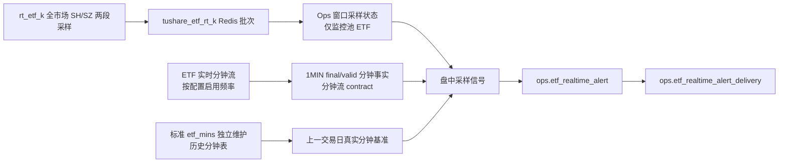

# ETF 实时成交额异动监控方案 v1

状态：下游监控设计基线，待 ETF 实时分钟流和标准 `etf_mins` 数据集能力完成后开发。现有“批次差额当分钟成交额”的实现已废止，不得继续用于监控、历史写入或基准。

创建日期：2026-08-22
最近修订：2026-08-24
适用范围：ETF 实时采样信号、标准历史分钟的只读消费、异动规则、Feishu 通知、Ops 配置与复盘。
详细编码依据：[ETF 实时成交额异动监控 LLD v1](/Users/congming/github/goldenshare/docs/ops/ops-etf-realtime-volume-anomaly-monitor-lld-v1.md)
上游接入事实源：[ETF 实时分钟流接入方案 v1](/Users/congming/github/goldenshare/docs/architecture/realtime-etf-minute-stream-plan-v1.md) 与 [ETF 实时分钟流接入 LLD v1](/Users/congming/github/goldenshare/docs/architecture/realtime-etf-minute-stream-low-level-design-v1.md)。本文不再重复定义 ETF 分钟源的 API 名、频率范围、请求分片、闭合延迟、Redis feed 或配置中心字段。

## 1. 目标与边界

目标是在交易时段内，对运营维护的 ETF 监控池识别成交额异常放量；盘中信号要足够敏感，收盘后的历史事实必须准确、可复盘。

本方案只覆盖：

1. `rt_etf_k` 全市场累计快照的可配高频采样。
2. 消费 ETF 实时分钟流已发布的 `1MIN` 最终分钟事实和标准 `etf_mins` 独立维护的历史分钟表，形成监控基准。
3. `1/5/15` 分钟窗口的单 ETF 规则、告警和 Feishu 通知。
4. 只读取标准数据集已独立同步的真实分钟事实，供下一个交易日比较。

本方案不做：

1. 不新增面向普通用户的 ETF 实时行情 API。
2. 不进入 `DatasetDefinition`、TaskRun、freshness 或 date audit。
3. 不改变 `rt_etf_k` 的全市场源端请求范围。
4. 不把 Feishu 密钥写入数据库、Redis、页面或仓库。
5. 不在本轮引入 Doris、WebSocket 或机器学习判定。

## 2. 上游事实与下游消费契约

### 2.1 两个源的职责

| 源 | 本方案的消费方式 | 禁止用途 |
|---|---|---|
| `rt_etf_k` | 全市场日内累计 `amount/vol` 的高频采样，用于盘中提前信号 | 伪造真实 1 分钟成交额；写入历史分钟基准 |
| ETF 实时分钟流与标准 `etf_mins` 历史表 | 只消费该流标记为 `final` 且 `quality=valid` 的 `1MIN` 分钟事实，以及标准数据集独立同步的历史分钟表，用于历史基准和窗口最终确认 | 绕过 realtime/state/history contract 直接请求 Tushare；使用未最终确定的行作为基准 |

`rt_etf_k.amount` 是随采样时刻增长的当日累计成交额；这一事实已由 2026-08-24 下午盘样本验证。ETF 实时分钟流的源端 API 名、`time` 是否形成中、闭合延迟、多代码容量、源端限速归属和启用频率，由上游接入方案的 M0 实测单独冻结。

### 2.2 下游硬门禁

监控和告警代码开始前，上游 ETF 实时分钟流与标准 `etf_mins` 数据集必须至少完成：

1. M0 真实 HTTP 行为验证与记录落档。
2. `etf_rt_min` 配置对象、按频率独立 Redis feed 和 health 契约设计冻结。
3. 面向下游的 `1MIN final/valid` 分钟事实契约明确：每行至少包含 `ts_code`、`freq`、`source_time`、`amount`、`received_at`、质量与批次身份。
4. 标准历史表的 `etf_mins` writer contract 已冻结；监控只读，不参与历史同步、缺口补数或写入。

未满足这些门禁时，本文只能设计监控业务语义，不能固定 collector 延迟、代码分批大小、源端 API 常量或分钟最终值判断。

## 3. 当前目标架构



1. `rt_etf_k` 继续保留源端全市场 Redis 批次事实和健康观测。
2. 监控计算只读取当前批次中已启用监控池 ETF，并保存轻量窗口状态；不扫描全天 260 个全市场批次。
3. ETF 分钟流的代码池、分片与频率选择由其独立配置与 collector 决定；本方案只从已发布的 `1MIN final/valid` 事实中按自身监控池筛选计算对象。监控池增删不会改变上游请求范围。
4. 真实分钟历史只来自标准 `etf_mins` 数据集独立同步的历史表，从不使用 `rt_etf_k` 差额替代。
5. 所有监控、通知失败都必须与实时采集、历史数据集同步和 Redis current pointer 隔离。

## 4. 量化规则

### 4.1 逻辑窗口

窗口只支持 `1/5/15` 分钟，按交易时段切分，不跨午休。普通连续竞价中：

```text
1m:  [10:00:00, 10:01:00)
5m:  [10:00:00, 10:05:00)
15m: [10:00:00, 10:15:00)
```

分钟事实的结束标签与窗口对应：`10:01` 表示 `[10:00,10:01)`；`10:05` 表示 5 分钟窗口 `[10:00,10:05)` 的结束。`09:30` 的特殊口径必须等待 M0 验证后冻结。

### 4.2 当前日采样值

对每个 `(trade_date, ts_code, window_minutes, window_end, rule_id)`：

```text
anchor = 窗口开始后第一条有效 rt_etf_k 快照
current = 当前窗口内最新有效 rt_etf_k 快照

sampled_amount = current.cumulative_amount - anchor.cumulative_amount
elapsed_seconds = current.captured_at - anchor.captured_at
```

`captured_at` 是 collector 收到该源端行的服务端时间，必须按沪市、深市请求段分别记录；`source_trade_time` 仅作源端新鲜度和排查信息，不能参与采样间隔或窗口进度计算。

`sampled_amount` 的含义是“从本窗口第一条有效采样到当前”的观察成交额。它不等于从窗口整点开始的完整成交额，因而是保守值，不能写入历史分钟表。

### 4.3 昨日同期预期曲线

基准日是**当前交易日前一个开市交易日**，由 `TradeCalendarDAO.get_latest_open_date("SSE", trade_date - 1 day)` 确定。它不是最近 5 日均值，也不回退到更早日期。

令昨天同一窗口的真实 1 分钟金额为 `b1 ... bn`。构造按秒累计的 `F_y(position)`：

1. 已完整经过的分钟，直接累加其真实 `amount_yuan`。
2. 只对观察区间首尾落在分钟内部的部分，按该分钟已过秒数比例分摊。
3. 任一所需昨天分钟为 `missing/invalid`，或基准日不存在完整窗口，则 `baseline_unavailable`，不产生告警。

```text
expected_amount = F_y(current.captured_at) - F_y(anchor.captured_at)
pace_ratio = sampled_amount / expected_amount
window_ratio = sampled_amount / baseline_window_amount
```

这不是保存昨天的 `rt_etf_k` 秒级采样。昨天只保存 ETF 分钟流中 `final/valid` 的 `1MIN` 分钟金额；近似仅发生在窗口首尾不足一分钟的秒数，完整分钟仍沿用昨天真实的分钟成交节奏。

### 4.4 判级

每条规则独立配置下列参数：

| 参数 | 含义 |
|---|---|
| `min_signal_elapsed_seconds` | 至少观察多久才允许盘中判定 |
| `observe_pace_ratio` | 速度比阈值 |
| `alert_window_ratio` | 已观察金额相对昨天完整窗口金额的普通提醒阈值 |
| `strong_window_ratio` | 已观察金额相对昨天完整窗口金额的强提醒阈值 |
| `cooldown_minutes` | 跨连续窗口的通知冷却期 |

判定顺序：

1. 至少两条有效采样，且 `elapsed_seconds >= min_signal_elapsed_seconds`，才允许盘中判定。
2. `pace_ratio >= observe_pace_ratio` 产生 `observe`，只入库不发 Feishu。
3. `window_ratio >= alert_window_ratio` 产生 `alert`，允许 Feishu。
4. `window_ratio >= strong_window_ratio` 产生 `strong`，允许 Feishu。
5. 窗口结束后，以 ETF 分钟流的 `1MIN final/valid` 事实更新同一事件的最终值；只允许升级，不得因重复计算重发同级通知。

例如，昨天 5 分钟总额为 `10,000` 元，今天早段 `sampled_amount=8,000` 元。若相对昨天同一推进位置的 `expected_amount` 明显偏高，则先产生 `observe`；当观察金额达到 `10,000` 元时可能触发 `alert`，达到 `50,000` 元时可能触发 `strong`。具体倍数必须按 ETF、窗口、规则配置，不能写统一绝对金额门槛。

### 4.5 数据质量

下列情况不计算、不按 0 处理：

1. 窗口内没有锚点或不足两条有效采样。
2. 累计 `amount` 下降、无法解析、代码不匹配。
3. 相邻有效采样间隔大于 `2 * rt_etf_k.poll_interval_seconds`。
4. 跨午休、跨交易日，或 `captured_at` 不属于当前逻辑窗口。
5. 昨日完整窗口缺任意真实分钟事实。

采样中断后必须丢弃旧锚点，以新采样重新建锚；禁止跨中断做累计差。

## 5. 告警、通知和历史读取

### 5.1 去重与升级

事件键固定为：

```text
trade_date + ts_code + window_end_time + window_minutes + rule_id
```

同一事件只有一条事件事实，保存最高严重度和最新测量值。事件内：

1. `observe -> alert -> strong` 可以升级。
2. 同等级不会重复发送。
3. `alert/strong` 的每次真实 Feishu 发送单独保存为 delivery 记录。

跨连续窗口的冷却键为：

```text
ts_code + window_minutes + rule_id
```

冷却期内相同或更低级别的通知只记录事件、不发送；更高严重度仍允许发送。

### 5.2 标准历史分钟读取

监控读取 ETF 实时分钟流 final facts 进行盘中窗口闭合复核；下一交易日基准只读标准 `etf_mins` 历史分钟表：

1. 缺失或无效分钟不按 0 处理，也不参与基准。
2. 监控不得写入历史分钟表、缺口记录或补数任务。
3. `rt_etf_k` 的 batch、累计值和差额不得进入任何历史分钟表。

## 6. 配置与容量

`etf_rt_daily.poll_interval_seconds` 是 `rt_etf_k` 的运营可配采样间隔，允许整数 `1..60` 秒。

全市场 `rt_etf_k` 每轮必须执行 SH、SZ 两段源端请求，最小请求预算是：

```text
required_calls_per_minute = 2 * ceil(60 / poll_interval_seconds)
```

| 间隔 | 最小请求数/分钟 |
|---:|---:|
| 60 秒 | 2 |
| 30 秒 | 4 |
| 10 秒 | 12 |
| 5 秒 | 24 |
| 1 秒 | 120 |

发布校验必须拒绝 `max_calls_per_minute < required_calls_per_minute`，并要求运行时不并发重叠同一 feed 周期。采集耗时超过间隔时，collector 记录滞后并跳过重叠调度；监控把对应窗口标为 `missing`，不能用旧快照冒充新采样。

ETF 分钟流是独立 realtime feed group：运营可在实时流配置中心选择 `1MIN/5MIN/15MIN/30MIN/60MIN` 中实际启用的频率。源端 API、`topic` 规则、请求批大小、调度时点、闭合延迟和限速校验必须以上游接入方案的 M0 结果为准；监控主链只消费其中的 `1MIN final/valid` 事实。

`keep_recent_batches=260` 不再是 `rt_etf_k` 监控算法的依赖；全市场批次留存只服务快照/健康。历史分钟由独立 `etf_mins` 数据集维护。

## 7. 切换、数据重建与页面

现有 `ops.etf_realtime_minute_stat` 的差额记录、`ops.etf_realtime_monitor_rule` 的 5 日均值阈值、以及旧 `ops.etf_realtime_alert` 的字段都不具备新语义，不能自动映射。

切换顺序：

1. 先完成 ETF 实时分钟流方案的 M0 实测，再完成该分钟流接入的基础代码和测试。
2. 获得运营对三张旧语义表清理的单独确认：删除 `minute_stat`，重建 `monitor_rule` 与 `alert`。监控池表保留。
3. 迁移重建后，运营重新录入新规则；不得复用旧 `observe_ratio/alert_ratio/strong_ratio`。
4. 先确认上一开市交易日已由标准 `etf_mins` 数据集同步出完整分钟事实；监控不告警。
5. 随后的交易日起，以前一开市交易日为基准启用告警。

现有“ETF 实时监控配置中心”的监控池与规模展示继续保留；其待添加 ETF 列表在重构后应来源于 `ops.etf_series_active(resource='etf_rt_min')`，但新增、停用或删除监控项只影响下游计算对象，绝不写入或裁剪上游 source 活跃池。规则表单、告警列表和详情必须改为新规则字段、事件状态和 delivery 历史。页面不自行计算基准、窗口或告警状态。

## 8. 开发顺序与验收

| 阶段 | 目标 | 门禁 |
|---|---|---|
| S0 | ETF 实时分钟流 M0 源端验证 | 未完成不得固定 API、频率调度、finality 或分批参数 |
| S1 | ETF 分钟流配置、provider、per-frequency Redis feed、health 与页面接入 | 上游最终分钟事实 contract 可供消费 |
| M1 | `rt_etf_k` 段级 `captured_at`、窗口状态与纯计算 | foundation 不依赖 ops |
| M2 | 真实分钟与上一开市日基准读取 | 只读取 `1MIN final/valid` 和标准 `etf_mins` 历史表，不写差额分钟值 |
| M3 | 盘中信号、事件/投递模型、Feishu 升级 | 告警先提交，发送后回写 |
| M4 | CLI 编排、规则/API/页面契约改造 | 不新增 systemd 服务 |
| M5 | 迁移、部署、首日采集、次日告警验收 | 清表须单独批准 |

必须覆盖：分钟源参数差异、两段采样请求预算、段级 `captured_at`、窗口首尾曲线计算、午休、采样中断、昨日基准缺失、同窗口升级、冷却、Feishu 失败隔离、历史分钟只读消费和首日无基准。

## 9. 当前未决事项

1. ETF 实时分钟流 M0 还未确认真实 HTTP API 名、`09:30` 边界、分钟 finality、五频率闭合延迟、多代码上限与 ETF/股票分钟限速归属。
2. 旧语义 `minute_stat`、规则和告警表的清理重建尚未获得单独授权。
3. 新规则的初始参数可建议为 `observe_pace_ratio=3.0`、`alert_window_ratio=1.0`、`strong_window_ratio=5.0`，以及 `1m/5m/15m` 最少观察 `10/30/60` 秒；这些只是页面填写参考，不能自动 seed。
