# 指数日线完整性闭环与激活池服务能力收口 LLD v2

状态：已实现，待生产只读验收
对应方案：[指数日线完整性闭环与激活池服务能力收口方案 v2](/Users/congming/github/goldenshare/docs/ops/ops-index-daily-completeness-reconciliation-plan-v2.md)
历史基线：[指数日线完整性补漏 LLD v1](/Users/congming/github/goldenshare/docs/ops/ops-index-daily-completeness-repair-lld-v1.md)
创建日期：2026-07-15

---

## 1. 实现目标与边界

本 LLD 只实现两件事：

1. 当 `index_daily` 当日同步后仍有缺口时，在受控窗口内重复审计，并允许下一个开市日只对前一开市日补漏。
2. 运营能看见激活池指数的源站供数状态；未证明连续供数的候选不能加入 `resource='index_daily'` 激活池。

不做：

1. 不改 `DatasetDefinition`、planner、request builder、writer、DAO、业务表或 ingestion 事务。
2. 不改 `index_daily_raw` 请求池语义：默认请求仍从 `index_daily_raw` 读取，显式 `ts_code` 仍只处理指定代码。
3. 不新增数据库表、Alembic、环境变量、Ops 配置表、worker 或 systemd unit。
4. 不自动删除激活池代码，不删除 raw 或 serving 历史数据。
5. 不扫描前一开市日之前的历史日期，不引入历史补数模式。

所有新增实现都在 `src/ops/**`。它们只读 raw/serving/日历，或写 `ops.task_run`、`ops.dataset_date_completeness_run` 和既有 `ops.index_series_active`；不会回滚、阻塞或污染业务数据事务。

---

## 2. 已审计的现状

### 2.1 当前写入与完整性事实

`index_daily` 的执行链路已核验如下：

```mermaid
flowchart LR
  A["index_daily.maintain TaskRun"] --> B["unit planner\n默认 index_daily_raw 请求池"]
  B --> C["Tushare index_daily"]
  C --> D["writer 全量 upsert raw_tushare.index_daily"]
  D --> E["writer 按 ops.index_series_active\nresource=index_daily 过滤"]
  E --> F["upsert core_serving.index_daily_serving"]
  F --> G["TaskRun success"]
  G --> H["completion worker 创建首次\n日期对象矩阵审计"]
  H --> I["date-completeness worker\n计算 active - serving 差集"]
  I --> J["现有 repair service\n创建系统补漏 TaskRun"]
```



实现位置：

| 事实 | 当前代码位置 | 本轮处理 |
| --- | --- | --- |
| 默认请求池 | `src/foundation/ingestion/unit_planner.py::_resolve_index_codes()` | 不改。 |
| raw 全量写入和 serving 激活池门禁 | `src/foundation/ingestion/writer.py::_write_index_daily_serving()` | 不改。 |
| 首次当日审计 | `src/ops/services/task_run_completion_service.py::create_index_daily_completion_audit_run()` | 保持只由普通成功维护任务触发。 |
| 审计完成后的即时补漏 | `src/ops/services/date_completeness_audit_service.py::DateCompletenessAuditWorker.run_next()` | 保留入口，改为消费统一分类结果。 |
| 系统补漏 TaskRun | `src/ops/services/index_daily_completeness_repair_service.py` | 允许 `T/P`，按统一分类筛选代码。 |
| scheduler 主入口 | `src/ops/runtime/scheduler.py::OperationsScheduler.run_once()` | 追加受控再审计编排。 |

### 2.2 当前根因

现有 `IndexDailyCompletenessRepairService` 只能处理“本地当天”的失败审计；补漏 TaskRun 成功后又被 completion worker 明确排除，不会再创建审计。因此源站在次日才补齐数据时，没有任何机制重新发现和补齐。

现有激活池页面只看 serving 日/周/月最新日期；加入候选只校验 `index_basic` 存在。它无法判断某个指数是否已经连续从源站取得日线。

---

## 3. 固定策略与唯一来源

新增文件：`src/ops/services/index_daily_reconciliation_policy.py`。

该文件是本专题唯一策略来源。其它 service、query、API、前端和测试不得复制时间窗口、重试上限或连续供数门槛。

| 常量/值对象 | 固定值 | 使用方 |
| --- | --- | --- |
| 本地时区 | `Asia/Shanghai` | reconciliation、资格判断。 |
| 当日 `T` 窗口 | `17:45–22:30`，间隔 30 分钟 | reconciliation service。 |
| 前一开市日 `P` 窗口 | `09:00–16:30`，间隔 30 分钟 | reconciliation service。 |
| 源站延迟容忍 | 最近 3 个开市日 | source serviceability service。 |
| 自动补漏上限 | 单 code、单目标日最多 3 个已终态补漏 TaskRun | source serviceability service。 |
| 每轮补漏批次 | 100 code/TaskRun，最多 20 个 TaskRun | repair service。 |
| 新候选连续供数 | 最近已结束开市日及之前连续 3 个开市日均有 raw | review command/query。 |

实现采用不可变值对象 `IndexDailyReconciliationWindow(start_time, end_time, interval)` 和模块级常量；不读 env，不写数据库，不让页面传这些值。

### 3.1 时间判定

1. `T` 只在“本地今天是开市日且当前时间位于当日窗口”时成立。
2. `P` 只在“本地今天是开市日且当前时间位于前一开市日窗口”时成立；从 `TradeCalendar` 查询小于 `T` 的最近开市日。
3. 周末、节假日不产生任何自动目标日期。
4. `now` 统一由调用方传入；省略时才取当前 UTC 时间后转换为 `Asia/Shanghai`，以保证测试可精确验证边界。

---

## 4. 统一的源站服务能力分类

新增文件：`src/ops/services/index_daily_source_serviceability_service.py`。

### 4.1 内部模型

```python
@dataclass(frozen=True)
class IndexDailyGapClassification:
    ts_code: str
    target_trade_date: date
    latest_raw_trade_date: date | None
    raw_has_target_trade_date: bool
    terminal_repair_attempt_count: int
    internal_status: str
    public_serviceability_status: str
    automatic_repair_eligible: bool


@dataclass(frozen=True)
class IndexDailyActivationEligibility:
    ts_code: str
    reference_trade_date: date | None
    latest_raw_trade_date: date | None
    eligible: bool
    message: str
```

`internal_status` 只在 ops service 内部使用。页面不接触 `serving_projection_gap` 或 `source_retry_exhausted`。

### 4.2 分类输入

每次分类只读取当前事实，不写副本：

1. `ops.index_series_active`：`resource='index_daily'` 的期望代码。
2. `core_serving.index_daily_serving`：目标日已进入服务层的代码。
3. `raw_tushare.index_daily`：目标日是否已到、每个代码 raw 最新业务日。
4. `core_serving.trade_calendar`：目标日及其之前最近 3 个开市日。
5. `ops.task_run`：同一目标日、同一 code 已结束的系统补漏 TaskRun 数量。

`ops.task_run.filters_json.ts_code` 当前是逗号分隔字符串。实现必须复用 `split_multi_values()`，逐条解析，并只计入同时满足以下条件的 TaskRun：

1. `task_type='dataset_action'`、`resource_key='index_daily'`、`action='maintain'`。
2. `request_payload_json.run_scope='index_daily_gap_repair'`。
3. `time_input_json.mode='point'` 且 `trade_date` 等于目标日。
4. `status in ('success', 'partial_success', 'failed', 'canceled')`。

只读查询先按资源、动作、状态收窄，再在 Python 解析 JSON；不依赖数据库方言 JSON 运算符，保证现有 SQLite 测试与 PostgreSQL 生产的一致性。

### 4.3 分类规则

分类顺序固定如下：

| 内部状态 | 判定 | public `source_serviceability_status` | 自动动作 |
| --- | --- | --- | --- |
| `serving_projection_gap` | raw 已有目标日，serving 缺目标日 | `ready` | 本轮失败审计可创建一次标准补漏 TaskRun。 |
| `source_delayed` | raw 缺目标日，且 `latest_raw_trade_date` 位于目标日及之前最近 3 个开市日内，且终态补漏数小于 3 | `source_delayed` | 可创建标准补漏 TaskRun；可驱动下一次受控审计。 |
| `source_retry_exhausted` | 仍满足近期延迟，但终态补漏数已达 3 | `serviceability_review_required` | 不创建 TaskRun，不再驱动再审计。 |
| `serviceability_review_required` | raw 从未有记录、raw 最新日早于允许窗口，或 raw 已出现更晚日期却跳过目标日 | `serviceability_review_required` | 不创建 TaskRun，不再驱动再审计。 |

说明：

1. `serving_projection_gap` 说明源站数据已经到达，但服务层未覆盖；它不是源站延迟。页面会同时显示“缺日线”和“源站正常”，方便区分写入投影问题与源站问题。
2. 本期 scheduler 的继续再审计条件只看仍可重试的 `source_delayed`。如果只剩 `serving_projection_gap`，不会形成无限重试循环；它保留在日期审计缺口和页面数据状态中，供后续针对写入链路排查。
3. `source_retry_exhausted` 只是不再自动请求，不代表数据完整；日期审计仍会失败，运营可据此决定是否移出激活池。

### 4.4 新候选资格

候选资格不使用今天，避免当天源站尚未产出时误判：

1. 参考日取本地当前日期之前最近一个开市日。
2. 读取该参考日及之前连续 3 个开市日。
3. `raw_tushare.index_daily` 中必须同时存在这 3 个 `(ts_code, trade_date)` 行。
4. 满足返回 `eligible=True`；否则返回 `eligible=False` 和后端生成的中文 `message`。
5. `POST /ops/review/index/active` 必须再次调用同一资格方法，不能仅依赖浏览器禁用按钮。

---

## 5. 受控再审计编排

新增文件：`src/ops/services/index_daily_completeness_reconciliation_service.py`。

### 5.1 服务接口

```python
class IndexDailyCompletenessReconciliationService:
    def enqueue_due_audits(
        self,
        session: Session,
        *,
        now: datetime | None = None,
    ) -> list[DatasetDateCompletenessRun]:
        ...
```

该服务只创建 `ops.dataset_date_completeness_run`。它不请求 Tushare、不写 raw/serving、不创建 TaskRun、不更新 active pool。

`src/ops/runtime/scheduler.py::OperationsScheduler.run_once()` 在现有“普通自动任务 -> 日期审计 schedule -> probe”执行完后调用该服务。原有三者的先后和返回值保持不变；该服务返回的 audit run 不加入 scheduler 的 `list[TaskRun]` 返回值，和现有日期审计 schedule 的行为一致。

### 5.2 目标日选择

```text
本地今天不是开市日                     -> []
09:00 <= 当前时间 <= 16:30             -> [P]
17:45 <= 当前时间 <= 22:30             -> [T]
其它时间                                -> []
```

`P` 只能是 `T` 之前最近一个开市日。不会计算 `P-1`，不会处理自然日周末或节假日。

### 5.3 某个目标日的入队条件

按下面顺序检查，任一项不满足即跳过：

1. 目标日位于当前策略窗口。
2. 存在 `dataset_key='index_daily'`、`audit_scope='date_subject_matrix'`、同日范围的最新审计，且 `run_status='succeeded'`、`result_status='failed'`。
3. 不存在同日 `queued/running` 审计。
4. 不存在同日 `queued/running/canceling` 的 `index_daily_gap_repair` TaskRun。
5. 最新失败审计的 `finished_at` 距当前时间不少于该窗口 30 分钟间隔。
6. 统一分类结果中至少有一个 `source_delayed` 且 `automatic_repair_eligible=True` 的代码。

通过后调用 `DateCompletenessRunCommandService.create_system_run()` 创建单日审计。为可测试性，该方法新增仅内部调用的可选 `now` 参数；缺省时保持原有当前时间行为。该参数只决定 `requested_at`，不改变审计范围或 public API。

### 5.4 事务与失败语义

1. reconciliation service 的每次创建只提交一条 Ops 审计 run。
2. 创建失败只记录 scheduler 日志并回滚本次 Ops session 状态；不会影响任何已经提交的 raw/serving 数据。
3. date-completeness worker 已有 try/except 继续包裹 repair 创建；本轮保留这一隔离语义。
4. completion worker 保持“补漏 TaskRun 成功不立即创建新审计”的规则，避免任务完成瞬间绕开时间窗口。下一轮是否审计完全由 scheduler 决定。

---

## 6. 补漏服务改动

修改文件：`src/ops/services/index_daily_completeness_repair_service.py`。

### 6.1 保留的 TaskRun 契约

每个补漏 TaskRun 仍是标准维护意图：

```json
{
  "task_type": "dataset_action",
  "resource_key": "index_daily",
  "action": "maintain",
  "trigger_source": "system",
  "time_input": {
    "mode": "point",
    "trade_date": "2026-07-14"
  },
  "filters": {
    "ts_code": "000001.SH,399001.SZ"
  },
  "request_payload": {
    "run_scope": "index_daily_gap_repair",
    "source_date_completeness_run_id": 48,
    "repair_trade_date": "2026-07-14",
    "missing_code_count": 77,
    "batch_index": 1,
    "batch_size": 77
  }
}
```

Ops 只传标准时间意图和代码筛选；`DatasetActionResolver`、unit planner、request builder 仍负责生成源接口请求参数。

### 6.2 具体改动

1. 现有 `missing_codes()` 改为委托 source serviceability service 的 serving 差集查询，避免修复服务和审查中心各自维护差集 SQL。
2. `_eligible_trade_date()` 不再比较“目标日必须等于今天”；改为调用 policy 的 `T/P` 允许日期判断，且仍要求失败的单日 `date_subject_matrix` 审计和开市日。
3. `create_repair_task_runs()` 只选取 `automatic_repair_eligible=True` 的分类结果。批大小和最多 20 个 TaskRun 不变。
4. `_pending_repair_codes()` 保留，继续排除尚在队列或运行中的同日代码；它与“已终态重试次数”是两个不同事实，不能互相替代。
5. 批次 payload 继续保留既有字段；不新增执行路由、兼容标记或源端参数。

---

## 7. 审查中心 API 与页面

不新增路由，只扩展既有激活池接口。

### 7.1 `GET /api/v1/ops/review/index/active`

新增 query 参数：

| 参数 | 类型 | 含义 |
| --- | --- | --- |
| `source_serviceability_status` | 可选 | `ready`、`source_delayed`、`serviceability_review_required`；不传表示全部。 |

新增每行字段：

| 字段 | 类型 | 事实来源 | 页面用途 |
| --- | --- | --- | --- |
| `latest_raw_trade_date` | `date/null` | raw `max(trade_date)` | 展示最近源站日线。 |
| `source_serviceability_status` | string | 统一分类 public 状态 | 筛选和中文状态列。 |
| `source_serviceability_label` | string | 后端状态展示文案 | 页面状态标签。 |
| `source_serviceability_action` | string | 后端下一步行动文案 | 页面提示下一步。 |
| `serviceability_reference_date` | `date/null` | 后端确定的最近已结束开市日 | 页面显示“按何日判断”，不自行推断。 |
| `source_serviceability_reason` | string/null | 统一分类内部原因 | API 诊断字段；页面不展示。 |

`data_status`、`missing_layers` 和日/周/月 serving 日期保持原定义，继续回答“服务层数据是否齐全”。新增字段只回答“源站日线是否持续可获得”，两者不能互相代替。

示例：

```json
{
  "resource": "index_daily",
  "ts_code": "930604.CSI",
  "data_status": "missing_daily",
  "latest_daily_date": "2026-07-13",
  "latest_raw_trade_date": "2026-07-13",
  "source_serviceability_status": "source_delayed",
  "serviceability_reference_date": "2026-07-14",
  "source_serviceability_reason": "recent_raw_source_delay"
}
```

### 7.2 `GET /api/v1/ops/review/index/active/candidates`

新增每行字段：

| 字段 | 类型 | 含义 |
| --- | --- | --- |
| `eligible_for_activation` | boolean | 是否满足连续 3 个已结束开市日 raw 供数。 |
| `eligibility_message` | string | 后端生成的中文说明，页面直接展示。 |
| `latest_raw_trade_date` | `date/null` | 候选最新 raw 业务日。 |
| `serviceability_reference_date` | `date/null` | 本次资格判断的参考日。 |

### 7.3 `POST /api/v1/ops/review/index/active`

当 `resource='index_daily'` 时，`ReviewCenterCommandService.add_active_index()` 在既有 `index_basic` 和重复检查之后，调用统一资格服务。

未通过返回：

```json
{
  "code": "source_serviceability_not_ready",
  "message": "该指数尚未连续 3 个已结束开市日取得源站日线，请先在 raw 请求池观察后再加入激活池。"
}
```

其它 `resource` 保持现有行为，不把 `index_daily` 的源站规则扩散到周线或月线激活池。

### 7.4 页面改动

修改 `frontend/src/pages/ops-v21-review-index-page.tsx`：

1. 保留现有数据状态筛选，新增“源站服务能力”筛选；筛选值只来自 API public 状态。
2. 表格在“数据状态”之后增加“源站服务能力”列，显示“正常”“等待源站”“待审查”。
3. “最近行情”继续展示 serving 日/周/月；新增单独“最近源站日线”文本，不混淆两个日期事实。
4. 页面不展示 `source_serviceability_reason`、重试次数、SQL 或内部状态名。
5. 候选列表增加“源站资格”列。`eligible_for_activation=false` 的候选不能被选择，显示 `eligibility_message`。
6. 加入确认按钮仍有服务端硬校验；浏览器禁用只用于交互提示，不是安全边界。
7. 更新 `frontend/src/shared/api/types.ts` 的传输类型；不在页面组装 raw/serving/日历事实。

不新增统计卡，不调整移出弹窗。移出仍只删除 active pool 行，保留 raw/serving 历史。

---

## 8. 计划文件与测试映射

| 目标 | 生产代码 | 定向测试 |
| --- | --- | --- |
| 唯一策略与时间边界 | `index_daily_reconciliation_policy.py` | 新增 `tests/web/test_ops_index_daily_reconciliation.py`。 |
| raw/serving/TaskRun 分类 | `index_daily_source_serviceability_service.py` | 新增服务级分类测试。 |
| `T/P` 再审计 | `index_daily_completeness_reconciliation_service.py`、`runtime/scheduler.py` | 新增 reconciliation 测试，补 `tests/web/test_ops_runtime.py`。 |
| 标准补漏选择 | `index_daily_completeness_repair_service.py` | 扩展 `tests/web/test_ops_index_daily_completeness_repair.py`。 |
| 激活池 API/资格门禁 | query/service/schema/API | 扩展 `tests/web/test_ops_review_center_api.py`。 |
| 页面消费 | review index page、API types | 扩展 `frontend/src/pages/ops-v21-review-index-page.test.tsx`。 |
| completion worker 不回退 | 不改主逻辑 | 保留并扩展 `tests/web/test_ops_task_completion_worker.py`。 |

必须覆盖的反例：

1. `T` 窗口外、非开市日和 `P-1` 都不创建审计。
2. 已有 open 审计、open repair、间隔未到、最新审计通过时不重复创建审计。
3. raw 有目标日、近期延迟、长期缺失、无 raw、raw 跳过目标日、重试已满全部分类正确。
4. 同一 code 已被 queued/running repair 覆盖时，不重复入新 TaskRun。
5. 近期延迟最多进入 3 个已终态补漏轮次；超过后只显示待审查。
6. 活跃候选 raw 连续 3 个开市日才可加入；直接调用 POST 不能绕过页面禁用。
7. 移出激活池不删除任何 raw/serving 行。
8. `index_daily_raw` 请求池、writer 的 raw 全写和 serving active gate 回归不变。

建议验证命令：

```bash
uv run ruff check src/ops tests/web
uv run pytest -q tests/web/test_ops_index_daily_completeness_repair.py tests/web/test_ops_index_daily_reconciliation.py tests/web/test_ops_runtime.py tests/web/test_ops_task_completion_worker.py tests/web/test_ops_review_center_api.py
cd frontend && npm run test -- ops-v21-review-index-page
cd frontend && npm run typecheck
uv run pytest -q tests/architecture/test_subsystem_dependency_matrix.py
python3 scripts/check_docs_integrity.py
```

生产验收只做只读核验：确认一次 `P` 日源站迟到后被重新审计并补齐，以及一次长期无 raw 的 active code 进入“待审查”且不再重复创建 TaskRun。不得在验收中清表、删表或改动激活池。

---

## 9. 研发顺序

1. 新增 policy 与 source serviceability service，先用纯服务测试锁定分类和候选资格。
2. 改 repair service，使即时补漏和后续审计使用同一分类事实。
3. 新增 reconciliation service，接入 scheduler，补 `T/P`、窗口、间隔、open run 的回归测试。
4. 扩展 review API/schema/query/command，并先完成 API 测试。
5. 最后更新前端传输类型和页面；只消费后端返回字段。
6. 完成全量定向回归后，更新方案状态、API 文档和本文状态。

实施时不得因为本 LLD 顺手调整通用 `DateCompletenessScheduleCommandService`、probe、自动任务、DatasetDefinition 或 ingestion 链路。

---

## 10. CodeGraph 与依赖边界审计

本 LLD 编写前已执行：

1. `codegraph status`：索引为最新状态。
2. `codegraph impact IndexDailyCompletenessRepairService`：确认影响 date-completeness worker 与现有补漏测试。
3. `codegraph impact OperationsScheduler`：确认影响 scheduler 定向测试与自动任务链路。
4. `codegraph impact ReviewCenterQueryService`：确认影响 review API、active list/summary/candidates 和前端页面消费者。

边界结论：新增能力全部属于 `ops -> foundation` 的允许依赖方向；不引入 `foundation -> ops`、`ops -> biz` 或 legacy 目录依赖。当前没有需要修改依赖矩阵或架构快照的结构性边界变化。

---

## 11. 实施结果与验收状态

1. M1 至 M5 已完成：新增唯一策略、实时服务能力分类、T/P 再审计编排、补漏选择收口、审查中心 API/页面及候选加入硬校验。
2. `IndexDailyCompletenessRepairService` 只为 `serving_projection_gap` 和未达到终态次数上限的 `source_delayed` 创建标准 `index_daily.maintain` TaskRun；reconciliation scheduler 只因仍存在可补的 `source_delayed` 再创建审计。
3. `ReviewCenterQueryService` 只把后端统一事实投影为列表字段；前端不读取 raw、serving、日历或 TaskRun 后自行推断状态。
4. 已覆盖 T/P 边界、30 分钟间隔、运行中审计/补漏去重、终态次数上限、raw/serving 分类、候选连续 3 日准入、POST 硬拒绝、手动移出保留业务数据及前端禁用交互。
5. 待生产只读验收：观察一次 `P` 日源站迟到后进入下一轮审计与补漏，以及一次长期缺失代码显示“待审查”且不再循环创建补漏 TaskRun。不得为验收清表、删数据或变更激活池。
