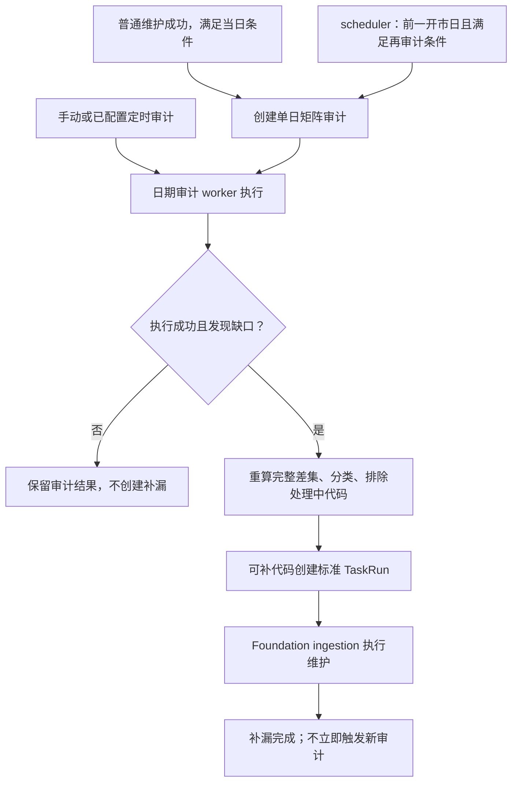

# 指数日线完整性审计、补漏与激活池说明

状态：现行机制说明；2026-09-09 按当前代码核对。原生产验收事项未在本轮独立核实，见 §7。

本文合并原补漏 v1 与闭环 v2 的方案、LLD，保留原 v2 方案路径。只解释现有行为和限制，不授权改策略、补数、改池或部署；不是重新开工的施工清单。

## 1. 判断什么，事实属于谁

`index_daily` 的完整性问题是：**当前 Serving 激活池中，应有目标日日线的指数，哪些还没有进入 Serving？**

| 事实 | 来源与用途 |
| --- | --- |
| 默认向源站请求哪些指数 | `ops.index_series_active(resource='index_daily_raw')`；显式 `ts_code` 则只取指定代码 |
| 哪些结果允许进入 Serving | `ops.index_series_active(resource='index_daily')`；与请求池不同，显式指定代码也不绕过这道门禁 |
| 目标日是否完整 | 当前 `index_daily` 激活池代码集合，减去 `core_serving.index_daily_serving` 中目标日代码集合 |
| 缺口是否值得补、候选能否加入 | `raw_tushare.index_daily`、默认交易所交易日历、既有补漏 TaskRun；按 §3–5 派生，不持久化第二份状态 |

实现入口：[对象规划](/Users/congming/github/goldenshare/src/foundation/ingestion/unit_planner.py)的 `_resolve_index_codes()`、[写入器](/Users/congming/github/goldenshare/src/foundation/ingestion/writer.py)的 `_write_index_daily_serving()`、[数据集定义](/Users/congming/github/goldenshare/src/foundation/datasets/definitions/index_series.py)的 `index_daily.completeness`。写入器先 upsert 本次归一化结果到 Raw，再按 Serving 激活池过滤并写入 Serving；不是把整张 Raw 表重新发布一次。

完整性采用 `date_subject_matrix`：expected 为 `index_daily` 激活池，actual 为目标日 Serving。指数策略与股票上市/退市生命周期策略分开；`index_daily_raw` 不进入 expected。审计明细有 `DETAIL_LIMIT=5000` 的展示预算，补漏服务必须重新计算**完整差集**，不能只取已展示的缺口样本。实现见 [矩阵审计](/Users/congming/github/goldenshare/src/ops/services/date_completeness_audit_service.py)和 [缺口分类服务](/Users/congming/github/goldenshare/src/ops/services/index_daily_source_serviceability_service.py)。

[源站探测](/Users/congming/github/goldenshare/docs/ops/ops-index-daily-remote-source-probe-plan-v1.md)的五个样本只证明可以开始同步；探测命中、TaskRun 成功、返回行数和 Raw 有数据，都不能证明 Serving 完整。

## 2. 三个入口与实际链路

1. **普通维护成功后的当日审计。** 独立 completion worker 只为普通 `index_daily.maintain`、`dataset_action`、`success`、单日 point 且目标日等于后处理时上海当天的任务创建审计；当天还须是默认交易所开市日。补漏任务、历史日期、区间、Workflow、partial_success 不走此入口。同日已有 queued/running 矩阵审计则不创建；这不是“每天永久只创建一次”的去重。细节及后处理限制归 [完成后处理说明 §3.2](/Users/congming/github/goldenshare/docs/ops/ops-task-completion-side-effect-worker-plan-v1.md#32-index_daily-完成审计)。
2. **次日受控再审计。** [reconciliation service](/Users/congming/github/goldenshare/src/ops/services/index_daily_completeness_reconciliation_service.py)由现有 scheduler 调用，只在当前开市日的早段、晚段检查前一开市日，不创建当天的周期审计，不需要新增 worker 或 systemd unit。
3. **手动／已配置的定时审计。** 继续使用现有日期审计入口。其审计结果也交给 repair service，但不绑定三个自动阶段。配置式定时审计另有自身 guard：`index_daily` 的窗口须为配置时区当天单日，且配置交易所当天开市；不能用 rolling 回退绕过休市日。见 [日期审计调度](/Users/congming/github/goldenshare/src/ops/services/date_completeness_schedule_service.py)。这条现存路径不能因清理旧晚间方案而被删掉。

日期审计 worker 只有在 `run_status=succeeded`、`result_status=failed`、`index_daily` 单日矩阵审计时才可能派生补漏；审计执行错误不等同于确认数据缺口。补漏创建时还要求上海当天开市、目标日为当天 `T` 或前一开市日 `P`，更早日期和休市日不派生补漏。这些限制也适用于手动审计之后的自动补漏；不限制普通手动维护本身可表达的历史范围。

## 3. 阶段、时间与停止条件

唯一策略来源为 [index_daily_reconciliation_policy.py](/Users/congming/github/goldenshare/src/ops/services/index_daily_reconciliation_policy.py)，是代码常量，不是 env、数据库配置或页面开关。调整须另获批准，并同步代码、测试和本文。

| 阶段／阈值 | 当前含义 |
| --- | --- |
| `same_day_initial` | 系统单日审计的目标日等于其 requested_at 的上海日期；常规入口是普通维护后的当日审计 |
| `previous_open_day_morning` | 系统审计目标日为 requested_at 所在日期的前一开市日，创建时间在上海 `09:00:00–12:00:00` |
| `previous_open_day_afternoon` | 同上，创建时间在上海 `13:30:00–16:30:00` |
| 源站延迟候选窗口 | **包含目标日**及其前两个开市日，共 3 日；不是允许迟到三个完整开市日 |
| 每次调用的入队上限 | 100 code/TaskRun，最多 20 个 TaskRun，即最多选 2,000 个可补代码；不是全日总量或并发数 |

早晚窗口含表中精确端点；12:00:01、16:30:01 已在窗口外。自动阶段只对 `run_mode=scheduled`、`requested_by_user_id=null`、`schedule_id=null` 的系统单日矩阵审计解析。其它情形返回空阶段，沿用通用补漏分支，而非直接拒绝所有补漏。

**区分两个时钟：**阶段取审计已保存的 `requested_at`，目标日期是否仍可补取 repair service 此次执行的时间。例如早段审计下午才处理，仍记早段；但若目标日已早于执行当天的 `P`，不再创建补漏。因此窗口限制的是再审计入队，不是要求所有执行在窗口内结束。

阶段完成按「代码＋目标日＋repair_slot」从既有系统补漏 TaskRun 派生：`started_at` 非空且状态为 success/partial_success/failed/canceled 即计入。旧任务无阶段、无效阶段或未领取终态不计入；这是“已领取并终结”的记录，不能据此断言批内每个代码均请求成功或写入成功。不新增重试表，也不向日期审计表增加阶段列。

**scheduler 再审计须同时满足：**

1. 当前为开市日早段／晚段，目标仅为前一开市日 `P`。
2. 该日最新单日矩阵审计执行成功、结果失败；按 requested_at、id 判断最新。没有旧审计不自动补建。
3. 没有同日 queued/running 矩阵审计，也没有同日任何阶段的 queued/running/canceling 补漏 TaskRun。
4. 实时重算后，至少一个 `source_delayed` 代码尚未消耗**当前**阶段。

每次调用最多创建一条审计。没有可补延迟代码、窗口已过、最新审计已通过或仍有处理中记录时，不入队；阶段计数不是审计次数上限。这里未检查普通主维护任务是否在运行，也没有跨进程原子去重，不能宣称“绝不与主任务重叠”或“任何并发下只创建一次”。

## 4. 补漏选择与标准 TaskRun

[分类服务](/Users/congming/github/goldenshare/src/ops/services/index_daily_source_serviceability_service.py)先重算当前 active－目标日 Serving，再查询每个缺口代码的 Raw 目标日是否存在、全历史最新日期及已完成阶段。Raw 记录只能反映本库已经取得的数据，不是实时查询源站的证明。

| 内部分类 | 判定 | repair service 的选择 |
| --- | --- | --- |
| `serving_projection_gap` | Raw 已有目标日，但 Serving 缺失 | 可以创建补漏，**不受已完成阶段过滤**；仍须满足日期、审计类型和处理中代码排除条件 |
| `source_delayed` | Raw 无目标日，最新 Raw 日位于 §3 的 3 日集合，且三个阶段未全部完成 | 有阶段时只选当前阶段未完成的代码；空阶段时不做单阶段过滤 |
| `source_retry_exhausted` | 仍属于上述近期延迟，但三个阶段全部完成 | 不创建补漏；对外显示待审查 |
| `serviceability_review_required` | 无 Raw 历史、最新日太早，或最新日已越过但跳过目标日 | 不创建补漏；仍是 Serving 缺口 |

这两层判断不能混为一谈：**投影缺口可以被失败审计交给 repair service 处理，但它自身不驱动 scheduler 再审计。**“每代码最多三个阶段”只描述带阶段的源站延迟控制，不能作为所有补漏入口的全局请求上限。手动／配置式审计不写阶段、不消耗阶段，但共用的分类仍会读取已有阶段事实；已经分类为 exhausted 的代码不会因空阶段重新入选。

[补漏服务](/Users/congming/github/goldenshare/src/ops/services/index_daily_completeness_repair_service.py)排除同日 queued/running/canceling repair 中的代码，然后按代码顺序取前 2,000 个、分批调用标准 `TaskRunCommandService.create_task_run()`。该排除是按代码，不是像 scheduler 一样阻止整个目标日；没有独立锁或批次账本。

任务意图保持：`task_type=dataset_action`、`resource_key=index_daily`、`action=maintain`、`trigger_source=system`、用户和 schedule 均为空；`time_input={mode: point, trade_date: 目标日}`、`filters.ts_code` 为本批逗号分隔代码。payload 保存：

- `run_scope=index_daily_gap_repair`、`source_date_completeness_run_id`、`repair_trade_date`。
- `missing_code_count` 为重算后的**全部缺口数**，不是可补数或本批大小；`batch_index` 从 1 起，`batch_size` 为本批代码数。
- 仅解析到阶段时才有 `repair_slot`；不使用旧方案的 `source_run_id/source_gap_id`。

Ops 只创建意图，由 Foundation resolver／planner／request builder／writer 执行维护；投影缺口也走标准维护，不是 Ops 直接复制 Raw 到 Serving。[任务查询](/Users/congming/github/goldenshare/src/ops/queries/task_run_query_service.py)根据 system＋run_scope 派生“系统补漏”，页面只展示后端 label，不自行解读 payload。通用任务字段归 [TaskRun 契约](/Users/congming/github/goldenshare/docs/ops/ops-task-run-observability-redesign-plan-v1.md)和 [API 参考](/Users/congming/github/goldenshare/docs/ops/ops-api-reference-v1.md)。

## 5. 审查中心与人工改池

页面为 `/ops/v21/review/index`。接口字段及入参归 [API 参考 §8](/Users/congming/github/goldenshare/docs/ops/ops-api-reference-v1.md#8-review-center-接口)；当前消费链是 [review API](/Users/congming/github/goldenshare/src/ops/api/review_center.py) → [query](/Users/congming/github/goldenshare/src/ops/queries/review_center_query_service.py)／[command](/Users/congming/github/goldenshare/src/ops/services/review_center_service.py) → [页面](/Users/congming/github/goldenshare/frontend/src/pages/ops-v21-review-index-page.tsx)。本专题的资格与服务能力扩展只针对 `resource=index_daily`，其它资源不套用这道门槛。

**候选准入：**参考日固定为上海本地今天之前最近一个开市日，即使今天已经收盘也不改用今天。该日及此前两个开市日均有 Raw 日线，才满足连续 3 日资格；日历不足或缺记录均不合格。候选先从 index_basic 中排除已在指定池的代码；POST 再检查代码存在、未重复和资格，不合格返回 422／`source_serviceability_not_ready`。页面禁用不合格候选的选择按钮，不能代替后端校验。加入只写池记录，不同时触发补数；“先在 Raw 请求池观察”是运营建议，不是自动加池动作。

**现有 active 状态：**以同一参考日计算。该日有 Serving 缺口时使用 §4 分类；没有缺口时依据最新 Raw 日期是否达到参考日判断 ready。因此“正常”不等于每次都重新通过候选连续 3 日门槛。无参考日显示待审查。公开状态为 ready／source_delayed／serviceability_review_required；内部投影缺口映射 ready，exhausted 映射待审查。

`source_serviceability_reason` 返回内部原因值，例如延迟时为 `source_delayed`，不是旧示例的 `recent_raw_source_delay`。API 可以包含内部原因；页面不展示原因枚举，只消费中文 label、行动建议、Raw 最新日期和参考日。列表先计算 active 服务能力、再过滤分页，不是只对当前页做分类。

页面的 `data_status=complete` 只表示日／周／月 Serving **各自有记录**，不证明目标日已齐。因此某代码缺目标日日线，仍可能显示行情“完整”；应结合日期审计核对，不能承诺页面一定显示“缺日线”。“等待源站”的行动文案也不是某个任务已入队的凭证，实际仍受 §3 限制。

系统不自动移出激活池。运营确认移出后，只删除对应 `ops.index_series_active` 行，不删除 Raw 或 Serving 历史；下一次审计按新的池重算，旧审计不会追溯改写。文档治理不授权任何改池或数据删除。

## 6. 失败与闭环的现存限制

- **补漏成功不立即再审计。** completion 排除 repair；scheduler 又只在 §3 条件下入队。如果实际数据已补齐、只剩投影缺口或阶段已经耗尽，不一定再生成最终审计。因此可能保留旧的失败审计，不能把本机制写成“每次补漏都有最新通过结果”。是否增加最终确认审计需独立设计和授权。
- **不是批量原子入队。** 标准 TaskRun 创建逐个提交；后面一批失败时，前面已提交的任务仍在。[日期审计 worker](/Users/congming/github/goldenshare/src/ops/services/date_completeness_audit_service.py)对派生补漏捕获异常、rollback 未提交状态并记录日志，不改已提交审计结果；后续处理须重算差集并排除已有任务，不能假定整轮都回滚。
- **scheduler 没有这里承诺过的异常隔离。** [run_once()](/Users/congming/github/goldenshare/src/ops/runtime/scheduler.py)依次执行普通 schedule、日期审计 schedule、probe、指数再审计，返回值只含普通及 probe TaskRun。再审计异常会向外传播，[CLI 循环](/Users/congming/github/goldenshare/src/cli_parts/ops_handlers.py)也未捕获；不能写成“只记日志，循环必定继续”。已提交 Raw／Serving 不因该异常回滚，与 scheduler 可用性是两回事。
- **状态收敛不是重试机会回收。** [TaskRun 收敛服务](/Users/congming/github/goldenshare/src/ops/services/operations_task_run_reconciliation_service.py)按活动时间戳判断 running 超过 10 分钟、canceling 超过 3 分钟的陈旧记录，分别收敛为 failed／canceled，不处理 queued。带阶段且已领取的终态仍会计入阶段；不能因排队太久伪造领取或消耗机会。

以上是已核对的限制，不是新增允许模式或本轮代码整改任务。仍遵守 Ops 观测不得回滚已提交业务数据的边界，不新增业务表、执行器、配置、部署单元或依赖方向。

## 7. 验收、历史证据与维护入口

**正确验收是集合覆盖：**在同一只读事实时点核对 active 代码和目标日 Serving，列出 active－Serving 差集，差集为空才完整。两边数量相等可能代码不同；Serving 多出已退出池的历史代码也不意味着不完整。同步成功、Raw 行数、探测日志或页面日／周／月存在状态均不能代替此判定。

尚需独立核实的原生产事项：一次当日未齐、次日早／晚段补齐的事实，以及一次长期缺失展示待审查、不继续由本机制创建补漏的事实。应关联原审计、目标日、代码、TaskRun 阶段和最终物理差集；存在 §6 的最终审计缺口时如实记录，不能以 TaskRun 成功自动结案。本轮未查生产、不认定仍未部署，也没有为验收清表、改池或触发任务。

必要历史证据（仅代表原记录当时）：

- 2026-06-25 v1 建立矩阵审计、完整差集补漏、异步后处理和“系统补漏”展示。旧晚间周期方案及其生产 schedule 配置待办，不再作为当前推荐部署单。
- 2026-07-14 原生产记录：TaskRun #5362 后缺 344 个 active 代码；人工维护降至 77 个；#5399 返回 0 行后未出现新审计。930604.CSI 次日可取得前日数据，另有 Raw 最新日早于 2026-07-06 的长期缺失代码。它们说明为何区分短期延迟和待审查，不是今天的数量或源站状态。
- 2026-07-15 v2 及其后续实施记录改为当日／次日早段／次日晚段的命名阶段，避免按总终态次数在晚间耗尽机会；原文仍保留生产验收事项。旧全文可从合并前提交 `378ed9f6` 追溯，不留平行历史文档。

后续改代码时按影响选择已有回归，不因阅读本文自动运行数据库或生产任务：

| 覆盖点 | 已有测试入口 |
| --- | --- |
| 完整性定义、矩阵与股票边界 | `tests/test_dataset_definition_registry.py`、`tests/test_date_completeness_audit_service.py`、`tests/web/test_ops_date_completeness_api.py` |
| 分类、阶段与候选资格 | `tests/web/test_ops_index_daily_source_serviceability.py` |
| 全差集、批次、排除处理中代码、日期／空阶段／审计创建时间 | `tests/web/test_ops_index_daily_completeness_repair.py` |
| 窗口、休市、投影缺口不自循环及 scheduler 装配 | `tests/web/test_ops_index_daily_reconciliation.py`、`tests/web/test_ops_runtime.py` |
| completion 排除补漏、任务 label、CLI | `tests/web/test_ops_task_completion_worker.py`、`tests/web/test_ops_task_run_api.py`、`tests/test_cli_ops_runtime.py` |
| 人工加入／移出、服务能力展示 | `tests/web/test_ops_review_center_api.py`、`frontend/src/pages/ops-v21-review-index-page.test.tsx` |
| 审计与任务页消费 | `frontend/src/pages/ops-v21-dataset-audit-page.test.tsx`、`frontend/src/pages/ops-v21-task-records-tab.test.tsx`、`frontend/src/pages/ops-task-detail-page.test.tsx` |

本轮只做代码／测试定义静态核对、链接／引用及文档完整性检查，不把测试文件存在或文档检查通过当成运行验收。使用已有环境，不自动安装或同步依赖；数据库测试须先确认隔离。字段／API 变更应核对上述全部消费者，不能只改页面或本文。合并去向与八项纠偏见 [治理记录](/Users/congming/github/goldenshare/docs/governance/docs-information-architecture-v1.md#ops-index-completeness-consolidation-20260909)。
