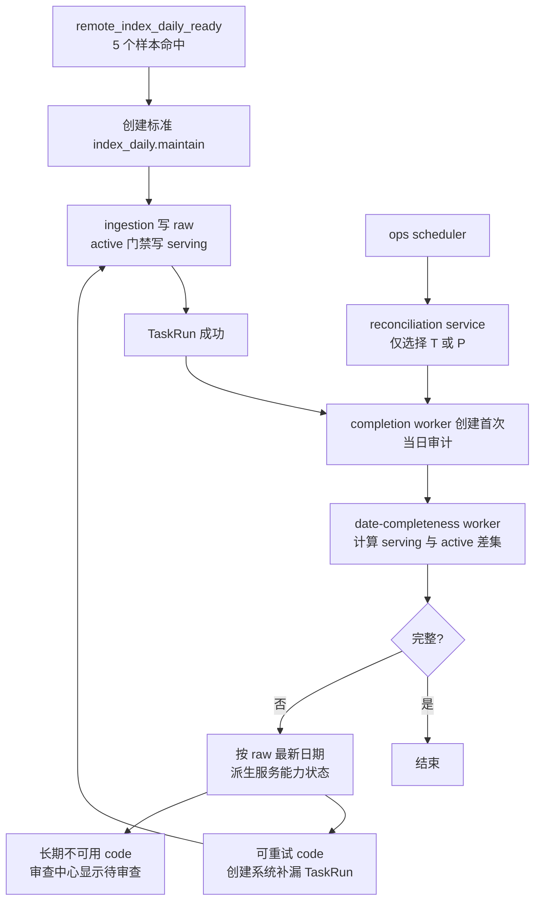

# 指数日线完整性闭环与激活池服务能力收口方案 v2

状态：已实现，待生产只读验收
创建日期：2026-07-15
前置基线：[指数日线完整性补漏方案 v1](/Users/congming/github/goldenshare/docs/ops/ops-index-daily-completeness-repair-plan-v1.md)（历史实施基线）
对应 LLD：[指数日线完整性闭环与激活池服务能力收口 LLD v2](/Users/congming/github/goldenshare/docs/ops/ops-index-daily-completeness-reconciliation-lld-v2.md)

---

## 1. 目标

把 `index_daily` 从“首次同步成功后补一次漏”收口为可解释、可停止的完整性闭环：

1. 当日源站只产出部分指数时，系统能受控地继续审计和补漏。
2. 允许在**下一个开市日**补一次最近未完整交易日，不扩展成历史回补。
3. 长期没有源站日线的代码不再被无限重试；运营能看见事实并手动移出激活池。
4. `ops.index_series_active(resource='index_daily')` 最终只保留 Tushare `index_daily` 可持续供数、应进入服务层的代码。

不改变以下已确认事实：

1. `remote_index_daily_ready` 的 5 个样本只负责“可以开始同步”，不负责证明全部 active 指数齐备。
2. 最终完整性只以 `ops.index_series_active(resource='index_daily') - core_serving.index_daily_serving(trade_date)` 为准。
3. raw 只用于判断“是否值得重试”和“是否需要审查服务能力”，不能替代 serving 完整性事实。
4. 所有补漏继续创建标准 `index_daily.maintain` TaskRun；Ops 不直接拼 Tushare 参数，也不直接写 raw 或 serving。

---

## 2. 已核验根因

2026-07-14 的生产链路证明，源站迟到和自动闭环缺失同时存在：

1. 首次同步 TaskRun `#5362` 成功结束后，审计仍发现 344 个 active 指数缺口。
2. 晚间人工维护将缺口降至 77 个；补漏 TaskRun `#5399` 返回 0 行后，没有任何新的审计 run，因此 77 个缺口留到次日。
3. `930604.CSI` 在次日已能返回前一交易日数据，证明“只允许当日”会漏掉真实的源站迟到。
4. 另有一批代码直到次日仍无数据，且 raw 最新日期已早于 2026-07-06；它们不应在每个窗口继续高频请求。

当前代码的直接原因：

1. `TaskRunCompletionService._index_daily_completion_audit_trade_date()` 只会在普通 `index_daily.maintain` 成功后创建第一次当日审计。
2. `run_scope='index_daily_gap_repair'` 被显式排除，补漏 TaskRun 完成后不会自动创建下一次审计。
3. `IndexDailyCompletenessRepairService._eligible_trade_date()` 只允许 `trade_date == Asia/Shanghai 当天`，不能在下一个开市日补前一日。
4. `DateCompletenessScheduleCommandService` 是通用静态窗口，不知道某日是否仍缺口、是否仍有补漏任务；把这套状态机硬塞进去会污染通用调度语义。

---

## 3. 已确认边界

### 3.1 受控最近交易日补漏

自动闭环只允许两个目标日期：

1. `T`：当前开市日的当日完整性补漏。
2. `P`：当前开市日 `T` 的上一个开市日，且仅当 `P` 仍未完整时进入受控对账。

不允许自动处理 `P` 之前的任何日期。周末、节假日不执行自然日补漏，下一个机会是下一个开市日。

### 3.2 激活池服务能力

`resource='index_daily'` 是 core serving 的入库门禁，不是“希望同步的指数清单”。其中代码必须满足“源站可持续提供 `index_daily`”这一运营事实。

处理原则：

1. 系统不自动删除激活池代码。
2. 系统不因为长期缺口伪造成功，也不无限重复请求。
3. 系统从 raw 事实派生“待审查”证据；运营确认后，使用现有“移出激活池”操作完成收口。
4. 新增激活池代码必须先满足同一份服务能力规则，不能只因存在 `index_basic` 记录就进入 serving。

---

## 4. 单一策略与派生状态

### 4.1 唯一策略文件

新增 `src/ops/services/index_daily_reconciliation_policy.py`，集中定义本专题的时间窗口、确认间隔和服务能力阈值。reconciliation service、repair service 与审查中心 query 都从该文件读取；不复制到前端常量、`ops.schedule`、数据库字段或环境变量。

首期建议值：

| 策略 | 建议值 | 原因 |
| --- | --- | --- |
| 当日确认窗口 | `17:45 ~ 22:30`，每 30 分钟 | 首次同步通常完成后开始，覆盖晚间源站迟到，同时限制重复请求频率。 |
| 前一开市日确认窗口 | `09:00 ~ 16:30`，每 30 分钟 | 给源站隔夜补齐留时间，并在 17:30 新一天探测前结束。 |
| 近期源站延迟容忍 | 最近 3 个开市日 | 1 至 3 日内仍可能迟到；生产中已连续 6 个开市日缺失的代码应转人工审查。 |
| 单 code 自动重试上限 | 同一目标日最多 3 轮 | 防止源站大面积迟到时按窗口无限放大 Tushare 请求；次数从既有 TaskRun 历史派生，不新增账本。 |
| 单轮补漏批次 | 100 code/TaskRun，最多 20 个 TaskRun | 沿用现有队列保护，不改变 TaskRun 颗粒度。 |

这些是代码策略，不是运营配置。修改它们会改变请求量和补漏行为，必须改唯一策略文件、补测试并更新本文。

### 4.2 服务能力分类

输入始终是 serving 差集；每个缺口代码额外查询 raw 的最新 `trade_date`。不新增状态表，状态每次实时计算：

| 派生状态 | 判定 | 自动动作 | 运营含义 |
| --- | --- | --- | --- |
| `serving_projection_gap` | raw 已有目标日，serving 缺目标日 | 创建标准补漏 TaskRun | 源数据已到，但服务层未覆盖。 |
| `source_delayed` | raw 未有目标日，但最新日期位于目标日前最近 3 个开市日，且自动重试未达上限 | 创建标准补漏 TaskRun | 源站可能晚到，受控重试。 |
| `serviceability_review_required` | raw 无历史，或最新日期早于上述窗口 | 不创建 TaskRun | 长期不可用，运营需要审查激活池。 |
| `source_retry_exhausted` | 仍属近期迟到，但同一目标日已完成 3 轮自动补漏 | 不创建 TaskRun | 自动重试已用尽，等待运营核验。 |

`serviceability_review_required` 与 `source_retry_exhausted` 都仍是 serving 缺口，完整性审计仍然失败；它们只是不再浪费请求次数。运营移出该代码后，下一次审计会按新的 active 池重新计算事实。

### 4.3 新增激活池的资格

新增候选的资格与补漏分类使用同一份服务能力规则：

1. 资格参考日期固定为最近一个已结束开市日，避免把当天尚在产出的源站数据误判为不合格。
2. 代码必须在该日期及之前连续 3 个开市日都存在 raw `index_daily` 行，才允许加入 `resource='index_daily'`。
3. 不满足时，后端拒绝加入并提示“先在 raw 请求池观察，确认源站连续供数后再加入激活池”。
4. 移出仍由运营确认；raw 和已存在的 serving 历史都不自动删除。

---

## 5. 目标架构

### 5.1 reconciliation service

新增 `IndexDailyCompletenessReconciliationService`，在现有 `OperationsScheduler.run_once()` 中调用；不新增 worker 或 systemd unit。

职责：

1. 从交易日历确定当前开市日 `T` 和前一开市日 `P`。
2. 在策略窗口内查询目标日最新审计、open 审计与 open 补漏 TaskRun。
3. 仅在仍失败且已到下一次确认时间时，调用现有 `DateCompletenessRunCommandService.create_system_run()` 创建一条单日审计 run。

不做：请求 Tushare、写 raw/serving/激活池、扫描 `P` 之前的日期、维护重试次数或 checkpoint。

### 5.2 再入队条件

同一目标日只有同时满足下列条件才创建下一次审计：

1. 目标只能是 `T` 或 `P`，且处于对应时间窗口。
2. 已存在一次 `index_daily` 日期矩阵审计，且最新结果为 `failed`。
3. 没有 `queued/running` 审计 run。
4. 没有 `queued/running/canceling` 的 `index_daily_gap_repair` TaskRun。
5. 最新失败审计结束时间距今不少于对应确认间隔。
6. 同一 scheduler tick 每个目标日最多创建一条审计。
7. 该目标日仍存在至少一个未达自动重试上限的 `source_delayed` 缺口；若只剩待审查或重试已用尽的缺口，停止自动循环。

这保证主任务没有结束时不抢跑，补漏仍在执行时不重复提交，完整后立即停止。

### 5.3 补漏任务选择

`IndexDailyCompletenessRepairService` 保持“创建标准 TaskRun”的职责，但补漏集合改为服务能力分类后的可重试集合：

1. `serving_projection_gap` 与未达上限的 `source_delayed` 进入补漏批次。
2. `serviceability_review_required` 与 `source_retry_exhausted` 留在审计缺口中，但不创建 TaskRun。
3. `P` 成为合法自动补漏日期；所有更早日期仍拒绝。
4. TaskRun 保持 `run_scope='index_daily_gap_repair'`、`trigger_source='system'`、单日 `time_input` 和 code 批次筛选。

重试次数从同一目标日已终态的 `index_daily_gap_repair` TaskRun 的 `filters.ts_code` 实时派生，不新增重试表。补漏 TaskRun 成功仍只表示这次请求和写入流程成功；是否完整必须由下一次审计重新判断。

### 5.4 审查中心

扩展现有“审查中心 · 指数激活池”，不增加第二套池或状态账本。

后端 `ReviewCenterQueryService` 直接从 `ops.index_series_active`、`raw_tushare.index_daily`、`core_serving.index_daily_serving` 和交易日历派生：

1. `latest_raw_trade_date`：该指数 raw 日线最新日期。
2. `source_serviceability_status`：`ready`、`source_delayed`、`serviceability_review_required`。
3. `source_serviceability_reason`：仅供后端/API 诊断使用；`source_retry_exhausted` 映射为 `serviceability_review_required`，不向页面泄漏内部枚举。
4. `serviceability_reference_date`：后端用于判断的参考日期，前端不得自行猜测。

页面仅消费这些后端事实字段：

1. 新增“源站服务能力”筛选与状态列，显示“正常”“等待源站”“待审查”。
2. 待审查项展示最近 raw 日期，不展示 SQL、内部枚举、reason code 或重试次数。
3. 候选列表展示资格；不达标时确认加入按钮不可用，并说明原因。
4. 保留现有人工移出操作及其“不会删除历史数据”提示。

---

## 6. 改动范围

| 模块 | 计划改动 | 明确不改 |
| --- | --- | --- |
| `src/ops/services/index_daily_reconciliation_policy.py` | 新增唯一策略口径 | 不新增 env、数据库配置或页面开关。 |
| `src/ops/services/index_daily_source_serviceability_service.py` | 新增 raw/serving/active/日历的只读分类查询 | 不写业务表或 Ops 状态表。 |
| `src/ops/services/index_daily_completeness_reconciliation_service.py` | 新增 `T/P` 审计入队编排 | 不请求源站，不创建新 worker。 |
| `src/ops/runtime/scheduler.py` | 调用 reconciliation service | 不改变普通 schedule 与 probe 的先后和语义。 |
| `src/ops/services/index_daily_completeness_repair_service.py` | 使用分类选择可重试缺口，允许 `P` | 不改标准维护入口、批大小或 payload 主结构。 |
| `src/ops/queries/review_center_query_service.py` | 派生服务能力字段、筛选与候选资格 | 不把判断逻辑交给浏览器。 |
| `src/ops/services/review_center_service.py` | 新增激活池加入前资格校验 | 不自动移出、清空或重建激活池。 |
| API/schema/前端页面 | 传递并显示后端事实字段 | 不改用户侧业务 API。 |
| 文档与测试 | 更新当前口径、LLD、API 说明和回归 | 不改 DatasetDefinition、request builder、writer、DAO、表结构或 Alembic。 |

边界不变：所有编排、审查与页面能力都留在 `ops`；`foundation` 只继续执行标准 `index_daily.maintain`。

---

## 7. 开发里程碑

### M0：策略与现状锁定

1. 将第 4.1 节策略固化为唯一 policy 文件。
2. 审计 completion worker、scheduler、date-completeness worker、repair service、review API 与前端消费者。
3. 用生产只读 SQL 复核 active 数、raw/serving 差集和缺口分类，保存实施前证据。

验收：不改业务链路，策略和消费者清单完整。

### M1：服务能力分类

1. 实现单一的 active code 分类查询。
2. 覆盖 raw 有目标日、近期迟到、重试已用尽、长期缺失、无 raw 历史五类样本。
3. 证明 repair service 与 review query 使用同一结果，且不持久化副本。

### M2：受控审计再入队

1. 实现 reconciliation service 并接入 `OperationsScheduler`。
2. 覆盖当日 `T`、前一开市日 `P`、节假日、窗口外与 `P-1` 历史日期。
3. 覆盖 open 审计、open 补漏、确认间隔未到、最新审计已通过时不入队。

### M3：补漏选择与停损

1. 只为 `serving_projection_gap` 与未达上限的 `source_delayed` 创建 TaskRun。
2. 允许 `P`，拒绝所有更早日期。
3. 长期缺失和重试已用尽的 code 不再循环请求，保留为审计缺口和待审查项。

### M4：激活池 API 与页面

1. 扩展 active 列表、汇总与候选 API 的事实字段及筛选。
2. 页面展示中文服务能力状态和最近 raw 日期。
3. 加入操作改为服务能力通过后才允许；人工移出语义不变。

### M5：回归、生产验收与文档收口

1. 完成服务、API、前端与 scheduler 定向回归。
2. 生产只读验证一次“源站迟到后 `P` 日补齐”和一次“长期缺失转待审查”。
3. 重写对应 LLD，更新 `ops-api-reference-v1.md` 与本文状态。

---

## 8. 测试与验收护栏

1. `T` 当日、`P` 前一开市日、节假日、窗口外和 `P-1` 的日期边界测试。
2. 同日已有 open audit/open repair、确认间隔未到、已 passed 时，scheduler 不重复入队。
3. raw 有目标日、raw 最近 1 至 3 个开市日、重试已用尽、raw 长期缺失、无 raw 五种分类测试。
4. `source_delayed` 在 3 轮内创建补漏，`serviceability_review_required` 和 `source_retry_exhausted` 不创建补漏。
5. 候选加入被未达标代码拒绝；人工移出不删除 raw 或 serving 数据。
6. completion worker、probe、普通 `ops.schedule` 和手动日期审计的现有行为回归。
7. 所有 Ops 失败只影响 Ops 观测/后续补漏，不影响已提交 raw/serving 业务数据。

---

## 9. 已拍板策略

以下口径与第 4.1 节唯一策略文件保持一致，是本需求进入 LLD 和开发的固定边界：

1. 当日 `T`：`17:45 ~ 22:30`，每 30 分钟确认一次。
2. 前一开市日 `P`：`09:00 ~ 16:30`，每 30 分钟确认一次。
3. 源站延迟容忍：仅看目标日前最近 3 个开市日。
4. 单 code、单目标日：最多自动补漏 3 轮。

不需要新增数据库表、配置表、Alembic 或部署单元。后续 LLD 与实现不得改写这些值；如需调整，必须先更新唯一策略文件、测试和本文。

---

## 10. 本轮实施结果

1. 策略已收口到 `src/ops/services/index_daily_reconciliation_policy.py`；T/P 窗口、30 分钟间隔、最近 3 个开市日、3 次终态补漏上限、100 code 批次和 20 个 TaskRun 上限均不再在其它模块复制。
2. `IndexDailySourceServiceabilityService` 已从 active 池、raw、serving、交易日历和既有 TaskRun 实时派生缺口分类与候选连续供数资格；没有新增状态表或副本。
3. repair service、scheduler 再审计和审查中心共用同一分类事实：scheduler 只因仍可补的 `source_delayed` 继续循环，raw 已有而 serving 缺失只作为一次即时补漏，不驱动循环。
4. 审查中心 API 和页面已展示后端返回的源站服务能力、行动建议、最近 raw 日线和判断参考日；候选不满足连续 3 个已结束开市日 raw 供数时，页面禁用选择，POST 仍返回 `source_serviceability_not_ready` 作为硬校验。
5. 未改 `foundation` ingestion、`DatasetDefinition`、请求参数、raw/serving writer、业务表、数据库结构或部署单元。生产验收只需只读观察 T/P 补漏闭环和待审查展示，不执行清表或对象池变更。
