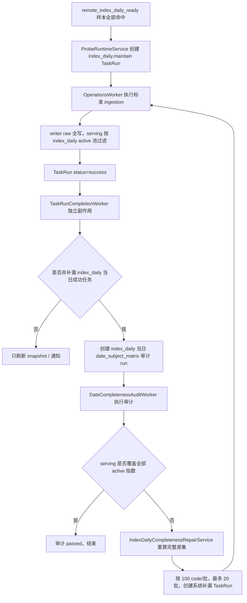

# 指数日线完整性补漏 LLD v1

状态：开发中（M2 已完成）
创建日期：2026-06-25  
依据方案：`docs/ops/ops-index-daily-completeness-repair-plan-v1.md`  
适用范围：`index_daily`、`ops.index_series_active`、日期对象矩阵审计、TaskRun 系统补漏、审查中心最小可见性。

本文只描述低层实现设计，不包含生产代码改动。

---

## 1. 目标与硬边界

本轮只做一条闭环：

```text
index_daily 首次同步
  -> 审计当天 active 池完整性
  -> 发现 core_serving 缺口
  -> 创建标准 index_daily.maintain 补漏 TaskRun
  -> 下一轮审计重新从 serving 事实判断是否已齐
```

硬边界：

1. 自动审计和自动补漏只处理交易日当日，不处理历史日期。
2. 完整性事实只看 `ops.index_series_active(resource='index_daily')` 与 `core_serving.index_daily_serving` 的差集。
3. 补漏任务仍是标准 `index_daily.maintain`，不新增执行器。
4. 不改 `index_daily` writer、raw / serving active 门禁、请求池、request builder。
5. 不把 `remote_index_daily_ready` 改成全 active 池探测。
6. 不新增业务数据表，不引入 checkpoint、acquire、补漏账本。
7. Ops 只创建 TaskRun 意图，不拼 Tushare 源接口参数。
8. 状态写入、审计失败、补漏失败不得影响业务数据表读写与事务提交。

---

## 2. 已核验依据

### 2.1 AGENTS 与文档

| 文件 | 本 LLD 使用到的约束 |
| --- | --- |
| `AGENTS.md` | 按方案开发必须抽取硬口径；契约变更必须全量消费者审计；Ops 状态写入不得影响业务数据事务；不能做临时兼容方案 |
| `docs/AGENTS.md` | 新增主文档必须同步 `docs/README.md`，提交前必须跑文档完整性检查 |
| `docs/ops/AGENTS.md` | 当前任务主线是 TaskRun；旧 execution API 不得恢复；自动任务使用 `ops.schedule target_type/target_key` |
| `src/AGENTS.md` | 主实现只能落在 `foundation/ops/biz/app`；TaskRun 主线在 `src/ops` |
| `src/ops/AGENTS.md` | Ops 表达任务意图和调度意图，不生成源接口参数 |
| `src/foundation/AGENTS.md` | DatasetDefinition 与 ingestion 主链属于 foundation，不能反向依赖 ops |
| `src/foundation/datasets/AGENTS.md` | `DatasetDefinition` 是数据集事实源 |
| `src/foundation/ingestion/AGENTS.md` | 请求参数由 resolver / planner / request builder 生成 |
| `docs/ops/ops-index-daily-completeness-repair-plan-v1.md` | 本需求的主方案与拍板项 |
| `docs/ops/ops-index-daily-remote-source-probe-lld-v1.md` | `remote_index_daily_ready` 已实现，只负责源站样本就绪探测 |
| `docs/datasets/index-series-active-sync-mechanism.md` | `index_daily_raw` 是源站请求池，`index_daily` 是 serving active 门禁 |

### 2.2 CodeGraph 审计范围

已使用 CodeGraph 覆盖：

```text
SubjectCompletenessMatrixExecutor
TaskRunCompletionService
DateCompletenessScheduleCommandService
DateCompletenessAuditWorker
IndexDailyRemoteReadinessProbeService
OperationsScheduler
TaskRunCommandService
DatasetCompletenessDefinition
```

影响面结论：

1. `foundation` 只需要补 `index_daily` 的 `DatasetDefinition.completeness`，不改 ingestion 主链。
2. 对象矩阵审计扩展点集中在 `src/ops/services/date_completeness_audit_service.py`。
3. 首次同步后的副作用入口是 `TaskRunCompletionWorker / TaskRunCompletionService`。
4. 晚间重复审计的入队入口应接到现有 `OperationsScheduler`，消费仍由 `DateCompletenessAuditWorker` 完成。
5. 补漏 TaskRun 创建应通过 `TaskRunCommandService.create_task_run()`，不直接调用 ingestion。

---

## 3. 当前代码事实

### 3.1 `index_daily` 主链事实

| 代码位置 | 当前事实 | 本需求结论 |
| --- | --- | --- |
| `src/foundation/datasets/definitions/index_series.py` | `index_daily` 的 `date_model` 是 `trade_open_day / every_open_day / point_or_range` | 完整性审计日期桶就是交易日 |
| `src/foundation/datasets/definitions/index_series.py` | `storage.write_path = raw_index_daily_serving_upsert` | 不改写入路径 |
| `src/foundation/datasets/definitions/index_series.py` | raw 表是 `raw_tushare.index_daily`，serving 表是 `core_serving.index_daily_serving` | 完整性只看 serving 表 |
| `src/foundation/ingestion/unit_planner.py` | `_resolve_index_codes()` 默认读取 `index_daily_raw` 请求池 | 补漏显式传 `ts_code`，不会读取默认请求池 |
| `src/foundation/ingestion/request_builders.py` | `_index_daily_params()` 要求 `ts_code`，point 模式生成 `trade_date` | 补漏只传 TaskRun 意图，参数仍由 builder 生成 |
| `src/foundation/ingestion/writer.py` | `_write_index_daily_serving()` raw 全写，serving 按 `index_daily` active 池过滤 | 补漏不能绕过 serving 门禁 |

### 3.2 日期完整性审计事实

| 代码位置 | 当前事实 | 本需求结论 |
| --- | --- | --- |
| `src/foundation/datasets/models.py` | `DatasetCompletenessDefinition` 已有 `scope / subject_kind / universe_strategy / status_field / active_status_values` | 不需要新增 completeness 模型字段 |
| `src/foundation/datasets/definitions/_builder.py` | 只有显式 `completeness.scope=date_subject_matrix` 才进入对象矩阵审计 | `index_daily` 必须在 Definition 显式声明 |
| `src/ops/services/date_completeness_audit_service.py` | `SubjectCompletenessMatrixExecutor` 目前只支持 `stock_basic_active_lifecycle + stock` | 需要新增 `ops_index_series_active + index` 分支 |
| `src/ops/models/ops/dataset_subject_completeness_gap.py` | 缺口摘要表已存在 | 复用 |
| `src/ops/models/ops/dataset_subject_completeness_gap_detail.py` | 缺口明细表已存在 | 页面展示复用 |
| `SubjectCompletenessMatrixExecutor.DETAIL_LIMIT` | 明细默认最多 5000 | 补漏服务不能依赖展示明细，必须重新算完整差集 |

### 3.3 调度与 worker 事实

| 代码位置 | 当前事实 | 本需求结论 |
| --- | --- | --- |
| `src/ops/runtime/task_completion_worker.py` | 任务终态后异步刷新 snapshot、发飞书通知 | 首次 `index_daily` 成功后的审计 run 创建应作为独立 try/except 副作用 |
| `src/ops/runtime/scheduler.py` | 当前只入队普通 ops schedule 和 probe schedule | 晚间 date completeness schedule 必须接入这里，否则不会自动跑 |
| `src/ops/services/date_completeness_schedule_service.py` | 支持 `rolling + open_day + lookback_count=1` 得到最近开市日 | 需要增加“交易日当日” guard，避免节假日自动审计历史日期 |
| `scripts/goldenshare-ops-scheduler.service` | 常驻执行 `ops-scheduler-serve` | 不新增 systemd 进程 |
| `scripts/goldenshare-date-completeness-worker.service` | 常驻消费 queued 审计 run | 不改消费模型，只在审计完成后挂补漏后处理 |

### 3.4 UI / API 事实

| 代码位置 | 当前事实 | 本需求结论 |
| --- | --- | --- |
| `src/ops/api/date_completeness.py` | 已有 run、gap、subject-gap、subject-gap-detail API | 审查中心缺口展示可复用 |
| `frontend/src/pages/ops-v21-dataset-audit-page.tsx` | 已能展示对象矩阵缺口摘要与明细 | 最小 UI 不需要新增审计 API |
| `src/ops/schemas/task_run.py` | `TaskRunListItem` 和 `TaskRunInfo` 只有 `trigger_source`，没有 `run_scope` 或派生展示名 | 需要新增后端派生展示字段 |
| `frontend/src/shared/ops-display.ts` | `system` 当前展示为“系统触发” | 补漏需要显示“系统补漏”，不能让前端猜 payload |

---

## 4. 目标数据事实与 SQL

当天完整性的唯一事实：

```sql
with expected as (
  select ts_code
  from ops.index_series_active
  where resource = 'index_daily'
    and ts_code is not null
),
actual as (
  select distinct ts_code
  from core_serving.index_daily_serving
  where trade_date = :trade_date
    and ts_code is not null
)
select expected.ts_code
from expected
left join actual on actual.ts_code = expected.ts_code
where actual.ts_code is null
order by expected.ts_code asc;
```

说明：

1. `resource='index_daily'` 是 serving active 门禁池。
2. `resource='index_daily_raw'` 是源站请求池，不参与完整性 expected 集合。
3. `raw_tushare.index_daily` 不参与最终完整性判断。
4. TaskRun rows、probe log、freshness snapshot 都不参与完整性判断。

---

## 5. 低层实现设计

### 5.1 `index_daily` Definition 增加完整性定义

文件：

```text
src/foundation/datasets/definitions/index_series.py
```

在 `index_daily` row 增加：

```python
'completeness': {
    'scope': 'date_subject_matrix',
    'subject_kind': 'index',
    'subject_key_fields': ('ts_code',),
    'actual_key_fields': ('ts_code',),
    'universe_strategy': 'ops_index_series_active',
    'universe_source_table': 'ops.index_series_active',
    'universe_key_field': 'ts_code',
    'universe_name_field': 'ts_code',
    'status_field': 'resource',
    'active_status_values': ('index_daily',),
},
```

实现注意：

1. 不改 `date_model`、`input_model`、`storage`、`planning`、`source`。
2. `status_field='resource'` 在这里不是“状态字段”，只是复用现有 completeness 定义模型表达资源过滤。
3. executor 内对 `ops_index_series_active` 使用专门 SQL，不把 `resource` 当生命周期状态处理。

Definition 验收：

1. `get_dataset_definition("index_daily").completeness.scope == "date_subject_matrix"`。
2. `subject_kind == "index"`。
3. `universe_strategy == "ops_index_series_active"`。
4. `active_status_values == ("index_daily",)`。
5. `index_daily_raw` 不得出现在 completeness expected 集合。

### 5.2 对象矩阵审计 executor 增加策略分支

文件：

```text
src/ops/services/date_completeness_audit_service.py
```

当前 `SubjectCompletenessMatrixExecutor._validate_supported()` 只接受：

```text
universe_strategy = stock_basic_active_lifecycle
subject_kind = stock
```

需要改成策略分发：

```text
stock_basic_active_lifecycle + stock
  -> 现有股票生命周期 SQL，不改行为

ops_index_series_active + index
  -> 新增指数 active 池 SQL
```

建议新增私有方法：

```python
def _build_bucket_context(self, *, run, completeness) -> dict[str, object]:
    if completeness.universe_strategy == "stock_basic_active_lifecycle":
        return self._build_stock_active_lifecycle_bucket_context(run=run, completeness=completeness)
    if completeness.universe_strategy == "ops_index_series_active":
        return self._build_ops_index_series_active_bucket_context(run=run, completeness=completeness)
    raise ValueError(...)
```

`ops_index_series_active` SQL：

```sql
with expected as (
    select
        u.ts_code as subject_key,
        u.ts_code as subject_name,
        null::date as lifecycle_start,
        null::date as lifecycle_end
    from ops.index_series_active u
    where u.ts_code is not null
      and u.resource in (:active_status_0)
),
actual as (
    select distinct
        ts_code as subject_key
    from core_serving.index_daily_serving
    where trade_date = :bucket_value
      and ts_code is not null
),
checked as (
    select
        e.subject_key,
        e.subject_name,
        e.lifecycle_start,
        e.lifecycle_end,
        a.subject_key as actual_subject_key
    from expected e
    left join actual a on a.subject_key = e.subject_key
)
select
    subject_key,
    subject_name,
    lifecycle_start,
    lifecycle_end,
    actual_subject_key
from checked
order by subject_key asc;
```

实现注意：

1. `target_table` 与 `observed_field` 仍从 `DatasetDateCompletenessRun` 快照读取，不能硬编码在执行器里。
2. 表名和字段名继续走 `_sql_table_identifier()` / `_sql_column_identifier()` 校验。
3. `ops_index_series_active` 不需要 `lifecycle_start_field` / `lifecycle_end_field`。
4. 缺口原因可沿用 `missing_subject_bucket`，但文案建议改得更通用：`该对象属于本数据集 active 池，但目标表缺少该日期行。`

### 5.3 补漏服务

新增文件：

```text
src/ops/services/index_daily_completeness_repair_service.py
```

职责：

1. 重新计算 `index_daily` 当日完整缺口。
2. 排除已经处于 queued/running/canceling 的同日期同 code 补漏任务。
3. 按批创建标准 `index_daily.maintain` TaskRun。
4. 不请求 Tushare，不写 raw / serving，不更新 active 池。

建议常量：

```python
INDEX_DAILY_GAP_REPAIR_RUN_SCOPE = "index_daily_gap_repair"
INDEX_DAILY_REPAIR_BATCH_SIZE = 100
INDEX_DAILY_REPAIR_MAX_TASK_RUNS_PER_ROUND = 20
INDEX_DAILY_REPAIR_OPEN_STATUSES = ("queued", "running", "canceling")
```

核心方法：

```python
class IndexDailyCompletenessRepairService:
    def missing_codes(self, session: Session, *, trade_date: date) -> list[str]:
        ...

    def create_repair_task_runs(
        self,
        session: Session,
        *,
        source_run: DatasetDateCompletenessRun,
        now: datetime | None = None,
    ) -> list[TaskRun]:
        ...
```

`create_repair_task_runs()` 前置校验：

1. `source_run.dataset_key == "index_daily"`。
2. `source_run.run_status == "succeeded"`。
3. `source_run.result_status == "failed"`。
4. `source_run.start_date == source_run.end_date`。
5. `source_run.start_date` 必须等于北京时间当天，且当天在交易日历中 `is_open=True`。
6. 只处理 `source_run.audit_scope == "date_subject_matrix"`。

TaskRun 创建：

```python
TaskRunCommandService().create_task_run(
    session,
    context=TaskRunCreateContext(
        task_type="dataset_action",
        resource_key="index_daily",
        action="maintain",
        time_input={"mode": "point", "trade_date": trade_date.isoformat()},
        filters={"ts_code": ",".join(batch_codes)},
        request_payload={
            "run_scope": "index_daily_gap_repair",
            "source_date_completeness_run_id": source_run.id,
            "repair_trade_date": trade_date.isoformat(),
            "missing_code_count": total_missing,
            "batch_index": batch_index,
            "batch_size": len(batch_codes),
        },
        trigger_source="system",
        requested_by_user_id=None,
        schedule_id=None,
    ),
)
```

去重逻辑：

1. 查询 `ops.task_run` 中 `resource_key='index_daily'`、`action='maintain'`、状态为 queued/running/canceling 的任务。
2. 在 Python 中过滤：
   - `time_input_json.trade_date == trade_date.isoformat()`
   - `request_payload_json.run_scope == "index_daily_gap_repair"`
3. 用 `split_multi_values(filters_json["ts_code"])` 得到正在处理的 code。
4. 本轮新建前从缺口集合中剔除这些 code。

为什么不直接读 `dataset_subject_completeness_gap_detail`：

1. 审计明细有全局 `DETAIL_LIMIT=5000`，它是页面展示安全阈值。
2. 补漏必须覆盖完整缺口，所以补漏服务每轮直接用 serving 差集 SQL 重新计算。
3. 审计表用于展示和追踪，不作为补漏账本。

### 5.4 首次同步后的自动审计

修改文件：

```text
src/ops/services/task_run_completion_service.py
src/ops/runtime/task_completion_worker.py
```

新增方法建议：

```python
class TaskRunCompletionService:
    def create_index_daily_audit_after_success_if_needed(
        self,
        session: Session,
        task_run: TaskRun,
        *,
        now: datetime | None = None,
    ) -> DatasetDateCompletenessRun | None:
        ...
```

触发条件：

1. `task_run.task_type == "dataset_action"`。
2. `task_run.resource_key == "index_daily"`。
3. `task_run.action == "maintain"`。
4. `task_run.status == "success"`。
5. `task_run.time_input_json.mode == "point"`。
6. `task_run.time_input_json.trade_date` 等于北京时间当天。
7. 当天交易日历 `is_open=True`。
8. `task_run.request_payload_json.run_scope != "index_daily_gap_repair"`。

第 8 条是防循环门禁：补漏任务完成后不立即再创建下一轮审计，后续缺口由晚间 schedule 继续审计。

run 创建方式：

1. 复用 `DateCompletenessRunCommandService`。
2. 新增 `create_system_scheduled_run()` 或扩展私有构造方法。
3. `DatasetDateCompletenessRun.run_mode` 使用现有允许值 `scheduled`。
4. `schedule_id=None`。
5. `requested_by_user_id=None`。
6. `start_date=end_date=trade_date`。

不新增 `run_mode='system'` 的原因：

1. 当前 DB check constraint 只允许 `manual / scheduled`。
2. 新增 run_mode 会引入 Alembic、API、前端标签变更。
3. 本需求不需要运营按 run_mode 区分，只要知道这是系统创建的审计即可。

worker 接入：

```text
TaskRunCompletionWorker._process_task_run()
  -> build_completion_summary()
  -> refresh_snapshot_for_task_run()       独立 try/except
  -> create_index_daily_audit_after_success_if_needed()  独立 try/except
  -> send_task_completion()                独立 try/except
```

约束：

1. 创建审计失败只打日志，不影响飞书通知，不回滚业务数据。
2. 不在主 `goldenshare-ops-worker.service` 里做这件事。
3. 不在 ingestion executor 里做这件事。

### 5.5 晚间重复审计入队

目标：

```text
17:45 ~ 21:30
每 15 分钟
只在交易日当日创建 index_daily 审计 run
```

现有事实：

1. `DateCompletenessScheduleCommandService` 可以创建 `rolling + open_day + lookback_count=1` 的审计 run。
2. 但它目前未接入 `OperationsScheduler` 常驻循环。
3. `rolling + open_day` 在节假日会返回最近一个开市日，这会变成历史日期自动审计，不符合本方案。

实现设计：

1. 在 `OperationsScheduler` 中增加 `DateCompletenessScheduleCommandService` 依赖。
2. 增加 `run_once_detailed()`，返回普通 TaskRun 和日期完整性 run 两类数量。
3. 保留 `run_once()` 对现有测试和调用方返回 `list[TaskRun]` 的行为，内部委托 `run_once_detailed()`。
4. `ops-scheduler-serve` 可切到 `run_once_detailed()`，输出 `task_runs` 与 `date_completeness_runs` 数量。
5. 在 `DateCompletenessScheduleCommandService` 中为 `index_daily` 增加当前交易日 guard：
   - 仅当北京时间当天在 `core.trade_calendar` 中 `is_open=True` 时创建 run。
   - 仅当解析出的窗口 `start_date=end_date=local_today` 时创建 run。
   - 不满足时只推进 `next_run_at`，不创建历史日期 run。

生产 schedule 建议配置为三条记录，精确覆盖窗口：

| 用途 | cron_expr | window_mode | lookback_count | lookback_unit | timezone |
| --- | --- | --- | ---: | --- | --- |
| 17:45 首轮 | `45 17 * * 1-5` | `rolling` | 1 | `open_day` | `Asia/Shanghai` |
| 18:00 至 20:45 | `0,15,30,45 18-20 * * 1-5` | `rolling` | 1 | `open_day` | `Asia/Shanghai` |
| 21:00 至 21:30 | `0,15,30 21 * * 1-5` | `rolling` | 1 | `open_day` | `Asia/Shanghai` |

说明：

1. cron 只负责时间点。
2. 交易日 guard 负责节假日不创建历史日期审计 run。
3. 这三条 schedule 都只创建审计 run，真正补漏由 `DateCompletenessAuditWorker` 审计完成后触发。

### 5.6 审计完成后的补漏触发

修改文件：

```text
src/ops/services/date_completeness_audit_service.py
```

当前：

```python
class DateCompletenessAuditWorker:
    def run_next(self, session):
        return DateCompletenessAuditExecutor().run_next(session)
```

建议：

```python
class DateCompletenessAuditWorker:
    def __init__(self, repair_service: IndexDailyCompletenessRepairService | None = None):
        self.repair_service = repair_service or IndexDailyCompletenessRepairService()

    def run_next(self, session):
        run = DateCompletenessAuditExecutor().run_next(session)
        if run is None:
            return None
        self._create_index_daily_repair_tasks_if_needed(session, run)
        return run
```

后处理条件：

1. `run.dataset_key == "index_daily"`。
2. `run.run_status == "succeeded"`。
3. `run.result_status == "failed"`。
4. `run.start_date == run.end_date`。
5. `run.start_date` 是北京时间交易日当日。
6. `run.audit_scope == "date_subject_matrix"`。

异常处理：

1. 补漏创建失败不得回滚审计 run 结果。
2. 捕获异常并记录日志。
3. 不把异常写入业务数据表。

### 5.7 TaskRun 展示“系统补漏”

当前问题：

1. `TaskRunListItem` / `TaskRunInfo` 只返回 `trigger_source`。
2. 前端只看到 `system`，无法知道是不是补漏。
3. 让前端自己读 payload 会违反“页面不自行拼装事实字段”。

实现设计：

后端 schema 增加派生字段：

```python
trigger_source_label: str | None = None
```

影响文件：

```text
src/ops/schemas/task_run.py
src/ops/queries/task_run_query_service.py
src/ops/services/task_run_completion_service.py
frontend/src/shared/api/types.ts
frontend/src/pages/ops-v21-task-records-tab.tsx
frontend/src/pages/ops-task-detail-page.tsx
frontend/src/pages/ops-today-page.tsx
```

派生规则：

```text
if trigger_source == "system"
and request_payload_json.run_scope == "index_daily_gap_repair":
    trigger_source_label = "系统补漏"
else:
    trigger_source_label = existing label(trigger_source)
```

使用方式：

1. 任务列表优先展示 `trigger_source_label`。
2. 任务详情发起方式卡片优先展示 `trigger_source_label`。
3. 飞书通知也使用同一后端派生规则。
4. 前端保留 `formatTriggerSourceLabel()` 作为旧数据 fallback，但不再自己判断补漏。

### 5.8 API 与页面

本轮不新增审计 API。

现有可复用 API：

| API | 用途 |
| --- | --- |
| `GET /api/v1/ops/review/date-completeness/rules` | `index_daily` 增加 completeness 后会出现在支持审计列表中 |
| `GET /api/v1/ops/review/date-completeness/runs` | 查看自动/手动审计 run |
| `GET /api/v1/ops/review/date-completeness/runs/{id}` | 查看审计结果 |
| `GET /api/v1/ops/review/date-completeness/runs/{id}/subject-gaps` | 查看日期级对象缺口摘要 |
| `GET /api/v1/ops/review/date-completeness/runs/{id}/subject-gap-details` | 查看缺失 index code 样例 |
| `GET /api/v1/ops/task-runs*` | 查看系统补漏 TaskRun |

前端最小改动：

1. 审查中心现有对象矩阵展示可复用。
2. 任务记录/详情显示“系统补漏”。
3. 不新增复杂补漏配置页。
4. 不在页面铺开补漏批次技术细节。

---

## 6. 运行时流程



晚间重复审计：

```text
OperationsScheduler
  -> DateCompletenessScheduleCommandService.enqueue_due_schedules()
  -> queued DatasetDateCompletenessRun
  -> DateCompletenessAuditWorker
  -> IndexDailyCompletenessRepairService
  -> TaskRun(index_daily_gap_repair)
```

---

## 7. 测试设计

### 7.1 Definition 测试

文件：

```text
tests/test_dataset_definition_registry.py
```

新增断言：

1. `index_daily.completeness.scope == "date_subject_matrix"`。
2. `subject_kind == "index"`。
3. `universe_strategy == "ops_index_series_active"`。
4. `universe_source_table == "ops.index_series_active"`。
5. `active_status_values == ("index_daily",)`。
6. 更新 `test_dataset_definition_subject_matrix_scope_is_not_inferred_from_ts_code()` 的矩阵集合，加入 `index_daily`。

### 7.2 对象矩阵 executor 测试

文件：

```text
tests/web/test_ops_date_completeness_api.py
```

新增用例：

1. active 池有 `000001.SH / 399001.SZ / 399300.SZ`，serving 当日只有前两个，审计缺 1 个。
2. serving 全覆盖时 `result_status == "passed"`。
3. `resource='index_daily_raw'` 中存在、`resource='index_daily'` 中不存在的 code 不进入 expected 集合。
4. 节假日或历史日期自动后处理不创建补漏 TaskRun。
5. 股票对象矩阵现有用例全部保持不变。

### 7.3 补漏服务测试

建议新增：

```text
tests/web/test_ops_index_daily_completeness_repair.py
```

覆盖：

1. 缺 3 个 code 创建 1 个 TaskRun。
2. 缺 250 个 code 创建 3 个 TaskRun。
3. 缺 2500 个 code 单轮最多创建 20 个 TaskRun。
4. queued/running/canceling 中已有的 code 不重复创建。
5. 失败终态补漏任务不作为账本，下一轮仍按 serving 差集决定。
6. `trigger_source == "system"`。
7. `request_payload_json.run_scope == "index_daily_gap_repair"`。
8. `filters_json.ts_code` 是逗号分隔批次 code。

### 7.4 completion worker 测试

文件：

```text
tests/web/test_ops_task_completion_worker.py
```

覆盖：

1. 非 `index_daily` 成功任务不创建审计 run。
2. `index_daily` 失败 / canceled / partial_success 不创建审计 run。
3. `index_daily` 当日成功且非 repair 任务创建一次审计 run。
4. `run_scope=index_daily_gap_repair` 的补漏任务成功后不创建立即审计，避免循环。
5. 创建审计失败不影响 snapshot refresh 和飞书通知。

### 7.5 scheduler 测试

文件：

```text
tests/web/test_ops_runtime.py
tests/test_cli_ops_runtime.py
```

覆盖：

1. `OperationsScheduler` 会入队 due date-completeness schedule。
2. `run_once()` 旧调用仍能拿到普通 TaskRun 列表。
3. `run_once_detailed()` 能返回普通 TaskRun 数和 date completeness run 数。
4. `ops-scheduler-serve` 输出包含两类数量。
5. `index_daily` 自动审计 schedule 在节假日不创建历史日期 run，只推进下次时间。

### 7.6 前端测试

文件：

```text
frontend/src/pages/ops-v21-task-records-tab.test.tsx
frontend/src/pages/ops-task-detail-page.test.tsx
frontend/src/shared/ops-display.test.ts
frontend/src/pages/ops-v21-dataset-audit-page.test.tsx
```

覆盖：

1. API 返回 `trigger_source_label="系统补漏"` 时，任务记录展示系统补漏。
2. 任务详情发起方式展示系统补漏。
3. API 未返回 label 时仍 fallback 到 `formatTriggerSourceLabel()`。
4. 审查中心能显示 `index_daily` 对象矩阵审计缺口。

---

## 8. 实施里程碑

### M1：Definition 与对象矩阵审计

状态：已完成。

目标：审查中心能对 `index_daily` 算出当日缺哪些 active 指数。

改动：

1. `index_daily` 已增加 completeness。
2. `SubjectCompletenessMatrixExecutor` 已增加 `ops_index_series_active + index` 分支。
3. 已补 Definition 与 executor 测试。

验收：

1. active 池 3 个，serving 2 个，审计缺 1 个。
2. `index_daily_raw` 不进入 expected。
3. serving 全覆盖时审计通过。
4. 股票对象矩阵测试不回退。

验证：

```bash
uv run ruff check src/foundation/datasets/definitions/index_series.py src/ops/services/date_completeness_audit_service.py tests/test_dataset_definition_registry.py tests/web/test_ops_date_completeness_api.py
uv run pytest -q tests/test_dataset_definition_registry.py tests/web/test_ops_date_completeness_api.py
```

### M2：补漏 TaskRun 创建服务

状态：已完成。

目标：把当日缺口转换为标准 `index_daily.maintain` 系统补漏任务。

改动：

1. 已新增 `IndexDailyCompletenessRepairService`。
2. 已直接重算完整差集，不依赖展示明细。
3. 已实现批大小 100，单轮最多 20 个 TaskRun。
4. 已实现 queued/running/canceling 去重。
5. 已实现只处理交易日当日，历史日期不自动创建补漏任务。

验收：

1. 缺口批次正确。
2. 补漏 payload 正确。
3. 不创建历史日期补漏。

验证：

```bash
uv run ruff check src/ops/services/index_daily_completeness_repair_service.py tests/web/test_ops_index_daily_completeness_repair.py
uv run pytest -q tests/web/test_ops_index_daily_completeness_repair.py
```

### M3：异步闭环接入

目标：首次同步成功后自动进入审计，审计失败后自动创建补漏。

改动：

1. `TaskRunCompletionWorker` 创建首次当日审计 run。
2. `DateCompletenessAuditWorker` 审计完成后调用补漏服务。
3. 异常互相隔离，不影响业务数据。

验收：

1. 非补漏 `index_daily` 成功后创建审计 run。
2. 补漏 TaskRun 成功后不立即创建下一轮审计。
3. 审计或补漏失败不影响原 TaskRun 结果。

### M4：晚间重复审计

目标：17:45 到 21:30 每 15 分钟重复检查交易日当日缺口。

改动：

1. `OperationsScheduler` 接入 date completeness schedule。
2. date completeness schedule 对 `index_daily` 增加交易日当日 guard。
3. 生产创建三条 schedule 覆盖窗口。

验收：

1. 交易日窗口内能入队审计 run。
2. 节假日不创建上一交易日历史审计 run。
3. 窗口外不创建 run。

### M5：页面最小可见性

目标：运营能看懂“当天缺口”和“系统补漏任务”。

改动：

1. TaskRun API 增加 `trigger_source_label`。
2. 任务记录、今日运行、任务详情使用后端 label。
3. 审查中心复用对象矩阵缺口展示。

验收：

1. 系统补漏显示为“系统补漏”。
2. 普通 system 任务仍能显示为系统触发。
3. 页面不展示底层 SQL、run_scope、批次 payload 等技术字段。

---

## 9. 回归命令

后续实现完成后建议运行：

```bash
uv run ruff check \
  src/foundation/datasets/definitions/index_series.py \
  src/ops/services/date_completeness_audit_service.py \
  src/ops/services/date_completeness_run_service.py \
  src/ops/services/date_completeness_schedule_service.py \
  src/ops/services/index_daily_completeness_repair_service.py \
  src/ops/services/task_run_completion_service.py \
  src/ops/runtime/task_completion_worker.py \
  src/ops/runtime/scheduler.py \
  src/ops/queries/task_run_query_service.py \
  src/ops/schemas/task_run.py \
  tests

uv run pytest -q \
  tests/test_dataset_definition_registry.py \
  tests/web/test_ops_date_completeness_api.py \
  tests/web/test_ops_task_completion_worker.py \
  tests/web/test_ops_runtime.py \
  tests/test_cli_ops_runtime.py

uv run python scripts/check_docs_integrity.py
```

前端实现后补跑：

```bash
cd frontend
npm run test -- ops-v21-task-records-tab ops-task-detail-page ops-v21-dataset-audit-page ops-display
npm run typecheck
```

---

## 10. 风险与处理

| 风险 | 处理 |
| --- | --- |
| 源站长期缺某些 active 指数 | 不自动改 active 池，窗口结束后保留审计缺口，运营在审查中心判断 |
| 补漏重复创建 | 以 serving 差集为事实，同时排除 queued/running/canceling 中已有 code |
| 审计明细截断 | 页面明细可截断，补漏服务重新算完整差集 |
| 节假日 rolling open_day 指向上一交易日 | 为 `index_daily` 自动审计增加交易日当日 guard |
| 补漏任务触发 immediate audit 循环 | completion worker 跳过 `run_scope=index_daily_gap_repair` |
| 任务来源文案混乱 | 后端派生 `trigger_source_label`，前端只展示后端事实 |

---

## 11. 本 LLD 结论

本需求不需要新业务表，不需要新执行器，也不需要改变 `index_daily` ingestion 主链。

合理落点是：

1. `DatasetDefinition` 声明 `index_daily` 的对象矩阵完整性事实。
2. `SubjectCompletenessMatrixExecutor` 增加指数 active 池策略。
3. `IndexDailyCompletenessRepairService` 用 serving 差集创建标准 TaskRun。
4. `TaskRunCompletionWorker` 负责首次审计触发。
5. `OperationsScheduler + DateCompletenessScheduleCommandService` 负责晚间重复审计入队。
6. `DateCompletenessAuditWorker` 审计完成后触发补漏。
7. UI 只展示“当天缺口”和“系统补漏”，不暴露底层技术批次。
