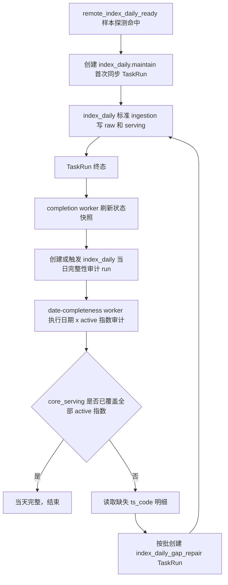

# 指数日线完整性补漏方案 v1

状态：已确认，待开发  
创建日期：2026-06-25  
适用范围：`index_daily`、`ops.index_series_active`、审查中心完整性审计、TaskRun 自动补漏

---

## 1. 背景

`remote_index_daily_ready` 已经能在源站指数日线开始出数后触发 `index_daily.maintain`。但它只用 5 个代表指数做源站探测，解决的是“什么时候可以开始跑”，不是“active 池全部指数都已经齐”。

实际运行中，Tushare 源站可能出现这种情况：

1. 多数指数已经有当天数据。
2. 少量指数在首次同步时还没有产出。
3. 首次同步成功结束，但 `core_serving.index_daily_serving` 对当天仍缺几个 active 指数。

这类问题不应该靠把首次同步时间无限后移解决，也不应该要求源站探测全量确认后才启动。更合理的闭环是：

```text
探测负责尽早启动
同步负责写入可拿到的数据
审计负责发现缺口
补漏负责把缺口重新提交给标准同步链路
```

---

## 2. 当前实现事实

### 2.1 指数日线写入口径

当前 `index_daily` 定义位于 `src/foundation/datasets/definitions/index_series.py`：

1. `date_model` 是 `trade_open_day / every_open_day / point_or_range`。
2. `storage.write_path = raw_index_daily_serving_upsert`。
3. raw 表是 `raw_tushare.index_daily`。
4. serving 表是 `core_serving.index_daily_serving`。
5. 默认执行读取 `ops.index_series_active(resource='index_daily_raw')` 作为源站请求池。
6. serving 写入前读取 `ops.index_series_active(resource='index_daily')` 作为 active 门禁。
7. 显式传入 `ts_code` 只限定源站请求范围，不能绕过 serving active 门禁。

### 2.2 当前探测能力

`remote_index_daily_ready` 位于 `src/ops/services/index_daily_remote_probe_service.py`：

1. 默认样本指数是 `000001.SH / 399001.SZ / 399300.SZ / 000016.SH / 000905.SH`。
2. 5 个样本全部返回目标交易日数据后，才创建 `index_daily.maintain` TaskRun。
3. 探测不写业务表。
4. 探测命中后创建的任务仍走标准 `DatasetActionResolver -> unit planner -> request builder -> writer` 链路。

### 2.3 当前完整性审计限制

当前 `SubjectCompletenessMatrixExecutor` 已能表达“日期 × 对象”的缺口明细，但现状只支持：

```text
universe_strategy = stock_basic_active_lifecycle
subject_kind = stock
```

因此，`index_daily` 要做“日期 × 指数 active 池”的完整性审计，需要补强审计侧对象池策略，不能硬套股票生命周期策略。

---

## 3. 目标

本方案只解决一件事：

> 指数日线首次同步后，如果当天 active 池仍有零星指数缺失，系统能自动发现并补漏，直到当天完整或补漏窗口结束。

硬口径：

1. 自动审计和自动补漏只处理“最新交易日当日”。
2. 不包含历史日期。
3. 历史日期缺口如需处理，必须由运营另行发起手动维护或单独需求，不进入本方案自动闭环。

完成后的运营语义：

1. 指数日线可以尽早启动，不被少数迟到指数卡住。
2. 当天完整性以 `core_serving.index_daily_serving` 和 `ops.index_series_active(resource='index_daily')` 的差集为准。
3. 自动补漏任务仍是普通 `index_daily.maintain`，不是新执行器。
4. 审查中心可以看到当天是否完整、缺几个指数、缺哪些指数、补漏是否仍在进行。

---

## 4. 非目标

本方案不做以下事情：

1. 不改 `index_daily` writer 主链。
2. 不改 raw / serving active 门禁规则。
3. 不把 `remote_index_daily_ready` 改成全 active 池探测。
4. 不新增业务数据表。
5. 不新增 checkpoint、acquire、断点续跑或复杂状态账本。
6. 不把补漏逻辑写进 `foundation` ingestion executor。
7. 不让 Ops 自己拼源接口参数；补漏仍然只创建 TaskRun 意图。
8. 不因为补漏状态失败影响业务数据写入和事务提交。
9. 不自动审计或补漏历史交易日。

---

## 5. 核心设计

### 5.1 单一事实

当天是否完整，只看最终服务层事实：

```sql
-- 应有集合
select ts_code
from ops.index_series_active
where resource = 'index_daily';

-- 已有集合
select distinct ts_code
from core_serving.index_daily_serving
where trade_date = :trade_date;

-- 缺口集合
应有集合 - 已有集合
```

说明：

1. 不从 TaskRun rows 计数判断完整性。
2. 不从 probe log 判断完整性。
3. 不从 raw 表判断最终可服务完整性。
4. 不维护“已补漏 code 账本”；每轮重新从 serving 事实计算缺口。

### 5.2 审计补强

给 `index_daily` 增加对象矩阵完整性定义：

```python
completeness = {
    "scope": "date_subject_matrix",
    "subject_kind": "index",
    "subject_key_fields": ("ts_code",),
    "actual_key_fields": ("ts_code",),
    "universe_strategy": "ops_index_series_active",
    "universe_source_table": "ops.index_series_active",
    "universe_key_field": "ts_code",
    "universe_name_field": "ts_code",
    "status_field": "resource",
    "active_status_values": ("index_daily",),
}
```

这里的 `status_field=resource` 不是表达状态，而是复用现有定义模型里的过滤字段，让审计只取 `resource='index_daily'` 的 active 池。实现时也可以在 executor 内对 `ops_index_series_active` 使用专门 SQL，避免让字段命名误导后续维护者。

需要补强 `SubjectCompletenessMatrixExecutor`：

1. 支持 `universe_strategy='ops_index_series_active'`。
2. 支持 `subject_kind='index'`。
3. 对指数 active 池不要求生命周期字段。
4. 生成缺口明细仍写入 `ops.dataset_subject_completeness_gap_detail`。

### 5.3 自动补漏服务

新增一个薄服务，例如 `IndexDailyCompletenessRepairService`，职责只包括：

1. 读取某个审计 run 的缺口明细。
2. 只处理 `dataset_key='index_daily'`、`bucket_value=<目标交易日>`。
3. 按批次把缺失 `ts_code` 转成标准 TaskRun。
4. 不直接请求 Tushare。
5. 不直接写 raw 或 serving 表。

补漏 TaskRun 建议 payload：

```json
{
  "task_type": "dataset_action",
  "resource_key": "index_daily",
  "action": "maintain",
  "time_input": {
    "mode": "point",
    "trade_date": "2026-06-25"
  },
  "filters": {
    "ts_code": "000001.SH,399001.SZ"
  },
  "request_payload": {
    "run_scope": "index_daily_gap_repair",
    "source_run_id": 123,
    "source_gap_id": 456
  },
  "trigger_source": "system"
}
```

说明：

1. `trigger_source` 使用 `system`，避免新增用户可见触发来源枚举。
2. 用户可见文案显示为“系统补漏”。
3. `run_scope=index_daily_gap_repair` 用于任务详情和后续排查。
4. 补漏任务继续走 `index_daily.maintain` 主链，request builder 仍负责生成 Tushare 参数。

### 5.4 调度闭环

建议把补漏闭环放在低优先级异步链路里，不进入 `goldenshare-ops-worker.service` 的主业务数据写入路径。

推荐流程：



为了覆盖“源站持续分批迟到”的情况，还需要一个晚间补漏检查窗口：

```text
确认窗口：17:45 ~ 21:30
确认频率：每 15 分钟一次
目标日期：当天最新开市日
停止条件：缺口为 0，或超过窗口结束时间
```

窗口内每一轮都重新审计 serving 差集，不复用上一次缺口结果作为事实。

说明：

1. 重复审计不是为了维护复杂状态，而是为了覆盖源站分批迟到。
2. 每轮都只审计最新交易日当日，不回看历史。
3. 如果 17:45 首轮缺 5 个、18:15 补上 3 个、18:45 源站再补出剩余 2 个，下一轮审计会重新计算缺口并继续补漏。

---

## 6. 模块改动范围

### 6.1 `src/foundation/datasets`

改动目标：

1. 给 `index_daily` 增加 `completeness` 定义。
2. 保持 `date_model`、`input_model`、`storage`、`planning` 不变。
3. 不改变 `index_daily` 同步请求、写入、分页、active 门禁口径。

测试要求：

1. registry 测试断言 `index_daily.completeness.scope == date_subject_matrix`。
2. registry 测试断言对象池策略是 `ops_index_series_active`。
3. 负向测试防止误把 `index_daily_raw` 当成 serving 完整性对象池。

### 6.2 `src/ops/services/date_completeness_*`

改动目标：

1. 扩展 `SubjectCompletenessMatrixExecutor`，支持 `ops_index_series_active`。
2. 保持现有股票对象矩阵审计行为不变。
3. 缺口明细继续写入现有 `dataset_subject_completeness_gap_detail`。

测试要求：

1. active 池 3 个指数，serving 只有 2 个，审计应产生 1 个缺口明细。
2. serving 全覆盖时，审计 result 为 `passed`。
3. `resource='index_daily_raw'` 中存在但 `resource='index_daily'` 中不存在的 code 不应进入 expected 集合。

### 6.3 `src/ops/services`

改动目标：

1. 新增薄补漏服务，消费审计缺口明细。
2. 服务只创建 TaskRun，不执行 ingestion。
3. 每个补漏 TaskRun 只携带 `trade_date` 和一批 `ts_code`。
4. 批大小需要可控，避免一个 TaskRun 里塞过长字符串。

建议默认值：

```text
每批最多 100 个指数 code
同一轮最多创建 20 个补漏 TaskRun
```

确认口径：

1. 单个补漏 TaskRun 的颗粒度是“一个交易日 + 一批缺失指数代码”。
2. 每批最多 100 个指数 code。
3. 同一轮最多创建 20 个补漏 TaskRun。
4. 按上述限制，单轮最多覆盖 2000 个缺失指数。
5. 这个上限是防御性队列保护，正常情况下只会缺零星指数，通常只创建 1 个 TaskRun。

### 6.4 `src/ops/runtime` / worker

改动目标：

1. 不改主 `ops-worker`。
2. 优先接入 `ops-task-completion-worker` 或 `date-completeness-worker`。
3. 完整性审计和补漏失败只影响观测或后续补漏，不影响已经提交的业务数据。

推荐落点：

1. `ops-task-completion-worker` 在 `index_daily` 任务成功后，创建一次当日完整性审计 run。
2. `date-completeness-worker` 完成审计 run 后，如果发现缺口，再调用补漏服务创建 TaskRun。
3. 晚间固定窗口通过现有 date completeness schedule 创建重复审计 run，优先复用现有能力，不新增专用进程。
4. 晚间重复审计只面向最新交易日当日。

### 6.5 Ops API / 前端

最小 UI 目标：

1. 审查中心能显示 `index_daily` 当天完整性状态。
2. 能看到缺口数量和缺失指数样本。
3. 任务记录里补漏任务显示为“系统补漏”，处理范围显示目标日期和 code 数量。

不做：

1. 不新增复杂配置页。
2. 不让运营手动维护补漏状态。
3. 不把补漏批次细节铺满页面。

---

## 7. 数据流

### 7.1 首次同步

```text
remote_index_daily_ready
  -> index_daily.maintain
  -> raw_tushare.index_daily
  -> core_serving.index_daily_serving active 门禁写入
```

### 7.2 完整性审计

```text
ops.index_series_active(resource='index_daily')
  - core_serving.index_daily_serving(trade_date=T)
  = T 日缺失指数 code
```

### 7.3 补漏任务

```text
缺失 code 批次
  -> TaskRun(index_daily.maintain, trade_date=T, ts_code=批次)
  -> 标准 ingestion
  -> 再次审计
```

---

## 8. 推荐里程碑

### M1：指数 active 池完整性审计

目标：审查中心能算出某交易日 `index_daily` 缺哪些 active 指数。

改动：

1. `index_daily` 增加 completeness 定义。
2. `SubjectCompletenessMatrixExecutor` 支持 `ops_index_series_active`。
3. 补测试覆盖缺口、全覆盖、raw pool 不参与。

验收：

1. 本地测试能构造 active 池和 serving 表，审计出精确缺口。
2. 不影响现有股票对象矩阵审计测试。

### M2：补漏 TaskRun 创建服务

目标：把审计缺口转换为标准 `index_daily.maintain` 任务。

改动：

1. 新增补漏服务。
2. 读取指定 run 的 `dataset_subject_completeness_gap_detail`。
3. 按批创建 TaskRun。
4. 避免重复创建仍在 queued/running 的同日期同 code 批次任务。

验收：

1. 缺 3 个 code 创建 1 个补漏任务。
2. 缺 250 个 code 按 100 一批创建 3 个补漏任务。
3. 缺口为 0 不创建任务。
4. 缺口超过 2000 个 code 时，单轮最多创建 20 个补漏任务，剩余缺口留给下一轮审计继续处理。

### M3：异步闭环接入

目标：首次同步完成后自动进入审计和补漏闭环。

改动：

1. completion worker 对 `index_daily` 成功任务创建当日审计 run。
2. date-completeness worker 审计完成后触发补漏服务。
3. date completeness schedule 在 `17:45 ~ 21:30` 内每 15 分钟创建当日审计 run。
4. 晚间窗口内重复审计，直到完整或窗口结束。

验收：

1. 首次同步成功但缺口不为空时，自动创建补漏任务。
2. 补漏成功后下一轮审计通过。
3. 补漏失败不会回滚首次同步数据。
4. 自动审计不会创建历史日期 run。

### M4：页面最小可见性

目标：运营能看懂当天完整性和补漏状态。

改动：

1. 审查中心展示 `index_daily` 今日完整性状态。
2. 任务记录/详情显示“系统补漏”来源。
3. 缺口详情展示缺失 code 样本。

验收：

1. 页面不展示技术字段。
2. 不出现多处重复错误信息。
3. 补漏任务与普通自动任务能区分来源。

---

## 9. 风险与约束

### 9.1 源站确实长期没有某个指数

如果某个 active 指数当天长期没有源站数据，补漏会持续缺失。

处理方式：

1. 不自动移除 active 池。
2. 当天窗口结束后保留缺口状态。
3. 运营在审查中心查看后决定是否调整 active 池。

### 9.2 补漏重复创建

补漏任务需要避免同一轮反复创建完全相同的 queued/running 任务。

处理方式：

1. 创建前查 `ops.task_run` 中同 `resource_key=index_daily`、`run_scope=index_daily_gap_repair`、同 `trade_date` 的 queued/running 任务。
2. 对已在处理中 code 不再重复创建。
3. 终态失败的任务不做账本记忆，下一轮审计仍按 serving 事实决定是否重建。

### 9.3 审计明细截断

当前对象矩阵审计有 detail limit。如果 active 池规模增加，缺口明细可能被截断。

处理方式：

1. `index_daily` active 池规模当前约千级，理论上可完整保留。
2. 实现时要为 `index_daily` 设置足够明细上限，或补漏服务直接用同一差集 SQL 查询完整缺口，不依赖被截断的详情。

推荐：补漏服务直接重新计算完整差集，审计明细用于页面展示。

---

## 10. 已拍板项

1. 补漏检查窗口采用 `17:45 ~ 21:30`。
2. 补漏检查频率采用每 `15` 分钟。
3. 每个补漏 TaskRun 最多放 `100` 个指数 code。
4. 单轮最多创建 `20` 个补漏 TaskRun。
5. completion worker 在 `index_daily` 成功后创建第一次当日审计 run。
6. 晚间重复审计复用 date completeness schedule，不新增专门进程。
7. TaskRun 使用 `trigger_source="system"`，通过 `run_scope="index_daily_gap_repair"` 展示为“系统补漏”。
8. 自动审计和自动补漏只包含最新交易日当日，不包含历史日期。

---

## 11. 验证计划

### 单元测试

1. `index_daily` completeness registry 测试。
2. `SubjectCompletenessMatrixExecutor` 指数 active 池测试。
3. 补漏服务批次创建测试。
4. 重复 queued/running 补漏任务去重测试。

### 集成测试

1. 构造 active 池 3 个指数，serving 缺 1 个。
2. 审计产生缺口。
3. 补漏服务创建 `index_daily.maintain` TaskRun。
4. 模拟补漏写入后再次审计通过。
5. 构造历史日期缺口，自动补漏闭环不得为历史日期创建补漏 TaskRun。

### 生产只读验收

上线后只读检查：

```sql
select count(*)
from ops.index_series_active
where resource = 'index_daily';

select count(distinct ts_code)
from core_serving.index_daily_serving
where trade_date = :latest_open_date;
```

验收口径：

1. 当天最终 `serving distinct ts_code` 等于 active 池数量。
2. 若不等，审查中心必须能列出缺失 code。
3. 补漏 TaskRun 必须能追溯到对应审计 run 或补漏窗口。

---

## 12. 结论

本方案把指数日线日更拆成两段：

```text
源站样本探测：决定什么时候启动
完整性补漏：决定当天最终是否齐
```

这样既能尽早同步大多数数据，又能用审查中心的完整性能力保证最终结果。补漏只创建标准 `index_daily.maintain` TaskRun，不新增执行器，不改变 raw/serving 写入口径，也不把源站迟到问题硬塞进探测阶段。
