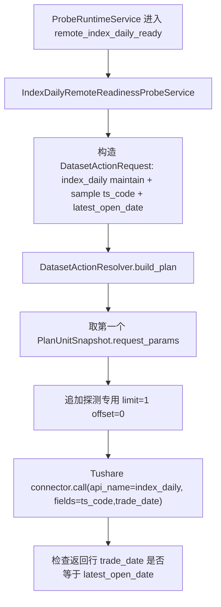

# `index_daily` 远程源站探测触发方案 v1

状态：已实现，待生产验收

创建时间：2026-06-22  
适用范围：`index_daily` 自动任务探测触发、Ops Probe Runtime、自动任务页面、Probe 运行日志。

## 1. 一句话结论

当前 `index_daily` 不支持像 `stk_mins` 那样的“源站已有数据后再触发任务”能力。

建议新增独立探测条件：

```text
remote_index_daily_ready
```

中文展示：

```text
源站已有指数日线
```

它只用于 `target_type=dataset_action` 且 `target_key=index_daily.maintain` 的自动任务。默认固定探测 5 个代表指数，且 5 个指数都命中最新开市日后，才创建一个 `index_daily.maintain` TaskRun，`time_input` 固定为最新开市日单点维护。

## 2. 背景

当前自动任务已有两类探测口径：

| 条件 | 看哪里 | 证明什么 |
| --- | --- | --- |
| `freshness_latest_open` | 本地 freshness | 本地数据已经到最新开市日 |
| `remote_stk_mins_ready` | Tushare `stk_mins` 源站 | 源站已经可以返回最新开市日分钟行情 |

`index_daily` 的诉求属于第二类：运营希望在源站指数日线已经更新后，再自动发起维护任务。

如果继续使用 `freshness_latest_open`，会出现语义反了的问题：它只能证明“本地已经有最新数据”，不能证明“源站已经可以拉取最新数据”。

## 3. 当前代码事实

### 3.1 Probe 当前主链

已通过 CodeGraph 与当前代码核验：

1. `src/ops/services/schedule_probe_binding_service.py`
   - 当前 `SUPPORTED_PROBE_CONDITIONS` 只包含 `freshness_latest_open` 与 `remote_stk_mins_ready`。
   - `remote_stk_mins_ready` 当前只允许绑定 `stk_mins.maintain`。
   - Probe 规则由 `ops.schedule` 的 `probe_config_json` 派生，目标对象使用 `target_type/target_key`。
2. `src/ops/services/operations_probe_runtime_service.py`
   - `_evaluate_rule()` 当前只把 `remote_stk_mins_ready` 分发给 `StkMinsRemoteReadinessProbeService`。
   - 其他非 `freshness_latest_open` 条件会直接报“不支持的探测条件”。
   - `_enqueue_on_match()` 当前只对 `remote_stk_mins_ready` 做源站探测命中后的日期注入。
3. `src/ops/services/stk_mins_remote_probe_service.py`
   - 当前源站探测服务是 `stk_mins` 专用，不适合直接扩成“通用探测器”。
   - 它的正确设计点是：探测请求仍走 `DatasetActionResolver -> request builder`，Ops 不自己拼源接口日期参数。
4. `frontend/src/pages/ops-v21-task-auto-tab.tsx`
   - 自动任务页当前只在选择 `stk_mins.maintain` 时展示 `remote_stk_mins_ready`。
   - 非 `stk_mins` 数据集不会展示源站分钟行情探测选项。

### 3.2 `index_daily` 当前维护口径

已核验代码与文档：

1. 源接口文档：`docs/sources/tushare/指数专题/0095_指数日线行情.md`
   - API：`index_daily`
   - 必填：`ts_code`
   - 可选：`trade_date`、`start_date`、`end_date`、`limit`、`offset`
   - 单次最多 8000 行。
2. `src/foundation/datasets/definitions/index_series.py`
   - `index_daily` 使用 `request_builder_key="_index_daily_params"`。
   - `date_model` 是交易日单点或区间语义。
   - `planning.unit_builder_key="build_index_daily_units"`。
   - `planning.page_limit=8000`。
3. `src/foundation/ingestion/unit_planner.py`
   - `_build_index_daily_units()` 默认读取 `ops.index_series_active resource='index_daily_raw'` 作为源站请求池。
   - 如果运营显式传入 `ts_code`，只维护显式代码。
4. `src/foundation/ingestion/request_builders.py`
   - `_index_daily_params()` 单日请求最终生成 `ts_code + trade_date`。
   - 区间请求最终生成 `ts_code + start_date + end_date`。
   - 缺少 `ts_code` 会报错。
5. `docs/datasets/index-raw-serving-layer-alignment-plan-v1.md`
   - 当前确认口径是：`index_daily_raw` 请求池决定源站请求范围，`index_daily` active 池只作为 serving 入库门禁。

### 3.3 Tushare 最小真实验证

已用 `tushareMcp.index_daily` 做最小样本验证：

```json
{
  "ts_code": "000001.SH",
  "trade_date": "20260424",
  "fields": ["ts_code", "trade_date"]
}
```

返回：

```json
[
  {
    "ts_code": "000001.SH",
    "trade_date": "20260424"
  }
]
```

结论：`index_daily` 可以用 `ts_code + trade_date + 最小 fields` 做轻量源站探测。

开发前仍需要再做一次当日或最新开市日样本验证，确认当前源站更新时间与返回字段没有漂移。

## 4. 目标

1. 为 `index_daily` 新增真正的远程源站可用性探测条件。
2. 探测命中后，自动创建 `index_daily.maintain` TaskRun。
3. 探测只做少量 Tushare 样本请求，不写业务表，不刷新 freshness，不修改 `raw_tushare.index_daily`。
4. 探测请求参数必须沿用 `DatasetDefinition -> DatasetActionResolver -> request builder` 的主链口径。
5. 保持正式 `index_daily` 维护任务仍由 ingestion 主链执行；probe 只决定“现在是否可以发起任务”。

## 5. 非目标

1. 不修改 `index_daily` writer、DAO、表结构、raw/serving 写入策略。
2. 不修改 `index_daily_raw` 请求池与 `index_daily` serving 门禁池口径。
3. 不新增数据库表，不新增 Alembic 迁移。
4. 不改变 `freshness_latest_open` 现有语义。
5. 不把 `remote_stk_mins_ready` 改成通用探测器。
6. 不支持 workflow 级探测；V1 只支持 `target_type=dataset_action`。
7. 不在 V1 暴露样本指数代码 UI。

## 6. 新增探测条件

新增：

```text
condition_kind = remote_index_daily_ready
```

展示文案：

```text
源站已有指数日线
```

语义：

```text
在探测窗口内，针对最新开市日，用少量指数代码请求 Tushare index_daily。
如果 5 个默认代表指数都返回最新开市日的指数日线行，则认为源站已准备好，可以发起正式 index_daily 维护任务。
```

它与 `freshness_latest_open` 的区别：

| 条件 | 数据来源 | 证明内容 | 适用场景 |
| --- | --- | --- | --- |
| `freshness_latest_open` | 本地业务表和 snapshot | 本地已经有最新开市日数据 | 下游任务触发、状态确认 |
| `remote_index_daily_ready` | Tushare `index_daily` 源站 | 源站已经返回最新开市日指数日线 | `index_daily` 拉取前置触发 |

## 7. 探测日期

探测日期必须来自交易日历，不允许用自然日猜。

规则：

1. 以北京时间当前日期作为业务日。
2. 从交易日历读取当天记录。
3. 若当天不是交易日，则本轮探测直接 miss，不创建 TaskRun。
4. 若当天是交易日，则 `latest_open_date = 当天日期`。
5. 探测请求使用：

```json
{
  "time_input": {
    "mode": "point",
    "trade_date": "<latest_open_date>"
  }
}
```

命中后创建 TaskRun 时也使用同一个 `trade_date`。

这样保证 probe 判断的是哪天，正式维护就拉哪天，不出现“探测今天、任务却跑默认日期”的错位。

## 8. 样本指数选择

### 8.1 默认样本

默认样本必须来自当前 `index_daily` 源站请求池：

```text
ops.index_series_active resource='index_daily_raw'
```

默认代表指数固定为：

```text
000001.SH
399001.SZ
399300.SZ
000016.SH
000905.SH
```

规则：

1. 这 5 个指数必须全部存在于 `index_daily_raw` 请求池。
2. 缺少任意一个默认代表指数时，探测失败，并提示“指数日线默认探测样本未配置完整”。
3. 不做 fallback，不从请求池里临时换其他指数。

原因：

1. `index_daily` 正式维护默认就是按 `index_daily_raw` 请求池请求源站。
2. 探测样本不能使用 `index_daily` serving 门禁池，也不能临时改用 `index_basic`。
3. 固定样本能让触发标准稳定可解释，避免今天探测 A 指数、明天探测 B 指数导致判断口径漂移。
4. 样本只用于证明源站已返回当日行情，不代表正式任务的请求范围。

### 8.2 显式 `ts_code`

如果自动任务 `params_json.filters.ts_code` 显式配置了指数代码：

1. 探测样本优先使用显式代码。
2. 最多取 5 个显式代码。
3. 显式代码不再额外读取 `index_daily_raw` 请求池。
4. 显式样本也必须全部命中，才允许创建 TaskRun。

原因：显式代码任务应验证它自己的维护对象。

## 9. 探测请求生成方式

禁止 Ops 自己拼：

```text
ts_code/trade_date/start_date/end_date
```

实现必须走主链：



关键约束：

1. `DatasetActionResolver` 仍是日期模型和 unit 语义的入口。
2. `_index_daily_params()` 仍是源接口参数的唯一生成位置。
3. Probe 只覆盖 `limit/offset` 和最小字段，这是探测成本控制，不改变正式同步参数。

## 10. 命中判定

单个样本请求：

1. 请求成功但无行：记为 miss。
2. 请求成功且返回行 `trade_date` 不是目标日期：记为 miss。
3. 请求成功且至少一行 `trade_date == latest_open_date`：记为 hit。
4. 请求报错：本轮 probe 记为 failed，不创建 TaskRun。

整体判定：

1. 默认样本固定为 5 个代表指数，必须全部 hit，才算整体命中。
2. 显式 `ts_code` 样本必须全部 hit，才算整体命中。
3. 任意样本 miss，则本轮不创建 TaskRun。

命中后创建 TaskRun：

```json
{
  "task_type": "dataset_action",
  "resource_key": "index_daily",
  "action": "maintain",
  "trigger_source": "probe",
  "time_input": {
    "mode": "point",
    "trade_date": "<latest_open_date>"
  },
  "filters": "<继承 schedule params_json.filters>",
  "request_payload": {
    "run_scope": "probe_triggered"
  }
}
```

## 11. 自动任务配置规则

### 11.1 允许范围

只允许：

```text
target_type = dataset_action
target_key = index_daily.maintain
trigger_mode in [probe, schedule_probe_fallback]
condition_kind = remote_index_daily_ready
```

### 11.2 禁止组合

必须拒绝：

1. 绑定到非 `index_daily.maintain`。
2. 绑定到 workflow。
3. 与 `calendar_policy` 混用。
4. 与固定 `trade_date` 混用。
5. 与非 point 的 `time_input` 混用。

原因：

1. 源站探测负责决定“哪一天可以发起任务”，不能再让 schedule 传入另一套固定日期。
2. V1 只解决指数日线一个数据集，不扩大到 workflow，避免内部步骤刷屏或语义不清。

## 12. API 示例

```json
{
  "target_type": "dataset_action",
  "target_key": "index_daily.maintain",
  "display_name": "指数日线源站就绪后同步",
  "schedule_type": "cron",
  "trigger_mode": "probe",
  "cron_expr": "*/5 16-20 * * 1-5",
  "timezone": "Asia/Shanghai",
  "probe_config": {
    "source_key": "tushare",
    "window_start": "16:00",
    "window_end": "20:00",
    "probe_interval_seconds": 300,
    "max_triggers_per_day": 1,
    "condition_kind": "remote_index_daily_ready"
  },
  "params_json": {
    "time_input": {
      "mode": "point"
    },
    "filters": {}
  }
}
```

若只想维护指定指数：

```json
{
  "params_json": {
    "time_input": {
      "mode": "point"
    },
    "filters": {
      "ts_code": ["000001.SH", "399001.SZ"]
    }
  }
}
```

## 13. 页面交互

自动任务页调整：

1. 当选择 `index_daily.maintain` 时，探测条件下拉框新增“源站已有指数日线”。
2. 非 `index_daily.maintain` 不展示该选项。
3. 选择纯探测触发时，沿用现有交互：隐藏执行时间，只展示探测窗口。
4. 选择“定时 + 探测兜底”时，沿用现有交互：执行时间展示为“兜底执行时间”。
5. 维护参数区保持当前规则；如果有必填维护参数，不应折叠。

页面说明建议：

```text
在探测窗口内请求少量指数样本；源站返回最新交易日指数日线后，自动提交指数日线维护任务。
```

## 14. 开发步骤

| 阶段 | 目标 | 改动点 |
| --- | --- | --- |
| M0 | 开发前复核 | 读取 AGENTS、本文档、`index_daily` 源接口文档；用 `tushareMcp.index_daily` 对 5 个默认代表指数再做最新开市日样本验证 |
| M1 | 后端契约 | 增加 `REMOTE_INDEX_DAILY_READY_CONDITION`，扩展 `SUPPORTED_PROBE_CONDITIONS` |
| M2 | 绑定校验 | `ScheduleProbeBindingService` 新增 `remote_index_daily_ready` 校验，只允许 `index_daily.maintain` |
| M3 | 探测服务 | 新增 `IndexDailyRemoteReadinessProbeService`，按 `index_daily_raw` 请求池或显式 `ts_code` 选样本 |
| M4 | 运行时分发 | `ProbeRuntimeService._evaluate_rule()` 分发新条件；`_enqueue_on_match()` 注入 `latest_open_date` |
| M5 | 前端展示 | 自动任务页仅在 `index_daily.maintain` 下展示“源站已有指数日线” |
| M6 | API 文档 | 更新 `docs/ops/ops-api-reference-v1.md` 的 `ScheduleProbeConfig.condition_kind` |
| M7 | 测试护栏 | 后端、前端、API 文档检查全部覆盖 |

## 15. 测试计划

### 15.1 后端

1. 创建 schedule 时，`remote_index_daily_ready + index_daily.maintain` 允许通过。
2. `remote_index_daily_ready` 绑定非 `index_daily.maintain` 必须失败。
3. `remote_index_daily_ready` 绑定 workflow 必须失败。
4. 与 `calendar_policy` 混用必须失败。
5. 与固定 `trade_date` 混用必须失败。
6. `index_daily_raw` 请求池缺少任意一个默认代表指数时，探测失败且不创建 TaskRun。
7. 5 个默认代表指数都返回目标 `trade_date` 时，创建 `index_daily.maintain` TaskRun。
8. 只有部分默认代表指数命中时，不创建 TaskRun。
9. 源站无行、返回非目标日期、Tushare 报错时，不创建 TaskRun。
10. 显式 `filters.ts_code` 时，不读取默认请求池。
11. 显式 `filters.ts_code` 时，显式样本必须全部命中才创建 TaskRun。
12. 探测请求参数必须来自 `DatasetActionResolver` 生成的 unit。

### 15.2 前端

1. 选择 `index_daily.maintain` 时显示“源站已有指数日线”。
2. 选择非 `index_daily.maintain` 时不显示该选项。
3. 保存 payload 正确写入 `probe_config.condition_kind="remote_index_daily_ready"`。
4. 纯探测触发隐藏执行时间；定时 + 探测兜底显示“兜底执行时间”。

### 15.3 回归命令

建议开发完成后运行：

```bash
uv run ruff check src/ops tests/web frontend/src/pages/ops-v21-task-auto-tab.tsx
uv run pytest -q tests/web/test_ops_schedule_api.py tests/web/test_ops_probe_api.py
uv run python scripts/check_docs_integrity.py
```

前端定向测试按仓库当前前端测试命令执行。

## 16. 风险与控制

| 风险 | 控制 |
| --- | --- |
| 把 serving active 池误用成源站请求池 | 探测样本只允许来自 `index_daily_raw` 或显式 `ts_code` |
| Ops 自己拼源接口参数 | 必须走 `DatasetActionResolver -> _index_daily_params()` |
| 非交易日误触发 | 非交易日直接 miss，不创建 TaskRun |
| workflow 被误触发多次 | V1 禁止 workflow |
| 源站局部指数未更新导致误判 | V1 要求 5 个默认代表指数全部命中，降低单指数提前返回造成的误触发 |
| 与 freshness 语义混淆 | 新条件只证明源站可拉，不修改 `freshness_latest_open` |

## 17. 已拍板项

已确认：

1. 默认代表指数固定为 `000001.SH / 399001.SZ / 399300.SZ / 000016.SH / 000905.SH`。
2. 默认 5 个代表指数必须全部命中，才可以触发任务开始。

当前没有待拍板阻塞项。

## 18. 验收标准

完成标准：

1. 自动任务页选择 `index_daily.maintain` 时可配置“源站已有指数日线”。
2. 后端拒绝所有非法绑定组合。
3. 5 个默认代表指数全部命中后，只创建一个 `index_daily.maintain` TaskRun。
4. TaskRun 的 `trade_date` 与 probe 命中的最新开市日一致。
5. 探测过程不写业务表、不刷新 freshness、不改变 `index_daily` raw/serving 写入口径。
6. 相关后端、前端、文档检查通过。
