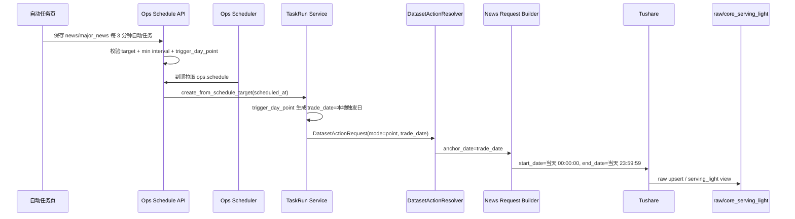

# Ops 新闻日内高频自动任务方案 v1

状态：已实现，待实际自动任务配置验收  
创建日期：2026-05-14  
适用范围：仅 `news` 新闻快讯、`major_news` 新闻通讯的自动任务高频维护。

## 1. 目标

运营希望新闻快讯、新闻通讯可以按日内高频自动更新，例如每 3 分钟请求一次源接口。第一版目标是：

- 只对 `news` 和 `major_news` 开放日内高频策略。
- 最小间隔固定为 3 分钟，不允许小于 3 分钟。
- 自动任务触发时，后端按触发时间所在自然日生成 `trade_date`。
- 新闻 request builder 继续把 `trade_date` 转成源接口的当天时间窗口。
- 不实现“最近 N 分钟滚动窗口”，第一版用“当天窗口 + 幂等写入”保证不漏。

## 2. 非目标

- 不开放给其它数据集。
- 不新增用户自定义分组或新数据集模型。
- 不改新闻源接口请求字段含义。
- 不引入 cursor/checkpoint/acquire/定点重跑。
- 不把前端选择的日内策略直接展开成源接口 `start_date/end_date`。

## 3. 当前代码审计

### 3.1 后端调度能力

当前 `src/ops/services/schedule_planner.py` 已支持标准 5 段 cron。

`_parse_field()` 支持 `*/3` 这样的步长表达式，`_next_cron_occurrence()` 按分钟向后寻找下一次命中时间。因此后端计算层已经可以处理：

```text
*/3 * * * *
```

现有限制不在后端 cron parser，而在前端表单。

### 3.2 前端自动任务入口

当前 `frontend/src/pages/ops-v21-task-auto-tab.tsx` 的 `RepeatMode` 只有：

```text
daily / weekly / monthly
```

`buildCronExpression()` 只会生成每天、每周、每月三类表达式。页面没有“每 N 分钟”入口，也没有限制“只对新闻快讯/新闻通讯开放”的策略判断。

### 3.3 TaskRun 日期传导

当前 `src/ops/services/task_run_service.py` 已有几类 `calendar_policy`：

| 策略 | 当前用途 |
| --- | --- |
| `monthly_last_day` | 触发时生成自然月最后一天 `trade_date` |
| `monthly_last_trading_day` | 触发时查交易日历，生成每月最后交易日 `trade_date` |
| `monthly_window_current_month` | 触发时生成当月 `start_month/end_month` |
| `trigger_day_single_range` | 触发时生成自然日单日 `start_date/end_date` |

目前还没有“触发日作为 point 日期”的策略，所以新闻高频自动任务不能只靠 cron 解决。

### 3.4 新闻数据集请求链路

`src/foundation/datasets/definitions/news.py` 中：

| 数据集 | display_name | source api | date_model | unit_builder |
| --- | --- | --- | --- | --- |
| `news` | 新闻快讯 | `news` | `trade_date_or_start_end` | `build_news_units` |
| `major_news` | 新闻通讯 | `major_news` | `trade_date_or_start_end` | `build_major_news_units` |

`src/foundation/ingestion/unit_planner.py` 中，`news` 和 `major_news` 的 point 任务要求 `request.trade_date` 存在。

`src/foundation/ingestion/request_builders.py` 中：

- `_news_params()` 会把 `anchor_date=2026-05-14` 转成：

```json
{
  "start_date": "2026-05-14 00:00:00",
  "end_date": "2026-05-14 23:59:59"
}
```

- `_major_news_params()` 同理转成当天 `00:00:00 ~ 23:59:59`。
- 两者都会按 `src` 来源扇出，`news` 单次 limit 为 1500，`major_news` 单次 limit 为 400。

结论：新增策略只需要把自动任务触发时的自然日传给 `DatasetTimeInput.trade_date`，不要在 Ops 层生成源接口时间参数。

## 4. 最终口径

新增 `calendar_policy`：

```text
trigger_day_point
```

含义：

1. 只支持 `schedule_type=cron`。
2. 只支持 `target_type=dataset_action`。
3. 只允许 `target_key in {"news.maintain", "major_news.maintain"}`。
4. 触发时使用 `scheduled_at + timezone` 计算本地自然日。
5. 生成 TaskRun：

```json
{
  "time_input": {
    "mode": "point",
    "trade_date": "2026-05-14"
  }
}
```

6. `DatasetActionResolver` 按现有 point 逻辑生成计划。
7. 新闻 request builder 再生成源接口时间窗口：

```json
{
  "start_date": "2026-05-14 00:00:00",
  "end_date": "2026-05-14 23:59:59"
}
```

## 5. 调度表达

新增前端重复方式：

```text
每 N 分钟
```

第一版规则：

| 项目 | 规则 |
| --- | --- |
| 可见对象 | 仅 `news`、`major_news` |
| 最小间隔 | 3 分钟 |
| 默认间隔 | 3 分钟 |
| cron 表达式 | `*/N * * * *` |
| calendar_policy | `trigger_day_point` |
| 固定维护日期 | 禁止展示、禁止混用 |

当运营选择“每 3 分钟”时，保存 payload 应类似：

```json
{
  "target_type": "dataset_action",
  "target_key": "news.maintain",
  "schedule_type": "cron",
  "cron_expr": "*/3 * * * *",
  "timezone": "Asia/Shanghai",
  "calendar_policy": "trigger_day_point",
  "params_json": {
    "dataset_key": "news",
    "action": "maintain",
    "time_input": {
      "mode": "point"
    },
    "filters": {}
  }
}
```

说明：`params_json.time_input.mode=point` 只是表达“point 任务”，不携带固定日期；真实日期由后端 `trigger_day_point` 在触发时生成。

## 6. 读写时序



## 7. 修改范围

### 7.1 后端

1. `src/ops/services/schedule_planner.py`
   - `SUPPORTED_CALENDAR_POLICIES` 增加 `trigger_day_point`。
   - `compute_next_run_at()` 对该策略继续走普通 cron。

2. `src/ops/services/operations_schedule_service.py`
   - 增加 `TRIGGER_DAY_POINT_POLICY`。
   - 创建/更新自动任务时校验：
     - 只能 cron。
     - 只能 dataset_action。
     - 只能 `news.maintain` / `major_news.maintain`。
     - cron 必须是分钟间隔表达式，间隔 `>= 3`。
     - 不允许与固定 `trade_date/start_date/end_date` 混用。

3. `src/ops/services/task_run_service.py`
   - 增加 `trigger_day_point` 处理。
   - 用 `_natural_day_for_schedule(scheduled_at, timezone)` 生成 `trade_date`。
   - 返回 `{"mode": "point", "trade_date": "YYYY-MM-DD"}`。

4. `tests/web/test_ops_schedule_api.py`
   - 覆盖可创建 `news` / `major_news` 高频任务。
   - 覆盖低于 3 分钟被拒绝。
   - 覆盖非新闻数据集使用该策略被拒绝。

5. `tests/web/test_ops_runtime.py`
   - 覆盖 scheduler 触发后 TaskRun 得到触发日 `trade_date`。

### 7.2 前端

1. `frontend/src/pages/ops-v21-task-auto-tab.tsx`
   - `RepeatMode` 增加 `intraday_interval`。
   - 仅当选中 `target_key` 为 `news` 或 `major_news` 时展示“每 N 分钟”。
   - 最小值校验为 3。
   - 生成 `cron_expr=*/N * * * *`。
   - 生成 `calendar_policy=trigger_day_point`。
   - 对该策略隐藏固定维护日期输入。

2. `frontend/src/pages/ops-v21-task-auto-tab.test.tsx`
   - 覆盖 news/major_news 推荐日内策略。
   - 覆盖 `*/3 * * * *` 解析与展示。
   - 覆盖非新闻对象不出现该策略。

## 8. 验收标准

### 8.1 功能验收

1. 自动任务页选择“新闻快讯”时，可选“每 N 分钟”，默认 3。
2. 自动任务页选择“新闻通讯”时，可选“每 N 分钟”，默认 3。
3. 其它数据集不出现“每 N 分钟”。
4. N 小于 3 时不能保存。
5. 保存后的 `ops.schedule`：
   - `cron_expr=*/3 * * * *`
   - `calendar_policy=trigger_day_point`
6. scheduler 触发时生成 TaskRun：
   - `time_input.mode=point`
   - `time_input.trade_date=触发时间所在北京时间自然日`
7. request builder 最终请求源接口当天全日窗口。

### 8.2 回归门禁

后端：

```bash
pytest -q tests/web/test_ops_schedule_api.py
pytest -q tests/web/test_ops_runtime.py
pytest -q tests/test_ops_schedule_planner.py
ruff check src/ops/services/schedule_planner.py src/ops/services/operations_schedule_service.py src/ops/services/task_run_service.py tests/web/test_ops_schedule_api.py tests/web/test_ops_runtime.py tests/test_ops_schedule_planner.py
```

前端：

```bash
cd frontend && npm run test -- ops-v21-task-auto-tab.test.tsx
cd frontend && npm run typecheck
```

文档：

```bash
python3 scripts/check_docs_integrity.py
```

## 9. 风险与控制

| 风险 | 控制 |
| --- | --- |
| 高频任务打爆请求额度 | V1 最小间隔 3 分钟，且只开放两个新闻数据集 |
| 当天窗口重复拉取导致重复数据 | 依赖现有 `row_key_hash` 与 upsert 幂等写入 |
| 误把策略开放给其它数据集 | 后端 target_key 硬校验，前端只做辅助展示 |
| 固定日期与触发日策略混用 | 后端拒绝固定时间边界参数 |
| 前端自行展开源接口参数 | 禁止；前端只保存意图，日期展开由 TaskRun/Resolver/Builder 完成 |

## 10. 实施 Milestone

| Milestone | 内容 | 验收 |
| --- | --- | --- |
| M1 | 后端 calendar policy 支持 `trigger_day_point` | 已完成，schedule API 与 runtime 测试通过 |
| M2 | 前端自动任务页新增“每 N 分钟”入口 | 已完成，前端定向测试和 typecheck 通过 |
| M3 | 本地或远程创建 news/major_news 测试任务验证 | 待实际配置验证；代码级 scheduler 测试已覆盖 TaskRun 日期传导 |
| M4 | 文档与 API 说明收口 | 已完成，docs integrity 通过 |

## 11. 当前结论

本方案与现有架构一致：

- Ops 只保存调度意图和任务意图。
- TaskRun 在触发时生成 `trade_date`。
- DatasetActionResolver 负责把 point 请求归一化为执行计划。
- request builder 只负责把执行计划中的日期格式化成源接口参数。

本轮没有待决策项。已确认口径为：仅 `news` / `major_news`，最小 3 分钟，触发日 point，全日窗口，幂等去重。
