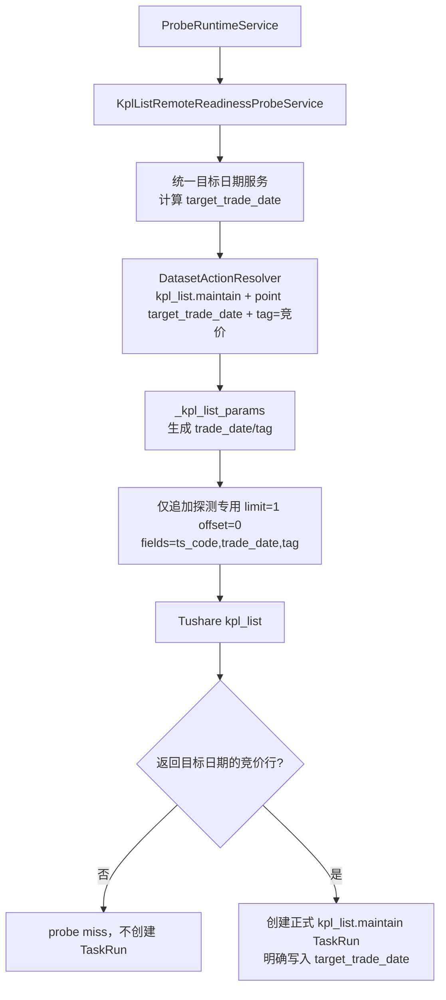
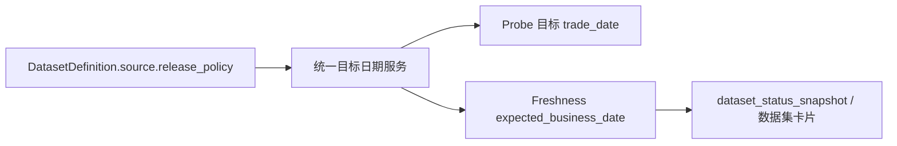

# `kpl_list` 次日发布适配与自动维护方案 v1

状态：已实现，待生产验收
创建时间：2026-07-28
适用范围：`kpl_list` 的自动任务、源站探测、freshness 判定、数据源卡片与运行验收。
不适用范围：`kpl_list` 的写入模型、表结构、历史数据清理、其他数据集的自动任务。

## 1. 结论

开盘啦榜单不是“收盘后当天即可拉取”的数据集。Tushare 文档明确其数据在**交易日的下一自然日 08:30 后**更新。

因此，当前在交易日 `D` 的 18:30、21:02、23:30 请求 `D` 的做法必然经常拿到空数据；空响应目前会让 TaskRun 成功结束，却不会在 `D+1` 回头补拉 `D`，最终形成持续缺口。

本方案把这个发布节奏定义为 `kpl_list` 的单一源端事实，并由同一套目标日期计算同时服务于：

1. 源站探测：只在源站已经发布某个交易日 `D` 的榜单后，才创建 `kpl_list.maintain(D)`。
2. freshness：页面在源端尚未到发布时点时，不把尚未发布的业务日误判为“滞后”。

不采用“每天固定 09:00 跑一次”的方案。它无法覆盖周五数据在周六才可用的情况，也无法处理源端晚于 08:30 的延迟发布。

## 2. 已确认事实

### 2.1 源端发布事实

来源：`docs/sources/tushare/股票数据/打板专题数据/0347_开盘啦榜单数据.md`。

| 项目 | 当前事实 |
| --- | --- |
| API | `kpl_list` |
| 数据更新时间 | 交易日数据在下一自然日 08:30 更新 |
| 时间输入 | `trade_date` 或 `start_date/end_date` |
| 必须覆盖标签 | `涨停`、`炸板`、`跌停`、`自然涨停`、`竞价` |
| 分页 | `limit/offset` |

以北京时间表示，交易日 `D` 的可用时点为：

```text
release_at(D) = D 的下一自然日 08:30
```

这里的“下一自然日”不是“下一交易日”。例如周五 `D` 的数据在周六 08:30 后应可用，不能等到周一。

### 2.2 2026-07-28 生产只读核验

本轮已通过远程只读数据库和 `tushareMcp.kpl_list` 核验：

| 交易日 | Tushare 五类标签合计行数 | 当前 raw/core 是否已有 |
| --- | ---: | --- |
| 2026-07-22 | 278 | 已有，raw 与 serving 一致 |
| 2026-07-23 | 398 | 缺失 |
| 2026-07-24 | 271 | 缺失 |
| 2026-07-27 | 402 | 缺失 |

同一时点（2026-07-28 13:12）请求当日 2026-07-28 的五类标签均返回 0 行，而 2026-07-27 已完整返回。这与“次日 08:30 更新”的源端说明一致。

当前 `ops.dataset_status_snapshot` 对 `kpl_list` 的事实为：最近业务日期 2026-07-22、最近成功时间 2026-07-27 23:30、期望日期 2026-07-27、状态滞后。该“最近成功”其实是空跑成功，并不代表拿到了 2026-07-27 的数据。

### 2.3 当前代码为何会漏数

已审计下列主链：

1. `src/foundation/datasets/definitions/board_hotspot.py`
   - `kpl_list` 是 `trade_open_day + every_open_day`，正式维护按五个 `tag` 扇出。
2. `src/foundation/ingestion/request_builders.py`
   - `_kpl_list_params()` 将 unit 的锚点传为 Tushare `trade_date`。
3. `src/ops/runtime/task_run_dispatcher.py`
   - 点日期任务未明确填写日期时，自动取“当前日及以前最近一个开市日”。
4. `src/ops/action_catalog.py`
   - 改造前 `kpl_list` 位于 `daily_market_close_maintenance`，会在交易日当晚发起尚未发布的数据请求。
5. `src/ops/services/task_run_service.py`
   - 当前自动任务日期策略没有“上一已发布交易日”的语义。
6. `src/ops/queries/freshness_query_service.py`
   - 改造前 `continuous_open_day` 直接以最近开市日作为期望日期，不知道源端需要次日发布。

改造前的三个自动入口分别在交易日 18:30、21:02、23:30 请求当日数据。此时源端尚未发布，返回 0 行不被判为错误；次日自动任务又会请求新的当前交易日，因此前一天的空结果没有补拉机会。

## 3. 目标与边界

### 3.1 目标

1. 自动维护只请求已经进入源端可用窗口的 `kpl_list` 交易日。
2. 周五数据可在周六完成同步；不依赖周一补拉。
3. 源端暂时延迟时，自动任务不写空数据，不把“已执行”误当“已更新”。
4. 数据源页面的 freshness 期望日期与自动探测使用同一个发布规则。
5. 正式同步仍由既有 ingestion 主链执行，探测不写业务数据。

### 3.2 明确不做

1. 不改 `kpl_list` 的 normalizer、writer、DAO、raw/core 表或幂等主键。
2. 不增加业务表、状态表、outbox、checkpoint 或 Alembic 迁移。
3. 不扩展工作流级探测；本期仅支持 `kpl_list.maintain` 单数据集动作。
4. 不自动回补任意历史日期；已有缺口须由运营明确发起一次普通区间维护。
5. 不在前端、查询层或 snapshot 中复制一份“次日 08:30”规则。

## 4. 单一事实：源端发布策略

### 4.1 最小模型扩展

在 `DatasetDefinition.source` 增加一个静态字段：

```text
release_policy
```

首期只定义两个枚举：

| 枚举 | 含义 | 默认范围 |
| --- | --- | --- |
| `same_day` | 当前开市日可作为源端目标日 | 所有未显式配置的数据集 |
| `next_calendar_day_0830` | 交易日数据在下一自然日 08:30 后可作为源端目标日 | 仅 `kpl_list` |

`kpl_list` 显式配置：

```text
source.release_policy = "next_calendar_day_0830"
```

其他数据集保持默认 `same_day`，本期不批量改动其 Definition。

### 4.2 为什么只增加一个字段

源端的发布日期是数据源事实，不是自动任务的 UI 属性，也不是 freshness 的展示规则。如果把发布时间分别写入探测服务、自动任务页面和 freshness 查询，后续一定会出现口径漂移。

本期只有两种实际行为，使用一个枚举足够表达；不新增 `release_hour`、`release_calendar`、`grace_period` 等没有当前需求的通用字段。

### 4.3 统一目标日期算法

新增一个只读目标日期计算服务，输入为：

```text
DatasetDefinition + 当前北京时间 + 交易日历
```

输出为：

```text
当前时点已经应当由源端提供数据的最新交易日
```

对 `next_calendar_day_0830`：从当前日期向前找交易日 `D`，选择第一个满足 `now >= release_at(D)` 的 `D`。

示例：

| 当前北京时间 | 应维护/应展示的最新业务日期 | 原因 |
| --- | --- | --- |
| 周二 07:00 | 上周五 | 周一数据要到周二 08:30 才应可用 |
| 周二 08:35 | 周一 | 周一数据已经过发布时点 |
| 周六 08:35 | 周五 | 周五数据周六已发布 |
| 周日任意时刻 | 周五 | 周五数据已发布，周末没有新的交易日 |

若交易日历缺少足以计算目标日的数据，服务返回“无法判定”，probe 记 failed、freshness 记为未确认；不得猜自然日或创建 TaskRun。

## 5. 自动触发设计

### 5.1 新探测条件

新增：

```text
condition_kind = remote_kpl_list_ready
```

页面文案：

```text
源站已有开盘啦榜单
```

只允许绑定：

```text
target_type = dataset_action
target_key = kpl_list.maintain
trigger_mode = probe
```

下列组合必须由服务端拒绝：工作流、非 `kpl_list.maintain` 目标、`schedule_probe_fallback`、显式固定 `trade_date`、日期范围、`calendar_policy`。

不允许 `schedule_probe_fallback` 的原因：其兜底调度仍会按“当前开市日”生成 TaskRun，恰好与本数据集的次日发布口径相反。保留它会重新引入空跑。

### 5.2 Probe 如何请求

Probe 不自行拼 Tushare 的日期参数，必须复用正式链路：



Probe 只检查源端是否已经发布，不写 raw/core，不刷新 freshness，不影响业务事务。

### 5.3 为什么用 `竞价` 作为发布样本

建议 Probe 固定请求：

```text
tag = 竞价
```

在本轮实测的 2026-07-22、07-23、07-24、07-27 四个已发布交易日中，`竞价` 均有返回行（141、120、153、143 行）。它可以用一次轻量请求证明源站已发布本数据集；正式任务仍会完整扇出五类标签。

不逐一检查五类标签，因为某个类别自然为空不能说明源端未发布，反而会造成误 miss 和额外请求。

### 5.4 命中后的 TaskRun

命中后创建的 TaskRun 必须是普通正式维护任务：

```json
{
  "dataset_key": "kpl_list",
  "action": "maintain",
  "time_input": {
    "mode": "point",
    "trade_date": "<target_trade_date>"
  },
  "filters": {},
  "run_scope": "probe_triggered",
  "trigger_source": "probe"
}
```

正式任务仍按 Definition 既有默认值扇出 `涨停/炸板/跌停/自然涨停/竞价` 五类标签。Probe 用 `竞价` 仅是可用性样本，不缩小正式维护范围。

### 5.5 周末和跨日去重

周末不是交易日，但可能是周五数据的发布日，因此 `remote_kpl_list_ready` **不能**因为当前自然日非交易日而跳过。

Probe 命中前，按以下稳定事实去重：

```text
schedule_id + target_trade_date + trigger_source=probe
```

若已存在状态为 `queued/running/canceling/success/partial_success` 的同目标日任务，则直接跳过，不再创建第二个任务。这样周六成功后，周日不会再次请求周五数据。

若此前任务为 `failed/canceled`，允许在之后的 probe 周期再尝试一次；单个自然日仍受既有 `max_triggers_per_day=1` 约束。

## 6. Freshness 统一口径

`kpl_list` 继续使用 `continuous_open_day`，因为它描述的是业务数据应连续覆盖开市日的性质；不另造 KPL 专用 freshness policy。

需要修改的是“期望业务日期”的计算方式：



具体约束：

1. freshness 每次根据 Definition/projection 读取 `release_policy`；不得把策略复制到 `ops.dataset_status_snapshot`。
2. Snapshot 只缓存观测结果和计算后的状态，不保存另一份发布规则。
3. 卡片、API、快照重建都消费同一个 expected business date，前端不得自行推断日期。
4. 这样在周二 08:30 前，周一的 `kpl_list` 尚未被判为滞后；周二 08:30 后，若周一还未到库，才显示滞后。

## 7. 调度配置迁移

代码上线后，由运营按以下顺序调整配置：

1. 从 `daily_market_close_maintenance` 的定义中移除 `kpl_list`，避免继续生成确定为空的当日请求。
2. 停用并删除现有直接定时的 `kpl_list` 自动任务，不保留同日 fallback。
3. 新建纯 Probe 自动任务：
   - 维护对象：开盘啦榜单维护
   - 触发方式：探测触发
   - 探测条件：源站已有开盘啦榜单
   - 时区：Asia/Shanghai
   - 处理参数：无固定日期、无日期范围、无 `calendar_policy`
4. 以显式普通区间维护补齐已确认的历史缺口，再核验五类标签的 source/raw 行数。

推荐首期探测运行参数：

| 参数 | 建议值 | 原因 |
| --- | --- | --- |
| 探测窗口 | 每日 08:35 ~ 23:30 | 覆盖次日发布、周六发布和源端延迟 |
| 探测间隔 | 30 分钟 | 最多约 30 次轻量请求/日，远低于 Tushare 500 次/分钟、10000 次/日限制 |
| 每日触发上限 | 1 | 同一新目标日只需要成功创建一次正式任务 |

纯 Probe 调度没有“执行时间”；页面应只展示探测窗口和间隔。

## 8. 开发范围与步骤

### M1：Definition 与统一目标日期能力

1. 为 `DatasetSourceDefinition` 增加 `release_policy`，默认 `same_day`。
2. 为 `kpl_list` 显式写入 `next_calendar_day_0830`。
3. 新增 Ops 内的只读目标日期服务，统一读取 Definition、交易日历和当前时间。
4. 让 freshness 的期望日期计算调用该服务；不复制策略到 snapshot。

实施结果：已完成。`DatasetSourceDefinition.source.release_policy` 默认 `same_day`，仅 `kpl_list` 使用 `next_calendar_day_0830`；`DatasetReleaseTargetService` 同时供 freshness 与 KPL probe 读取。

### M2：KPL 专用 Probe

1. 新增 `KplListRemoteReadinessProbeService`，不把现有指数或分钟线 probe 泛化成多数据集大开关。
2. 扩展 Probe condition 注册、服务端绑定校验和 `ProbeRuntimeService` 分发。
3. 复用 `DatasetActionResolver -> _kpl_list_params` 生成请求参数，仅覆盖 probe 专用字段。
4. 添加按 `schedule_id + target_trade_date` 的跨日有效 TaskRun 去重。

实施结果：已完成。Probe 使用 `tag=竞价` 的 resolver/request builder 请求，并仅对同一 schedule、同一目标日且状态为 `queued/running/canceling/success/partial_success` 的正式 probe TaskRun 去重。

### M3：自动任务页面与运行配置

1. 仅选中 `kpl_list.maintain` 时显示“源站已有开盘啦榜单”。
2. 纯 probe 继续隐藏执行时间；禁用与该条件冲突的日期输入和日期策略。
3. 发布后按第 7 节的运营步骤切换现有配置；这一步是明确的运维操作，不由代码静默修改生产 schedule。

实施结果：代码部分已完成。`kpl_list` 已移出 `daily_market_close_maintenance`；自动任务页面和服务端仅允许 `kpl_list.maintain + probe` 使用新条件。生产中的既有自动任务仍需按第 7 节人工切换。

### M4：测试、文档与生产验收

1. 补齐 Definition、目标日期、Probe 绑定、Probe 请求、TaskRun 去重、freshness 和前端定向测试。
2. 更新 Ops API 参考文档和本方案状态。
3. 先做最小生产验证，再补历史缺口，最后校验卡片 freshness。

实施结果：自动化测试与文档已完成；生产验收和历史缺口补齐未在本次研发中执行。

## 9. 测试与验收

### 9.1 自动化测试

| 范围 | 必须证明的事实 |
| --- | --- |
| Definition | `kpl_list` 显式为 `next_calendar_day_0830`；其他未配置数据集保持 `same_day` |
| 目标日期 | 周二 07:00、周二 08:35、周六、周日均按第 4.3 节得到正确目标日 |
| 绑定校验 | 只允许 `kpl_list.maintain + probe`；拒绝 workflow、fallback、固定日期、范围和日期策略 |
| Probe 请求 | `trade_date/tag` 来自 resolver/request builder；probe 只追加 `limit/offset/fields` |
| Probe 结果 | 空结果或源端错误不建 TaskRun；命中创建明确目标日的 TaskRun |
| 去重 | 周六已创建周五任务后，周日不会重复；failed/canceled 可在后续自然日重新尝试 |
| Freshness | 同一 release policy 同时驱动 expected business date 与卡片状态；前端不拼日期 |
| 工作流 | `daily_market_close_maintenance` 不再包含 `kpl_list` |
| 前端 | 只在 KPL 自动任务显示条件；纯 probe 不显示执行时间 |

### 9.2 最小真实验收

1. 在源端已发布的时点，用 Probe 触发一个明确业务日 `D` 的 `kpl_list.maintain`。
2. 确认 TaskRun 的 `trade_date` 是 `D`，而不是触发当天。
3. 确认五类 tag 都被正式任务请求并写入，raw 与 serving 的 `D` 日行数一致。
4. 确认同一 schedule 在下一自然日不会对 `D` 重复创建有效 TaskRun。
5. 确认发布时点前页面不误报滞后，时点后缺失才显示滞后。
6. 历史缺口采用一次人工批准的区间任务补齐；完成后逐日比对五类 tag 的 Tushare/raw 行数。

## 10. 已确认运行参数

### D1：Probe 发布样本

确认固定使用 `tag=竞价`，命中一条目标日记录即认为源端已发布。

理由：实测的四个已发布交易日均有竞价数据；它避免五类标签逐一探测时，因某类别自然为空导致误判未发布。正式维护仍完整拉五类标签。

### D2：Probe 窗口

确认：每日（包含周末）08:35 ~ 23:30，每 30 分钟探测一次，最多触发 1 次。

理由：周五数据在周六可用，且源端偶发晚于 08:30 时仍可自动等待；上限约 30 次轻量请求/日，成本很低。

## 11. 风险与止损

1. `竞价` 若未来出现某日自然为空，Probe 会晚些触发或当日不触发，但不会写入空数据。发生时应先验证源端全标签返回，不直接把 Probe 改成多类别扫描。
2. 源端长期未发布时，系统只持续记录 Probe miss，不创建空跑 TaskRun；运营可通过 Probe 记录判断是否为源端问题。
3. 本方案不自动清理、不删除、不重建任何业务数据。历史缺口补齐必须是独立、明确的正常维护任务。
4. 若目标日期服务无法读取交易日历，必须安全地不触发任务；不能退回按自然日猜测。

## 12. 实现完成定义与待验收事项

以下代码条件已满足：

1. `kpl_list` 的次日发布事实只在 DatasetDefinition 中定义一次。
2. Probe 和 freshness 都从同一目标日期服务取值。
3. 自动任务不再在交易日当晚空跑当前交易日，也不保留错误日期的 fallback。
4. 周五数据能在周六自动维护，且跨日不重复。
5. `daily_market_close_maintenance` 不再包含 `kpl_list`；新条件拒绝 fallback、固定日期、范围和日期策略。

以下生产验收事项尚待执行，不应被误认为已经完成：

1. 按第 7 节停用旧的直接定时任务并创建纯 Probe 自动任务。
2. 在源端已发布时点确认 Probe 创建的 TaskRun 目标日正确、五类标签均写入且 raw/serving 一致。
3. 对已确认历史缺口执行明确的普通区间维护，并完成 source/raw/core 核验。
