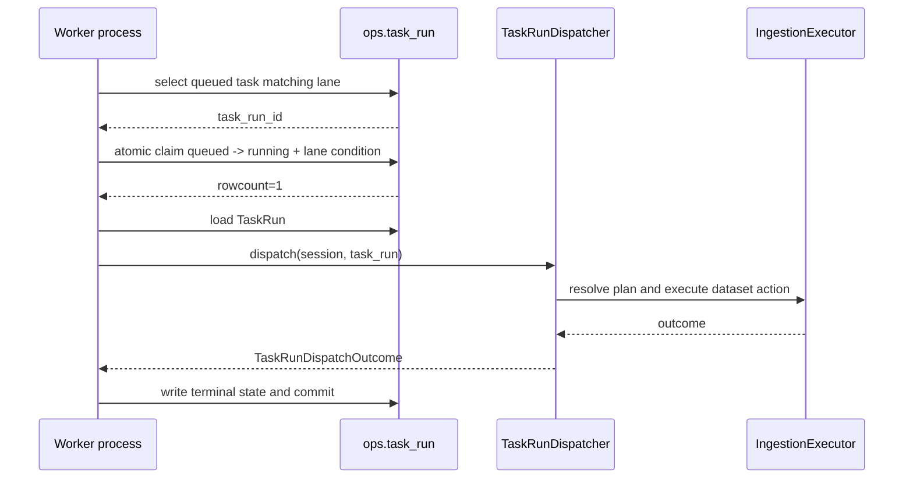

# 分钟线数据集独立执行车道 LLD v1

状态：已实现，待本地验证与生产验收  
依据方案：[分钟线数据集独立执行车道方案 v1](/Users/congming/github/goldenshare/docs/ops/ops-stk-mins-dedicated-worker-execution-lane-plan-v1.md)  
更新时间：2026-08-20  
适用范围：`stk_mins`、`index_mins` 的 Ops TaskRun 消费隔离

## 1. LLD 目标与边界

### 1.1 目标

在不改变现有任务事实源和 ingestion 主链的前提下，增加三条运行时消费车道：

```text
ops.task_run
  ├─ general worker：除 stk_mins/index_mins 外的 TaskRun
  ├─ stk_mins worker：仅 resource_key=stk_mins
  └─ index_mins worker：仅 resource_key=index_mins
```

三条车道共享同一套 `OperationsWorker`、`TaskRunDispatcher`、`DatasetActionResolver`、`DatasetExecutionPlan` 和 `IngestionExecutor`；差异只存在于 worker 领取任务前的车道过滤。

### 1.2 明确不做

- 不新增 `ops.task_run` 字段、任务表、队列表或迁移。
- 不新增第二套 dispatcher、resolver、executor、writer 或 DAO。
- 不修改 `stk_mins`/`index_mins` 的 DatasetDefinition、planner、request builder、分页、限速和事务。
- 不修改 scheduler、自动任务配置、探测服务、TaskRun API 或前端。
- 不修改 workflow 执行语义；工作流仍是一个整体 TaskRun。
- 不自动停止或中断正在执行的分钟线任务。
- 不通过启动多个同一车道进程扩大源端请求并发。

## 2. 当前代码基线

### 2.1 运行入口

| 层级 | 当前位置 | 当前职责 |
| --- | --- | --- |
| worker | `src/ops/runtime/worker.py` | 查询 queued TaskRun、原子 claim、取消排队任务、调用 dispatcher、收敛终态 |
| dispatcher | `src/ops/runtime/task_run_dispatcher.py` | 按 `task_type` 分派 dataset action/workflow/maintenance action |
| 通用工厂 | `src/app/runtime/ops_worker_factory.py` | 创建 dispatcher 与 `OperationsWorker` |
| CLI | `src/cli.py` | 注册 `ops-worker-run/serve` |
| CLI handler | `src/cli_parts/ops_handlers.py` | 执行轮询、循环、输出和通用 stale reconciliation |
| 部署 | `scripts/deploy-layered-systemd.sh` | 拉代码、同步 unit、daemon-reload、按层重启、状态输出 |

### 2.2 当前 worker 关键行为

当前 `OperationsWorker` 的以下路径都没有车道过滤：

1. `run_next()` 选择 queued TaskRun。
2. `_cancel_next_queued_task_run()` 选择已请求取消的 queued TaskRun。
3. `_claim_task_run()` 将 queued 原子更新为 running。
4. `run_task_run()` 按 TaskRun ID 显式执行。
5. `_cancel_queued_task_run()` 将 queued 更新为 canceled。

本次必须让同一套车道规则覆盖这五个位置。只在 `run_next()` 的第一层查询加过滤是不完整的，可能造成专用 worker 越权或显式执行绕过车道。

### 2.3 任务身份事实

直接数据集任务的事实字段为：

```text
task_type = "dataset_action"
resource_key = dataset_key
action = "maintain"
```

本期分钟线判定只读取 `task_type` 和 `resource_key`，不解析 `request_payload_json`、`plan_snapshot_json` 或前端参数。

## 3. 运行时车道策略

### 3.1 新增策略模块

建议新增：

```text
src/ops/runtime/worker_lane.py
```

模块只定义运行时消费策略，不定义数据库模型，不保存状态。

建议接口：

```python
from enum import StrEnum


class WorkerLane(StrEnum):
    GENERAL = "general"
    STK_MINS = "stk_mins"
    INDEX_MINS = "index_mins"


MINUTE_DATASET_KEYS = frozenset({"stk_mins", "index_mins"})


def lane_matches_values(
    lane: WorkerLane,
    *,
    task_type: str | None,
    resource_key: str | None,
) -> bool:
    ...


def lane_task_filter(lane: WorkerLane):
    ...
```

`lane_matches_values()` 用于显式 TaskRun 校验和单元测试；`lane_task_filter()` 返回 SQLAlchemy 条件，用于 queued 查询和原子 update。两者必须共享同一组常量和同一份语义。

### 3.2 车道真值表

| `lane` | `task_type` | `resource_key` | 结果 |
| --- | --- | --- | --- |
| `GENERAL` | 非 `dataset_action` | 任意，包括 `NULL` | 允许 |
| `GENERAL` | `dataset_action` | 非 `stk_mins/index_mins` | 允许 |
| `GENERAL` | `dataset_action` | `stk_mins` | 拒绝 |
| `GENERAL` | `dataset_action` | `index_mins` | 拒绝 |
| `STK_MINS` | `dataset_action` | `stk_mins` | 允许 |
| `STK_MINS` | 其他 | 任意 | 拒绝 |
| `INDEX_MINS` | `dataset_action` | `index_mins` | 允许 |
| `INDEX_MINS` | 其他 | 任意 | 拒绝 |

通用车道的 SQL 条件必须显式处理 `resource_key IS NULL`，不能直接使用带 `NULL` 三值逻辑的 `NOT IN`，否则 workflow TaskRun 可能被错误排除。

### 3.3 `OperationsWorker` 注入车道

调整构造函数：

```python
class OperationsWorker:
    def __init__(
        self,
        dispatcher: TaskRunDispatcher | None = None,
        *,
        lane: WorkerLane = WorkerLane.GENERAL,
    ) -> None:
        self.dispatcher = dispatcher or TaskRunDispatcher()
        self.lane = lane
```

默认值保持 `GENERAL`，保证所有既有调用方仍能创建通用 worker；通用 worker 的新语义是排除两个分钟线数据集。

## 4. TaskRun 领取与状态时序

### 4.1 普通消费时序



### 4.2 领取规则

`run_next(session)` 的顺序保持不变：先处理本车道已请求取消的 queued TaskRun，再领取本车道可执行的 queued TaskRun。

两次查询都必须附加 `lane_task_filter(self.lane)`：

```python
select(TaskRun.id).where(
    TaskRun.status == "queued",
    TaskRun.cancel_requested_at.is_(None),
    lane_task_filter(self.lane),
)
```

实际实现可使用连续 `.where()`，但不能只在 Python 取出后再判断，因为其他 worker 可能在此期间领取任务。

### 4.3 原子 claim

`_claim_task_run()` 的 update 必须同时包含：

```python
TaskRun.id == task_run_id
TaskRun.status == "queued"
TaskRun.cancel_requested_at.is_(None)
lane_task_filter(self.lane)
```

这样即使两个不同车道同时看到同一个候选 ID，也只有满足车道的 worker 能成功更新；`rowcount != 1` 继续走现有 rollback/retry 语义。

### 4.4 取消排队任务

`_cancel_next_queued_task_run()` 的选择和 `_cancel_queued_task_run()` 的原子 update 都必须附加车道条件。用户发起取消不会直接改状态；对应 worker 在自己的车道轮询中收敛 `queued + cancel_requested_at IS NOT NULL`。

如果专用 worker 停止，通用 worker 不会替它收敛分钟线取消请求。这是车道隔离的可见故障，必须通过 systemd 状态和任务队列监控暴露，不能让通用 worker 越权兜底。

### 4.5 显式 TaskRun ID 执行

`run_task_run(session, task_run_id)` 在状态检查后、取消处理前增加：

```python
if not lane_matches_values(self.lane, task_type=task_run.task_type, resource_key=task_run.resource_key):
    raise WebAppError(status_code=409, code="worker_lane_mismatch", ...)
```

错误信息只面向内部 CLI/运行时诊断，不新增前端入口。通用 worker 不能显式执行分钟线任务，分钟线 worker 也不能显式执行其他车道任务。

## 5. 工厂、CLI 与进程装配

### 5.1 工厂装配

在 `src/app/runtime/ops_worker_factory.py` 中集中复用 dispatcher 装配：

```python
def _build_worker(*, lane: WorkerLane, session_factory=None) -> OperationsWorker:
    resolved_session_factory = session_factory or get_session_factory()
    heat_executor = SectorHeatTaskExecutor(session_factory=resolved_session_factory)
    dispatcher = TaskRunDispatcher(maintenance_executors={"wealth_sector_heat": heat_executor})
    return OperationsWorker(dispatcher=dispatcher, lane=lane)


def build_operations_worker(*, session_factory=None) -> OperationsWorker:
    return _build_worker(lane=WorkerLane.GENERAL, session_factory=session_factory)


def build_stk_mins_worker(*, session_factory=None) -> OperationsWorker:
    return _build_worker(lane=WorkerLane.STK_MINS, session_factory=session_factory)


def build_index_mins_worker(*, session_factory=None) -> OperationsWorker:
    return _build_worker(lane=WorkerLane.INDEX_MINS, session_factory=session_factory)
```

三个工厂不能各自复制 heat executor、dispatcher 或维护动作注册。

### 5.2 CLI 命令

在 `src/cli.py` 注册四个新命令：

```text
ops-stk-mins-worker-run
ops-stk-mins-worker-serve
ops-index-mins-worker-run
ops-index-mins-worker-serve
```

参数与通用 worker 保持一致：

| 命令类型 | 参数 |
| --- | --- |
| `*-run` | `--limit`，默认 1，范围 1~1000 |
| `*-serve` | `--limit` 默认 10、`--sleep-seconds` 默认 5、`--max-cycles` 可选 |

专用 worker 不调用 `_auto_reconcile_stale_task_runs`，不调用全局 `open_task_run_counts` 作为事实统计；输出只报告本轮本车道处理数量和 TaskRun ID/状态。

### 5.3 CLI handler

在 `src/cli_parts/ops_handlers.py` 中增加通用内部循环，避免为两个车道复制逻辑：

```python
def run_ops_lane_worker_run(
    *,
    session_local,
    worker_factory,
    lane_name: str,
    limit: int,
    echo_fn,
) -> None:
    ...


def run_ops_lane_worker_serve(
    *,
    session_local,
    worker_factory,
    lane_name: str,
    limit: int,
    sleep_seconds: float,
    max_cycles: int | None,
    echo_fn,
) -> None:
    ...
```

handler 的每轮结构：创建一个 Session，创建对应 lane worker，最多调用 `run_next()` `limit` 次，输出摘要，关闭 Session，达到 `max_cycles` 后退出，否则 sleep。数据库 session 不跨循环、不过线程、不与 fetch 线程共享。

## 6. systemd 与部署链路

### 6.1 两个 unit

新增：

```text
scripts/goldenshare-ops-stk-mins-worker.service
scripts/goldenshare-ops-index-mins-worker.service
```

两者保持现有 Ops worker 的运行方式：

```ini
[Unit]
Description=Goldenshare Ops <dataset> Worker
After=network.target

[Service]
WorkingDirectory=/opt/goldenshare/goldenshare
Environment=GOLDENSHARE_ENV_FILE=/etc/goldenshare/web.env
ExecStart=/opt/goldenshare/goldenshare/.venv/bin/goldenshare ops-<dataset>-worker-serve
Restart=always
RestartSec=3

[Install]
WantedBy=multi-user.target
```

不在 unit 中设置第二套数据库 URL、Tushare token、并发配置或数据集参数；全部复用 `/etc/goldenshare/web.env` 与 DatasetDefinition。

### 6.2 `deploy-layered-systemd.sh`

新增环境变量与源/目标路径：

```bash
STK_MINS_WORKER_SERVICE=goldenshare-ops-stk-mins-worker.service
INDEX_MINS_WORKER_SERVICE=goldenshare-ops-index-mins-worker.service
STK_MINS_WORKER_UNIT_SRC=${SCRIPT_DIR}/goldenshare-ops-stk-mins-worker.service
INDEX_MINS_WORKER_UNIT_SRC=${SCRIPT_DIR}/goldenshare-ops-index-mins-worker.service
```

`sync_units_if_needed()` 必须同步两个 unit；任一 unit 变化都触发一次 `daemon-reload`。

新增统一函数：

```bash
restart_minute_workers_if_needed() {
  if [[ "${DEPLOY_FOUNDATION}" == "1" || "${DEPLOY_OPS}" == "1" ]]; then
    sudo_systemctl enable "${STK_MINS_WORKER_SERVICE}"
    sudo_systemctl restart "${STK_MINS_WORKER_SERVICE}"
    sudo_systemctl enable "${INDEX_MINS_WORKER_SERVICE}"
    sudo_systemctl restart "${INDEX_MINS_WORKER_SERVICE}"
  fi
}
```

调用时机在 systemd `daemon-reload` 之后，并与通用 worker 的重启保持同一次部署。`DEPLOY_PLATFORM=1` 单独部署时不启用、不重启两个分钟线 worker。

当 `DEPLOY_OPS=1` 且 `DEPLOY_FOUNDATION=0` 时，部署脚本还必须重启通用 worker，使已经安装的新版本排除规则立即生效；否则旧进程仍可能领取分钟线任务，破坏车道隔离。

### 6.3 sudoers

`scripts/goldenshare-deploy.sudoers` 只新增两个 unit 的以下受控权限：

- `systemctl restart`
- `systemctl status`
- `systemctl enable`
- 对应 unit 模板的 `install -m 644`

不新增通配符 service 权限，不开放任意 root shell。

### 6.4 服务状态输出

部署脚本最后的状态输出必须包含：

```text
goldenshare-ops-worker.service
goldenshare-ops-stk-mins-worker.service
goldenshare-ops-index-mins-worker.service
```

这样部署成功不能只代表通用 worker 正常，两个专用车道也必须可见。

## 7. 首次切换门禁与时序

用户已确认首次切换等待当前分钟线任务自然完成。该决策实现为发布前只读门禁，不由脚本强制杀任务。

### 7.1 切换前检查

使用既有远程 DB 只读入口检查：

```sql
BEGIN READ ONLY;
SELECT id, resource_key, status, started_at, requested_at
FROM ops.task_run
WHERE resource_key IN ('stk_mins', 'index_mins')
  AND status IN ('running', 'canceling')
ORDER BY started_at, id;
COMMIT;
```

只要结果非空，先等待任务完成；不得通过部署脚本自动停止、取消、重置或重领。

### 7.2 切换顺序

```text
1. 发布包含三车道代码的版本
2. 确认 stk_mins/index_mins 没有 running/canceling TaskRun
3. 同步两个 unit
4. daemon-reload
5. enable + restart stk_mins worker
6. enable + restart index_mins worker
7. restart 通用 worker，使其加载排除规则
8. 查看三个服务状态
9. 查看 queued/running TaskRun 的 resource_key 与领取结果
```

如果切换前已有分钟线任务运行，不能直接重启通用 worker；要等任务自然完成，或由运营明确批准中断后另行处理。

## 8. 状态、事务与故障语义

### 8.1 状态写入边界

不改变现有边界：

```text
业务数据事务：由 IngestionExecutor / writer 管理
TaskRun 状态事务：由 OperationsWorker / Dispatcher 管理
完成副作用：由 TaskRunCompletionWorker 管理
```

worker 分流只决定谁领取任务，不把 Ops 状态写入业务事务，也不让专用 worker 共享其他任务的 Session。

### 8.2 单 worker 故障

| 故障 | 结果 | 处理 |
| --- | --- | --- |
| 通用 worker 停止 | 普通任务和 stale reconciliation 受影响；分钟线专用车道仍可运行 | systemd 状态告警，恢复通用 worker |
| `stk_mins` worker 停止 | `stk_mins` queued 任务等待，不会被通用 worker 越权领取 | 恢复该 unit，不改任务数据 |
| `index_mins` worker 停止 | `index_mins` queued 任务等待，不会被通用 worker 越权领取 | 恢复该 unit，不改任务数据 |
| 进程重复启动 | 同车道可能竞争 claim，但原子 claim 保证不重复执行同一 TaskRun；仍视为部署配置错误 | 停止多余实例，保持每车道单实例 |

### 8.3 回滚

回滚只恢复消费范围和服务，不回滚业务数据：

1. 停止对应专用 worker。
2. 部署恢复通用 worker 全量领取的代码版本。
3. 确认两个专用 worker 已停止，避免同一数据集双消费。
4. 保留已完成 TaskRun 和已提交业务数据。

## 9. 测试设计

### 9.1 车道策略单测

新增 `tests/test_worker_lane.py`，覆盖真值表全部组合：

- general 接受 workflow、maintenance action 和普通 dataset action；
- general 拒绝两个分钟线 dataset action；
- `stk_mins` 只接受 `dataset_action/stk_mins`；
- `index_mins` 只接受 `dataset_action/index_mins`；
- `resource_key=None` 不因 SQL NULL 逻辑被 general 错误排除。

### 9.2 Worker 集成测试

在 `tests/web/test_ops_runtime.py` 增加：

1. general 不领取 `stk_mins`，会继续领取普通任务。
2. general 不领取 `index_mins`，会继续领取普通任务。
3. `stk_mins` worker 只领取 `stk_mins`。
4. `index_mins` worker 只领取 `index_mins`。
5. queued 取消请求只由对应车道收敛。
6. 显式 `run_task_run()` 的错误车道返回 `worker_lane_mismatch`。
7. 三个 worker 并发竞争时，同一 TaskRun 只有一个 claim 成功。
8. dispatcher、业务写入和终态状态语义与现有测试一致。

### 9.3 CLI 测试

在 `tests/test_cli_ops_runtime.py` 增加：

- 四个新命令能被 Typer 注册；
- `--max-cycles 1` 能退出；
- 两个专用 handler 调用正确的 worker factory；
- 专用 handler 不调用 stale reconciliation；
- 输出包含 lane 名称、处理数量和终态摘要。

### 9.4 部署脚本测试

在 `tests/test_deploy_layered_systemd_script.py` 增加：

- 两个 unit 源文件和目标服务名存在；
- 两个 unit 会参与同步和状态输出；
- `DEPLOY_FOUNDATION=1` 或 `DEPLOY_OPS=1` 时两个 worker 都 enable/restart；
- 仅 `DEPLOY_PLATFORM=1` 时两个 worker 不重启；
- sudoers 包含两个 unit 的最小权限；
- `bash -n scripts/deploy-layered-systemd.sh scripts/deploy-systemd.sh` 通过。

### 9.5 工作流架构护栏

新增或扩展架构测试，遍历当前 workflow definitions，禁止任一步骤的 dataset key 为 `stk_mins` 或 `index_mins`。如果未来确实需要工作流包含分钟线，必须先修改本 LLD/另立跨车道设计。

## 10. 验证命令

代码实现后执行：

```bash
uv run ruff check \
  src/ops/runtime/worker.py \
  src/ops/runtime/worker_lane.py \
  src/app/runtime/ops_worker_factory.py \
  src/cli.py \
  src/cli_parts/ops_handlers.py \
  tests/test_worker_lane.py \
  tests/test_cli_ops_runtime.py \
  tests/web/test_ops_runtime.py

uv run pytest -q \
  tests/test_worker_lane.py \
  tests/test_cli_ops_runtime.py \
  tests/web/test_ops_runtime.py \
  tests/test_deploy_layered_systemd_script.py

bash -n scripts/deploy-layered-systemd.sh scripts/deploy-systemd.sh
python3 scripts/check_docs_integrity.py
```

部署后只读验收：

- 三个 systemd unit 均为 active/running；
- queued TaskRun 按 `resource_key` 分别被正确车道领取；
- 同一 TaskRun 没有重复 claim；
- `stk_mins` 仍为 2 路 fetch，`index_mins` 仍为串行 fetch；
- 普通任务不再等待分钟线长任务释放通用 worker。

## 11. 计划对账

| 方案硬口径 | LLD 落点 |
| --- | --- |
| 三车道一次性落地 | 第 1、3、5、6 节 |
| 不新增任务事实源 | 第 1、3.1、3.3 节 |
| 通用 worker 排除两个分钟线 | 第 3.2、4.2 节 |
| 两个专用 worker 互不越权 | 第 3.2、4.3、9.2 节 |
| 继续复用现有 TaskRun 主链 | 第 1.1、3.1、5.1 节 |
| 不改 ingestion 和事务 | 第 1.2、4、8.1 节 |
| DEPLOY_FOUNDATION/OPS 自动启用两个 worker | 第 6.2、9.4 节 |
| 首次切换等待任务自然完成 | 第 7 节 |
| 不通过多进程扩大同一数据集并发 | 第 4、5、8.2 节 |

## 12. 审计依据

本 LLD 依据以下当前代码和规则完成：

- 根目录、`src/ops`、`src/app`、`scripts`、`docs/ops` 的逐级 `AGENTS.md`；
- CodeGraph 对 `OperationsWorker`、`run_next`、`run_task_run`、`build_operations_worker`、`TaskRunDispatcher`、CLI handler 和部署调用链的影响面分析；
- `src/foundation/datasets/definitions` 中 `stk_mins`/`index_mins` 的当前定义；
- 现有 systemd unit、部署脚本、sudoers 和运行时测试；
- 远程 prod 的 worker 服务、TaskRun 和 `stk_mins` 长任务只读审计。

本文件的三车道运行时、CLI、systemd 和部署权限已按上述设计落地。生产验收仍需在部署窗口内按第 7 节先确认分钟线任务自然完成，再执行只读状态核验；本轮未执行远程部署。
