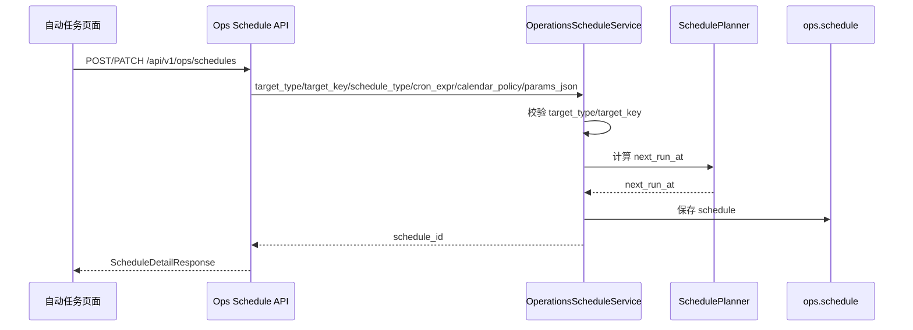
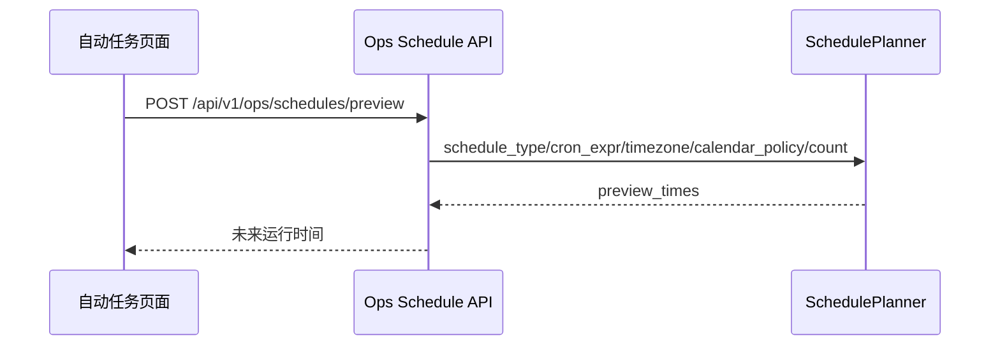
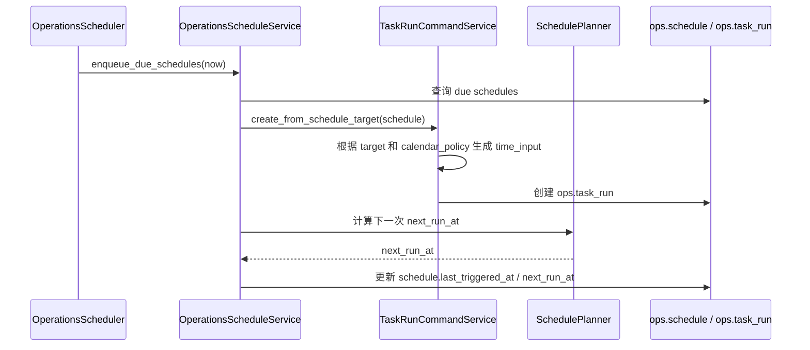

# Ops 自动任务日期策略方案 v1

状态：第一期已落地  
最后更新：2026-05-03  
适用范围：`ops.schedule` 自动任务，不适用于手动任务、日期完整性自动审计、业务数据写入事务。

---

## 1. 背景

当前自动任务配置已经有 `calendar_policy` 字段，但它只被保存和返回，没有参与真实调度语义：

1. 不参与自动任务预览。
2. 不参与 `next_run_at` 计算。
3. 不参与 scheduler 到点后计算下一次运行时间。
4. 不参与自动任务创建 `TaskRun.time_input`。

前端当前按周期执行时，月周期只提供“每月几号”输入，并且前端限制为 `1~28`。这个设计能避免二月没有 29/30/31 的问题，但无法表达“每月最后一天”。

对 `stk_period_bar_month`、`stk_period_bar_adj_month` 这类数据集来说，源接口要求自然月最后一天作为日期锚点。让用户手填 `28`、`30` 或 `31` 都不对，系统必须理解“每月最后一天”这个调度语义。

---

## 2. 目标

建立长期可扩展的自动任务日期策略模型：

1. `schedule_type` 继续表达任务是单次还是周期。
2. `cron_expr` 继续表达普通 cron 调度，或作为基础执行时间载体。
3. `calendar_policy` 正式表达“日历日期如何选取”的业务语义。
4. scheduler、preview、TaskRun 创建必须共同消费同一个 `calendar_policy`，避免前端私自拼装事实。
5. 策略必须与 `DatasetDefinition.date_model` 对齐，不能靠数据集 key 特判。

---

## 3. 非目标

本方案不做以下事情：

1. 不改变 `DatasetDefinition` 的结构。
2. 不改变业务数据表。
3. 不改变手动任务日期选择逻辑。
4. 不引入 cron `L`、`LW`、`5L` 等扩展语法。
5. 不把日期策略写成前端私有规则。
6. 不让 scheduler 状态写入影响业务数据表读写与事务提交。
7. 不复用日期完整性审计的独立 schedule 模型；该系统仍按独立审计设计运行。

---

## 4. 长期模型

### 4.1 字段职责

| 字段 | 职责 | 示例 |
| --- | --- | --- |
| `schedule_type` | 调度类型 | `once` / `cron` |
| `cron_expr` | 普通 cron 表达式，或保存执行时分 | `0 19 * * *` |
| `timezone` | 调度时区 | `Asia/Shanghai` |
| `calendar_policy` | 日期选择策略 | `monthly_last_day` |
| `params_json` | 目标任务参数；允许保存用户显式固定的 `time_input` | `{"time_input":{"mode":"point"}}` |

原则：

1. 如果 `calendar_policy` 为空，沿用普通 cron 语义。
2. 如果 `calendar_policy` 不为空，后端必须按策略统一计算 preview、`next_run_at` 和自动生成的 `time_input`。
3. `calendar_policy` 不应与前端页面状态绑定；它是后端 API 契约的一部分。

### 4.2 策略枚举

| 策略 | 状态 | 含义 | 适配日期模型 |
| --- | --- | --- | --- |
| `monthly_last_day` | 第一期实现 | 每个自然月最后一天，在指定时间触发 | `natural_day + month_last_calendar_day` |
| `monthly_window_current_month` | 第二期已落地 | 每个自然月最后一天触发，维护本次计划触发时间所属自然月窗口 | `month_window + month_window_has_data` |
| `monthly_last_trading_day` | 后续待做 | 每月最后一个开市交易日触发 | `trade_open_day + month_last_open_day` |
| `fixed_day_of_month` | 后续待做 | 每月固定日号触发 | 普通固定日号自动任务 |
| `weekly_friday` | 后续待做 | 每周自然周五触发 | `natural_day + week_friday` |
| `weekly_last_trading_day` | 后续待做 | 每周最后一个开市交易日触发 | `trade_open_day + week_last_open_day` |

说明：

1. 第一期只实现 `monthly_last_day`。
2. 第二期已实现 `monthly_window_current_month`，用于 `index_weight` 这类自然月窗口数据集。
3. 后续新增策略必须继续沿 `calendar_policy` 扩展。
4. 不允许回到“前端把特殊日期换算成固定 cron”的做法。

### 4.3 与 DatasetDefinition 的关系

`DatasetDefinition.date_model` 是数据集业务日期事实源。自动任务日期策略只负责调度和默认业务日期生成，不能覆盖数据集定义。

关系如下：

| date model | 推荐策略 | 说明 |
| --- | --- | --- |
| `natural_day + month_last_calendar_day` | `monthly_last_day` | 自然月最后一天 |
| `trade_open_day + month_last_open_day` | `monthly_last_trading_day` | 每月最后一个开市交易日 |
| `month_key + every_natural_month` | 待单独设计 | 应生成月份键，不应直接传 `trade_date` |
| `month_window + month_window_has_data` | `monthly_window_current_month` | 应生成自然月首尾窗口，不应传单点日期 |

---

## 5. 当前按月相关数据集影响面

当前 `schedule_enabled=True` 且日期模型带月语义的数据集如下：

| 数据集 | 中文名 | 日期模型 | 本方案影响 |
| --- | --- | --- | --- |
| `stk_period_bar_month` | 股票月线行情 | `natural_day + month_last_calendar_day` | 第一期直接支持 |
| `stk_period_bar_adj_month` | 股票月线行情（复权） | `natural_day + month_last_calendar_day` | 第一期直接支持 |
| `index_monthly` | 指数月线 | `trade_open_day + month_last_open_day` | 第一期不改，后续用 `monthly_last_trading_day` |
| `broker_recommend` | 券商月度金股推荐 | `month_key + every_natural_month` | 第一期不改，后续设计月份键策略 |
| `index_weight` | 指数成分权重 | `month_window + month_window_has_data` | 第二期直接支持 |

第一期只允许自动推荐 `monthly_last_day` 给 `bucket_rule=month_last_calendar_day` 的数据集。

---

## 6. 长期读写时序

### 6.1 创建或更新自动任务



### 6.2 预览自动任务



### 6.3 到点触发并创建 TaskRun



---

## 7. 第一期：`calendar_policy=monthly_last_day`

### 7.1 第一期目标

只实现一个最小闭环：

```text
calendar_policy = monthly_last_day
```

只自动推荐给：

```text
DatasetDefinition.date_model.bucket_rule = month_last_calendar_day
```

当前直接覆盖：

1. `stk_period_bar_month`
2. `stk_period_bar_adj_month`

### 7.2 第一期不做

1. 不实现 `monthly_last_trading_day`。
2. 不改 `index_monthly`。
3. 不改 `broker_recommend`。
4. 不改 `index_weight`。
5. 不改手动任务。
6. 不改业务数据表。
7. 不新增 Alembic 字段；`calendar_policy` 已存在。
8. 不把 `1~31` 固定日号问题扩大成本轮目标。

### 7.3 API 契约

创建或更新自动任务时允许：

```json
{
  "schedule_type": "cron",
  "cron_expr": "0 19 * * *",
  "timezone": "Asia/Shanghai",
  "calendar_policy": "monthly_last_day",
  "params_json": {
    "time_input": {
      "mode": "point"
    }
  }
}
```

语义：

1. `cron_expr` 中只取执行时分。
2. 实际运行日期由 `calendar_policy=monthly_last_day` 决定。
3. preview 和 scheduler 都必须返回自然月最后一天对应的执行时间。
4. 自动创建 TaskRun 时，如果用户没有显式固定 `trade_date`，后端生成当月自然月最后一天。

示例：

```json
{
  "time_input": {
    "mode": "point",
    "trade_date": "2026-05-31"
  }
}
```

### 7.4 前端交互

当用户选择 `bucket_rule=month_last_calendar_day` 的数据集，并选择“按周期执行 / 每月”时：

1. 默认选择“每月最后一天”。
2. 不再要求用户填写 `1~28`。
3. 页面应显示为“每月最后一天 19:00”。
4. 保存时提交 `calendar_policy=monthly_last_day`。
5. 预览区域展示未来若干次自然月末运行时间。

页面不应该让用户理解 cron，也不应该把 `monthly_last_day` 暴露为主文案。

### 7.5 后端计算规则

`monthly_last_day` 的 `next_run_at` 计算：

1. 使用 schedule 的 `timezone` 计算本地时间。
2. 从 `after` 之后寻找第一个自然月最后一天。
3. 使用 `cron_expr` 中的小时和分钟作为执行时间。
4. 若本月自然月最后一天的执行时间已经过去，则使用下个月自然月最后一天。
5. 返回 UTC 时间入库。

示例：

| after | timezone | cron_expr | next_run_at 本地语义 |
| --- | --- | --- | --- |
| `2026-04-20 10:00` | `Asia/Shanghai` | `0 19 * * *` | `2026-04-30 19:00` |
| `2026-04-30 20:00` | `Asia/Shanghai` | `0 19 * * *` | `2026-05-31 19:00` |
| `2026-02-01 00:00` | `Asia/Shanghai` | `0 19 * * *` | `2026-02-28 19:00` |

### 7.6 TaskRun 日期生成规则

自动任务触发时，若满足以下条件：

1. `schedule.calendar_policy == "monthly_last_day"`
2. 目标是 `dataset_action`
3. 目标数据集 `date_model.bucket_rule == "month_last_calendar_day"`
4. `params_json` 没有显式指定 `trade_date` 或完整 `time_input.trade_date`

则创建 TaskRun 时生成：

```json
{
  "mode": "point",
  "trade_date": "<本次触发所属自然月最后一天>"
}
```

如果用户显式指定了固定 `trade_date`，后端应拒绝与 `monthly_last_day` 混用，避免一条自动任务同时有两套日期事实。

---

## 8. 第一期建议改动点

后端：

1. `src/ops/services/schedule_planner.py`
   - 支持 `calendar_policy` 参数。
   - 实现 `monthly_last_day` 的 preview 与 next run 计算。
2. `src/ops/services/operations_schedule_service.py`
   - 创建、更新、恢复、到点续算时传入 `calendar_policy`。
   - 保存前校验 `monthly_last_day` 只用于可支持的目标。
3. `src/ops/services/task_run_service.py`
   - 自动任务创建 TaskRun 时读取 schedule 上下文。
   - 为 `month_last_calendar_day` 数据集生成 `time_input.trade_date`。
4. `src/ops/api/schedules.py` 与 `src/ops/schemas/schedule.py`
   - preview request/response 支持 `calendar_policy`。
5. 测试
   - schedule planner 单测。
   - schedule API preview 测试。
   - scheduler 触发后 TaskRun time_input 测试。

前端：

1. `frontend/src/pages/ops-v21-task-auto-tab.tsx`
   - 月周期 UI 增加“每月最后一天”选择。
   - 对 `month_last_calendar_day` 数据集默认带出该选择。
   - 保存时提交 `calendar_policy=monthly_last_day`。
   - 显示文案从“每月 N 日”扩展为“每月最后一天”。
2. `frontend/src/shared/api/types.ts`
   - 如需要，补充 preview request 类型中的 `calendar_policy`。
3. 测试
   - 自动任务表单默认策略。
   - 保存 payload。
   - 策略显示文案。

文档：

1. 更新 `docs/ops/ops-api-reference-v1.md` 中 schedule preview 和 schema 字段说明。
2. 当前文档状态从“待评审”更新为“已部分落地”。

---

## 9. 验收标准

第一期完成后，必须满足：

1. 为 `stk_period_bar_month` 新建自动任务时，页面默认推荐“每月最后一天”。
2. 保存后的 schedule 有 `calendar_policy=monthly_last_day`。
3. preview 能返回自然月最后一天的未来运行时间。
4. scheduler 到点触发后创建的 TaskRun 包含自然月末 `trade_date`。
5. `stk_period_bar_month`、`stk_period_bar_adj_month` 可自动生成正确月末任务。
6. 普通 cron 自动任务不受影响。
7. `index_monthly` 不被错误套用 `monthly_last_day`。
8. 测试覆盖前端保存、后端 preview、scheduler 触发、TaskRun 日期生成。

---

## 10. 风险与处理

| 风险 | 说明 | 处理 |
| --- | --- | --- |
| `calendar_policy` 只参与 UI，不参与后端 | 会继续产生错误 TaskRun 日期 | preview、next_run_at、TaskRun 生成必须全链路接入 |
| `monthly_last_day` 被用于指数月线 | 指数月线需要最后交易日，不是自然月末 | 第一期校验只允许 `month_last_calendar_day` |
| 与显式固定 `trade_date` 混用 | 一条 schedule 出现两套日期事实 | 保存时拒绝混用 |
| 用户误解“触发日期”和“维护日期” | 自动任务配置页当前表达不够清楚 | UI 文案区分“触发时间”和“维护日期规则” |
| 只改前端不改 scheduler | 下次运行续算仍会错 | 后端 planner 是唯一事实源 |

---

## 11. 第二期：`calendar_policy=monthly_window_current_month`

### 11.1 第二期目标

第二期补齐 `index_weight` 的自动任务窗口生成能力。

`index_weight` 的源接口不是“按某一天维护”，而是建议按自然月首尾区间请求：

```json
{
  "index_code": "000300.SH",
  "start_date": "20260401",
  "end_date": "20260430"
}
```

因此第二期不能复用 `monthly_last_day`。`monthly_last_day` 生成的是单点 `trade_date`，而 `index_weight` 需要生成自然月窗口。

第二期新增策略：

```text
calendar_policy = monthly_window_current_month
```

只自动推荐给：

```text
DatasetDefinition.date_model.date_axis = month_window
DatasetDefinition.date_model.bucket_rule = month_window_has_data
DatasetDefinition.date_model.input_shape = start_end_month_window
```

当前直接覆盖：

1. `index_weight`

### 11.2 第二期不做

1. 不改变 `index_weight` 手动任务链路。手动链路已经符合接口文档，用户选择 `start_month/end_month`，后端转换为自然月首尾 `start_date/end_date`。
2. 不改变 `DatasetDefinition` 结构。
3. 不改变业务数据表。
4. 不新增 Alembic 字段；继续复用已存在的 `calendar_policy` 字段。
5. 不实现“次月第 N 天维护上月窗口”。
6. 不实现 `monthly_last_trading_day`。
7. 不实现 `month_key` 数据集策略。

### 11.3 API 契约

创建或更新自动任务时允许：

```json
{
  "schedule_type": "cron",
  "cron_expr": "0 19 * * *",
  "timezone": "Asia/Shanghai",
  "calendar_policy": "monthly_window_current_month",
  "params_json": {
    "time_input": {
      "mode": "range"
    },
    "filters": {
      "index_code": "000300.SH"
    }
  }
}
```

语义：

1. `cron_expr` 中只取执行时分。
2. preview 和 scheduler 的触发日期落在自然月最后一天。
3. 自动创建 TaskRun 时，后端根据本次计划触发时间所属自然月生成窗口。
4. 如果用户没有填写 `index_code`，保持 `index_weight` 当前执行计划语义：后端按指数池生成 units。
5. 如果用户填写 `index_code`，只维护该指数的自然月窗口。

示例：

如果本次计划触发时间是：

```text
2026-04-30 19:00 Asia/Shanghai
```

TaskRun 应生成：

```json
{
  "time_input": {
    "mode": "range",
    "start_date": "2026-04-01",
    "end_date": "2026-04-30"
  },
  "filters": {
    "index_code": "000300.SH"
  }
}
```

关键约束：

如果 scheduler 晚跑，例如实际到 `2026-05-01` 才处理 `2026-04-30 19:00` 的 due schedule，也必须根据原计划触发时间生成 `2026-04-01 ~ 2026-04-30`，不能根据实际执行时间误生成 `2026-05-01 ~ 2026-05-31`。

### 11.4 前端交互

当用户选择 `month_window + month_window_has_data + start_end_month_window` 的数据集，并选择“按周期执行 / 每月”时：

1. 默认选择“每月最后一天执行，维护当月自然月窗口”。
2. 不展示“每月几号 1~28”输入。
3. 不展示单点日期选择。
4. 保存时提交 `calendar_policy=monthly_window_current_month`。
5. 预览区域展示未来若干次自然月末触发时间。
6. 参数区仍允许填写业务筛选条件，例如 `index_code`。

页面主文案建议：

```text
每月最后一天执行，维护当月自然月窗口
```

页面不应该让用户理解 `month_window_current_month`，也不应该让用户手填自然月首尾日期。

### 11.5 后端计算规则

`monthly_window_current_month` 的 `next_run_at` 计算与 `monthly_last_day` 一致：

1. 使用 schedule 的 `timezone` 计算本地时间。
2. 从 `after` 之后寻找第一个自然月最后一天。
3. 使用 `cron_expr` 中的小时和分钟作为执行时间。
4. 若本月自然月最后一天的执行时间已经过去，则使用下个月自然月最后一天。
5. 返回 UTC 时间入库。

TaskRun 日期生成规则不同：

1. 读取本次 due schedule 的原计划触发时间。
2. 转到 schedule 的本地时区。
3. 取该本地时间所属自然月。
4. 生成该月第一天和最后一天。
5. 写入 TaskRun：

```json
{
  "mode": "range",
  "start_date": "<本次计划触发时间所属自然月第一天>",
  "end_date": "<本次计划触发时间所属自然月最后一天>"
}
```

### 11.6 混用拒绝规则

`monthly_window_current_month` 不能与用户显式固定日期或窗口混用。

后端保存 schedule 时必须拒绝以下参数：

1. `trade_date`
2. `start_date`
3. `end_date`
4. `start_month`
5. `end_month`
6. `time_input.trade_date`
7. `time_input.start_date`
8. `time_input.end_date`
9. `time_input.start_month`
10. `time_input.end_month`

允许保留：

1. `time_input.mode = "range"`
2. `filters.index_code`
3. 其他非时间筛选条件

### 11.7 第二期建议改动点

后端：

1. `src/ops/services/schedule_planner.py`
   - 将 `monthly_window_current_month` 纳入支持策略。
   - 复用自然月末触发时间计算逻辑。
2. `src/ops/services/operations_schedule_service.py`
   - 校验 `monthly_window_current_month` 只用于 `month_window + month_window_has_data + start_end_month_window`。
   - 拒绝与显式固定日期或窗口混用。
   - 创建、更新、恢复、续算全部传入该策略。
3. `src/ops/services/task_run_service.py`
   - 自动任务创建 TaskRun 时根据 due schedule 的原计划触发时间生成自然月窗口。
   - 输出 `time_input.mode=range`、`start_date`、`end_date`。
4. 测试
   - planner preview/next_run_at 测试。
   - schedule API 创建与拒绝测试。
   - scheduler 晚跑但仍生成计划月份窗口的测试。
   - `index_weight` TaskRun time_input 与 filters 测试。

前端：

1. `frontend/src/pages/ops-v21-task-auto-tab.tsx`
   - 对 `date_selection_rule=month_window` 的数据集默认带出第二期策略。
   - 每月周期显示“每月最后一天执行，维护当月自然月窗口”。
   - 保存与预览提交 `calendar_policy=monthly_window_current_month`。
2. 测试
   - 自动任务表单默认策略。
   - 保存 payload。
   - 策略显示文案。

文档：

1. 更新 `docs/ops/ops-api-reference-v1.md` 中 schedule preview 和 schema 字段说明。
2. 当前文档状态已更新为“第二期已落地”。

### 11.8 第二期验收标准

第二期完成后，必须满足：

1. 为 `index_weight` 新建自动任务时，页面默认推荐“每月最后一天执行，维护当月自然月窗口”。
2. 保存后的 schedule 有 `calendar_policy=monthly_window_current_month`。
3. preview 返回自然月最后一天的未来运行时间。
4. scheduler 到点触发后创建的 TaskRun 包含自然月窗口 `start_date/end_date`。
5. scheduler 晚跑时仍按原计划触发时间所属月份生成窗口。
6. `index_weight` 不再需要用户在自动任务里手动填写月份窗口。
7. `stk_period_bar_month`、`stk_period_bar_adj_month` 继续使用 `monthly_last_day`，不被误改。
8. `index_monthly` 不被错误套用该策略。
9. 普通 cron 自动任务不受影响。

---

## 12. 推进里程碑

| 里程碑 | 范围 | 完成标准 |
| --- | --- | --- |
| M0 | 文档评审 | 已确认本文档策略、边界、第一期范围 |
| M1 | 后端 planner | 已支持 `monthly_last_day` preview / next_run_at |
| M2 | schedule service | 已在创建、更新、恢复、续算接入 `calendar_policy` |
| M3 | TaskRun 日期生成 | 已按月末策略自动生成 `time_input.trade_date` |
| M4 | 前端表单 | 已对 `month_last_calendar_day` 数据集默认推荐“每月最后一天” |
| M5 | 测试与 API 文档 | 已补后端/前端最小测试，API 文档已更新 |
| M6 | 远程小范围验证 | 新建 `stk_period_bar_month` 自动任务并确认 preview / TaskRun 日期正确 |
| M7 | 第二期文档评审 | 已确认 `monthly_window_current_month` 语义、非目标、混用拒绝规则 |
| M8 | 第二期后端 | 已支持 `index_weight` preview / next_run_at / TaskRun 自然月窗口生成 |
| M9 | 第二期前端 | 自动任务页已对 `month_window` 数据集默认推荐自然月窗口策略 |
| M10 | 第二期测试与 API 文档 | 已补后端/前端定向测试，API 文档已更新 |
| M11 | 第二期远程小范围验证 | 新建 `index_weight` 自动任务并确认 preview / TaskRun 窗口正确 |

---

## 13. 后续扩展

第一期和第二期完成后，按实际需求再评审：

1. `monthly_last_trading_day`：用于 `index_monthly`。
2. `fixed_day_of_month`：替代当前自由输入的“每月几号”。
3. `weekly_friday`：用于自然周五锚点数据集。
4. `weekly_last_trading_day`：用于最后交易日周频数据集。
5. `month_key` 数据集自动任务策略：解决月份键生成，例如 `broker_recommend`。
6. 如业务确认需要“次月维护上月窗口”，另起策略评审，不复用 `monthly_window_current_month` 偷换语义。

后续扩展必须复用本方案的 `calendar_policy` 主线，不再新增页面私有日期策略。
