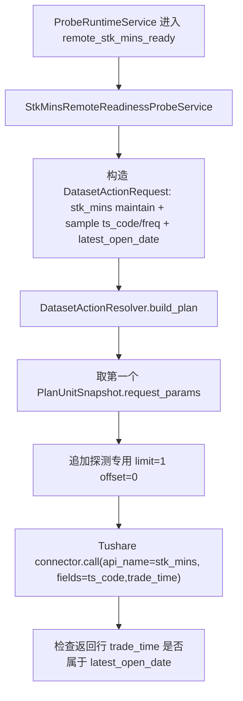

# `stk_mins` 远程源站探测触发方案 v1

状态：已实现，待生产验收  
创建时间：2026-06-05  
适用范围：`stk_mins` 自动任务探测触发、Ops Probe Runtime、自动任务页面、Probe 运行日志。

## 1. 背景

当前自动任务探测条件只有 `freshness_latest_open`。

这条条件的真实语义是：

```text
本地业务表最新业务日 == 交易日历最新开市日
```

对 `stk_mins` 来说，它看的是本地 `raw_tushare.stk_mins.trade_time` 的最大日期。它没有请求 Tushare，也不能证明源站已经有当天分钟行情。

如果运营想要的是“等 Tushare 源站分钟行情准备好，再自动发起 `stk_mins` 同步”，当前机制不适用。当前机制只能证明“本地已经有最新交易日分钟行情”，这和触发拉取的目标相反。

## 2. 目标

1. 为 `stk_mins` 新增真正的远程源站可用性探测条件。
2. 探测命中后，自动创建 `stk_mins.maintain` TaskRun。
3. 探测只做少量抽样请求，不写业务表，不刷新 freshness，不修改 `raw_tushare.stk_mins`。
4. 探测请求参数必须沿用 `DatasetDefinition -> DatasetActionResolver -> request builder` 的主链口径，Ops 不自己拼源接口参数。
5. 保持 `stk_mins` 真实维护任务仍由 ingestion 主链执行；probe 只决定“是否现在可以发起任务”。

## 3. 非目标

1. 不修改 `stk_mins` writer、DAO、表结构、事务策略。
2. 不新增业务表、状态表或 outbox 表。
3. 不把探测结果保存成新的数据集状态事实。
4. 不为其他数据集新增远程探测。
5. 不改变 `freshness_latest_open` 现有语义。
6. 不在 V1 暴露抽样股票代码 UI。
7. 不支持 workflow 内部步骤级探测；V1 只支持 `target_type=dataset_action` 且 `target_key=stk_mins.maintain`。

## 4. 当前代码核验

### 4.1 Probe 当前链路

已核验代码：

1. `src/ops/services/schedule_probe_binding_service.py`
   - `condition_kind` 当前只允许 `freshness_latest_open`。
   - 创建 `ProbeRule` 时，`on_success_action_json.request` 当前固定为 `time_input={"mode":"point"}` 和空 `filters`。
2. `src/ops/services/operations_probe_runtime_service.py`
   - `_evaluate_rule()` 当前只支持 `freshness_latest_open`。
   - 判断前会调用 `DatasetStatusSnapshotService.refresh_resources()`。
   - 再调用 `OpsFreshnessQueryService.build_live_items()`。
   - 最终比较 `item.latest_business_date == latest_open`。
3. `src/ops/runtime/scheduler.py`
   - 每轮 tick 先处理普通 schedule，再处理 probe runtime。
4. `src/ops/schemas/schedule.py`
   - `ScheduleProbeConfig.condition_kind` 默认是 `freshness_latest_open`。
5. `frontend/src/pages/ops-v21-task-auto-tab.tsx`
   - 自动任务页面的探测条件下拉框当前只有“最新业务日命中最新交易日”。

### 4.2 `stk_mins` 当前数据集事实

已核验代码与文档：

1. 源接口文档：`docs/sources/tushare/股票数据/行情数据/0370_股票历史分钟行情.md`
   - API：`stk_mins`
   - 必填：`ts_code`、`freq`
   - 可选：`start_date`、`end_date`、`limit`、`offset`
   - 单次最大 8000 行。
2. `src/foundation/datasets/definitions/market_equity.py`
   - `stk_mins` 的 `source.api_name="stk_mins"`。
   - `request_builder_key="_stk_mins_params"`。
   - `date_model.observed_field="trade_time"`。
   - `planning.unit_builder_key="build_stk_mins_units"`。
   - `planning.page_limit=8000`。
   - `planning.fetch_concurrency=2`。
3. `src/foundation/ingestion/unit_planner.py`
   - 单日输入会展开为 `trade_date 09:00:00 ~ trade_date 19:00:00`。
   - unit 维度是 `ts_code + freq + datetime window`。
4. `src/foundation/ingestion/request_builders.py`
   - `_stk_mins_params()` 最终生成 `ts_code/freq/start_date/end_date`。
5. `src/foundation/clients/tushare_client.py`
   - `stk_mins` 当前限速为 500 次/分钟。

## 5. 新增探测条件

新增 `condition_kind`：

```text
remote_stk_mins_ready
```

中文展示：

```text
源站已有分钟行情
```

语义：

```text
在当前探测时刻，针对最新开市交易日，用少量代表股票和目标频率请求 Tushare stk_mins。
如果源站返回目标交易日窗口内的分钟行情行，则认为源站已准备好，可以发起正式 stk_mins 维护任务。
```

它与 `freshness_latest_open` 的区别：

| 条件 | 看哪里 | 证明什么 | 适用场景 |
| --- | --- | --- | --- |
| `freshness_latest_open` | 本地业务表 | 本地数据已经到最新交易日 | 下游任务触发、状态确认 |
| `remote_stk_mins_ready` | Tushare 源站 | 源站已经可以返回最新交易日分钟行情 | `stk_mins` 拉取前置触发 |

## 6. 探测目标日期

探测日期不使用自然日直接拼接。

规则：

1. 用北京时间当前日期作为业务日。
2. 通过交易日历取 `latest_open_date`。
3. 如果当天不是交易日，则取最近一个开市交易日。
4. 源站探测窗口固定为：

```text
latest_open_date 09:00:00 ~ latest_open_date 19:00:00
```

命中后创建 TaskRun 时，必须显式传入：

```json
{
  "time_input": {
    "mode": "point",
    "trade_date": "<latest_open_date>"
  }
}
```

这样可以保证：

1. probe 判断的是哪一天，正式同步就拉哪一天。
2. TaskRun 不依赖“默认日期猜测”。
3. Ops 仍只表达任务意图；源接口 `start_date/end_date` 仍由 resolver/request builder 生成。

## 7. 抽样策略与请求量

### 7.1 股票代码

V1 不暴露抽样股票 UI。

后端固定内置一组代表股票代码，执行前再用本地证券服务表过滤，只保留当前 `source='tushare'` 且 `list_status='L'` 的股票。

建议候选：

```text
600000.SH
000001.SZ
300750.SZ
601318.SH
000858.SZ
```

如果自动任务显式配置了 `filters.ts_code`，则优先从显式代码里取最多 3 个作为探测样本，不使用默认候选。

原因：

1. 显式代码任务应验证它自己的目标代码。
2. 未指定 `ts_code` 的批量任务只需要证明源站整体已开始返回当天分钟行情。
3. 不扫描完整股票池，不增加大量探测请求。

### 7.2 频率

探测频率来自自动任务 `params_json.filters.freq`。

规则：

1. `stk_mins` 自动任务使用 `remote_stk_mins_ready` 时，必须配置 `freq`。
2. 如果配置了多个频率，需要逐个频率探测。
3. 每个频率只要求至少一个样本股票返回目标日期窗口内数据。
4. 所有目标频率都满足后，才算命中。

原因：

1. 正式任务会按频率扇出，探测必须覆盖正式任务的频率意图。
2. 每个频率做少量样本请求，成本可控。
3. 不需要证明每只股票都有数据；停牌、临停、无交易不能阻止批量任务。

### 7.3 请求量硬门禁

默认批量任务示例：

```text
sample_codes = 3
freq = 5 个
每轮最多请求 = 3 * 5 = 15 次
```

若探测间隔为 300 秒，最大请求压力约为：

```text
15 次 / 5 分钟
```

这远低于 `stk_mins` 当前 500 次/分钟限速。

开发前必须做小样本源站验证，确认 `limit=1/offset=0` 可以证明源站可用；未完成验证前，不进入生产部署。

## 8. 源站请求生成方式

禁止 Ops 手写如下源接口参数：

```text
ts_code/freq/start_date/end_date
```

实现应使用以下流程：



这个设计的关键点：

1. `DatasetActionResolver` 仍是日期模型和 unit 语义的唯一入口。
2. `_stk_mins_params()` 仍是源接口参数的唯一生成位置。
3. Probe 只覆盖 `limit/offset` 和最小字段，这是探测自身的请求成本控制，不改变正式同步参数。

## 9. 命中判定

单次样本请求返回后：

1. 请求成功但无行：记为 miss。
2. 请求成功且有行，但所有 `trade_time` 都不属于 `latest_open_date`：记为 miss，并在 payload 记录异常样本。
3. 请求成功且至少一行 `trade_time` 属于 `latest_open_date`：该 `freq` 命中。
4. 请求报错：本轮 probe status 记为 failed，不创建 TaskRun。
5. 所有目标 `freq` 都命中：整个 probe 命中。

命中后：

1. 创建一个 `stk_mins.maintain` TaskRun。
2. `trigger_source="probe"`。
3. `time_input.trade_date=latest_open_date`。
4. `filters` 继承自动任务 `params_json.filters`，必须包含 `freq`。
5. `request_payload.run_scope="probe_triggered"`。

## 10. 自动任务配置规则

### 10.1 允许范围

V1 只允许：

```text
target_type = dataset_action
target_key = stk_mins.maintain
trigger_mode in probe / schedule_probe_fallback
condition_kind = remote_stk_mins_ready
```

不允许：

1. 绑定 workflow。
2. 绑定非 `stk_mins` 数据集。
3. 缺少 `freq`。
4. 与固定 `trade_date` 混用。
5. 与 `calendar_policy` 混用。

### 10.2 推荐配置

```json
{
  "target_type": "dataset_action",
  "target_key": "stk_mins.maintain",
  "display_name": "股票分钟行情源站就绪后同步",
  "schedule_type": "cron",
  "trigger_mode": "probe",
  "timezone": "Asia/Shanghai",
  "probe_config": {
    "condition_kind": "remote_stk_mins_ready",
    "window_start": "15:20",
    "window_end": "18:30",
    "probe_interval_seconds": 300,
    "max_triggers_per_day": 1
  },
  "params_json": {
    "time_input": {
      "mode": "point"
    },
    "filters": {
      "freq": ["1min", "5min", "15min", "30min", "60min"]
    }
  }
}
```

说明：

1. `time_input` 不填写固定 `trade_date`。
2. probe 命中时由后端写入 `latest_open_date`。
3. `freq` 是正式同步任务参数，也是探测频率来源。

## 11. 页面设计

自动任务页最小改动：

1. 当维护对象是 `stk_mins` 时，探测条件下拉框增加：

```text
源站已有分钟行情
```

2. 当选择该条件时，页面提示：

```text
系统会在探测窗口内用少量代表股票请求 Tushare 分钟行情；源站返回目标交易日分钟行情后，再自动发起正式同步任务。
```

3. 页面不展示抽样股票配置。
4. 详情页探测配置展示 condition label，不展示内部样本代码。
5. Probe run log 详情可以展示 payload，用于排查：
   - `latest_open_date`
   - `checked_freqs`
   - `matched_freqs`
   - `sample_request_count`
   - `source_error`

## 12. 数据库与状态

不新增表。

复用：

1. `ops.schedule.probe_config_json`
2. `ops.probe_rule.probe_condition_json`
3. `ops.probe_rule.on_success_action_json`
4. `ops.probe_run_log.payload_json`

新增 JSON 示例：

```json
{
  "type": "remote_stk_mins_ready"
}
```

Probe log payload 示例：

```json
{
  "dataset_key": "stk_mins",
  "condition_type": "remote_stk_mins_ready",
  "latest_open_date": "2026-06-05",
  "checked_freqs": ["1min", "5min"],
  "matched_freqs": ["1min", "5min"],
  "sample_request_count": 4,
  "sample_codes": ["600000.SH", "000001.SZ"],
  "message": "源站已返回目标交易日分钟行情"
}
```

## 13. 文件改动计划

### M1 后端 probe 条件扩展

目标文件：

1. `src/ops/services/schedule_probe_binding_service.py`
2. `src/ops/services/operations_probe_runtime_service.py`
3. `src/ops/schemas/schedule.py`

改动：

1. 支持 `remote_stk_mins_ready`。
2. 创建 probe rule 时校验只允许 `stk_mins.maintain`。
3. 创建 probe rule 时必须从 `schedule.params_json` 继承 `filters.freq`。
4. 命中创建 TaskRun 时写入 `latest_open_date`。

### M2 新增远程探测服务

目标文件：

```text
src/ops/services/stk_mins_remote_probe_service.py
```

职责：

1. 解析目标交易日。
2. 解析探测样本代码。
3. 解析目标频率。
4. 调用 `DatasetActionResolver` 生成 sample unit。
5. 用 Tushare connector 做 `limit=1/offset=0` 探测请求。
6. 返回结构化结果，不写业务表。

### M3 前端自动任务页面

目标文件：

```text
frontend/src/pages/ops-v21-task-auto-tab.tsx
```

改动：

1. 只在 `stk_mins.maintain` 下展示新探测条件。
2. 增加解释文案。
3. 保存时继续写 `probe_config.condition_kind`。

### M4 API 文档更新

目标文件：

1. `docs/ops/ops-api-reference-v1.md`
2. 本文档

改动：

1. `ScheduleProbeConfig.condition_kind` 增加 `remote_stk_mins_ready`。
2. 示例增加 `stk_mins` 源站就绪探测自动任务。

## 14. 测试计划

### 后端单测

1. `ScheduleProbeBindingService`
   - `remote_stk_mins_ready` 只允许 `stk_mins.maintain`。
   - 非 `stk_mins` 数据集创建失败。
   - workflow 创建失败。
   - 缺少 `freq` 创建失败。
   - 固定 `trade_date` 创建失败。
2. `ProbeRuntimeService`
   - 源站返回目标日期行时创建 TaskRun。
   - 源站无行时不创建 TaskRun。
   - 源站返回非目标日期行时不创建 TaskRun。
   - 源站报错时记录 probe run failed，不创建 TaskRun。
   - 命中 TaskRun 的 `time_input.trade_date` 等于 `latest_open_date`。
   - 命中 TaskRun 的 `filters.freq` 继承 schedule params。
3. `StkMinsRemoteReadinessProbeService`
   - 探测请求使用 resolver 生成的 `start_date/end_date`。
   - 探测只追加 `limit=1/offset=0`。
   - 多频率必须全部命中。
   - 显式 `ts_code` 时优先使用显式代码样本。

### 前端测试

1. `stk_mins.maintain` 可选择“源站已有分钟行情”。
2. 非 `stk_mins` 动作不展示该选项。
3. 保存 payload 正确写入 `probe_config.condition_kind="remote_stk_mins_ready"`。

### 真实源站验证门禁

开发前必须用 `tushareMcp` 验证：

1. `stk_mins(ts_code=600000.SH, freq=1min, start_date=<latest_open> 09:00:00, end_date=<latest_open> 19:00:00, limit=1, offset=0)` 能在源站就绪后返回样本行。
2. 未就绪时返回空结果或可识别错误。
3. `fields=ts_code,trade_time` 是否可用。
4. 多个频率的返回时机是否一致；如不一致，以“所有目标频率命中”作为 V1 安全口径。

## 15. 风险与处理

| 风险 | 处理 |
| --- | --- |
| 样本股票当天停牌导致误判 miss | 默认使用多只高流动性股票；未指定 `ts_code` 的批量任务只要求每个频率任一样本命中。 |
| 源站返回旧数据或忽略窗口 | 必须校验 `trade_time` 日期等于 `latest_open_date`。 |
| 探测请求消耗配额 | 每轮请求量很小，并共享现有 Tushare rate limiter。 |
| 探测命中后正式任务仍失败 | Probe 只证明源站可返回样本，不保证每只股票都可返回；正式任务失败仍按 TaskRun 问题诊断处理。 |
| schedule 参数没带到 TaskRun | 本方案要求 `remote_stk_mins_ready` 必须继承 `schedule.params_json.filters`，并由 probe runtime 写入 `trade_date`。 |

## 16. Milestones

| 阶段 | 目标 | 退出标准 |
| --- | --- | --- |
| M0 | 源站实测 | `tushareMcp` 已验证 sample 请求、fields、未就绪/就绪行为 |
| M1 | 后端契约 | API/schema/service 支持 `remote_stk_mins_ready`，非法绑定全部失败 |
| M2 | 远程探测服务 | 可用 fake connector 单测证明命中/未命中/错误路径 |
| M3 | TaskRun 触发 | 命中后 TaskRun 日期和 filters 正确 |
| M4 | 前端配置 | 只有 `stk_mins` 可选新条件，保存 payload 正确 |
| M5 | 文档与回归 | API 文档更新，测试和 docs integrity 通过 |

## 17. 待评审点

当前方案无需新增数据库表，也不需要新增环境变量。

已确认并落地的拍板点：

1. V1 默认样本股票候选使用：

```text
600000.SH
000001.SZ
300750.SZ
601318.SH
000858.SZ
```

2. 后端固定候选，不做 UI 配置。
3. 探测条件只对 `stk_mins.maintain` 开放，不支持 workflow。

## 18. 实现结果

已落地文件：

1. `src/ops/services/stk_mins_remote_probe_service.py`
   - 新增 `StkMinsRemoteReadinessProbeService`。
   - 通过交易日历取 `latest_open_date`。
   - 通过 `DatasetActionResolver` 生成 sample unit。
   - 源站探测只追加 `limit=1/offset=0` 与 `fields=ts_code,trade_time`。
2. `src/ops/services/schedule_probe_binding_service.py`
   - 新增 `remote_stk_mins_ready` 绑定校验。
   - 只允许 `target_type=dataset_action` 且 `target_key=stk_mins.maintain`。
   - 校验 `freq` 必填、禁止固定 `trade_date`、禁止 `calendar_policy` 混用。
3. `src/ops/services/operations_probe_runtime_service.py`
   - 运行时支持 `remote_stk_mins_ready`。
   - 探测命中后，用 payload 中的 `latest_open_date` 创建正式 `stk_mins.maintain` TaskRun。
4. `src/ops/services/probe_service.py`
   - 直接 Probe API 创建/更新规则时，同样禁止把 `remote_stk_mins_ready` 绑定到非 `stk_mins.maintain`。
   - 校验 `freq` 必填、禁止固定 `trade_date`。
5. `frontend/src/pages/ops-v21-task-auto-tab.tsx`
   - 仅 `stk_mins.maintain` 自动任务展示“源站已有分钟行情”。
   - 详情页展示探测条件中文名。
6. 测试
   - 覆盖默认样本过滤、resolver 参数生成、多频率全部命中、TaskRun 创建、非法 schedule 绑定、前端条件函数。

真实源站验证结果：

1. `2026-05-29`，`600000.SH`，`freq=1min`，`fields=ts_code,trade_time`，`limit=1/offset=0` 能返回目标日期样本。
2. `2026-06-05` 同样请求返回空数组，符合“源站未就绪时 miss”的判定基础。
3. `2026-05-29` 的 `1min/5min/15min/30min/60min` 小样本均可返回目标日期样本。
